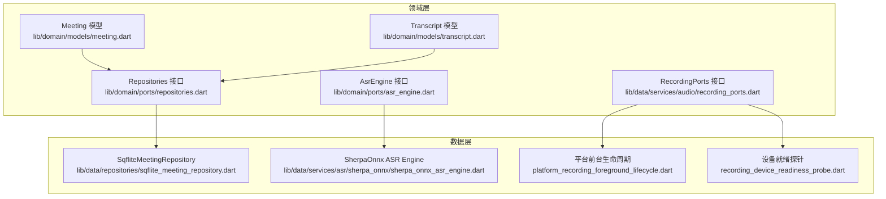
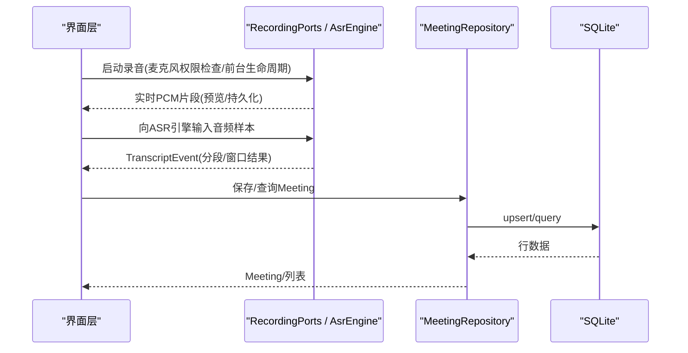
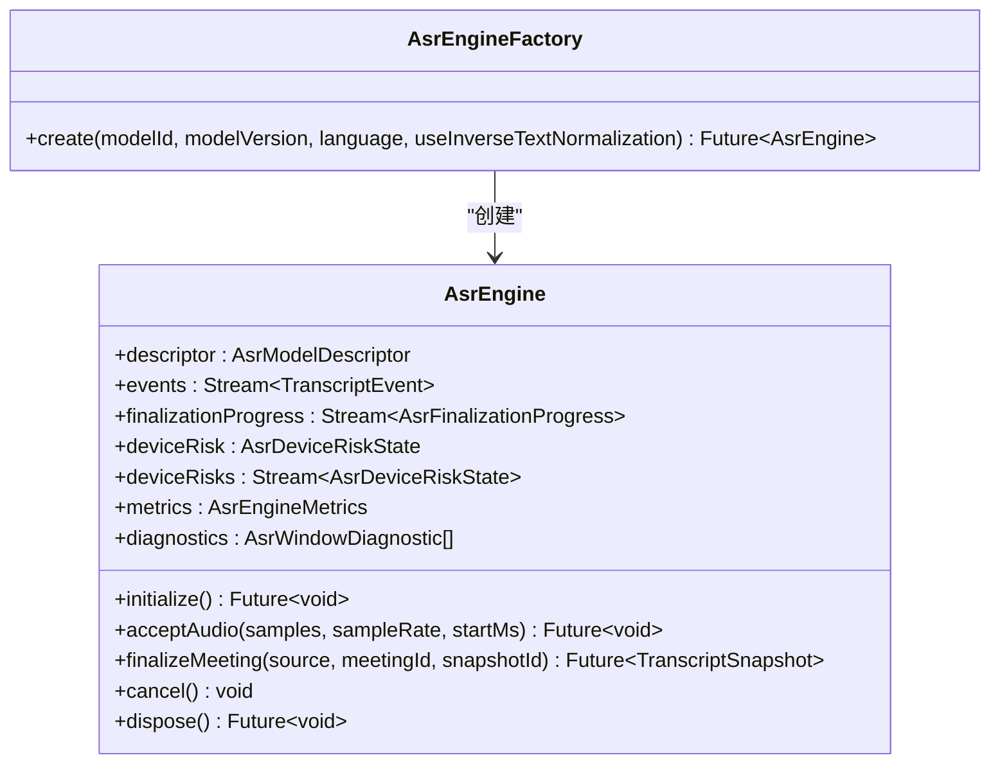
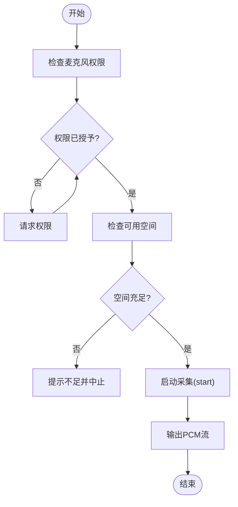
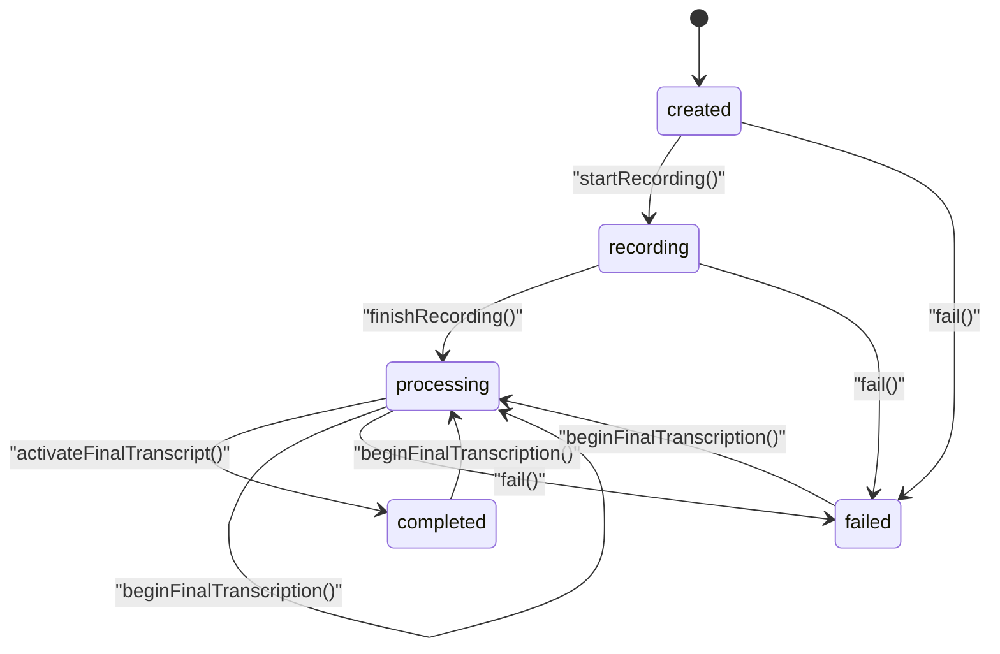
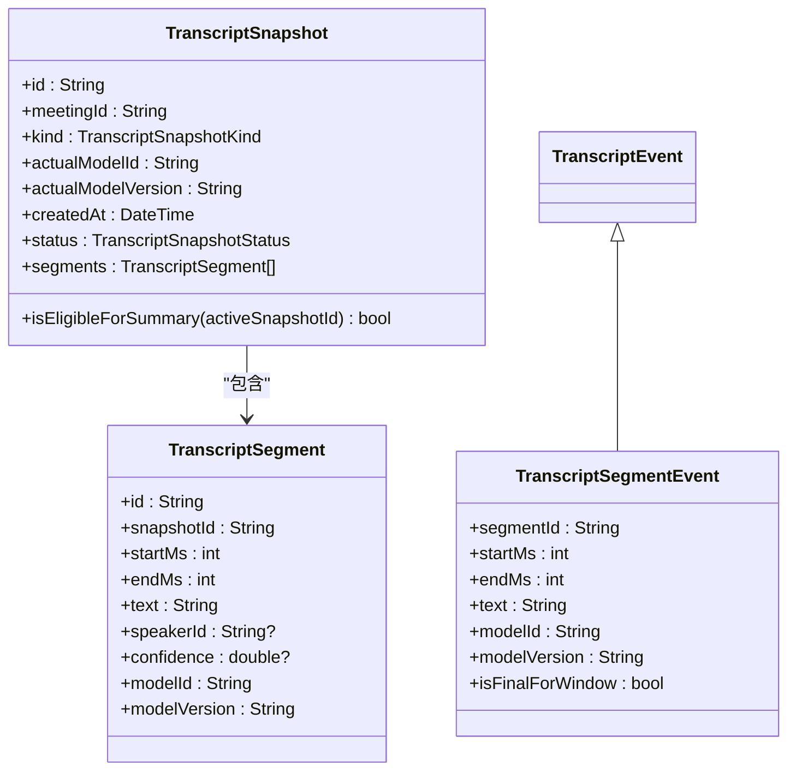
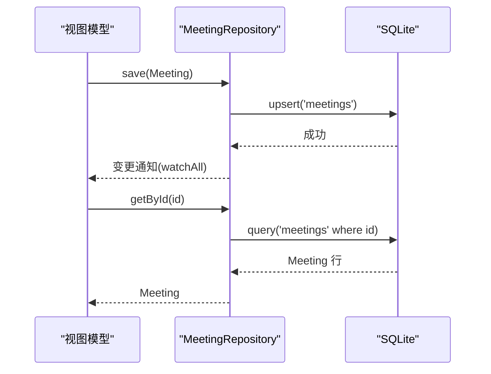
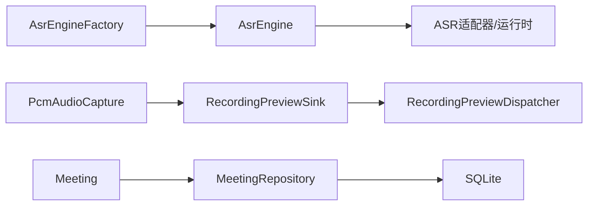

# API 参考

<cite>
**本文引用的文件**   
- [lib/domain/ports/asr_engine.dart](file://lib/domain/ports/asr_engine.dart)
- [lib/data/services/audio/recording_ports.dart](file://lib/data/services/audio/recording_ports.dart)
- [lib/domain/models/meeting.dart](file://lib/domain/models/meeting.dart)
- [lib/domain/models/transcript.dart](file://lib/domain/models/transcript.dart)
- [lib/domain/ports/repositories.dart](file://lib/domain/ports/repositories.dart)
- [lib/data/repositories/sqflite_meeting_repository.dart](file://lib/data/repositories/sqflite_meeting_repository.dart)
- [lib/data/services/audio/platform_recording_foreground_lifecycle.dart](file://lib/data/services/audio/platform_recording_foreground_lifecycle.dart)
- [lib/data/services/audio/recording_device_readiness_probe.dart](file://lib/data/services/audio/recording_device_readiness_probe.dart)
- [lib/data/services/asr/sherpa_onnx/sherpa_onnx_asr_engine.dart](file://lib/data/services/asr/sherpa_onnx/sherpa_onnx_asr_engine.dart)
</cite>

## 目录
1. [简介](#简介)
2. [项目结构](#项目结构)
3. [核心组件](#核心组件)
4. [架构总览](#架构总览)
5. [详细组件分析](#详细组件分析)
6. [依赖关系分析](#依赖关系分析)
7. [性能考量](#性能考量)
8. [故障排除指南](#故障排除指南)
9. [结论](#结论)
10. [附录：接口契约与版本兼容](#附录接口契约与版本兼容)

## 简介
本 API 参考面向会迹项目的公共接口与数据模型，重点覆盖以下能力：
- AsrEngine 接口的语音识别方法、事件流、指标与诊断
- RecordingPorts 接口的音频录制、前台生命周期、预览分发与设备预检
- Meeting 模型的数据结构、状态机方法与约束校验
- 相关仓库接口（MeetingRepository、TranscriptRepository 等）的契约说明
- 错误码与异常类型、使用示例与最佳实践、兼容性策略与迁移建议

## 项目结构
本项目采用领域驱动的分层组织方式：
- domain/ports：领域端口（接口），定义 AsrEngine、RecordingPorts、Repositories 等契约
- domain/models：领域模型，如 Meeting、Transcript 及其枚举与事件
- data/services：具体服务实现（录音、ASR、存储等）
- data/repositories：仓储实现（SQLite 等）
- ui/app：应用入口与依赖注入（不在本文范围）

图表来源 
- [lib/domain/ports/asr_engine.dart:133-174](file://lib/domain/ports/asr_engine.dart#L133-L174)
- [lib/data/services/audio/recording_ports.dart:7-31](file://lib/data/services/audio/recording_ports.dart#L7-L31)
- [lib/domain/models/meeting.dart:8-71](file://lib/domain/models/meeting.dart#L8-L71)
- [lib/domain/models/transcript.dart:1-133](file://lib/domain/models/transcript.dart#L1-L133)
- [lib/domain/ports/repositories.dart:8-16](file://lib/domain/ports/repositories.dart#L8-L16)
- [lib/data/repositories/sqflite_meeting_repository.dart:8-47](file://lib/data/repositories/sqflite_meeting_repository.dart#L8-L47)
- [lib/data/services/asr/sherpa_onnx/sherpa_onnx_asr_engine.dart:35-68](file://lib/data/services/asr/sherpa_onnx/sherpa_onnx_asr_engine.dart#L35-L68)
- [lib/data/services/audio/platform_recording_foreground_lifecycle.dart:6-19](file://lib/data/services/audio/platform_recording_foreground_lifecycle.dart#L6-L19)
- [lib/data/services/audio/recording_device_readiness_probe.dart:6-34](file://lib/data/services/audio/recording_device_readiness_probe.dart#L6-L34)

章节来源
- [lib/domain/ports/asr_engine.dart:1-174](file://lib/domain/ports/asr_engine.dart#L1-L174)
- [lib/data/services/audio/recording_ports.dart:1-147](file://lib/data/services/audio/recording_ports.dart#L1-L147)
- [lib/domain/models/meeting.dart:1-233](file://lib/domain/models/meeting.dart#L1-L233)
- [lib/domain/models/transcript.dart:1-133](file://lib/domain/models/transcript.dart#L1-L133)
- [lib/domain/ports/repositories.dart:1-105](file://lib/domain/ports/repositories.dart#L1-L105)

## 核心组件
本节概述三大核心接口与模型：
- AsrEngine：语音识别引擎抽象，提供初始化、音频输入、最终化、事件与指标
- RecordingPorts：音频采集与录制生命周期、预览分发、设备能力探测
- Meeting：会议实体与状态机方法，包含字段约束与不变式校验

章节来源
- [lib/domain/ports/asr_engine.dart:133-174](file://lib/domain/ports/asr_engine.dart#L133-L174)
- [lib/data/services/audio/recording_ports.dart:7-31](file://lib/data/services/audio/recording_ports.dart#L7-L31)
- [lib/domain/models/meeting.dart:8-71](file://lib/domain/models/meeting.dart#L8-L71)

## 架构总览
下图展示从 UI 到 ASR 引擎与录音端口的调用链，以及 Meeting 仓储的读写路径。

图表来源 
- [lib/data/services/audio/recording_ports.dart:7-31](file://lib/data/services/audio/recording_ports.dart#L7-L31)
- [lib/domain/ports/asr_engine.dart:133-174](file://lib/domain/ports/asr_engine.dart#L133-L174)
- [lib/domain/ports/repositories.dart:8-16](file://lib/domain/ports/repositories.dart#L8-L16)
- [lib/data/repositories/sqflite_meeting_repository.dart:8-47](file://lib/data/repositories/sqflite_meeting_repository.dart#L8-L47)

## 详细组件分析

### AsrEngine 接口与实现要点
- 职责
  - initialize：初始化引擎资源
  - acceptAudio：接收 PCM Float32List 样本，附带采样率与时间戳
  - finalizeMeeting：基于已封存的 AudioSource 生成最终转录快照
  - events：TranscriptEvent 流（分段增量、窗口完成等）
  - finalizationProgress：最终化进度流
  - deviceRisk/deviceRisks：设备风险状态与变化流
  - metrics/diagnostics：指标与窗口诊断
  - cancel/dispose：取消与释放资源

- 关键参数与返回
  - acceptAudio(samples, sampleRate, startMs)
  - finalizeMeeting(source, meetingId, snapshotId?) → TranscriptSnapshot
  - events → Stream<TranscriptEvent>
  - finalizationProgress → Stream<AsrFinalizationProgress>
  - deviceRisk → AsrDeviceRiskState
  - deviceRisks → Stream<AsrDeviceRiskState>
  - metrics → AsrEngineMetrics
  - diagnostics → List<AsrWindowDiagnostic>

- 异常处理
  - 引擎抛出 AsrEngineException，携带 AppFailure 以统一错误码
  - 设备风险状态可阻断推理或发出警告

- 使用示例（步骤）
  - 通过工厂创建引擎实例
  - 调用 initialize
  - 订阅 events 与 finalizationProgress
  - 循环调用 acceptAudio 推送音频
  - 结束前调用 finalizeMeeting 获取 TranscriptSnapshot
  - 调用 dispose 释放资源

图表来源 
- [lib/domain/ports/asr_engine.dart:133-174](file://lib/domain/ports/asr_engine.dart#L133-L174)

章节来源
- [lib/domain/ports/asr_engine.dart:8-174](file://lib/domain/ports/asr_engine.dart#L8-L174)
- [lib/data/services/asr/sherpa_onnx/sherpa_onnx_asr_engine.dart:35-68](file://lib/data/services/asr/sherpa_onnx/sherpa_onnx_asr_engine.dart#L35-L68)

### RecordingPorts 接口与实现要点
- PcmAudioCapture
  - hasPermission(request)：检查并可选请求麦克风权限
  - start()：开始采集，返回 Uint8List 流
  - pause/resume/stop：控制采集状态
  - dispose：释放资源

- RecordingForegroundLifecycle
  - start(setPaused, stop)：跨平台前台生命周期管理（Android 前台服务，iOS/Windows 无操作）

- RecordingPreviewSink 与 FanOut/Dispatcher
  - add(chunk)：消费 PCM 块
  - FanOutRecordingPreviewSink：将同一块分发给多个隔离消费者
  - RecordingPreviewDispatcher：带背压与丢弃策略的派发器

- 设备就绪探测
  - DeviceRecordingReadinessProbe.check(requestMicrophonePermission)：并行检查权限与存储空间，返回就绪信息

图表来源 
- [lib/data/services/audio/recording_device_readiness_probe.dart:6-34](file://lib/data/services/audio/recording_device_readiness_probe.dart#L6-L34)
- [lib/data/services/audio/recording_ports.dart:7-31](file://lib/data/services/audio/recording_ports.dart#L7-L31)
- [lib/data/services/audio/platform_recording_foreground_lifecycle.dart:6-19](file://lib/data/services/audio/platform_recording_foreground_lifecycle.dart#L6-L19)

章节来源
- [lib/data/services/audio/recording_ports.dart:7-147](file://lib/data/services/audio/recording_ports.dart#L7-L147)
- [lib/data/services/audio/platform_recording_foreground_lifecycle.dart:6-32](file://lib/data/services/audio/platform_recording_foreground_lifecycle.dart#L6-L32)
- [lib/data/services/audio/recording_device_readiness_probe.dart:6-34](file://lib/data/services/audio/recording_device_readiness_probe.dart#L6-L34)

### Meeting 模型与状态机
- 字段与约束
  - id/title/createdAt/startedAt/endedAt/status
  - audioPath/audioDurationMs
  - requestedModelId/recordingModelId/recordingModelVersion/recordingModelLanguage/recordingModelUseInverseTextNormalization
  - modelFallbackReason/activeTranscriptSnapshotId/activeSummaryId/lastErrorCode
  - 构造时校验：非空文本、时长非负、时间顺序、回退原因一致性

- 状态机方法
  - rename(value)：重命名
  - changeRecordingModel(...)：在 created 状态下可更改录音模型
  - startRecording(startedAt)：进入 recording
  - finishRecording(endedAt, audioPath, audioDurationMs)：进入 processing
  - fail(errorCode, endedAt?)：进入 failed
  - beginFinalTranscription()：从 processing/completed/failed 回到 processing，要求有完整事实音频
  - activateFinalTranscript(snapshot)：激活已完成且匹配的最终快照，进入 completed

图表来源 
- [lib/domain/models/meeting.dart:8-175](file://lib/domain/models/meeting.dart#L8-L175)

章节来源
- [lib/domain/models/meeting.dart:8-233](file://lib/domain/models/meeting.dart#L8-L233)

### Transcript 模型与事件
- TranscriptSegment：片段（id、snapshotId、时间区间、文本、说话人、置信度、模型标识）
- TranscriptSnapshot：快照（kind、status、segments 不可变排序、模型一致性校验）
- TranscriptEvent：事件基类；TranscriptSegmentEvent：分段事件（窗口内最终标记）

图表来源 
- [lib/domain/models/transcript.dart:1-133](file://lib/domain/models/transcript.dart#L1-L133)

章节来源
- [lib/domain/models/transcript.dart:1-133](file://lib/domain/models/transcript.dart#L1-L133)

### 仓储接口与会话流程
- MeetingRepository：getById、watchAll、save、delete
- SqfliteMeetingRepository：基于 SQLite 的 upsert/list/watch/delete

图表来源 
- [lib/domain/ports/repositories.dart:8-16](file://lib/domain/ports/repositories.dart#L8-L16)
- [lib/data/repositories/sqflite_meeting_repository.dart:8-47](file://lib/data/repositories/sqflite_meeting_repository.dart#L8-L47)

章节来源
- [lib/domain/ports/repositories.dart:8-16](file://lib/domain/ports/repositories.dart#L8-L16)
- [lib/data/repositories/sqflite_meeting_repository.dart:8-47](file://lib/data/repositories/sqflite_meeting_repository.dart#L8-L47)

## 依赖关系分析
- AsrEngine 由 AsrEngineFactory 创建，内部依赖模型描述符与适配器
- RecordingPorts 依赖平台前台生命周期与设备就绪探针
- Meeting 与仓储解耦，通过 Repository 接口进行持久化

图表来源 
- [lib/domain/ports/asr_engine.dart:167-174](file://lib/domain/ports/asr_engine.dart#L167-L174)
- [lib/data/services/audio/recording_ports.dart:86-147](file://lib/data/services/audio/recording_ports.dart#L86-L147)
- [lib/domain/ports/repositories.dart:8-16](file://lib/domain/ports/repositories.dart#L8-L16)

章节来源
- [lib/domain/ports/asr_engine.dart:167-174](file://lib/domain/ports/asr_engine.dart#L167-L174)
- [lib/data/services/audio/recording_ports.dart:86-147](file://lib/data/services/audio/recording_ports.dart#L86-L147)
- [lib/domain/ports/repositories.dart:8-16](file://lib/domain/ports/repositories.dart#L8-L16)

## 性能考量
- ASR 指标
  - realTimeFactor = 总推理耗时 / 总音频时长，用于评估实时性
  - totalWindowCount/recognized/empty/failed 统计窗口结果分布
- 设备风险
  - blocksInference：当支持度为 unsupported、内存压力 critical、热状态 critical 时阻止推理
  - hasWarning：constrained/warning/serious 时发出警告
- 录音预览
  - 使用队列与丢弃策略避免阻塞主链路
  - FanOut 多消费者隔离失败传播

章节来源
- [lib/domain/ports/asr_engine.dart:81-110](file://lib/domain/ports/asr_engine.dart#L81-L110)
- [lib/domain/ports/asr_engine.dart:23-55](file://lib/domain/ports/asr_engine.dart#L23-L55)
- [lib/data/services/audio/recording_ports.dart:86-147](file://lib/data/services/audio/recording_ports.dart#L86-L147)

## 故障排除指南
- AsrEngineException
  - 含义：引擎级异常，封装 AppFailure 错误码
  - 排查：根据 failure.code 定位错误类别（如设备不支持、内存不足、推理失败）
- 设备风险阻断
  - 现象：blocksInference 为真导致推理被阻止
  - 排查：降低并发、释放内存、冷却设备或降级模型
- 录音权限与空间
  - 现象：hasPermission 返回 false 或 freeBytes 不足
  - 排查：引导用户授权、清理存储空间
- Meeting 状态转换异常
  - 现象：InvalidStateTransitionException 或 DomainInvariantViolation
  - 排查：确保状态机合法转换、存在完整事实音频、快照与模型一致

章节来源
- [lib/domain/ports/asr_engine.dart:8-15](file://lib/domain/ports/asr_engine.dart#L8-L15)
- [lib/domain/ports/asr_engine.dart:23-55](file://lib/domain/ports/asr_engine.dart#L23-L55)
- [lib/data/services/audio/recording_device_readiness_probe.dart:6-34](file://lib/data/services/audio/recording_device_readiness_probe.dart#L6-L34)
- [lib/domain/models/meeting.dart:88-175](file://lib/domain/models/meeting.dart#L88-L175)

## 结论
本参考文档系统化梳理了会迹项目的核心 API 与数据模型，涵盖 ASR 引擎、录音端口与会务实体的契约、行为与约束。通过清晰的接口定义、状态机与错误处理机制，开发者可以可靠地集成语音识别与录音能力，并在不同设备条件下保持稳健运行。

## 附录：接口契约与版本兼容
- 向后兼容策略
  - AsrEngineFactory.create 新增可选参数（language、useInverseTextNormalization）默认值保证旧调用兼容
  - RecordingPorts 的 Noop 实现保证 iOS/Windows 下无需前台服务也能稳定运行
- 废弃接口处理
  - 若需废弃某方法，优先保留空实现或返回默认值，并通过注释标注弃用
  - 在仓储层使用迁移脚本逐步替换字段名（如 meeting_id → meetingId）
- 迁移指南
  - 对 Meeting 字段扩展采用 _copyWith 模式，避免破坏现有对象
  - 对 Transcript 快照增加新字段时，确保 segments 排序与模型一致性校验仍生效
  - 对 ASR 引擎升级时，保持 descriptor 的版本一致性校验，防止配置不匹配

章节来源
- [lib/domain/ports/asr_engine.dart:167-174](file://lib/domain/ports/asr_engine.dart#L167-L174)
- [lib/data/services/audio/recording_ports.dart:33-45](file://lib/data/services/audio/recording_ports.dart#L33-L45)
- [lib/domain/models/meeting.dart:177-225](file://lib/domain/models/meeting.dart#L177-L225)
- [lib/domain/models/transcript.dart:75-94](file://lib/domain/models/transcript.dart#L75-L94)