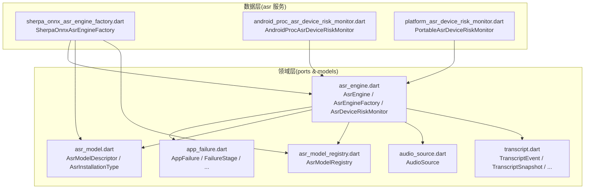
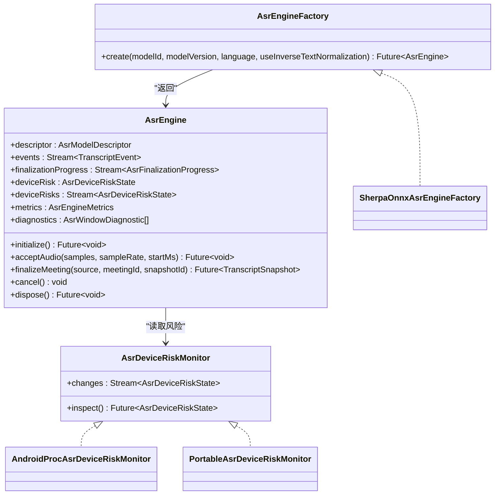
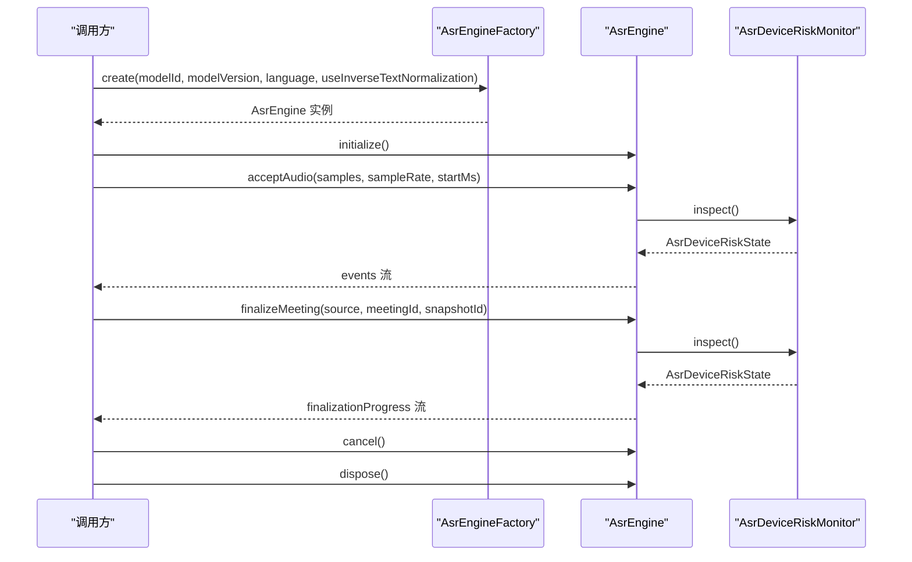

# ASR 引擎接口

<cite>
**本文引用的文件**   
- [lib/domain/ports/asr_engine.dart](file://lib/domain/ports/asr_engine.dart)
- [lib/data/services/asr/sherpa_onnx_asr_engine_factory.dart](file://lib/data/services/asr/sherpa_onnx_asr_engine_factory.dart)
- [lib/data/services/asr/android_proc_asr_device_risk_monitor.dart](file://lib/data/services/asr/android_proc_asr_device_risk_monitor.dart)
- [lib/data/services/asr/platform_asr_device_risk_monitor.dart](file://lib/data/services/asr/platform_asr_device_risk_monitor.dart)
- [lib/domain/models/asr_model.dart](file://lib/domain/models/asr_model.dart)
- [lib/domain/models/asr_model_registry.dart](file://lib/domain/models/asr_model_registry.dart)
- [lib/domain/models/audio_source.dart](file://lib/domain/models/audio_source.dart)
- [lib/domain/models/transcript.dart](file://lib/domain/models/transcript.dart)
- [lib/domain/models/app_failure.dart](file://lib/domain/models/app_failure.dart)
</cite>

## 目录
1. [简介](#简介)
2. [项目结构](#项目结构)
3. [核心组件](#核心组件)
4. [架构总览](#架构总览)
5. [详细组件分析](#详细组件分析)
6. [依赖关系分析](#依赖关系分析)
7. [性能与资源特性](#性能与资源特性)
8. [故障排查指南](#故障排查指南)
9. [结论](#结论)
10. [附录：完整使用示例与最佳实践](#附录完整使用示例与最佳实践)

## 简介
本文件为 ASR（自动语音识别）引擎接口的权威 API 文档，覆盖 AsrEngine 抽象接口、AsrEngineFactory 工厂接口、AsrDeviceRiskMonitor 设备风险监控接口以及所有相关枚举类型。文档面向开发者，提供方法语义、参数与返回值说明、错误处理策略、典型调用流程与代码级图示，帮助快速集成并正确使用 ASR 引擎实例。

## 项目结构
ASR 接口位于领域层 ports 中，具体实现与工厂位于 data/services/asr 下；模型描述、转录数据与错误模型位于 domain/models 下。整体采用“接口定义在领域层，实现与装配在数据层”的分层设计，便于替换实现与测试。

图表来源
- [lib/domain/ports/asr_engine.dart:1-175](file://lib/domain/ports/asr_engine.dart#L1-L175)
- [lib/data/services/asr/sherpa_onnx_asr_engine_factory.dart:1-120](file://lib/data/services/asr/sherpa_onnx_asr_engine_factory.dart#L1-L120)
- [lib/data/services/asr/android_proc_asr_device_risk_monitor.dart:1-150](file://lib/data/services/asr/android_proc_asr_device_risk_monitor.dart#L1-L150)
- [lib/data/services/asr/platform_asr_device_risk_monitor.dart:46-64](file://lib/data/services/asr/platform_asr_device_risk_monitor.dart#L46-L64)
- [lib/domain/models/asr_model.dart:1-54](file://lib/domain/models/asr_model.dart#L1-L54)
- [lib/domain/models/asr_model_registry.dart:1-68](file://lib/domain/models/asr_model_registry.dart#L1-L68)
- [lib/domain/models/audio_source.dart:1-26](file://lib/domain/models/audio_source.dart#L1-L26)
- [lib/domain/models/transcript.dart:1-87](file://lib/domain/models/transcript.dart#L1-L87)
- [lib/domain/models/app_failure.dart:1-49](file://lib/domain/models/app_failure.dart#L1-L49)

章节来源
- [lib/domain/ports/asr_engine.dart:1-175](file://lib/domain/ports/asr_engine.dart#L1-L175)
- [lib/data/services/asr/sherpa_onnx_asr_engine_factory.dart:1-120](file://lib/data/services/asr/sherpa_onnx_asr_engine_factory.dart#L1-L120)

## 核心组件
- AsrEngine：ASR 引擎抽象接口，定义初始化、音频输入、会议转录完成、取消、资源清理等能力，并提供事件流、进度流、设备风险、指标与诊断信息。
- AsrEngineFactory：工厂接口，用于根据已锁定的模型 ID/版本创建具体的 AsrEngine 实例。
- AsrDeviceRiskMonitor：设备风险监控接口，提供单次 inspect() 快照与 changes 流，供引擎在关键操作前检查设备状态。
- 枚举与数据结构：AsrDeviceSupport、AsrMemoryPressure、AsrThermalState、AsrWindowOutcome、AsrFinalizationPhase、AsrEngineMetrics、AsrWindowDiagnostic、AsrDeviceRiskState、TranscriptEvent/TranscriptSnapshot、AudioSource、AsrModelDescriptor、AppFailure 等。

章节来源
- [lib/domain/ports/asr_engine.dart:17-61](file://lib/domain/ports/asr_engine.dart#L17-L61)
- [lib/domain/ports/asr_engine.dart:63-131](file://lib/domain/ports/asr_engine.dart#L63-L131)
- [lib/domain/ports/asr_engine.dart:133-175](file://lib/domain/ports/asr_engine.dart#L133-L175)

## 架构总览
下图展示 AsrEngine 与其工厂、设备风险监测器之间的关系，以及关键数据流（音频样本、转录事件、最终化进度）。

图表来源
- [lib/domain/ports/asr_engine.dart:133-175](file://lib/domain/ports/asr_engine.dart#L133-L175)
- [lib/data/services/asr/sherpa_onnx_asr_engine_factory.dart:12-35](file://lib/data/services/asr/sherpa_onnx_asr_engine_factory.dart#L12-L35)
- [lib/data/services/asr/android_proc_asr_device_risk_monitor.dart:16-30](file://lib/data/services/asr/android_proc_asr_device_risk_monitor.dart#L16-L30)
- [lib/data/services/asr/platform_asr_device_risk_monitor.dart:46-64](file://lib/data/services/asr/platform_asr_device_risk_monitor.dart#L46-L64)

## 详细组件分析

### AsrEngine 接口详解
- descriptor：当前引擎使用的模型描述符，包含模型 ID、版本、支持语言、安装类型、所需字节数、能力集及默认语言与 ITN 配置。
- initialize()：异步初始化引擎内部资源（如工作线程、解码器、缓存等）。应在首次使用前调用。
- events：实时转录事件流，包含片段文本、时间戳、模型信息等。
- finalizationProgress：会议转录最终化进度流，包含阶段、已完成样本数与总样本数，可用于 UI 进度条。
- deviceRisk：当前设备风险快照，包含支持度、内存压力、热状态等。
- deviceRisks：设备风险变化流，供上层监听设备状态变化。
- metrics：运行时指标，包括窗口统计、音频时长、推理时长、实时因子等。
- diagnostics：窗口级诊断列表，记录每个窗口的起止时间、结果、耗时与错误码。
- acceptAudio(samples, sampleRate, startMs)：将 PCM 浮点样本送入引擎进行实时识别。
- finalizeMeeting(source, meetingId, snapshotId)：基于持久化的音频源生成最终转录快照。
- cancel()：取消当前正在进行的任务（如 finalizeMeeting）。
- dispose()：释放引擎占用的资源，必须在使用结束后调用。

章节来源
- [lib/domain/ports/asr_engine.dart:133-165](file://lib/domain/ports/asr_engine.dart#L133-L165)

### AsrEngineFactory.create() 方法与参数
- 参数
  - modelId：模型唯一标识，需已在 AsrModelRegistry 中注册。
  - modelVersion：模型版本号，必须与 Registry 中的版本一致。
  - language：语言代码，默认 'auto'，需与模型描述中的默认语言一致。
  - useInverseTextNormalization：是否启用逆文本归一化，默认 true，需与模型描述一致。
- 返回值
  - 返回一个实现了 AsrEngine 的实例（当前实现为 SenseVoice 引擎）。
- 行为与约束
  - 若 modelId 未注册或 modelVersion 不匹配，抛出 AsrEngineException。
  - 若传入 language 或 useInverseTextNormalization 与模型描述不一致，抛出 AsrEngineException。
  - 工厂仅按锁定配置组装引擎，不做回退与默认值读取。

章节来源
- [lib/domain/ports/asr_engine.dart:167-174](file://lib/domain/ports/asr_engine.dart#L167-L174)
- [lib/data/services/asr/sherpa_onnx_asr_engine_factory.dart:42-78](file://lib/data/services/asr/sherpa_onnx_asr_engine_factory.dart#L42-L78)

### AsrDeviceRiskMonitor.inspect() 与 changes 流
- inspect()：返回一次性的设备风险快照 AsrDeviceRiskState，包含 support、memoryPressure、thermalState、processRssBytes、estimatedAvailableBytes。
- changes：周期性或事件驱动的 AsrDeviceRiskState 流，供引擎在关键操作前检查设备状态。
- 平台差异
  - Android：通过 procfs/sysfs 读取内存与温度，计算支持度与压力等级。
  - iOS/Windows：保守的可移植快照，未知维度保持 unknown，不会猜测平台状态。

章节来源
- [lib/domain/ports/asr_engine.dart:57-61](file://lib/domain/ports/asr_engine.dart#L57-L61)
- [lib/data/services/asr/android_proc_asr_device_risk_monitor.dart:32-46](file://lib/data/services/asr/android_proc_asr_device_risk_monitor.dart#L32-L46)
- [lib/data/services/asr/platform_asr_device_risk_monitor.dart:46-64](file://lib/data/services/asr/platform_asr_device_risk_monitor.dart#L46-L64)

### 枚举类型与使用场景
- AsrDeviceSupport：设备支持度
  - supported：满足运行要求
  - constrained：受限设备，可能降级或限制功能
  - unsupported：不支持，应阻止高级推理
- AsrMemoryPressure：内存压力
  - unknown：无法获取
  - normal：正常
  - warning：警告
  - critical：临界，应阻止推理
- AsrThermalState：热状态
  - unknown：未知
  - nominal：正常
  - fair：一般
  - serious：严重
  - critical：临界，应阻止推理
- AsrWindowOutcome：窗口结果
  - recognized：成功识别
  - empty：空结果
  - failed：失败
- AsrFinalizationPhase：最终化阶段
  - processing：进行中
  - completed：完成
  - canceled：已取消
  - failed：失败

章节来源
- [lib/domain/ports/asr_engine.dart:17-21](file://lib/domain/ports/asr_engine.dart#L17-L21)
- [lib/domain/ports/asr_engine.dart:63](file://lib/domain/ports/asr_engine.dart#L63)
- [lib/domain/ports/asr_engine.dart:112](file://lib/domain/ports/asr_engine.dart#L112)

### 数据模型与事件
- AsrModelDescriptor：模型描述，含 ID、显示名、版本、支持语言、安装类型、所需字节数、能力集、默认语言与 ITN 开关。
- AudioSource：音频源描述，含路径、时长、采样率、声道数。
- TranscriptEvent/TranscriptSnapshot：实时事件与最终快照，包含片段、时间戳、置信度、模型信息等。
- AppFailure：结构化错误，含阶段、恢复性、用户动作与诊断上下文。

章节来源
- [lib/domain/models/asr_model.dart:1-54](file://lib/domain/models/asr_model.dart#L1-L54)
- [lib/domain/models/audio_source.dart:1-26](file://lib/domain/models/audio_source.dart#L1-L26)
- [lib/domain/models/transcript.dart:1-87](file://lib/domain/models/transcript.dart#L1-L87)
- [lib/domain/models/app_failure.dart:1-49](file://lib/domain/models/app_failure.dart#L1-L49)

## 依赖关系分析
- AsrEngineFactory 依赖 AsrModelRegistry 校验模型 ID/版本与配置一致性。
- AsrEngine 依赖 AsrDeviceRiskMonitor 在执行关键操作前检查设备风险。
- 错误统一通过 AsrEngineException(AppFailure) 抛出，携带 stage、recoverability、userAction 与 diagnosticContext。

图表来源
- [lib/data/services/asr/sherpa_onnx_asr_engine_factory.dart:42-78](file://lib/data/services/asr/sherpa_onnx_asr_engine_factory.dart#L42-L78)
- [lib/domain/ports/asr_engine.dart:133-165](file://lib/domain/ports/asr_engine.dart#L133-L165)
- [lib/data/services/asr/android_proc_asr_device_risk_monitor.dart:32-46](file://lib/data/services/asr/android_proc_asr_device_risk_monitor.dart#L32-L46)

章节来源
- [lib/data/services/asr/sherpa_onnx_asr_engine_factory.dart:1-120](file://lib/data/services/asr/sherpa_onnx_asr_engine_factory.dart#L1-L120)
- [lib/domain/ports/asr_engine.dart:133-165](file://lib/domain/ports/asr_engine.dart#L133-L165)

## 性能与资源特性
- AsrEngineMetrics.realTimeFactor：推理时长与音频时长的比值，衡量实时性。
- 窗口级诊断 AsrWindowDiagnostic：记录每个窗口的 outcome、elapsed、errorCode，便于定位瓶颈与失败原因。
- 设备风险阻断：当 support=unsupported、memoryPressure=critical、thermalState=critical 时，引擎会阻止推理并抛出异常。

章节来源
- [lib/domain/ports/asr_engine.dart:81-110](file://lib/domain/ports/asr_engine.dart#L81-L110)
- [lib/domain/ports/asr_engine.dart:65-79](file://lib/domain/ports/asr_engine.dart#L65-L79)
- [lib/domain/ports/asr_engine.dart:46-55](file://lib/domain/ports/asr_engine.dart#L46-L55)

## 故障排查指南
- 常见异常
  - AsrEngineException：包装 AppFailure，包含 code、stage、modelId、modelVersion、recoverability、userAction、diagnosticContext。
  - 工厂阶段错误：model_not_registered、version_mismatch、configuration_mismatch、model_not_verified。
  - 设备风险错误：device_unsupported、memory_pressure_critical、thermal_critical。
- 建议处理策略
  - 捕获 AsrEngineException，依据 failure.code 与 failure.userAction 提示用户或执行重试/下载模型等操作。
  - 监听 deviceRisks 流，动态调整 UI 或降级策略。
  - 使用 metrics 与 diagnostics 定位性能问题与失败窗口。

章节来源
- [lib/domain/ports/asr_engine.dart:8-15](file://lib/domain/ports/asr_engine.dart#L8-L15)
- [lib/data/services/asr/sherpa_onnx_asr_engine_factory.dart:101-120](file://lib/data/services/asr/sherpa_onnx_asr_engine_factory.dart#L101-L120)
- [lib/domain/models/app_failure.dart:1-49](file://lib/domain/models/app_failure.dart#L1-L49)

## 结论
ASR 引擎接口以清晰的抽象与强约束的工厂模式，确保模型版本与配置一致性；通过设备风险监测器在关键操作前阻断高风险推理；统一的错误模型与指标体系便于调试与优化。遵循本文档的方法语义与错误处理策略，可稳定集成并高效使用 ASR 引擎。

## 附录：完整使用示例与最佳实践
- 创建引擎实例
  - 从 AsrModelRegistry 获取已注册的模型描述，确保 modelId 与 version 一致。
  - 使用 AsrEngineFactory.create(modelId, modelVersion, language, useInverseTextNormalization) 创建引擎。
- 初始化与生命周期
  - 调用 initialize() 后开始接收音频。
  - 持续调用 acceptAudio(samples, sampleRate, startMs) 推送 PCM 浮点样本。
  - 订阅 events 流获取实时转录片段。
  - 调用 finalizeMeeting(source, meetingId, snapshotId) 生成最终转录快照，并订阅 finalizationProgress 流更新进度。
  - 需要中断时调用 cancel()；结束使用后调用 dispose() 释放资源。
- 设备风险与降级
  - 定期读取 deviceRisk 或订阅 deviceRisks 流，根据 blocksInference 与 hasWarning 决定是否暂停推理或降级。
- 错误处理
  - 捕获 AsrEngineException，依据 failure.code 与 userAction 提示用户或执行相应操作（重试、下载模型、选择其他模型等）。
  - 结合 metrics 与 diagnostics 定位失败窗口与性能瓶颈。

章节来源
- [lib/domain/ports/asr_engine.dart:133-175](file://lib/domain/ports/asr_engine.dart#L133-L175)
- [lib/data/services/asr/sherpa_onnx_asr_engine_factory.dart:42-78](file://lib/data/services/asr/sherpa_onnx_asr_engine_factory.dart#L42-L78)
- [lib/domain/models/asr_model_registry.dart:1-68](file://lib/domain/models/asr_model_registry.dart#L1-L68)
- [lib/domain/models/app_failure.dart:1-49](file://lib/domain/models/app_failure.dart#L1-L49)