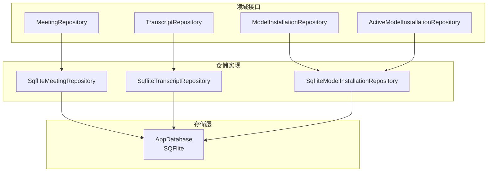
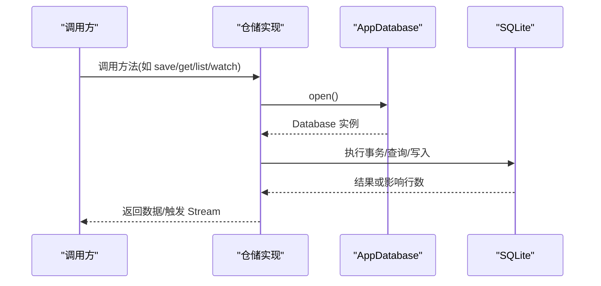
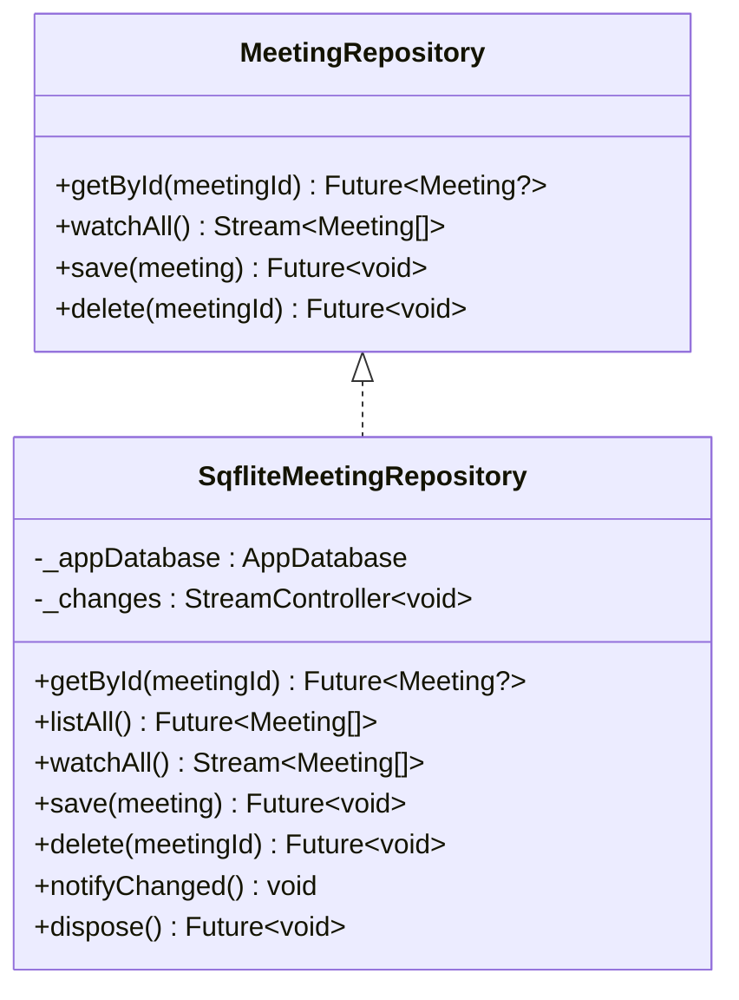
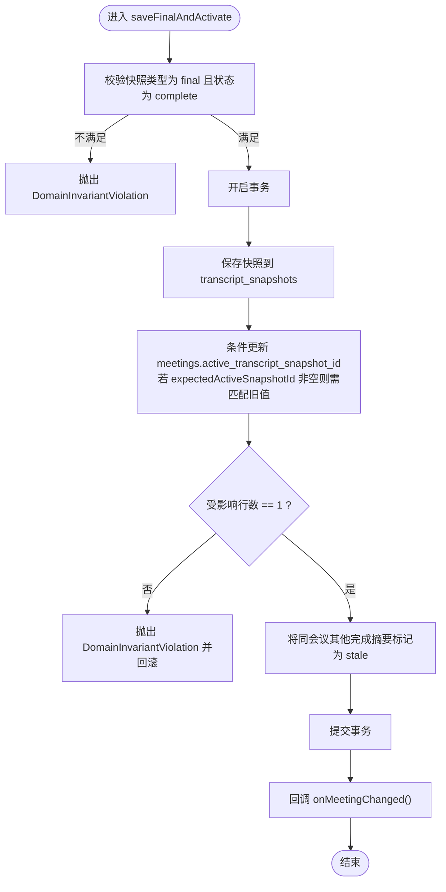
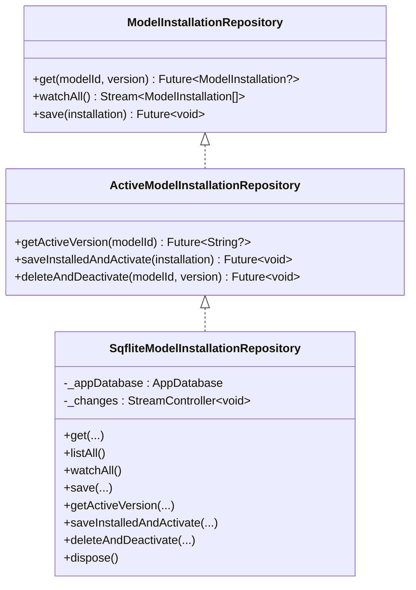
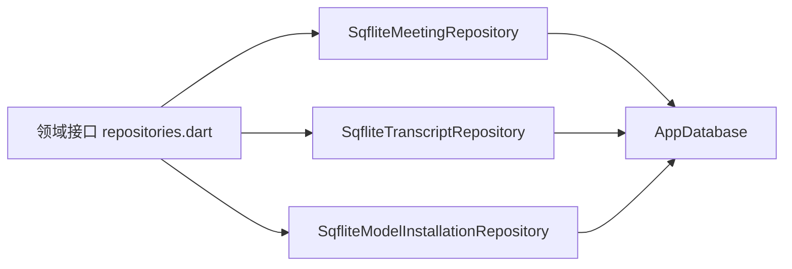

# 仓库接口定义

<cite>
**本文引用的文件**   
- [lib/domain/ports/repositories.dart](file://lib/domain/ports/repositories.dart)
- [lib/data/repositories/sqflite_meeting_repository.dart](file://lib/data/repositories/sqflite_meeting_repository.dart)
- [lib/data/repositories/sqflite_transcript_repository.dart](file://lib/data/repositories/sqflite_transcript_repository.dart)
- [lib/data/repositories/sqflite_model_installation_repository.dart](file://lib/data/repositories/sqflite_model_installation_repository.dart)
- [lib/data/services/storage/app_database.dart](file://lib/data/services/storage/app_database.dart)
- [lib/domain/models/domain_exception.dart](file://lib/domain/models/domain_exception.dart)
</cite>

## 目录
1. [简介](#简介)
2. [项目结构](#项目结构)
3. [核心组件](#核心组件)
4. [架构总览](#架构总览)
5. [详细组件分析](#详细组件分析)
6. [依赖关系分析](#依赖关系分析)
7. [性能考量](#性能考量)
8. [故障排查指南](#故障排查指南)
9. [结论](#结论)
10. [附录](#附录)

## 简介
本文件为数据仓库层的 API 文档，聚焦以下仓库接口的 CRUD 与高级操作：
- MeetingRepository：会议数据的查询、流式监听、保存与删除。
- TranscriptRepository：转录快照的增删改查、最终转录激活、说话人标签更新。
- ModelInstallationRepository / ActiveModelInstallationRepository：模型安装、激活、版本管理与变更通知。

同时涵盖：
- 异步与流式返回模式（Stream）
- 事务处理与并发控制（乐观锁/条件更新）
- 错误处理策略与异常类型
- 数据库迁移与版本兼容性

## 项目结构
仓库层位于 lib/data/repositories，领域接口在 lib/domain/ports，数据库服务在 lib/data/services/storage。Meeting、Transcript、ModelInstallation 等实体通过仓储实现与持久化层解耦。

图表来源
- [lib/domain/ports/repositories.dart:8-70](file://lib/domain/ports/repositories.dart#L8-L70)
- [lib/data/repositories/sqflite_meeting_repository.dart:8-61](file://lib/data/repositories/sqflite_meeting_repository.dart#L8-L61)
- [lib/data/repositories/sqflite_transcript_repository.dart:9-146](file://lib/data/repositories/sqflite_transcript_repository.dart#L9-L146)
- [lib/data/repositories/sqflite_model_installation_repository.dart:11-123](file://lib/data/repositories/sqflite_model_installation_repository.dart#L11-L123)
- [lib/data/services/storage/app_database.dart:6-36](file://lib/data/services/storage/app_database.dart#L6-L36)

章节来源
- [lib/domain/ports/repositories.dart:8-70](file://lib/domain/ports/repositories.dart#L8-L70)
- [lib/data/services/storage/app_database.dart:6-36](file://lib/data/services/storage/app_database.dart#L6-L36)

## 核心组件
- MeetingRepository：提供 getById、watchAll、save、delete。
- TranscriptRepository：提供 getById、listByMeeting、save、saveFinalAndActivate、updateSpeakerLabels。
- ModelInstallationRepository：提供 get、watchAll、save。
- ActiveModelInstallationRepository：扩展 getActiveVersion、saveInstalledAndActivate、deleteAndDeactivate。

章节来源
- [lib/domain/ports/repositories.dart:8-70](file://lib/domain/ports/repositories.dart#L8-L70)

## 架构总览
仓储实现统一通过 AppDatabase 打开 SQLite 连接，使用事务保证一致性；对需要实时更新的场景暴露 Stream 以推送变更。

图表来源
- [lib/data/repositories/sqflite_meeting_repository.dart:41-52](file://lib/data/repositories/sqflite_meeting_repository.dart#L41-L52)
- [lib/data/repositories/sqflite_transcript_repository.dart:47-95](file://lib/data/repositories/sqflite_transcript_repository.dart#L47-L95)
- [lib/data/repositories/sqflite_model_installation_repository.dart:51-99](file://lib/data/repositories/sqflite_model_installation_repository.dart#L51-L99)
- [lib/data/services/storage/app_database.dart:16-36](file://lib/data/services/storage/app_database.dart#L16-L36)

## 详细组件分析

### MeetingRepository 接口与 SqfliteMeetingRepository 实现
- 获取单个会议：getById(meetingId)
- 获取全部会议：listAll()
- 流式监听会议列表：watchAll()
- 保存会议：save(Meeting)
- 删除会议：delete(meetingId)

关键行为
- watchAll 基于广播流，在保存或删除后主动推送新列表。
- save 使用事务 upsert 会议记录，随后广播变更。
- delete 直接删除并广播变更。

图表来源
- [lib/domain/ports/repositories.dart:8-16](file://lib/domain/ports/repositories.dart#L8-L16)
- [lib/data/repositories/sqflite_meeting_repository.dart:8-61](file://lib/data/repositories/sqflite_meeting_repository.dart#L8-L61)

章节来源
- [lib/domain/ports/repositories.dart:8-16](file://lib/domain/ports/repositories.dart#L8-L16)
- [lib/data/repositories/sqflite_meeting_repository.dart:15-52](file://lib/data/repositories/sqflite_meeting_repository.dart#L15-L52)

#### 使用示例（路径引用）
- 获取会议列表与流式监听：[lib/data/repositories/sqflite_meeting_repository.dart:26-38](file://lib/data/repositories/sqflite_meeting_repository.dart#L26-L38)
- 保存会议并触发监听：[lib/data/repositories/sqflite_meeting_repository.dart:41-45](file://lib/data/repositories/sqflite_meeting_repository.dart#L41-L45)
- 删除会议并触发监听：[lib/data/repositories/sqflite_meeting_repository.dart:48-52](file://lib/data/repositories/sqflite_meeting_repository.dart#L48-L52)

### TranscriptRepository 接口与 SqfliteTranscriptRepository 实现
- 获取单个快照：getById(snapshotId)
- 按会议列出快照：listByMeeting(meetingId)
- 保存快照：save(snapshot)
- 保存最终转录并激活：saveFinalAndActivate(snapshot, expectedActiveSnapshotId)
- 更新说话人标签：updateSpeakerLabels(snapshotId, labelsBySegmentId)

关键行为
- saveFinalAndActivate 包含强一致性校验：仅允许“已完成”的最终转录激活；通过条件更新 meetings.active_transcript_snapshot_id 实现乐观并发控制；失败则抛出领域不变量异常。
- updateSpeakerLabels 校验标签长度与片段归属，批量更新 transcript_segments.speaker_id。
- _snapshotFromRow 将行映射为 TranscriptSnapshot，含分段信息。

图表来源
- [lib/data/repositories/sqflite_transcript_repository.dart:53-95](file://lib/data/repositories/sqflite_transcript_repository.dart#L53-L95)

章节来源
- [lib/domain/ports/repositories.dart:18-34](file://lib/domain/ports/repositories.dart#L18-L34)
- [lib/data/repositories/sqflite_transcript_repository.dart:16-146](file://lib/data/repositories/sqflite_transcript_repository.dart#L16-L146)

#### 使用示例（路径引用）
- 保存快照：[lib/data/repositories/sqflite_transcript_repository.dart:47-50](file://lib/data/repositories/sqflite_transcript_repository.dart#L47-L50)
- 激活最终转录：[lib/data/repositories/sqflite_transcript_repository.dart:53-95](file://lib/data/repositories/sqflite_transcript_repository.dart#L53-L95)
- 更新说话人标签：[lib/data/repositories/sqflite_transcript_repository.dart:98-145](file://lib/data/repositories/sqflite_transcript_repository.dart#L98-L145)

### ModelInstallationRepository / ActiveModelInstallationRepository 接口与实现
- 获取安装信息：get(modelId, version)
- 列出所有安装：listAll()
- 流式监听安装列表：watchAll()
- 保存安装：save(installation)
- 获取活跃版本：getActiveVersion(modelId)
- 保存并激活已安装版本：saveInstalledAndActivate(installation)
- 删除并取消激活：deleteAndDeactivate(modelId, version)

关键行为
- saveInstalledAndActivate 要求 installation.state 为 installed，否则抛出参数异常。
- 通过 active_model_versions 表维护每个 modelId 的活跃版本，采用 upsert 确保幂等。
- 变更通过广播流通知订阅者。

图表来源
- [lib/domain/ports/repositories.dart:49-70](file://lib/domain/ports/repositories.dart#L49-L70)
- [lib/data/repositories/sqflite_model_installation_repository.dart:11-123](file://lib/data/repositories/sqflite_model_installation_repository.dart#L11-L123)

章节来源
- [lib/domain/ports/repositories.dart:49-70](file://lib/domain/ports/repositories.dart#L49-L70)
- [lib/data/repositories/sqflite_model_installation_repository.dart:18-123](file://lib/data/repositories/sqflite_model_installation_repository.dart#L18-L123)

#### 使用示例（路径引用）
- 保存安装并激活：[lib/data/repositories/sqflite_model_installation_repository.dart:73-99](file://lib/data/repositories/sqflite_model_installation_repository.dart#L73-L99)
- 删除并取消激活：[lib/data/repositories/sqflite_model_installation_repository.dart:102-120](file://lib/data/repositories/sqflite_model_installation_repository.dart#L102-L120)

## 依赖关系分析
- 仓储实现依赖 AppDatabase 提供的数据库连接与迁移能力。
- 领域接口与实现分离，便于替换底层存储或进行单元测试。
- 变更通知通过 StreamController.broadcast 实现轻量级发布-订阅。

图表来源
- [lib/domain/ports/repositories.dart:8-70](file://lib/domain/ports/repositories.dart#L8-L70)
- [lib/data/services/storage/app_database.dart:6-36](file://lib/data/services/storage/app_database.dart#L6-L36)

章节来源
- [lib/domain/ports/repositories.dart:8-70](file://lib/domain/ports/repositories.dart#L8-L70)
- [lib/data/services/storage/app_database.dart:6-36](file://lib/data/services/storage/app_database.dart#L6-L36)

## 性能考量
- 流式监听：watchAll 使用广播流，避免轮询；仅在变更时重新拉取全量列表。
- 索引优化：transcript_snapshots 与 transcript_segments 建立复合索引以提升按会议与时间范围查询效率。
- 事务批处理：保存快照时先删除再插入分段，减少碎片；大对象建议分批写入。
- 连接复用：AppDatabase.open 缓存单例连接，减少重复打开开销。

章节来源
- [lib/data/services/storage/app_database.dart:16-36](file://lib/data/services/storage/app_database.dart#L16-L36)
- [lib/data/services/storage/app_database.dart:178-189](file://lib/data/services/storage/app_database.dart#L178-L189)

## 故障排查指南
- 领域不变量异常：DomainInvariantViolation 用于约束业务规则（如只能激活已完成最终转录、标签长度限制、片段归属校验）。
- 参数异常：当传入非法状态（如非 installed 激活）会抛出 ArgumentError。
- 并发冲突：saveFinalAndActivate 的条件更新失败表示活动快照已被其他会话修改，应重试或提示用户刷新。
- 数据库升级：当前 schemaVersion=5，Alpha 版本不支持原地升级，遇到 UnsupportedAlphaInstallationException 需导出数据后重装。

章节来源
- [lib/domain/models/domain_exception.dart:1-9](file://lib/domain/models/domain_exception.dart#L1-L9)
- [lib/data/repositories/sqflite_transcript_repository.dart:57-82](file://lib/data/repositories/sqflite_transcript_repository.dart#L57-L82)
- [lib/data/repositories/sqflite_model_installation_repository.dart:74-80](file://lib/data/repositories/sqflite_model_installation_repository.dart#L74-L80)
- [lib/data/services/storage/app_database.dart:242-271](file://lib/data/services/storage/app_database.dart#L242-L271)

## 结论
本仓库层通过清晰的接口抽象与稳定的实现，提供了高内聚、低耦合的数据访问能力。借助事务与乐观并发控制保障一致性，结合流式通知提升 UI 响应性。完善的异常体系与迁移机制确保可维护性与可扩展性。

## 附录

### 数据库迁移与版本兼容性
- schemaVersion=5，支持从 v1/v2/v3/v4 逐步升级。
- v2 新增 app_settings 表。
- v3 新增 active_model_versions 与 model_usage_leases 表及索引。
- v4 为 summaries 表添加 title 字段。
- v5 禁止 Alpha 版本原地升级，抛出 UnsupportedAlphaInstallationException。

章节来源
- [lib/data/services/storage/app_database.dart:46-263](file://lib/data/services/storage/app_database.dart#L46-L263)

### 异步与流式模式说明
- 所有写操作返回 Future，读操作支持同步 Future 与异步 Stream。
- watchAll 通过广播流推送变更，适合 UI 实时刷新。
- 建议在应用生命周期结束时调用 dispose 关闭流控制器，避免资源泄漏。

章节来源
- [lib/data/repositories/sqflite_meeting_repository.dart:33-38](file://lib/data/repositories/sqflite_meeting_repository.dart#L33-L38)
- [lib/data/repositories/sqflite_model_installation_repository.dart:43-48](file://lib/data/repositories/sqflite_model_installation_repository.dart#L43-L48)

### 事务与并发控制要点
- 所有写操作均包裹在 db.transaction 中，确保原子性。
- 激活最终转录使用条件更新（expectedActiveSnapshotId）实现乐观锁，防止覆盖他人更改。
- 更新说话人标签前校验快照状态与片段集合，避免脏写。

章节来源
- [lib/data/repositories/sqflite_transcript_repository.dart:63-95](file://lib/data/repositories/sqflite_transcript_repository.dart#L63-L95)
- [lib/data/repositories/sqflite_transcript_repository.dart:108-145](file://lib/data/repositories/sqflite_transcript_repository.dart#L108-L145)