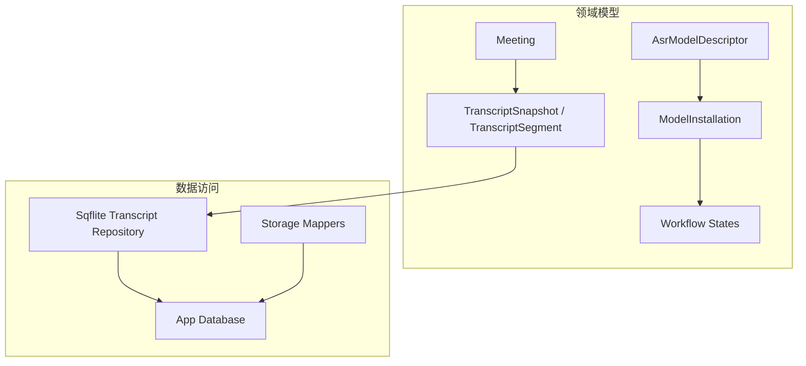
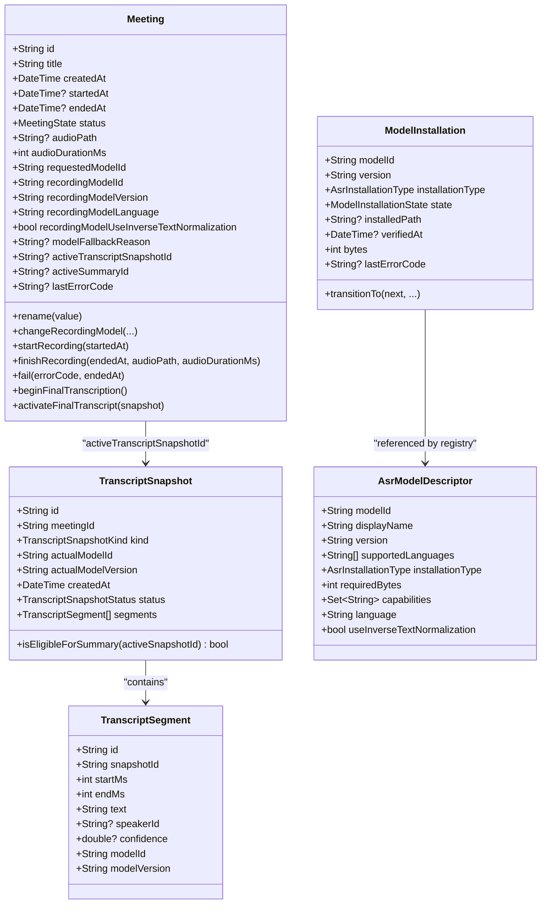
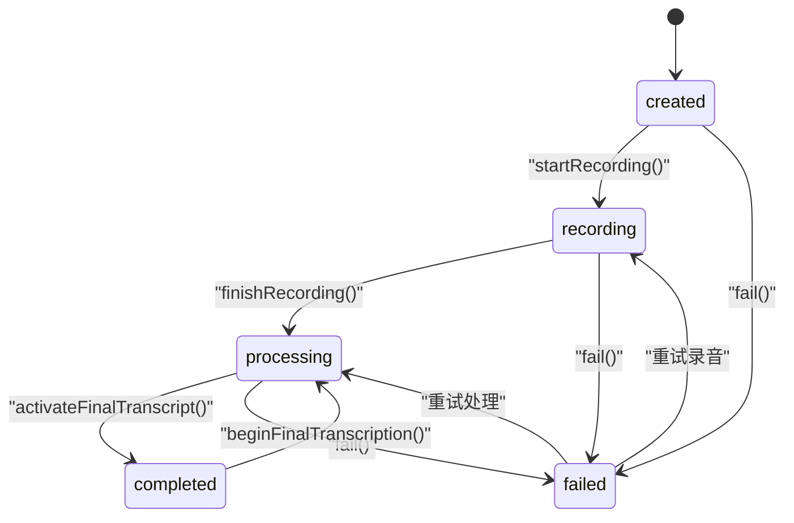
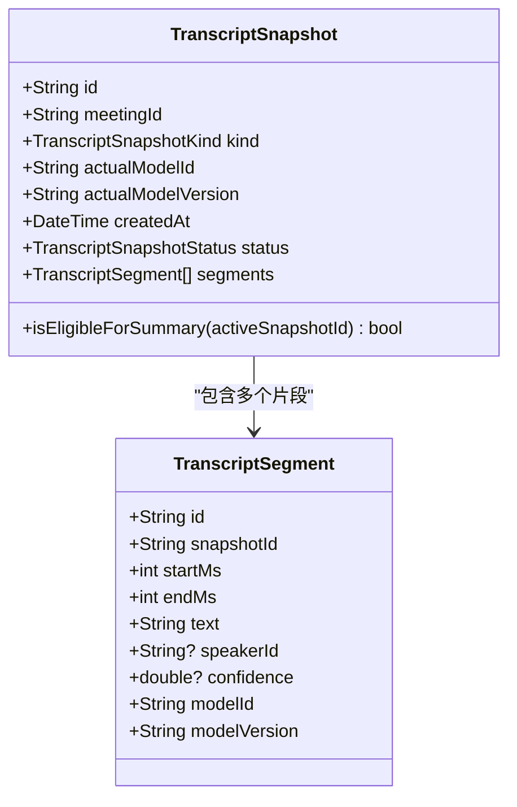
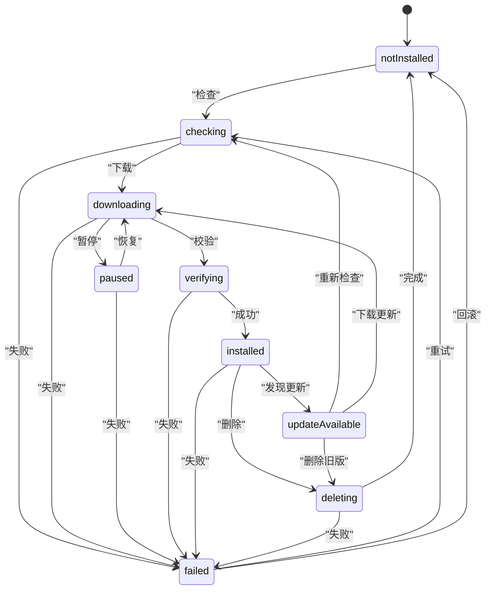
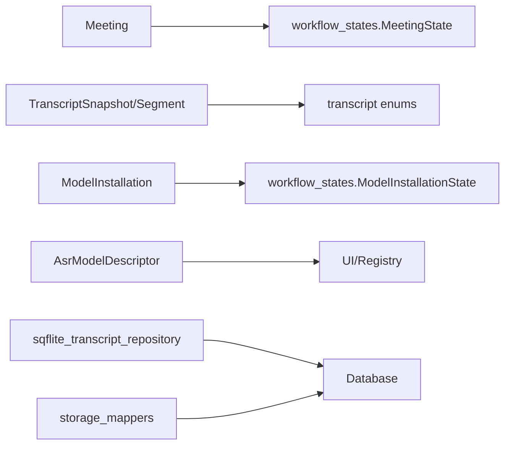

# 数据模型定义

<cite>
**本文引用的文件**
- [lib/domain/models/meeting.dart](file://lib/domain/models/meeting.dart)
- [lib/domain/models/transcript.dart](file://lib/domain/models/transcript.dart)
- [lib/domain/models/model_installation.dart](file://lib/domain/models/model_installation.dart)
- [lib/domain/models/asr_model.dart](file://lib/domain/models/asr_model.dart)
- [lib/domain/models/workflow_states.dart](file://lib/domain/models/workflow_states.dart)
- [lib/data/repositories/sqflite_transcript_repository.dart](file://lib/data/repositories/sqflite_transcript_repository.dart)
- [lib/data/models/storage/storage_mappers.dart](file://lib/data/models/storage/storage_mappers.dart)
- [lib/app/meettrace_storage_dependencies.dart](file://lib/app/meettrace_storage_dependencies.dart)
</cite>

## 目录
1. [引言](#引言)
2. [项目结构](#项目结构)
3. [核心组件](#核心组件)
4. [架构总览](#架构总览)
5. [详细组件分析](#详细组件分析)
6. [依赖关系分析](#依赖关系分析)
7. [性能考量](#性能考量)
8. [故障排查指南](#故障排查指南)
9. [结论](#结论)
10. [附录](#附录)

## 引言
本文件为会迹项目的数据模型 API 文档，聚焦以下目标：
- 全面记录 Meeting 模型的属性、状态机转换与业务方法（创建、更新、删除等）。
- 详细说明 TranscriptSnapshot 转录快照的数据结构（时间戳、文本内容、说话人信息等字段）及约束。
- 记录 Transcript 转录对象的关系与关联方法。
- 解释 ModelInstallation 模型安装状态管理与版本控制。
- 描述 AsrModel 语音识别模型的元数据与配置信息。
- 提供数据序列化/反序列化的格式说明（JSON 与数据库行映射）。
- 包含数据验证规则与约束条件。
- 提供完整的 JSON 示例与 Dart 代码示例展示模型的使用方法。

## 项目结构
围绕数据模型的核心文件位于 domain 层与 data 层的映射实现中：
- domain/models：Meeting、Transcript、ModelInstallation、AsrModel、工作流状态等核心领域模型。
- data/repositories 与 data/models/storage：数据库表结构与行到领域对象的映射。
- app：存储依赖装配，统一暴露仓储接口。

图表来源
- [lib/domain/models/meeting.dart:1-233](file://lib/domain/models/meeting.dart#L1-L233)
- [lib/domain/models/transcript.dart:1-133](file://lib/domain/models/transcript.dart#L1-L133)
- [lib/domain/models/model_installation.dart:1-62](file://lib/domain/models/model_installation.dart#L1-L62)
- [lib/domain/models/asr_model.dart:1-54](file://lib/domain/models/asr_model.dart#L1-L54)
- [lib/domain/models/workflow_states.dart:1-204](file://lib/domain/models/workflow_states.dart#L1-L204)
- [lib/data/repositories/sqflite_transcript_repository.dart:191-227](file://lib/data/repositories/sqflite_transcript_repository.dart#L191-L227)
- [lib/data/models/storage/storage_mappers.dart:61-101](file://lib/data/models/storage/storage_mappers.dart#L61-L101)

章节来源
- [lib/domain/models/meeting.dart:1-233](file://lib/domain/models/meeting.dart#L1-L233)
- [lib/domain/models/transcript.dart:1-133](file://lib/domain/models/transcript.dart#L1-L133)
- [lib/domain/models/model_installation.dart:1-62](file://lib/domain/models/model_installation.dart#L1-L62)
- [lib/domain/models/asr_model.dart:1-54](file://lib/domain/models/asr_model.dart#L1-L54)
- [lib/domain/models/workflow_states.dart:1-204](file://lib/domain/models/workflow_states.dart#L1-L204)
- [lib/data/repositories/sqflite_transcript_repository.dart:191-227](file://lib/data/repositories/sqflite_transcript_repository.dart#L191-L227)
- [lib/data/models/storage/storage_mappers.dart:61-101](file://lib/data/models/storage/storage_mappers.dart#L61-L101)

## 核心组件
- Meeting：会议实体，封装生命周期状态、录音模型选择、音频元数据、激活的转录快照与摘要 ID、错误码等；提供不可变更新方法与状态机转换。
- TranscriptSnapshot / TranscriptSegment：转录快照与片段，包含时间轴、文本、说话人、置信度、模型标识与版本；内置排序与一致性校验。
- ModelInstallation：模型安装记录，包含安装类型、状态、路径、校验时间与大小；提供受保护的状态迁移。
- AsrModelDescriptor：ASR 模型元数据，包括语言支持、能力集、默认语言与是否启用逆文本归一化等。
- Workflow States：MeetingState、RecordingState、ProcessingState、ModelInstallationState 及其状态机转换规则与异常。

章节来源
- [lib/domain/models/meeting.dart:1-233](file://lib/domain/models/meeting.dart#L1-L233)
- [lib/domain/models/transcript.dart:1-133](file://lib/domain/models/transcript.dart#L1-L133)
- [lib/domain/models/model_installation.dart:1-62](file://lib/domain/models/model_installation.dart#L1-L62)
- [lib/domain/models/asr_model.dart:1-54](file://lib/domain/models/asr_model.dart#L1-L54)
- [lib/domain/models/workflow_states.dart:1-204](file://lib/domain/models/workflow_states.dart#L1-L204)

## 架构总览
领域模型通过仓储与数据库持久化，仓储负责将领域对象与数据库行进行双向映射。Transcript 快照与片段在数据库中分表存储并通过外键关联。

图表来源
- [lib/domain/models/meeting.dart:1-233](file://lib/domain/models/meeting.dart#L1-L233)
- [lib/domain/models/transcript.dart:1-133](file://lib/domain/models/transcript.dart#L1-L133)
- [lib/domain/models/model_installation.dart:1-62](file://lib/domain/models/model_installation.dart#L1-L62)
- [lib/domain/models/asr_model.dart:1-54](file://lib/domain/models/asr_model.dart#L1-L54)

## 详细组件分析

### Meeting 模型
- 属性
  - 标识与标题：id、title
  - 时间线：createdAt、startedAt、endedAt
  - 状态：status（MeetingState）
  - 音频：audioPath、audioDurationMs
  - 模型选择：requestedModelId、recordingModelId、recordingModelVersion、recordingModelLanguage、recordingModelUseInverseTextNormalization、modelFallbackReason
  - 激活项：activeTranscriptSnapshotId、activeSummaryId
  - 错误：lastErrorCode
- 状态机与转换
  - created → recording → processing → completed/failed
  - failed/recording/completed 可回退至 processing 或 recording（依据具体方法）
  - 使用 transitionTo 强制校验非法转换并抛出 InvalidStateTransitionException
- 业务方法
  - rename(value)：重命名，要求非空标题
  - changeRecordingModel(...)：在未锁定状态下更换录音模型与参数，需记录回退原因当 requestedModelId ≠ recordingModelId
  - startRecording(startedAt)：开始录音，设置 startedAt 并进入 recording
  - finishRecording(endedAt, audioPath, audioDurationMs)：结束录音，校验音频路径非空，进入 processing
  - fail(errorCode, endedAt)：失败态，记录错误码与可选结束时间
  - beginFinalTranscription()：发起最终转录，要求存在完整事实音频且时长 > 0
  - activateFinalTranscript(snapshot)：激活已完成的最终转录快照，清理错误码并进入 completed
- 不变式与校验
  - 时间顺序：startedAt ≥ createdAt，endedAt ≥ startedAt
  - 模型回退一致性：requestedModelId 与 recordingModelId 不一致时必须提供 fallbackReason；一致时不得提供
  - 录音模型锁定：一旦离开 created 状态，禁止再更改录音模型
- 不可变更新
  - 内部 _copyWith 提供选择性覆盖字段，保持不可变性

图表来源
- [lib/domain/models/workflow_states.dart:1-204](file://lib/domain/models/workflow_states.dart#L1-L204)
- [lib/domain/models/meeting.dart:1-233](file://lib/domain/models/meeting.dart#L1-L233)

章节来源
- [lib/domain/models/meeting.dart:1-233](file://lib/domain/models/meeting.dart#L1-L233)
- [lib/domain/models/workflow_states.dart:1-204](file://lib/domain/models/workflow_states.dart#L1-L204)

### TranscriptSnapshot 与 TranscriptSegment
- TranscriptSegment
  - 字段：id、snapshotId、startMs、endMs、text、speakerId、confidence、modelId、modelVersion
  - 约束：startMs < endMs，confidence ∈ [0,1]，必填字段非空
- TranscriptSnapshot
  - 字段：id、meetingId、kind（temporary/finalTranscript）、actualModelId、actualModelVersion、createdAt、status（processing/complete/failed）、segments
  - 约束：segments 必须属于同一快照、同一模型与版本、无重复 segment.id；构造时对 segments 按 startMs、endMs、id 排序
  - 方法：isEligibleForSummary(activeSnapshotId) 仅允许已完成且当前激活的最终快照用于总结
- 事件
  - TranscriptSegmentEvent：用于实时流式片段事件，包含窗口内最终性标记 isFinalForWindow

图表来源
- [lib/domain/models/transcript.dart:1-133](file://lib/domain/models/transcript.dart#L1-L133)

章节来源
- [lib/domain/models/transcript.dart:1-133](file://lib/domain/models/transcript.dart#L1-L133)

### ModelInstallation 模型安装状态与版本控制
- 字段：modelId、version、installationType（bundled/downloadable）、state、installedPath、verifiedAt、bytes、lastErrorCode
- 约束：
  - modelId/version 非空
  - bytes ≥ 0
  - installed 状态必须包含 installedPath 与 verifiedAt
  - 内置模型不允许删除（transitionTo deleting 抛错）
- 状态机：notInstalled → checking → downloading → paused → verifying → installed → updateAvailable/deleting/failed → ...
- 方法：transitionTo(next, {installedPath, verifiedAt, bytes, errorCode}) 返回新实例，严格遵循状态机

图表来源
- [lib/domain/models/workflow_states.dart:150-203](file://lib/domain/models/workflow_states.dart#L150-L203)
- [lib/domain/models/model_installation.dart:1-62](file://lib/domain/models/model_installation.dart#L1-L62)

章节来源
- [lib/domain/models/model_installation.dart:1-62](file://lib/domain/models/model_installation.dart#L1-L62)
- [lib/domain/models/workflow_states.dart:150-203](file://lib/domain/models/workflow_states.dart#L150-L203)

### AsrModel 语音识别模型元数据与配置
- AsrModelDescriptor
  - 字段：modelId、displayName、version、supportedLanguages、installationType、requiredBytes、capabilities、language、useInverseTextNormalization
  - 约束：必填字段非空；requiredBytes > 0；supportedLanguages 至少一个非空语言代码；capabilities 不包含空能力；language 非空
  - 防御性复制：supportedLanguages 与 capabilities 不可变集合
- 用途：注册可用 ASR 模型的能力与默认配置，供 UI 与运行时选择

章节来源
- [lib/domain/models/asr_model.dart:1-54](file://lib/domain/models/asr_model.dart#L1-L54)

### 数据序列化与反序列化
- JSON 字段建议（基于领域模型与数据库列名推导）
  - Meeting
    - id, title, createdAt(ms), startedAt(ms), endedAt(ms), status, audioPath, audioDurationMs, requestedModelId, recordingModelId, recordingModelVersion, recordingModelLanguage, recordingModelUseInverseTextNormalization, modelFallbackReason, activeTranscriptSnapshotId, activeSummaryId, lastErrorCode
  - TranscriptSnapshot
    - id, meetingId, kind, actualModelId, actualModelVersion, createdAt(ms), status, segments[]
  - TranscriptSegment
    - id, snapshotId, startMs, endMs, text, speakerId, confidence, modelId, modelVersion
  - ModelInstallation
    - modelId, version, installationType, state, installedPath, verifiedAt(ms), bytes, lastErrorCode
  - AsrModelDescriptor
    - modelId, displayName, version, supportedLanguages[], installationType, requiredBytes, capabilities[], language, useInverseTextNormalization
- 数据库行映射（部分关键映射）
  - ProcessingTask → row：id, kind, meeting_id, model_id, state, created_at, updated_at, lease_expires_at, last_error_code
  - ModelInstallation → row：model_id, version, installation_type, ...（由 storage_mappers 提供）
  - TranscriptSnapshot → row：id, meeting_id, kind, actual_model_id, actual_model_version, created_at, status
  - TranscriptSegment → row：id, snapshot_id, start_ms, end_ms, text, speaker_id, confidence, model_id, model_version

章节来源
- [lib/data/models/storage/storage_mappers.dart:61-101](file://lib/data/models/storage/storage_mappers.dart#L61-L101)
- [lib/data/repositories/sqflite_transcript_repository.dart:191-227](file://lib/data/repositories/sqflite_transcript_repository.dart#L191-L227)

### 数据验证规则与约束条件
- Meeting
  - 时间顺序与长度约束；模型回退一致性；录音模型锁定；必填字段非空
- TranscriptSegment
  - 时间区间合法；置信度范围；必填字段非空
- TranscriptSnapshot
  - 片段归属与模型一致性；片段 ID 唯一；构造时自动排序
- ModelInstallation
  - 安装状态与字段完整性；内置模型不可删除
- AsrModelDescriptor
  - 必填字段与容量约束；不可变集合

章节来源
- [lib/domain/models/meeting.dart:1-233](file://lib/domain/models/meeting.dart#L1-L233)
- [lib/domain/models/transcript.dart:1-133](file://lib/domain/models/transcript.dart#L1-L133)
- [lib/domain/models/model_installation.dart:1-62](file://lib/domain/models/model_installation.dart#L1-L62)
- [lib/domain/models/asr_model.dart:1-54](file://lib/domain/models/asr_model.dart#L1-L54)

### 使用示例（JSON 与 Dart）
- JSON 示例（Meeting）
  - 字段：id、title、createdAt(ms)、startedAt(ms)、endedAt(ms)、status、audioPath、audioDurationMs、requestedModelId、recordingModelId、recordingModelVersion、recordingModelLanguage、recordingModelUseInverseTextNormalization、modelFallbackReason、activeTranscriptSnapshotId、activeSummaryId、lastErrorCode
- JSON 示例（TranscriptSnapshot）
  - 字段：id、meetingId、kind、actualModelId、actualModelVersion、createdAt(ms)、status、segments[]
- JSON 示例（TranscriptSegment）
  - 字段：id、snapshotId、startMs、endMs、text、speakerId、confidence、modelId、modelVersion
- JSON 示例（ModelInstallation）
  - 字段：modelId、version、installationType、state、installedPath、verifiedAt(ms)、bytes、lastErrorCode
- JSON 示例（AsrModelDescriptor）
  - 字段：modelId、displayName、version、supportedLanguages[]、installationType、requiredBytes、capabilities[]、language、useInverseTextNormalization

- Dart 示例（Meeting）
  - 创建：Meeting(id, title, createdAt, status, audioDurationMs, requestedModelId, recordingModelId, recordingModelVersion, ...)
  - 开始录音：meeting.startRecording(startedAt: now)
  - 结束录音：meeting.finishRecording(endedAt: now, audioPath: "/path/to/audio.pcm", audioDurationMs: duration)
  - 失败：meeting.fail(errorCode: "ERR_XXX", endedAt: now)
  - 发起最终转录：meeting.beginFinalTranscription()
  - 激活转录：meeting.activateFinalTranscript(snapshot)
  - 重命名：meeting.rename("新标题")
  - 更换录音模型：meeting.changeRecordingModel(recordingModelId, recordingModelVersion, recordingModelLanguage, recordingModelUseInverseTextNormalization, fallbackReason)

- Dart 示例（TranscriptSnapshot / TranscriptSegment）
  - 片段：TranscriptSegment(id, snapshotId, startMs, endMs, text, speakerId?, confidence?, modelId, modelVersion)
  - 快照：TranscriptSnapshot(id, meetingId, kind, actualModelId, actualModelVersion, createdAt, status, segments)
  - 判断可总结：snapshot.isEligibleForSummary(activeSnapshotId: meeting.activeTranscriptSnapshotId)

- Dart 示例（ModelInstallation）
  - 创建：ModelInstallation(modelId, version, installationType, state, bytes, ...)
  - 状态迁移：installation.transitionTo(ModelInstallationState.downloading, bytes: size)

- Dart 示例（AsrModelDescriptor）
  - 创建：AsrModelDescriptor(modelId, displayName, version, supportedLanguages, installationType, requiredBytes, capabilities, language, useInverseTextNormalization)

章节来源
- [lib/domain/models/meeting.dart:1-233](file://lib/domain/models/meeting.dart#L1-L233)
- [lib/domain/models/transcript.dart:1-133](file://lib/domain/models/transcript.dart#L1-L133)
- [lib/domain/models/model_installation.dart:1-62](file://lib/domain/models/model_installation.dart#L1-L62)
- [lib/domain/models/asr_model.dart:1-54](file://lib/domain/models/asr_model.dart#L1-L54)

## 依赖关系分析
- Meeting 依赖 workflow_states 中的 MeetingState 与状态机扩展。
- TranscriptSnapshot/Segment 依赖 transcript 枚举与排序逻辑。
- ModelInstallation 依赖 workflow_states 中的 ModelInstallationState 与状态机扩展。
- AsrModelDescriptor 被 UI 与仓储用于模型选项与注册。
- 数据层通过 sqflite_transcript_repository 与 storage_mappers 将领域对象映射到数据库行。

图表来源
- [lib/domain/models/meeting.dart:1-233](file://lib/domain/models/meeting.dart#L1-L233)
- [lib/domain/models/transcript.dart:1-133](file://lib/domain/models/transcript.dart#L1-L133)
- [lib/domain/models/model_installation.dart:1-62](file://lib/domain/models/model_installation.dart#L1-L62)
- [lib/domain/models/asr_model.dart:1-54](file://lib/domain/models/asr_model.dart#L1-L54)
- [lib/data/repositories/sqflite_transcript_repository.dart:191-227](file://lib/data/repositories/sqflite_transcript_repository.dart#L191-L227)
- [lib/data/models/storage/storage_mappers.dart:61-101](file://lib/data/models/storage/storage_mappers.dart#L61-L101)

章节来源
- [lib/app/meettrace_storage_dependencies.dart:74-115](file://lib/app/meettrace_storage_dependencies.dart#L74-L115)
- [lib/data/repositories/sqflite_transcript_repository.dart:191-227](file://lib/data/repositories/sqflite_transcript_repository.dart#L191-L227)
- [lib/data/models/storage/storage_mappers.dart:61-101](file://lib/data/models/storage/storage_mappers.dart#L61-L101)

## 性能考量
- TranscriptSnapshot.segments 在构造时排序，避免后续多次排序开销；列表不可变提升并发安全。
- 数据库查询按 start_ms、end_ms、id 排序，保证读取顺序稳定。
- 领域对象不可变设计减少拷贝与共享状态风险，但频繁更新会产生新实例，建议在批量操作时合并变更。
- 模型安装状态机限制非法转换，避免无效 I/O 与网络请求。

[本节为通用指导，不直接分析具体文件]

## 故障排查指南
- 常见异常
  - InvalidStateTransitionException：状态机非法转换（如 MeetingState、ModelInstallationState）
  - ArgumentError：字段校验失败（空值、范围越界、时间顺序错误）
  - DomainInvariantViolation：领域不变量违反（如内置模型删除、激活其他会议快照）
- 定位步骤
  - 检查传入参数的合法性（时间、ID、长度、范围）
  - 确认状态机当前状态与目标状态是否允许
  - 核对数据库行映射字段是否与领域对象一致
  - 查看 lastErrorCode 与日志堆栈

章节来源
- [lib/domain/models/workflow_states.dart:27-43](file://lib/domain/models/workflow_states.dart#L27-L43)
- [lib/domain/models/meeting.dart:1-233](file://lib/domain/models/meeting.dart#L1-L233)
- [lib/domain/models/model_installation.dart:1-62](file://lib/domain/models/model_installation.dart#L1-L62)

## 结论
本文件系统化梳理了会迹项目的核心数据模型与状态机，明确了各实体的属性、约束、序列化格式与数据库映射，提供了面向开发与运维的参考与实践建议。通过不可变对象与严格状态机，确保数据一致性与可维护性。

[本节为总结，不直接分析具体文件]

## 附录
- 术语
  - 转录快照：对某次会议转录结果的阶段性或最终保存
  - 片段：转录结果的时间切片，包含文本、说话人与置信度
  - 模型安装：ASR 模型的本地安装、校验与激活流程
  - 状态机：限定状态间合法转换的规则集合

[本节为概念说明，不直接分析具体文件]