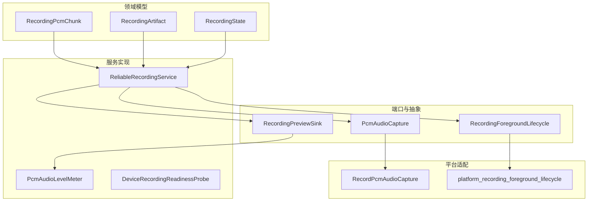
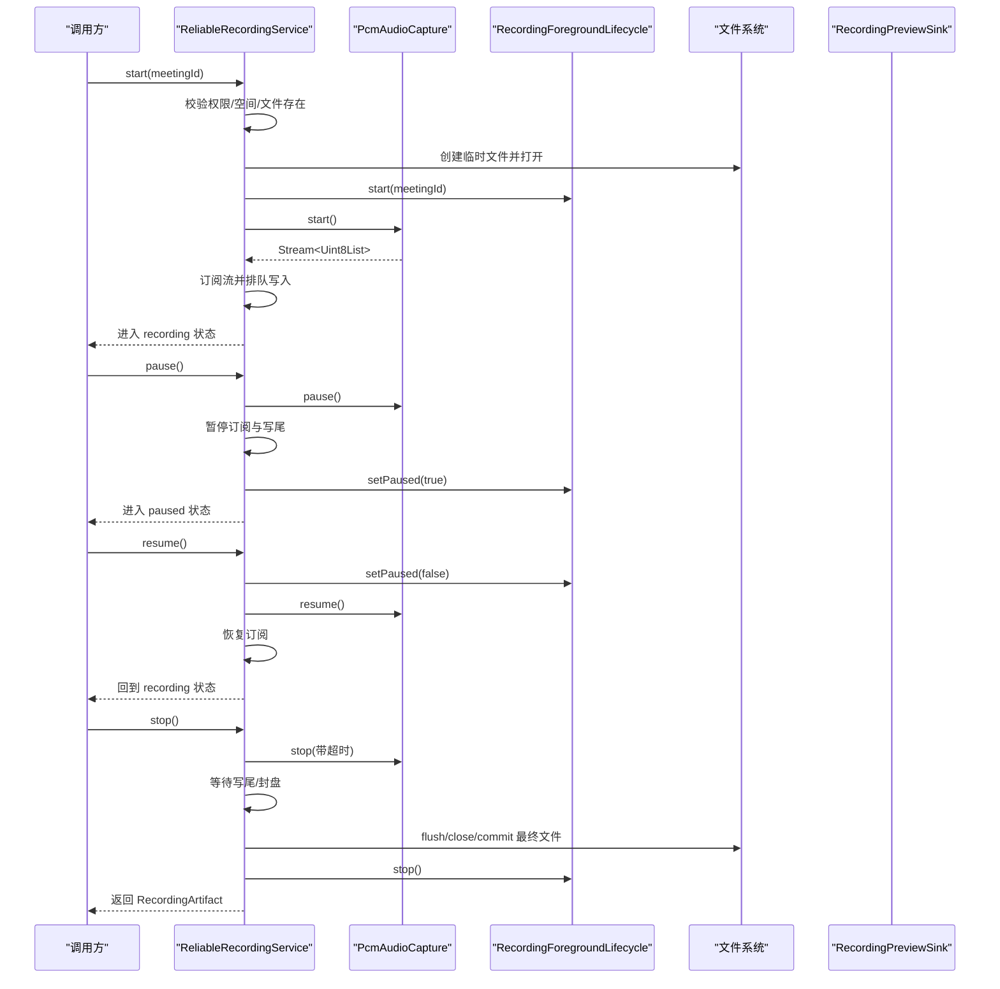
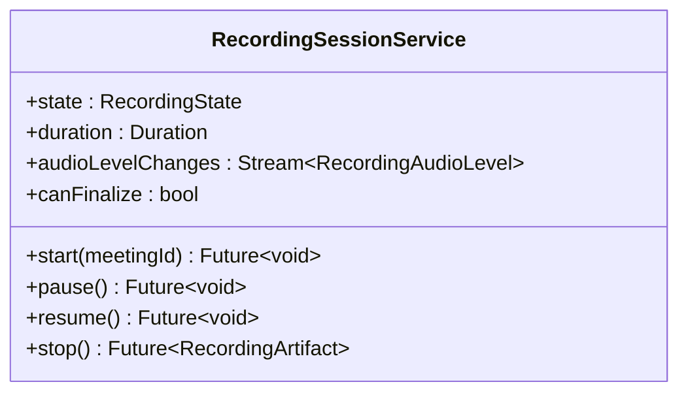
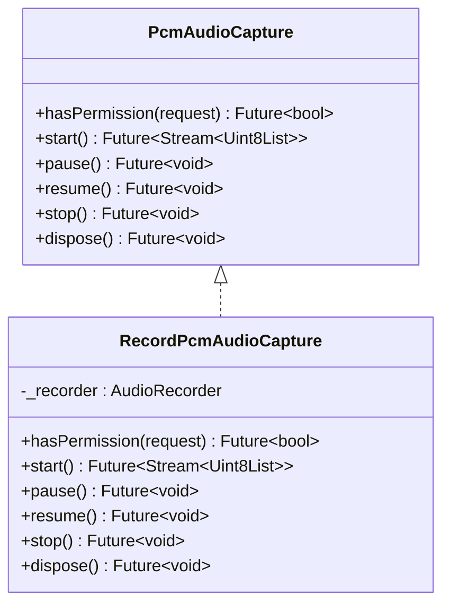
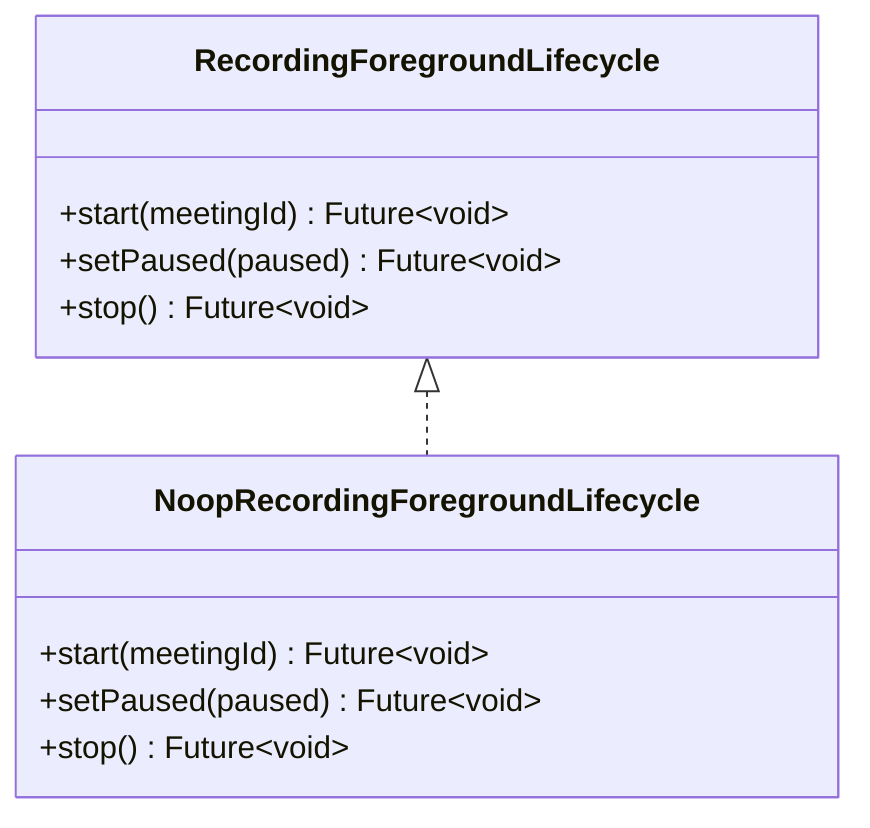
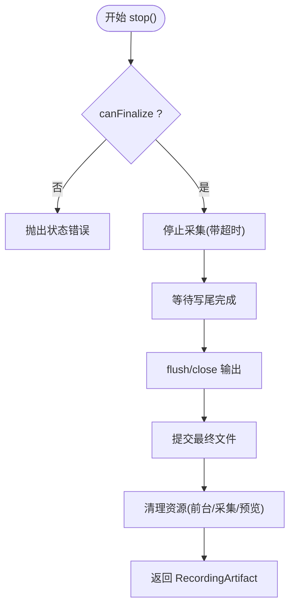
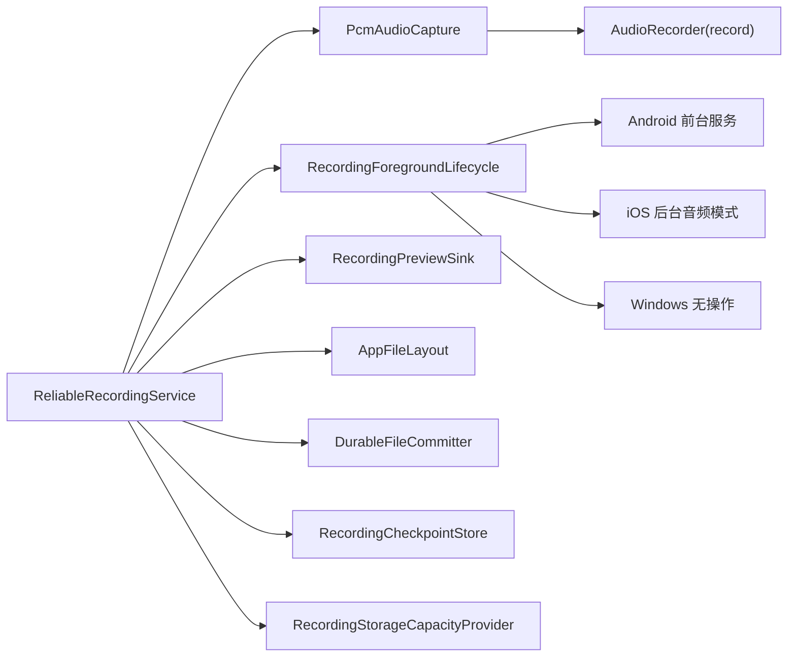

# 音频录制端口接口

<cite>
**本文引用的文件**   
- [recording_ports.dart](file://lib/data/services/audio/recording_ports.dart)
- [record_pcm_audio_capture.dart](file://lib/data/services/audio/record_pcm_audio_capture.dart)
- [reliable_recording_service.dart](file://lib/data/services/audio/reliable_recording_service.dart)
- [recording_session.dart](file://lib/domain/ports/recording_session.dart)
- [recording.dart](file://lib/domain/models/recording.dart)
- [workflow_states.dart](file://lib/domain/models/workflow_states.dart)
- [platform_recording_foreground_lifecycle.dart](file://lib/data/services/audio/platform_recording_foreground_lifecycle.dart)
- [pcm_audio_level_meter.dart](file://lib/data/services/audio/pcm_audio_level_meter.dart)
- [recording_device_readiness_probe.dart](file://lib/data/services/audio/recording_device_readiness_probe.dart)
- [recording_continuity_metrics.dart](file://lib/data/services/audio/spike/recording_continuity_metrics.dart)
- [ios_recording_configuration_test.dart](file://test/data/services/audio/ios_recording_configuration_test.dart)
</cite>

## 目录
1. [简介](#简介)
2. [项目结构](#项目结构)
3. [核心组件](#核心组件)
4. [架构总览](#架构总览)
5. [详细组件分析](#详细组件分析)
6. [依赖关系分析](#依赖关系分析)
7. [性能考量](#性能考量)
8. [故障排查指南](#故障排查指南)
9. [结论](#结论)
10. [附录：使用示例与最佳实践](#附录使用示例与最佳实践)

## 简介
本文件为“音频录制端口接口”的权威 API 文档，聚焦 RecordingPorts 体系与可靠的录音会话服务。内容覆盖：
- 接口方法：startRecording()/stopRecording()/pauseRecording()/resumeRecording() 等控制流程（映射到 RecordingSessionService 的 start/pause/resume/stop）
- 音频配置参数：采样率、声道数、比特率（PCM16）、输入增强与中断恢复策略
- 事件流与状态监听：PCM 数据流、音量电平流、状态机转换
- 平台差异：Android/iOS/Windows 的前台生命周期与后台模式处理
- 错误处理与资源管理：异常类型、超时保护、检查点与回滚
- 性能优化与最佳实践：背压、丢帧策略、I/O 落盘、预览链路隔离

## 项目结构
围绕音频录制的核心代码分布在 data/services/audio 与 domain 层：
- 端口与抽象：PcmAudioCapture、RecordingForegroundLifecycle、RecordingPreviewSink 等
- 平台适配：RecordPcmAudioCapture（基于 record 插件）、前台生命周期工厂
- 可靠录音服务：ReliableRecordingService（状态机、持久化、预览分发、检查点）
- 模型与状态：RecordingPcmChunk、RecordingArtifact、RecordingState、WorkflowStates
- 辅助能力：音量计、设备就绪探测、连续性指标

图表来源
- [recording_ports.dart:1-147](file://lib/data/services/audio/recording_ports.dart#L1-L147)
- [record_pcm_audio_capture.dart:1-78](file://lib/data/services/audio/record_pcm_audio_capture.dart#L1-L78)
- [reliable_recording_service.dart:1-451](file://lib/data/services/audio/reliable_recording_service.dart#L1-L451)
- [recording.dart:1-69](file://lib/domain/models/recording.dart#L1-L69)
- [workflow_states.dart:1-204](file://lib/domain/models/workflow_states.dart#L1-L204)
- [platform_recording_foreground_lifecycle.dart:1-32](file://lib/data/services/audio/platform_recording_foreground_lifecycle.dart#L1-L32)
- [pcm_audio_level_meter.dart:1-99](file://lib/data/services/audio/pcm_audio_level_meter.dart#L1-L99)
- [recording_device_readiness_probe.dart:1-34](file://lib/data/services/audio/recording_device_readiness_probe.dart#L1-L34)

章节来源
- [recording_ports.dart:1-147](file://lib/data/services/audio/recording_ports.dart#L1-L147)
- [recording.dart:1-69](file://lib/domain/models/recording.dart#L1-L69)
- [workflow_states.dart:1-204](file://lib/domain/models/workflow_states.dart#L1-L204)

## 核心组件
- PcmAudioCapture：定义麦克风采集能力（权限、启动流、暂停/恢复、停止、释放）
- RecordingForegroundLifecycle：平台前台生命周期（Android 前台服务；iOS/Windows 无操作）
- RecordingPreviewSink：可丢弃的派生数据写入端（如音量计、实时转录预览）
- ReliableRecordingService：事实音频录制会话服务（状态机、持久化、检查点、预览分发、错误与超时保护）
- RecordPcmAudioCapture：基于官方 record 插件的 PCM16 采集适配器（含增强与降级策略）
- PcmAudioLevelMeter：从已持久化的 PCM16 计算轻量 RMS 音量反馈
- DeviceRecordingReadinessProbe：并行预检麦克风权限与存储空间并释放临时捕获器

章节来源
- [recording_ports.dart:1-147](file://lib/data/services/audio/recording_ports.dart#L1-L147)
- [record_pcm_audio_capture.dart:1-78](file://lib/data/services/audio/record_pcm_audio_capture.dart#L1-L78)
- [reliable_recording_service.dart:1-451](file://lib/data/services/audio/reliable_recording_service.dart#L1-L451)
- [pcm_audio_level_meter.dart:1-99](file://lib/data/services/audio/pcm_audio_level_meter.dart#L1-L99)
- [recording_device_readiness_probe.dart:1-34](file://lib/data/services/audio/recording_device_readiness_probe.dart#L1-L34)

## 架构总览
录音系统采用“端口 + 服务 + 平台适配”的分层设计：
- 上层通过 RecordingSessionService 调用 start/pause/resume/stop
- 中间层 ReliableRecordingService 负责状态机、I/O 落盘、预览分发、检查点与错误封装
- 底层通过 PcmAudioCapture 与 RecordingForegroundLifecycle 对接平台能力

图表来源
- [reliable_recording_service.dart:89-260](file://lib/data/services/audio/reliable_recording_service.dart#L89-L260)
- [record_pcm_audio_capture.dart:46-77](file://lib/data/services/audio/record_pcm_audio_capture.dart#L46-L77)
- [platform_recording_foreground_lifecycle.dart:1-32](file://lib/data/services/audio/platform_recording_foreground_lifecycle.dart#L1-L32)

## 详细组件分析

### 接口与方法：RecordingSessionService（start/pause/resume/stop）
- state：当前录音状态（idle/starting/recording/paused/finalizing/completed/failed）
- duration：基于已持久化字节计算的时长
- audioLevelChanges：来自已持久化 PCM 的音量变化流
- canFinalize：是否允许结束录音（包含 failed 但仍有可封存音频的情况）
- start({meetingId})：启动录音，校验权限、空间、文件冲突，打开临时文件，启动前台生命周期与采集流
- pause()：暂停采集与订阅，落盘尾部，保存检查点，设置前台暂停
- resume()：恢复前台与采集，恢复订阅，更新检查点
- stop()：安全终止采集（带超时），确保写尾完成，封盘并提交最终文件，清理资源

图表来源
- [recording_session.dart:1-39](file://lib/domain/ports/recording_session.dart#L1-L39)
- [workflow_states.dart:1-204](file://lib/domain/models/workflow_states.dart#L1-L204)

章节来源
- [recording_session.dart:1-39](file://lib/domain/ports/recording_session.dart#L1-L39)
- [workflow_states.dart:1-204](file://lib/domain/models/workflow_states.dart#L1-L204)

### 音频采集：PcmAudioCapture 与 RecordPcmAudioCapture
- hasPermission(request=true)：请求或检查麦克风权限
- start()：返回 PCM16 字节流；默认启用自动增益、回声消除、降噪，并在失败时回退到基础 PCM 配置
- pause()/resume()：与平台采集器同步暂停/恢复
- stop()/dispose()：停止与释放资源

图表来源
- [recording_ports.dart:7-19](file://lib/data/services/audio/recording_ports.dart#L7-L19)
- [record_pcm_audio_capture.dart:46-77](file://lib/data/services/audio/record_pcm_audio_capture.dart#L46-L77)

章节来源
- [recording_ports.dart:7-19](file://lib/data/services/audio/recording_ports.dart#L7-L19)
- [record_pcm_audio_capture.dart:1-78](file://lib/data/services/audio/record_pcm_audio_capture.dart#L1-L78)

### 前台生命周期：RecordingForegroundLifecycle
- Android：启动前台服务以保障持续录音
- iOS/Windows：不启动前台服务（iOS 由 AVAudioSession 与后台 audio 模式承载）

图表来源
- [recording_ports.dart:25-45](file://lib/data/services/audio/recording_ports.dart#L25-L45)
- [platform_recording_foreground_lifecycle.dart:1-32](file://lib/data/services/audio/platform_recording_foreground_lifecycle.dart#L1-L32)

章节来源
- [platform_recording_foreground_lifecycle.dart:1-32](file://lib/data/services/audio/platform_recording_foreground_lifecycle.dart#L1-L32)

### 可靠录音服务：ReliableRecordingService
职责与特性：
- 状态机驱动：严格遵循 RecordingState 转换规则
- I/O 可靠性：临时文件写入 + 原子提交最终文件；失败时保留检查点以便恢复
- 背压与队列：按序写入，避免阻塞采集；预览链路独立且可丢弃
- 错误与超时：capture.stop 与订阅取消均带超时保护；统一封装 ReliableRecordingException
- 检查点：记录 persistedBytes 与状态，支持崩溃恢复与会话重建

关键流程要点：
- start：权限/空间/文件冲突检查 → 打开临时文件 → 启动前台生命周期 → 启动采集流 → 订阅并排队写入
- pause：暂停采集与订阅 → 写尾与 flush → 保存检查点 → 前台暂停
- resume：前台恢复 → 恢复采集与订阅 → 保存检查点
- stop：安全停止采集（超时保护）→ 等待写尾 → 封盘并提交 → 清理资源

图表来源
- [reliable_recording_service.dart:203-260](file://lib/data/services/audio/reliable_recording_service.dart#L203-L260)
- [reliable_recording_service.dart:356-433](file://lib/data/services/audio/reliable_recording_service.dart#L356-L433)

章节来源
- [reliable_recording_service.dart:1-451](file://lib/data/services/audio/reliable_recording_service.dart#L1-L451)

### 音量反馈：PcmAudioLevelMeter
- 输入：已持久化的 PCM16 块（RecordingPcmChunk）
- 输出：RecordingAudioLevel 流（归一化 RMS 音量与 capturedThrough 时间戳）
- 特性：窗口化计算、对不连续块重置窗口、可丢弃预览链路

章节来源
- [pcm_audio_level_meter.dart:1-99](file://lib/data/services/audio/pcm_audio_level_meter.dart#L1-L99)
- [recording.dart:1-69](file://lib/domain/models/recording.dart#L1-L69)

### 设备就绪探测：DeviceRecordingReadinessProbe
- 并行检查麦克风权限与可用存储空间
- 完成后释放临时捕获器，避免资源泄漏

章节来源
- [recording_device_readiness_probe.dart:1-34](file://lib/data/services/audio/recording_device_readiness_probe.dart#L1-L34)

### 连续性指标：RecordingContinuityMetrics
- 用于评估 PCM 写入完整性（期望字节 vs 实际写入字节）
- 阈值判定（≥98% 视为完整）

章节来源
- [recording_continuity_metrics.dart:1-41](file://lib/data/services/audio/spike/recording_continuity_metrics.dart#L1-L41)

## 依赖关系分析
- ReliableRecordingService 依赖：
  - PcmAudioCapture（采集）
  - RecordingForegroundLifecycle（前台生命周期）
  - RecordingPreviewSink（音量计与可选预览）
  - AppFileLayout/DurableFileCommitter（文件布局与原子提交）
  - RecordingCheckpointStore（检查点）
  - RecordingStorageCapacityProvider（存储容量）
- RecordPcmAudioCapture 依赖 record 插件的 AudioRecorder
- Platform 选择由 platform_recording_foreground_lifecycle 决定

图表来源
- [reliable_recording_service.dart:1-120](file://lib/data/services/audio/reliable_recording_service.dart#L1-L120)
- [record_pcm_audio_capture.dart:1-45](file://lib/data/services/audio/record_pcm_audio_capture.dart#L1-L45)
- [platform_recording_foreground_lifecycle.dart:1-32](file://lib/data/services/audio/platform_recording_foreground_lifecycle.dart#L1-L32)

章节来源
- [reliable_recording_service.dart:1-120](file://lib/data/services/audio/reliable_recording_service.dart#L1-L120)
- [platform_recording_foreground_lifecycle.dart:1-32](file://lib/data/services/audio/platform_recording_foreground_lifecycle.dart#L1-L32)

## 性能考量
- 背压与队列：
  - 写入串行化（_writeTail 链式执行），避免并发写盘导致竞争
  - 预览链路独立且可丢弃，最大待处理块可控（maxPendingPreviewChunks）
- I/O 落盘：
  - 每块写入后 flush，保证幂等性与崩溃恢复
  - 最终文件通过原子 commit 提交，避免部分写入污染
- 超时与健壮性：
  - capture.stop 与订阅取消均带超时保护，防止无界等待
  - 失败路径尽量“尽力而为”，不覆盖原始错误
- 内存与对齐：
  - PCM16 样本边界校验，奇数长度直接报错，避免越界
  - 音量计算按固定窗口采样，降低 CPU 开销

[本节为通用指导，无需特定文件引用]

## 故障排查指南
常见错误与定位：
- 权限不足：permission_denied（未获得麦克风权限）
- 空间不足：storage_insufficient（低于 minimumFreeBytes）
- 文件冲突：audio_already_exists（目标会议已有事实音频）
- 对齐错误：pcm_alignment_invalid（PCM16 样本边界未对齐）
- 空音频：audio_empty（最终文件无有效字节）
- 封存失败：finalize_failed（提交或关闭失败）
- 启动失败：start_failed（包装原始异常）

诊断建议：
- 检查 canFinalize 与 state，确认状态转换合法性
- 查看 droppedPreviewChunks 与 dropped chunks，评估预览链路压力
- 使用 RecordingContinuityMetrics 评估写入完整性
- 在 Android 上确认前台服务是否正常；iOS 确认 Info.plist 中 NSMicrophoneUsageDescription 与 UIBackgroundModes.audio

章节来源
- [reliable_recording_service.dart:90-157](file://lib/data/services/audio/reliable_recording_service.dart#L90-L157)
- [reliable_recording_service.dart:203-260](file://lib/data/services/audio/reliable_recording_service.dart#L203-L260)
- [reliable_recording_service.dart:356-433](file://lib/data/services/audio/reliable_recording_service.dart#L356-L433)
- [ios_recording_configuration_test.dart:1-15](file://test/data/services/audio/ios_recording_configuration_test.dart#L1-L15)

## 结论
本接口以清晰的端口抽象与稳健的服务实现，提供跨平台的可靠录音能力。通过状态机、检查点、超时保护与原子提交，确保在复杂环境下仍能产出完整的事实音频。预览链路解耦与音量反馈为 UI 与 ASR 提供了低开销的数据源。建议在集成时严格遵循状态转换与错误码约定，并结合平台特性进行前置检查与资源管理。

[本节为总结性内容，无需特定文件引用]

## 附录：使用示例与最佳实践

### 典型使用流程（伪代码说明）
- 初始化：构造 ReliableRecordingService，注入 PcmAudioCapture、文件布局、检查点、容量提供者、前台生命周期、音量计与预览 sink
- 启动：调用 start(meetingId)，处理可能的权限/空间/文件冲突异常
- 运行中：订阅 audioLevelChanges 获取音量；根据 UI 触发 pause()/resume()
- 结束：调用 stop()，获取 RecordingArtifact（包含 meetingId、audioPath、bytes）
- 清理：在 finally 中确保资源释放（服务内部已做尽力而为清理）

章节来源
- [reliable_recording_service.dart:89-260](file://lib/data/services/audio/reliable_recording_service.dart#L89-L260)
- [recording_session.dart:1-39](file://lib/domain/ports/recording_session.dart#L1-L39)

### 音频配置参数
- 采样率：16000 Hz
- 声道数：1（单声道）
- 位深：PCM16（2 字节/样本）
- 输入增强：自动增益、回声消除、降噪（设备支持时启用；不支持则回退基础 PCM）
- 中断恢复：AudioInterruptionMode.pauseResume

章节来源
- [record_pcm_audio_capture.dart:7-27](file://lib/data/services/audio/record_pcm_audio_capture.dart#L7-L27)
- [recording.dart:1-17](file://lib/domain/models/recording.dart#L1-L17)

### 平台差异与限制
- Android：需要前台服务维持录音；可通过 createRecordingForegroundLifecycle(platform=android) 获取实现
- iOS：由 AVAudioSession 与后台 audio 模式承载；Info.plist 需声明麦克风用途与后台模式
- Windows：开发预览场景，不启动前台服务

章节来源
- [platform_recording_foreground_lifecycle.dart:1-32](file://lib/data/services/audio/platform_recording_foreground_lifecycle.dart#L1-L32)
- [ios_recording_configuration_test.dart:1-15](file://test/data/services/audio/ios_recording_configuration_test.dart#L1-L15)

### 错误处理与资源管理
- 统一异常：ReliableRecordingException（code/message/cause）
- 超时保护：capture.stop 与订阅取消均带超时，避免阻塞
- 检查点：记录 persistedBytes 与状态，支持崩溃恢复与会话重建
- 资源释放：前台生命周期、采集器、预览 sink 均在 finally 中尽力释放

章节来源
- [recording_session.dart:1-17](file://lib/domain/ports/recording_session.dart#L1-L17)
- [reliable_recording_service.dart:356-433](file://lib/data/services/audio/reliable_recording_service.dart#L356-L433)

### 性能优化建议
- 合理设置 maxPendingPreviewChunks，避免预览积压影响主链路
- 保持 PCM 对齐与最小块大小，减少碎片与校验开销
- 在长录音场景中，定期 flush 与保存检查点，缩短恢复时间
- 监控 droppedPreviewChunks，评估预览链路负载

[本节为通用指导，无需特定文件引用]