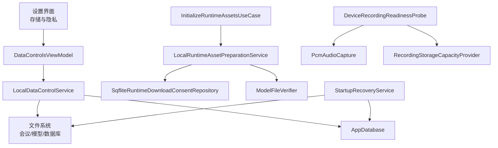
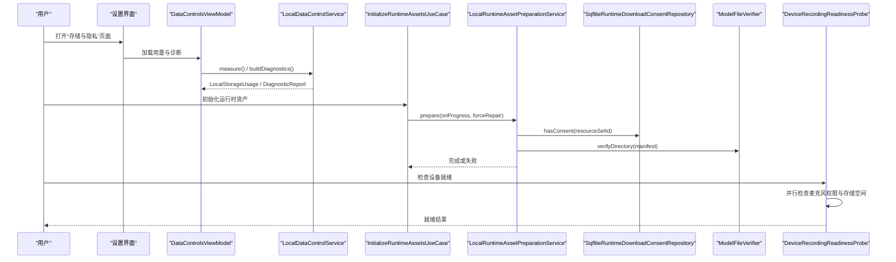
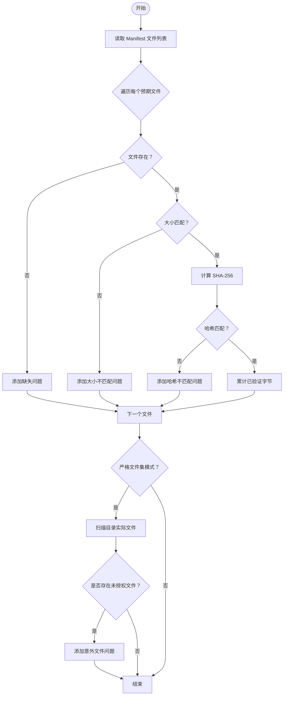
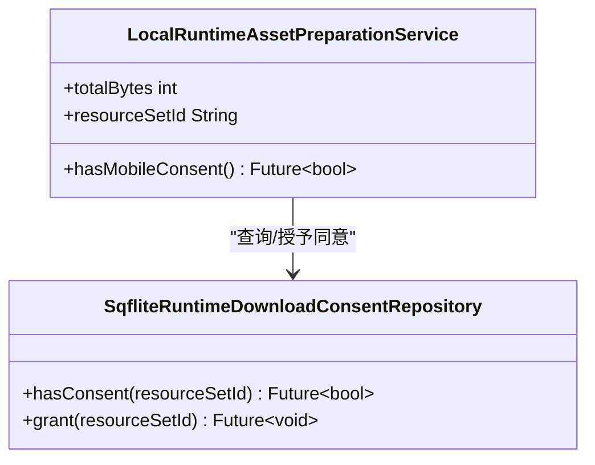
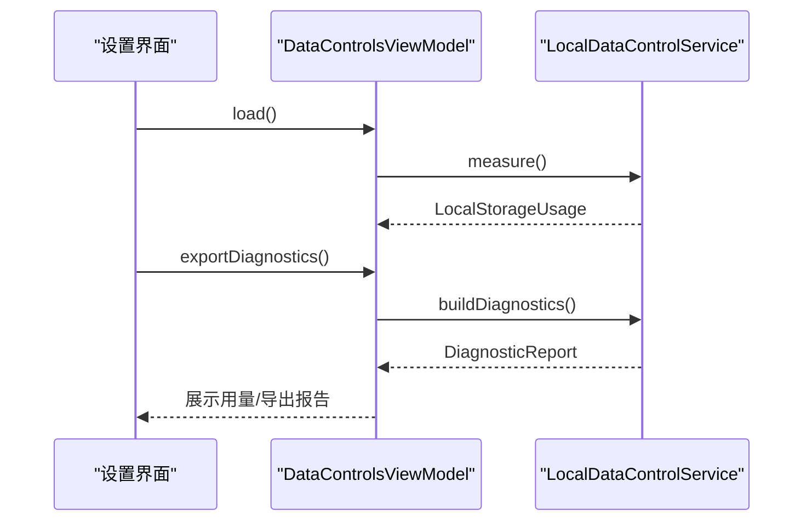
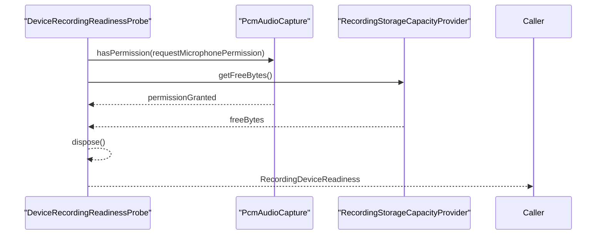
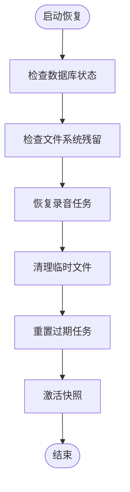
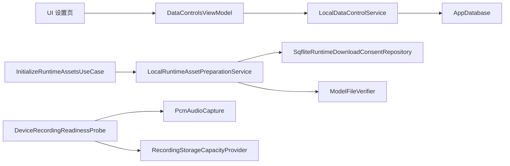

# 安全与隐私

<cite>
**本文引用的文件**   
- [lib/data/services/models/model_file_verifier.dart](file://lib/data/services/models/model_file_verifier.dart)
- [test/data/services/models/model_file_verifier_test.dart](file://test/data/services/models/model_file_verifier_test.dart)
- [lib/data/services/models/local_runtime_asset_preparation_service.dart](file://lib/data/services/models/local_runtime_asset_preparation_service.dart)
- [lib/domain/ports/runtime_asset_preparation.dart](file://lib/domain/ports/runtime_asset_preparation.dart)
- [lib/data/repositories/sqflite_runtime_download_consent_repository.dart](file://lib/data/repositories/sqflite_runtime_download_consent_repository.dart)
- [lib/data/services/storage/local_data_control_service.dart](file://lib/data/services/storage/local_data_control_service.dart)
- [lib/ui/features/settings/views/model_settings_view.dart](file://lib/ui/features/settings/views/model_settings_view.dart)
- [lib/ui/features/settings/view_models/data_controls_view_model.dart](file://lib/ui/features/settings/view_models/data_controls_view_model.dart)
- [android/app/src/main/AndroidManifest.xml](file://android/app/src/main/AndroidManifest.xml)
- [ios/Runner/Info.plist](file://ios/Runner/Info.plist)
- [lib/data/services/audio/recording_device_readiness_probe.dart](file://lib/data/services/audio/recording_device_readiness_probe.dart)
- [test/domain/use_cases/check_meeting_readiness_test.dart](file://test/domain/use_cases/check_meeting_readiness_test.dart)
- [analysis_options.yaml](file://analysis_options.yaml)
- [.agents/skills/impeccable/scripts/hook-lib.mjs](file://.agents/skills/impeccable/scripts/hook-lib.mjs)
- [lib/data/services/asr/sherpa_onnx/sherpa_onnx_asr_engine.dart](file://lib/data/services/asr/sherpa_onnx/sherpa_onnx_asr_engine.dart)
- [lib/data/services/storage/startup_recovery_service.dart](file://lib/data/services/storage/startup_recovery_service.dart)
- [test/data/services/storage/startup_recovery_service_test.dart](file://test/data/services/storage/startup_recovery_service_test.dart)
</cite>

## 目录
1. [简介](#简介)
2. [项目结构](#项目结构)
3. [核心组件](#核心组件)
4. [架构总览](#架构总览)
5. [详细组件分析](#详细组件分析)
6. [依赖关系分析](#依赖关系分析)
7. [性能与安全考量](#性能与安全考量)
8. [故障排查指南](#故障排查指南)
9. [结论](#结论)
10. [附录](#附录)

## 简介
本文件面向会迹（MeetTrace）项目的安全与隐私保护，覆盖以下关键主题：
- 数据安全策略：本地存储与模型文件的完整性校验、敏感信息最小化暴露、数据传输安全建议。
- 隐私保护措施：用户数据最小化收集、运行时下载同意机制、数据保留与清理策略。
- 权限管理最佳实践：最小权限原则、运行时权限请求、权限撤销处理。
- 模型文件安全：完整性验证、来源验证、恶意软件防护。
- 安全审计与漏洞扫描：静态代码分析、动态测试、渗透测试建议。
- 安全事件响应与灾难恢复：启动恢复、崩溃恢复、可观测性与诊断导出。

## 项目结构
本项目为 Flutter 跨平台应用，涉及 Android/iOS 原生配置、Dart 业务逻辑与测试。与安全相关的关键位置包括：
- 平台清单与权限声明：Android Manifest、iOS Info.plist
- 运行时资产准备与同意：模型下载与安装流程中的同意记录
- 模型文件完整性校验：SHA-256、大小、严格文件集检查
- 本地数据存储与用量测量：会议录音、转录、模型文件统计与诊断报告
- 设备就绪与权限探测：麦克风权限、存储空间检测
- 启动恢复与崩溃恢复：中断的录音任务、临时文件清理
- 静态分析与钩子脚本：代码质量与敏感文件规避

**图表来源** 
- [lib/ui/features/settings/views/model_settings_view.dart:108-146](file://lib/ui/features/settings/views/model_settings_view.dart#L108-L146)
- [lib/ui/features/settings/view_models/data_controls_view_model.dart:1-49](file://lib/ui/features/settings/view_models/data_controls_view_model.dart#L1-L49)
- [lib/data/services/storage/local_data_control_service.dart:1-107](file://lib/data/services/storage/local_data_control_service.dart#L1-L107)
- [lib/data/services/models/local_runtime_asset_preparation_service.dart:37-51](file://lib/data/services/models/local_runtime_asset_preparation_service.dart#L37-L51)
- [lib/data/repositories/sqflite_runtime_download_consent_repository.dart:1-43](file://lib/data/repositories/sqflite_runtime_download_consent_repository.dart#L1-L43)
- [lib/data/services/models/model_file_verifier.dart:1-116](file://lib/data/services/models/model_file_verifier.dart#L1-L116)
- [lib/data/services/audio/recording_device_readiness_probe.dart:1-34](file://lib/data/services/audio/recording_device_readiness_probe.dart#L1-L34)
- [lib/data/services/storage/startup_recovery_service.dart:1-46](file://lib/data/services/storage/startup_recovery_service.dart#L1-L46)

**章节来源**
- [lib/ui/features/settings/views/model_settings_view.dart:108-146](file://lib/ui/features/settings/views/model_settings_view.dart#L108-L146)
- [lib/ui/features/settings/view_models/data_controls_view_model.dart:1-49](file://lib/ui/features/settings/view_models/data_controls_view_model.dart#L1-L49)
- [lib/data/services/storage/local_data_control_service.dart:1-107](file://lib/data/services/storage/local_data_control_service.dart#L1-L107)
- [lib/data/services/models/local_runtime_asset_preparation_service.dart:37-51](file://lib/data/services/models/local_runtime_asset_preparation_service.dart#L37-L51)
- [lib/data/repositories/sqflite_runtime_download_consent_repository.dart:1-43](file://lib/data/repositories/sqflite_runtime_download_consent_repository.dart#L1-L43)
- [lib/data/services/models/model_file_verifier.dart:1-116](file://lib/data/services/models/model_file_verifier.dart#L1-L116)
- [lib/data/services/audio/recording_device_readiness_probe.dart:1-34](file://lib/data/services/audio/recording_device_readiness_probe.dart#L1-L34)
- [lib/data/services/storage/startup_recovery_service.dart:1-46](file://lib/data/services/storage/startup_recovery_service.dart#L1-L46)

## 核心组件
- 模型文件完整性校验器（ModelFileVerifier）
  - 功能：对模型目录进行存在性、大小、SHA-256 校验，支持严格文件集模式拒绝未授权文件。
  - 输出：结构化问题列表与已验证字节数，便于上层决策与日志上报。
- 运行时资产准备服务（LocalRuntimeAssetPreparationService）
  - 功能：计算资源集合标识（包含模型与 VAD 的文件元数据），查询移动端下载同意状态。
- 运行时下载同意仓库（SqfliteRuntimeDownloadConsentRepository）
  - 功能：持久化“资源集合ID”级别的同意记录，避免重复下载或未经同意的安装。
- 本地数据控制服务（LocalDataControlService）
  - 功能：测量会议、模型、数据库占用空间；生成诊断报告，明确隐私字段不含转录、音频、标题、本地路径等。
- 设备就绪探测（DeviceRecordingReadinessProbe）
  - 功能：并行检查麦克风权限与可用存储空间，确保最小权限与资源可用性。
- 启动恢复服务（StartupRecoveryService）
  - 功能：处理异常中断的录音、清理临时文件、重置过期任务、激活快照，保障数据一致性。

**章节来源**
- [lib/data/services/models/model_file_verifier.dart:1-116](file://lib/data/services/models/model_file_verifier.dart#L1-L116)
- [lib/data/services/models/local_runtime_asset_preparation_service.dart:37-51](file://lib/data/services/models/local_runtime_asset_preparation_service.dart#L37-L51)
- [lib/data/repositories/sqflite_runtime_download_consent_repository.dart:1-43](file://lib/data/repositories/sqflite_runtime_download_consent_repository.dart#L1-L43)
- [lib/data/services/storage/local_data_control_service.dart:1-107](file://lib/data/services/storage/local_data_control_service.dart#L1-L107)
- [lib/data/services/audio/recording_device_readiness_probe.dart:1-34](file://lib/data/services/audio/recording_device_readiness_probe.dart#L1-L34)
- [lib/data/services/storage/startup_recovery_service.dart:1-46](file://lib/data/services/storage/startup_recovery_service.dart#L1-L46)

## 架构总览
下图展示了从用户界面到数据层与安全校验的整体调用链，涵盖权限探测、同意记录、模型校验与诊断导出。

**图表来源** 
- [lib/ui/features/settings/view_models/data_controls_view_model.dart:1-49](file://lib/ui/features/settings/view_models/data_controls_view_model.dart#L1-L49)
- [lib/data/services/storage/local_data_control_service.dart:1-107](file://lib/data/services/storage/local_data_control_service.dart#L1-L107)
- [lib/data/services/models/local_runtime_asset_preparation_service.dart:37-51](file://lib/data/services/models/local_runtime_asset_preparation_service.dart#L37-L51)
- [lib/data/repositories/sqflite_runtime_download_consent_repository.dart:1-43](file://lib/data/repositories/sqflite_runtime_download_consent_repository.dart#L1-L43)
- [lib/data/services/models/model_file_verifier.dart:1-116](file://lib/data/services/models/model_file_verifier.dart#L1-L116)
- [lib/data/services/audio/recording_device_readiness_probe.dart:1-34](file://lib/data/services/audio/recording_device_readiness_probe.dart#L1-L34)

## 详细组件分析

### 模型文件完整性校验（ModelFileVerifier）
- 设计要点
  - 使用 SHA-256 流式哈希校验，避免内存峰值。
  - 支持严格文件集模式，拒绝 Manifest 之外的文件，防止注入恶意内容。
  - 返回结构化问题（缺失、大小不符、哈希不匹配、意外文件），便于上层统一处理。
- 复杂度与性能
  - 时间复杂度 O(N) 文件遍历与哈希计算；空间复杂度取决于文件读取缓冲。
- 错误处理
  - 对每个文件独立校验并累积问题，最终排序输出，保证可观测性。
- 优化建议
  - 对大文件可考虑分块校验与并发校验（注意 I/O 竞争）。
  - 缓存校验结果以避免重复计算。

**图表来源** 
- [lib/data/services/models/model_file_verifier.dart:1-116](file://lib/data/services/models/model_file_verifier.dart#L1-L116)

**章节来源**
- [lib/data/services/models/model_file_verifier.dart:1-116](file://lib/data/services/models/model_file_verifier.dart#L1-L116)
- [test/data/services/models/model_file_verifier_test.dart:1-94](file://test/data/services/models/model_file_verifier_test.dart#L1-L94)

### 运行时资产准备与同意机制（LocalRuntimeAssetPreparationService + SqfliteRuntimeDownloadConsentRepository）
- 设计要点
  - 通过资源集合 ID（包含模型与 VAD 的文件元数据）作为同意粒度，避免重复下载。
  - 同意记录持久化至 SQLite，确保重启后仍有效。
- 数据流
  - 准备阶段计算 resourceSetId，查询是否已有同意；若无则提示用户授权。
  - 授权后写入同意记录，再进行模型下载与安装。
- 隐私影响
  - 仅记录资源集合标识，不上传或泄露具体文件内容。

**图表来源** 
- [lib/data/services/models/local_runtime_asset_preparation_service.dart:37-51](file://lib/data/services/models/local_runtime_asset_preparation_service.dart#L37-L51)
- [lib/data/repositories/sqflite_runtime_download_consent_repository.dart:1-43](file://lib/data/repositories/sqflite_runtime_download_consent_repository.dart#L1-L43)

**章节来源**
- [lib/data/services/models/local_runtime_asset_preparation_service.dart:37-51](file://lib/data/services/models/local_runtime_asset_preparation_service.dart#L37-L51)
- [lib/data/repositories/sqflite_runtime_download_consent_repository.dart:1-43](file://lib/data/repositories/sqflite_runtime_download_consent_repository.dart#L1-L43)

### 本地数据控制与诊断导出（LocalDataControlService）
- 功能
  - 测量会议、模型、数据库占用空间与剩余空间。
  - 生成诊断报告，明确不包含转录、音频、会议标题、本地路径等敏感信息。
- 隐私策略
  - 诊断报告仅包含统计信息与错误码分布，避免泄露用户数据。
- 使用场景
  - 设置页展示存储用量，支持导出诊断用于问题定位。

**图表来源** 
- [lib/ui/features/settings/view_models/data_controls_view_model.dart:1-49](file://lib/ui/features/settings/view_models/data_controls_view_model.dart#L1-L49)
- [lib/data/services/storage/local_data_control_service.dart:1-107](file://lib/data/services/storage/local_data_control_service.dart#L1-L107)

**章节来源**
- [lib/data/services/storage/local_data_control_service.dart:1-107](file://lib/data/services/storage/local_data_control_service.dart#L1-L107)
- [lib/ui/features/settings/view_models/data_controls_view_model.dart:1-49](file://lib/ui/features/settings/view_models/data_controls_view_model.dart#L1-L49)

### 设备就绪与权限探测（DeviceRecordingReadinessProbe）
- 设计要点
  - 并行检查麦克风权限与存储空间，提升响应速度。
  - 在 finally 中释放录音器，避免资源泄漏。
- 权限最小化
  - 仅在需要时请求麦克风权限，且根据用户选择决定是否发起请求。
- 测试结果
  - 验证了权限请求标志位与释放行为符合预期。

**图表来源** 
- [lib/data/services/audio/recording_device_readiness_probe.dart:1-34](file://lib/data/services/audio/recording_device_readiness_probe.dart#L1-L34)

**章节来源**
- [lib/data/services/audio/recording_device_readiness_probe.dart:1-34](file://lib/data/services/audio/recording_device_readiness_probe.dart#L1-L34)
- [test/domain/use_cases/check_meeting_readiness_test.dart:35-83](file://test/domain/use_cases/check_meeting_readiness_test.dart#L35-L83)

### 启动恢复与崩溃恢复（StartupRecoveryService）
- 功能
  - 处理四类残留：录音中断、临时文件、过期任务、快照激活。
  - 保证应用重启后的数据一致性与用户体验。
- 测试覆盖
  - 验证重复运行结果不变，确保幂等性。

**图表来源** 
- [lib/data/services/storage/startup_recovery_service.dart:1-46](file://lib/data/services/storage/startup_recovery_service.dart#L1-L46)

**章节来源**
- [lib/data/services/storage/startup_recovery_service.dart:1-46](file://lib/data/services/storage/startup_recovery_service.dart#L1-L46)
- [test/data/services/storage/startup_recovery_service_test.dart:30-65](file://test/data/services/storage/startup_recovery_service_test.dart#L30-L65)

### 平台权限与隐私声明（Android/iOS）
- Android
  - 声明必要权限：INTERNET、RECORD_AUDIO、FOREGROUND_SERVICE、FOREGROUND_SERVICE_MICROPHONE、POST_NOTIFICATIONS、WAKE_LOCK。
  - 前台服务类型设置为 microphone，确保录音稳定性。
- iOS
  - 声明 NSMicrophoneUsageDescription 与 UIBackgroundModes audio，说明用途与后台能力。
- 隐私影响
  - 权限声明清晰，避免过度索取；前台服务降低后台滥用风险。

**章节来源**
- [android/app/src/main/AndroidManifest.xml:1-57](file://android/app/src/main/AndroidManifest.xml#L1-L57)
- [ios/Runner/Info.plist:1-77](file://ios/Runner/Info.plist#L1-L77)

### 敏感信息保护与代码安全
- 敏感文件规避
  - 钩子脚本定义敏感路径正则，阻止 .env、密钥文件、证书等被误提交或扫描。
- 静态分析
  - analysis_options.yaml 启用严格类型与推断，减少运行时错误。
- ASR 引擎风险监测
  - 设备风险状态监控，内存压力临界时阻断操作，防止崩溃。

**章节来源**
- [.agents/skills/impeccable/scripts/hook-lib.mjs:70-91](file://.agents/skills/impeccable/scripts/hook-lib.mjs#L70-L91)
- [analysis_options.yaml:1-35](file://analysis_options.yaml#L1-L35)
- [lib/data/services/asr/sherpa_onnx/sherpa_onnx_asr_engine.dart:421-473](file://lib/data/services/asr/sherpa_onnx/sherpa_onnx_asr_engine.dart#L421-L473)

## 依赖关系分析
- 组件耦合
  - UI 层通过 ViewModel 访问数据控制服务，解耦 UI 与存储逻辑。
  - 运行时资产准备依赖同意仓库与校验器，形成清晰的职责边界。
- 外部依赖
  - 平台清单与权限声明直接影响运行时行为与隐私合规。
  - 第三方库（如 crypto、path）提供基础能力，需关注版本更新与安全公告。
- 潜在循环依赖
  - 当前分层清晰，未见明显循环依赖。

**图表来源** 
- [lib/ui/features/settings/view_models/data_controls_view_model.dart:1-49](file://lib/ui/features/settings/view_models/data_controls_view_model.dart#L1-L49)
- [lib/data/services/storage/local_data_control_service.dart:1-107](file://lib/data/services/storage/local_data_control_service.dart#L1-L107)
- [lib/data/services/models/local_runtime_asset_preparation_service.dart:37-51](file://lib/data/services/models/local_runtime_asset_preparation_service.dart#L37-L51)
- [lib/data/repositories/sqflite_runtime_download_consent_repository.dart:1-43](file://lib/data/repositories/sqflite_runtime_download_consent_repository.dart#L1-L43)
- [lib/data/services/models/model_file_verifier.dart:1-116](file://lib/data/services/models/model_file_verifier.dart#L1-L116)
- [lib/data/services/audio/recording_device_readiness_probe.dart:1-34](file://lib/data/services/audio/recording_device_readiness_probe.dart#L1-L34)

**章节来源**
- [lib/ui/features/settings/view_models/data_controls_view_model.dart:1-49](file://lib/ui/features/settings/view_models/data_controls_view_model.dart#L1-L49)
- [lib/data/services/storage/local_data_control_service.dart:1-107](file://lib/data/services/storage/local_data_control_service.dart#L1-L107)
- [lib/data/services/models/local_runtime_asset_preparation_service.dart:37-51](file://lib/data/services/models/local_runtime_asset_preparation_service.dart#L37-L51)
- [lib/data/repositories/sqflite_runtime_download_consent_repository.dart:1-43](file://lib/data/repositories/sqflite_runtime_download_consent_repository.dart#L1-L43)
- [lib/data/services/models/model_file_verifier.dart:1-116](file://lib/data/services/models/model_file_verifier.dart#L1-L116)
- [lib/data/services/audio/recording_device_readiness_probe.dart:1-34](file://lib/data/services/audio/recording_device_readiness_probe.dart#L1-L34)

## 性能与安全考量
- 性能
  - 模型校验采用流式哈希，避免内存峰值；并行权限与存储检查提升响应速度。
  - 诊断导出与用量测量应避免阻塞主线程，必要时异步执行。
- 安全
  - 严格文件集模式防止未授权文件注入；同意机制确保用户知情与控制。
  - 平台权限最小化声明，前台服务限制后台滥用。
- 建议
  - 引入端到端加密传输（HTTPS/TLS）与证书固定。
  - 定期更新第三方库与系统权限策略。
  - 增加动态安全测试与渗透测试覆盖率。

## 故障排查指南
- 常见问题
  - 模型校验失败：检查文件缺失、大小不符、哈希不匹配、意外文件。
  - 权限不足：确认麦克风权限与前台服务类型配置。
  - 存储空间不足：提示用户清理或扩展存储。
  - 启动恢复异常：检查数据库与文件系统状态，查看诊断报告。
- 工具与方法
  - 使用诊断导出获取存储用量与错误码分布。
  - 通过单元测试验证权限请求与资源释放行为。
  - 结合静态分析工具（dart analyze）发现潜在问题。

**章节来源**
- [lib/data/services/models/model_file_verifier.dart:1-116](file://lib/data/services/models/model_file_verifier.dart#L1-L116)
- [android/app/src/main/AndroidManifest.xml:1-57](file://android/app/src/main/AndroidManifest.xml#L1-L57)
- [lib/data/services/storage/local_data_control_service.dart:1-107](file://lib/data/services/storage/local_data_control_service.dart#L1-L107)
- [analysis_options.yaml:1-35](file://analysis_options.yaml#L1-L35)

## 结论
会迹项目在安全与隐私方面具备良好基础：模型文件完整性校验、运行时同意机制、平台权限最小化、诊断导出与启动恢复。建议进一步引入传输加密、动态安全测试与渗透测试，持续完善安全治理体系。

## 附录
- 术语表
  - 资源集合 ID：由模型与 VAD 文件元数据生成的唯一标识，用于同意粒度控制。
  - 严格文件集模式：拒绝 Manifest 之外的文件，防止恶意注入。
  - 诊断报告：包含存储用量、错误码分布与隐私字段声明的结构化数据。
- 参考实现
  - 模型校验：[lib/data/services/models/model_file_verifier.dart:1-116](file://lib/data/services/models/model_file_verifier.dart#L1-L116)
  - 同意机制：[lib/data/repositories/sqflite_runtime_download_consent_repository.dart:1-43](file://lib/data/repositories/sqflite_runtime_download_consent_repository.dart#L1-L43)
  - 权限探测：[lib/data/services/audio/recording_device_readiness_probe.dart:1-34](file://lib/data/services/audio/recording_device_readiness_probe.dart#L1-L34)
  - 启动恢复：[lib/data/services/storage/startup_recovery_service.dart:1-46](file://lib/data/services/storage/startup_recovery_service.dart#L1-L46)