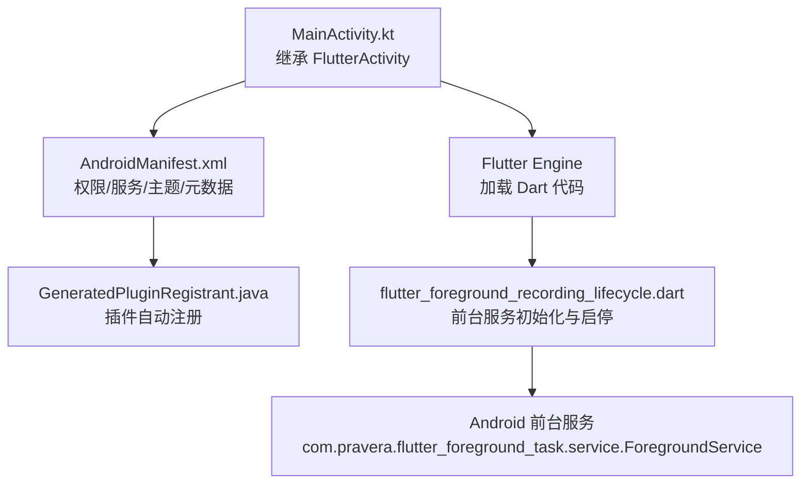
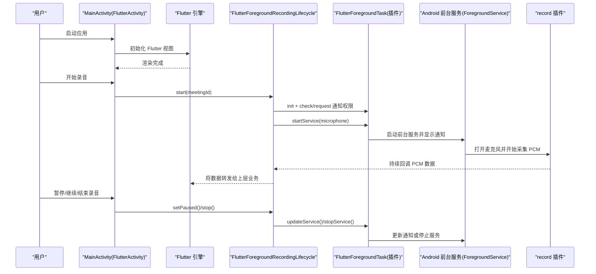
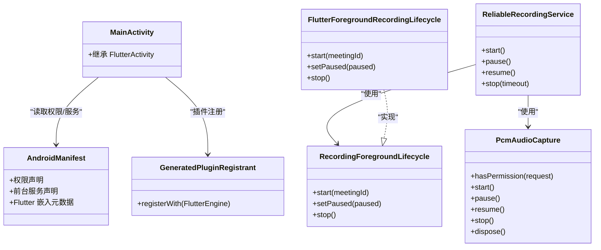

# Android 平台集成

<cite>
**本文引用的文件**   
- [MainActivity.kt](file://android/app/src/main/kotlin/com/example/meettrace/MainActivity.kt)
- [AndroidManifest.xml](file://android/app/src/main/AndroidManifest.xml)
- [GeneratedPluginRegistrant.java](file://android/app/src/main/java/io/flutter/plugins/GeneratedPluginRegistrant.java)
- [build.gradle.kts（app）](file://android/app/build.gradle.kts)
- [flutter_foreground_recording_lifecycle.dart](file://lib/data/services/audio/flutter_foreground_recording_lifecycle.dart)
- [platform_recording_foreground_lifecycle.dart](file://lib/data/services/audio/platform_recording_foreground_lifecycle.dart)
- [recording_ports.dart](file://lib/data/services/audio/recording_ports.dart)
- [reliable_recording_service.dart](file://lib/data/services/audio/reliable_recording_service.dart)
- [Step_07_可靠录音与崩溃恢复.md](file://docs/quality/Step_07_可靠录音与崩溃恢复.md)
</cite>

## 目录
1. [简介](#简介)
2. [项目结构](#项目结构)
3. [核心组件](#核心组件)
4. [架构总览](#架构总览)
5. [详细组件分析](#详细组件分析)
6. [依赖关系分析](#依赖关系分析)
7. [性能考虑](#性能考虑)
8. [故障排查指南](#故障排查指南)
9. [结论](#结论)

## 简介
本文件面向会迹（MeetTrace）在 Android 平台的集成与运行，聚焦以下目标：
- MainActivity 配置与 FlutterActivity 继承关系、生命周期与事件处理、插件注册机制
- AndroidManifest.xml 权限声明（麦克风、存储、网络、前台服务、通知等）
- 前台服务实现（音频录制时的前台状态、通知栏显示、用户交互）
- 后台任务处理机制（录音中断恢复、内存管理、电池优化）
- Android 特定性能优化建议（内存泄漏防护、线程管理、资源释放）
- 常见问题与解决方案（权限拒绝、系统兼容性、版本适配）

## 项目结构
Android 端关键结构与职责：
- MainActivity：Flutter 宿主 Activity，继承 FlutterActivity，作为应用入口
- AndroidManifest.xml：声明权限、主题、启动 Activity、前台服务、Flutter 嵌入元数据
- GeneratedPluginRegistrant.java：Flutter 自动生成的插件注册表，包含 record、foreground_task、sqflite、shared_preferences 等
- build.gradle.kts（app）：编译 SDK、Java/Kotlin 版本、minSdk/targetSdk、签名与构建变体
- 前台录音生命周期：Dart 层通过 flutter_foreground_task 启动 Android 前台服务并维护通知

图表来源
- [MainActivity.kt:1-6](file://android/app/src/main/kotlin/com/example/meettrace/MainActivity.kt#L1-L6)
- [AndroidManifest.xml:1-57](file://android/app/src/main/AndroidManifest.xml#L1-L57)
- [GeneratedPluginRegistrant.java:1-75](file://android/app/src/main/java/io/flutter/plugins/GeneratedPluginRegistrant.java#L1-L75)
- [flutter_foreground_recording_lifecycle.dart:1-106](file://lib/data/services/audio/flutter_foreground_recording_lifecycle.dart#L1-L106)

章节来源
- [MainActivity.kt:1-6](file://android/app/src/main/kotlin/com/example/meettrace/MainActivity.kt#L1-L6)
- [AndroidManifest.xml:1-57](file://android/app/src/main/AndroidManifest.xml#L1-L57)
- [build.gradle.kts（app）:1-60](file://android/app/build.gradle.kts#L1-L60)

## 核心组件
- MainActivity：轻量宿主，直接继承 FlutterActivity，无额外逻辑，便于 Flutter 引擎接管生命周期
- AndroidManifest：集中声明权限与服务类型，确保录音与前台服务合规
- 插件注册：GeneratedPluginRegistrant 自动注册 record、flutter_foreground_task、sqflite、shared_preferences 等
- 前台录音生命周期：Dart 层封装 flutter_foreground_task，统一处理通知、权限、服务启停与暂停/恢复

章节来源
- [MainActivity.kt:1-6](file://android/app/src/main/kotlin/com/example/meettrace/MainActivity.kt#L1-L6)
- [AndroidManifest.xml:1-57](file://android/app/src/main/AndroidManifest.xml#L1-L57)
- [GeneratedPluginRegistrant.java:1-75](file://android/app/src/main/java/io/flutter/plugins/GeneratedPluginRegistrant.java#L1-L75)
- [flutter_foreground_recording_lifecycle.dart:1-106](file://lib/data/services/audio/flutter_foreground_recording_lifecycle.dart#L1-L106)

## 架构总览
下图展示从 Activity 到 Flutter 引擎、再到前台服务与录音主链的调用关系。

图表来源
- [MainActivity.kt:1-6](file://android/app/src/main/kotlin/com/example/meettrace/MainActivity.kt#L1-L6)
- [flutter_foreground_recording_lifecycle.dart:1-106](file://lib/data/services/audio/flutter_foreground_recording_lifecycle.dart#L1-L106)
- [AndroidManifest.xml:35-38](file://android/app/src/main/AndroidManifest.xml#L35-L38)

## 详细组件分析

### MainActivity 与 FlutterActivity 继承关系
- MainActivity 仅继承 FlutterActivity，不重写生命周期方法，由 Flutter 引擎统一管理 UI 生命周期
- 适合保持原生侧最小侵入，所有业务逻辑下沉至 Dart 层

章节来源
- [MainActivity.kt:1-6](file://android/app/src/main/kotlin/com/example/meettrace/MainActivity.kt#L1-L6)

### AndroidManifest.xml 权限与服务配置
- 权限声明：
  - 网络：INTERNET
  - 麦克风：RECORD_AUDIO
  - 前台服务：FOREGROUND_SERVICE、FOREGROUND_SERVICE_MICROPHONE
  - 通知：POST_NOTIFICATIONS（Android 13+）
  - 唤醒锁：WAKE_LOCK
- 应用与 Activity：
  - 标签为“会迹”，使用 Flutter 正常主题
  - launchMode=singleTop，taskAffinity 为空，避免任务栈异常
  - configChanges 覆盖屏幕方向、键盘、尺寸、字体、UI 模式等
  - hardwareAccelerated=true，windowSoftInputMode=adjustResize
- 前台服务：
  - 使用 com.pravera.flutter_foreground_task.service.ForegroundService
  - foregroundServiceType=microphone，满足 Android 14+ 前台服务类型要求
- Flutter 嵌入元数据：flutterEmbedding=2

章节来源
- [AndroidManifest.xml:1-57](file://android/app/src/main/AndroidManifest.xml#L1-L57)

### 插件注册机制（GeneratedPluginRegistrant）
- 自动注册的插件包括：
  - audioplayers、connectivity_plus、disk_space_2、flutter_foreground_task、integration_test、jni/jni_flutter、record_android、share_plus、shared_preferences_android、sqflite_android
- 注册过程包裹 try-catch，单个插件失败不影响整体启动

章节来源
- [GeneratedPluginRegistrant.java:1-75](file://android/app/src/main/java/io/flutter/plugins/GeneratedPluginRegistrant.java#L1-L75)

### 前台服务与通知（flutter_foreground_task）
- 初始化：设置 Android 通知渠道（会议录音）、描述、仅提示一次
- 权限检查：Android 上检查并请求通知权限
- 服务启停：
  - startService：serviceId=7001，serviceTypes=[microphone]，标题与文案明确当前状态
  - stopService：确保服务关闭并清理状态
- 暂停/恢复：updateService 动态更新通知文案，体现“已暂停/正在录音”
- 回调入口：meetTraceRecordingForegroundCallback 设置 TaskHandler，用于后台保活

章节来源
- [flutter_foreground_recording_lifecycle.dart:1-106](file://lib/data/services/audio/flutter_foreground_recording_lifecycle.dart#L1-L106)

### 平台选择与生命周期抽象
- createRecordingForegroundLifecycle：根据平台返回具体实现
  - Android：FlutterForegroundRecordingLifecycle
  - iOS/Windows：NoopRecordingForegroundLifecycle（不启动 Android 前台服务）
- _currentPlatform：基于 dart:io 判断 Platform.isXxx

章节来源
- [platform_recording_foreground_lifecycle.dart:1-32](file://lib/data/services/audio/platform_recording_foreground_lifecycle.dart#L1-L32)

### 录音端口与预览分发
- PcmAudioCapture：定义权限检查、start/pause/resume/stop/dispose 接口
- RecordingForegroundLifecycle：start/setPaused/stop 三态控制
- RecordingPreviewSink：分派 PCM 块给多个消费者，支持丢弃、回调、扇出
- RecordingPreviewDispatcher：有界队列、丢弃策略、非阻塞派发，保证事实写入不受预览影响

章节来源
- [recording_ports.dart:1-147](file://lib/data/services/audio/recording_ports.dart#L1-L147)

### 可靠录音服务（ReliableRecordingService）
- 默认 capture.stop 超时时间：5 秒，避免无界等待导致界面卡死
- 流程要点：
  - 启动前进行权限与存储空间预检
  - PCM 块按“写盘 flush → checkpoint 双代 → preview 派发”提交
  - 预览阻塞或抛错不影响事实文件写入
  - 支持暂停/恢复、显式 flush、停止与临时文件原子封存

章节来源
- [reliable_recording_service.dart:1-34](file://lib/data/services/audio/reliable_recording_service.dart#L1-L34)
- [Step_07_可靠录音与崩溃恢复.md:1-38](file://docs/quality/Step_07_可靠录音与崩溃恢复.md#L1-L38)

### Gradle 构建配置（app）
- compileSdk/targetSdk：由 Flutter 提供
- Java/Kotlin 版本：JVM 17
- minSdk=24，targetSdk 跟随 Flutter
- 构建变体：release 使用 debug 签名（开发阶段），applicationIdSuffix/versionNameSuffix 支持回放测试包名后缀

章节来源
- [build.gradle.kts（app）:1-60](file://android/app/build.gradle.kts#L1-L60)

## 依赖关系分析
- MainActivity 依赖 FlutterActivity（宿主）
- AndroidManifest 声明前台服务与权限，供系统级能力启用
- GeneratedPluginRegistrant 依赖各插件实现类，由 Flutter 工具生成
- Dart 层通过 flutter_foreground_task 与 Android 前台服务通信
- reliable_recording_service 依赖 PcmAudioCapture、RecordingForegroundLifecycle、StorageCapacityProvider 等端口

图表来源
- [MainActivity.kt:1-6](file://android/app/src/main/kotlin/com/example/meettrace/MainActivity.kt#L1-L6)
- [AndroidManifest.xml:1-57](file://android/app/src/main/AndroidManifest.xml#L1-L57)
- [GeneratedPluginRegistrant.java:1-75](file://android/app/src/main/java/io/flutter/plugins/GeneratedPluginRegistrant.java#L1-L75)
- [flutter_foreground_recording_lifecycle.dart:1-106](file://lib/data/services/audio/flutter_foreground_recording_lifecycle.dart#L1-L106)
- [recording_ports.dart:1-147](file://lib/data/services/audio/recording_ports.dart#L1-L147)
- [reliable_recording_service.dart:1-34](file://lib/data/services/audio/reliable_recording_service.dart#L1-L34)

## 性能考虑
- 内存管理
  - 预览队列有界且可丢弃，避免背压导致 OOM
  - 捕获流 dispose 及时释放，防止内存泄漏
  - 使用 WAKE_LOCK 谨慎开启，仅在必要阶段持有
- 线程与 I/O
  - 录音数据写入采用 flush 与 checkpoint 双代，降低丢帧风险
  - 预览与事实写入解耦，预览阻塞不影响持久化
- 资源释放
  - stop 增加超时保护，避免无界等待
  - 前台服务停止后清理通知与锁资源
- 电池优化
  - 允许 autoRestart=false，避免不必要的重启
  - 仅在录音期间保持 WakeLock/WifiLock 按需开启

[本节为通用指导，不直接分析具体文件]

## 故障排查指南
- 权限拒绝
  - 现象：无法录音或无法显示通知
  - 排查：确认 RECORD_AUDIO、POST_NOTIFICATIONS、FOREGROUND_SERVICE_MICROPHONE 已声明；运行时检查通知权限并引导用户授权
- 前台服务崩溃或无法启动
  - 现象：通知未出现或录音中断
  - 排查：确认 serviceTypes=[microphone]、foregroundServiceType=microphone；检查是否重复启动服务；查看日志中 ServiceRequestFailure
- 系统兼容性问题
  - Android 13+：通知权限必须运行时申请
  - Android 14+：前台服务类型必须声明 microphone
- 保存一直显示“正在保存”
  - 根因：capture.stop 无界等待
  - 解决：引入默认 5 秒超时，超时后取消订阅并后台清理，确保 UI 响应

章节来源
- [AndroidManifest.xml:1-57](file://android/app/src/main/AndroidManifest.xml#L1-L57)
- [flutter_foreground_recording_lifecycle.dart:1-106](file://lib/data/services/audio/flutter_foreground_recording_lifecycle.dart#L1-L106)
- [reliable_recording_service.dart:1-34](file://lib/data/services/audio/reliable_recording_service.dart#L1-L34)
- [Step_07_可靠录音与崩溃恢复.md:1-38](file://docs/quality/Step_07_可靠录音与崩溃恢复.md#L1-L38)

## 结论
会迹在 Android 平台以 FlutterActivity 为宿主，借助 flutter_foreground_task 与 record 插件实现稳定可靠的录音与前台服务。通过严格的权限声明、有界预览队列、超时保护与 checkpoint 机制，保障长时录音的稳定性与用户体验。建议在后续迭代中持续关注 Android 版本差异与系统限制，完善权限引导与错误反馈，进一步提升兼容性与健壮性。