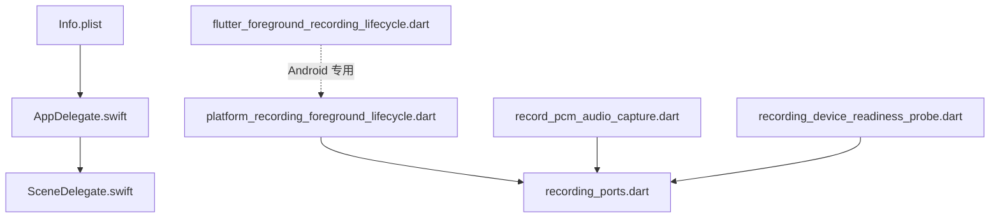
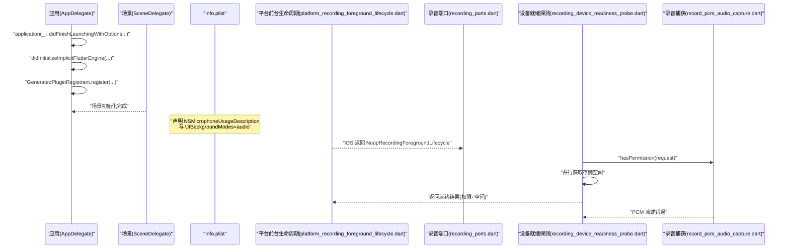
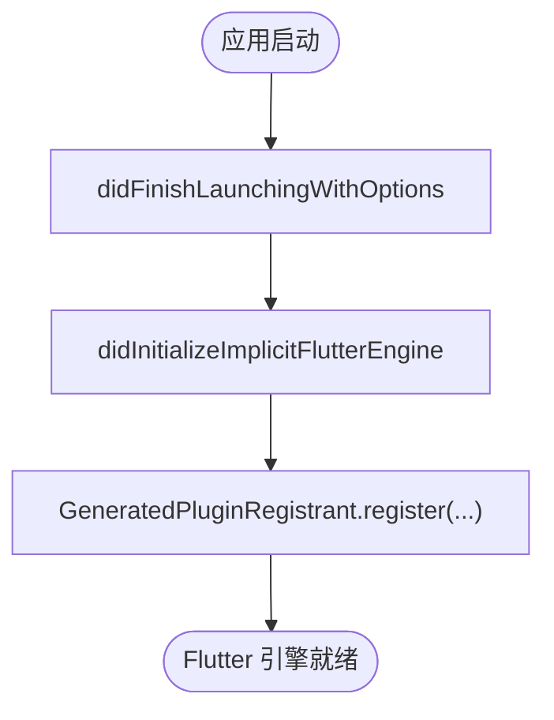
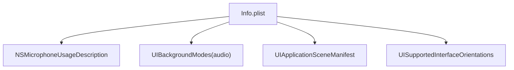
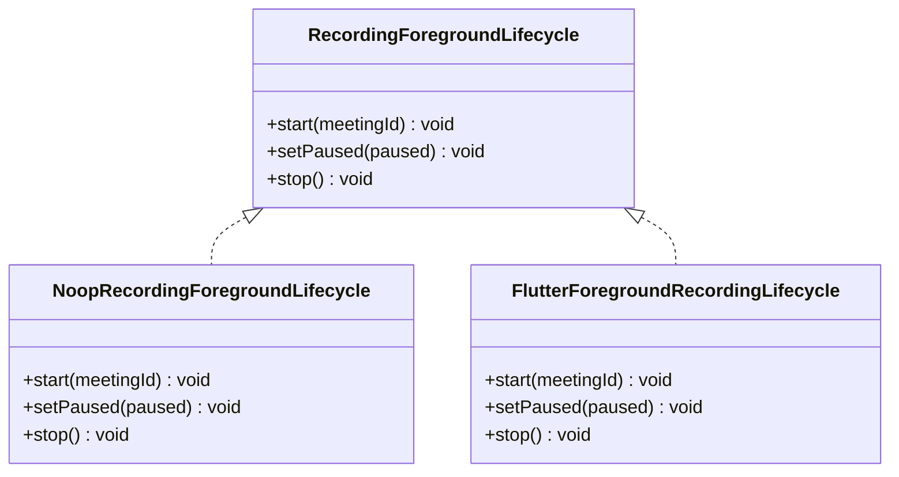
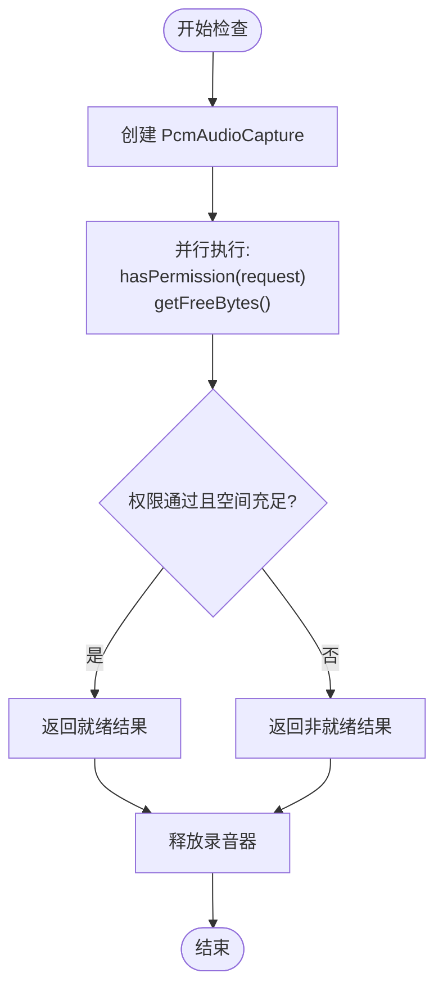
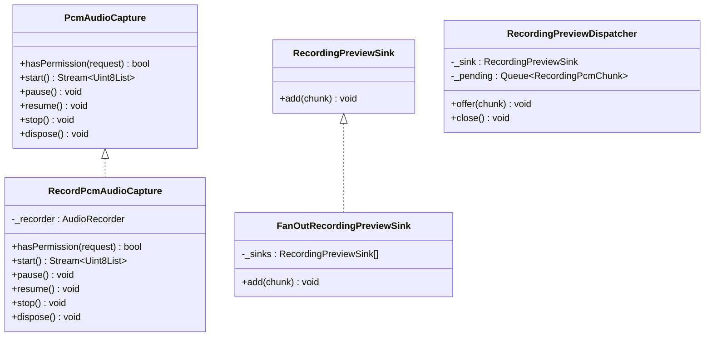
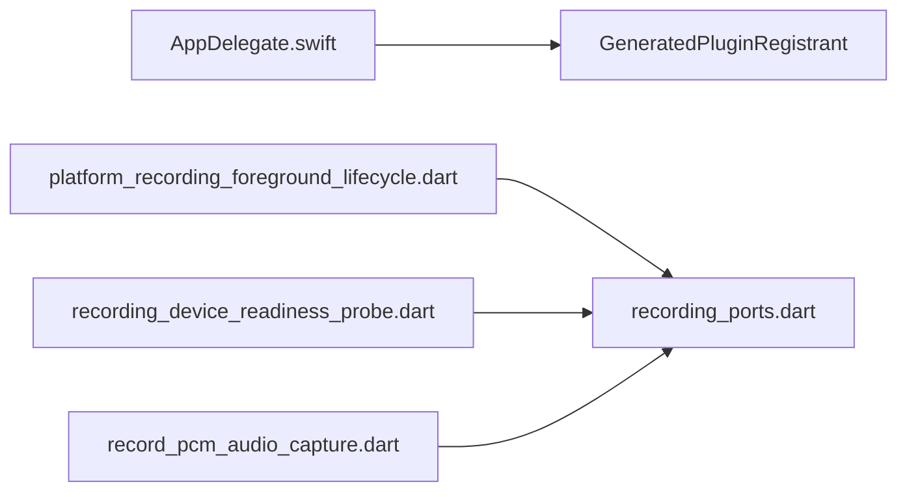

# iOS 平台集成

<cite>
**本文引用的文件**   
- [AppDelegate.swift](file://ios/Runner/AppDelegate.swift)
- [Info.plist](file://ios/Runner/Info.plist)
- [SceneDelegate.swift](file://ios/Runner/SceneDelegate.swift)
- [platform_recording_foreground_lifecycle.dart](file://lib/data/services/audio/platform_recording_foreground_lifecycle.dart)
- [recording_ports.dart](file://lib/data/services/audio/recording_ports.dart)
- [record_pcm_audio_capture.dart](file://lib/data/services/audio/record_pcm_audio_capture.dart)
- [recording_device_readiness_probe.dart](file://lib/data/services/audio/recording_device_readiness_probe.dart)
- [flutter_foreground_recording_lifecycle.dart](file://lib/data/services/audio/flutter_foreground_recording_lifecycle.dart)
- [ios_recording_configuration_test.dart](file://test/data/services/audio/ios_recording_configuration_test.dart)
</cite>

## 目录
1. [简介](#简介)
2. [项目结构](#项目结构)
3. [核心组件](#核心组件)
4. [架构总览](#架构总览)
5. [详细组件分析](#详细组件分析)
6. [依赖关系分析](#依赖关系分析)
7. [性能考虑](#性能考虑)
8. [故障排查指南](#故障排查指南)
9. [结论](#结论)
10. [附录](#附录)

## 简介
本文件面向会迹项目的 iOS 平台集成，聚焦以下目标：
- AppDelegate 配置与生命周期管理（启动、暂停、恢复）
- Info.plist 权限声明（麦克风、后台音频等）
- 音频会话管理（AVAudioSession 类别、路由变化处理策略）
- 后台任务调度机制（iOS 的 audio 后台模式与 Flutter 前台服务差异）
- iOS 特定性能优化建议（内存、电池、CPU）
- 常见问题与解决方案（权限流程、系统版本兼容、沙盒限制）

## 项目结构
iOS 原生入口由 AppDelegate 与 SceneDelegate 组成，应用元数据与权限在 Info.plist 中声明。Flutter 侧通过 record 插件进行 PCM 采集，并通过平台抽象层决定 iOS 是否使用 Android 的前台录音服务（iOS 不使用）。

**图表来源** 
- [AppDelegate.swift:1-17](file://ios/Runner/AppDelegate.swift#L1-L17)
- [SceneDelegate.swift:1-7](file://ios/Runner/SceneDelegate.swift#L1-L7)
- [Info.plist:1-77](file://ios/Runner/Info.plist#L1-L77)
- [platform_recording_foreground_lifecycle.dart:1-33](file://lib/data/services/audio/platform_recording_foreground_lifecycle.dart#L1-L33)
- [recording_ports.dart:1-147](file://lib/data/services/audio/recording_ports.dart#L1-L147)
- [record_pcm_audio_capture.dart:40-77](file://lib/data/services/audio/record_pcm_audio_capture.dart#L40-L77)
- [recording_device_readiness_probe.dart:1-35](file://lib/data/services/audio/recording_device_readiness_probe.dart#L1-L35)
- [flutter_foreground_recording_lifecycle.dart:1-105](file://lib/data/services/audio/flutter_foreground_recording_lifecycle.dart#L1-L105)

**章节来源**
- [AppDelegate.swift:1-17](file://ios/Runner/AppDelegate.swift#L1-L17)
- [SceneDelegate.swift:1-7](file://ios/Runner/SceneDelegate.swift#L1-L7)
- [Info.plist:1-77](file://ios/Runner/Info.plist#L1-L77)

## 核心组件
- AppDelegate：继承 FlutterAppDelegate，实现隐式引擎初始化回调，注册插件。
- SceneDelegate：继承 FlutterSceneDelegate，承载场景生命周期（当前为空实现）。
- Info.plist：声明应用显示名、包信息、麦克风用途说明、后台音频模式、UI 场景配置等。
- 平台录音前台生命周期：iOS 不启动 Android 前台服务，交由 AVAudioSession 与 audio 后台模式承载。
- 录音端口抽象：定义 PcmAudioCapture、RecordingForegroundLifecycle、PreviewSink 等接口。
- 设备就绪探测：并行检查麦克风权限与存储空间，并释放资源。

**章节来源**
- [AppDelegate.swift:1-17](file://ios/Runner/AppDelegate.swift#L1-L17)
- [SceneDelegate.swift:1-7](file://ios/Runner/SceneDelegate.swift#L1-L7)
- [Info.plist:1-77](file://ios/Runner/Info.plist#L1-L77)
- [platform_recording_foreground_lifecycle.dart:1-33](file://lib/data/services/audio/platform_recording_foreground_lifecycle.dart#L1-L33)
- [recording_ports.dart:1-147](file://lib/data/services/audio/recording_ports.dart#L1-L147)
- [recording_device_readiness_probe.dart:1-35](file://lib/data/services/audio/recording_device_readiness_probe.dart#L1-L35)

## 架构总览
下图展示 iOS 端从应用启动到录音能力就绪的关键路径，以及 Flutter 侧对平台能力的抽象与选择。

**图表来源** 
- [AppDelegate.swift:1-17](file://ios/Runner/AppDelegate.swift#L1-L17)
- [SceneDelegate.swift:1-7](file://ios/Runner/SceneDelegate.swift#L1-L7)
- [Info.plist:1-77](file://ios/Runner/Info.plist#L1-L77)
- [platform_recording_foreground_lifecycle.dart:1-33](file://lib/data/services/audio/platform_recording_foreground_lifecycle.dart#L1-L33)
- [recording_ports.dart:1-147](file://lib/data/services/audio/recording_ports.dart#L1-L147)
- [recording_device_readiness_probe.dart:1-35](file://lib/data/services/audio/recording_device_readiness_probe.dart#L1-L35)
- [record_pcm_audio_capture.dart:40-77](file://lib/data/services/audio/record_pcm_audio_capture.dart#L40-L77)

## 详细组件分析

### AppDelegate 配置与生命周期管理
- 启动流程：重载 application(_:didFinishLaunchingWithOptions:) 委托给父类；实现 didInitializeImplicitFlutterEngine 以在隐式引擎初始化后注册插件。
- 生命周期要点：未覆盖 pause/resume 等方法，默认行为由 Flutter 框架处理；如需自定义（如音频会话切换），可在此扩展。

**图表来源** 
- [AppDelegate.swift:1-17](file://ios/Runner/AppDelegate.swift#L1-L17)

**章节来源**
- [AppDelegate.swift:1-17](file://ios/Runner/AppDelegate.swift#L1-L17)

### Info.plist 权限与后台模式
- 麦克风权限：NSMicrophoneUsageDescription 已声明用途文案。
- 后台音频：UIBackgroundModes 包含 audio，允许后台播放/录制。
- UI 场景：UIApplicationSceneManifest 指定单场景及 Main.storyboard。
- 其他：支持横竖屏方向、iPad 多方向等。

**图表来源** 
- [Info.plist:1-77](file://ios/Runner/Info.plist#L1-L77)

**章节来源**
- [Info.plist:1-77](file://ios/Runner/Info.plist#L1-L77)
- [ios_recording_configuration_test.dart:1-15](file://test/data/services/audio/ios_recording_configuration_test.dart#L1-L15)

### 音频会话管理（AVAudioSession）
- 现状：代码库未直接操作 AVAudioSession；iOS 的持续录音由“audio 后台模式”与 record 插件共同承载。
- 建议实践：
  - 在应用进入会议录音前，设置合适的 AVAudioSession 类别（如 playback+record），并启用允许蓝牙/耳机路由。
  - 监听路由变化（routeChangeNotification），在耳机拔出/插入时调整会话状态。
  - 处理中断（interruptionNotification），在电话来电等场景暂停/恢复录音。
  - 避免与系统媒体控制冲突，必要时设置激活优先级。

[本节为通用指导，不直接分析具体文件]

### 后台任务调度机制
- iOS：通过 Info.plist 的 UIBackgroundModes=audio 启用后台音频能力；无需 Android 风格的前台服务。
- Android：使用 flutter_foreground_task 启动前台服务保持录音；iOS 分支返回空实现（Noop）。
- 协调器：平台抽象 createRecordingForegroundLifecycle 根据平台返回对应实现。

**图表来源** 
- [recording_ports.dart:25-45](file://lib/data/services/audio/recording_ports.dart#L25-L45)
- [platform_recording_foreground_lifecycle.dart:1-33](file://lib/data/services/audio/platform_recording_foreground_lifecycle.dart#L1-L33)
- [flutter_foreground_recording_lifecycle.dart:1-105](file://lib/data/services/audio/flutter_foreground_recording_lifecycle.dart#L1-L105)

**章节来源**
- [platform_recording_foreground_lifecycle.dart:1-33](file://lib/data/services/audio/platform_recording_foreground_lifecycle.dart#L1-L33)
- [flutter_foreground_recording_lifecycle.dart:1-105](file://lib/data/services/audio/flutter_foreground_recording_lifecycle.dart#L1-L105)

### 设备就绪探测与权限流程
- 并行检查：麦克风权限与可用存储空间同时查询，提升响应速度。
- 资源释放：无论成功与否，最终都会释放录音器实例。
- 权限请求：可通过 hasPermission(request: true) 触发系统权限弹窗。

**图表来源** 
- [recording_device_readiness_probe.dart:1-35](file://lib/data/services/audio/recording_device_readiness_probe.dart#L1-L35)
- [recording_ports.dart:7-19](file://lib/data/services/audio/recording_ports.dart#L7-L19)

**章节来源**
- [recording_device_readiness_probe.dart:1-35](file://lib/data/services/audio/recording_device_readiness_probe.dart#L1-L35)

### 录音捕获与预览分发
- 录音捕获：RecordPcmAudioCapture 封装 AudioRecorder，提供权限检查、PCM 流、暂停/恢复、停止与释放。
- 预览分发：FanOutRecordingPreviewSink 将同一块 PCM 分发给多个隔离消费者，失败不影响主链；RecordingPreviewDispatcher 控制队列长度与丢弃策略。

**图表来源** 
- [recording_ports.dart:7-84](file://lib/data/services/audio/recording_ports.dart#L7-L84)
- [record_pcm_audio_capture.dart:40-77](file://lib/data/services/audio/record_pcm_audio_capture.dart#L40-L77)

**章节来源**
- [recording_ports.dart:1-147](file://lib/data/services/audio/recording_ports.dart#L1-L147)
- [record_pcm_audio_capture.dart:40-77](file://lib/data/services/audio/record_pcm_audio_capture.dart#L40-L77)

## 依赖关系分析
- AppDelegate 依赖 Flutter 与 UIKit，并在隐式引擎初始化后注册插件。
- 平台前台生命周期依赖 recording_ports 接口，iOS 返回空实现。
- 设备就绪探测依赖 PcmAudioCapture 与存储容量提供者。
- 录音捕获依赖 record 插件提供的 AudioRecorder。

**图表来源** 
- [AppDelegate.swift:1-17](file://ios/Runner/AppDelegate.swift#L1-L17)
- [platform_recording_foreground_lifecycle.dart:1-33](file://lib/data/services/audio/platform_recording_foreground_lifecycle.dart#L1-L33)
- [recording_device_readiness_probe.dart:1-35](file://lib/data/services/audio/recording_device_readiness_probe.dart#L1-L35)
- [record_pcm_audio_capture.dart:40-77](file://lib/data/services/audio/record_pcm_audio_capture.dart#L40-L77)
- [recording_ports.dart:1-147](file://lib/data/services/audio/recording_ports.dart#L1-L147)

**章节来源**
- [platform_recording_foreground_lifecycle.dart:1-33](file://lib/data/services/audio/platform_recording_foreground_lifecycle.dart#L1-L33)
- [recording_device_readiness_probe.dart:1-35](file://lib/data/services/audio/recording_device_readiness_probe.dart#L1-L35)
- [record_pcm_audio_capture.dart:40-77](file://lib/data/services/audio/record_pcm_audio_capture.dart#L40-L77)
- [recording_ports.dart:1-147](file://lib/data/services/audio/recording_ports.dart#L1-L147)

## 性能考虑
- 内存管理
  - 及时释放录音器与预览分发器，避免长驻对象累积。
  - 控制预览队列长度，防止突发峰值导致内存抖动。
- 电池优化
  - 仅在会议录音期间激活高功耗音频会话；空闲时降低采样率或关闭不必要的处理链。
  - 合理设置后台音频任务，避免频繁唤醒 CPU。
- CPU 使用率控制
  - 使用异步流与背压机制，避免阻塞主线程。
  - 预览与转录链路解耦，失败不阻断事实录音写入。
- I/O 与存储
  - 预检可用空间，不足时提示用户或降级策略。
  - 分块写入与校验点持久化，提高崩溃恢复能力。

[本节为通用指导，不直接分析具体文件]

## 故障排查指南
- 权限问题
  - 确认 Info.plist 已声明 NSMicrophoneUsageDescription。
  - 调用 hasPermission(request: true) 触发系统权限弹窗，并在 UI 层引导用户授权。
- 后台录音无效
  - 确认 UIBackgroundModes 包含 audio。
  - iOS 不依赖 Android 前台服务，确保未误启相关逻辑。
- 路由变化与中断
  - 监听系统通知，处理耳机拔插、电话来电等场景，正确暂停/恢复录音。
- 存储空间不足
  - 启动前检查 getFreeBytes，低于阈值时提示用户清理空间。
- 验证清单
  - 运行测试用例确认 plist 关键键值存在。

**章节来源**
- [Info.plist:1-77](file://ios/Runner/Info.plist#L1-L77)
- [ios_recording_configuration_test.dart:1-15](file://test/data/services/audio/ios_recording_configuration_test.dart#L1-L15)
- [recording_device_readiness_probe.dart:1-35](file://lib/data/services/audio/recording_device_readiness_probe.dart#L1-L35)
- [platform_recording_foreground_lifecycle.dart:1-33](file://lib/data/services/audio/platform_recording_foreground_lifecycle.dart#L1-L33)

## 结论
会迹在 iOS 平台的集成遵循最小必要原则：通过 Info.plist 声明麦克风权限与后台音频模式，AppDelegate 负责插件注册，Flutter 侧通过统一接口抽象平台差异。iOS 不启动 Android 前台服务，而是依赖 AVAudioSession 与系统后台音频能力。建议在应用层完善音频会话管理与路由/中断处理，并结合设备就绪探测与预览分发机制，保障录音可靠性与性能。

[本节为总结性内容，不直接分析具体文件]

## 附录
- 常见权限键位参考
  - NSMicrophoneUsageDescription：麦克风用途说明
  - UIBackgroundModes.audio：后台音频模式
- 推荐的生命周期扩展点
  - AppDelegate 中扩展 pause/resume 以适配系统级音频事件
  - 在 SceneDelegate 中处理场景切换时的音频会话状态

[本节为补充信息，不直接分析具体文件]