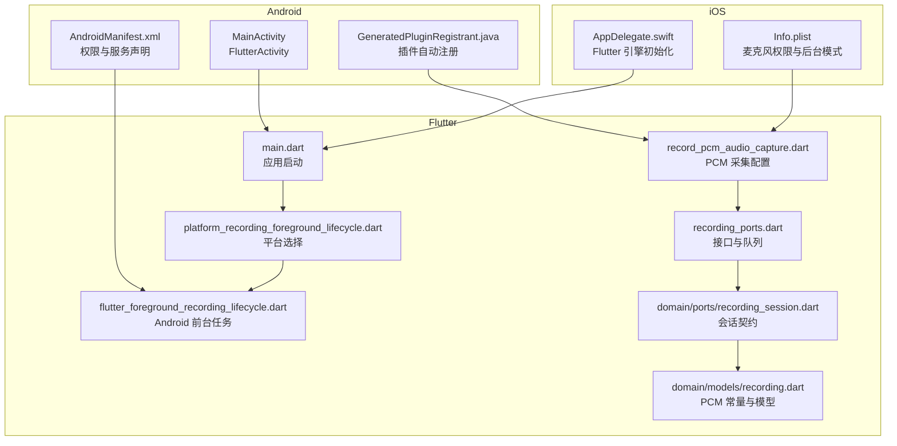
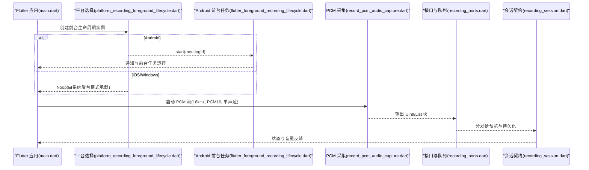
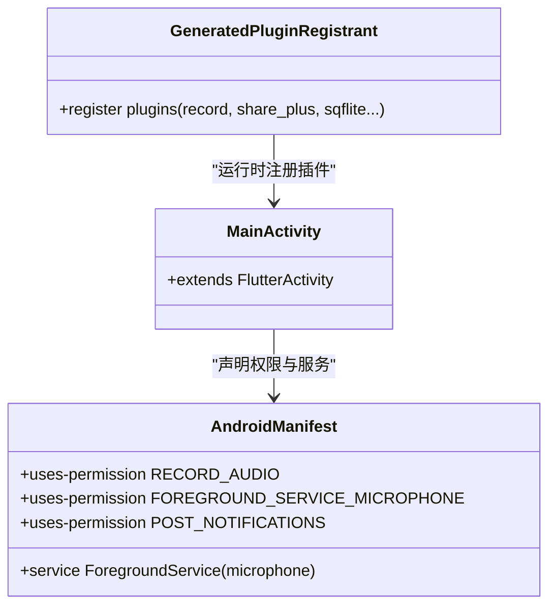
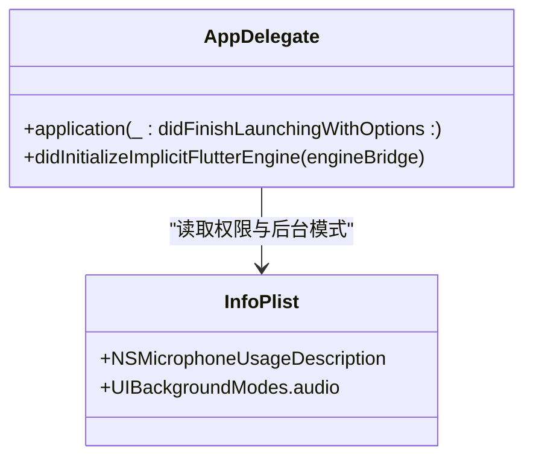
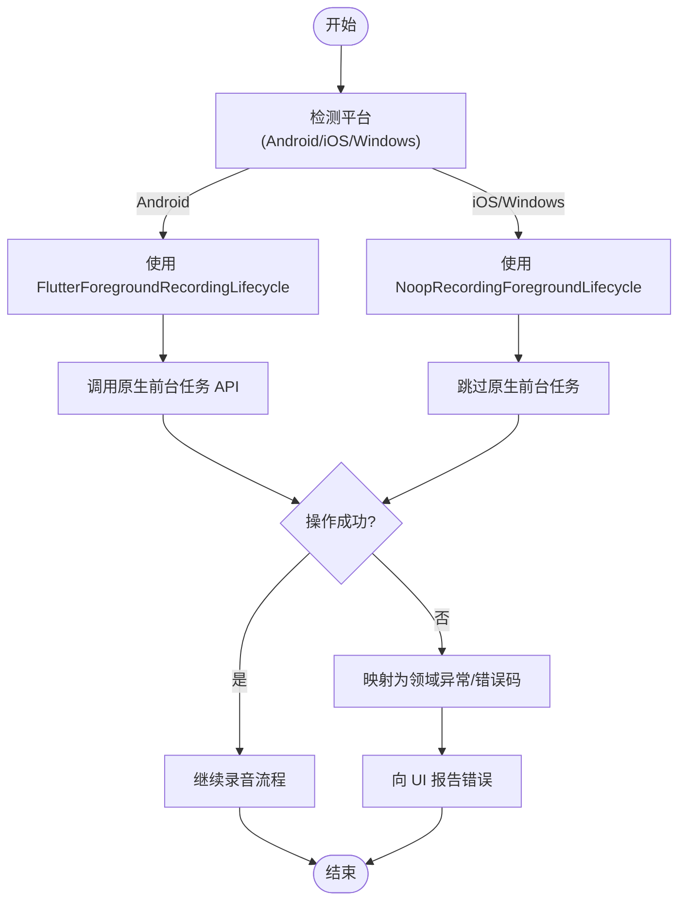
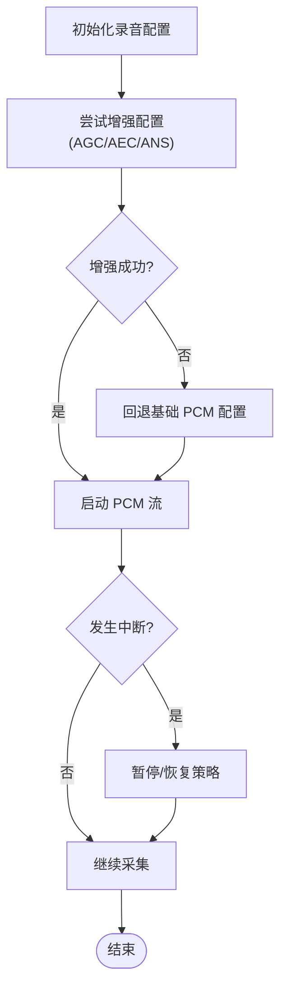
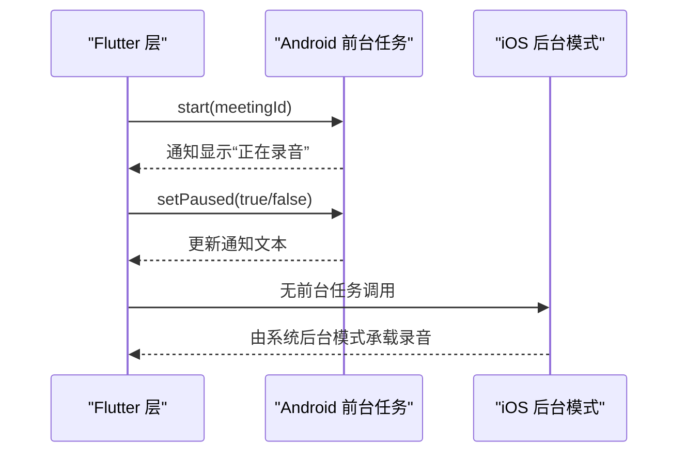
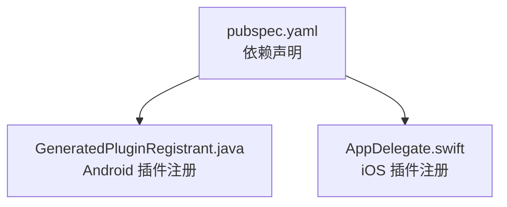

# 平台特定实现

<cite>
**本文引用的文件**   
- [MainActivity.kt](file://android/app/src/main/kotlin/com/example/meettrace/MainActivity.kt)
- [AndroidManifest.xml](file://android/app/src/main/AndroidManifest.xml)
- [GeneratedPluginRegistrant.java](file://android/app/src/main/java/io/flutter/plugins/GeneratedPluginRegistrant.java)
- [AppDelegate.swift](file://ios/Runner/AppDelegate.swift)
- [Info.plist](file://ios/Runner/Info.plist)
- [platform_recording_foreground_lifecycle.dart](file://lib/data/services/audio/platform_recording_foreground_lifecycle.dart)
- [flutter_foreground_recording_lifecycle.dart](file://lib/data/services/audio/flutter_foreground_recording_lifecycle.dart)
- [record_pcm_audio_capture.dart](file://lib/data/services/audio/record_pcm_audio_capture.dart)
- [recording_ports.dart](file://lib/data/services/audio/recording_ports.dart)
- [recording_session.dart](file://lib/domain/ports/recording_session.dart)
- [recording.dart](file://lib/domain/models/recording.dart)
- [main.dart](file://lib/main.dart)
- [pubspec.yaml](file://pubspec.yaml)
</cite>

## 目录
1. [简介](#简介)
2. [项目结构](#项目结构)
3. [核心组件](#核心组件)
4. [架构总览](#架构总览)
5. [详细组件分析](#详细组件分析)
6. [依赖关系分析](#依赖关系分析)
7. [性能与优化建议](#性能与优化建议)
8. [故障排查指南](#故障排查指南)
9. [结论](#结论)

## 简介
本文件面向会迹（MeetTrace）项目的平台特定实现，聚焦 Android 与 iOS 的原生集成、Flutter 与原生平台的通信机制、平台差异的音频处理配置，以及针对内存、电池与性能的优化建议。文档以代码级事实为依据，结合仓库中的测试用例与配置文件，帮助开发者快速理解并正确扩展平台能力。

## 项目结构
- Android 侧通过 FlutterActivity 作为入口，使用系统前台服务与通知保持录音生命周期；权限在清单中声明。
- iOS 侧通过 AppDelegate 初始化 Flutter 引擎并注册插件，使用 Info.plist 声明麦克风权限与后台音频模式。
- Flutter 层通过 record 插件进行 PCM 采集，使用 flutter_foreground_task 管理 Android 前台任务，并通过接口抽象屏蔽平台差异。
- 音频格式统一为 PCM16、16kHz、单声道，保证事实音频与 ASR 输入一致性。

**图表来源** 
- [MainActivity.kt:1-6](file://android/app/src/main/kotlin/com/example/meettrace/MainActivity.kt#L1-L6)
- [AndroidManifest.xml:1-57](file://android/app/src/main/AndroidManifest.xml#L1-L57)
- [GeneratedPluginRegistrant.java:37-65](file://android/app/src/main/java/io/flutter/plugins/GeneratedPluginRegistrant.java#L37-L65)
- [AppDelegate.swift:1-17](file://ios/Runner/AppDelegate.swift#L1-L17)
- [Info.plist:1-77](file://ios/Runner/Info.plist#L1-L77)
- [main.dart:1-13](file://lib/main.dart#L1-L13)
- [platform_recording_foreground_lifecycle.dart:1-33](file://lib/data/services/audio/platform_recording_foreground_lifecycle.dart#L1-L33)
- [flutter_foreground_recording_lifecycle.dart:1-106](file://lib/data/services/audio/flutter_foreground_recording_lifecycle.dart#L1-L106)
- [record_pcm_audio_capture.dart:1-45](file://lib/data/services/audio/record_pcm_audio_capture.dart#L1-L45)
- [recording_ports.dart:1-147](file://lib/data/services/audio/recording_ports.dart#L1-L147)
- [recording_session.dart:1-38](file://lib/domain/ports/recording_session.dart#L1-L38)
- [recording.dart:1-68](file://lib/domain/models/recording.dart#L1-L68)

**章节来源**
- [MainActivity.kt:1-6](file://android/app/src/main/kotlin/com/example/meettrace/MainActivity.kt#L1-L6)
- [AndroidManifest.xml:1-57](file://android/app/src/main/AndroidManifest.xml#L1-L57)
- [AppDelegate.swift:1-17](file://ios/Runner/AppDelegate.swift#L1-L17)
- [Info.plist:1-77](file://ios/Runner/Info.plist#L1-L77)
- [main.dart:1-13](file://lib/main.dart#L1-L13)

## 核心组件
- Android 前台服务与权限：通过清单声明 RECORD_AUDIO、FOREGROUND_SERVICE_MICROPHONE、POST_NOTIFICATIONS 等权限，并使用官方前台服务类型 microphone 保障录音稳定性。
- iOS 音频会话与后台模式：通过 Info.plist 声明 NSMicrophoneUsageDescription 与 UIBackgroundModes.audio，确保后台持续录音。
- Flutter 前台任务：Android 使用 flutter_foreground_task 启动前台任务与通知；iOS 不启动前台任务，由 AVAudioSession 与后台模式承载。
- 音频采集：统一使用 record 插件输出 PCM16、16kHz、单声道，开启自动增益、回声消除、降噪，并在失败时回退到基础 PCM 配置。
- 接口抽象：PcmAudioCapture、RecordingForegroundLifecycle、RecordingPreviewSink 等接口隔离平台差异，便于替换与测试。

**章节来源**
- [AndroidManifest.xml:1-57](file://android/app/src/main/AndroidManifest.xml#L1-L57)
- [Info.plist:1-77](file://ios/Runner/Info.plist#L1-L77)
- [flutter_foreground_recording_lifecycle.dart:1-106](file://lib/data/services/audio/flutter_foreground_recording_lifecycle.dart#L1-L106)
- [record_pcm_audio_capture.dart:1-45](file://lib/data/services/audio/record_pcm_audio_capture.dart#L1-L45)
- [recording_ports.dart:1-147](file://lib/data/services/audio/recording_ports.dart#L1-L147)

## 架构总览
下图展示从 Flutter 启动到平台录音的关键调用链，包括平台选择、前台任务、PCM 采集与预览分发。

**图表来源** 
- [main.dart:1-13](file://lib/main.dart#L1-L13)
- [platform_recording_foreground_lifecycle.dart:1-33](file://lib/data/services/audio/platform_recording_foreground_lifecycle.dart#L1-L33)
- [flutter_foreground_recording_lifecycle.dart:1-106](file://lib/data/services/audio/flutter_foreground_recording_lifecycle.dart#L1-L106)
- [record_pcm_audio_capture.dart:1-45](file://lib/data/services/audio/record_pcm_audio_capture.dart#L1-L45)
- [recording_ports.dart:1-147](file://lib/data/services/audio/recording_ports.dart#L1-L147)
- [recording_session.dart:1-38](file://lib/domain/ports/recording_session.dart#L1-L38)

## 详细组件分析

### Android 平台原生集成
- MainActivity：继承 FlutterActivity，作为应用入口，无需额外桥接逻辑。
- 权限与前台服务：清单声明麦克风、前台服务、通知与唤醒锁；前台服务类型为 microphone，确保录音优先级与稳定性。
- 插件注册：GeneratedPluginRegistrant 自动注册 record、share_plus、sqflite 等插件，避免手动维护。

**图表来源** 
- [MainActivity.kt:1-6](file://android/app/src/main/kotlin/com/example/meettrace/MainActivity.kt#L1-L6)
- [AndroidManifest.xml:1-57](file://android/app/src/main/AndroidManifest.xml#L1-L57)
- [GeneratedPluginRegistrant.java:37-65](file://android/app/src/main/java/io/flutter/plugins/GeneratedPluginRegistrant.java#L37-L65)

**章节来源**
- [MainActivity.kt:1-6](file://android/app/src/main/kotlin/com/example/meettrace/MainActivity.kt#L1-L6)
- [AndroidManifest.xml:1-57](file://android/app/src/main/AndroidManifest.xml#L1-L57)
- [GeneratedPluginRegistrant.java:37-65](file://android/app/src/main/java/io/flutter/plugins/GeneratedPluginRegistrant.java#L37-L65)

### iOS 平台原生集成
- AppDelegate：实现 FlutterAppDelegate 与 FlutterImplicitEngineDelegate，完成引擎隐式初始化与插件注册。
- Info.plist：声明麦克风用途描述与 UIBackgroundModes.audio，确保后台持续录音能力。

**图表来源** 
- [AppDelegate.swift:1-17](file://ios/Runner/AppDelegate.swift#L1-L17)
- [Info.plist:1-77](file://ios/Runner/Info.plist#L1-L77)

**章节来源**
- [AppDelegate.swift:1-17](file://ios/Runner/AppDelegate.swift#L1-L17)
- [Info.plist:1-77](file://ios/Runner/Info.plist#L1-L77)

### Flutter 与原生平台的通信机制
- Platform Channel：通过 record 插件与 flutter_foreground_task 与原生交互，Dart 层仅暴露统一接口。
- 异步调用与错误传递：使用 Future 与 Stream 处理异步结果；异常被封装为领域异常或通用错误码，便于 UI 提示。
- 平台选择：根据 Platform.isXxx 返回不同实现，Android 启用前台任务，iOS/Windows 使用空实现。

**图表来源** 
- [platform_recording_foreground_lifecycle.dart:1-33](file://lib/data/services/audio/platform_recording_foreground_lifecycle.dart#L1-L33)
- [flutter_foreground_recording_lifecycle.dart:1-106](file://lib/data/services/audio/flutter_foreground_recording_lifecycle.dart#L1-L106)
- [recording_ports.dart:1-147](file://lib/data/services/audio/recording_ports.dart#L1-L147)

**章节来源**
- [platform_recording_foreground_lifecycle.dart:1-33](file://lib/data/services/audio/platform_recording_foreground_lifecycle.dart#L1-L33)
- [flutter_foreground_recording_lifecycle.dart:1-106](file://lib/data/services/audio/flutter_foreground_recording_lifecycle.dart#L1-L106)
- [recording_ports.dart:1-147](file://lib/data/services/audio/recording_ports.dart#L1-L147)

### 平台特定的音频处理差异
- 采样率与声道：统一为 16kHz、单声道、PCM16，保证事实音频与 ASR 输入一致。
- 输入增强：优先启用自动增益、回声消除、降噪；若失败则回退到基础 PCM 配置。
- 中断恢复：设置 AudioInterruptionMode.pauseResume，确保通话或通知中断后恢复录音。

**图表来源** 
- [record_pcm_audio_capture.dart:1-45](file://lib/data/services/audio/record_pcm_audio_capture.dart#L1-L45)
- [recording.dart:1-68](file://lib/domain/models/recording.dart#L1-L68)

**章节来源**
- [record_pcm_audio_capture.dart:1-45](file://lib/data/services/audio/record_pcm_audio_capture.dart#L1-L45)
- [recording.dart:1-68](file://lib/domain/models/recording.dart#L1-L68)

### 前台服务与后台任务处理
- Android：通过 flutter_foreground_task 启动前台任务与通知，确保进程不被回收；支持更新通知标题与文本反映暂停/继续状态。
- iOS：不启动前台任务，依靠 AVAudioSession 与 UIBackgroundModes.audio 维持录音；生命周期中断由 record 插件与协调器处理。

**图表来源** 
- [flutter_foreground_recording_lifecycle.dart:1-106](file://lib/data/services/audio/flutter_foreground_recording_lifecycle.dart#L1-L106)
- [platform_recording_foreground_lifecycle.dart:1-33](file://lib/data/services/audio/platform_recording_foreground_lifecycle.dart#L1-L33)

**章节来源**
- [flutter_foreground_recording_lifecycle.dart:1-106](file://lib/data/services/audio/flutter_foreground_recording_lifecycle.dart#L1-L106)
- [platform_recording_foreground_lifecycle.dart:1-33](file://lib/data/services/audio/platform_recording_foreground_lifecycle.dart#L1-L33)

## 依赖关系分析
- Flutter 依赖：record、flutter_foreground_task、audioplayers、sqflite 等通过 pubspec.yaml 声明。
- Android 插件：GeneratedPluginRegistrant 自动注册 record、share_plus、sqflite 等插件。
- iOS 插件：AppDelegate 中通过 GeneratedPluginRegistrant.register 完成插件注册。

**图表来源** 
- [pubspec.yaml:1-112](file://pubspec.yaml#L1-L112)
- [GeneratedPluginRegistrant.java:37-65](file://android/app/src/main/java/io/flutter/plugins/GeneratedPluginRegistrant.java#L37-L65)
- [AppDelegate.swift:1-17](file://ios/Runner/AppDelegate.swift#L1-L17)

**章节来源**
- [pubspec.yaml:1-112](file://pubspec.yaml#L1-L112)
- [GeneratedPluginRegistrant.java:37-65](file://android/app/src/main/java/io/flutter/plugins/GeneratedPluginRegistrant.java#L37-L65)
- [AppDelegate.swift:1-17](file://ios/Runner/AppDelegate.swift#L1-L17)

## 性能与优化建议
- 内存管理
  - 控制预览队列长度，避免积压导致内存峰值；丢弃最旧待处理块，保留最新音频。
  - 及时释放 PcmAudioCapture 资源，避免泄漏。
- 电池优化
  - Android 前台任务允许 WakeLock，但应仅在录音期间持有；避免不必要的 Wi-Fi Lock。
  - iOS 使用后台音频模式，避免频繁唤醒其他子系统。
- 性能调优
  - 固定 PCM 参数（16kHz、PCM16、单声道）减少转码开销。
  - 输入增强失败时快速回退，避免阻塞主流程。
  - 预览与持久化分离，降低 UI 卡顿风险。

[本节为通用指导，不直接分析具体文件]

## 故障排查指南
- Android 权限与前台服务
  - 检查清单是否包含 RECORD_AUDIO、FOREGROUND_SERVICE_MICROPHONE、POST_NOTIFICATIONS。
  - 确认前台服务类型为 microphone，且通知渠道已创建。
- iOS 权限与后台模式
  - 检查 Info.plist 是否包含 NSMicrophoneUsageDescription 与 UIBackgroundModes.audio。
- Flutter 层异常
  - 捕获 record 插件异常并回退到基础 PCM 配置。
  - 前台任务失败时抛出 StateError，需向上层报告。
- 预览队列与丢帧
  - 监控 droppedChunks 指标，调整 maxPendingChunks 平衡延迟与稳定性。

**章节来源**
- [AndroidManifest.xml:1-57](file://android/app/src/main/AndroidManifest.xml#L1-L57)
- [Info.plist:1-77](file://ios/Runner/Info.plist#L1-L77)
- [flutter_foreground_recording_lifecycle.dart:1-106](file://lib/data/services/audio/flutter_foreground_recording_lifecycle.dart#L1-L106)
- [record_pcm_audio_capture.dart:1-45](file://lib/data/services/audio/record_pcm_audio_capture.dart#L1-L45)
- [recording_ports.dart:1-147](file://lib/data/services/audio/recording_ports.dart#L1-L147)

## 结论
会迹项目在 Android 与 iOS 平台上通过统一的 Flutter 接口屏蔽了平台差异，实现了稳定的前台录音、后台持续采集与一致的 PCM 输出。借助清晰的接口抽象与健壮的错误处理，开发者可安全地扩展功能并保持跨平台一致性。建议在发布前充分验证权限、后台模式与前台任务行为，并结合设备矩阵进行兼容性测试。