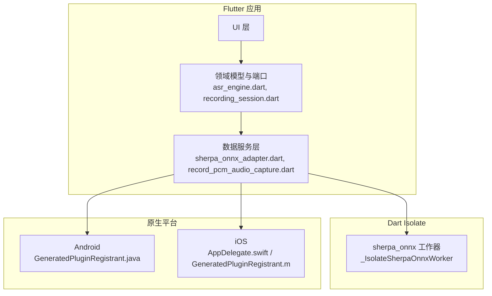
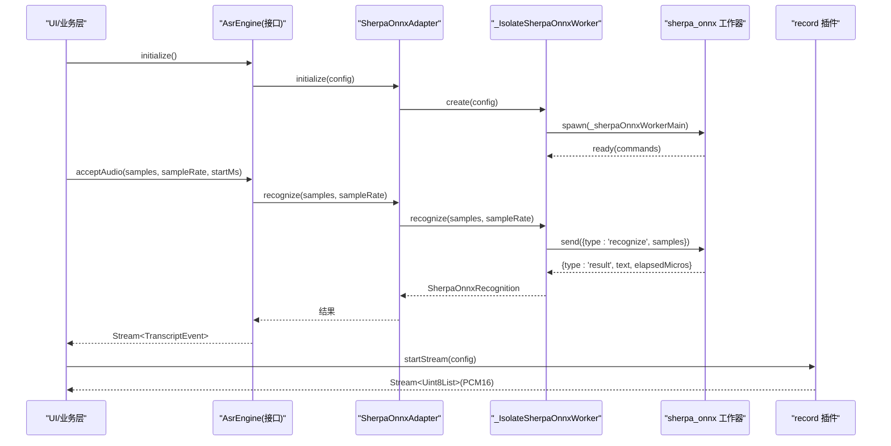
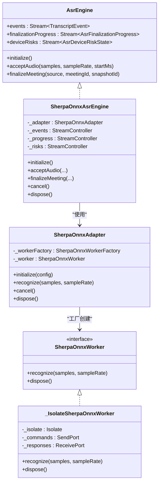
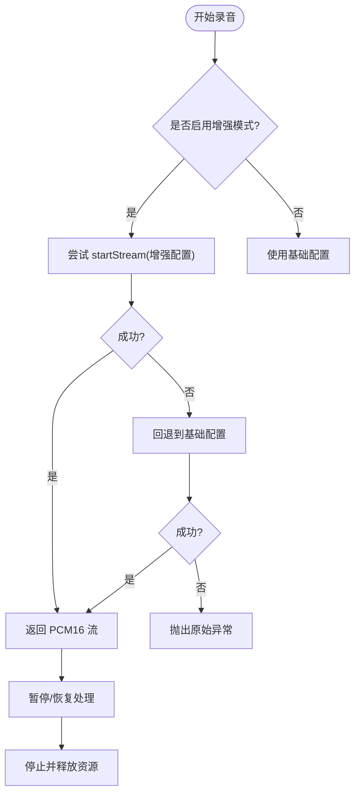
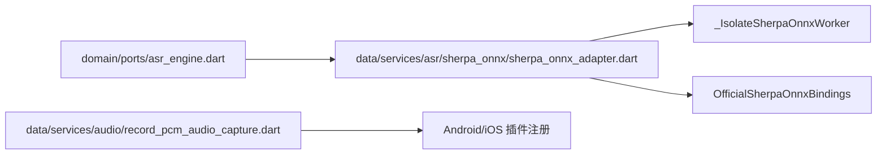

# 平台通信机制

<cite>
**本文引用的文件**   
- [lib/data/services/asr/sherpa_onnx/sherpa_onnx_adapter.dart](file://lib/data/services/asr/sherpa_onnx/sherpa_onnx_adapter.dart)
- [lib/data/services/asr/sherpa_onnx/sherpa_onnx_asr_engine.dart](file://lib/data/services/asr/sherpa_onnx/sherpa_onnx_asr_engine.dart)
- [lib/data/services/asr/sherpa_onnx/sherpa_onnx_runtime_initializer.dart](file://lib/data/services/asr/sherpa_onnx/sherpa_onnx_runtime_initializer.dart)
- [lib/domain/ports/asr_engine.dart](file://lib/domain/ports/asr_engine.dart)
- [lib/domain/models/asr_preview.dart](file://lib/domain/models/asr_preview.dart)
- [lib/domain/ports/recording_session.dart](file://lib/domain/ports/recording_session.dart)
- [lib/domain/models/recording.dart](file://lib/domain/models/recording.dart)
- [lib/data/services/audio/record_pcm_audio_capture.dart](file://lib/data/services/audio/record_pcm_audio_capture.dart)
- [lib/data/services/audio/platform_recording_foreground_lifecycle.dart](file://lib/data/services/audio/platform_recording_foreground_lifecycle.dart)
- [android/app/src/main/java/io/flutter/plugins/GeneratedPluginRegistrant.java](file://android/app/src/main/java/io/flutter/plugins/GeneratedPluginRegistrant.java)
- [ios/Runner/AppDelegate.swift](file://ios/Runner/AppDelegate.swift)
- [ios/Runner/GeneratedPluginRegistrant.m](file://ios/Runner/GeneratedPluginRegistrant.m)
- [test/ui/features/meetings/views/list/meeting_list_view_test.dart](file://test/ui/features/meetings/views/list/meeting_list_view_test.dart)
</cite>

## 目录
1. [简介](#简介)
2. [项目结构](#项目结构)
3. [核心组件](#核心组件)
4. [架构总览](#架构总览)
5. [详细组件分析](#详细组件分析)
6. [依赖关系分析](#依赖关系分析)
7. [性能考量](#性能考量)
8. [故障排查指南](#故障排查指南)
9. [结论](#结论)
10. [附录](#附录)

## 简介
本文件面向会迹（MeetTrace）项目中 Flutter 与原生平台的通信机制，聚焦以下方面：
- Platform Channel 的使用方式（方法通道、事件通道）在本项目的实际体现与替代方案
- 异步调用处理机制（Future 封装、错误传递、超时处理）
- 数据序列化格式（JSON 编解码、二进制数据传输、大文件处理）
- 平台特定实现差异（Android/iOS 的 API 调用、参数映射、返回值处理）
- 最佳实践（错误处理策略、性能优化、调试技巧）
- 常见问题解决方案（通信失败、数据丢失、内存溢出等）

本项目在“录音”和“ASR 推理”两条关键路径上，分别采用官方插件（record）与 Isolate + 第三方库（sherpa_onnx）进行跨进程通信，而非手写 Platform Channel。同时，通过统一的 Dart 接口抽象屏蔽平台差异，保证上层业务稳定。

## 项目结构
围绕平台通信的关键代码主要分布在：
- ASR 引擎与适配器层：Isolate 内调用 sherpa_onnx，使用消息协议与主线程通信
- 录音采集层：通过 record 插件获取 PCM 流，结合前台生命周期管理
- 平台初始化与插件注册：Android/iOS 启动时自动注册插件，确保通道可用

图表来源
- [lib/data/services/asr/sherpa_onnx/sherpa_onnx_adapter.dart:285-470](file://lib/data/services/asr/sherpa_onnx/sherpa_onnx_adapter.dart#L285-L470)
- [lib/data/services/audio/record_pcm_audio_capture.dart:46-78](file://lib/data/services/audio/record_pcm_audio_capture.dart#L46-L78)
- [android/app/src/main/java/io/flutter/plugins/GeneratedPluginRegistrant.java:37-65](file://android/app/src/main/java/io/flutter/plugins/GeneratedPluginRegistrant.java#L37-L65)
- [ios/Runner/AppDelegate.swift:1-16](file://ios/Runner/AppDelegate.swift#L1-L16)
- [ios/Runner/GeneratedPluginRegistrant.m:57-77](file://ios/Runner/GeneratedPluginRegistrant.m#L57-L77)

章节来源
- [lib/data/services/asr/sherpa_onnx/sherpa_onnx_adapter.dart:1-120](file://lib/data/services/asr/sherpa_onnx/sherpa_onnx_adapter.dart#L1-L120)
- [lib/data/services/audio/record_pcm_audio_capture.dart:1-45](file://lib/data/services/audio/record_pcm_audio_capture.dart#L1-L45)
- [android/app/src/main/java/io/flutter/plugins/GeneratedPluginRegistrant.java:37-65](file://android/app/src/main/java/io/flutter/plugins/GeneratedPluginRegistrant.java#L37-L65)
- [ios/Runner/AppDelegate.swift:1-16](file://ios/Runner/AppDelegate.swift#L1-L16)
- [ios/Runner/GeneratedPluginRegistrant.m:57-77](file://ios/Runner/GeneratedPluginRegistrant.m#L57-L77)

## 核心组件
- ASR 引擎接口与风险监控
  - 定义 AsrEngine、AsrDeviceRiskMonitor 等纯 Dart 契约，屏蔽平台差异
  - SherpaOnnxAsrEngine 实现具体识别流程，统一错误码与指标统计
- ASR 适配器与 Isolate 工作器
  - SherpaOnnxAdapter 负责配置校验、任务排队、错误映射
  - _IsolateSherpaOnnxWorker 通过 SendPort/ReceivePort 与 Isolate 通信，使用 TransferableTypedData 传输二进制音频
- 录音采集与前台生命周期
  - RecordPcmAudioCapture 基于 record 插件提供 PCM16 流，支持增强模式与回退
  - platform_recording_foreground_lifecycle.dart 按平台选择前台服务策略（Android 前台服务，iOS 后台 audio 模式）

章节来源
- [lib/domain/ports/asr_engine.dart:1-174](file://lib/domain/ports/asr_engine.dart#L1-L174)
- [lib/data/services/asr/sherpa_onnx/sherpa_onnx_asr_engine.dart:19-124](file://lib/data/services/asr/sherpa_onnx/sherpa_onnx_asr_engine.dart#L19-L124)
- [lib/data/services/asr/sherpa_onnx/sherpa_onnx_adapter.dart:125-220](file://lib/data/services/asr/sherpa_onnx/sherpa_onnx_adapter.dart#L125-L220)
- [lib/data/services/audio/record_pcm_audio_capture.dart:46-78](file://lib/data/services/audio/record_pcm_audio_capture.dart#L46-L78)
- [lib/data/services/audio/platform_recording_foreground_lifecycle.dart:1-32](file://lib/data/services/audio/platform_recording_foreground_lifecycle.dart#L1-L32)

## 架构总览
下图展示 Flutter 到原生平台及 Isolate 的通信路径，包括方法调用、事件流与二进制数据传输。

图表来源
- [lib/data/services/asr/sherpa_onnx/sherpa_onnx_adapter.dart:285-470](file://lib/data/services/asr/sherpa_onnx/sherpa_onnx_adapter.dart#L285-L470)
- [lib/data/services/asr/sherpa_onnx/sherpa_onnx_asr_engine.dart:109-171](file://lib/data/services/asr/sherpa_onnx/sherpa_onnx_asr_engine.dart#L109-L171)
- [lib/data/services/audio/record_pcm_audio_capture.dart:58-73](file://lib/data/services/audio/record_pcm_audio_capture.dart#L58-L73)

## 详细组件分析

### ASR 引擎与适配器（Isolate + sherpa_onnx）
- 设计要点
  - 通过 SherpaOnnxAdapter 将识别请求串行化，避免并发竞争
  - 使用 TransferableTypedData 零拷贝传输 Float32List 音频块
  - 统一错误映射为 AppFailure，包含 code、stage、context 等诊断信息
- 异步与错误
  - Future 链式队列（_tail）保障顺序执行
  - 异常捕获后转换为结构化错误，便于上层重试或降级
- 数据序列化
  - 配置对象通过 toMessage/fromMessage 进行 JSON 化跨 Isolate 传递
  - 音频数据以 Uint8List 片段形式传输，避免频繁分配

图表来源
- [lib/domain/ports/asr_engine.dart:1-174](file://lib/domain/ports/asr_engine.dart#L1-L174)
- [lib/data/services/asr/sherpa_onnx/sherpa_onnx_asr_engine.dart:19-124](file://lib/data/services/asr/sherpa_onnx/sherpa_onnx_asr_engine.dart#L19-L124)
- [lib/data/services/asr/sherpa_onnx/sherpa_onnx_adapter.dart:125-220](file://lib/data/services/asr/sherpa_onnx/sherpa_onnx_adapter.dart#L125-L220)
- [lib/data/services/asr/sherpa_onnx/sherpa_onnx_adapter.dart:285-470](file://lib/data/services/asr/sherpa_onnx/sherpa_onnx_adapter.dart#L285-L470)

章节来源
- [lib/data/services/asr/sherpa_onnx/sherpa_onnx_adapter.dart:125-220](file://lib/data/services/asr/sherpa_onnx/sherpa_onnx_adapter.dart#L125-L220)
- [lib/data/services/asr/sherpa_onnx/sherpa_onnx_adapter.dart:285-470](file://lib/data/services/asr/sherpa_onnx/sherpa_onnx_adapter.dart#L285-L470)
- [lib/data/services/asr/sherpa_onnx/sherpa_onnx_asr_engine.dart:109-171](file://lib/data/services/asr/sherpa_onnx/sherpa_onnx_asr_engine.dart#L109-L171)

### 录音采集与前台生命周期（record 插件）
- 设计要点
  - 固定 16kHz、单声道、PCM16 编码，确保与 ASR 输入一致
  - 支持增强模式（自动增益、回声消除、降噪），失败时回退到基础模式
  - 通过 AudioInterruptionMode.pauseResume 处理来电与焦点中断
- 平台差异
  - Android：通过前台服务与通知保持录音持续；Manifest 声明权限与服务类型
  - iOS：由 AVAudioSession 与后台 audio 模式承载，不启动 Android 前台任务语义
- 数据流
  - 返回 Stream<Uint8List>，上层按块写入持久化并推送预览

图表来源
- [lib/data/services/audio/record_pcm_audio_capture.dart:32-44](file://lib/data/services/audio/record_pcm_audio_capture.dart#L32-L44)
- [lib/data/services/audio/record_pcm_audio_capture.dart:58-73](file://lib/data/services/audio/record_pcm_audio_capture.dart#L58-L73)
- [lib/data/services/audio/platform_recording_foreground_lifecycle.dart:8-19](file://lib/data/services/audio/platform_recording_foreground_lifecycle.dart#L8-L19)

章节来源
- [lib/data/services/audio/record_pcm_audio_capture.dart:1-45](file://lib/data/services/audio/record_pcm_audio_capture.dart#L1-L45)
- [lib/data/services/audio/platform_recording_foreground_lifecycle.dart:1-32](file://lib/data/services/audio/platform_recording_foreground_lifecycle.dart#L1-L32)

### 运行时绑定与插件注册
- 运行时绑定
  - SherpaOnnxRuntimeInitializer 负责初始化 sherpa_onnx 绑定，确保原生库就绪
- 插件注册
  - Android：GeneratedPluginRegistrant 自动注册 record、share_plus、sqflite 等插件
  - iOS：AppDelegate 与 GeneratedPluginRegistrant 完成插件注册，确保通道可用

章节来源
- [lib/data/services/asr/sherpa_onnx/sherpa_onnx_runtime_initializer.dart:1-49](file://lib/data/services/asr/sherpa_onnx/sherpa_onnx_runtime_initializer.dart#L1-L49)
- [android/app/src/main/java/io/flutter/plugins/GeneratedPluginRegistrant.java:37-65](file://android/app/src/main/java/io/flutter/plugins/GeneratedPluginRegistrant.java#L37-L65)
- [ios/Runner/AppDelegate.swift:1-16](file://ios/Runner/AppDelegate.swift#L1-L16)
- [ios/Runner/GeneratedPluginRegistrant.m:57-77](file://ios/Runner/GeneratedPluginRegistrant.m#L57-L77)

## 依赖关系分析
- 模块耦合
  - AsrEngine 接口解耦具体实现，便于替换或测试
  - SherpaOnnxAdapter 隔离 Isolate 细节，对外暴露简洁 API
  - RecordPcmAudioCapture 封装 record 插件，屏蔽平台差异
- 外部依赖
  - sherpa_onnx：用于离线语音识别，需正确初始化绑定
  - record：用于 PCM 录制，依赖平台能力与权限

图表来源
- [lib/domain/ports/asr_engine.dart:1-174](file://lib/domain/ports/asr_engine.dart#L1-L174)
- [lib/data/services/asr/sherpa_onnx/sherpa_onnx_adapter.dart:1-120](file://lib/data/services/asr/sherpa_onnx/sherpa_onnx_adapter.dart#L1-L120)
- [lib/data/services/audio/record_pcm_audio_capture.dart:1-45](file://lib/data/services/audio/record_pcm_audio_capture.dart#L1-L45)

章节来源
- [lib/domain/ports/asr_engine.dart:1-174](file://lib/domain/ports/asr_engine.dart#L1-L174)
- [lib/data/services/asr/sherpa_onnx/sherpa_onnx_adapter.dart:1-120](file://lib/data/services/asr/sherpa_onnx/sherpa_onnx_adapter.dart#L1-L120)
- [lib/data/services/audio/record_pcm_audio_capture.dart:1-45](file://lib/data/services/audio/record_pcm_audio_capture.dart#L1-L45)

## 性能考量
- 音频数据处理
  - 使用 TransferableTypedData 减少内存拷贝，提升大音频块传输效率
  - 限制窗口大小（最大 15 秒）避免单次推理过长导致卡顿
- 并发控制
  - 通过 Future 队列（_tail）串行化请求，避免资源竞争
  - Isolate 独立运行推理，不阻塞主线程 UI
- 资源管理
  - 显式 dispose/cancel 释放 Isolate 与原生资源
  - 前台服务与后台模式确保录音连续性，降低中断开销

[本节为通用指导，无需引用具体文件]

## 故障排查指南
- 通信失败
  - 检查插件是否正确注册（Android/iOS 启动日志）
  - 确认 Isolate 是否正常启动与响应（ready 消息）
- 数据丢失
  - 验证 PCM16 对齐与字节边界（奇数长度会导致解析错误）
  - 检查预览 sink 是否阻塞或抛错影响主链路
- 内存溢出
  - 控制音频窗口大小与并发请求数
  - 及时释放 Isolate 与原生资源（free/dispose）
- 超时处理
  - 对平台 stop 等操作设置默认超时，避免无界等待
  - 使用有界等待与取消机制，确保 UI 响应性

章节来源
- [android/app/src/main/java/io/flutter/plugins/GeneratedPluginRegistrant.java:37-65](file://android/app/src/main/java/io/flutter/plugins/GeneratedPluginRegistrant.java#L37-L65)
- [ios/Runner/AppDelegate.swift:1-16](file://ios/Runner/AppDelegate.swift#L1-L16)
- [lib/data/services/asr/sherpa_onnx/sherpa_onnx_adapter.dart:285-470](file://lib/data/services/asr/sherpa_onnx/sherpa_onnx_adapter.dart#L285-L470)
- [lib/data/services/audio/record_pcm_audio_capture.dart:58-73](file://lib/data/services/audio/record_pcm_audio_capture.dart#L58-L73)

## 结论
会迹项目在 Flutter 与原生平台通信中，采用“插件 + Isolate”的组合策略，既保证了录音与推理的高性能，又通过统一接口屏蔽了平台差异。通过严格的错误映射、资源管理与数据序列化规范，实现了稳定可靠的跨平台通信。建议在实际使用中遵循本文的最佳实践，以提升系统稳定性与可维护性。

[本节为总结性内容，无需引用具体文件]

## 附录
- 常见错误示例
  - “platform channel unavailable”：通常因插件未注册或通道初始化失败
  - “IsolateExit”：工作器异常退出，需检查原生库加载与资源释放
- 调试技巧
  - 打印 Isolate 消息日志，定位通信断点
  - 使用设备监控工具观察内存与 CPU 占用，优化窗口大小与并发

章节来源
- [test/ui/features/meetings/views/list/meeting_list_view_test.dart:86-86](file://test/ui/features/meetings/views/list/meeting_list_view_test.dart#L86-L86)
- [lib/data/services/asr/sherpa_onnx/sherpa_onnx_adapter.dart:285-470](file://lib/data/services/asr/sherpa_onnx/sherpa_onnx_adapter.dart#L285-L470)