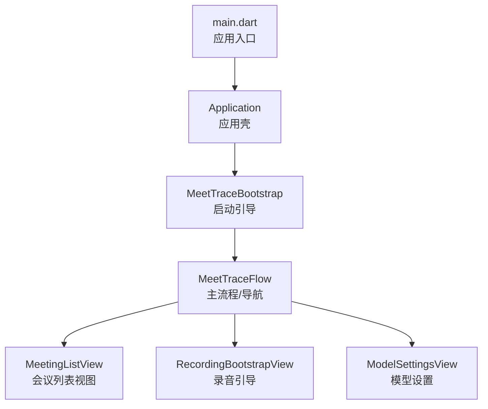
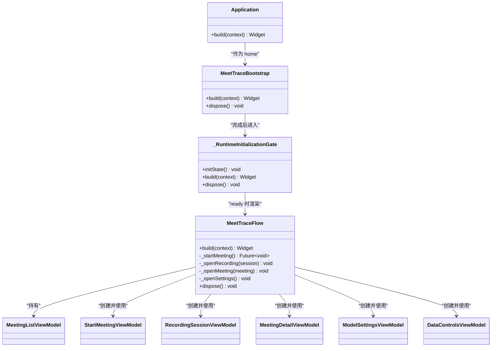
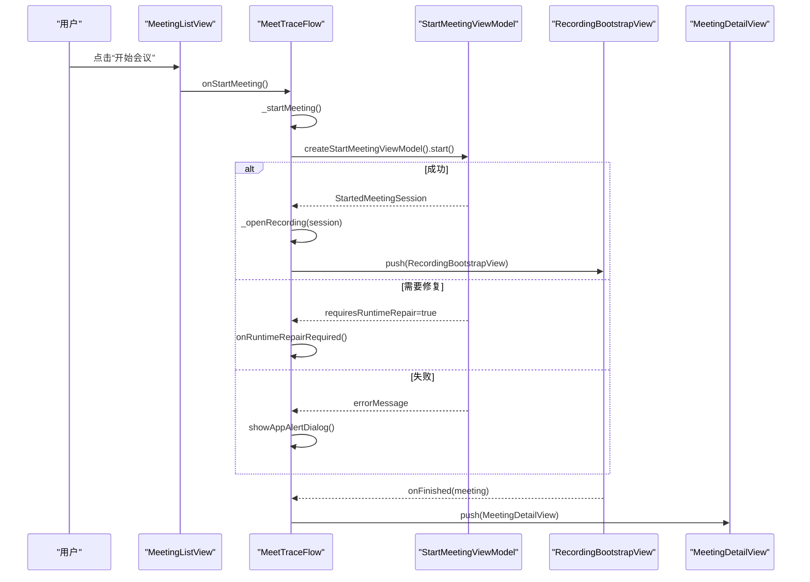
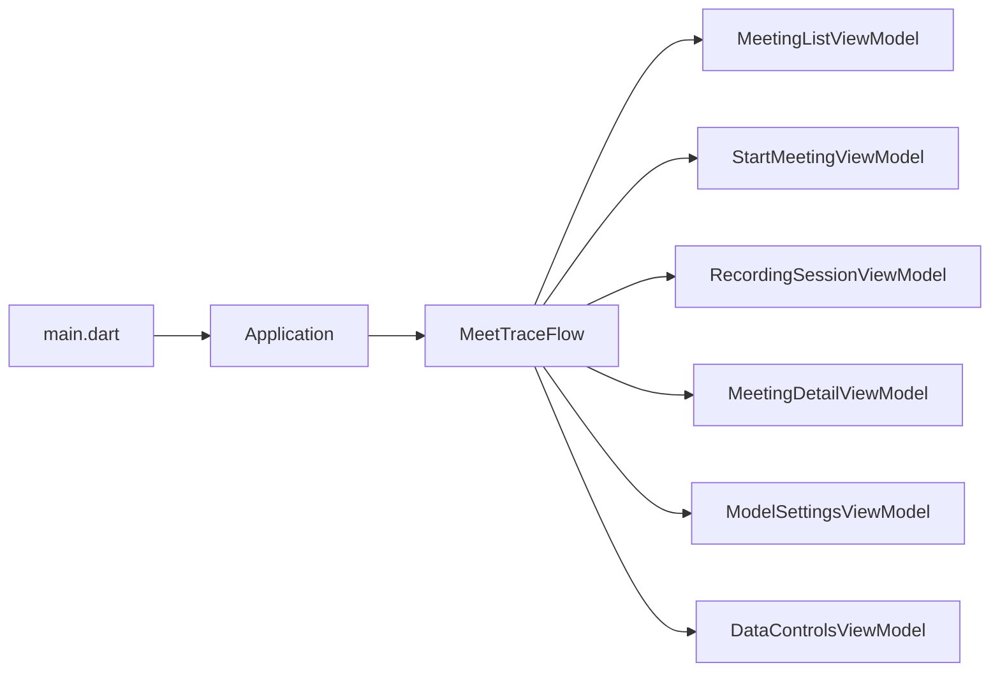

# 代码规范与最佳实践

<cite>
**本文引用的文件**   
- [pubspec.yaml](file://pubspec.yaml)
- [analysis_options.yaml](file://analysis_options.yaml)
- [forui.yaml](file://forui.yaml)
- [main.dart](file://lib/main.dart)
- [application.dart](file://lib/app/application.dart)
- [meettrace_flow.dart](file://lib/app/meettrace_flow.dart)
</cite>

## 目录
1. [引言](#引言)
2. [项目结构](#项目结构)
3. [核心组件](#核心组件)
4. [架构总览](#架构总览)
5. [详细组件分析](#详细组件分析)
6. [依赖关系分析](#依赖关系分析)
7. [性能考量](#性能考量)
8. [故障排查指南](#故障排查指南)
9. [结论](#结论)
10. [附录](#附录)

## 引言
本指南面向会迹（MeetTrace）项目的开发与维护，目标是建立统一的 Dart 编码规范、MVVM 架构实现规范、Forui 组件使用规范、测试编写规范以及代码审查与质量门禁要求。文档基于仓库现有结构与关键入口文件进行提炼，确保可执行、可落地、可审计。

## 项目结构
- 应用入口位于 lib/main.dart，负责初始化 Flutter 绑定、启用边缘到边缘显示、初始化本地 ASR 运行时并启动应用壳。
- 应用壳 Application 在 lib/app/application.dart 中定义，统一主题、国际化与根页面装配，不承载业务逻辑。
- 启动流程 MeetTraceBootstrap 与路由编排位于 lib/app/meettrace_flow.dart，负责依赖注入、运行时准备、错误处理与页面导航。
- 包配置与静态分析规则分别由 pubspec.yaml 与 analysis_options.yaml 管理；Forui 生成路径由 forui.yaml 指定。

图表来源
- [main.dart:1-13](file://lib/main.dart#L1-L13)
- [application.dart:1-37](file://lib/app/application.dart#L1-L37)
- [meettrace_flow.dart:19-112](file://lib/app/meettrace_flow.dart#L19-L112)
- [meettrace_flow.dart:114-265](file://lib/app/meettrace_flow.dart#L114-L265)

章节来源
- [pubspec.yaml:1-112](file://pubspec.yaml#L1-L112)
- [analysis_options.yaml:1-35](file://analysis_options.yaml#L1-L35)
- [forui.yaml:1-13](file://forui.yaml#L1-L13)
- [main.dart:1-13](file://lib/main.dart#L1-L13)
- [application.dart:1-37](file://lib/app/application.dart#L1-L37)
- [meettrace_flow.dart:19-265](file://lib/app/meettrace_flow.dart#L19-L265)

## 核心组件
- 应用壳 Application：集中配置主题、国际化、Toaster、TooltipGroup，提供默认首页与会话替换能力。
- 启动引导 MeetTraceBootstrap：异步加载依赖、展示启动页或错误页、失败重试。
- 运行期门控 _RuntimeInitializationGate：创建并驱动 RuntimeInitializationViewModel，支持强制修复重启。
- 主流程 MeetTraceFlow：组装 MeetingListViewModel、StartMeetingViewModel、RecordingSessionViewModel、MeetingDetailViewModel、ModelSettingsViewModel、DataControlsViewModel，管理生命周期与导航。

章节来源
- [application.dart:1-37](file://lib/app/application.dart#L1-L37)
- [meettrace_flow.dart:19-112](file://lib/app/meettrace_flow.dart#L19-L112)
- [meettrace_flow.dart:114-265](file://lib/app/meettrace_flow.dart#L114-L265)

## 架构总览
本项目采用 MVVM 分层与依赖注入结合的模式：
- View：Flutter Widget，仅负责渲染与用户交互，通过 ViewModel 暴露状态与行为。
- ViewModel：封装 UI 状态与交互逻辑，调用 Use Case 完成业务操作，处理 UI 级错误与提示。
- Use Case：单一职责的业务用例，协调领域模型与 Repository。
- Repository：数据访问抽象，屏蔽存储、网络与平台差异。
- 依赖注入：通过 MeetTraceDependencies 工厂按需创建 ViewModel 与相关服务，保证解耦与可测试性。

图表来源
- [application.dart:1-37](file://lib/app/application.dart#L1-L37)
- [meettrace_flow.dart:19-112](file://lib/app/meettrace_flow.dart#L19-L112)
- [meettrace_flow.dart:114-265](file://lib/app/meettrace_flow.dart#L114-L265)

## 详细组件分析

### 应用壳 Application
- 职责：统一主题切换（明/暗）、国际化、全局 Toaster 与 TooltipGroup 包裹，提供默认首页与会话替换。
- 关键点：
  - 通过 FTheme 选择 lightTheme 或 darkTheme。
  - MaterialApp 集成 FLocalizations 与 Material 近似主题。
  - 测试场景允许传入自定义 home。

章节来源
- [application.dart:1-37](file://lib/app/application.dart#L1-L37)

### 启动引导 MeetTraceBootstrap
- 职责：异步加载 MeetTraceDependencies，处理异常（如旧版 Alpha 安装），展示启动页或错误页，支持重试。
- 关键点：
  - FutureBuilder 管理加载态与错误态。
  - 错误分支根据异常类型区分“旧版数据”和“本地能力未就绪”。
  - 资源释放通过 unawaited 避免阻塞。

章节来源
- [meettrace_flow.dart:19-65](file://lib/app/meettrace_flow.dart#L19-L65)

### 运行期门控 _RuntimeInitializationGate
- 职责：创建并驱动 RuntimeInitializationViewModel，必要时触发强制修复重启。
- 关键点：
  - initState 中启动 viewModel.start()。
  - ready 回调返回 MeetTraceFlow 实例。
  - 支持 onRuntimeRepairRequired 回调重建 ViewModel 并重启初始化。

章节来源
- [meettrace_flow.dart:67-112](file://lib/app/meettrace_flow.dart#L67-L112)

### 主流程 MeetTraceFlow
- 职责：编排会议列表、开始会议、录音会话、详情查看与设置页面的生命周期与导航。
- 关键点：
  - 监听应用生命周期，恢复时刷新就绪状态。
  - 开始会议防重入，统一错误提示与修复流程。
  - 导航后清理 ViewModel 资源，避免内存泄漏。

图表来源
- [meettrace_flow.dart:114-265](file://lib/app/meettrace_flow.dart#L114-L265)

章节来源
- [meettrace_flow.dart:114-265](file://lib/app/meettrace_flow.dart#L114-L265)

### Forui 组件使用规范
- 主题令牌：通过 FTheme 的 lightTheme/darkTheme 控制，Material 主题通过 toApproximateMaterialTheme 适配。
- 响应式设计：在 Widget 层依据上下文尺寸与系统亮度动态调整布局与样式。
- 平台适配：通过 platform 特性与原生能力桥接（如录音、前台任务、数据库等）。
- 生成配置：forui.yaml 指定 snippet/style/theme/fonts 输出路径，保持设计系统与代码一致。

章节来源
- [application.dart:1-37](file://lib/app/application.dart#L1-L37)
- [forui.yaml:1-13](file://forui.yaml#L1-L13)

### 测试编写规范
- 单元测试：按 feature/domain/data 分层组织，命名以 _test.dart 结尾，覆盖 ViewModel、Use Case、Repository 与工具类。
- 集成测试：位于 integration_test，模拟真实设备环境，验证录音可靠性与预览回放。
- 架构测试：位于 test/architecture，校验分层边界与依赖方向，防止循环依赖与越界调用。
- 建议：
  - 使用 Mock/Fake 隔离外部依赖（数据库、ASR、文件系统）。
  - 对异步操作使用 expectLater、fake_async 或测试专用调度器。
  - 为 UI 组件提供 Widget Test，断言关键交互与状态变化。

章节来源
- [pubspec.yaml:48-53](file://pubspec.yaml#L48-L53)

### 代码审查检查清单与质量门禁
- 静态分析：必须通过 flutter analyze，analysis_options.yaml 已启用严格模式（strict-casts/inference/raw-types）。
- Lint 规则：遵循 flutter_lints，禁止随意禁用规则；确需忽略须加行级注释说明原因。
- 覆盖率：新增功能应补充单测，目标覆盖率不低于团队基线（建议 80%+）。
- 变更影响：涉及跨层修改需更新架构测试与集成测试。
- 提交前自检：格式化、清理无用导入、确认无 print 调试语句。

章节来源
- [analysis_options.yaml:1-35](file://analysis_options.yaml#L1-L35)

## 依赖关系分析
- 入口依赖：main.dart 依赖 Application、MeetTraceBootstrap、SherpaOnnx 运行时初始化与 SystemUI。
- 应用壳依赖：Application 依赖 Forui 主题、国际化与默认首页 MeetingListView。
- 启动流程依赖：MeetTraceFlow 依赖多个 ViewModel 与导航目标，通过依赖注入工厂创建。

图表来源
- [main.dart:1-13](file://lib/main.dart#L1-L13)
- [application.dart:1-37](file://lib/app/application.dart#L1-L37)
- [meettrace_flow.dart:114-265](file://lib/app/meettrace_flow.dart#L114-L265)

章节来源
- [pubspec.yaml:30-47](file://pubspec.yaml#L30-L47)
- [main.dart:1-13](file://lib/main.dart#L1-L13)
- [application.dart:1-37](file://lib/app/application.dart#L1-L37)
- [meettrace_flow.dart:114-265](file://lib/app/meettrace_flow.dart#L114-L265)

## 性能考量
- 启动优化：将耗时初始化（如 ASR 运行时）放在后台或懒加载，避免阻塞首帧。
- 内存管理：及时 dispose ViewModel 与观察者，避免长生命周期对象泄漏。
- 渲染优化：减少 rebuild 范围，使用 const 构造与不可变状态；列表虚拟化。
- I/O 优化：批量写入、合理缓存、避免在主线程执行磁盘/网络操作。

[本节为通用指导，无需引用具体文件]

## 故障排查指南
- 启动失败：检查 FutureBuilder 的错误分支，区分“旧版数据”与“本地能力未就绪”，按提示重试或清理数据。
- 开始会议失败：查看 StartMeetingViewModel 的错误消息，必要时触发运行时修复流程。
- 录音问题：检查设备权限、前台任务与音频通道占用；参考集成测试用例定位问题。
- 主题与国际化：确认 FTheme 与 FLocalizations 是否正确注入；检查系统亮度与语言设置。

章节来源
- [meettrace_flow.dart:19-65](file://lib/app/meettrace_flow.dart#L19-L65)
- [meettrace_flow.dart:176-204](file://lib/app/meettrace_flow.dart#L176-L204)

## 结论
本规范围绕 Dart 编码、MVVM 架构、Forui 组件、测试与质量门禁形成闭环，确保会迹项目在可扩展性、可维护性与稳定性上达到工程化标准。建议在团队内推广并持续迭代，结合 CI/CD 自动化检查保障落地。

[本节为总结性内容，无需引用具体文件]

## 附录

### Dart 编码规范要点
- 命名约定：类与文件名使用大驼峰，变量与方法小驼峰，常量全大写加下划线。
- 文件组织：按 feature/domain/data 分层，每个模块包含 model/use_case/repository/view_model/view。
- 注释标准：公共 API 添加文档注释，复杂逻辑附行内注释说明意图与约束。
- 错误处理：优先返回 Result/Either 或抛出明确异常；UI 层统一提示与重试机制。

[本节为通用指导，无需引用具体文件]

### MVVM 实现规范
- View：纯展示与事件转发，不包含业务逻辑。
- ViewModel：状态与行为聚合，调用 Use Case，处理 UI 错误与提示。
- Use Case：单一职责，输入参数与返回值清晰，无 UI 耦合。
- Repository：数据源抽象，屏蔽平台差异，提供流式或一次性接口。

[本节为通用指导，无需引用具体文件]

### Forui 组件使用规范
- 主题令牌：集中定义，避免硬编码颜色与尺寸。
- 响应式：使用 LayoutBuilder 或 MediaQuery 判断屏幕尺寸，动态调整布局。
- 平台适配：通过 platform 特性与原生能力桥接，避免平台特定逻辑侵入 UI。

[本节为通用指导，无需引用具体文件]

### 测试编写规范
- 命名：*_test.dart，用例描述清晰，覆盖正常与异常路径。
- 组织：按 feature/domain/data 分层，便于定位与维护。
- 工具：使用 Mock/Fake 隔离外部依赖，确保测试稳定与快速。

[本节为通用指导，无需引用具体文件]

### 反模式对比示例
- 反模式：在 View 中直接调用 Repository 或发起网络请求。
  - 改进：将逻辑下沉至 ViewModel/Use Case，View 仅订阅状态。
- 反模式：全局单例滥用导致隐式依赖。
  - 改进：通过依赖注入工厂显式传递依赖，提升可测试性。
- 反模式：忽略错误分支与资源释放。
  - 改进：统一错误处理与 finally 释放，避免内存泄漏。

[本节为通用指导，无需引用具体文件]