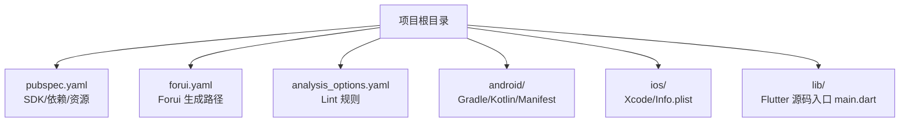
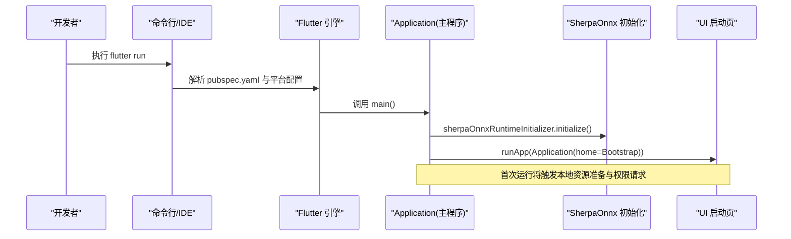
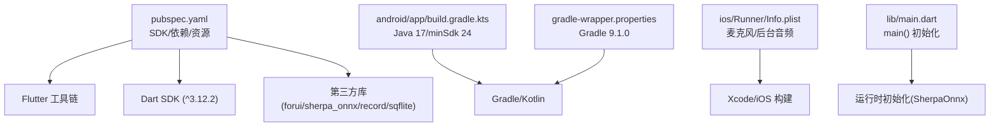

# 开发环境搭建

<cite>
**本文引用的文件**   
- [pubspec.yaml](file://pubspec.yaml)
- [forui.yaml](file://forui.yaml)
- [analysis_options.yaml](file://analysis_options.yaml)
- [README.md](file://README.md)
- [android/build.gradle.kts](file://android/build.gradle.kts)
- [android/app/build.gradle.kts](file://android/app/build.gradle.kts)
- [android/gradle.properties](file://android/gradle.properties)
- [android/gradle/wrapper/gradle-wrapper.properties](file://android/gradle/wrapper/gradle-wrapper.properties)
- [android/local.properties](file://android/local.properties)
- [ios/Runner/Info.plist](file://ios/Runner/Info.plist)
- [lib/main.dart](file://lib/main.dart)
</cite>

## 目录
1. [简介](#简介)
2. [项目结构](#项目结构)
3. [核心组件](#核心组件)
4. [架构总览](#架构总览)
5. [详细组件分析](#详细组件分析)
6. [依赖关系分析](#依赖关系分析)
7. [性能注意事项](#性能注意事项)
8. [故障排除指南](#故障排除指南)
9. [结论](#结论)
10. [附录](#附录)

## 简介
本指南面向首次参与“会迹（MeetTrace）”项目的开发者，提供从零开始搭建 Flutter 跨端（Android + iOS）开发环境的完整步骤。内容涵盖：
- Flutter SDK 安装与环境变量配置（含版本要求）
- IDE 推荐与插件安装（VS Code / Android Studio，Dart/Flutter 插件、Forui 支持）
- Android 与 iOS 平台环境要求（Android Studio、Xcode、模拟器/真机设置）
- 项目依赖管理（pub get、依赖锁定、第三方库配置）
- 常见环境问题与排错方法
- 首次运行项目的完整步骤与验证方式

项目为本地优先的会议录音与转录应用，首次启动将按固定清单下载并校验端侧模型资源，确保在资源就绪前不进入首页。

**章节来源**
- [README.md:1-11](file://README.md#L1-L11)

## 项目结构
本项目采用标准 Flutter 工程结构，包含 Android、iOS、macOS、Windows、Linux、Web 等多端目标。根目录关键配置文件如下：
- pubspec.yaml：声明 Dart/Flutter SDK 版本约束、依赖与资源清单
- forui.yaml：Forui CLI 代码生成输出路径配置
- analysis_options.yaml：静态分析与 Lint 规则
- android/*、ios/*：平台构建与权限配置

**图示来源**
- [pubspec.yaml:1-112](file://pubspec.yaml#L1-L112)
- [forui.yaml:1-13](file://forui.yaml#L1-L13)
- [analysis_options.yaml:1-35](file://analysis_options.yaml#L1-L35)
- [android/app/build.gradle.kts:1-60](file://android/app/build.gradle.kts#L1-L60)
- [ios/Runner/Info.plist:1-77](file://ios/Runner/Info.plist#L1-L77)
- [lib/main.dart:1-13](file://lib/main.dart#L1-L13)

**章节来源**
- [pubspec.yaml:1-112](file://pubspec.yaml#L1-L112)
- [forui.yaml:1-13](file://forui.yaml#L1-L13)
- [analysis_options.yaml:1-35](file://analysis_options.yaml#L1-L35)
- [android/build.gradle.kts:1-25](file://android/build.gradle.kts#L1-L25)
- [android/app/build.gradle.kts:1-60](file://android/app/build.gradle.kts#L1-L60)
- [android/gradle.properties:1-7](file://android/gradle.properties#L1-L7)
- [android/gradle/wrapper/gradle-wrapper.properties:1-6](file://android/gradle/wrapper/gradle-wrapper.properties#L1-L6)
- [android/local.properties:1-5](file://android/local.properties#L1-L5)
- [ios/Runner/Info.plist:1-77](file://ios/Runner/Info.plist#L1-L77)
- [lib/main.dart:1-13](file://lib/main.dart#L1-L13)

## 核心组件
- Flutter SDK 与 Dart 版本：由 pubspec.yaml 的 environment.sdk 指定，需使用满足 ^3.12.2 的 Dart SDK。
- Forui 支持：通过 forui.yaml 配置代码生成输出目录，配合 forui_cli 进行样式与主题生成。
- 静态分析：analysis_options.yaml 启用严格类型推断与强检查规则，IDE 中可实时提示问题。
- Android 构建：基于 Kotlin DSL，Java/Kotlin 编译目标为 17，minSdk 24，NDK 版本由 Flutter 工具链注入。
- iOS 权限与后台模式：Info.plist 声明麦克风权限与音频后台模式，保证录音可用性。

**章节来源**
- [pubspec.yaml:21-23](file://pubspec.yaml#L21-L23)
- [forui.yaml:1-13](file://forui.yaml#L1-L13)
- [analysis_options.yaml:12-16](file://analysis_options.yaml#L12-L16)
- [android/app/build.gradle.kts:12-15](file://android/app/build.gradle.kts#L12-L15)
- [android/app/build.gradle.kts:36-39](file://android/app/build.gradle.kts#L36-L39)
- [ios/Runner/Info.plist:29-34](file://ios/Runner/Info.plist#L29-L34)

## 架构总览
下图展示从应用启动到运行时初始化与 UI 渲染的关键流程，体现首次运行时的资源准备与权限申请。

**图示来源**
- [lib/main.dart:7-12](file://lib/main.dart#L7-L12)
- [pubspec.yaml:1-112](file://pubspec.yaml#L1-L112)

**章节来源**
- [lib/main.dart:1-13](file://lib/main.dart#L1-L13)

## 详细组件分析

### Flutter SDK 安装与配置
- 版本要求：Dart SDK 需满足 ^3.12.2（见 environment.sdk）。建议使用 fvm 或官方安装器管理多版本。
- 环境变量：
  - Windows：确保 flutter/bin 已加入 PATH；若使用 fvm，请激活稳定通道版本。
  - macOS/Linux：在 shell 配置文件中添加 flutter/bin 到 PATH。
- 验证：运行 flutter doctor 检查各平台组件状态。

**章节来源**
- [pubspec.yaml:21-23](file://pubspec.yaml#L21-L23)
- [android/local.properties:2-2](file://android/local.properties#L2-L2)

### IDE 推荐与插件安装
- VS Code：
  - 安装扩展：Dart、Flutter、Flutter Widget Snippets（可选）、Forui（如可用）。
  - 配置：选择正确的 Flutter SDK 路径，开启热重载与调试。
- Android Studio：
  - 安装插件：Flutter、Dart。
  - 配置：指向 Flutter SDK 与 Android SDK/NDK。
- Forui 支持：
  - 安装 forui_cli（dev_dependencies），根据 forui.yaml 生成样式与主题。
  - 在 IDE 中集成 Forui 命令以自动生成代码片段与主题文件。

**章节来源**
- [forui.yaml:1-13](file://forui.yaml#L1-L13)
- [pubspec.yaml:48-62](file://pubspec.yaml#L48-L62)

### Android 开发环境
- 必需组件：
  - Android Studio（最新稳定版）
  - Android SDK（建议 34+）
  - NDK（由 Flutter 工具链自动管理）
  - Java 17（compileOptions/targetCompatibility 设置为 17）
- Gradle 配置：
  - gradle-wrapper.properties 指定 Gradle 分发版本（示例为 9.1.0）
  - gradle.properties 调整 JVM 内存参数，避免构建 OOM
  - local.properties 指定 sdk.dir 与 flutter.sdk
- 模拟器/真机：
  - 创建 AVD（API 24+），或使用 USB 调试连接真机
  - 确保设备被 adb 识别

**章节来源**
- [android/app/build.gradle.kts:12-15](file://android/app/build.gradle.kts#L12-L15)
- [android/app/build.gradle.kts:36-39](file://android/app/build.gradle.kts#L36-L39)
- [android/gradle/wrapper/gradle-wrapper.properties:5-5](file://android/gradle/wrapper/gradle-wrapper.properties#L5-L5)
- [android/gradle.properties:1-1](file://android/gradle.properties#L1-L1)
- [android/local.properties:1-2](file://android/local.properties#L1-L2)

### iOS 开发环境
- 必需组件：
  - Xcode（最新稳定版）
  - iOS 模拟器或真机（需信任开发者证书）
- 权限与后台：
  - Info.plist 声明 NSMicrophoneUsageDescription 与 UIBackgroundModes.audio
- 签名与构建：
  - 首次运行需在 Xcode 中完成团队与签名配置
  - 模拟器无需签名，真机需要有效证书

**章节来源**
- [ios/Runner/Info.plist:29-34](file://ios/Runner/Info.plist#L29-L34)

### 项目依赖管理
- 依赖声明：
  - pubspec.yaml 的 dependencies 与 dev_dependencies 定义运行时与开发期依赖
  - 重要依赖包括 forui、sherpa_onnx、record、sqflite 等
- 依赖获取与锁定：
  - 首次运行 flutter pub get 拉取依赖并生成 pubspec.lock
  - 提交 pubspec.lock 以保证团队一致的依赖版本
- 第三方库配置：
  - Forui：根据 forui.yaml 生成样式与主题
  - SherpaOnnx：在 main 中初始化运行时
  - Record/Sqflite：按各自文档配置平台权限与存储路径

**章节来源**
- [pubspec.yaml:30-62](file://pubspec.yaml#L30-L62)
- [forui.yaml:1-13](file://forui.yaml#L1-L13)
- [lib/main.dart:7-12](file://lib/main.dart#L7-L12)

### 首次运行与验证
- 前置条件：
  - 已安装 Flutter SDK、Android/iOS 平台工具
  - 已连接设备或启动模拟器
- 运行步骤：
  - 在项目根目录执行 flutter pub get
  - 执行 flutter run 选择目标设备
  - 观察控制台日志，确认无构建错误
- 验证要点：
  - 应用启动后应显示启动页，等待本地资源准备完成
  - 首次运行将按清单下载并校验 SenseVoice 与 Silero VAD 模型
  - 麦克风权限弹窗出现并授权后，录音功能可用

**章节来源**
- [lib/main.dart:7-12](file://lib/main.dart#L7-L12)
- [pubspec.yaml:74-80](file://pubspec.yaml#L74-L80)
- [ios/Runner/Info.plist:29-34](file://ios/Runner/Info.plist#L29-L34)

## 依赖关系分析
下图展示主要依赖与构建配置的关联关系，帮助理解环境与构建链路。

**图示来源**
- [pubspec.yaml:21-23](file://pubspec.yaml#L21-L23)
- [pubspec.yaml:30-62](file://pubspec.yaml#L30-L62)
- [android/app/build.gradle.kts:12-15](file://android/app/build.gradle.kts#L12-L15)
- [android/app/build.gradle.kts:36-39](file://android/app/build.gradle.kts#L36-L39)
- [android/gradle/wrapper/gradle-wrapper.properties:5-5](file://android/gradle/wrapper/gradle-wrapper.properties#L5-L5)
- [ios/Runner/Info.plist:29-34](file://ios/Runner/Info.plist#L29-L34)
- [lib/main.dart:7-12](file://lib/main.dart#L7-L12)

**章节来源**
- [pubspec.yaml:21-62](file://pubspec.yaml#L21-L62)
- [android/app/build.gradle.kts:12-39](file://android/app/build.gradle.kts#L12-L39)
- [android/gradle/wrapper/gradle-wrapper.properties:5-5](file://android/gradle/wrapper/gradle-wrapper.properties#L5-L5)
- [ios/Runner/Info.plist:29-34](file://ios/Runner/Info.plist#L29-L34)
- [lib/main.dart:7-12](file://lib/main.dart#L7-L12)

## 性能注意事项
- Gradle JVM 内存：gradle.properties 中已设置较大堆与元空间，避免大型项目构建 OOM。
- 资源体积：assets/models 中的模型文件较大，首次运行需下载与校验，建议在 Wi-Fi 环境下进行。
- 冷启动优化：main 中仅做必要的运行时初始化，避免阻塞 UI 启动。

**章节来源**
- [android/gradle.properties:1-1](file://android/gradle.properties#L1-L1)
- [pubspec.yaml:74-80](file://pubspec.yaml#L74-L80)
- [lib/main.dart:7-12](file://lib/main.dart#L7-L12)

## 故障排除指南
- Flutter 命令不可用：
  - 检查 PATH 是否包含 flutter/bin；Windows 用户重启终端或重新登录
  - 使用 flutter doctor 查看缺失项并按提示修复
- Android 构建失败：
  - 确认 Java 版本为 17；NDK 与 SDK 版本与 Flutter 工具链匹配
  - 清理构建缓存：flutter clean 后重新 pub get
  - 检查 local.properties 中 sdk.dir 与 flutter.sdk 路径是否正确
- iOS 构建失败：
  - 确认 Xcode 命令行工具已安装（xcode-select --install）
  - 首次运行需在 Xcode 中完成签名与团队配置
- 依赖冲突或拉取失败：
  - 删除 .dart_tool 与 pubspec.lock 后重新 flutter pub get
  - 检查网络代理与镜像配置（如需）
- 运行时权限问题：
  - Android：确保授予麦克风与存储权限
  - iOS：Info.plist 已声明麦克风与后台音频，首次运行需用户授权

**章节来源**
- [android/app/build.gradle.kts:12-15](file://android/app/build.gradle.kts#L12-L15)
- [android/local.properties:1-2](file://android/local.properties#L1-L2)
- [ios/Runner/Info.plist:29-34](file://ios/Runner/Info.plist#L29-L34)

## 结论
按照本指南完成 Flutter SDK、IDE、Android/iOS 平台环境与项目依赖的配置后，即可顺利运行“会迹”项目。首次运行将自动准备本地模型资源并请求必要权限，确保录音与转录功能可用。建议在团队协作中统一使用 pubspec.lock 与 fvm 管理版本，减少环境差异带来的问题。

## 附录
- 常用命令：
  - flutter pub get：拉取依赖
  - flutter run：运行项目
  - flutter build apk/ipa：构建发布包
  - flutter analyze：静态分析
  - flutter clean：清理构建缓存
- 参考文档：
  - Flutter 官方文档：https://flutter.dev/docs
  - Android 开发者文档：https://developer.android.com
  - Apple 开发者文档：https://developer.apple.com