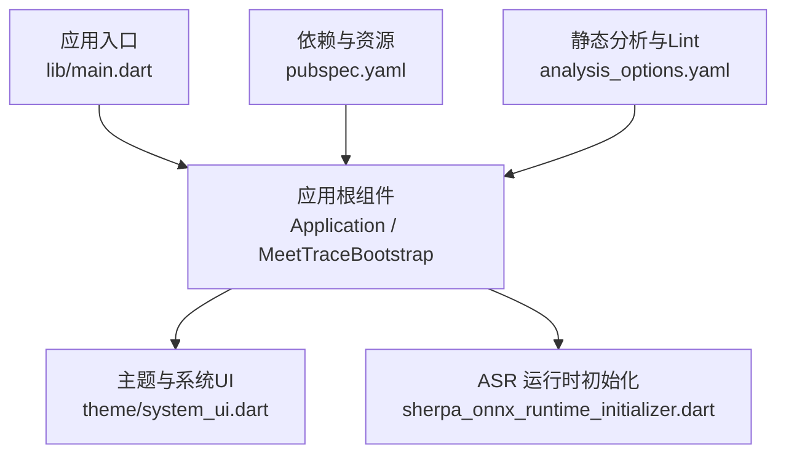
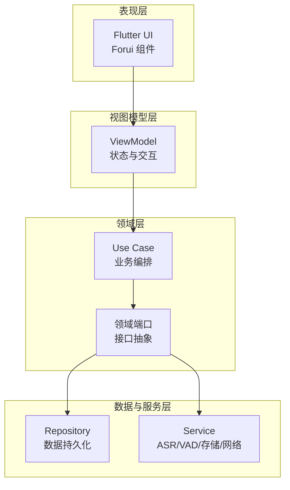
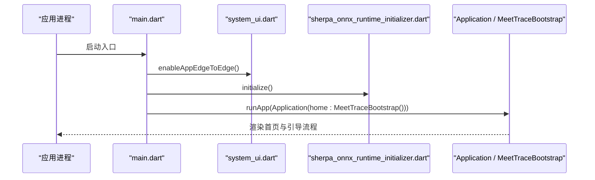
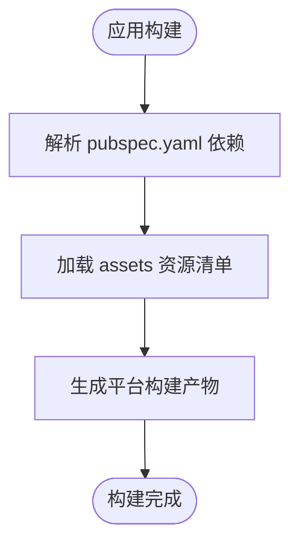
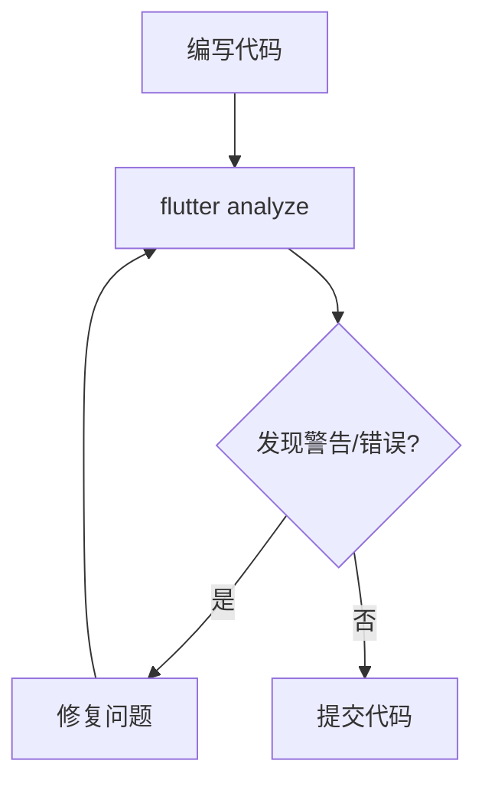
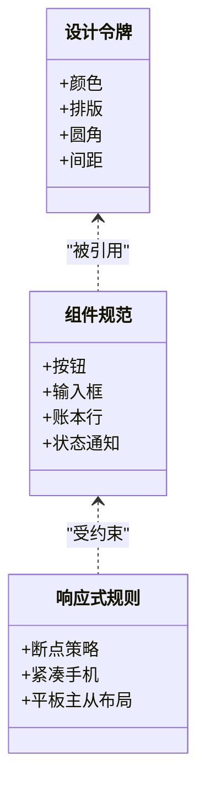
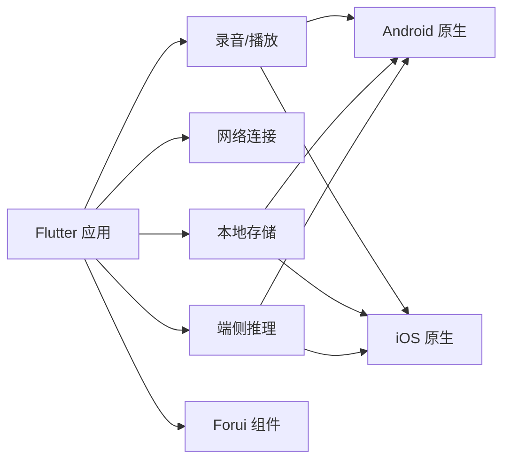

# 开发者指南

<cite>
**本文引用的文件**   
- [README.md](file://README.md)
- [PRODUCT.md](file://PRODUCT.md)
- [DESIGN.md](file://DESIGN.md)
- [pubspec.yaml](file://pubspec.yaml)
- [analysis_options.yaml](file://analysis_options.yaml)
- [lib/main.dart](file://lib/main.dart)
- [docs/README.md](file://docs/README.md)
- [docs/project/Git_分支与_Worktree_约定.md](file://docs/project/Git_分支与_Worktree_约定.md)
- [android/app/build.gradle.kts](file://android/app/build.gradle.kts)
- [android/build.gradle.kts](file://android/build.gradle.kts)
- [ios/Runner/Info.plist](file://ios/Runner/Info.plist)
- [ios/Runner/AppDelegate.swift](file://ios/Runner/AppDelegate.swift)
</cite>

## 目录
1. [简介](#简介)
2. [项目结构](#项目结构)
3. [核心组件](#核心组件)
4. [架构总览](#架构总览)
5. [详细组件分析](#详细组件分析)
6. [依赖分析](#依赖分析)
7. [性能考虑](#性能考虑)
8. [故障排除指南](#故障排除指南)
9. [结论](#结论)
10. [附录](#附录)

## 简介
会迹（MeetTrace）是一款本地优先的 Android + iOS 会议录音、端侧转录与证据化总结应用。其核心目标是：在弱网或无网环境下，确保事实音频完整可靠；通过端侧 ASR 提供会中临时转录；基于最终转录生成可追溯的摘要与关键结论。Alpha 版本不提供登录与跨设备同步，遵循两端原生交互与后台生命周期。

本开发者指南面向新加入与已有贡献者，覆盖开发环境搭建、代码规范与最佳实践、项目开发流程、调试与故障排除、扩展开发与社区参与方式，帮助团队高效协作并保证质量。

**章节来源**
- [README.md:1-11](file://README.md#L1-L11)
- [PRODUCT.md:1-128](file://PRODUCT.md#L1-L128)

## 项目结构
仓库采用 Flutter 多平台工程组织，核心 Dart 源码位于 lib 目录，Android/iOS 原生工程分别位于 android 与 ios 目录，文档集中于 docs 目录，测试与集成测试分别在 test 与 integration_test 目录。

- 入口与启动流程
  - 应用入口为 lib/main.dart，负责初始化 Flutter 绑定、启用边缘到边显示、初始化端侧推理运行时，并启动应用根组件。
- 配置与依赖
  - pubspec.yaml 定义应用名称、版本、Dart SDK 约束、Flutter 插件与第三方库，以及资源清单。
  - analysis_options.yaml 启用严格类型分析与 Lint 规则，统一静态检查风格。
- 设计与产品
  - DESIGN.md 维护视觉令牌、组件规范与响应式布局规则。
  - PRODUCT.md 明确用户、定位、能力边界与品牌承诺。
- 文档中心
  - docs/README.md 提供权威链、阅读路径与维护规范，是文档唯一导航入口。

**图表来源**
- [lib/main.dart:1-13](file://lib/main.dart#L1-L13)
- [pubspec.yaml:1-112](file://pubspec.yaml#L1-L112)
- [analysis_options.yaml:1-35](file://analysis_options.yaml#L1-L35)

**章节来源**
- [lib/main.dart:1-13](file://lib/main.dart#L1-L13)
- [pubspec.yaml:1-112](file://pubspec.yaml#L1-L112)
- [analysis_options.yaml:1-35](file://analysis_options.yaml#L1-L35)
- [docs/README.md:1-165](file://docs/README.md#L1-L165)

## 核心组件
- 应用启动与引导
  - main.dart 完成 Flutter 绑定、边缘到边显示启用、ASR 运行时初始化，并启动 Application 根组件。
- 主题与系统 UI
  - theme/system_ui.dart 提供系统级 UI 行为与 Forui 主题接入点。
- 依赖管理
  - pubspec.yaml 集中声明 Flutter SDK、录音、播放、网络、存储、SQLite、ONNX 推理等依赖。
- 静态分析与规范
  - analysis_options.yaml 启用严格类型推断与 Lint，保障代码一致性与健壮性。

**章节来源**
- [lib/main.dart:1-13](file://lib/main.dart#L1-L13)
- [pubspec.yaml:1-112](file://pubspec.yaml#L1-L112)
- [analysis_options.yaml:1-35](file://analysis_options.yaml#L1-L35)

## 架构总览
会迹遵循“View → ViewModel → Use Case / Port → Repository / Service”的分层架构，功能 UI 不直接访问 ONNX、存储或 HTTP，确保关注点分离与可测试性。

- 表现层（UI）
  - 使用 Forui 组件与主题令牌，保持双平台一致的视觉语言与交互语义。
- 视图模型（ViewModel）
  - 封装页面状态与交互逻辑，驱动 UI 更新。
- 用例（Use Case）
  - 编排业务操作，协调领域端口与仓储服务。
- 领域端口与仓储/服务
  - 抽象外部依赖（如 ASR、存储、网络），便于替换与测试。

[此图为概念性架构图，未直接映射具体源文件，故不附图表来源]

**章节来源**
- [PRODUCT.md:70-80](file://PRODUCT.md#L70-L80)

## 详细组件分析

### 应用启动流程
- 步骤说明
  - 初始化 Flutter 绑定，确保引擎可用。
  - 启用边缘到边显示，适配现代屏幕。
  - 初始化端侧 ASR 运行时（SenseVoice）。
  - 启动 Application 根组件，进入引导流程。

**图表来源**
- [lib/main.dart:1-13](file://lib/main.dart#L1-L13)

**章节来源**
- [lib/main.dart:1-13](file://lib/main.dart#L1-L13)

### 依赖与资源配置
- 依赖声明
  - 录音与播放：record、audioplayers
  - 网络与连接：connectivity_plus
  - 加密与校验：crypto
  - 磁盘空间检测：disk_space_2
  - 路径与文件：path、path_provider
  - SQLite 数据库：sqflite、sqflite_common_ffi
  - 端侧推理：sherpa_onnx
  - 分享与导出：share_plus
  - UI 框架：forui
- 资源清单
  - 模型清单与许可证文件纳入 assets，确保首次初始化下载与校验。

**图表来源**
- [pubspec.yaml:1-112](file://pubspec.yaml#L1-L112)

**章节来源**
- [pubspec.yaml:1-112](file://pubspec.yaml#L1-L112)

### 静态分析与代码规范
- 严格类型与分析选项
  - 启用 strict-casts、strict-inference、strict-raw-types，提升类型安全。
- Lint 规则
  - 继承 flutter_lints，建议开启 prefer_single_quotes 等规则以统一风格。
- 运行命令
  - 使用 flutter analyze 进行静态检查，结合 IDE 实时提示。

**图表来源**
- [analysis_options.yaml:1-35](file://analysis_options.yaml#L1-L35)

**章节来源**
- [analysis_options.yaml:1-35](file://analysis_options.yaml#L1-L35)

### 设计系统与组件规范
- 设计令牌
  - 颜色、排版、圆角、间距与组件样式在 DESIGN.md 中统一定义。
- 组件实现
  - 优先使用 Forui 原语与 context.theme，避免 Material 装饰性用法。
- 响应式与可访问性
  - 按宽度断点调整布局，支持浅色/深色模式与字体缩放。

**图表来源**
- [DESIGN.md:1-337](file://DESIGN.md#L1-L337)

**章节来源**
- [DESIGN.md:1-337](file://DESIGN.md#L1-L337)

## 依赖分析
- 直接依赖
  - Flutter SDK、forui、record、audioplayers、connectivity_plus、crypto、disk_space_2、path、path_provider、sqflite、sqflite_common_ffi、sherpa_onnx、share_plus。
- 平台相关
  - Android：Gradle 构建脚本与原生配置。
  - iOS：Xcode 工程、Info.plist 权限与 Swift 入口。
- 风险与耦合
  - 端侧推理与录音强依赖原生平台能力，需确保权限与后台任务配置正确。
  - 存储与数据库依赖 sqflite，需注意迁移与一致性。

**图表来源**
- [pubspec.yaml:1-112](file://pubspec.yaml#L1-L112)
- [android/app/build.gradle.kts](file://android/app/build.gradle.kts)
- [android/build.gradle.kts](file://android/build.gradle.kts)
- [ios/Runner/Info.plist](file://ios/Runner/Info.plist)
- [ios/Runner/AppDelegate.swift](file://ios/Runner/AppDelegate.swift)

**章节来源**
- [pubspec.yaml:1-112](file://pubspec.yaml#L1-L112)

## 性能考虑
- 录音与转录隔离
  - 事实录音与 ASR 推理独立运行，避免相互阻塞。
- 资源初始化
  - 首次下载与校验 SenseVoice 与 Silero VAD，确保就绪后再进入首页。
- 内存与 I/O
  - 控制 PCM 缓冲区大小与写入频率，避免频繁 I/O 导致卡顿。
- 动画与渲染
  - 波形反馈使用短窗口自适应增益，减少不必要的重绘。

[本节为通用性能指导，不直接分析具体文件]

## 故障排除指南
- 常见问题定位
  - 启动失败：检查 Flutter 绑定与 ASR 初始化是否成功。
  - 录音异常：确认麦克风权限、后台任务与存储空间。
  - 转录失败：验证模型清单、下载完整性与推理引擎状态。
- 日志与诊断
  - 使用 flutter analyze 与 IDE 调试器输出日志。
  - 记录关键状态（权限、空间、模型就绪）以便复现。
- 恢复策略
  - 提供继续下载、暂停或修复入口，确保用户可恢复。

**章节来源**
- [PRODUCT.md:46-76](file://PRODUCT.md#L46-L76)

## 结论
会迹以本地事实音频为核心，结合端侧转录与可追溯总结，为用户提供可靠的会议记录体验。通过分层架构、严格静态分析与设计系统，项目在可维护性、可测试性与用户体验方面具备坚实基础。建议团队遵循本文档的开发环境与流程规范，持续优化性能与稳定性。

[本节为总结性内容，不直接分析具体文件]

## 附录

### 开发环境搭建
- Flutter SDK 安装
  - 参考官方文档安装 Flutter 与 Dart SDK，确保版本满足 pubspec.yaml 约束。
- IDE 配置
  - 推荐 VS Code 或 Android Studio，安装 Flutter 与 Dart 插件。
- 模拟器设置
  - Android：创建 arm64 虚拟设备，启用硬件加速。
  - iOS：使用 Xcode 模拟器或真机调试。
- 插件推荐
  - Flutter DevTools、Dart 分析器、Forui 预览工具。

[本节为通用指导，不直接分析具体文件]

### 代码规范与最佳实践
- Dart 编码规范
  - 遵循 flutter_lints 与 analysis_options.yaml 规则。
- 命名约定
  - 变量与方法使用小驼峰，类名大驼峰，常量全大写。
- 注释标准
  - 公共 API 添加文档注释，复杂逻辑补充行内注释。
- 文件组织
  - 按功能模块划分目录，保持高内聚低耦合。

**章节来源**
- [analysis_options.yaml:1-35](file://analysis_options.yaml#L1-L35)

### 项目开发流程
- Git 工作流
  - 分支策略：主分支保护，功能分支开发，合并前审查。
  - Worktree：并行开发不同特性，避免冲突。
- 代码审查
  - 使用 Pull Request 进行审查，确保符合规范与需求。
- 版本管理
  - 遵循语义化版本，变更日志与发布说明同步更新。

**章节来源**
- [docs/project/Git_分支与_Worktree_约定.md](file://docs/project/Git_分支与_Worktree_约定.md)

### 调试技巧与故障排除
- 日志记录
  - 使用结构化日志记录关键状态与错误。
- 错误追踪
  - 捕获异常并上报，便于远程诊断。
- 性能分析
  - 使用 DevTools 分析 CPU、内存与渲染瓶颈。

[本节为通用指导，不直接分析具体文件]

### 扩展开发指南
- 插件开发
  - 遵循 Flutter 插件规范，封装平台特定功能。
- 自定义组件
  - 基于 Forui 原语扩展组件，复用主题令牌。
- 第三方集成
  - 通过 Port 抽象外部依赖，便于替换与测试。

[本节为通用指导，不直接分析具体文件]

### 贡献指南与社区参与
- 贡献流程
  - Fork 仓库，创建功能分支，提交变更并发起 PR。
- 社区参与
  - 参与讨论、报告问题、改进文档与设计。
- 行为准则
  - 尊重他人，保持专业与包容。

[本节为通用指导，不直接分析具体文件]