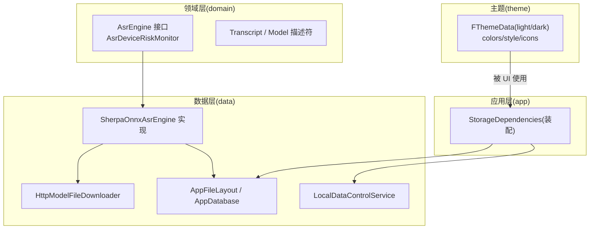
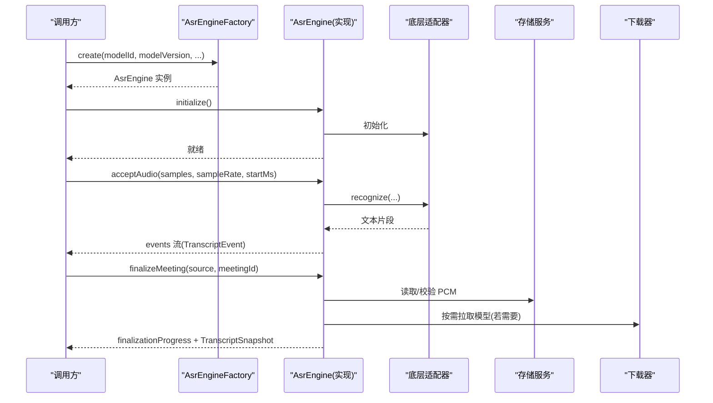
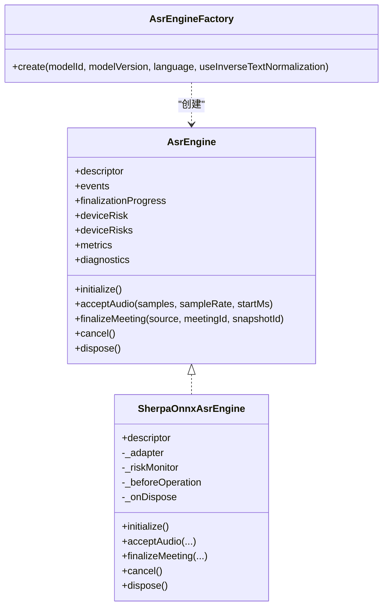
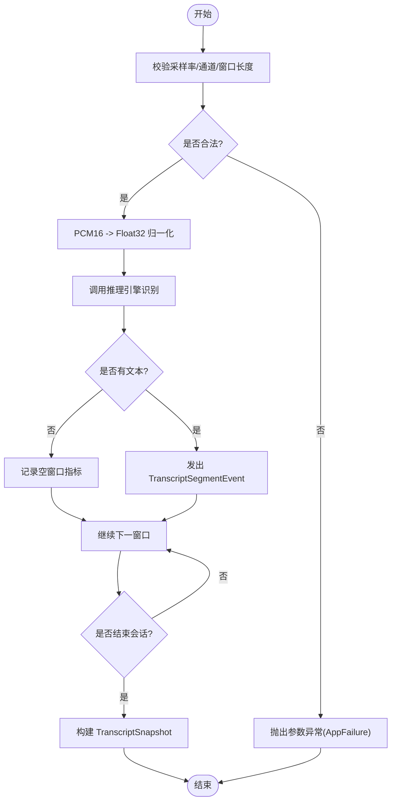
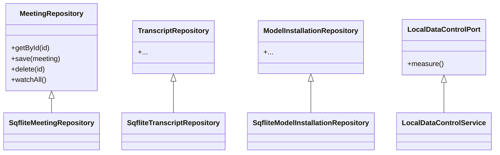
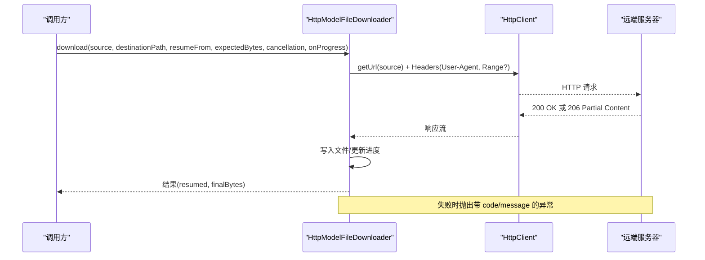
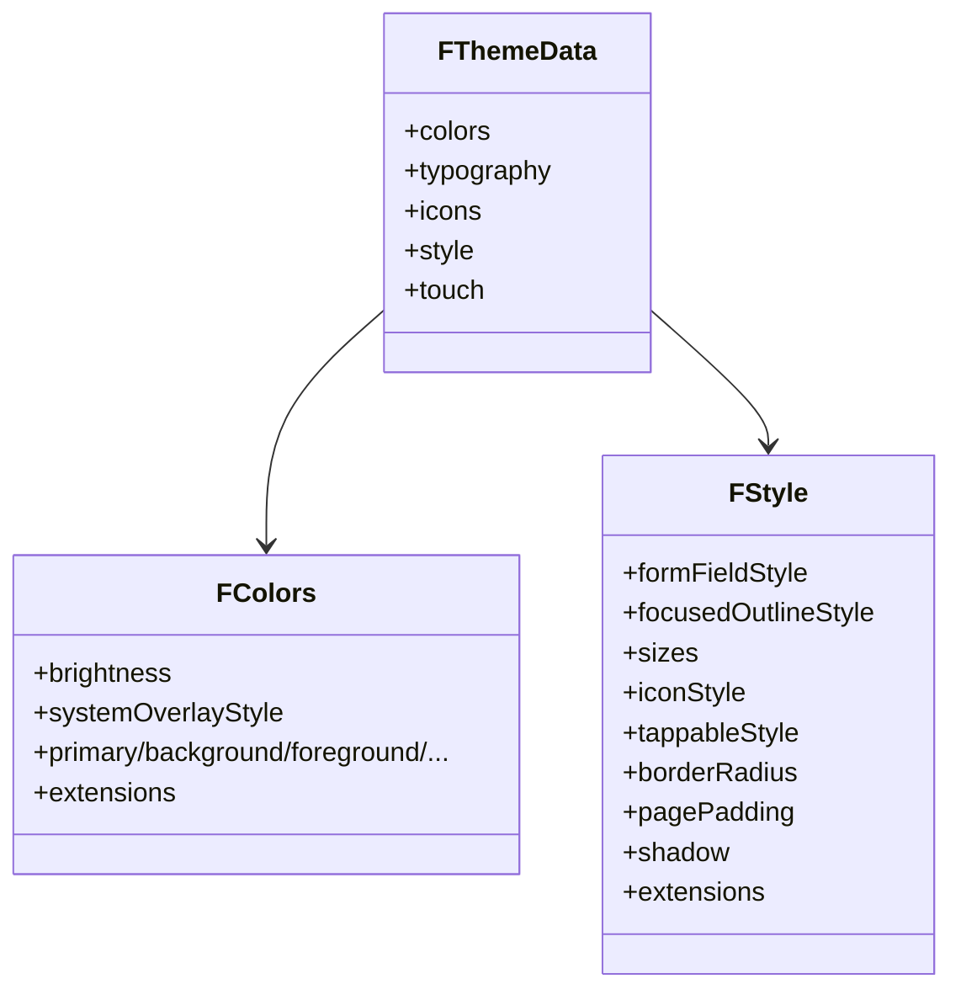
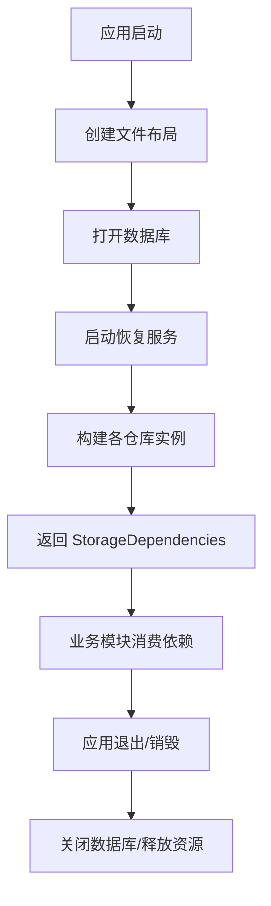
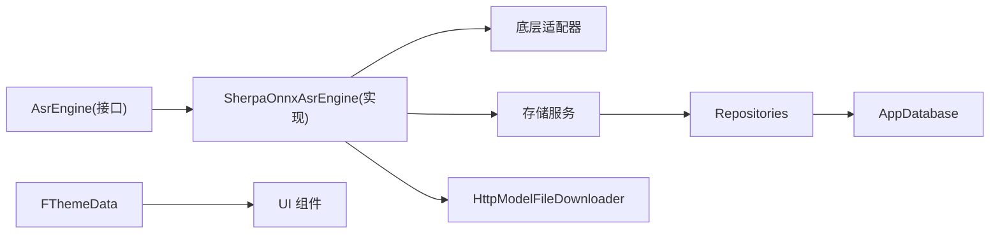

# 扩展开发指南

<cite>
**本文引用的文件**   
- [lib/domain/ports/asr_engine.dart](file://lib/domain/ports/asr_engine.dart)
- [lib/data/services/asr/sherpa_onnx/sherpa_onnx_asr_engine.dart](file://lib/data/services/asr/sherpa_onnx/sherpa_onnx_asr_engine.dart)
- [lib/app/meettrace_storage_dependencies.dart](file://lib/app/meettrace_storage_dependencies.dart)
- [lib/data/services/storage/local_data_control_service.dart](file://lib/data/services/storage/local_data_control_service.dart)
- [lib/data/services/models/http_model_file_downloader.dart](file://lib/data/services/models/http_model_file_downloader.dart)
- [lib/theme/theme.dart](file://lib/theme/theme.dart)
- [lib/theme/colors.dart](file://lib/theme/colors.dart)
- [lib/theme/style.dart](file://lib/theme/style.dart)
- [lib/theme/icons.dart](file://lib/theme/icons.dart)
</cite>

## 目录
1. [简介](#简介)
2. [项目结构](#项目结构)
3. [核心组件](#核心组件)
4. [架构总览](#架构总览)
5. [详细组件分析](#详细组件分析)
6. [依赖关系分析](#依赖关系分析)
7. [性能考量](#性能考量)
8. [故障排查指南](#故障排查指南)
9. [结论](#结论)
10. [附录：扩展示例与最佳实践](#附录扩展示例与最佳实践)

## 简介
本指南面向希望为“会迹”项目扩展能力的开发者，覆盖以下主题：
- 新增 ASR 引擎：实现 AsrEngine 接口、模型格式支持、性能优化策略
- 自定义存储后端：StorageProvider 接口（以现有 Repository/Service 抽象为参考）、数据迁移、备份恢复
- 第三方服务集成：HTTP 客户端配置、认证机制、错误处理
- UI 组件扩展：Forui 主题定制、平台特定实现
- 插件开发模式：依赖注入、生命周期管理、配置管理
- 完整扩展示例与最佳实践建议

## 项目结构
本项目采用分层架构与清晰的职责划分：
- domain：领域模型与端口（如 AsrEngine、AsrDeviceRiskMonitor）
- data：数据层（仓库、服务、适配器、下载器、存储布局等）
- app：应用装配与依赖注入（StorageDependencies 等）
- theme：UI 主题与样式（基于 Forui）

图表来源
- [lib/domain/ports/asr_engine.dart:133-174](file://lib/domain/ports/asr_engine.dart#L133-L174)
- [lib/data/services/asr/sherpa_onnx/sherpa_onnx_asr_engine.dart:19-41](file://lib/data/services/asr/sherpa_onnx/sherpa_onnx_asr_engine.dart#L19-L41)
- [lib/data/services/models/http_model_file_downloader.dart:7-14](file://lib/data/services/models/http_model_file_downloader.dart#L7-L14)
- [lib/data/services/storage/local_data_control_service.dart:9-22](file://lib/data/services/storage/local_data_control_service.dart#L9-L22)
- [lib/app/meettrace_storage_dependencies.dart:15-41](file://lib/app/meettrace_storage_dependencies.dart#L15-L41)
- [lib/theme/theme.dart:26-45](file://lib/theme/theme.dart#L26-L45)

章节来源
- [lib/domain/ports/asr_engine.dart:133-174](file://lib/domain/ports/asr_engine.dart#L133-L174)
- [lib/data/services/asr/sherpa_onnx/sherpa_onnx_asr_engine.dart:19-41](file://lib/data/services/asr/sherpa_onnx/sherpa_onnx_asr_engine.dart#L19-L41)
- [lib/app/meettrace_storage_dependencies.dart:15-41](file://lib/app/meettrace_storage_dependencies.dart#L15-L41)
- [lib/theme/theme.dart:26-45](file://lib/theme/theme.dart#L26-L45)

## 核心组件
- AsrEngine 与 AsrEngineFactory：定义 ASR 引擎的统一能力与工厂创建方式，包含设备风险监测、事件流、指标统计、音频窗口识别与会话终态生成。
- SherpaOnnxAsrEngine：具体引擎实现，封装窗口切分、推理、进度上报、诊断与异常映射。
- StorageDependencies：集中装配数据库、文件布局与各仓库实例，提供统一生命周期管理。
- LocalDataControlService：本地存储用量测量与基础控制。
- HttpModelFileDownloader：模型文件下载器，支持断点续传、HTTPS 校验、取消令牌与进度回调。
- Theme（Forui）：light/dark 主题、颜色、图标与样式组合。

章节来源
- [lib/domain/ports/asr_engine.dart:133-174](file://lib/domain/ports/asr_engine.dart#L133-L174)
- [lib/data/services/asr/sherpa_onnx/sherpa_onnx_asr_engine.dart:19-41](file://lib/data/services/asr/sherpa_onnx/sherpa_onnx_asr_engine.dart#L19-L41)
- [lib/app/meettrace_storage_dependencies.dart:15-41](file://lib/app/meettrace_storage_dependencies.dart#L15-L41)
- [lib/data/services/storage/local_data_control_service.dart:9-22](file://lib/data/services/storage/local_data_control_service.dart#L9-L22)
- [lib/data/services/models/http_model_file_downloader.dart:7-14](file://lib/data/services/models/http_model_file_downloader.dart#L7-L14)
- [lib/theme/theme.dart:26-45](file://lib/theme/theme.dart#L26-L45)

## 架构总览
下图展示了 ASR 引擎在系统中的位置与关键交互：上层通过 AsrEngineFactory 创建引擎，引擎内部通过适配器与底层推理库交互，同时暴露事件流与指标；存储与下载服务由应用层装配并注入到相关组件中。

图表来源
- [lib/domain/ports/asr_engine.dart:133-174](file://lib/domain/ports/asr_engine.dart#L133-L174)
- [lib/data/services/asr/sherpa_onnx/sherpa_onnx_asr_engine.dart:109-158](file://lib/data/services/asr/sherpa_onnx/sherpa_onnx_asr_engine.dart#L109-L158)
- [lib/data/services/models/http_model_file_downloader.dart:17-76](file://lib/data/services/models/http_model_file_downloader.dart#L17-L76)

## 详细组件分析

### 新增 ASR 引擎（AsrEngine 接口实现）
- 目标：在不改动上层业务的前提下，接入新的语音识别引擎（例如其他 ONNX Runtime、端侧推理框架）。
- 关键点：
  - 实现 AsrEngine 接口：initialize、acceptAudio、finalizeMeeting、cancel、dispose、事件与指标流。
  - 遵循窗口大小与采样率约束，保证可预测的内存与延迟。
  - 正确映射底层异常为 AsrEngineException/AppFailure，便于统一错误处理。
  - 暴露 AsrDeviceRiskState 变化，供上层做降级或提示。
  - 维护 metrics 与 diagnostics，便于性能分析与问题定位。

图表来源
- [lib/domain/ports/asr_engine.dart:133-174](file://lib/domain/ports/asr_engine.dart#L133-L174)
- [lib/data/services/asr/sherpa_onnx/sherpa_onnx_asr_engine.dart:19-41](file://lib/data/services/asr/sherpa_onnx/sherpa_onnx_asr_engine.dart#L19-L41)

章节来源
- [lib/domain/ports/asr_engine.dart:133-174](file://lib/domain/ports/asr_engine.dart#L133-L174)
- [lib/data/services/asr/sherpa_onnx/sherpa_onnx_asr_engine.dart:109-158](file://lib/data/services/asr/sherpa_onnx/sherpa_onnx_asr_engine.dart#L109-L158)
- [lib/data/services/asr/sherpa_onnx/sherpa_onnx_asr_engine.dart:160-171](file://lib/data/services/asr/sherpa_onnx/sherpa_onnx_asr_engine.dart#L160-L171)
- [lib/data/services/asr/sherpa_onnx/sherpa_onnx_asr_engine.dart:174-294](file://lib/data/services/asr/sherpa_onnx/sherpa_onnx_asr_engine.dart#L174-L294)

#### 模型格式支持与解码流程
- 输入要求：PCM16、单声道、固定采样率（示例实现使用 16kHz），窗口长度限制（示例实现最大 15s）。
- 解码路径：二进制 PCM 转 Float32 归一化样本，再送入推理引擎。
- 输出：按窗口返回文本片段，最终聚合为 TranscriptSnapshot。

图表来源
- [lib/data/services/asr/sherpa_onnx/sherpa_onnx_asr_engine.dart:533-576](file://lib/data/services/asr/sherpa_onnx/sherpa_onnx_asr_engine.dart#L533-L576)
- [lib/data/services/asr/sherpa_onnx/sherpa_onnx_asr_engine.dart:647-654](file://lib/data/services/asr/sherpa_onnx/sherpa_onnx_asr_engine.dart#L647-L654)
- [lib/data/services/asr/sherpa_onnx/sherpa_onnx_asr_engine.dart:174-294](file://lib/data/services/asr/sherpa_onnx/sherpa_onnx_asr_engine.dart#L174-L294)

章节来源
- [lib/data/services/asr/sherpa_onnx/sherpa_onnx_asr_engine.dart:533-576](file://lib/data/services/asr/sherpa_onnx/sherpa_onnx_asr_engine.dart#L533-L576)
- [lib/data/services/asr/sherpa_onnx/sherpa_onnx_asr_engine.dart:647-654](file://lib/data/services/asr/sherpa_onnx/sherpa_onnx_asr_engine.dart#L647-L654)
- [lib/data/services/asr/sherpa_onnx/sherpa_onnx_asr_engine.dart:174-294](file://lib/data/services/asr/sherpa_onnx/sherpa_onnx_asr_engine.dart#L174-L294)

#### 性能优化建议
- 窗口切分：保持固定窗口大小，避免频繁 GC 与上下文切换。
- 资源复用：复用解码缓冲与推理上下文，减少分配开销。
- 并发控制：串行化窗口推理，避免竞争条件与状态不一致。
- 指标监控：利用 metrics.realTimeFactor 评估实时性，结合 diagnostics 定位瓶颈。
- 设备风险：根据 AsrDeviceRiskState 动态降级（如降低采样率、缩短窗口、关闭非关键功能）。

章节来源
- [lib/domain/ports/asr_engine.dart:81-110](file://lib/domain/ports/asr_engine.dart#L81-L110)
- [lib/data/services/asr/sherpa_onnx/sherpa_onnx_asr_engine.dart:94-106](file://lib/data/services/asr/sherpa_onnx/sherpa_onnx_asr_engine.dart#L94-L106)
- [lib/data/services/asr/sherpa_onnx/sherpa_onnx_asr_engine.dart:468-499](file://lib/data/services/asr/sherpa_onnx/sherpa_onnx_asr_engine.dart#L468-L499)

### 自定义存储后端（StorageProvider 思路）
说明：当前代码未直接出现名为 StorageProvider 的接口，但通过 Repository 与 Service 抽象实现了可扩展的数据访问。可按如下方式扩展：
- 定义抽象接口（参考现有 Repository/Port 风格）：
  - 读写会议、转录、模型安装、偏好设置、任务与摘要等
  - 提供 watchAll 流式变更通知
- 实现多后端：
  - Sqflite（已有）
  - SQLite/WAL 优化、索引设计
  - 云存储（对象存储+元数据表）
- 数据迁移：
  - 版本化 schema，启动时执行迁移脚本
  - 失败回滚与幂等性保障
- 备份恢复：
  - 增量快照与一致性检查
  - 跨平台路径与权限处理

图表来源
- [lib/app/meettrace_storage_dependencies.dart:15-41](file://lib/app/meettrace_storage_dependencies.dart#L15-L41)
- [lib/data/services/storage/local_data_control_service.dart:9-22](file://lib/data/services/storage/local_data_control_service.dart#L9-L22)

章节来源
- [lib/app/meettrace_storage_dependencies.dart:15-41](file://lib/app/meettrace_storage_dependencies.dart#L15-L41)
- [lib/data/services/storage/local_data_control_service.dart:9-22](file://lib/data/services/storage/local_data_control_service.dart#L9-L22)

### 第三方服务集成（HTTP 客户端、认证、错误处理）
- HTTP 客户端配置：
  - 连接超时、空闲超时、User-Agent、Range 头支持
  - 强制 HTTPS（可通过配置开关）
- 认证机制：
  - 请求前注入 Token（Header/Cookie/签名）
  - 401 自动刷新或引导重新登录
- 错误处理：
  - 统一异常类型（如 DownloadableModelException）
  - 区分网络错误、服务端错误、范围不兼容等场景
  - 取消令牌支持中断长耗时操作

图表来源
- [lib/data/services/models/http_model_file_downloader.dart:17-76](file://lib/data/services/models/http_model_file_downloader.dart#L17-L76)

章节来源
- [lib/data/services/models/http_model_file_downloader.dart:17-76](file://lib/data/services/models/http_model_file_downloader.dart#L17-L76)

### UI 组件扩展（Forui 主题与平台特定实现）
- 主题体系：
  - lightTheme/darkTheme 通过 FThemeData 组合 colors、typography、icons、style
  - 颜色 tokens 与系统 overlay 样式分离，便于深色模式适配
- 样式定制：
  - 圆角、边框宽度、页面内边距、聚焦轮廓等
  - 扩展 AppStyle/AppColors 以承载业务语义色
- 平台特定实现：
  - 触摸/桌面变体（touch 标志位）
  - 系统 UI 覆盖栏样式（状态栏、导航栏）

图表来源
- [lib/theme/theme.dart:26-45](file://lib/theme/theme.dart#L26-L45)
- [lib/theme/colors.dart:6-25](file://lib/theme/colors.dart#L6-L25)
- [lib/theme/style.dart:8-45](file://lib/theme/style.dart#L8-L45)

章节来源
- [lib/theme/theme.dart:26-45](file://lib/theme/theme.dart#L26-L45)
- [lib/theme/colors.dart:6-25](file://lib/theme/colors.dart#L6-L25)
- [lib/theme/style.dart:8-45](file://lib/theme/style.dart#L8-L45)
- [lib/theme/icons.dart:6-29](file://lib/theme/icons.dart#L6-L29)

### 插件开发模式（依赖注入、生命周期、配置）
- 依赖注入：
  - 通过 StorageDependencies 集中装配数据库、仓库与服务
  - 工厂方法 create 负责初始化顺序与错误清理
- 生命周期：
  - 统一的 dispose 流程，确保资源释放与错误传播
  - 启动恢复服务（StartupRecoveryService）保障崩溃后一致性
- 配置管理：
  - 引擎参数（语言、反规范化、窗口大小、采样率）
  - 下载器参数（HTTPS 强制、超时、重试）
  - 主题参数（touch、颜色、图标）

图表来源
- [lib/app/meettrace_storage_dependencies.dart:40-87](file://lib/app/meettrace_storage_dependencies.dart#L40-L87)
- [lib/app/meettrace_storage_dependencies.dart:89-96](file://lib/app/meettrace_storage_dependencies.dart#L89-L96)

章节来源
- [lib/app/meettrace_storage_dependencies.dart:40-87](file://lib/app/meettrace_storage_dependencies.dart#L40-L87)
- [lib/app/meettrace_storage_dependencies.dart:89-96](file://lib/app/meettrace_storage_dependencies.dart#L89-L96)

## 依赖关系分析
- AsrEngine 与 SherpaOnnxAsrEngine：接口与实现的解耦，便于替换不同推理后端。
- StorageDependencies：集中管理数据库与仓库，降低耦合度。
- HttpModelFileDownloader：独立于业务逻辑，仅关注下载协议与错误映射。
- Theme：通过 FThemeData 组合，避免硬编码样式。

图表来源
- [lib/domain/ports/asr_engine.dart:133-174](file://lib/domain/ports/asr_engine.dart#L133-L174)
- [lib/data/services/asr/sherpa_onnx/sherpa_onnx_asr_engine.dart:19-41](file://lib/data/services/asr/sherpa_onnx/sherpa_onnx_asr_engine.dart#L19-L41)
- [lib/app/meettrace_storage_dependencies.dart:15-41](file://lib/app/meettrace_storage_dependencies.dart#L15-L41)
- [lib/data/services/models/http_model_file_downloader.dart:7-14](file://lib/data/services/models/http_model_file_downloader.dart#L7-L14)
- [lib/theme/theme.dart:26-45](file://lib/theme/theme.dart#L26-L45)

章节来源
- [lib/domain/ports/asr_engine.dart:133-174](file://lib/domain/ports/asr_engine.dart#L133-L174)
- [lib/data/services/asr/sherpa_onnx/sherpa_onnx_asr_engine.dart:19-41](file://lib/data/services/asr/sherpa_onnx/sherpa_onnx_asr_engine.dart#L19-L41)
- [lib/app/meettrace_storage_dependencies.dart:15-41](file://lib/app/meettrace_storage_dependencies.dart#L15-L41)
- [lib/data/services/models/http_model_file_downloader.dart:7-14](file://lib/data/services/models/http_model_file_downloader.dart#L7-L14)
- [lib/theme/theme.dart:26-45](file://lib/theme/theme.dart#L26-L45)

## 性能考量
- ASR 引擎：
  - 窗口大小与采样率对内存与 CPU 的影响需严格测试
  - 使用 metrics.realTimeFactor 评估实时性，结合 diagnostics 定位失败窗口
- 存储：
  - 合理索引与事务边界，避免大事务阻塞
  - 文件布局与持久化提交策略（原子写入、校验）
- 网络：
  - 启用 Range 头进行断点续传，减少重复下载
  - 合理设置超时与重试策略，避免雪崩

[本节为通用指导，无需列出具体文件来源]

## 故障排查指南
- ASR 引擎异常：
  - 检查 initialize 阶段的风险检测与适配器初始化
  - 查看 lastErrorCode 与 diagnostics 列表定位失败窗口原因
- 下载失败：
  - 确认 URL 是否为 HTTPS（默认强制）
  - 检查 Range 头与服务器兼容性
  - 观察 progress 回调与 cancellation 行为
- 存储问题：
  - 检查 StartupRecoveryService 是否成功恢复
  - 验证文件布局路径与权限

章节来源
- [lib/data/services/asr/sherpa_onnx/sherpa_onnx_asr_engine.dart:109-158](file://lib/data/services/asr/sherpa_onnx/sherpa_onnx_asr_engine.dart#L109-L158)
- [lib/data/services/asr/sherpa_onnx/sherpa_onnx_asr_engine.dart:468-499](file://lib/data/services/asr/sherpa_onnx/sherpa_onnx_asr_engine.dart#L468-L499)
- [lib/data/services/models/http_model_file_downloader.dart:17-76](file://lib/data/services/models/http_model_file_downloader.dart#L17-L76)
- [lib/app/meettrace_storage_dependencies.dart:40-87](file://lib/app/meettrace_storage_dependencies.dart#L40-L87)

## 结论
通过明确的接口抽象与分层设计，“会迹”项目在 ASR 引擎扩展、存储后端替换、第三方服务集成与 UI 主题定制方面具备良好的可扩展性与可维护性。遵循本文档的实践建议，开发者可以安全、高效地扩展新功能，同时保持系统的稳定性与性能。

[本节为总结，无需列出具体文件来源]

## 附录：扩展示例与最佳实践
- 新增 ASR 引擎步骤：
  - 实现 AsrEngine 接口，遵循窗口与采样率约束
  - 映射底层异常为 AppFailure，统一错误码
  - 暴露事件流与指标，完善诊断信息
  - 在工厂中注册新引擎，提供创建方法
- 自定义存储后端步骤：
  - 定义 Repository/Port 接口，保持与现有一致
  - 实现多后端（本地/云端），提供迁移与恢复
  - 在 StorageDependencies 中装配并管理生命周期
- 第三方服务集成步骤：
  - 封装 HTTP 客户端，统一超时、认证、错误处理
  - 支持取消令牌与进度回调
  - 编写单元测试覆盖常见失败场景
- UI 主题扩展步骤：
  - 在 theme.dart 中扩展 colors/style/icons
  - 通过 touch 标志位适配不同平台
  - 使用 FThemeData 组合，避免硬编码样式

[本节为实践建议，无需列出具体文件来源]