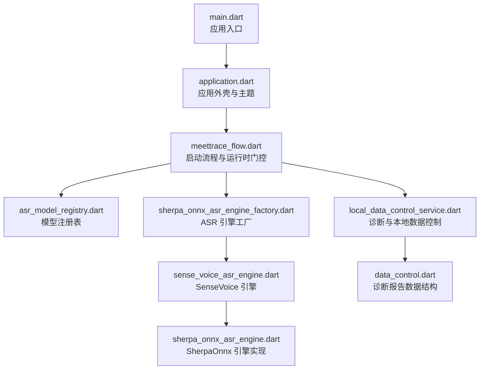
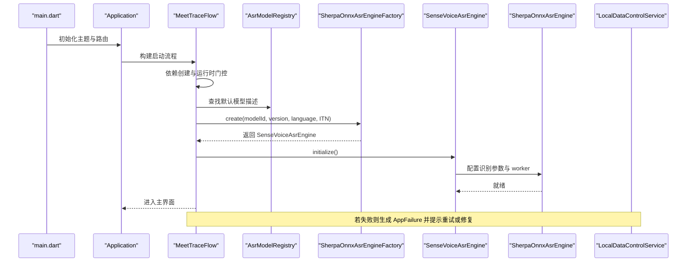
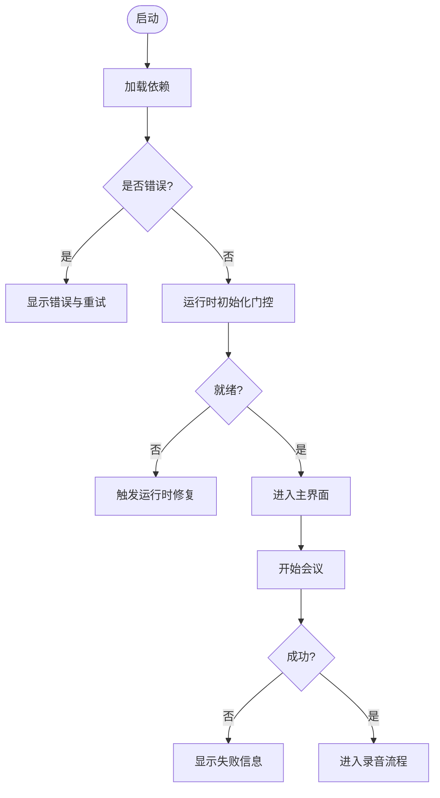
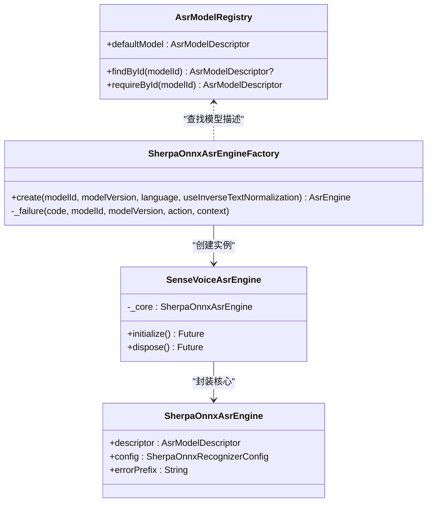
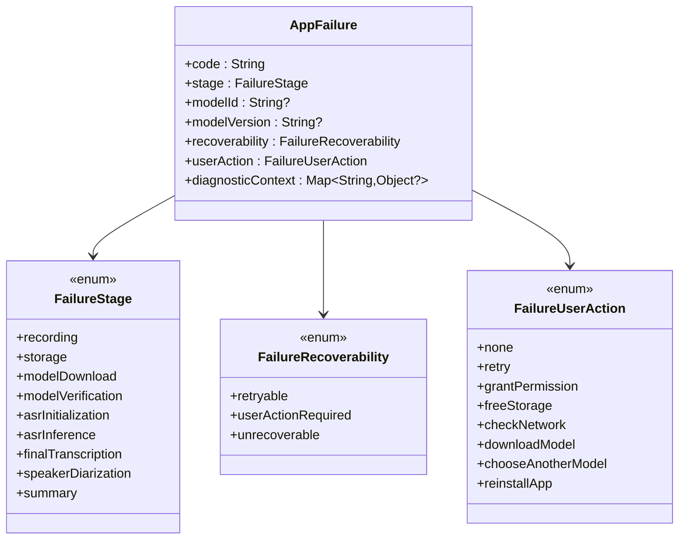
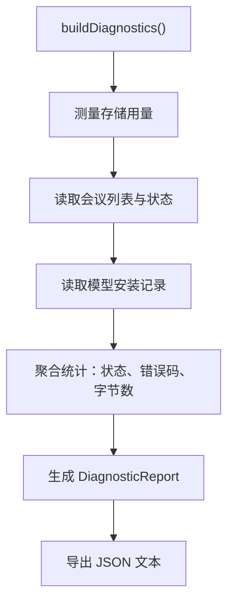
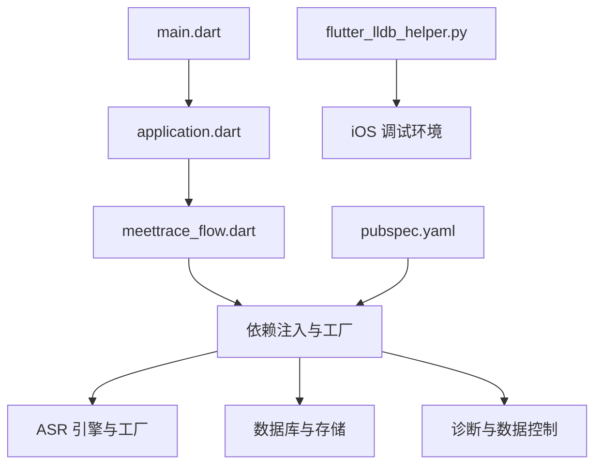

# 调试与故障排除

<cite>
**本文引用的文件**   
- [lib/main.dart](file://lib/main.dart)
- [lib/app/application.dart](file://lib/app/application.dart)
- [lib/app/meettrace_flow.dart](file://lib/app/meettrace_flow.dart)
- [lib/domain/models/app_failure.dart](file://lib/domain/models/app_failure.dart)
- [lib/data/services/asr/sense_voice_asr_engine.dart](file://lib/data/services/asr/sense_voice_asr_engine.dart)
- [lib/data/services/asr/sherpa_onnx_asr_engine_factory.dart](file://lib/data/services/asr/sherpa_onnx_asr_engine_factory.dart)
- [lib/data/services/asr/sherpa_onnx/sherpa_onnx_asr_engine.dart](file://lib/data/services/asr/sherpa_onnx/sherpa_onnx_asr_engine.dart)
- [lib/domain/models/asr_model_registry.dart](file://lib/domain/models/asr_model_registry.dart)
- [lib/domain/models/data_control.dart](file://lib/domain/models/data_control.dart)
- [lib/data/services/storage/local_data_control_service.dart](file://lib/data/services/storage/local_data_control_service.dart)
- [lib/ui/features/startup/views/meettrace_startup_view.dart](file://lib/ui/features/startup/views/meettrace_startup_view.dart)
- [test/domain/models/app_failure_test.dart](file://test/domain/models/app_failure_test.dart)
- [integration_test/reliable_recording_test.dart](file://integration_test/reliable_recording_test.dart)
- [docs/quality/Step_07_可靠录音与崩溃恢复.md](file://docs/quality/Step_07_可靠录音与崩溃恢复.md)
- [ios/Flutter/ephemeral/flutter_lldb_helper.py](file://ios/Flutter/ephemeral/flutter_lldb_helper.py)
- [pubspec.yaml](file://pubspec.yaml)
</cite>

## 目录
1. [简介](#简介)
2. [项目结构](#项目结构)
3. [核心组件](#核心组件)
4. [架构总览](#架构总览)
5. [详细组件分析](#详细组件分析)
6. [依赖关系分析](#依赖关系分析)
7. [性能考量](#性能考量)
8. [故障排除指南](#故障排除指南)
9. [结论](#结论)
10. [附录](#附录)

## 简介
本指南面向会迹（MeetTrace）项目的开发与测试人员，聚焦于调试与故障排除。内容涵盖：
- 日志记录策略与关键事件追踪
- 性能监控指标与采集方法
- 常见问题诊断（音频录制、ASR 推理失败、模型加载错误、数据库异常）
- 调试工具使用（Flutter DevTools、Android Profiler、iOS Instruments、内存分析）
- 崩溃分析与错误报告（堆栈跟踪、用户反馈收集、问题复现步骤）
- 性能优化技巧（启动时间、内存泄漏、电池使用）
- 常见问题的解决方案与预防措施

## 项目结构
会迹采用 Flutter 多端应用结构，核心入口在 lib/main.dart，应用外壳与主题在 lib/app/application.dart，启动流程与运行时门控在 lib/app/meettrace_flow.dart。ASR 引擎与工厂位于 data/services/asr 下，领域模型与数据控制服务分别位于 domain/models 与 data/services/storage。

**图示来源** 
- [lib/main.dart:1-13](file://lib/main.dart#L1-L13)
- [lib/app/application.dart:1-37](file://lib/app/application.dart#L1-L37)
- [lib/app/meettrace_flow.dart:1-265](file://lib/app/meettrace_flow.dart#L1-L265)
- [lib/domain/models/asr_model_registry.dart:41-68](file://lib/domain/models/asr_model_registry.dart#L41-L68)
- [lib/data/services/asr/sherpa_onnx_asr_engine_factory.dart:33-119](file://lib/data/services/asr/sherpa_onnx_asr_engine_factory.dart#L33-L119)
- [lib/data/services/asr/sense_voice_asr_engine.dart:1-46](file://lib/data/services/asr/sense_voice_asr_engine.dart#L1-L46)
- [lib/data/services/asr/sherpa_onnx/sherpa_onnx_asr_engine.dart:1-37](file://lib/data/services/asr/sherpa_onnx/sherpa_onnx_asr_engine.dart#L1-L37)
- [lib/data/services/storage/local_data_control_service.dart:39-90](file://lib/data/services/storage/local_data_control_service.dart#L39-L90)
- [lib/domain/models/data_control.dart:1-26](file://lib/domain/models/data_control.dart#L1-L26)

**章节来源**
- [lib/main.dart:1-13](file://lib/main.dart#L1-L13)
- [lib/app/application.dart:1-37](file://lib/app/application.dart#L1-L37)
- [lib/app/meettrace_flow.dart:1-265](file://lib/app/meettrace_flow.dart#L1-L265)

## 核心组件
- 应用外壳 Application：负责主题、本地化与根页面组装，屏蔽业务逻辑。
- 启动流程 MeetTraceBootstrap 与 MeetTraceFlow：负责依赖创建、运行时初始化门控、错误回退与重试。
- ASR 引擎体系：AsrModelRegistry 提供模型描述；SherpaOnnxAsrEngineFactory 校验并创建 SenseVoiceAsrEngine；SenseVoiceAsrEngine 封装 SherpaOnnxAsrEngine。
- 错误模型 AppFailure：结构化错误包含阶段、可恢复性、用户动作与诊断上下文。
- 诊断与数据控制：DiagnosticReport 与 LocalDataControlService 聚合存储用量、会议状态、模型安装状态等用于排障。

**章节来源**
- [lib/app/application.dart:1-37](file://lib/app/application.dart#L1-L37)
- [lib/app/meettrace_flow.dart:1-265](file://lib/app/meettrace_flow.dart#L1-L265)
- [lib/domain/models/asr_model_registry.dart:41-68](file://lib/domain/models/asr_model_registry.dart#L41-L68)
- [lib/data/services/asr/sherpa_onnx_asr_engine_factory.dart:33-119](file://lib/data/services/asr/sherpa_onnx_asr_engine_factory.dart#L33-L119)
- [lib/data/services/asr/sense_voice_asr_engine.dart:1-46](file://lib/data/services/asr/sense_voice_asr_engine.dart#L1-L46)
- [lib/data/services/asr/sherpa_onnx/sherpa_onnx_asr_engine.dart:1-37](file://lib/data/services/asr/sherpa_onnx/sherpa_onnx_asr_engine.dart#L1-L37)
- [lib/domain/models/app_failure.dart:1-49](file://lib/domain/models/app_failure.dart#L1-L49)
- [lib/domain/models/data_control.dart:1-26](file://lib/domain/models/data_control.dart#L1-L26)
- [lib/data/services/storage/local_data_control_service.dart:39-90](file://lib/data/services/storage/local_data_control_service.dart#L39-L90)

## 架构总览
下图展示从应用启动到 ASR 推理的关键调用链，以及错误处理与诊断数据的流向。

**图示来源** 
- [lib/main.dart:1-13](file://lib/main.dart#L1-L13)
- [lib/app/application.dart:1-37](file://lib/app/application.dart#L1-L37)
- [lib/app/meettrace_flow.dart:1-265](file://lib/app/meettrace_flow.dart#L1-L265)
- [lib/domain/models/asr_model_registry.dart:41-68](file://lib/domain/models/asr_model_registry.dart#L41-L68)
- [lib/data/services/asr/sherpa_onnx_asr_engine_factory.dart:33-119](file://lib/data/services/asr/sherpa_onnx_asr_engine_factory.dart#L33-L119)
- [lib/data/services/asr/sense_voice_asr_engine.dart:1-46](file://lib/data/services/asr/sense_voice_asr_engine.dart#L1-L46)
- [lib/data/services/asr/sherpa_onnx/sherpa_onnx_asr_engine.dart:1-37](file://lib/data/services/asr/sherpa_onnx/sherpa_onnx_asr_engine.dart#L1-L37)

## 详细组件分析

### 启动与运行时门控（MeetTraceFlow）
- 启动时通过 FutureBuilder 加载 MeetTraceDependencies，失败时显示“本地能力准备未完成”并提供重试。
- 运行时初始化完成后进入主流程，支持需要修复时的重启流程。
- 开始会议失败时弹出对话框，必要时触发运行时修复。

**图示来源** 
- [lib/app/meettrace_flow.dart:1-265](file://lib/app/meettrace_flow.dart#L1-L265)

**章节来源**
- [lib/app/meettrace_flow.dart:1-265](file://lib/app/meettrace_flow.dart#L1-L265)

### ASR 引擎与工厂（SenseVoice / SherpaOnnx）
- AsrModelRegistry 提供默认模型描述与按 ID 查询。
- SherpaOnnxAsrEngineFactory 校验 modelId、version、language、ITN 配置一致性，未注册或版本不匹配抛出结构化错误。
- SenseVoiceAsrEngine 基于已验证的安装路径构造 SherpaOnnxAsrEngine 的配置（模型路径、tokens、语言、ITN）。
- SherpaOnnxAsrEngine 负责具体识别参数与 worker 管理，并在构造时校验 descriptor 与 config 的一致性。

**图示来源** 
- [lib/domain/models/asr_model_registry.dart:41-68](file://lib/domain/models/asr_model_registry.dart#L41-L68)
- [lib/data/services/asr/sherpa_onnx_asr_engine_factory.dart:33-119](file://lib/data/services/asr/sherpa_onnx_asr_engine_factory.dart#L33-L119)
- [lib/data/services/asr/sense_voice_asr_engine.dart:1-46](file://lib/data/services/asr/sense_voice_asr_engine.dart#L1-L46)
- [lib/data/services/asr/sherpa_onnx/sherpa_onnx_asr_engine.dart:1-37](file://lib/data/services/asr/sherpa_onnx/sherpa_onnx_asr_engine.dart#L1-L37)

**章节来源**
- [lib/domain/models/asr_model_registry.dart:41-68](file://lib/domain/models/asr_model_registry.dart#L41-L68)
- [lib/data/services/asr/sherpa_onnx_asr_engine_factory.dart:33-119](file://lib/data/services/asr/sherpa_onnx_asr_engine_factory.dart#L33-L119)
- [lib/data/services/asr/sense_voice_asr_engine.dart:1-46](file://lib/data/services/asr/sense_voice_asr_engine.dart#L1-L46)
- [lib/data/services/asr/sherpa_onnx/sherpa_onnx_asr_engine.dart:1-37](file://lib/data/services/asr/sherpa_onnx/sherpa_onnx_asr_engine.dart#L1-L37)

### 错误模型与诊断上下文（AppFailure）
- FailureStage 覆盖录音、存储、模型下载/验证、ASR 初始化/推理、最终转录、说话人分离、摘要等阶段。
- FailureRecoverability 区分可重试、需用户操作、不可恢复。
- FailureUserAction 提供明确的用户引导动作（重试、授权、释放空间、检查网络、下载模型、选择其他模型、重装应用）。
- diagnosticContext 为只读映射，便于携带额外诊断信息（如队列长度、字节数等）。

**图示来源** 
- [lib/domain/models/app_failure.dart:1-49](file://lib/domain/models/app_failure.dart#L1-L49)

**章节来源**
- [lib/domain/models/app_failure.dart:1-49](file://lib/domain/models/app_failure.dart#L1-L49)
- [test/domain/models/app_failure_test.dart:1-20](file://test/domain/models/app_failure_test.dart#L1-L20)

### 诊断报告与本地数据控制（DiagnosticReport & LocalDataControlService）
- DiagnosticReport 提供 JSON 序列化能力，字段包括 schemaVersion、generatedAt、storage、meetings、models、privacy。
- LocalDataControlService.buildDiagnostics 聚合存储空间、会议状态统计、模型安装状态、错误码分布等，便于问题定位与上报。

**图示来源** 
- [lib/domain/models/data_control.dart:1-26](file://lib/domain/models/data_control.dart#L1-L26)
- [lib/data/services/storage/local_data_control_service.dart:39-90](file://lib/data/services/storage/local_data_control_service.dart#L39-L90)

**章节来源**
- [lib/domain/models/data_control.dart:1-26](file://lib/domain/models/data_control.dart#L1-L26)
- [lib/data/services/storage/local_data_control_service.dart:39-90](file://lib/data/services/storage/local_data_control_service.dart#L39-L90)

## 依赖关系分析
- 应用入口 main.dart 初始化 Flutter 绑定、边缘模式与 sherpa-onnx 运行时，然后运行 Application。
- pubspec.yaml 声明了 record、sqflite、sqflite_common_ffi、flutter_foreground_task、sherpa_onnx 等关键依赖，影响平台兼容性与构建行为。
- iOS 调试辅助 flutter_lldb_helper.py 用于 LLDB 集成，帮助捕获 RX 页事件，辅助原生层调试。

**图示来源** 
- [lib/main.dart:1-13](file://lib/main.dart#L1-L13)
- [pubspec.yaml:1-112](file://pubspec.yaml#L1-L112)
- [ios/Flutter/ephemeral/flutter_lldb_helper.py:1-32](file://ios/Flutter/ephemeral/flutter_lldb_helper.py#L1-L32)

**章节来源**
- [lib/main.dart:1-13](file://lib/main.dart#L1-L13)
- [pubspec.yaml:1-112](file://pubspec.yaml#L1-L112)
- [ios/Flutter/ephemeral/flutter_lldb_helper.py:1-32](file://ios/Flutter/ephemeral/flutter_lldb_helper.py#L1-L32)

## 性能考量
- 启动时间优化：
  - 将非关键初始化延迟至运行时门控之后，避免阻塞主线程。
  - 使用 FutureBuilder 异步加载依赖，失败时快速回退。
- 内存泄漏检测：
  - 关注 ViewModel 与服务的 dispose 生命周期，确保资源释放。
  - 使用 Flutter DevTools Memory 面板观察对象增长与回收。
- 电池使用分析：
  - 前台录音服务应最小化唤醒锁持有时间，合理设置采样率与缓冲区大小。
  - 避免在主线程执行耗时任务，使用 isolate 或后台任务。
- 性能指标采集：
  - 在关键路径埋点记录耗时（如模型加载、ASR 初始化、转录耗时）。
  - 结合 Timeline 与 Profiler 分析帧率与渲染瓶颈。

[本节为通用指导，无需特定文件引用]

## 故障排除指南

### 日志记录策略
- 日志级别建议：
  - Debug：开发期详细输出（依赖、初始化、配置校验）。
  - Info：关键事件（模型下载完成、会话开始/结束、错误发生）。
  - Warn：潜在风险（磁盘空间不足、权限即将过期）。
  - Error：异常与失败（ASR 推理失败、数据库写入失败）。
- 关键事件追踪：
  - 启动流程：依赖创建、运行时门控、模型验证。
  - 录音主链：PCM 块写入、checkpoint 提交、预览队列状态。
  - ASR 推理：窗口大小、样本率、ITN 开关、worker 状态。
  - 存储与数据库：读写耗时、事务失败、迁移错误。
- 性能监控指标：
  - 启动耗时、模型加载耗时、ASR 首包延迟、转录平均耗时。
  - 内存峰值、GC 频率、CPU 占用、前台服务唤醒次数。

[本节为通用指导，无需特定文件引用]

### 常见问题诊断

#### 音频录制问题
- 症状：无法启动录音、后台中断、文件不完整。
- 排查要点：
  - 权限与焦点：确认麦克风权限与 AudioInterruptionMode 配置。
  - PCM 参数：固定 16 kHz、单声道、PCM16，确保对齐边界。
  - 前台服务：Android Manifest 声明前台服务类型与通知权限。
  - 完整性：检查 checkpoint 双代机制与临时文件原子封存。
- 参考证据：
  - 可靠录音与崩溃恢复文档记录了参数、流程与真机结果。
  - 集成测试覆盖后台录音与完整性验证。

**章节来源**
- [docs/quality/Step_07_可靠录音与崩溃恢复.md:1-79](file://docs/quality/Step_07_可靠录音与崩溃恢复.md#L1-L79)
- [integration_test/reliable_recording_test.dart](file://integration_test/reliable_recording_test.dart)

#### ASR 推理失败
- 症状：初始化失败、推理超时、结果为空。
- 排查要点：
  - 模型注册与版本：AsrModelRegistry 中是否存在对应 modelId 与 version。
  - 配置一致性：language 与 useInverseTextNormalization 必须与描述一致。
  - 安装验证：ModelInstallation 状态与字节数校验。
  - Worker 与适配器：SherpaOnnxWorkerFactory 与 SherpaOnnxAdapter 是否正常。
- 错误模型：
  - 使用 AppFailure 的 stage=asrInitialization/asrInference，recoverability=userActionRequired/retryable，并附带 diagnosticContext。

**章节来源**
- [lib/domain/models/asr_model_registry.dart:41-68](file://lib/domain/models/asr_model_registry.dart#L41-L68)
- [lib/data/services/asr/sherpa_onnx_asr_engine_factory.dart:33-119](file://lib/data/services/asr/sherpa_onnx_asr_engine_factory.dart#L33-L119)
- [lib/data/services/asr/sense_voice_asr_engine.dart:1-46](file://lib/data/services/asr/sense_voice_asr_engine.dart#L1-L46)
- [lib/data/services/asr/sherpa_onnx/sherpa_onnx_asr_engine.dart:1-37](file://lib/data/services/asr/sherpa_onnx/sherpa_onnx_asr_engine.dart#L1-L37)
- [lib/domain/models/app_failure.dart:1-49](file://lib/domain/models/app_failure.dart#L1-L49)

#### 模型加载错误
- 症状：模型路径不存在、manifest 解析失败、校验失败。
- 排查要点：
  - 安装路径：installation.installedPath 是否正确。
  - 文件完整性：model.int8.onnx 与 tokens.txt 存在且可读。
  - 版本匹配：descriptor.version 与 installation.version 一致。
- 错误模型：
  - code 示例：asr.factory.model_not_registered、asr.senseVoice.model_not_verified。

**章节来源**
- [lib/data/services/asr/sense_voice_asr_engine.dart:1-46](file://lib/data/services/asr/sense_voice_asr_engine.dart#L1-L46)
- [lib/data/services/asr/sherpa_onnx_asr_engine_factory.dart:33-119](file://lib/data/services/asr/sherpa_onnx_asr_engine_factory.dart#L33-L119)

#### 数据库异常
- 症状：启动时报 databaseFactory not initialized（Windows），或读写失败。
- 排查要点：
  - 平台初始化：确保 sqflite_common_ffi 在目标平台正确初始化。
  - 依赖声明：pubspec.yaml 中 dev_dependencies 与运行时依赖是否齐全。
  - 错误回退：FutureBuilder 捕获错误并提示“本地能力准备失败”。
- 参考案例：
  - Windows 启动异常记录指出 databaseFactory 未初始化导致 StateError。

**章节来源**
- [lib/app/meettrace_flow.dart:1-265](file://lib/app/meettrace_flow.dart#L1-L265)
- [pubspec.yaml:1-112](file://pubspec.yaml#L1-L112)

### 调试工具使用
- Flutter DevTools：
  - 使用 Performance 面板查看帧率与渲染耗时。
  - 使用 Memory 面板检测内存泄漏与对象增长。
  - 使用 Widget Inspector 检查 UI 树与布局问题。
- Android Profiler：
  - CPU、内存、网络、电量四维分析，定位前台服务与录音相关热点。
- iOS Instruments：
  - Time Profiler、Allocations、Leaks 工具辅助原生与 Dart 混合调试。
- 内存分析：
  - 结合 DevTools 与平台工具，观察 GC 行为与对象生命周期。
- LLDB 集成（iOS）：
  - flutter_lldb_helper.py 提供 RX 页拦截，辅助原生层调试。

**章节来源**
- [ios/Flutter/ephemeral/flutter_lldb_helper.py:1-32](file://ios/Flutter/ephemeral/flutter_lldb_helper.py#L1-L32)

### 崩溃分析与错误报告
- 堆栈跟踪：
  - 捕获 AppFailure 的 stage、code、diagnosticContext，形成结构化错误。
  - 在 UI 层显示友好提示，并提供重试或修复入口。
- 用户反馈收集：
  - 通过 DiagnosticReport.toJsonText() 导出本地诊断数据（不含隐私内容）。
  - 结合错误码与阶段信息，辅助远程问题定位。
- 问题复现步骤：
  - 记录设备型号、系统版本、依赖版本与操作步骤。
  - 使用集成测试脚本模拟关键场景（如后台录音、模型下载）。

**章节来源**
- [lib/domain/models/app_failure.dart:1-49](file://lib/domain/models/app_failure.dart#L1-L49)
- [lib/domain/models/data_control.dart:1-26](file://lib/domain/models/data_control.dart#L1-L26)
- [lib/data/services/storage/local_data_control_service.dart:39-90](file://lib/data/services/storage/local_data_control_service.dart#L39-L90)

### 性能优化技巧
- 启动时间优化：
  - 延迟非关键初始化，使用 FutureBuilder 异步加载。
  - 减少主线程阻塞，拆分耗时任务。
- 内存泄漏检测：
  - 确保 ViewModel 与服务在 dispose 中释放资源。
  - 使用 DevTools 与平台工具交叉验证。
- 电池使用分析：
  - 前台服务最小化唤醒锁，合理设置采样率与缓冲区。
  - 避免频繁 IO 与网络请求，批量处理。

[本节为通用指导，无需特定文件引用]

## 结论
会迹项目在启动流程、ASR 引擎与诊断方面具备清晰的模块化设计与结构化错误模型。通过合理的日志策略、性能监控与调试工具使用，可有效定位与解决音频录制、ASR 推理、模型加载与数据库异常等问题。建议在持续集成中加入可靠性测试与性能基准，保障发布质量。

[本节为总结性内容，无需特定文件引用]

## 附录
- 启动错误回退界面：
  - MeetTraceStartupView 提供重试按钮与错误提示，便于用户自助修复。

**章节来源**
- [lib/ui/features/startup/views/meettrace_startup_view.dart:614-661](file://lib/ui/features/startup/views/meettrace_startup_view.dart#L614-L661)