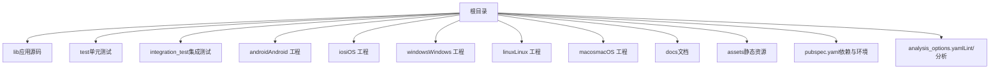
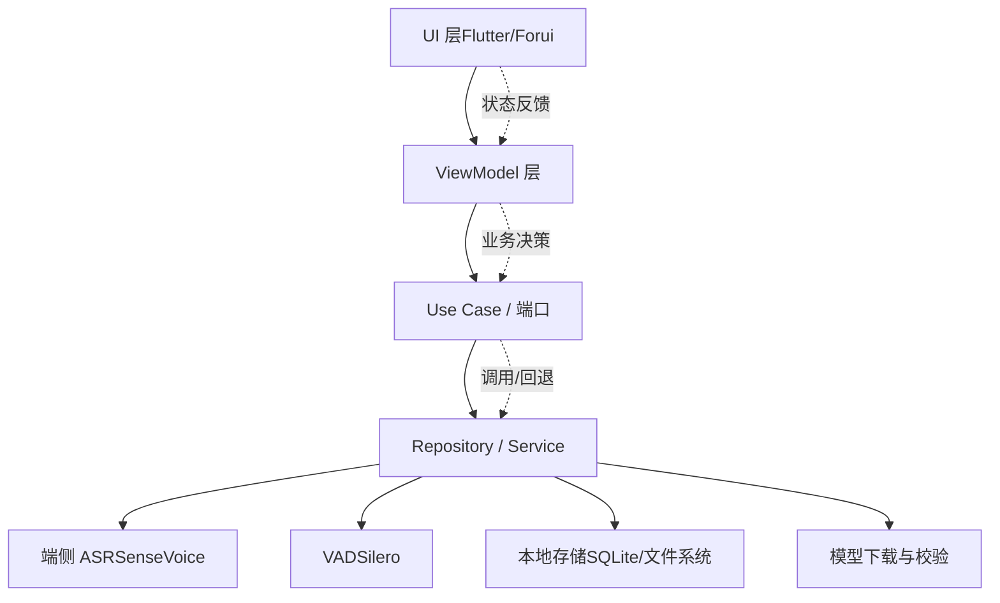
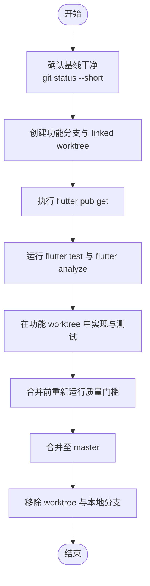
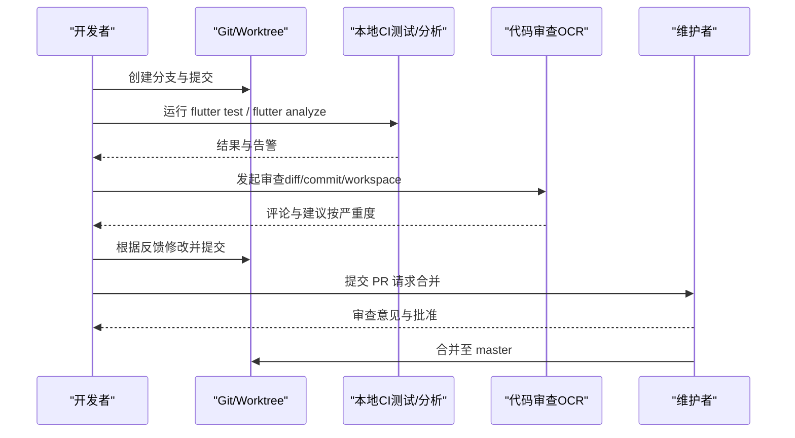
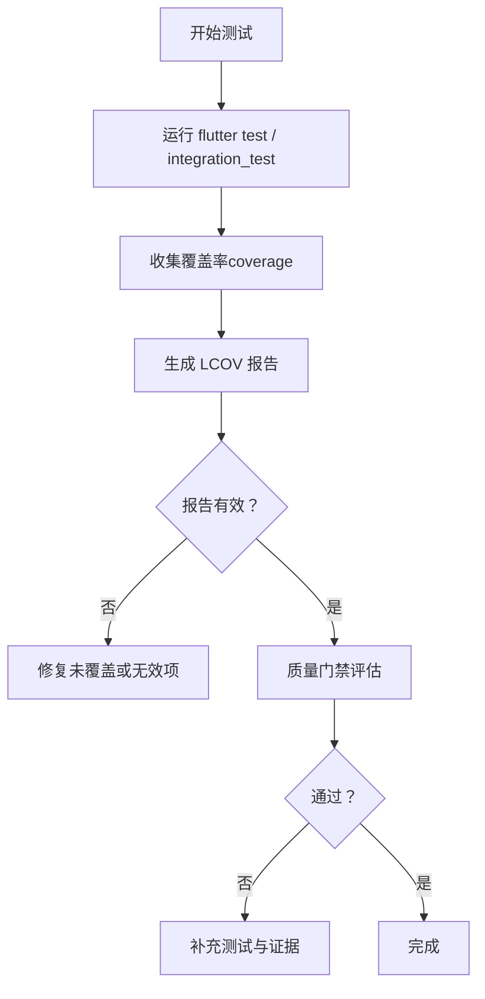
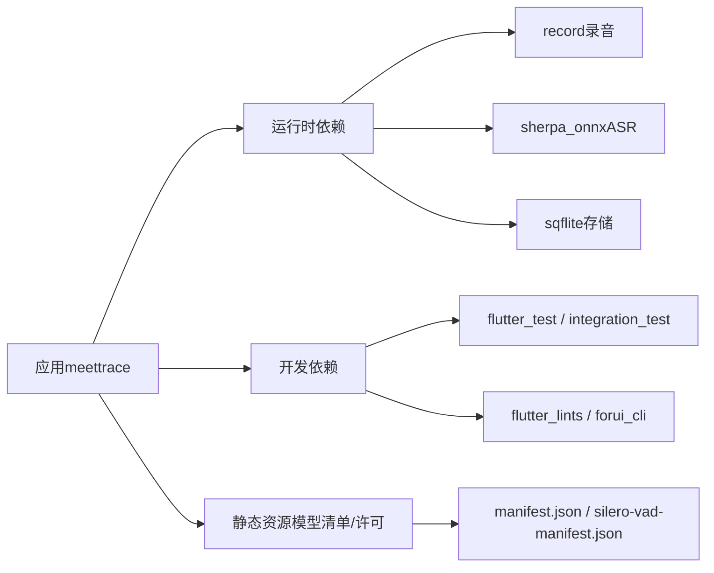

# 贡献指南

<cite>
**本文引用的文件**   
- [README.md](file://README.md)
- [PRODUCT.md](file://PRODUCT.md)
- [DESIGN.md](file://DESIGN.md)
- [pubspec.yaml](file://pubspec.yaml)
- [analysis_options.yaml](file://analysis_options.yaml)
- [Git_分支与_Worktree_约定.md](file://docs/project/Git_分支与_Worktree_约定.md)
- [质量证据索引 README.md](file://docs/quality/README.md)
- [evaluate_alpha_release.dart](file://lib/domain/use_cases/evaluate_alpha_release.dart)
- [SKILL.md（open-code-review-delegate）](file://.agents/skills/open-code-review-delegate/SKILL.md)
</cite>

## 目录
1. [简介](#简介)
2. [项目结构](#项目结构)
3. [核心组件](#核心组件)
4. [架构总览](#架构总览)
5. [详细组件分析](#详细组件分析)
6. [依赖分析](#依赖分析)
7. [性能考虑](#性能考虑)
8. [故障排查指南](#故障排查指南)
9. [结论](#结论)
10. [附录](#附录)

## 简介
本指南面向所有希望参与“会迹（MeetTrace）”项目的贡献者，涵盖从 Fork、克隆、创建分支到提交、代码审查、持续集成检查的完整流程；明确贡献类型（Bug 修复、功能增强、文档改进、测试覆盖）、提交流程规范、社区参与方式（Issue 报告、功能请求、讨论参与），以及维护者职责（代码审查、版本发布、社区管理）。同时提供行为准则与新手入门指引，确保友好、高效的协作环境。

## 项目结构
仓库采用 Flutter 多平台工程组织：
- lib：应用源码（UI、领域、数据等分层）
- test / integration_test：单元测试与集成测试
- android / ios / windows / linux / macos：各平台原生工程与配置
- docs：产品、技术、质量与项目约定文档
- assets：模型清单与许可证等静态资源
- pubspec.yaml：依赖与环境约束
- analysis_options.yaml：静态分析与 Lint 规则

**章节来源**
- [README.md:1-11](file://README.md#L1-L11)
- [pubspec.yaml:1-112](file://pubspec.yaml#L1-L112)
- [analysis_options.yaml:1-35](file://analysis_options.yaml#L1-L35)

## 核心组件
- 产品上下文与边界：以本地事实音频为核心，端侧转录与总结可降级，Alpha 阶段无登录与跨设备同步。
- 设计系统：灰阶、克制、低噪声，强调时间账本与证据链；组件优先使用 Forui 令牌。
- 质量门禁：通过质量文档与评估用例保障 Alpha 发布门槛与真机证据。

**章节来源**
- [PRODUCT.md:1-128](file://PRODUCT.md#L1-L128)
- [DESIGN.md:1-337](file://DESIGN.md#L1-L337)
- [质量证据索引 README.md:1-34](file://docs/quality/README.md#L1-L34)

## 架构总览
会迹遵循“View → ViewModel → Use Case / Port → Repository / Service”的分层架构，UI 不直接访问 ONNX、存储或 HTTP。ASR、VAD、录音、存储、模型分发等能力通过领域层与数据层解耦，保证可靠性与可测试性。

**图示来源**
- [PRODUCT.md:70-80](file://PRODUCT.md#L70-L80)

**章节来源**
- [PRODUCT.md:70-80](file://PRODUCT.md#L70-L80)

## 详细组件分析

### 贡献类型与范围
- Bug 修复：定位并修复录音中断、转录失败、界面异常等问题，需补充回归测试与证据说明。
- 功能增强：在现有边界内扩展能力（如新增预览队列优化、证据展示增强），不得破坏事实音频优先原则。
- 文档改进：完善产品、设计、质量与技术文档，保持与 PRD 和技术方案一致。
- 测试覆盖：为关键路径增加单元/集成测试，提升稳定性与可回归性。

**章节来源**
- [PRODUCT.md:1-128](file://PRODUCT.md#L1-L128)
- [DESIGN.md:1-337](file://DESIGN.md#L1-L337)
- [质量证据索引 README.md:1-34](file://docs/quality/README.md#L1-L34)

### 分支与工作区约定
- 分支命名：master 为稳定线；codex/<topic> 用于默认功能/修复/文档；必要时 codex/alpha-step-<NN>-<topic>。
- Worktree 布局：统一放置于 .worktrees/<branch-topic>/，一个分支同一时间仅一个 worktree 检出。
- 标准流程：基线确认 → 创建分支与 linked worktree → 依赖获取 → 运行测试与分析 → 实现与提交 → 合并前复验 → 清理工作区。

**图示来源**
- [Git_分支与_Worktree_约定.md:1-58](file://docs/project/Git_分支与_Worktree_约定.md#L1-L58)

**章节来源**
- [Git_分支与_Worktree_约定.md:1-58](file://docs/project/Git_分支与_Worktree_约定.md#L1-L58)

### 提交流程与提交信息规范
- 提交信息：优先中文祈使语气，清晰描述变更目的与影响范围；关联 Issue/PRD 步骤编号。
- 代码审查：使用 open-code-review-delegate 技能进行差异对比、规则匹配与评论输出；按严重度分类并给出修复建议。
- 持续集成检查：本地先跑 flutter test、flutter analyze 与质量门禁；合并前确保通过。

**图示来源**
- [SKILL.md（open-code-review-delegate）:53-147](file://.agents/skills/open-code-review-delegate/SKILL.md#L53-L147)

**章节来源**
- [SKILL.md（open-code-review-delegate）:53-147](file://.agents/skills/open-code-review-delegate/SKILL.md#L53-L147)

### 代码风格与静态分析
- 启用严格模式：strict-casts、strict-inference、strict-raw-types。
- Lint 规则：基于 flutter_lints，可按需增删；避免随意禁用规则，确需忽略应标注原因。
- 错误处理：区分 Exception 与 Error，禁止捕获 Error；使用 rethrow 保留堆栈。

**章节来源**
- [analysis_options.yaml:1-35](file://analysis_options.yaml#L1-L35)

### 测试与覆盖率
- 测试类型：单元测试（Dart）、组件测试（Flutter）、集成测试（设备流程）。
- 覆盖率收集：使用 coverage 包生成 LCOV 报告；对特定行/块/文件可使用忽略指令。
- 质量门禁：结合 evaluate_alpha_release 用例与质量文档，确保 Alpha 发布门槛满足。

**图示来源**
- [evaluate_alpha_release.dart:443-497](file://lib/domain/use_cases/evaluate_alpha_release.dart#L443-L497)

**章节来源**
- [evaluate_alpha_release.dart:443-497](file://lib/domain/use_cases/evaluate_alpha_release.dart#L443-L497)

### 设计与实现约束
- 设计系统：灰阶语义、时间账本、Forui 令牌；避免装饰性元素与虚构 AI 可视化。
- 交互规范：两端原生语义保留；触控目标、字体缩放、深色模式与辅助功能必须验证。
- 文案风格：冷静、明确、可信；避免模糊文案与夸大表述。

**章节来源**
- [DESIGN.md:1-337](file://DESIGN.md#L1-L337)

### 新贡献者入门
- 环境准备：安装 Flutter SDK（^3.12.2）、Android/iOS 工具链；执行 flutter pub get。
- 首次运行：确认基线可用（flutter test、flutter analyze），阅读 PRODUCT.md 与 DESIGN.md。
- 任务选择：从 Issue 或 PRD 步骤中选择合适任务，遵循分支与工作区约定。
- 提交与审查：按规范提交信息，发起审查并根据反馈迭代。

**章节来源**
- [pubspec.yaml:21-23](file://pubspec.yaml#L21-L23)
- [PRODUCT.md:1-128](file://PRODUCT.md#L1-L128)
- [DESIGN.md:1-337](file://DESIGN.md#L1-L337)

## 依赖分析
- 运行时依赖：录音、网络、加密、路径、前台任务、ONNX 推理、分享、SQLite 等。
- 开发依赖：测试框架、集成测试、SQLite3、Lint 与 CLI 工具。
- 构建与资产：模型清单与许可证纳入 assets，确保首次初始化与校验。

**图示来源**
- [pubspec.yaml:30-53](file://pubspec.yaml#L30-L53)
- [pubspec.yaml:74-80](file://pubspec.yaml#L74-L80)

**章节来源**
- [pubspec.yaml:30-53](file://pubspec.yaml#L30-L53)
- [pubspec.yaml:74-80](file://pubspec.yaml#L74-L80)

## 性能考虑
- 录音与推理隔离：确保事实录音不受 ASR/VAD 性能波动影响。
- 内存与渲染：避免布局抖动与昂贵动画；合理使用 Forui 令牌与最小化重绘。
- 资源体积：模型与资产按需下载与校验，避免打包过大。

[本节为通用指导，无需具体文件引用]

## 故障排查指南
- 静态分析错误：依据 analysis_options.yaml 与 Lint 规则定位问题，优先自动修复后手动处理剩余项。
- 运行时错误：区分可恢复异常与不可恢复错误，避免捕获 Error；使用 rethrow 保留堆栈。
- 质量门禁失败：对照质量证据索引与评估用例，补齐设备证据与命令记录。

**章节来源**
- [analysis_options.yaml:1-35](file://analysis_options.yaml#L1-L35)
- [质量证据索引 README.md:1-34](file://docs/quality/README.md#L1-L34)

## 结论
通过明确的分支与工作区约定、严格的提交与审查流程、完善的测试与质量门禁，以及以本地事实音频为核心的产品与设计约束，会迹项目能够持续交付高质量、可追溯、可恢复的会议记录体验。贡献者应遵循本指南，确保协作顺畅与成果可靠。

[本节为总结性内容，无需具体文件引用]

## 附录
- 行为准则与社区规范：尊重他人、聚焦事实与证据、避免虚构能力与宣传；沟通简洁明确，冲突以 PRD 为准。
- 维护者职责：代码审查把关质量、版本发布遵循门禁与证据、社区管理鼓励协作与学习。
- 资源链接：产品上下文（PRODUCT.md）、设计系统（DESIGN.md）、质量证据索引（docs/quality/README.md）、分支约定（docs/project/Git_分支与_Worktree_约定.md）。

[本节为补充信息，无需具体文件引用]