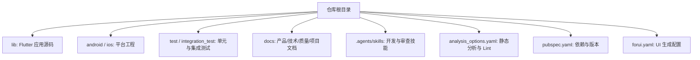
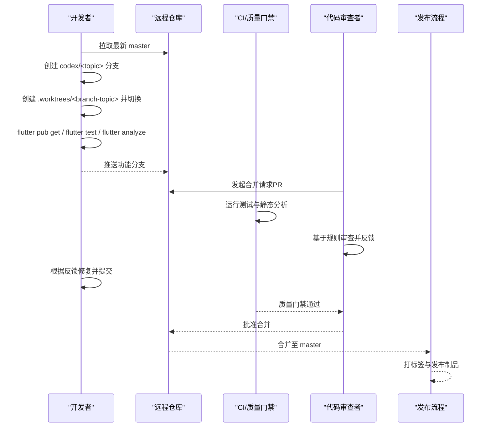
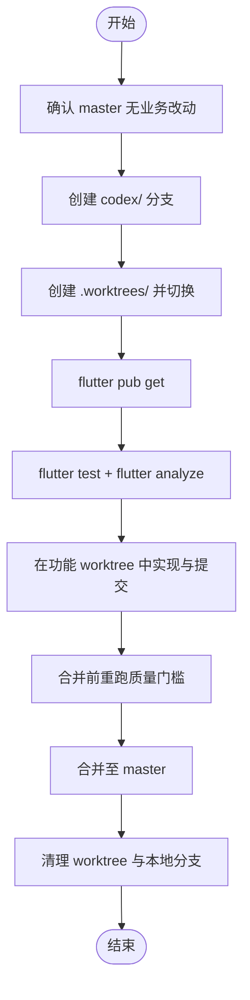
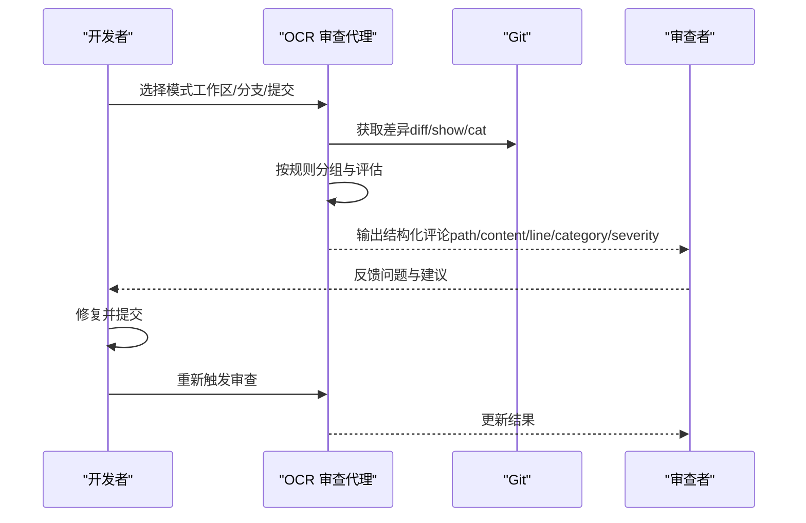
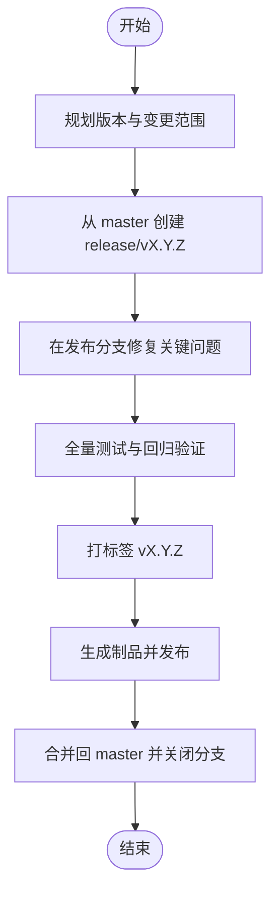
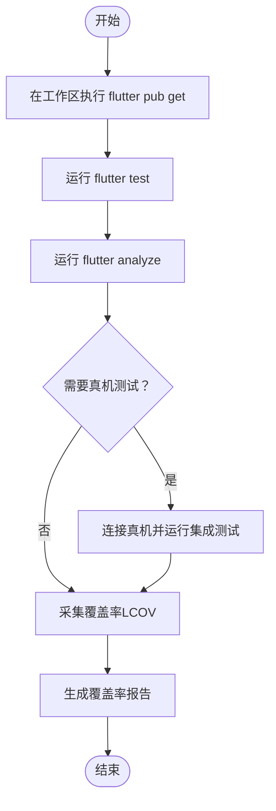
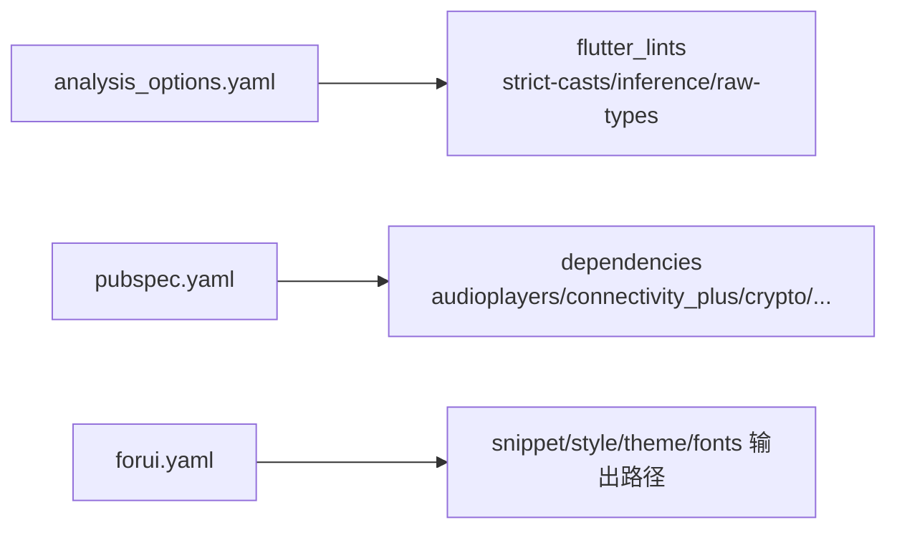

# 项目开发流程

<cite>
**本文引用的文件**   
- [README.md](file://README.md)
- [Git_分支与_Worktree_约定.md](file://docs/project/Git_分支与_Worktree_约定.md)
- [using-git-worktrees SKILL.md](file://.agents/skills/using-git-worktrees/SKILL.md)
- [analysis_options.yaml](file://analysis_options.yaml)
- [pubspec.yaml](file://pubspec.yaml)
- [forui.yaml](file://forui.yaml)
- [open-code-review-delegate SKILL.md](file://.agents/skills/open-code-review-delegate/SKILL.md)
- [dart-collect-coverage SKILL.md](file://.agents/skills/dart-collect-coverage/SKILL.md)
- [emil-design-eng SKILL.md](file://.agents/skills/emil-design-eng/SKILL.md)
</cite>

## 目录
1. [简介](#简介)
2. [项目结构](#项目结构)
3. [核心组件](#核心组件)
4. [架构总览](#架构总览)
5. [详细组件分析](#详细组件分析)
6. [依赖分析](#依赖分析)
7. [性能考虑](#性能考虑)
8. [故障排查指南](#故障排查指南)
9. [结论](#结论)
10. [附录](#附录)

## 简介
本文件为会迹（MeetTrace）项目的完整开发工作流程说明，覆盖 Git 分支策略、Worktree 使用规范、代码审查流程、版本管理与发布流程、调试与测试流程以及协作与沟通规范。目标是让不同背景的协作者都能按统一标准高效工作，保证主干稳定、变更可追溯、质量可控。

## 项目结构
- 仓库根目录包含 Flutter 应用源码、平台工程（Android/iOS）、测试与工具脚本、文档与技能定义等。
- 文档集中于 docs 目录，其中 project 子目录存放 Git 分支与 Worktree 约定；quality 子目录存放质量相关文档。
- 工具与自动化通过 .agents/skills 下的技能文件组织，如 using-git-worktrees、open-code-review-delegate、dart-collect-coverage 等。
- 构建与静态分析配置位于 analysis_options.yaml、pubspec.yaml、forui.yaml 等。

**章节来源**
- [README.md:1-11](file://README.md#L1-L11)

## 核心组件
- 分支与工作区隔离：master 作为稳定集成线，功能分支以 codex/<topic> 命名，Worktree 统一放置于 .worktrees/<branch-topic>/，确保并行开发与实验性修改互不干扰。
- 代码质量与静态检查：启用 flutter_lints 与严格类型规则，配合 flutter analyze 在合并前执行。
- 测试与覆盖率：单元测试与集成测试分别位于 test 与 integration_test；覆盖率采集遵循 dart-collect-coverage 技能。
- 代码审查：基于 open-code-review-delegate 技能进行规则化审查与评论输出。
- 版本管理：版本号由 pubspec.yaml 的 version 字段维护，遵循语义化版本规则。

**章节来源**
- [Git_分支与_Worktree_约定.md:1-67](file://docs/project/Git_分支与_Worktree_约定.md#L1-L67)
- [analysis_options.yaml:1-35](file://analysis_options.yaml#L1-L35)
- [pubspec.yaml:1-112](file://pubspec.yaml#L1-L112)
- [using-git-worktrees SKILL.md:1-168](file://.agents/skills/using-git-worktrees/SKILL.md#L1-L168)
- [open-code-review-delegate SKILL.md:53-110](file://.agents/skills/open-code-review-delegate/SKILL.md#L53-L110)
- [dart-collect-coverage SKILL.md:1-40](file://.agents/skills/dart-collect-coverage/SKILL.md#L1-L40)

## 架构总览
下图展示从需求到发布的端到端流程，包括分支创建、Worktree 隔离、本地验证、代码审查、合并与发布。

[该图为概念流程图，无需图示来源]

## 详细组件分析

### Git 分支策略与 Worktree 使用
- 分支职责
  - master：稳定集成线，仅接收已完成质量门槛的步骤。
  - codex/<topic>：默认功能、修复或文档分支，从最新稳定基线创建。
  - 可选 codex/alpha-step-<NN>-<topic>：对应交付步骤时使用，但编号不替代 PRD/Issue 关联。
- Worktree 布局与安全规则
  - 统一路径：.worktrees/<branch-topic>/
  - 安全规则：禁止 git reset --hard、git checkout -- 清理用户改动；未提交产物先 stash；不强制推送、不随意删除远端分支；worktree 有未提交内容时禁止强制移除；模型下载、真实录音与构建产物不进分支。
- 标准流程
  - 确认基线干净 → 创建功能分支与 linked worktree → 在新 worktree 中获取依赖 → 运行测试与分析 → 仅在功能 worktree 实现与提交 → 合并前重跑质量门槛 → 合并后清理 worktree 与本地分支。

**图示来源**
- [Git_分支与_Worktree_约定.md:34-67](file://docs/project/Git_分支与_Worktree_约定.md#L34-L67)
- [using-git-worktrees SKILL.md:86-140](file://.agents/skills/using-git-worktrees/SKILL.md#L86-L140)

**章节来源**
- [Git_分支与_Worktree_约定.md:1-67](file://docs/project/Git_分支与_Worktree_约定.md#L1-L67)
- [using-git-worktrees SKILL.md:1-168](file://.agents/skills/using-git-worktrees/SKILL.md#L1-L168)

### 代码审查流程
- 审查入口与模式
  - 支持工作区变更、分支对比、单提交三种模式。
- 规则与差异获取
  - 通过 ocr delegate rule 获取文件分组规则；使用 git diff/git show/cat 获取差异。
- 审查输出格式
  - 每条评论需包含 path、content、start_line、end_line、category、severity 等字段，便于追踪与处理。
- 反馈处理
  - 开发者根据评论修复并提交，直至质量门禁通过并获得批准。

**图示来源**
- [open-code-review-delegate SKILL.md:53-110](file://.agents/skills/open-code-review-delegate/SKILL.md#L53-L110)

**章节来源**
- [open-code-review-delegate SKILL.md:53-110](file://.agents/skills/open-code-review-delegate/SKILL.md#L53-L110)

### 版本管理与发布流程
- 版本号规则
  - 使用语义化版本：主版本.次版本.修订号+构建号（例如 1.0.0+1）。
  - Android 使用 build-name 映射 versionName，build-number 映射 versionCode；iOS 使用 CFBundleShortVersionString 与 CFBundleVersion。
- 变更日志
  - 建议在合并请求与发布分支中维护变更摘要，并在发布时归档为变更记录。
- 发布分支策略
  - 从 master 创建发布分支（如 release/vX.Y.Z），冻结新增功能，仅允许缺陷修复与发布准备；完成后打标签并合并回 master。

[该图为概念流程图，无需图示来源]

**章节来源**
- [pubspec.yaml:7-19](file://pubspec.yaml#L7-L19)

### 调试与测试流程
- 本地调试
  - 在功能 worktree 中执行 flutter pub get，随后运行 flutter test 与 flutter analyze，确保基线可用。
- 真机测试
  - 对于触摸交互与手势，优先在物理设备上进行测试；可使用 Safari 远程 devtools 或 Xcode Simulator 辅助。
- 自动化测试执行
  - 单元测试位于 test，集成测试位于 integration_test；覆盖率采集遵循 dart-collect-coverage 技能，生成 LCOV 报告。

**章节来源**
- [Git_分支与_Worktree_约定.md:34-42](file://docs/project/Git_分支与_Worktree_约定.md#L34-L42)
- [emil-design-eng SKILL.md:654-656](file://.agents/skills/emil-design-eng/SKILL.md#L654-L656)
- [dart-collect-coverage SKILL.md:1-40](file://.agents/skills/dart-collect-coverage/SKILL.md#L1-L40)

### 协作工具与沟通规范
- 工具链
  - 使用 .agents/skills 中的技能驱动工作流，如 using-git-worktrees、open-code-review-delegate、dart-collect-coverage。
- 沟通规范
  - 提交信息优先使用中文祈使语气，明确动作与目标。
  - 合并请求需关联 PRD/Issue，避免仅用步骤编号代替上下文。
  - 审查反馈需结构化（path/content/line/category/severity），便于追踪与闭环。

**章节来源**
- [Git_分支与_Worktree_约定.md:1-12](file://docs/project/Git_分支与_Worktree_约定.md#L1-L12)
- [open-code-review-delegate SKILL.md:99-110](file://.agents/skills/open-code-review-delegate/SKILL.md#L99-L110)

## 依赖分析
- 静态分析与 Lint
  - analysis_options.yaml 启用 flutter_lints 与严格类型规则，确保代码风格与类型安全。
- 依赖与构建
  - pubspec.yaml 管理 Flutter 依赖与版本，包含音频、网络、存储、ASR、数据库等关键包。
- UI 生成
  - forui.yaml 配置 snippet/style/theme/fonts 的输出路径，统一 UI 资产生成位置。

**图示来源**
- [analysis_options.yaml:1-35](file://analysis_options.yaml#L1-L35)
- [pubspec.yaml:1-112](file://pubspec.yaml#L1-L112)
- [forui.yaml:1-13](file://forui.yaml#L1-L13)

**章节来源**
- [analysis_options.yaml:1-35](file://analysis_options.yaml#L1-L35)
- [pubspec.yaml:1-112](file://pubspec.yaml#L1-L112)
- [forui.yaml:1-13](file://forui.yaml#L1-L13)

## 性能考虑
- 在功能 worktree 中尽早运行 flutter analyze 与 flutter test，避免累积问题导致后期性能瓶颈。
- 对 ASR 与音频处理模块，关注内存占用与 CPU 使用，必要时引入基准测试与性能监控。
- 构建产物与模型文件应排除出分支，减少仓库体积与加载时间。

[本节为通用指导，无需特定文件来源]

## 故障排查指南
- 常见分支与 Worktree 问题
  - 若 worktree 存在未提交内容，禁止强制移除；先 stash 或提交后再操作。
  - 若 .worktrees/ 未被忽略，需添加到 .gitignore 并提交，防止误提交。
- 代码审查失败
  - 检查差异是否正确获取，确认规则分组与评论格式是否符合要求。
- 测试失败
  - 在功能 worktree 中复现，确认依赖安装与环境配置正确；逐步缩小范围定位问题。

**章节来源**
- [Git_分支与_Worktree_约定.md:60-67](file://docs/project/Git_分支与_Worktree_约定.md#L60-L67)
- [using-git-worktrees SKILL.md:86-100](file://.agents/skills/using-git-worktrees/SKILL.md#L86-L100)
- [open-code-review-delegate SKILL.md:99-110](file://.agents/skills/open-code-review-delegate/SKILL.md#L99-L110)

## 结论
通过统一的分支策略、Worktree 隔离、代码审查与测试流程，会迹项目能够在多平台环境下保持高质量与高稳定性。建议持续完善自动化门禁与文档，确保新成员快速上手并遵循规范。

[本节为总结，无需特定文件来源]

## 附录
- 常用命令参考
  - 查看 worktree 关系：git worktree list、git branch -vv、git status --short --branch
  - 运行测试与分析：flutter test、flutter analyze
  - 采集覆盖率：遵循 dart-collect-coverage 技能生成 LCOV 报告

**章节来源**
- [Git_分支与_Worktree_约定.md:52-58](file://docs/project/Git_分支与_Worktree_约定.md#L52-L58)
- [dart-collect-coverage SKILL.md:1-40](file://.agents/skills/dart-collect-coverage/SKILL.md#L1-L40)