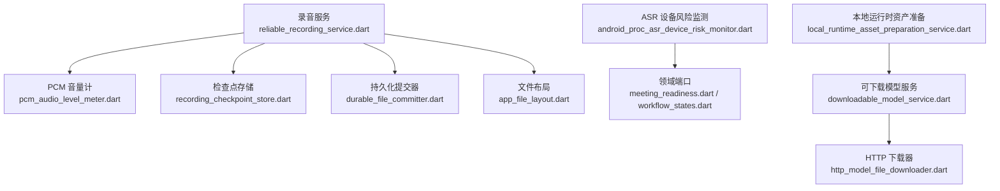
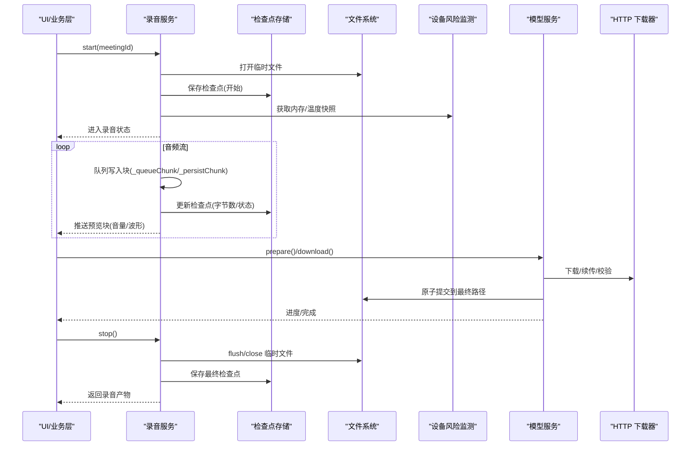
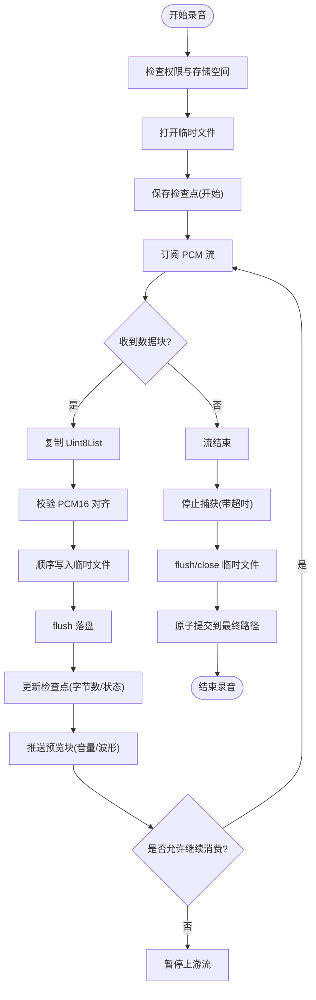
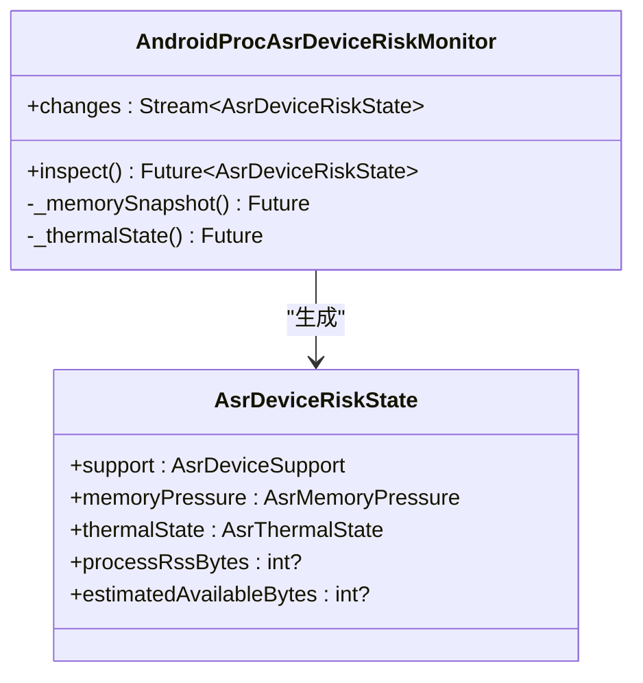
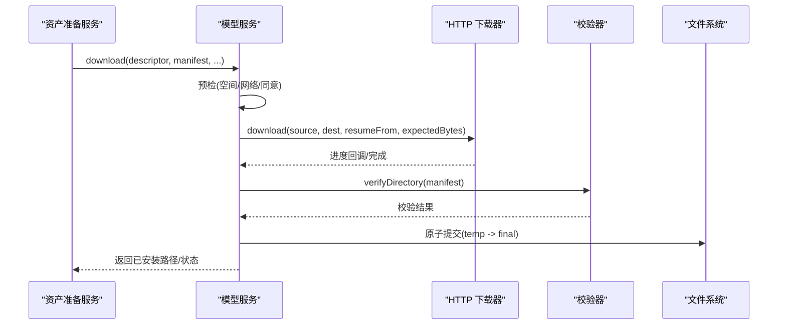
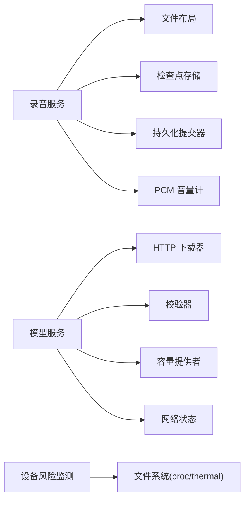

# 内存管理优化

<cite>
**本文引用的文件**
- [reliable_recording_service.dart](file://lib/data/services/audio/reliable_recording_service.dart)
- [android_proc_asr_device_risk_monitor.dart](file://lib/data/services/asr/android_proc_asr_device_risk_monitor.dart)
- [downloadable_model_service.dart](file://lib/data/services/models/downloadable_model_service.dart)
- [local_runtime_asset_preparation_service.dart](file://lib/data/services/models/local_runtime_asset_preparation_service.dart)
- [http_model_file_downloader.dart](file://lib/data/services/models/http_model_file_downloader.dart)
- [recording_checkpoint_store.dart](file://lib/data/services/audio/recording_checkpoint_store.dart)
- [durable_file_committer.dart](file://lib/data/services/storage/durable_file_committer.dart)
- [app_file_layout.dart](file://lib/data/services/storage/app_file_layout.dart)
- [pcm_audio_level_meter.dart](file://lib/data/services/audio/pcm_audio_level_meter.dart)
- [meeting_readiness.dart](file://lib/domain/models/meeting_readiness.dart)
- [recording.dart](file://lib/domain/models/recording.dart)
- [workflow_states.dart](file://lib/domain/models/workflow_states.dart)
- [recording_session.dart](file://lib/domain/ports/recording_session.dart)
</cite>

## 目录
1. [引言](#引言)
2. [项目结构](#项目结构)
3. [核心组件](#核心组件)
4. [架构总览](#架构总览)
5. [详细组件分析](#详细组件分析)
6. [依赖关系分析](#依赖关系分析)
7. [性能与内存特性](#性能与内存特性)
8. [故障排查指南](#故障排查指南)
9. [结论](#结论)
10. [附录：监控与工具使用](#附录监控与工具使用)

## 引言
本文件面向会迹（MeetTrace）Flutter 应用的内存管理优化，聚焦以下目标：
- Dart VM 垃圾回收与大对象处理策略
- 音频录制过程中的 PCM 缓冲、流式写入与资源释放
- ONNX 模型加载的内存优化（下载、校验、提交、分块与资源释放）
- 设备侧内存压力感知与降级策略
- 内存监控与诊断工具使用方法
- 最佳实践与常见问题解决方案

## 项目结构
围绕内存优化的关键代码集中在数据服务层：
- 音频录制可靠写入与预览分发
- ASR 设备风险监测（内存/温度）
- 可下载模型服务（下载、校验、提交、删除）
- 本地运行时资产准备（模型与 VAD 资源初始化）

图表来源
- [reliable_recording_service.dart:1-451](file://lib/data/services/audio/reliable_recording_service.dart#L1-L451)
- [android_proc_asr_device_risk_monitor.dart:1-151](file://lib/data/services/asr/android_proc_asr_device_risk_monitor.dart#L1-L151)
- [downloadable_model_service.dart:1-722](file://lib/data/services/models/downloadable_model_service.dart#L1-L722)
- [local_runtime_asset_preparation_service.dart:1-201](file://lib/data/services/models/local_runtime_asset_preparation_service.dart#L1-L201)
- [http_model_file_downloader.dart:1-120](file://lib/data/services/models/http_model_file_downloader.dart#L1-L120)
- [recording_checkpoint_store.dart:1-200](file://lib/data/services/audio/recording_checkpoint_store.dart#L1-L200)
- [durable_file_committer.dart:1-200](file://lib/data/services/storage/durable_file_committer.dart#L1-L200)
- [app_file_layout.dart:1-200](file://lib/data/services/storage/app_file_layout.dart#L1-L200)
- [meeting_readiness.dart:1-200](file://lib/domain/models/meeting_readiness.dart#L1-L200)
- [workflow_states.dart:1-200](file://lib/domain/models/workflow_states.dart#L1-L200)

章节来源
- [reliable_recording_service.dart:1-451](file://lib/data/services/audio/reliable_recording_service.dart#L1-L451)
- [downloadable_model_service.dart:1-722](file://lib/data/services/models/downloadable_model_service.dart#L1-L722)
- [local_runtime_asset_preparation_service.dart:1-201](file://lib/data/services/models/local_runtime_asset_preparation_service.dart#L1-L201)
- [android_proc_asr_device_risk_monitor.dart:1-151](file://lib/data/services/asr/android_proc_asr_device_risk_monitor.dart#L1-L151)

## 核心组件
- 可靠录音服务：负责 PCM 流式写入、预览分发、检查点持久化、前台生命周期管理与资源释放。
- ASR 设备风险监测：读取 Android procfs/sysfs 估算可用内存与热状态，输出风险快照。
- 可下载模型服务：实现模型下载、断点续传、完整性校验、原子提交与删除，包含网络与存储空间预检。
- 本地运行时资产准备：协调模型与 VAD 资源的快速就绪检查、下载与进度上报。

章节来源
- [reliable_recording_service.dart:18-120](file://lib/data/services/audio/reliable_recording_service.dart#L18-L120)
- [android_proc_asr_device_risk_monitor.dart:16-46](file://lib/data/services/asr/android_proc_asr_device_risk_monitor.dart#L16-L46)
- [downloadable_model_service.dart:147-200](file://lib/data/services/models/downloadable_model_service.dart#L147-L200)
- [local_runtime_asset_preparation_service.dart:9-50](file://lib/data/services/models/local_runtime_asset_preparation_service.dart#L9-L50)

## 架构总览
下图展示录音、模型下载与设备风险监测在内存管理上的交互关系。

图表来源
- [reliable_recording_service.dart:90-260](file://lib/data/services/audio/reliable_recording_service.dart#L90-L260)
- [downloadable_model_service.dart:168-300](file://lib/data/services/models/downloadable_model_service.dart#L168-L300)
- [http_model_file_downloader.dart:1-120](file://lib/data/services/models/http_model_file_downloader.dart#L1-L120)
- [android_proc_asr_device_risk_monitor.dart:32-46](file://lib/data/services/asr/android_proc_asr_device_risk_monitor.dart#L32-L46)

## 详细组件分析

### 录音服务与 PCM 流式写入
- 流式写入：通过 Stream 订阅 PCM 数据，逐块复制并顺序写入临时文件，避免一次性加载大数组。
- 对齐校验：对 PCM16 样本边界进行奇偶长度校验，防止损坏数据。
- 背压控制：写入未完成时暂停上游流，完成后恢复，降低峰值内存占用。
- 检查点持久化：每次写入后更新检查点，支持崩溃恢复与中断续录。
- 资源释放：stop/finalize 阶段确保关闭文件句柄、取消订阅、释放平台捕获资源。

图表来源
- [reliable_recording_service.dart:120-210](file://lib/data/services/audio/reliable_recording_service.dart#L120-L210)
- [reliable_recording_service.dart:262-316](file://lib/data/services/audio/reliable_recording_service.dart#L262-L316)
- [reliable_recording_service.dart:329-341](file://lib/data/services/audio/reliable_recording_service.dart#L329-L341)

章节来源
- [reliable_recording_service.dart:90-260](file://lib/data/services/audio/reliable_recording_service.dart#L90-L260)
- [reliable_recording_service.dart:262-316](file://lib/data/services/audio/reliable_recording_service.dart#L262-L316)
- [reliable_recording_service.dart:349-433](file://lib/data/services/audio/reliable_recording_service.dart#L349-L433)

### ASR 设备风险监测（内存/温度）
- 内存快照：解析 /proc/meminfo 的 MemTotal/MemAvailable，估算系统可用内存。
- 热状态：扫描 /sys/class/thermal 下的 thermal_zone 节点，取最高温度判断热等级。
- 风险输出：综合设备支持度、内存压力、热状态与进程 RSS，输出 AsrDeviceRiskState。
- 阈值策略：定义警告与临界阈值，用于上层降级或限制模型规模。

图表来源
- [android_proc_asr_device_risk_monitor.dart:16-46](file://lib/data/services/asr/android_proc_asr_device_risk_monitor.dart#L16-L46)
- [android_proc_asr_device_risk_monitor.dart:48-90](file://lib/data/services/asr/android_proc_asr_device_risk_monitor.dart#L48-L90)
- [android_proc_asr_device_risk_monitor.dart:106-130](file://lib/data/services/asr/android_proc_asr_device_risk_monitor.dart#L106-L130)

章节来源
- [android_proc_asr_device_risk_monitor.dart:1-151](file://lib/data/services/asr/android_proc_asr_device_risk_monitor.dart#L1-151)

### 可下载模型服务（下载/校验/提交/删除）
- 预检：检查存储空间、网络类型与用户同意；限制最大下载大小。
- 下载：支持断点续传、Range 请求、进度回调与取消令牌。
- 校验：基于 Manifest 的文件集合与 SHA-256 校验，保证完整性。
- 提交：原子性将临时目录内容移动到最终安装目录，激活为活动版本。
- 删除：校验无活动租约后递归删除临时与最终目录，更新数据库状态。

图表来源
- [downloadable_model_service.dart:168-300](file://lib/data/services/models/downloadable_model_service.dart#L168-L300)
- [downloadable_model_service.dart:302-362](file://lib/data/services/models/downloadable_model_service.dart#L302-L362)
- [downloadable_model_service.dart:500-550](file://lib/data/services/models/downloadable_model_service.dart#L500-L550)
- [http_model_file_downloader.dart:1-120](file://lib/data/services/models/http_model_file_downloader.dart#L1-L120)

章节来源
- [downloadable_model_service.dart:1-722](file://lib/data/services/models/downloadable_model_service.dart#L1-L722)
- [local_runtime_asset_preparation_service.dart:54-182](file://lib/data/services/models/local_runtime_asset_preparation_service.dart#L54-L182)

### 本地运行时资产准备（模型+VAD）
- 快速就绪：仅检查安装记录、活动版本与文件大小匹配，避免重复校验。
- 并行准备：分别检查模型与 VAD 是否就绪，必要时触发下载。
- 进度聚合：合并两个资源的下载进度，统一上报给 UI。
- 取消与恢复：支持取消令牌，保留已完成分片以便后续恢复。

章节来源
- [local_runtime_asset_preparation_service.dart:54-182](file://lib/data/services/models/local_runtime_asset_preparation_service.dart#L54-L182)
- [downloadable_model_service.dart:367-397](file://lib/data/services/models/downloadable_model_service.dart#L367-L397)

## 依赖关系分析
- 录音服务依赖：
  - 文件布局：确定临时与最终路径
  - 检查点存储：持久化录制状态与字节数
  - 持久化提交器：原子提交临时文件
  - PCM 音量计：计算音量并推送预览
- 模型服务依赖：
  - HTTP 下载器：网络 IO 与断点续传
  - 校验器：Manifest 与 SHA-256
  - 容量提供者：磁盘空间检测
  - 网络状态提供者：在线/计费网络判断
- 设备风险监测依赖：
  - 文件系统：读取 /proc/meminfo 与 /sys/class/thermal

图表来源
- [reliable_recording_service.dart:1-451](file://lib/data/services/audio/reliable_recording_service.dart#L1-L451)
- [downloadable_model_service.dart:1-722](file://lib/data/services/models/downloadable_model_service.dart#L1-L722)
- [android_proc_asr_device_risk_monitor.dart:1-151](file://lib/data/services/asr/android_proc_asr_device_risk_monitor.dart#L1-L151)

章节来源
- [reliable_recording_service.dart:1-451](file://lib/data/services/audio/reliable_recording_service.dart#L1-L451)
- [downloadable_model_service.dart:1-722](file://lib/data/services/models/downloadable_model_service.dart#L1-L722)
- [android_proc_asr_device_risk_monitor.dart:1-151](file://lib/data/services/asr/android_proc_asr_device_risk_monitor.dart#L1-L151)

## 性能与内存特性
- Dart VM 垃圾回收与大对象
  - 短生命周期对象频繁分配易触发 GC，建议复用缓冲区与减少临时对象创建。
  - 大对象（如整段 PCM 或模型文件）应避免全量驻留堆内，优先使用流式读写与映射。
- 音频 PCM 缓冲策略
  - 采用小块流式写入，避免一次性加载全部音频数据。
  - 使用 Uint8List.fromList 拷贝确保异步安全，但需控制拷贝频率与大小。
  - 背压机制（暂停/恢复订阅）平衡生产者与消费者速率，降低峰值内存。
- 模型加载内存优化
  - 下载阶段使用断点续传与 Range 请求，避免重复下载与内存堆积。
  - 校验阶段按 Manifest 逐个文件验证，失败即中止，减少无效内存占用。
  - 提交阶段原子移动目录，避免中间态残留。
- 设备内存压力感知
  - 通过 /proc/meminfo 估算可用内存，结合阈值决定降级策略（如降低采样率、禁用实时转录）。
  - 热状态影响 CPU/GPU 调度，高温下应限制后台任务与模型规模。

[本节为通用指导，不直接分析具体文件]

## 故障排查指南
- 录音相关
  - 权限不足：检查麦克风权限与系统授权。
  - 存储空间不足：启动前检查最小可用字节，不足则提示清理。
  - PCM 未对齐：校验块长度为偶数，否则抛出对齐错误。
  - 流结束异常：捕获 onError/onDone，确保清理检查点与临时文件。
- 模型下载相关
  - 网络离线/计费：根据网络类型提示用户确认或等待 Wi-Fi。
  - 校验失败：检查 Manifest 与文件完整性，必要时修复或重新下载。
  - 删除失败：确认无活动租约，再执行删除。
- 设备风险相关
  - 内存不足：availableBytes 低于临界值时，限制模型规模或暂停非关键任务。
  - 过热：thermal 状态为 critical/serious 时，降低负载或冷却后再运行。

章节来源
- [reliable_recording_service.dart:98-156](file://lib/data/services/audio/reliable_recording_service.dart#L98-L156)
- [reliable_recording_service.dart:279-316](file://lib/data/services/audio/reliable_recording_service.dart#L279-L316)
- [downloadable_model_service.dart:552-580](file://lib/data/services/models/downloadable_model_service.dart#L552-L580)
- [android_proc_asr_device_risk_monitor.dart:119-130](file://lib/data/services/asr/android_proc_asr_device_risk_monitor.dart#L119-L130)

## 结论
本项目的内存管理以“流式处理、背压控制、原子提交、风险感知”为核心原则：
- 录音阶段通过小块流式写入与检查点持久化，确保低峰值内存与高可靠性。
- 模型下载阶段通过断点续传、完整性校验与原子提交，避免内存与磁盘浪费。
- 设备风险监测提供内存与热状态快照，支撑动态降级与资源调度。
建议在开发中持续使用内存监控工具，结合上述策略进行调优与问题定位。

[本节为总结，不直接分析具体文件]

## 附录：监控与工具使用
- DevTools 内存分析器
  - 使用 Flutter DevTools 的 Memory 面板观察堆快照、对象分布与增长趋势。
  - 关注大对象（Uint8List、File、Stream）的生命周期与引用链。
- 性能分析器
  - 使用 Performance 面板观察 GC 事件、帧耗时与 I/O 阻塞。
  - 针对录音与下载过程，重点查看 I/O 线程与主线程交互。
- 内存泄漏检测
  - 使用 DevTools 的 Heap Snapshots 对比不同时间点的对象数量与引用。
  - 检查未释放的 StreamSubscription、File 句柄与平台资源。
- 自定义指标
  - 在录音服务中暴露 droppedPreviewChunks、persistedBytes 等指标，辅助评估背压与写入效率。
  - 在设备风险监测中输出 estimatedAvailableBytes、processRssBytes，辅助决策。

[本节为工具使用指导，不直接分析具体文件]