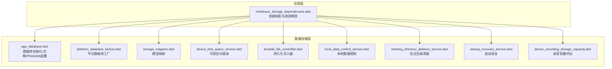
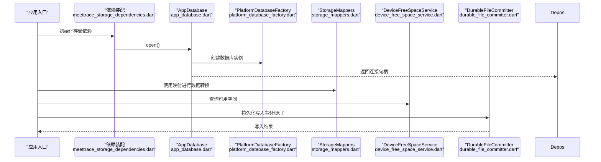
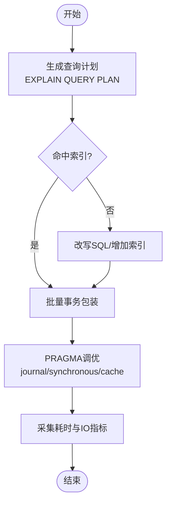
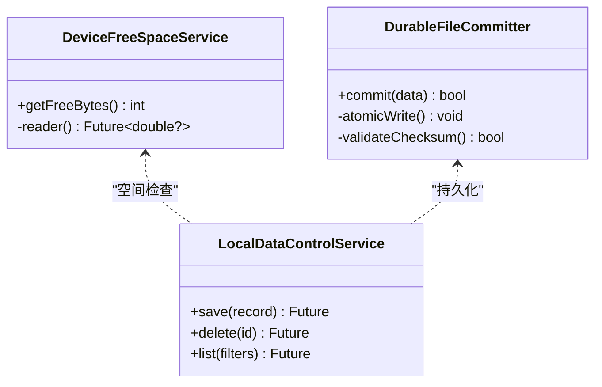
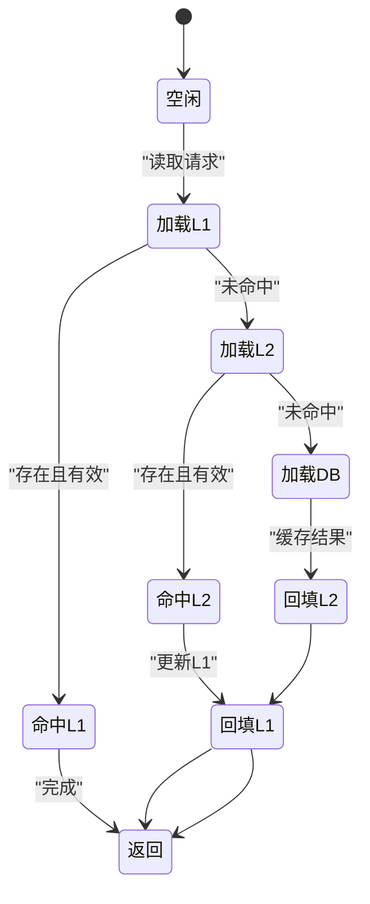
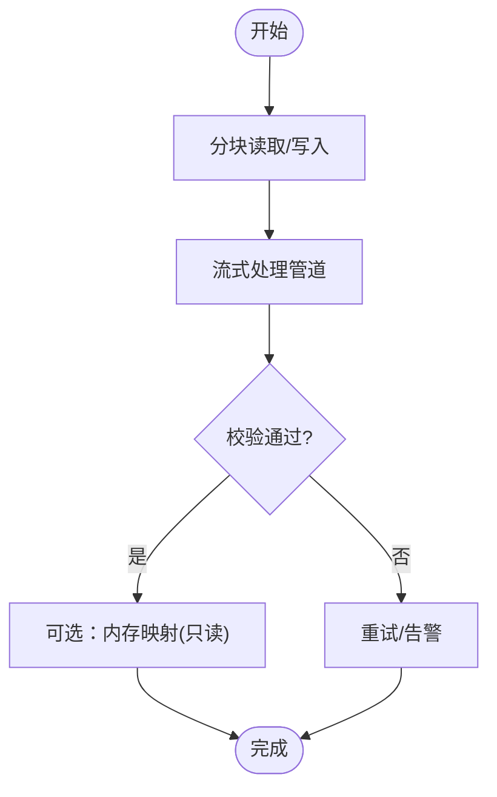
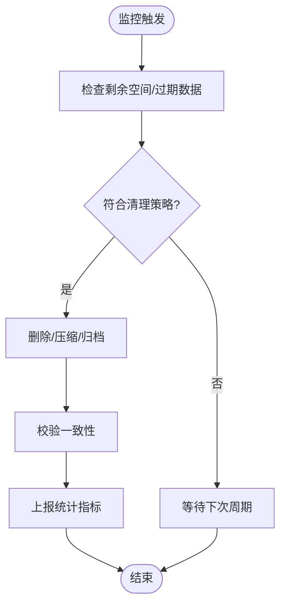
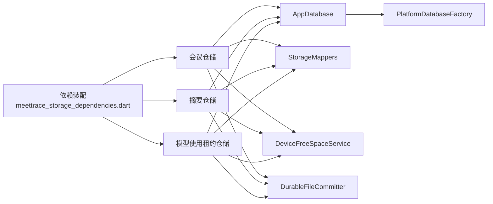

# 存储优化

<cite>
**本文引用的文件**   
- [lib/data/services/storage/app_database.dart](file://lib/data/services/storage/app_database.dart)
- [lib/data/services/storage/platform_database_factory.dart](file://lib/data/services/storage/platform_database_factory.dart)
- [test/data/services/storage/app_database_test.dart](file://test/data/services/storage/app_database_test.dart)
- [lib/app/meettrace_storage_dependencies.dart](file://lib/app/meettrace_storage_dependencies.dart)
- [lib/data/models/storage/storage_mappers.dart](file://lib/data/models/storage/storage_mappers.dart)
- [lib/data/services/storage/device_free_space_service.dart](file://lib/data/services/storage/device_free_space_service.dart)
- [lib/data/services/storage/durable_file_committer.dart](file://lib/data/services/storage/durable_file_committer.dart)
- [lib/data/services/storage/local_data_control_service.dart](file://lib/data/services/storage/local_data_control_service.dart)
- [lib/data/services/storage/meeting_directory_deletion_service.dart](file://lib/data/services/storage/meeting_directory_deletion_service.dart)
- [lib/data/services/storage/startup_recovery_service.dart](file://lib/data/services/storage/startup_recovery_service.dart)
- [lib/data/services/audio/device_recording_storage_capacity.dart](file://lib/data/services/audio/device_recording_storage_capacity.dart)
</cite>

## 目录
1. [简介](#简介)
2. [项目结构](#项目结构)
3. [核心组件](#核心组件)
4. [架构总览](#架构总览)
5. [详细组件分析](#详细组件分析)
6. [依赖关系分析](#依赖关系分析)
7. [性能考量](#性能考量)
8. [故障排查指南](#故障排查指南)
9. [结论](#结论)
10. [附录](#附录)

## 简介
本文件面向“会迹”项目的存储子系统，聚焦 SQLite 数据库查询优化、文件 I/O 优化、缓存机制、大文件处理与存储空间管理。文档基于仓库中现有存储相关实现进行归纳与扩展建议，帮助读者在保持数据一致性与可靠性的前提下，获得更优的读写性能与可观测性。

## 项目结构
存储相关代码主要分布在 data/services/storage 与 app 层依赖装配处，配合测试用例验证迁移、外键约束、磁盘空间读取等关键行为。

**图表来源** 
- [lib/app/meettrace_storage_dependencies.dart](file://lib/app/meettrace_storage_dependencies.dart)
- [lib/data/services/storage/app_database.dart](file://lib/data/services/storage/app_database.dart)
- [lib/data/services/storage/platform_database_factory.dart](file://lib/data/services/storage/platform_database_factory.dart)
- [lib/data/models/storage/storage_mappers.dart](file://lib/data/models/storage/storage_mappers.dart)
- [lib/data/services/storage/device_free_space_service.dart](file://lib/data/services/storage/device_free_space_service.dart)
- [lib/data/services/storage/durable_file_committer.dart](file://lib/data/services/storage/durable_file_committer.dart)
- [lib/data/services/storage/local_data_control_service.dart](file://lib/data/services/storage/local_data_control_service.dart)
- [lib/data/services/storage/meeting_directory_deletion_service.dart](file://lib/data/services/storage/meeting_directory_deletion_service.dart)
- [lib/data/services/storage/startup_recovery_service.dart](file://lib/data/services/storage/startup_recovery_service.dart)
- [lib/data/services/audio/device_recording_storage_capacity.dart](file://lib/data/services/audio/device_recording_storage_capacity.dart)

**章节来源**
- [lib/app/meettrace_storage_dependencies.dart](file://lib/app/meettrace_storage_dependencies.dart)
- [lib/data/services/storage/app_database.dart](file://lib/data/services/storage/app_database.dart)
- [lib/data/services/storage/platform_database_factory.dart](file://lib/data/services/storage/platform_database_factory.dart)
- [lib/data/models/storage/storage_mappers.dart](file://lib/data/models/storage/storage_mappers.dart)
- [lib/data/services/storage/device_free_space_service.dart](file://lib/data/services/storage/device_free_space_service.dart)
- [lib/data/services/storage/durable_file_committer.dart](file://lib/data/services/storage/durable_file_committer.dart)
- [lib/data/services/storage/local_data_control_service.dart](file://lib/data/services/storage/local_data_control_service.dart)
- [lib/data/services/storage/meeting_directory_deletion_service.dart](file://lib/data/services/storage/meeting_directory_deletion_service.dart)
- [lib/data/services/storage/startup_recovery_service.dart](file://lib/data/services/storage/startup_recovery_service.dart)
- [lib/data/services/audio/device_recording_storage_capacity.dart](file://lib/data/services/audio/device_recording_storage_capacity.dart)

## 核心组件
- AppDatabase：负责数据库打开、版本迁移、PRAGMA 设置（如外键约束）、Schema 校验。
- PlatformDatabaseFactory：封装平台特定的数据库工厂能力，屏蔽底层差异。
- StorageMappers：领域模型与数据库列之间的映射，减少重复转换逻辑。
- DeviceFreeSpaceService：统一获取应用支持卷的可用空间，返回字节数供上层决策。
- DurableFileCommitter：确保文件写入的原子性与一致性，避免部分写入导致损坏。
- LocalDataControlService：对本地数据的增删改查策略与生命周期控制。
- MeetingDirectoryDeletionService：按策略清理会议目录，回收空间。
- StartupRecoveryService：启动时恢复未完成的会话或临时状态，保证一致性。
- DeviceRecordingStorageCapacity：结合设备能力估算录音存储容量，辅助上限控制。

**章节来源**
- [lib/data/services/storage/app_database.dart](file://lib/data/services/storage/app_database.dart)
- [lib/data/services/storage/platform_database_factory.dart](file://lib/data/services/storage/platform_database_factory.dart)
- [lib/data/models/storage/storage_mappers.dart](file://lib/data/models/storage/storage_mappers.dart)
- [lib/data/services/storage/device_free_space_service.dart](file://lib/data/services/storage/device_free_space_service.dart)
- [lib/data/services/storage/durable_file_committer.dart](file://lib/data/services/storage/durable_file_committer.dart)
- [lib/data/services/storage/local_data_control_service.dart](file://lib/data/services/storage/local_data_control_service.dart)
- [lib/data/services/storage/meeting_directory_deletion_service.dart](file://lib/data/services/storage/meeting_directory_deletion_service.dart)
- [lib/data/services/storage/startup_recovery_service.dart](file://lib/data/services/storage/startup_recovery_service.dart)
- [lib/data/services/audio/device_recording_storage_capacity.dart](file://lib/data/services/audio/device_recording_storage_capacity.dart)

## 架构总览
下图展示从应用依赖注入到存储层的调用路径，以及各服务间的职责边界。

**图表来源** 
- [lib/app/meettrace_storage_dependencies.dart](file://lib/app/meettrace_storage_dependencies.dart)
- [lib/data/services/storage/app_database.dart](file://lib/data/services/storage/app_database.dart)
- [lib/data/services/storage/platform_database_factory.dart](file://lib/data/services/storage/platform_database_factory.dart)
- [lib/data/models/storage/storage_mappers.dart](file://lib/data/models/storage/storage_mappers.dart)
- [lib/data/services/storage/device_free_space_service.dart](file://lib/data/services/storage/device_free_space_service.dart)
- [lib/data/services/storage/durable_file_committer.dart](file://lib/data/services/storage/durable_file_committer.dart)

## 详细组件分析

### SQLite 数据库查询优化
- 索引设计
  - 为高频查询字段建立复合索引，优先覆盖 WHERE、JOIN、ORDER BY 常用列组合。
  - 针对时间范围查询（如会议列表按日期排序），建议在时间戳列上建立索引并配合覆盖列减少回表。
  - 避免过度索引：写多读少的表谨慎添加索引，权衡插入/更新开销。
- 查询计划分析
  - 使用 EXPLAIN QUERY PLAN 分析执行计划，确认是否命中索引、是否存在全表扫描。
  - 关注子查询与 JOIN 顺序，必要时改写为 UNION 或物化中间结果。
- 批量操作优化
  - 使用事务包裹多条 INSERT/UPDATE/DELETE，显著降低 fsync 次数。
  - 分批提交（如每 500 条一次），平衡内存占用与落盘频率。
  - 使用 REPLACE/UPSERT 替代先查后写的模式，减少往返。
- PRAGMA 调优
  - 开启外键约束保障一致性（已在测试中验证）。
  - 调整 journal_mode、synchronous、cache_size 等参数以匹配设备特性。

**图表来源** 
- [test/data/services/storage/app_database_test.dart](file://test/data/services/storage/app_database_test.dart)
- [lib/data/services/storage/app_database.dart](file://lib/data/services/storage/app_database.dart)

**章节来源**
- [test/data/services/storage/app_database_test.dart](file://test/data/services/storage/app_database_test.dart)
- [lib/data/services/storage/app_database.dart](file://lib/data/services/storage/app_database.dart)

### 文件 I/O 优化策略
- 异步文件操作
  - 使用异步写入接口避免阻塞 UI 线程；对大文件采用分块写入与背压控制。
  - 预览队列满时丢弃最旧块，保证最新数据优先（参考音频预览队列行为）。
- 缓冲区管理
  - 合理设置缓冲区大小，平衡内存占用与系统调用次数。
  - 合并小写入，减少频繁 flush 带来的抖动。
- 磁盘空间监控
  - 通过 DeviceFreeSpaceService 统一获取可用空间，阈值触发降级或清理策略。
  - 在写入前预检空间，失败快速失败并提示用户。

**图表来源** 
- [lib/data/services/storage/device_free_space_service.dart](file://lib/data/services/storage/device_free_space_service.dart)
- [lib/data/services/storage/durable_file_committer.dart](file://lib/data/services/storage/durable_file_committer.dart)
- [lib/data/services/storage/local_data_control_service.dart](file://lib/data/services/storage/local_data_control_service.dart)

**章节来源**
- [lib/data/services/storage/device_free_space_service.dart](file://lib/data/services/storage/device_free_space_service.dart)
- [lib/data/services/storage/durable_file_committer.dart](file://lib/data/services/storage/durable_file_committer.dart)
- [lib/data/services/storage/local_data_control_service.dart](file://lib/data/services/storage/local_data_control_service.dart)

### 数据存储的缓存机制
- 内存缓存
  - 热点数据（如最近会议元数据）放入进程内缓存，缩短访问延迟。
  - 使用 LRU/LFU 策略限制缓存大小，避免 OOM。
- L1/L2 缓存策略
  - L1：进程内 Map/集合，毫秒级响应。
  - L2：SQLite 查询结果集缓存（短期），跨请求复用。
- 缓存失效机制
  - 基于版本号或时间戳的失效策略，数据变更时主动清除相关缓存。
  - 事件驱动失效：当持久化写入成功后广播失效信号。

[本图为概念性流程，不直接映射具体源码文件]

### 大文件处理优化
- 分块读写
  - 将大文件切分为固定大小的块，逐块写入/读取，降低峰值内存。
  - 写入完成后计算校验和，确保完整性。
- 流式处理
  - 使用流式 API 边读边处理，避免一次性加载到内存。
  - 对音频/转录片段采用流式拼接与增量编码。
- 内存映射文件
  - 对只读大文件使用内存映射提升随机访问效率。
  - 注意平台兼容性与内存占用监控。

[本图为概念性流程，不直接映射具体源码文件]

### 存储空间管理方案
- 自动清理策略
  - 基于时间窗口（如超过 N 天）与大小阈值（剩余空间低于 X MB）触发清理。
  - 优先清理临时文件、低优先级缓存与已归档会议。
- 压缩存储
  - 对历史转录文本与摘要进行压缩归档，降低长期存储成本。
  - 压缩与解压按需进行，避免影响热路径。
- 数据迁移
  - 使用 AppDatabase 的版本迁移机制，平滑升级 Schema。
  - 迁移脚本幂等，支持回滚与校验。

[本图为概念性流程，不直接映射具体源码文件]

## 依赖关系分析
存储依赖由 meettrace_storage_dependencies.dart 集中装配，向上暴露统一的仓储与服务接口，向下依赖数据库、文件系统与平台能力。

**图表来源** 
- [lib/app/meettrace_storage_dependencies.dart](file://lib/app/meettrace_storage_dependencies.dart)
- [lib/data/services/storage/app_database.dart](file://lib/data/services/storage/app_database.dart)
- [lib/data/services/storage/platform_database_factory.dart](file://lib/data/services/storage/platform_database_factory.dart)
- [lib/data/models/storage/storage_mappers.dart](file://lib/data/models/storage/storage_mappers.dart)
- [lib/data/services/storage/device_free_space_service.dart](file://lib/data/services/storage/device_free_space_service.dart)
- [lib/data/services/storage/durable_file_committer.dart](file://lib/data/services/storage/durable_file_committer.dart)

**章节来源**
- [lib/app/meettrace_storage_dependencies.dart](file://lib/app/meettrace_storage_dependencies.dart)
- [lib/data/services/storage/app_database.dart](file://lib/data/services/storage/app_database.dart)
- [lib/data/services/storage/platform_database_factory.dart](file://lib/data/services/storage/platform_database_factory.dart)
- [lib/data/models/storage/storage_mappers.dart](file://lib/data/models/storage/storage_mappers.dart)
- [lib/data/services/storage/device_free_space_service.dart](file://lib/data/services/storage/device_free_space_service.dart)
- [lib/data/services/storage/durable_file_committer.dart](file://lib/data/services/storage/durable_file_committer.dart)

## 性能考量
- 数据库层面
  - 合理使用事务与批量写入，减少锁竞争与 fsync 次数。
  - 通过 EXPLAIN QUERY PLAN 持续优化慢查询，避免全表扫描。
  - 根据设备内存与 IO 能力调整 PRAGMA 参数。
- 文件 I/O 层面
  - 异步与缓冲策略降低主线程阻塞，提升交互流畅度。
  - 空间不足时快速失败，避免无效写入。
- 缓存层面
  - 热点数据 L1/L2 分层，命中率与内存占用需平衡。
  - 失效策略与数据一致性需严格保证。
- 大文件层面
  - 分块与流式处理降低峰值内存，提高吞吐。
  - 校验与重试机制保障可靠性。

[本节为通用指导，不直接分析具体文件]

## 故障排查指南
- 数据库异常
  - 检查外键约束是否启用（测试已覆盖）。
  - 查看迁移日志与 user_version，确认 Schema 一致性。
- 空间不足
  - 通过 DeviceFreeSpaceService 获取可用空间，判断阈值策略是否生效。
  - 触发清理任务后再次校验空间变化。
- 写入失败
  - 检查 DurableFileCommitter 的原子写入与校验逻辑。
  - 观察是否有并发冲突或权限问题。
- 启动恢复
  - 使用 StartupRecoveryService 检查未完成会话，确保状态回滚或恢复。

**章节来源**
- [test/data/services/storage/app_database_test.dart](file://test/data/services/storage/app_database_test.dart)
- [lib/data/services/storage/device_free_space_service.dart](file://lib/data/services/storage/device_free_space_service.dart)
- [lib/data/services/storage/durable_file_committer.dart](file://lib/data/services/storage/durable_file_committer.dart)
- [lib/data/services/storage/startup_recovery_service.dart](file://lib/data/services/storage/startup_recovery_service.dart)

## 结论
通过对 SQLite 查询、文件 I/O、缓存与大文件处理的系统化优化，并结合存储空间管理与监控，可在保证一致性与可靠性的前提下显著提升“会迹”的存储性能与用户体验。建议持续引入查询计划分析与性能基准测试，形成闭环优化机制。

[本节为总结性内容，不直接分析具体文件]

## 附录
- 性能测试方法
  - 构建基准场景：高并发写入、复杂查询、大文件读写。
  - 采集指标：QPS、P95/P99 延迟、CPU/内存/IO 利用率、磁盘空间变化。
  - 对比不同 PRAGMA 与索引策略的效果，记录回归基线。
- 监控指标
  - 数据库：慢查询数量、事务平均时长、锁等待次数。
  - 文件：写入失败率、压缩比、清理任务成功率。
  - 缓存：命中率、淘汰次数、内存占用。
  - 空间：可用空间趋势、阈值触发频率。

[本节为通用指导，不直接分析具体文件]