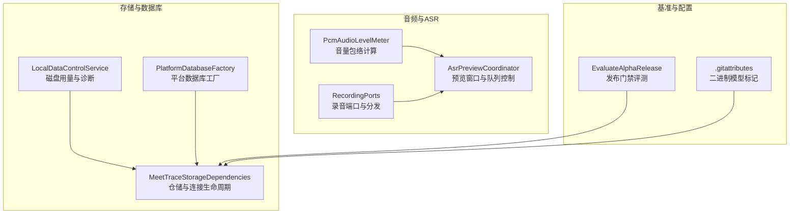
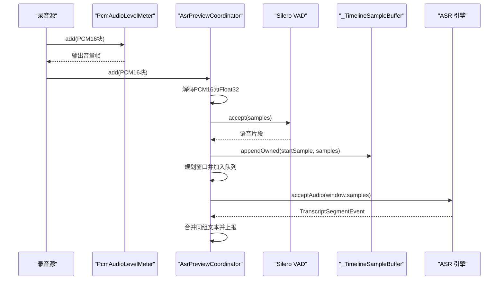
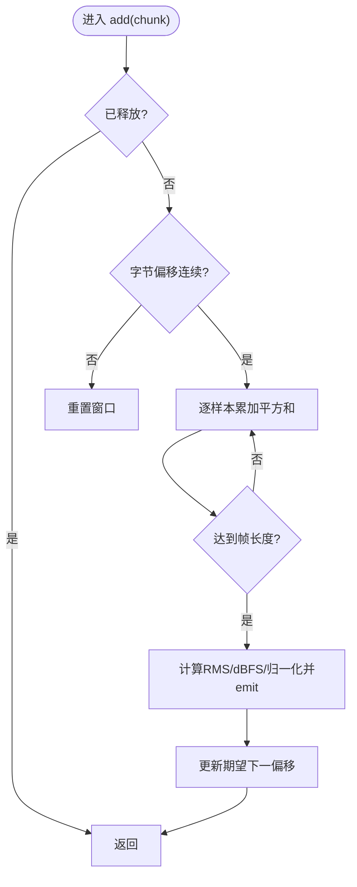
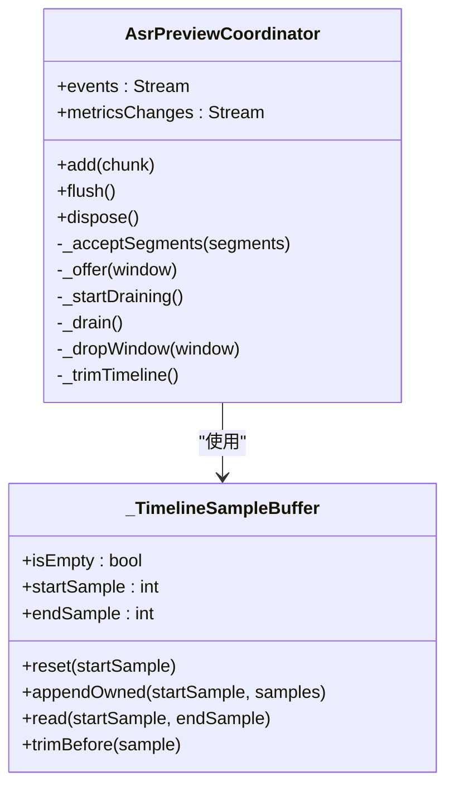
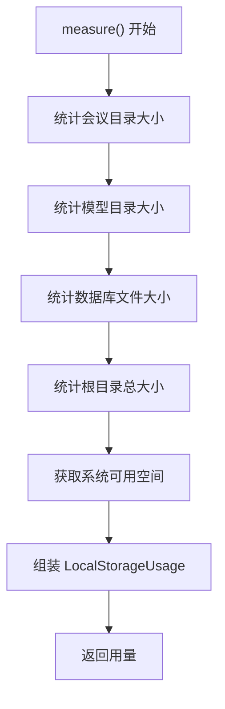
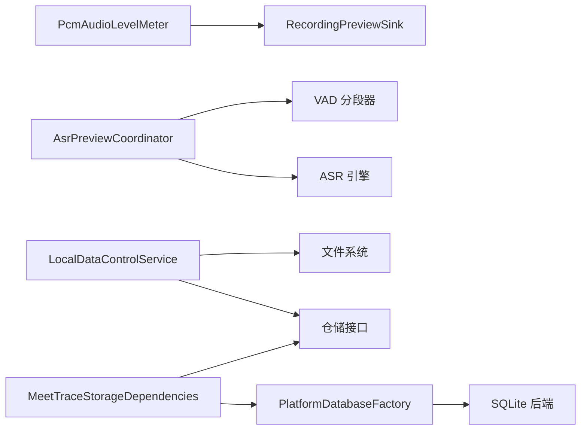

# 性能优化

<cite>
**本文引用的文件**   
- [pcm_audio_level_meter.dart](file://lib/data/services/audio/pcm_audio_level_meter.dart)
- [asr_preview_coordinator.dart](file://lib/data/services/asr/asr_preview_coordinator.dart)
- [recording_ports_test.dart](file://test/data/services/audio/recording_ports_test.dart)
- [local_data_control_service.dart](file://lib/data/services/storage/local_data_control_service.dart)
- [platform_database_factory.dart](file://lib/data/services/storage/platform_database_factory.dart)
- [meettrace_storage_dependencies.dart](file://lib/app/meettrace_storage_dependencies.dart)
- [evaluate_alpha_release.dart](file://tool/benchmarks/evaluate_alpha_release.dart)
- [.gitattributes](file://.gitattributes)
</cite>

## 目录
1. [简介](#简介)
2. [项目结构](#项目结构)
3. [核心组件](#核心组件)
4. [架构总览](#架构总览)
5. [详细组件分析](#详细组件分析)
6. [依赖关系分析](#依赖关系分析)
7. [性能考量](#性能考量)
8. [故障排查指南](#故障排查指南)
9. [结论](#结论)
10. [附录](#附录)

## 简介
本文件面向会迹项目的性能优化，聚焦以下方面：
- 内存管理策略：大对象处理、垃圾回收优化、内存泄漏检测
- 音频处理优化：PCM 数据缓冲、实时处理延迟、CPU 使用优化
- 存储优化：数据库查询优化、文件 I/O 优化、缓存策略
- 模型加载优化：ONNX 模型预加载、资源管理、内存映射
- 性能监控工具：内存分析器、CPU 分析器、网络监控
- 性能测试与基准：确保多设备稳定表现

## 项目结构
本项目为 Flutter/Dart 应用，关键性能相关代码集中在 data/services 层（音频、ASR、存储）以及 app 层的依赖注入与资源生命周期管理。

图表来源
- [pcm_audio_level_meter.dart:1-100](file://lib/data/services/audio/pcm_audio_level_meter.dart#L1-L100)
- [asr_preview_coordinator.dart:1-527](file://lib/data/services/asr/asr_preview_coordinator.dart#L1-L527)
- [local_data_control_service.dart:1-107](file://lib/data/services/storage/local_data_control_service.dart#L1-L107)
- [platform_database_factory.dart:1-17](file://lib/data/services/storage/platform_database_factory.dart#L1-L17)
- [meettrace_storage_dependencies.dart:74-115](file://lib/app/meettrace_storage_dependencies.dart#L74-L115)
- [evaluate_alpha_release.dart:1-51](file://tool/benchmarks/evaluate_alpha_release.dart#L1-L51)
- [.gitattributes:1-2](file://.gitattributes#L1-L2)

章节来源
- [pcm_audio_level_meter.dart:1-100](file://lib/data/services/audio/pcm_audio_level_meter.dart#L1-L100)
- [asr_preview_coordinator.dart:1-527](file://lib/data/services/asr/asr_preview_coordinator.dart#L1-L527)
- [local_data_control_service.dart:1-107](file://lib/data/services/storage/local_data_control_service.dart#L1-L107)
- [platform_database_factory.dart:1-17](file://lib/data/services/storage/platform_database_factory.dart#L1-L17)
- [meettrace_storage_dependencies.dart:74-115](file://lib/app/meettrace_storage_dependencies.dart#L74-L115)
- [evaluate_alpha_release.dart:1-51](file://tool/benchmarks/evaluate_alpha_release.dart#L1-L51)
- [.gitattributes:1-2](file://.gitattributes#L1-L2)

## 核心组件
- PcmAudioLevelMeter：对 PCM16 数据进行轻量级 RMS 包络计算，按固定帧长输出归一化电平，支持输入不连续时的窗口重置，避免误判。
- AsrPreviewCoordinator：实现 ASR 预览会话，维护时间线缓冲区、VAD 分段、预览窗口队列与水位控制，负责将 PCM 解码为浮点样本并送入引擎，合并分片转录结果。
- LocalDataControlService：统计会议、模型、数据库等目录大小，汇总系统可用空间，生成诊断报告。
- PlatformDatabaseFactory：在 Windows 上初始化 FFI 后端以打开 SQLite，其他平台使用默认工厂。
- MeetTraceStorageDependencies：集中创建与释放仓储与数据库连接，保证异常路径下资源正确释放。
- EvaluateAlphaRelease：读取评测输入 JSON，执行评估用例并输出报告，用于发布门禁。

章节来源
- [pcm_audio_level_meter.dart:1-100](file://lib/data/services/audio/pcm_audio_level_meter.dart#L1-L100)
- [asr_preview_coordinator.dart:1-527](file://lib/data/services/asr/asr_preview_coordinator.dart#L1-L527)
- [local_data_control_service.dart:1-107](file://lib/data/services/storage/local_data_control_service.dart#L1-L107)
- [platform_database_factory.dart:1-17](file://lib/data/services/storage/platform_database_factory.dart#L1-L17)
- [meettrace_storage_dependencies.dart:74-115](file://lib/app/meettrace_storage_dependencies.dart#L74-L115)
- [evaluate_alpha_release.dart:1-51](file://tool/benchmarks/evaluate_alpha_release.dart#L1-L51)

## 架构总览
下图展示从录音到 ASR 预览的关键调用链路与数据流，包括 PCM 缓冲、VAD 分段、窗口拆分、队列水位控制与事件聚合。

图表来源
- [pcm_audio_level_meter.dart:1-100](file://lib/data/services/audio/pcm_audio_level_meter.dart#L1-L100)
- [asr_preview_coordinator.dart:93-122](file://lib/data/services/asr/asr_preview_coordinator.dart#L93-L122)
- [asr_preview_coordinator.dart:159-194](file://lib/data/services/asr/asr_preview_coordinator.dart#L159-L194)
- [asr_preview_coordinator.dart:398-478](file://lib/data/services/asr/asr_preview_coordinator.dart#L398-L478)
- [asr_preview_coordinator.dart:513-521](file://lib/data/services/asr/asr_preview_coordinator.dart#L513-L521)

## 详细组件分析

### 音频与内存：PcmAudioLevelMeter
- 设计要点
  - 基于 ByteData 直接视图遍历 PCM16，避免额外拷贝
  - 固定帧长累计平方和，计算 RMS 并映射到 dBFS，再归一化输出
  - 输入不连续时重置窗口，防止积压或丢帧导致错误波形
- 内存与 CPU
  - 每帧仅维护少量标量，内存占用恒定
  - 循环内只做基本算术与类型转换，CPU 开销低
- 可观测性
  - 通过 StreamController.broadcast(sync:true) 同步广播，减少调度开销

图表来源
- [pcm_audio_level_meter.dart:44-67](file://lib/data/services/audio/pcm_audio_level_meter.dart#L44-L67)
- [pcm_audio_level_meter.dart:78-93](file://lib/data/services/audio/pcm_audio_level_meter.dart#L78-L93)

章节来源
- [pcm_audio_level_meter.dart:1-100](file://lib/data/services/audio/pcm_audio_level_meter.dart#L1-L100)

### 实时ASR预览：AsrPreviewCoordinator
- 设计要点
  - 统一采样率校验（16 kHz），参数合法性检查
  - 时间线缓冲 _TimelineSampleBuffer 以块为单位追加与裁剪，读区间拼接
  - 队列水位控制：maximumQueuedAudioMs、highWaterMs、lowWaterMs
  - 窗口分组与文本合并，保障最终一致性
- 内存与 CPU
  - Float32List 直接传递，避免重复分配
  - 队列丢弃策略降低峰值内存与延迟
  - 事件流采用 broadcast(sync:true)，减少异步调度成本
- 容错与降级
  - 引擎异常或 VAD 失败时切换到 recordingOnly 模式，继续录音但不进行预览

图表来源
- [asr_preview_coordinator.dart:19-157](file://lib/data/services/asr/asr_preview_coordinator.dart#L19-L157)
- [asr_preview_coordinator.dart:398-478](file://lib/data/services/asr/asr_preview_coordinator.dart#L398-L478)

章节来源
- [asr_preview_coordinator.dart:1-527](file://lib/data/services/asr/asr_preview_coordinator.dart#L1-L527)

### 录音端口与队列丢弃行为
- 零等待队列场景下，处理中若新块到达将被丢弃，测试验证 droppedChunks 计数
- 该行为用于控制预览链路背压，避免阻塞主线程

章节来源
- [recording_ports_test.dart:34-79](file://test/data/services/audio/recording_ports_test.dart#L34-L79)

### 存储与数据库：LocalDataControlService 与 PlatformDatabaseFactory
- LocalDataControlService
  - 递归统计目录与文件大小，汇总总用量、会议/模型/数据库大小与剩余空间
  - 生成诊断报告，包含会议状态分布、模型安装信息与隐私声明
- PlatformDatabaseFactory
  - Windows 平台初始化 sqflite FFI 后端，其他平台使用默认工厂
- MeetTraceStorageDependencies
  - 集中创建仓储与数据库连接，异常路径下统一释放资源，避免泄漏

图表来源
- [local_data_control_service.dart:25-37](file://lib/data/services/storage/local_data_control_service.dart#L25-L37)
- [local_data_control_service.dart:92-106](file://lib/data/services/storage/local_data_control_service.dart#L92-L106)

章节来源
- [local_data_control_service.dart:1-107](file://lib/data/services/storage/local_data_control_service.dart#L1-L107)
- [platform_database_factory.dart:1-17](file://lib/data/services/storage/platform_database_factory.dart#L1-L17)
- [meettrace_storage_dependencies.dart:74-115](file://lib/app/meettrace_storage_dependencies.dart#L74-L115)

### 模型加载与 ONNX 二进制标记
- .gitattributes 将 assets/models/**/*.onnx 标记为 binary，避免文本编码转换导致的体积膨胀与损坏
- 建议配合按需下载与本地缓存策略，减少安装包体积与首次启动耗时

章节来源
- [.gitattributes:1-2](file://.gitattributes#L1-L2)

## 依赖关系分析
- 音频链路耦合点
  - PcmAudioLevelMeter 与 RecordingPreviewSink 接口解耦，便于替换或扩展
  - AsrPreviewCoordinator 依赖 VAD 与 ASR 引擎，通过事件流解耦上游与下游
- 存储链路耦合点
  - LocalDataControlService 依赖文件系统与仓储接口，便于替换实现
  - PlatformDatabaseFactory 抽象平台差异，隔离底层库初始化
- 生命周期管理
  - MeetTraceStorageDependencies 统一管理仓储与数据库的创建与释放，异常路径也确保清理

图表来源
- [pcm_audio_level_meter.dart:1-100](file://lib/data/services/audio/pcm_audio_level_meter.dart#L1-L100)
- [asr_preview_coordinator.dart:1-527](file://lib/data/services/asr/asr_preview_coordinator.dart#L1-L527)
- [local_data_control_service.dart:1-107](file://lib/data/services/storage/local_data_control_service.dart#L1-L107)
- [platform_database_factory.dart:1-17](file://lib/data/services/storage/platform_database_factory.dart#L1-L17)
- [meettrace_storage_dependencies.dart:74-115](file://lib/app/meettrace_storage_dependencies.dart#L74-L115)

章节来源
- [pcm_audio_level_meter.dart:1-100](file://lib/data/services/audio/pcm_audio_level_meter.dart#L1-L100)
- [asr_preview_coordinator.dart:1-527](file://lib/data/services/asr/asr_preview_coordinator.dart#L1-L527)
- [local_data_control_service.dart:1-107](file://lib/data/services/storage/local_data_control_service.dart#L1-L107)
- [platform_database_factory.dart:1-17](file://lib/data/services/storage/platform_database_factory.dart#L1-L17)
- [meettrace_storage_dependencies.dart:74-115](file://lib/app/meettrace_storage_dependencies.dart#L74-L115)

## 性能考量
- 内存管理策略
  - 大对象处理：优先使用 Float32List/ByteData 视图，避免中间拷贝；时间线缓冲按块追加并在需要时裁剪
  - 垃圾回收优化：尽量复用对象（如 StreamController）、减少临时分配；及时 dispose 关闭流与订阅
  - 内存泄漏检测：确保所有 StreamSubscription、StreamController 与外部资源在 dispose 中释放；异常路径也要释放
- 音频处理优化
  - PCM 缓冲：使用 _TimelineSampleBuffer 块式存储与区间读取，避免频繁扩容与复制
  - 实时延迟：通过 maximumQueuedAudioMs 与水位控制限制队列长度，必要时丢弃旧窗口
  - CPU 优化：逐样本循环最小化函数调用，使用本地变量与简单算术；broadcast(sync:true) 避免额外调度
- 存储优化方案
  - 数据库查询：通过仓储封装批量操作与事务，减少往返；Windows 使用 FFI 后端提升兼容性
  - 文件 I/O：统计目录时使用递归 list，注意大目录的性能；必要时增量统计或缓存
  - 缓存策略：模型文件按 manifest 版本管理，避免重复下载；本地缓存命中优先
- 模型加载优化
  - ONNX 预加载：在空闲时机预加载常用模型，减少首帧延迟
  - 资源管理：按引用计数或租约管理模型实例，避免重复加载
  - 内存映射：在支持的平台使用内存映射加载大模型，降低拷贝与页错误

[本节为通用指导，不直接分析具体文件]

## 故障排查指南
- 常见问题定位
  - 预览卡顿或掉帧：检查 AsrPreviewCoordinator 的队列水位与丢弃计数，确认 maximumQueuedAudioMs 是否过小
  - 内存增长：确认 PcmAudioLevelMeter 与 AsrPreviewCoordinator 的 dispose 是否被调用，流是否关闭
  - 数据库异常：检查 PlatformDatabaseFactory 初始化与 MeetTraceStorageDependencies 的异常释放逻辑
- 诊断工具
  - 使用 LocalDataControlService.buildDiagnostics 输出存储与模型状态，辅助定位问题
  - 结合单元测试覆盖边界条件（如零等待队列、输入不连续）

章节来源
- [local_data_control_service.dart:40-89](file://lib/data/services/storage/local_data_control_service.dart#L40-L89)
- [meettrace_storage_dependencies.dart:74-115](file://lib/app/meettrace_storage_dependencies.dart#L74-L115)
- [recording_ports_test.dart:34-79](file://test/data/services/audio/recording_ports_test.dart#L34-L79)

## 结论
通过对 PCM 缓冲、时间线管理、队列水位控制与资源生命周期的精细化设计，项目在音频与 ASR 预览链路实现了低延迟与稳定的内存占用。存储层通过统一的工厂与依赖注入，确保跨平台一致性与异常安全。建议持续引入基准评测与监控指标，形成闭环优化。

[本节为总结，不直接分析具体文件]

## 附录
- 性能测试与基准
  - 使用 evaluate_alpha_release.dart 读取评测输入 JSON，执行评估用例并输出报告，作为发布门禁
  - 建议在 CI 中集成不同设备的基准任务，对比关键指标（延迟、内存、CPU）

章节来源
- [evaluate_alpha_release.dart:1-51](file://tool/benchmarks/evaluate_alpha_release.dart#L1-L51)