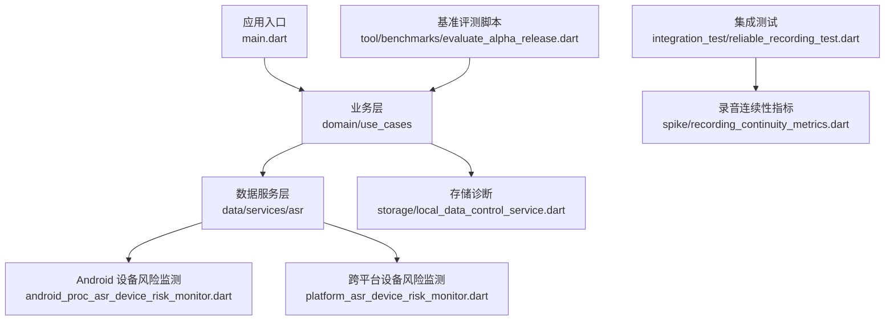
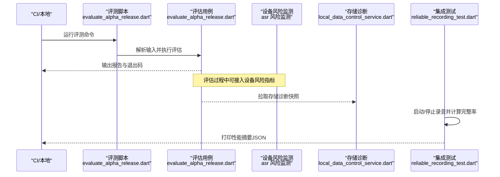
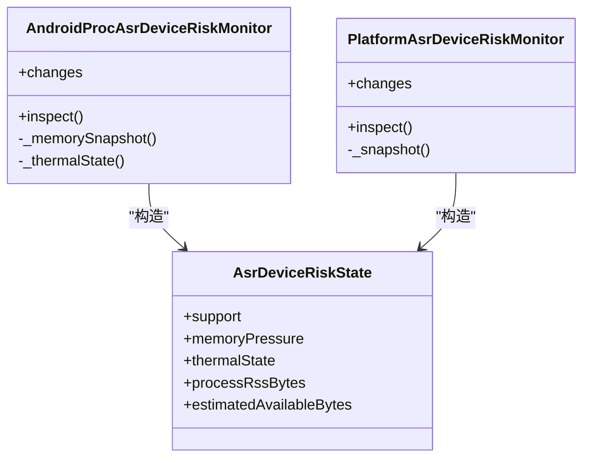
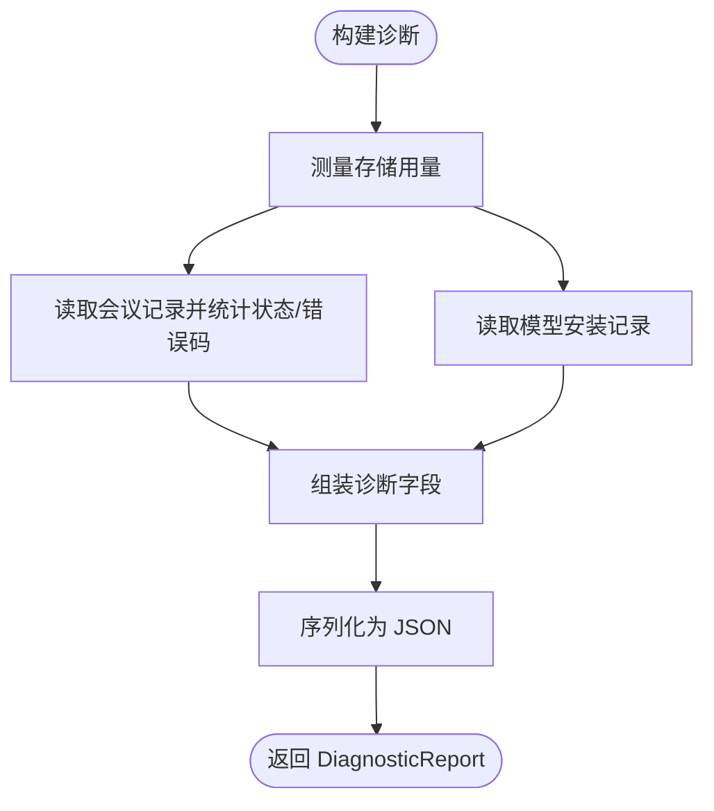
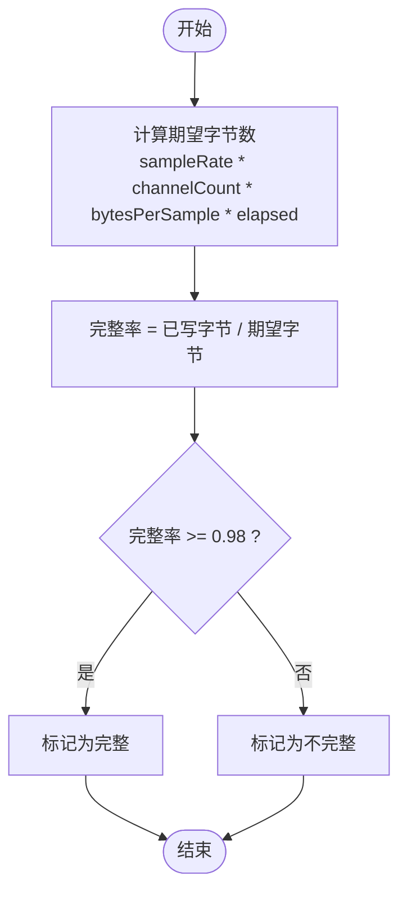
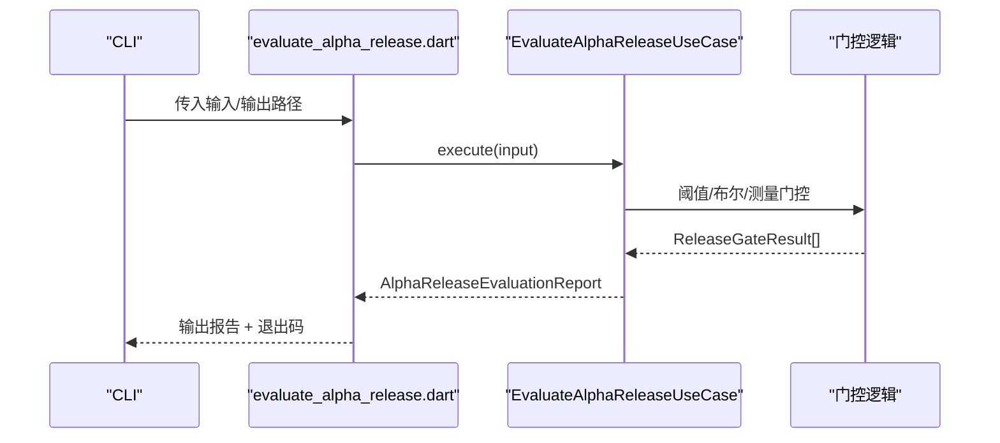
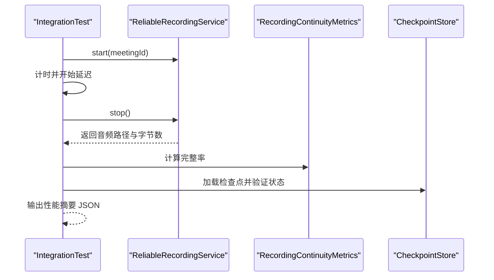
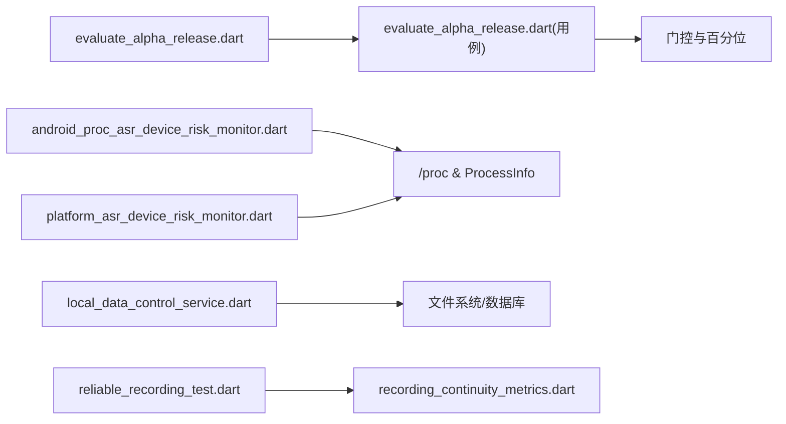

# 性能监控与分析

<cite>
**本文引用的文件**   
- [README.md](file://README.md)
- [pubspec.yaml](file://pubspec.yaml)
- [evaluate_alpha_release.dart](file://tool/benchmarks/evaluate_alpha_release.dart)
- [evaluate_alpha_release.dart](file://lib/domain/use_cases/evaluate_alpha_release.dart)
- [android_proc_asr_device_risk_monitor.dart](file://lib/data/services/asr/android_proc_asr_device_risk_monitor.dart)
- [platform_asr_device_risk_monitor.dart](file://lib/data/services/asr/platform_asr_device_risk_monitor.dart)
- [local_data_control_service.dart](file://lib/data/services/storage/local_data_control_service.dart)
- [data_control.dart](file://lib/domain/models/data_control.dart)
- [recording_continuity_metrics.dart](file://lib/data/services/audio/spike/recording_continuity_metrics.dart)
- [reliable_recording_test.dart](file://integration_test/reliable_recording_test.dart)
- [recording_continuity_metrics_test.dart](file://test/data/services/audio/spike/recording_continuity_metrics_test.dart)
- [profiler.mjs](file://.agents/skills/impeccable/scripts/detector/profile/profiler.mjs)
- [analysis_options.yaml](file://analysis_options.yaml)
</cite>

## 目录
1. [简介](#简介)
2. [项目结构](#项目结构)
3. [核心组件](#核心组件)
4. [架构总览](#架构总览)
5. [详细组件分析](#详细组件分析)
6. [依赖关系分析](#依赖关系分析)
7. [性能考量](#性能考量)
8. [故障排查指南](#故障排查指南)
9. [结论](#结论)
10. [附录](#附录)

## 简介
本文件面向会迹（MeetTrace）项目的性能监控与分析，覆盖以下方面：
- 工具使用：Flutter DevTools、Android Profiler、Xcode Instruments 的接入与关键指标采集。
- 关键指标：FPS、内存、CPU、电池消耗、录音完整性、设备风险（温度/内存压力）。
- 基准测试：单元测试中的性能断言、集成测试的性能验证、持续集成中的发布门禁与回归检测。
- 生产环境：崩溃日志、性能遥测、用户行为分析的落地建议。
- 诊断方法：火焰图、内存泄漏、网络请求分析等。
- 优化实践与常见陷阱。

本项目为本地优先的 Android + iOS 会议录音与端侧转录应用，强调在实时转录变慢或失败时仍保证录音连续性，并在首次初始化按固定清单下载并校验模型资源。

**章节来源**
- [README.md:1-11](file://README.md#L1-L11)

## 项目结构
从仓库根目录可见多平台工程与 Flutter 源码分层（app/data/domain/ui），以及 benchmark、integration_test、test 等质量保障目录。与性能相关的关键位置包括：
- tool/benchmarks：发布门禁评测脚本入口。
- lib/domain/use_cases：评估用例（含阈值/百分位计算）。
- lib/data/services/asr：ASR 设备风险监测（Android 原生节点读取与通用实现）。
- lib/data/services/storage：诊断报告构建（存储用量、模型安装状态等）。
- integration_test：录音可靠性与连续性的端到端验证。
- test：单元级性能度量断言（如录音完整率）。

**图示来源**
- [evaluate_alpha_release.dart:1-51](file://tool/benchmarks/evaluate_alpha_release.dart#L1-L51)
- [evaluate_alpha_release.dart:443-497](file://lib/domain/use_cases/evaluate_alpha_release.dart#L443-L497)
- [android_proc_asr_device_risk_monitor.dart:34-119](file://lib/data/services/asr/android_proc_asr_device_risk_monitor.dart#L34-L119)
- [platform_asr_device_risk_monitor.dart:46-64](file://lib/data/services/asr/platform_asr_device_risk_monitor.dart#L46-L64)
- [local_data_control_service.dart:39-90](file://lib/data/services/storage/local_data_control_service.dart#L39-L90)
- [recording_continuity_metrics.dart:1-41](file://lib/data/services/audio/spike/recording_continuity_metrics.dart#L1-L41)
- [reliable_recording_test.dart:1-86](file://integration_test/reliable_recording_test.dart#L1-L86)

**章节来源**
- [pubspec.yaml:1-112](file://pubspec.yaml#L1-L112)

## 核心组件
- 设备风险监测（ASR）
  - Android 实现通过 /proc/meminfo 与 thermal zone 节点获取内存与温度信息，结合进程 RSS 估算设备支持度与热状态。
  - 通用实现提供统一的 Stream 周期采样与 inspect 接口，便于上层订阅变化。
- 存储诊断报告
  - 聚合存储用量（总容量、会议/模型/数据库占用、剩余空间）、会议状态分布、错误码统计、模型安装清单，输出结构化 JSON 用于上报与回溯。
- 录音连续性指标
  - 基于 PCM16 单声道参数计算期望字节数与完整率，判定是否满足最低完整性阈值（默认 98%）。
- 发布门禁评测
  - 命令行脚本读取评测输入 JSON，调用用例执行评估，输出报告并依据决策设置退出码，便于 CI 门禁。

**章节来源**
- [android_proc_asr_device_risk_monitor.dart:34-119](file://lib/data/services/asr/android_proc_asr_device_risk_monitor.dart#L34-L119)
- [platform_asr_device_risk_monitor.dart:46-64](file://lib/data/services/asr/platform_asr_device_risk_monitor.dart#L46-L64)
- [local_data_control_service.dart:39-90](file://lib/data/services/storage/local_data_control_service.dart#L39-L90)
- [data_control.dart:1-26](file://lib/domain/models/data_control.dart#L1-L26)
- [recording_continuity_metrics.dart:1-41](file://lib/data/services/audio/spike/recording_continuity_metrics.dart#L1-L41)
- [evaluate_alpha_release.dart:1-51](file://tool/benchmarks/evaluate_alpha_release.dart#L1-L51)

## 架构总览
下图展示性能监控与评测在应用中的关键交互路径：评测脚本驱动用例，用例组合阈值/百分位门控；设备风险监测以流式方式暴露设备状态；存储诊断提供可观测性数据；集成测试验证录音连续性。

**图示来源**
- [evaluate_alpha_release.dart:1-51](file://tool/benchmarks/evaluate_alpha_release.dart#L1-L51)
- [evaluate_alpha_release.dart:443-497](file://lib/domain/use_cases/evaluate_alpha_release.dart#L443-L497)
- [android_proc_asr_device_risk_monitor.dart:34-119](file://lib/data/services/asr/android_proc_asr_device_risk_monitor.dart#L34-L119)
- [platform_asr_device_risk_monitor.dart:46-64](file://lib/data/services/asr/platform_asr_device_risk_monitor.dart#L46-L64)
- [local_data_control_service.dart:39-90](file://lib/data/services/storage/local_data_control_service.dart#L39-L90)
- [reliable_recording_test.dart:1-86](file://integration_test/reliable_recording_test.dart#L1-L86)

## 详细组件分析

### 设备风险监测（ASR）
- Android 实现
  - 周期性采样内存与温度，解析 /proc/meminfo 得到总内存与可用内存，遍历 thermal zone 节点求最高温度并映射到热状态等级。
  - 结合进程 RSS 与估计可用内存，给出设备支持度与内存压力判断。
- 通用实现
  - 提供统一 pollInterval 的 Stream 与 inspect 方法，返回包含支持度、内存压力、热状态、RSS 的结构化状态。

**图示来源**
- [android_proc_asr_device_risk_monitor.dart:34-119](file://lib/data/services/asr/android_proc_asr_device_risk_monitor.dart#L34-L119)
- [platform_asr_device_risk_monitor.dart:46-64](file://lib/data/services/asr/platform_asr_device_risk_monitor.dart#L46-L64)

**章节来源**
- [android_proc_asr_device_risk_monitor.dart:34-119](file://lib/data/services/asr/android_proc_asr_device_risk_monitor.dart#L34-L119)
- [platform_asr_device_risk_monitor.dart:46-64](file://lib/data/services/asr/platform_asr_device_risk_monitor.dart#L46-L64)

### 存储诊断报告
- 聚合存储用量（总/会议/模型/数据库/剩余）、会议状态与错误码计数、模型安装清单，生成不可变字段对象并序列化为 JSON。
- 可用于问题定位、容量规划与合规审计。

**图示来源**
- [local_data_control_service.dart:39-90](file://lib/data/services/storage/local_data_control_service.dart#L39-L90)
- [data_control.dart:1-26](file://lib/domain/models/data_control.dart#L1-L26)

**章节来源**
- [local_data_control_service.dart:39-90](file://lib/data/services/storage/local_data_control_service.dart#L39-L90)
- [data_control.dart:1-26](file://lib/domain/models/data_control.dart#L1-L26)

### 录音连续性指标
- 基于 PCM16 单声道参数（采样率、通道数、时长）计算期望字节数，实际写入字节与期望比值即为完整率。
- 当完整率低于阈值（默认 98%）视为不完整，可用于集成测试断言与线上告警。

**图示来源**
- [recording_continuity_metrics.dart:1-41](file://lib/data/services/audio/spike/recording_continuity_metrics.dart#L1-L41)

**章节来源**
- [recording_continuity_metrics.dart:1-41](file://lib/data/services/audio/spike/recording_continuity_metrics.dart#L1-L41)
- [recording_continuity_metrics_test.dart:1-32](file://test/data/services/audio/spike/recording_continuity_metrics_test.dart#L1-L32)

### 发布门禁评测（基准与回归）
- 命令行脚本接收评测输入 JSON，调用评估用例执行，输出报告并根据决策设置退出码（go/noGo/blocked），便于 CI 门禁。
- 评估用例内部包含阈值门控、布尔反相门控、测量门控与百分位计算，确保对关键指标的稳定性进行约束。

**图示来源**
- [evaluate_alpha_release.dart:1-51](file://tool/benchmarks/evaluate_alpha_release.dart#L1-L51)
- [evaluate_alpha_release.dart:443-497](file://lib/domain/use_cases/evaluate_alpha_release.dart#L443-L497)

**章节来源**
- [evaluate_alpha_release.dart:1-51](file://tool/benchmarks/evaluate_alpha_release.dart#L1-L51)
- [evaluate_alpha_release.dart:443-497](file://lib/domain/use_cases/evaluate_alpha_release.dart#L443-L497)

### 集成测试中的性能验证
- 集成测试模拟前后台切换场景，启动/停止录音，计算文件持久化比例与捕获完整率，并通过 debugPrint 输出结构化摘要，便于自动化收集。
- 测试覆盖录音连续性、检查点最终化、丢帧预览计数等关键维度。

**图示来源**
- [reliable_recording_test.dart:1-86](file://integration_test/reliable_recording_test.dart#L1-L86)
- [recording_continuity_metrics.dart:1-41](file://lib/data/services/audio/spike/recording_continuity_metrics.dart#L1-L41)

**章节来源**
- [reliable_recording_test.dart:1-86](file://integration_test/reliable_recording_test.dart#L1-L86)

## 依赖关系分析
- 评测脚本依赖评估用例，评估用例依赖门控与百分位计算。
- 设备风险监测依赖系统 API（/proc 与 ProcessInfo）。
- 存储诊断依赖数据库与文件系统访问。
- 集成测试依赖录音服务、检查点存储与度量工具。

**图示来源**
- [evaluate_alpha_release.dart:1-51](file://tool/benchmarks/evaluate_alpha_release.dart#L1-L51)
- [evaluate_alpha_release.dart:443-497](file://lib/domain/use_cases/evaluate_alpha_release.dart#L443-L497)
- [android_proc_asr_device_risk_monitor.dart:34-119](file://lib/data/services/asr/android_proc_asr_device_risk_monitor.dart#L34-L119)
- [platform_asr_device_risk_monitor.dart:46-64](file://lib/data/services/asr/platform_asr_device_risk_monitor.dart#L46-L64)
- [local_data_control_service.dart:39-90](file://lib/data/services/storage/local_data_control_service.dart#L39-L90)
- [reliable_recording_test.dart:1-86](file://integration_test/reliable_recording_test.dart#L1-L86)

**章节来源**
- [pubspec.yaml:1-112](file://pubspec.yaml#L1-L112)

## 性能考量
- FPS 与流畅度
  - 使用 Flutter DevTools 的 Performance 面板观察帧绘制耗时与掉帧，关注 UI 线程阻塞与重绘热点。
- 内存使用
  - 使用 Android Profiler 的 Memory 与 Xcode Instruments 的 Allocations/Leaks 跟踪分配峰值与泄漏点；结合 ASR 设备风险监测的 RSS 与可用内存趋势辅助定位。
- CPU 占用
  - 使用 Android Profiler 的 CPU 与 Xcode Instruments 的 Time Profiler 识别热点函数；结合评测脚本输出的耗时百分位（p50/p95）做回归对比。
- 电池消耗
  - 使用 Battery Historian 或 Xcode Energy Log 分析唤醒次数与高功耗时段；避免长时间前台任务与频繁 I/O。
- 录音连续性
  - 通过 RecordingContinuityMetrics 的完整率断言保障 PCM 写入不丢失；在集成测试中模拟前后台切换与长时录制。
- 设备风险
  - 利用 ASR 设备风险监测的内存压力与热状态，动态降级或提示用户，避免过热降频导致的卡顿。

[本节为通用指导，不直接分析具体文件]

## 故障排查指南
- 火焰图分析
  - 导出 Flutter Timeline 或平台原生堆栈，定位主线程阻塞与渲染瓶颈；结合集成测试输出的时间戳与事件，复现场景。
- 内存泄漏检测
  - 使用 Allocation Instrumentation 与 LeakCanary（Android）/Instruments Leaks（iOS）定位未释放对象；关注长生命周期服务与回调闭包。
- 网络请求分析
  - 使用 Network Monitor 查看请求耗时与重试策略；结合诊断报告中的错误码统计定位不稳定环节。
- 崩溃日志分析
  - 收集平台崩溃符号化日志，关联版本信息与构建号；结合诊断报告的 schemaVersion 与 generatedAt 字段进行回溯。
- 性能回归检测
  - 将 evaluate_alpha_release.dart 纳入 CI，设定阈值门控与 p95 上限，失败则阻断发布流程。

**章节来源**
- [evaluation script:1-51](file://tool/benchmarks/evaluate_alpha_release.dart#L1-L51)
- [analysis_options.yaml:1-35](file://analysis_options.yaml#L1-L35)

## 结论
本项目在性能监控方面已形成“设备风险监测 + 存储诊断 + 录音连续性指标 + 发布门禁”的闭环体系。通过集成测试与基准评测，可在开发阶段尽早发现性能退化；在生产环境，建议结合平台工具与遥测上报，持续追踪 FPS、内存、CPU、电池与关键业务流程耗时，形成可量化的性能基线与回归标准。

[本节为总结性内容，不直接分析具体文件]

## 附录
- 工具使用要点
  - Flutter DevTools：开启 Performance Overlay，记录 Timeline，导出 HTML 报告。
  - Android Profiler：选择 Device 与 App，采集 CPU/Memory/Network/Power 视图。
  - Xcode Instruments：选用 Time Profiler、Allocations、Leaks、Energy Log。
- 指标定义与阈值建议
  - FPS：目标 ≥ 60fps，p95 掉帧率 < 2%。
  - 内存：峰值不超过设备可用内存的 70%，无持续增长趋势。
  - CPU：热点函数耗时占比 < 10%，避免主线程阻塞 > 16ms。
  - 电池：前台任务唤醒间隔合理，避免高频轮询。
  - 录音完整率：≥ 98%。
- 持续集成建议
  - 在 PR 合并前运行集成测试与基准评测，失败即阻断；定期跑全量回归，生成趋势报告。

[本节为补充说明，不直接分析具体文件]