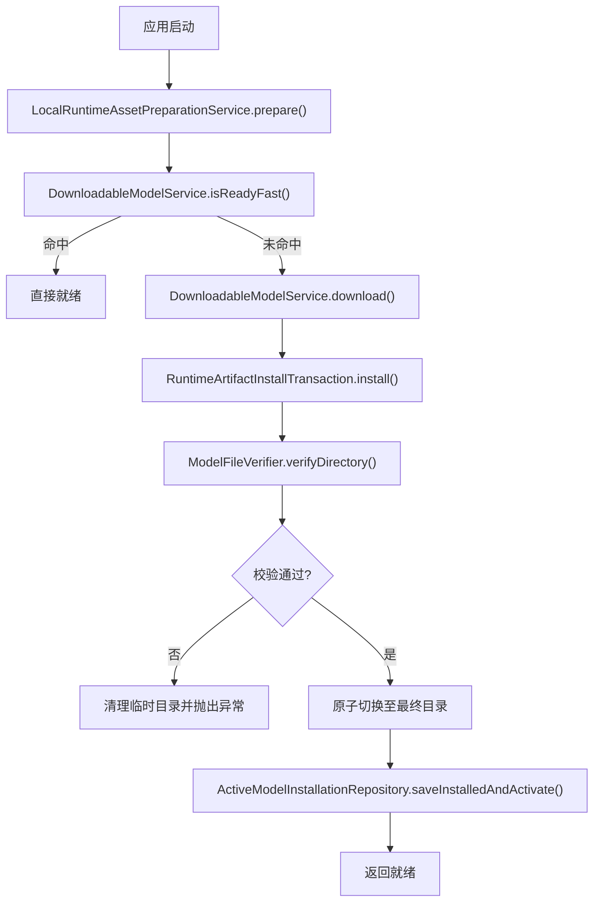
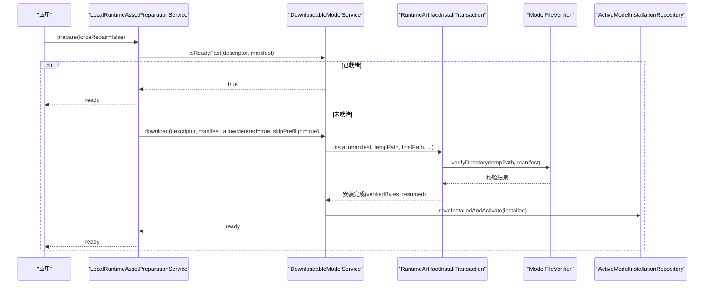
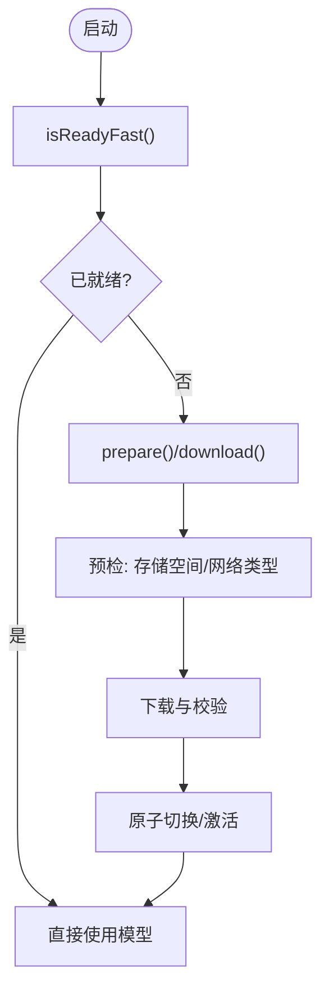
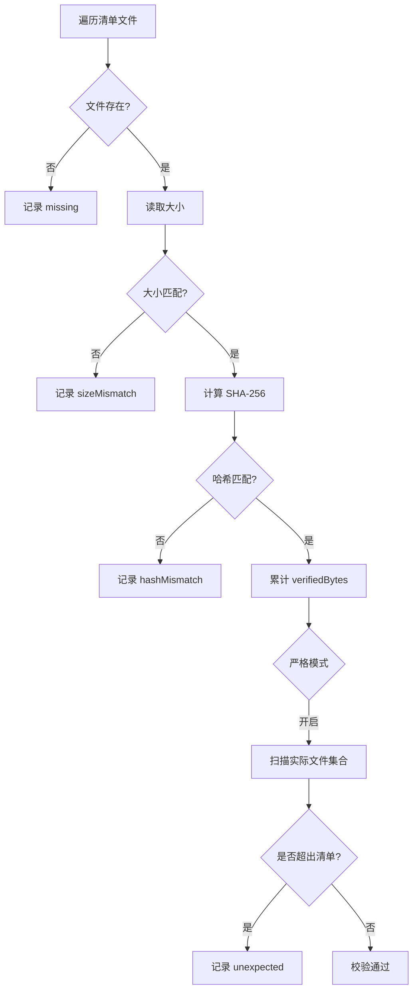
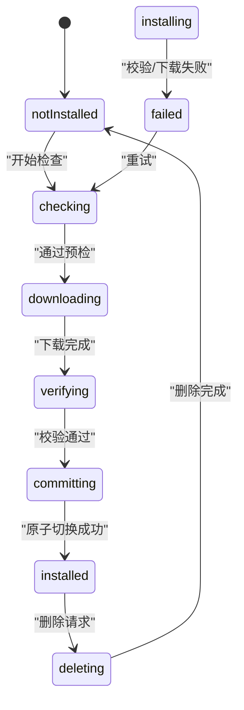
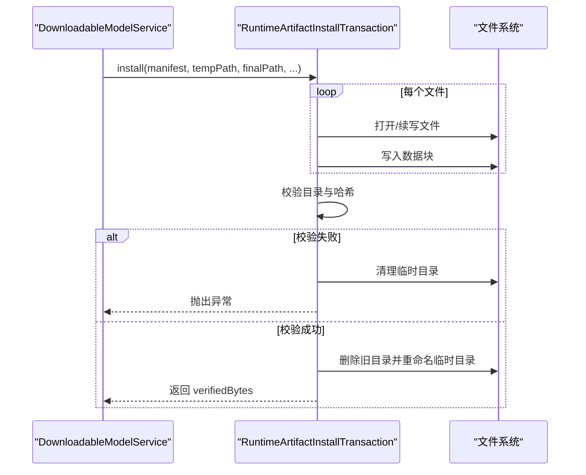
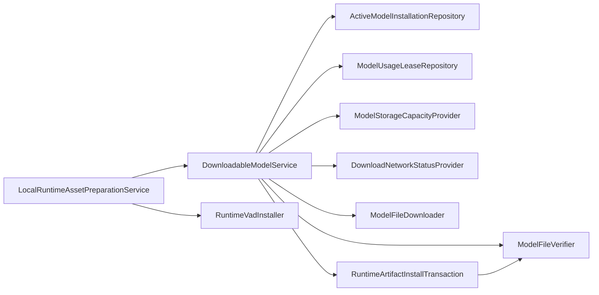

# 模型加载优化

<cite>
**本文引用的文件**   
- [manifest.json](file://assets/models/manifest.json)
- [model_manifest_parser.dart](file://lib/data/services/models/model_manifest_parser.dart)
- [model_manifest.dart](file://lib/domain/models/model_manifest.dart)
- [asr_model_registry.dart](file://lib/domain/models/asr_model_registry.dart)
- [downloadable_model_service.dart](file://lib/data/services/models/downloadable_model_service.dart)
- [local_runtime_asset_preparation_service.dart](file://lib/data/services/models/local_runtime_asset_preparation_service.dart)
- [runtime_artifact_install_transaction.dart](file://lib/data/services/models/runtime_artifact_install_transaction.dart)
- [model_file_verifier.dart](file://lib/data/services/models/model_file_verifier.dart)
- [device_free_space_service.dart](file://lib/data/services/storage/device_free_space_service.dart)
- [sqflite_model_installation_repository.dart](file://lib/data/repositories/sqflite_model_installation_repository.dart)
- [workflow_states.dart](file://lib/domain/models/workflow_states.dart)
- [data_control.dart](file://lib/domain/models/data_control.dart)
- [model_settings_view.dart](file://lib/ui/features/settings/views/model_settings_view.dart)
</cite>

## 目录
1. [简介](#简介)
2. [项目结构](#项目结构)
3. [核心组件](#核心组件)
4. [架构总览](#架构总览)
5. [详细组件分析](#详细组件分析)
6. [依赖关系分析](#依赖关系分析)
7. [性能考量](#性能考量)
8. [故障排查指南](#故障排查指南)
9. [结论](#结论)
10. [附录](#附录)

## 简介
本文件面向会迹项目的 ONNX 模型加载与运行时资源管理，围绕以下目标展开：
- 预加载策略：启动时预加载、按需加载、后台预加载
- 资源管理：内存映射、共享内存、资源池化（在 Flutter/Dart 环境下的可行路径）
- 验证与完整性检查：并行校验、增量更新、缓存校验结果
- 版本管理与兼容性：版本降级、回滚机制、热更新
- 性能监控：加载时间测量、内存峰值监控、错误恢复
- 多设备优化：Android/iOS/Web 的差异与适配

## 项目结构
与模型加载相关的代码主要分布在 data/services/models、domain/models、data/repositories、ui/features/settings 等模块。关键入口包括：
- 模型清单解析：ModelManifestParser
- 下载与安装：DownloadableModelService、RuntimeArtifactInstallTransaction
- 快速就绪检查：isReadyFast
- 本地运行资源准备：LocalRuntimeAssetPreparationService
- 磁盘空间检测：DeviceFreeSpaceService
- 安装状态持久化：SqfliteModelInstallationRepository
- 诊断与用量展示：DataControl 与 ModelSettingsView

**图表来源** 
- [local_runtime_asset_preparation_service.dart:54-182](file://lib/data/services/models/local_runtime_asset_preparation_service.dart#L54-L182)
- [downloadable_model_service.dart:168-300](file://lib/data/services/models/downloadable_model_service.dart#L168-L300)
- [runtime_artifact_install_transaction.dart:55-129](file://lib/data/services/models/runtime_artifact_install_transaction.dart#L55-L129)
- [model_file_verifier.dart:37-115](file://lib/data/services/models/model_file_verifier.dart#L37-L115)
- [sqflite_model_installation_repository.dart:73-99](file://lib/data/repositories/sqflite_model_installation_repository.dart#L73-L99)

**章节来源**
- [local_runtime_asset_preparation_service.dart:54-182](file://lib/data/services/models/local_runtime_asset_preparation_service.dart#L54-L182)
- [downloadable_model_service.dart:168-300](file://lib/data/services/models/downloadable_model_service.dart#L168-L300)

## 核心组件
- 模型清单与注册表
  - ModelManifestParser：解析 manifest.json，校验 schemaVersion、minAppVersion、模型元数据一致性、文件 URL 协议限制、路径安全等
  - AsrModelRegistry：声明默认模型、能力集、语言支持、requiredBytes 等
- 下载与安装事务
  - DownloadableModelService：下载流程编排、预检（存储空间、网络类型）、快速路径 isReadyFast、失败/暂停状态机、进度回调
  - RuntimeArtifactInstallTransaction：分片续传、逐文件校验、完整性校验、原子目录切换
- 校验器
  - ModelFileVerifier：缺失文件、大小不符、SHA-256 不匹配、严格文件集拒绝多余文件
- 资源准备与用户同意
  - LocalRuntimeAssetPreparationService：统一协调 ASR 与 VAD 的下载与就绪，移动网络需用户授权
- 存储与容量
  - DeviceFreeSpaceService：平台磁盘空间读取，转换为字节
  - SqfliteModelInstallationRepository：安装记录与活动版本持久化，事务性激活
- 诊断与用量
  - DataControl：本地存储用量统计
  - ModelSettingsView：展示模型数据占用、可用空间、导出诊断

**章节来源**
- [model_manifest_parser.dart:17-143](file://lib/data/services/models/model_manifest_parser.dart#L17-L143)
- [asr_model_registry.dart:6-51](file://lib/domain/models/asr_model_registry.dart#L6-L51)
- [downloadable_model_service.dart:147-300](file://lib/data/services/models/downloadable_model_service.dart#L147-L300)
- [runtime_artifact_install_transaction.dart:48-129](file://lib/data/services/models/runtime_artifact_install_transaction.dart#L48-L129)
- [model_file_verifier.dart:34-115](file://lib/data/services/models/model_file_verifier.dart#L34-L115)
- [local_runtime_asset_preparation_service.dart:9-189](file://lib/data/services/models/local_runtime_asset_preparation_service.dart#L9-L189)
- [device_free_space_service.dart:9-26](file://lib/data/services/storage/device_free_space_service.dart#L9-L26)
- [sqflite_model_installation_repository.dart:51-99](file://lib/data/repositories/sqflite_model_installation_repository.dart#L51-L99)
- [data_control.dart:1-26](file://lib/domain/models/data_control.dart#L1-L26)
- [model_settings_view.dart:145-181](file://lib/ui/features/settings/views/model_settings_view.dart#L145-L181)

## 架构总览
下图展示了从应用启动到模型就绪的关键调用链与状态流转。

**图表来源** 
- [local_runtime_asset_preparation_service.dart:54-182](file://lib/data/services/models/local_runtime_asset_preparation_service.dart#L54-L182)
- [downloadable_model_service.dart:168-300](file://lib/data/services/models/downloadable_model_service.dart#L168-L300)
- [runtime_artifact_install_transaction.dart:55-129](file://lib/data/services/models/runtime_artifact_install_transaction.dart#L55-L129)
- [model_file_verifier.dart:37-115](file://lib/data/services/models/model_file_verifier.dart#L37-L115)
- [sqflite_model_installation_repository.dart:73-99](file://lib/data/repositories/sqflite_model_installation_repository.dart#L73-L99)

## 详细组件分析

### 模型清单与版本管理
- Manifest 解析与约束
  - 校验 schemaVersion、minAppVersion、重复 modelId、文件路径安全、URL 协议（可下载必须 HTTPS，内置必须 asset://）
  - requiredBytes 与 files.bytes 合计一致
- 版本兼容与降级
  - minAppVersion 比较确保当前应用版本满足最低要求
  - Registry 与 Manifest 元数据不一致将抛错，避免“幽灵”模型
- 建议
  - 在发布前固化 manifest.json 与 Registry 的 requiredBytes，避免运行时差异
  - 对新增模型或文件变更，同步更新 Registry 与 Manifest

**章节来源**
- [model_manifest_parser.dart:17-143](file://lib/data/services/models/model_manifest_parser.dart#L17-L143)
- [model_manifest.dart:1-51](file://lib/domain/models/model_manifest.dart#L1-L51)
- [asr_model_registry.dart:6-51](file://lib/domain/models/asr_model_registry.dart#L6-L51)
- [manifest.json:1-31](file://assets/models/manifest.json#L1-L31)

### 预加载策略
- 启动时预加载
  - LocalRuntimeAssetPreparationService.prepare() 在启动阶段检查并下载 ASR 与 VAD 资源，强制修复模式可跳过快速路径
- 按需加载
  - 业务层可在首次使用模型时触发下载（例如进入录音页），通过 isReadyFast 快速判断
- 后台预加载
  - 建议在空闲时段（如充电+Wi-Fi）后台执行 prepare()，结合移动网络授权提示
- 快速路径
  - isReadyFast 仅检查安装记录、活动版本、固定文件集合与字节数，避免完整 SHA-256 校验

**图表来源** 
- [local_runtime_asset_preparation_service.dart:54-182](file://lib/data/services/models/local_runtime_asset_preparation_service.dart#L54-L182)
- [downloadable_model_service.dart:364-397](file://lib/data/services/models/downloadable_model_service.dart#L364-L397)

**章节来源**
- [local_runtime_asset_preparation_service.dart:54-182](file://lib/data/services/models/local_runtime_asset_preparation_service.dart#L54-L182)
- [downloadable_model_service.dart:364-397](file://lib/data/services/models/downloadable_model_service.dart#L364-L397)

### 资源管理与内存优化
- 文件布局与原子切换
  - 临时目录下载 + 校验通过后重命名为最终目录，保证一致性
- 内存映射与共享内存
  - Dart/Flutter 中可通过 dart:io 的 File.openRead 流式读取；如需零拷贝，应在原生层实现 mmap/memfd 并在 Dart 侧通过 ffi 访问
- 资源池化
  - 针对多实例并发场景，可在服务层维护模型句柄池（按 modelId@version 键），控制最大并发与生命周期
- 建议
  - 大模型优先采用流式 IO，避免一次性载入内存
  - 在 Android/iOS 原生层启用内存映射加载 ONNX Runtime 模型（若引擎支持）

**章节来源**
- [runtime_artifact_install_transaction.dart:55-129](file://lib/data/services/models/runtime_artifact_install_transaction.dart#L55-L129)

### 验证与完整性检查
- 校验维度
  - 文件存在性、文件大小、SHA-256 一致性、严格文件集（拒绝多余文件）
- 并行与增量
  - 当前为顺序校验；可扩展为并发校验（注意 I/O 竞争与线程安全）
  - 增量更新：基于上次 verifiedBytes 与文件哈希缓存，仅校验变更文件
- 缓存校验结果
  - 可将 verifiedAt、bytes、hashes 写入安装记录，减少重复校验

**图表来源** 
- [model_file_verifier.dart:37-115](file://lib/data/services/models/model_file_verifier.dart#L37-L115)

**章节来源**
- [model_file_verifier.dart:37-115](file://lib/data/services/models/model_file_verifier.dart#L37-L115)

### 版本管理与兼容性检查
- 版本降级与回滚
  - 当新模型校验失败或运行时初始化失败，保留旧版本安装记录；下次重试可回退到已知稳定版本
- 热更新
  - 原子切换目录后激活新版本；若后续发现异常，可回切至上一版本目录并重新激活
- 状态机约束
  - 安装状态转换受限于 workflow_states 定义，非法转换将抛错

**图表来源** 
- [workflow_states.dart:178-203](file://lib/domain/models/workflow_states.dart#L178-L203)

**章节来源**
- [workflow_states.dart:178-203](file://lib/domain/models/workflow_states.dart#L178-L203)
- [sqflite_model_installation_repository.dart:73-99](file://lib/data/repositories/sqflite_model_installation_repository.dart#L73-L99)

### 下载与安装事务
- 分片续传
  - 根据目标文件长度判断 resumeFrom，断点续传提升弱网体验
- 完整性保障
  - 下载完成后进行完整性校验，失败则清理临时目录并抛出异常
- 原子切换
  - 校验通过后删除旧目录并重命名临时目录为最终目录，避免中间态

**图表来源** 
- [runtime_artifact_install_transaction.dart:55-129](file://lib/data/services/models/runtime_artifact_install_transaction.dart#L55-L129)

**章节来源**
- [runtime_artifact_install_transaction.dart:55-129](file://lib/data/services/models/runtime_artifact_install_transaction.dart#L55-L129)

### 多设备优化策略
- Android
  - 使用 DiskSpace API 获取应用支持目录可用空间；考虑低内存设备限制并发下载数量
  - 利用系统下载管理器或后台任务队列进行后台预加载
- iOS
  - 注意后台下载限制与用户权限；尽量在 Wi-Fi 环境下进行大模型下载
- Web
  - 受限于浏览器沙箱，无法直接访问文件系统；应改为服务端托管与缓存策略（Cache Storage/IndexedDB）

**章节来源**
- [device_free_space_service.dart:9-26](file://lib/data/services/storage/device_free_space_service.dart#L9-L26)

## 依赖关系分析
- 组件耦合
  - LocalRuntimeAssetPreparationService 依赖 DownloadableModelService、VAD 安装器、容量提供者、网络状态提供者、用户同意仓库
  - DownloadableModelService 依赖安装仓库、租约仓库、容量提供者、网络状态、下载器、校验器
  - RuntimeArtifactInstallTransaction 依赖校验器与文件系统
- 外部依赖
  - path/path.dart：路径处理
  - crypto/crypto.dart：SHA-256 计算
  - disk_space_2/disk_space_2.dart：磁盘空间查询
  - path_provider/path_provider.dart：应用支持目录

**图表来源** 
- [local_runtime_asset_preparation_service.dart:9-30](file://lib/data/services/models/local_runtime_asset_preparation_service.dart#L9-L30)
- [downloadable_model_service.dart:147-166](file://lib/data/services/models/downloadable_model_service.dart#L147-L166)
- [runtime_artifact_install_transaction.dart:48-54](file://lib/data/services/models/runtime_artifact_install_transaction.dart#L48-L54)

**章节来源**
- [local_runtime_asset_preparation_service.dart:9-30](file://lib/data/services/models/local_runtime_asset_preparation_service.dart#L9-L30)
- [downloadable_model_service.dart:147-166](file://lib/data/services/models/downloadable_model_service.dart#L147-L166)
- [runtime_artifact_install_transaction.dart:48-54](file://lib/data/services/models/runtime_artifact_install_transaction.dart#L48-L54)

## 性能考量
- 加载时间测量
  - 在 prepare()/download() 各阶段埋点，统计 checking/downloading/verifying/committing/ready 耗时
- 内存峰值监控
  - 避免一次性加载整个模型到内存；优先流式 IO；在原生层启用内存映射
- 错误恢复机制
  - 支持暂停与续传；失败状态持久化，下次启动自动恢复
- 预取与缓存
  - 首次启动预取常用模型；后续启动走 isReadyFast 快速路径
- 并发控制
  - 限制同时下载的模型数量，避免 I/O 争用与内存抖动

[本节为通用指导，不直接分析具体文件]

## 故障排查指南
- 常见错误码与含义
  - model.storage.insufficient：可用空间不足（至少 768 MiB）
  - model.network.offline：无网络
  - model.network.confirmationRequired：移动网络需确认
  - model.integrity：完整性校验失败
  - model.path.invalid：路径越界或非法
- 定位步骤
  - 查看安装状态与错误码（ActiveModelInstallationRepository）
  - 检查磁盘空间（DeviceFreeSpaceService）
  - 导出诊断信息（ModelSettingsView）
- 恢复策略
  - 强制修复（forceRepair=true）重新下载并校验
  - 回滚到上一个稳定版本（保留历史安装记录）

**章节来源**
- [downloadable_model_service.dart:552-580](file://lib/data/services/models/downloadable_model_service.dart#L552-L580)
- [model_settings_view.dart:145-181](file://lib/ui/features/settings/views/model_settings_view.dart#L145-L181)

## 结论
本项目已具备完善的模型清单解析、下载安装事务、完整性校验与状态机管理。通过 isReadyFast 快速路径与原子切换，显著提升了启动效率与可靠性。建议在后续迭代中引入并发校验、增量更新与缓存校验结果，并在原生层探索内存映射以降低 Dart 层内存压力。同时完善多设备差异化策略与诊断指标，持续优化用户体验。

[本节为总结，不直接分析具体文件]

## 附录
- 关键常量与阈值
  - minimumRuntimeInitializationFreeBytes = 768 MiB
  - maximumRuntimeDownloadBytes = 300 MB
- 清单示例
  - assets/models/manifest.json 定义了 SenseVoice 模型的版本、文件、哈希与许可证

**章节来源**
- [downloadable_model_service.dart:16-17](file://lib/data/services/models/downloadable_model_service.dart#L16-L17)
- [manifest.json:1-31](file://assets/models/manifest.json#L1-L31)