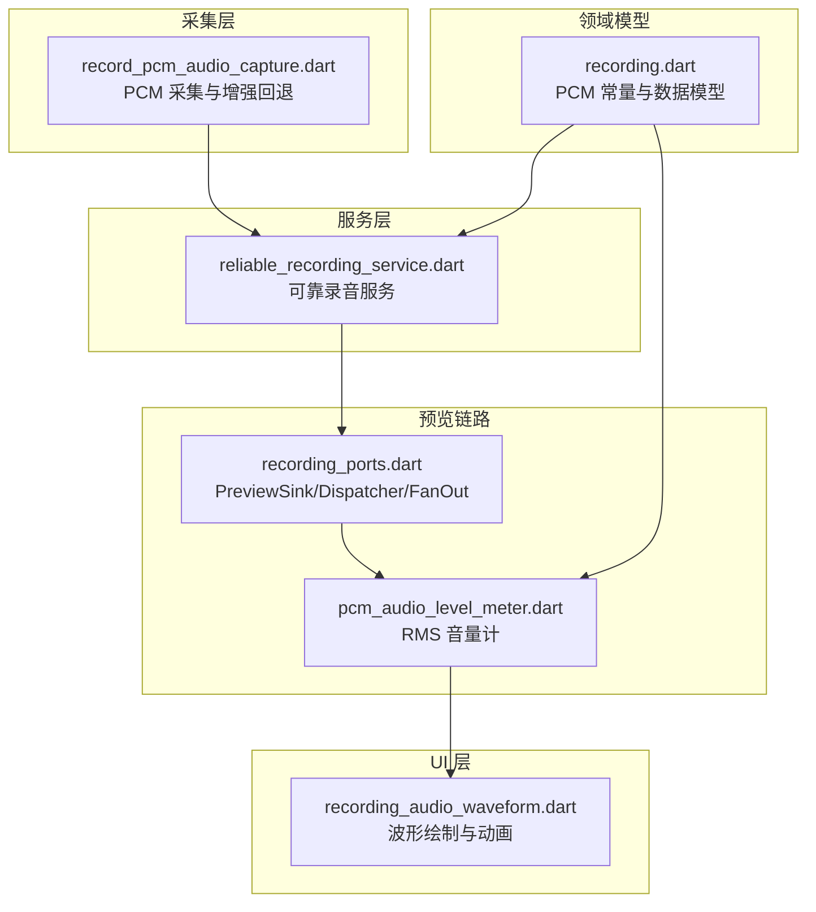
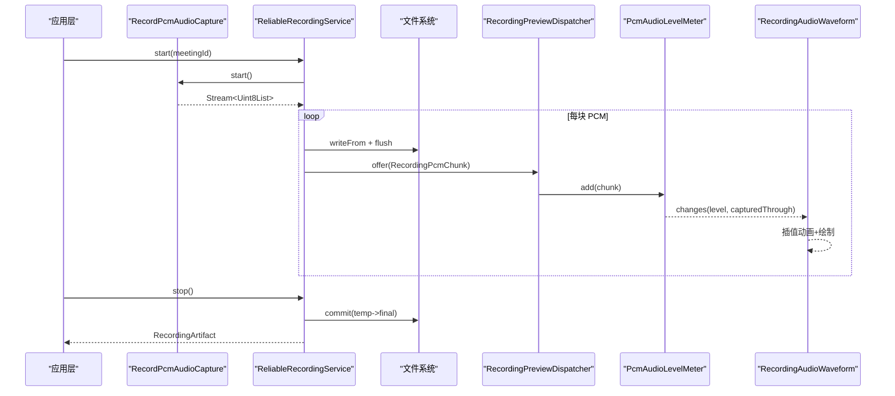
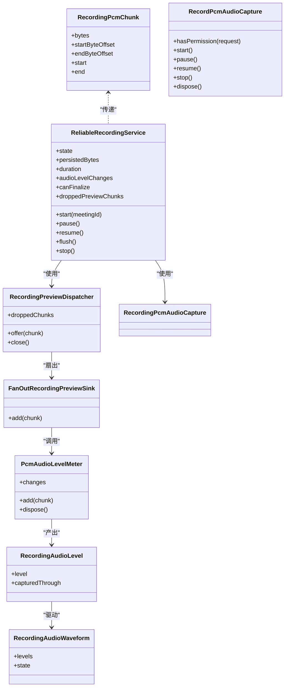
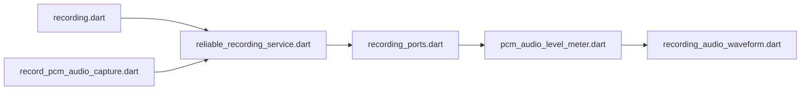

# 音频处理优化

<cite>
**本文引用的文件**   
- [reliable_recording_service.dart](file://lib/data/services/audio/reliable_recording_service.dart)
- [record_pcm_audio_capture.dart](file://lib/data/services/audio/record_pcm_audio_capture.dart)
- [recording_ports.dart](file://lib/data/services/audio/recording_ports.dart)
- [pcm_audio_level_meter.dart](file://lib/data/services/audio/pcm_audio_level_meter.dart)
- [recording.dart](file://lib/domain/models/recording.dart)
- [recording_continuity_metrics.dart](file://lib/data/services/audio/spike/recording_continuity_metrics.dart)
- [recording_audio_waveform.dart](file://lib/ui/features/meetings/views/recording/widgets/recording_audio_waveform.dart)
</cite>

## 目录
1. [简介](#简介)
2. [项目结构](#项目结构)
3. [核心组件](#核心组件)
4. [架构总览](#架构总览)
5. [详细组件分析](#详细组件分析)
6. [依赖关系分析](#依赖关系分析)
7. [性能考量](#性能考量)
8. [故障排查指南](#故障排查指南)
9. [结论](#结论)
10. [附录](#附录)

## 简介
本文件面向会迹项目的音频处理子系统，聚焦实时录音与波形反馈的性能优化。内容覆盖 PCM 数据缓冲策略、采样率与声道配置、处理管道延迟优化（异步、线程池、CPU 占用）、波形计算优化（增量、缓存、渲染）、编解码选择与硬件加速使用，以及跨设备调优与监控方法。所有分析与建议均基于仓库现有实现进行提炼与扩展说明。

## 项目结构
音频相关代码主要分布在以下模块：
- 领域模型：PCM 块、采样率、声道数、时长换算等常量与数据结构
- 采集层：平台录音封装与增强能力回退
- 服务层：可靠录音服务，负责写入、检查点、前台生命周期、预览分发
- 预览链路：音量计、分发器、丢弃/回调 sink
- UI 层：波形绘制与动画插值

**图表来源**
- [recording.dart:1-69](file://lib/domain/models/recording.dart#L1-L69)
- [record_pcm_audio_capture.dart:1-78](file://lib/data/services/audio/record_pcm_audio_capture.dart#L1-L78)
- [reliable_recording_service.dart:1-451](file://lib/data/services/audio/reliable_recording_service.dart#L1-L451)
- [recording_ports.dart:52-96](file://lib/data/services/audio/recording_ports.dart#L52-L96)
- [pcm_audio_level_meter.dart:1-76](file://lib/data/services/audio/pcm_audio_level_meter.dart#L1-L76)
- [recording_audio_waveform.dart:1-224](file://lib/ui/features/meetings/views/recording/widgets/recording_audio_waveform.dart#L1-L224)

**章节来源**
- [recording.dart:1-69](file://lib/domain/models/recording.dart#L1-L69)
- [record_pcm_audio_capture.dart:1-78](file://lib/data/services/audio/record_pcm_audio_capture.dart#L1-L78)
- [reliable_recording_service.dart:1-451](file://lib/data/services/audio/reliable_recording_service.dart#L1-L451)
- [recording_ports.dart:52-96](file://lib/data/services/audio/recording_ports.dart#L52-L96)
- [pcm_audio_level_meter.dart:1-76](file://lib/data/services/audio/pcm_audio_level_meter.dart#L1-L76)
- [recording_audio_waveform.dart:1-224](file://lib/ui/features/meetings/views/recording/widgets/recording_audio_waveform.dart#L1-L224)

## 核心组件
- 领域模型与常量
  - 固定采样率 16kHz、单声道、PCM16，提供字节到时长换算与 PCM 块校验
- 采集封装
  - 优先启用自动增益、回声消除、降噪；失败时回退到无增强模式
- 可靠录音服务
  - 顺序写盘、检查点持久化、前台生命周期管理、错误恢复、预览分发
- 预览链路
  - 音量计按帧计算 RMS；分发器限流与丢弃策略；扇出多消费者隔离
- UI 波形
  - 最近 16 个样本自适应参考、噪声门、可中断插值动画、按需重绘

**章节来源**
- [recording.dart:1-69](file://lib/domain/models/recording.dart#L1-L69)
- [record_pcm_audio_capture.dart:1-78](file://lib/data/services/audio/record_pcm_audio_capture.dart#L1-L78)
- [reliable_recording_service.dart:1-451](file://lib/data/services/audio/reliable_recording_service.dart#L1-L451)
- [recording_ports.dart:52-96](file://lib/data/services/audio/recording_ports.dart#L52-L96)
- [pcm_audio_level_meter.dart:1-76](file://lib/data/services/audio/pcm_audio_level_meter.dart#L1-L76)
- [recording_audio_waveform.dart:1-224](file://lib/ui/features/meetings/views/recording/widgets/recording_audio_waveform.dart#L1-L224)

## 架构总览
下图展示从采集到持久化与预览的端到端流程，强调关键路径与并发控制点。

**图表来源**
- [record_pcm_audio_capture.dart:1-78](file://lib/data/services/audio/record_pcm_audio_capture.dart#L1-L78)
- [reliable_recording_service.dart:1-451](file://lib/data/services/audio/reliable_recording_service.dart#L1-L451)
- [recording_ports.dart:52-96](file://lib/data/services/audio/recording_ports.dart#L52-L96)
- [pcm_audio_level_meter.dart:1-76](file://lib/data/services/audio/pcm_audio_level_meter.dart#L1-L76)
- [recording_audio_waveform.dart:1-224](file://lib/ui/features/meetings/views/recording/widgets/recording_audio_waveform.dart#L1-L224)

## 详细组件分析

### 采集与编解码优化
- 编码格式与参数
  - 统一 PCM16、16kHz、单声道，保证事实音频与 ASR 输入一致，避免双链路不一致
  - 优先开启 AGC/AEC/ANS 增强；若平台不支持或启动异常，自动回退到无增强配置
- 中断与稳定性
  - 设置中断模式为暂停/恢复，提升系统级事件下的鲁棒性
- 硬件加速
  - 通过平台 recorder 插件请求增强能力，充分利用设备 DSP/硬件特性

优化要点
- 保持编码器与采样率稳定，减少重采样与格式转换开销
- 增强功能失败即回退，确保可用性优先
- 利用平台中断策略降低后台切换导致的丢帧风险

**章节来源**
- [record_pcm_audio_capture.dart:1-78](file://lib/data/services/audio/record_pcm_audio_capture.dart#L1-L78)

### 可靠录音服务与缓冲策略
- 写入路径
  - 顺序写临时文件，逐块 flush，保证幂等与可恢复
  - 每次写入后更新检查点，支持崩溃恢复与会话重建
- 预览队列
  - 使用有界队列限制待处理块数量，超限时丢弃新块，保护主链不阻塞
  - 单个消费者失败不影响其他消费者与事实录音
- 状态机与超时
  - 启动/停止/暂停/恢复均有明确状态流转
  - 停止捕获与资源释放设置超时，避免卡死

优化要点
- 将 I/O 与预览解耦，I/O 走顺序写，预览走异步队列
- 通过最大挂起块数控制内存峰值与背压
- 检查点粒度与频率平衡可靠性与开销

**章节来源**
- [reliable_recording_service.dart:1-451](file://lib/data/services/audio/reliable_recording_service.dart#L1-L451)
- [recording_ports.dart:52-96](file://lib/data/services/audio/recording_ports.dart#L52-L96)

### 音量计量与波形计算
- 增量 RMS 计算
  - 以固定帧长累积平方和，达到样本数阈值输出一次电平，避免频繁分配与计算
  - 输入不连续时重置窗口，防止积压或丢帧造成误判
- 可视化优化
  - 最近 16 个样本自适应参考峰值，配合噪声门抑制底噪
  - 140ms 可中断 ease-out 插值，从当前呈现值重新定向，提升流畅度
  - 动态线宽与颜色渐变突出近期样本对比

优化要点
- 帧长与采样率决定输出频率，兼顾响应性与 CPU 占用
- 自适应参考与噪声门提升视觉辨识度而不引入额外复杂计算
- 动画插值在 UI 线程轻量执行，避免阻塞

**章节来源**
- [pcm_audio_level_meter.dart:1-76](file://lib/data/services/audio/pcm_audio_level_meter.dart#L1-L76)
- [recording_audio_waveform.dart:1-224](file://lib/ui/features/meetings/views/recording/widgets/recording_audio_waveform.dart#L1-L224)

### 连续性指标与监控
- 完整性比率
  - 基于已写字节与期望字节比值判断录音是否完整
  - 低于阈值判定不完整，便于上层告警或降级
- 序列化输出
  - 提供 JSON 字段便于日志与遥测上报

优化要点
- 周期性统计 bytesWritten 与 elapsed，结合采样率与声道数估算期望字节
- 将指标接入监控面板，辅助定位卡顿与丢帧问题

**章节来源**
- [recording_continuity_metrics.dart:1-41](file://lib/data/services/audio/spike/recording_continuity_metrics.dart#L1-L41)

### 类关系图

**图表来源**
- [recording.dart:1-69](file://lib/domain/models/recording.dart#L1-L69)
- [record_pcm_audio_capture.dart:1-78](file://lib/data/services/audio/record_pcm_audio_capture.dart#L1-L78)
- [reliable_recording_service.dart:1-451](file://lib/data/services/audio/reliable_recording_service.dart#L1-L451)
- [recording_ports.dart:52-96](file://lib/data/services/audio/recording_ports.dart#L52-L96)
- [pcm_audio_level_meter.dart:1-76](file://lib/data/services/audio/pcm_audio_level_meter.dart#L1-L76)
- [recording_audio_waveform.dart:1-224](file://lib/ui/features/meetings/views/recording/widgets/recording_audio_waveform.dart#L1-L224)

## 依赖关系分析
- 低耦合接口
  - 采集抽象与预览 sink 接口使替换实现更灵活
- 直接依赖
  - 服务依赖模型常量、文件布局、检查点存储、容量提供者、前台生命周期
  - 预览链路依赖分发器与多个 sink
- 潜在循环
  - 当前未发现循环依赖；服务与预览单向消费

**图表来源**
- [recording.dart:1-69](file://lib/domain/models/recording.dart#L1-L69)
- [record_pcm_audio_capture.dart:1-78](file://lib/data/services/audio/record_pcm_audio_capture.dart#L1-L78)
- [reliable_recording_service.dart:1-451](file://lib/data/services/audio/reliable_recording_service.dart#L1-L451)
- [recording_ports.dart:52-96](file://lib/data/services/audio/recording_ports.dart#L52-L96)
- [pcm_audio_level_meter.dart:1-76](file://lib/data/services/audio/pcm_audio_level_meter.dart#L1-L76)
- [recording_audio_waveform.dart:1-224](file://lib/ui/features/meetings/views/recording/widgets/recording_audio_waveform.dart#L1-L224)

**章节来源**
- [reliable_recording_service.dart:1-451](file://lib/data/services/audio/reliable_recording_service.dart#L1-L451)
- [recording_ports.dart:52-96](file://lib/data/services/audio/recording_ports.dart#L52-L96)

## 性能考量

### 实时录音性能优化
- PCM 缓冲策略
  - 顺序写临时文件并逐块 flush，避免随机 IO 与合并开销
  - 使用有界队列限制待处理块，超限丢弃，保障主链不阻塞
- 采样率与声道
  - 固定 16kHz 单声道 PCM16，降低带宽与计算量，满足语音场景
- 通道配置
  - 优先启用 AGC/AEC/ANS，失败回退，确保兼容性与稳定性

### 处理管道延迟优化
- 异步处理
  - 写入与预览解耦，预览通过分发器异步派发
- 线程池管理
  - 使用 Dart 事件循环与 Future 链式调度，避免手动线程创建
  - 通过 maxPendingChunks 控制并发与内存峰值
- CPU 使用优化
  - 音量计按帧聚合，减少频繁计算与分配
  - 波形动画使用轻量插值与按需重绘

### 波形计算优化
- 增量计算
  - 滑动窗口累计平方和，达到阈值输出一次电平
- 缓存策略
  - 最近 16 个样本作为参考峰值，避免全局扫描
- 渲染优化
  - 140ms 可中断动画，ease-out 曲线，减少抖动
  - 噪声门与自适应归一化提升感知质量

### 编解码优化
- 格式选择
  - PCM16 直出，避免转码开销
- 压缩算法
  - 事实音频保留无损 PCM；如需传输可在后端压缩
- 硬件加速
  - 借助平台 recorder 增强能力，充分利用 DSP

### 性能监控方法
- 延迟测量
  - 记录 chunk 起始偏移与时间戳，估算端到端延迟
- CPU 占用分析
  - 观察帧处理耗时与队列堆积情况
- 内存使用监控
  - 监控 pending chunks 数量与字节总量
- 连续性指标
  - 使用完整性比率检测丢帧与不完整录音

[本节为通用指导，不直接分析具体文件]

## 故障排查指南
- 常见问题
  - 权限不足：启动前检查麦克风权限
  - 存储空间不足：启动前校验可用空间
  - 目标文件冲突：拒绝覆盖已有事实音频
  - PCM 对齐错误：非偶数字节长度抛出异常
  - 空音频：结束前检查持久化字节数
- 恢复机制
  - 检查点保存与恢复，崩溃后可重建会话
  - 前台生命周期清理失败不影响事实音频封存
- 诊断手段
  - 使用连续性指标与 droppedPreviewChunks 定位瓶颈
  - 查看异常码与消息快速定位原因

**章节来源**
- [reliable_recording_service.dart:1-451](file://lib/data/services/audio/reliable_recording_service.dart#L1-L451)
- [recording_continuity_metrics.dart:1-41](file://lib/data/services/audio/spike/recording_continuity_metrics.dart#L1-L41)

## 结论
本项目音频子系统以 PCM16/16kHz/单声道为核心，采用顺序写与检查点保障可靠性，通过有界队列与异步分发降低延迟与 CPU 占用，音量计与波形渲染在保证精度的同时兼顾流畅度。建议在保持现有架构基础上，持续监控连续性指标与队列深度，结合设备能力动态调整增强开关与帧长，以获得最佳体验。

[本节为总结，不直接分析具体文件]

## 附录

### 不同设备上的音频处理调优指南
- Android
  - 确认 record 插件版本与权限声明
  - 根据机型测试 AGC/AEC/ANS 支持情况，必要时禁用以提升稳定性
  - 关注前台服务与中断策略，避免被系统回收
- iOS
  - 检查 Info.plist 中麦克风权限描述
  - 注意后台任务与音频会话类别配置
  - 对低端机型适当增大帧长以降低 CPU 压力
- Flutter 层
  - 合理设置 maxPendingPreviewChunks，避免内存尖峰
  - 在弱设备上关闭不必要的动画或降低刷新频率

[本节为通用指导，不直接分析具体文件]