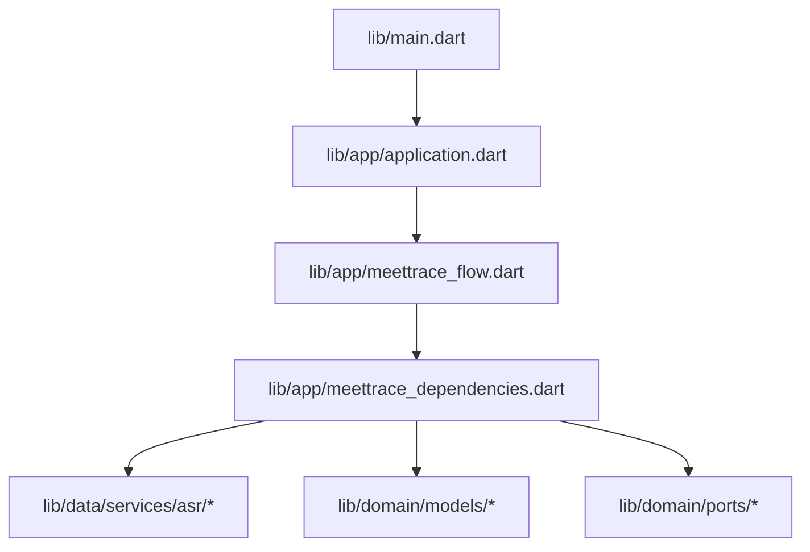
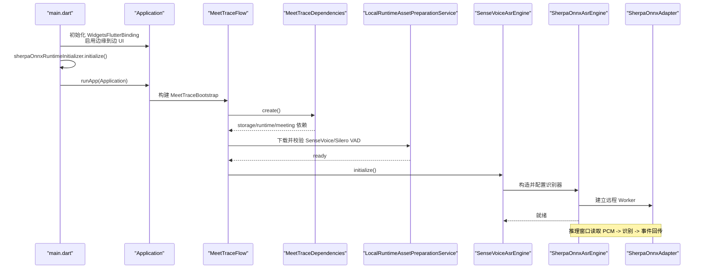
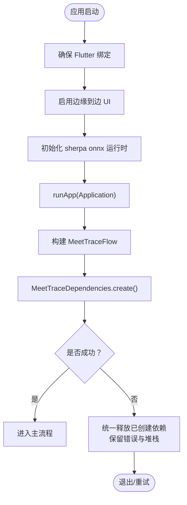
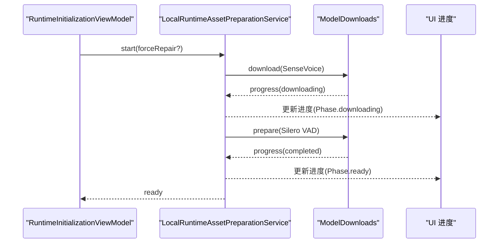
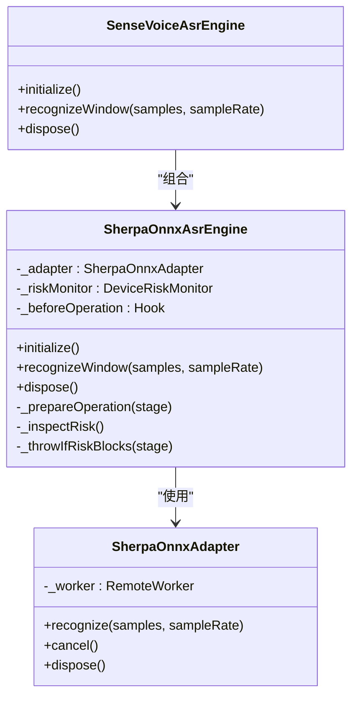
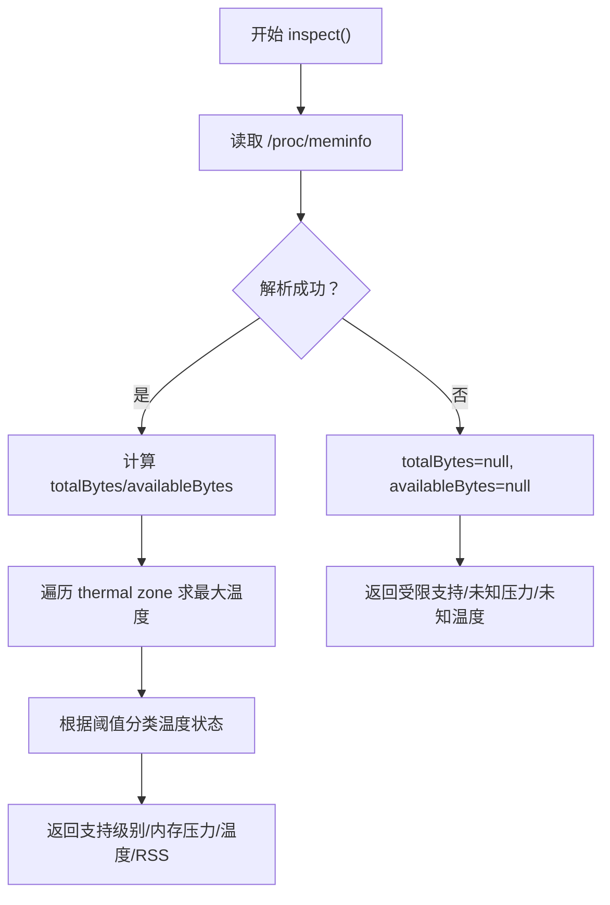
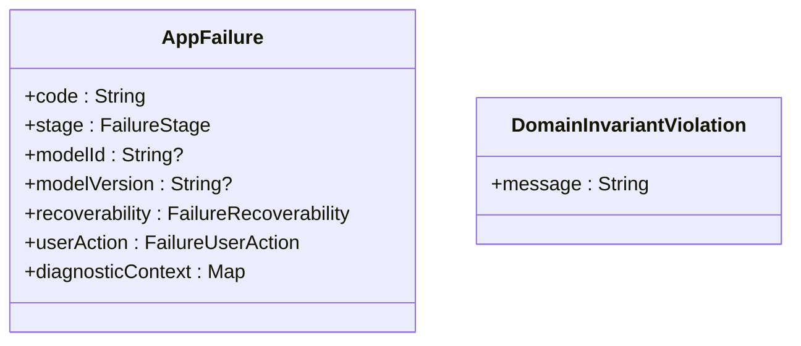
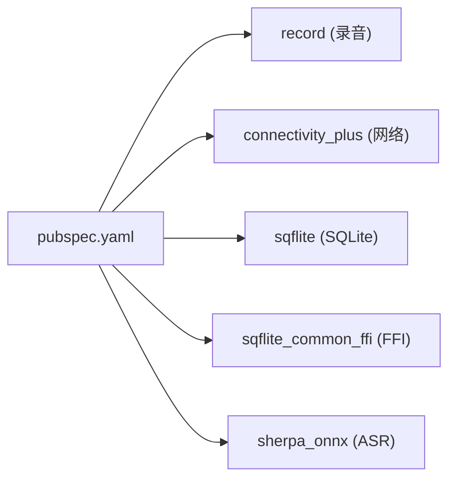
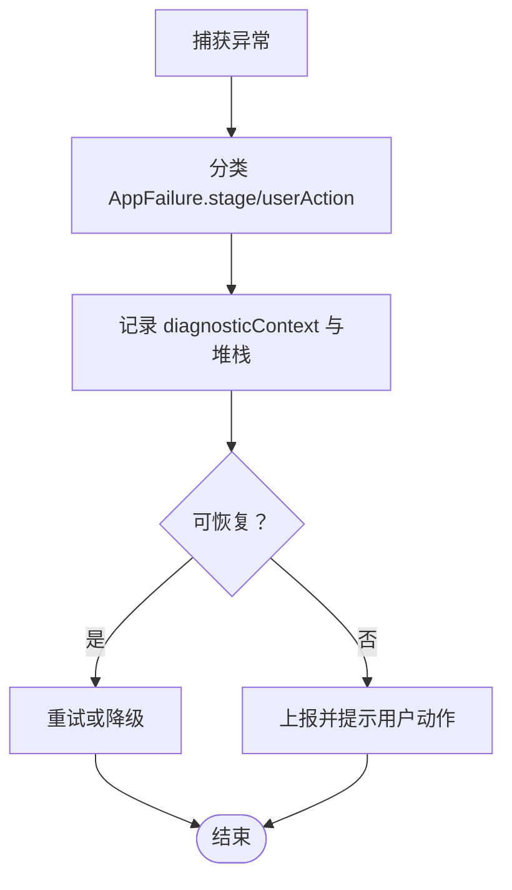

# 故障排除

<cite>
**本文引用的文件**   
- [README.md](file://README.md)
- [pubspec.yaml](file://pubspec.yaml)
- [main.dart](file://lib/main.dart)
- [application.dart](file://lib/app/application.dart)
- [meettrace_dependencies.dart](file://lib/app/meettrace_dependencies.dart)
- [meettrace_flow.dart](file://lib/app/meettrace_flow.dart)
- [app_failure.dart](file://lib/domain/models/app_failure.dart)
- [domain_exception.dart](file://lib/domain/models/domain_exception.dart)
- [data_control.dart](file://lib/domain/models/data_control.dart)
- [local_data_control.dart](file://lib/domain/ports/local_data_control.dart)
- [sense_voice_asr_engine.dart](file://lib/data/services/asr/sense_voice_asr_engine.dart)
- [sherpa_onnx_asr_engine.dart](file://lib/data/services/asr/sherpa_onnx/sherpa_onnx_asr_engine.dart)
- [sherpa_onnx_adapter.dart](file://lib/data/services/asr/sherpa_onnx/sherpa_onnx_adapter.dart)
- [sherpa_onnx_asr_engine_factory.dart](file://lib/data/services/asr/sherpa_onnx_asr_engine_factory.dart)
- [asr_model_registry.dart](file://lib/domain/models/asr_model_registry.dart)
- [asr_model.dart](file://lib/domain/models/asr_model.dart)
- [android_proc_asr_device_risk_monitor.dart](file://lib/data/services/asr/android_proc_asr_device_risk_monitor.dart)
- [platform_asr_device_risk_monitor.dart](file://lib/data/services/asr/platform_asr_device_risk_monitor.dart)
- [local_runtime_asset_preparation_service.dart](file://lib/data/services/models/local_runtime_asset_preparation_service.dart)
- [live_preview_replay_test.dart](file://integration_test/live_preview_replay_test.dart)
- [reliable_recording_test.dart](file://integration_test/reliable_recording_test.dart)
- [flutter_lldb_helper.py](file://ios/Flutter/ephemeral/flutter_lldb_helper.py)
- [查询当前启动异常.md](file://graphify-out/memory/query_20260727_120541_查询当前启动异常.md)
</cite>

## 目录
1. [简介](#简介)
2. [项目结构](#项目结构)
3. [核心组件](#核心组件)
4. [架构总览](#架构总览)
5. [详细组件分析](#详细组件分析)
6. [依赖关系分析](#依赖关系分析)
7. [性能考量](#性能考量)
8. [故障排除指南](#故障排除指南)
9. [结论](#结论)
10. [附录](#附录)

## 简介
本故障排除文档面向会迹（MeetTrace）项目的开发与运维人员，聚焦以下问题域：
- 音频录制问题、语音识别失败、模型加载错误、平台特定问题
- 日志分析方法与关键日志位置、错误信息解读
- 性能诊断工具使用（内存泄漏检测、CPU 使用分析、I/O 性能监控）
- 崩溃分析与堆栈跟踪（崩溃报告收集、异常处理策略、恢复机制）
- 已知问题与临时解决方案、社区反馈和问题报告渠道
- 逐步排查指南与调试技巧

项目定位与目标可参考 README。

**章节来源**
- [README.md:1-11](file://README.md#L1-L11)

## 项目结构
会迹为 Flutter 跨端应用，核心入口在 lib/main.dart，应用外壳在 lib/app/application.dart，依赖装配在 lib/app/meettrace_dependencies.dart，运行时初始化门控在 lib/app/meettrace_flow.dart。ASR 引擎与适配器位于 data/services/asr 下，领域模型与端口定义在 domain 层。

**图示来源**
- [main.dart:7-12](file://lib/main.dart#L7-L12)
- [application.dart:1-37](file://lib/app/application.dart#L1-L37)
- [meettrace_flow.dart:70-126](file://lib/app/meettrace_flow.dart#L70-L126)
- [meettrace_dependencies.dart:1-67](file://lib/app/meettrace_dependencies.dart#L1-L67)

**章节来源**
- [main.dart:7-12](file://lib/main.dart#L7-L12)
- [application.dart:1-37](file://lib/app/application.dart#L1-L37)
- [meettrace_flow.dart:70-126](file://lib/app/meettrace_flow.dart#L70-L126)
- [meettrace_dependencies.dart:1-67](file://lib/app/meettrace_dependencies.dart#L1-L67)

## 核心组件
- 应用外壳与主题：Application 负责主题、本地化与根页面组装。
- 依赖装配：MeetTraceDependencies.create 按顺序创建 Storage、RuntimeAsset、Meeting 依赖，并在异常时统一释放并保留堆栈。
- 运行时初始化门控：MeetTraceFlow 通过 ViewModel 驱动资源下载与校验，支持强制修复重启。
- ASR 引擎：SenseVoiceAsrEngine 封装 SherpaOnnxAsrEngine，提供统一的 AsrEngine 接口；SherpaOnnxAsrEngine 负责窗口推理、风险检查、错误映射与生命周期管理。
- 设备风险监测：Android 通过 /proc/meminfo 与 thermal zone 评估内存压力与温度；非 Android 平台返回未知状态。
- 模型与资产准备：LocalRuntimeAssetPreparationService 负责 SenseVoice 与 Silero VAD 的下载与就绪推进。
- 结构化错误：AppFailure 统一描述阶段、可恢复性、用户动作与诊断上下文。

**章节来源**
- [application.dart:1-37](file://lib/app/application.dart#L1-L37)
- [meettrace_dependencies.dart:1-67](file://lib/app/meettrace_dependencies.dart#L1-L67)
- [meettrace_flow.dart:70-126](file://lib/app/meettrace_flow.dart#L70-L126)
- [sense_voice_asr_engine.dart:1-46](file://lib/data/services/asr/sense_voice_asr_engine.dart#L1-L46)
- [sherpa_onnx_asr_engine.dart:1-256](file://lib/data/services/asr/sherpa_onnx/sherpa_onnx_asr_engine.dart#L1-L256)
- [sherpa_onnx_asr_engine.dart:421-473](file://lib/data/services/asr/sherpa_onnx/sherpa_onnx_asr_engine.dart#L421-L473)
- [android_proc_asr_device_risk_monitor.dart:34-119](file://lib/data/services/asr/android_proc_asr_device_risk_monitor.dart#L34-L119)
- [platform_asr_device_risk_monitor.dart:46-64](file://lib/data/services/asr/platform_asr_device_risk_monitor.dart#L46-L64)
- [local_runtime_asset_preparation_service.dart:119-161](file://lib/data/services/models/local_runtime_asset_preparation_service.dart#L119-L161)
- [app_failure.dart:1-49](file://lib/domain/models/app_failure.dart#L1-L49)

## 架构总览
下图展示从应用启动到 ASR 推理的关键调用链与数据流，包括依赖装配、运行时初始化、模型准备与推理过程。

**图示来源**
- [main.dart:7-12](file://lib/main.dart#L7-L12)
- [application.dart:1-37](file://lib/app/application.dart#L1-L37)
- [meettrace_flow.dart:70-126](file://lib/app/meettrace_flow.dart#L70-L126)
- [meettrace_dependencies.dart:1-67](file://lib/app/meettrace_dependencies.dart#L1-L67)
- [local_runtime_asset_preparation_service.dart:119-161](file://lib/data/services/models/local_runtime_asset_preparation_service.dart#L119-L161)
- [sense_voice_asr_engine.dart:1-46](file://lib/data/services/asr/sense_voice_asr_engine.dart#L1-L46)
- [sherpa_onnx_asr_engine.dart:1-256](file://lib/data/services/asr/sherpa_onnx/sherpa_onnx_asr_engine.dart#L1-L256)
- [sherpa_onnx_adapter.dart:172-220](file://lib/data/services/asr/sherpa_onnx/sherpa_onnx_adapter.dart#L172-L220)

## 详细组件分析

### 应用启动与依赖装配
- main.dart 中确保 Flutter 绑定、启用边缘到边 UI、初始化 sherpa onnx 运行时，然后启动 Application。
- Application 仅负责主题与本地化，不承载业务逻辑。
- MeetTraceDependencies.create 按顺序创建存储、运行时资源与会话依赖，捕获异常后统一释放并保留堆栈。

**图示来源**
- [main.dart:7-12](file://lib/main.dart#L7-L12)
- [application.dart:1-37](file://lib/app/application.dart#L1-L37)
- [meettrace_dependencies.dart:1-67](file://lib/app/meettrace_dependencies.dart#L1-L67)

**章节来源**
- [main.dart:7-12](file://lib/main.dart#L7-L12)
- [application.dart:1-37](file://lib/app/application.dart#L1-L37)
- [meettrace_dependencies.dart:1-67](file://lib/app/meettrace_dependencies.dart#L1-L67)

### 运行时初始化与模型准备
- MeetTraceFlow 通过 ViewModel 驱动资源下载与校验，支持强制修复重启。
- LocalRuntimeAssetPreparationService 负责 SenseVoice 与 Silero VAD 的下载与就绪推进，进度回调用于 UI 展示。

**图示来源**
- [meettrace_flow.dart:70-126](file://lib/app/meettrace_flow.dart#L70-L126)
- [local_runtime_asset_preparation_service.dart:119-161](file://lib/data/services/models/local_runtime_asset_preparation_service.dart#L119-L161)

**章节来源**
- [meettrace_flow.dart:70-126](file://lib/app/meettrace_flow.dart#L70-L126)
- [local_runtime_asset_preparation_service.dart:119-161](file://lib/data/services/models/local_runtime_asset_preparation_service.dart#L119-L161)

### ASR 引擎与推理流程
- SenseVoiceAsrEngine 基于 SherpaOnnxAsrEngine 实现，传入模型路径、tokens 与语言等配置。
- SherpaOnnxAsrEngine 负责窗口推理、风险检查、错误映射、生命周期管理与指标记录。
- SherpaOnnxAdapter 通过远程 Worker 执行识别，处理取消、不可用与 dispose 错误。

**图示来源**
- [sense_voice_asr_engine.dart:1-46](file://lib/data/services/asr/sense_voice_asr_engine.dart#L1-L46)
- [sherpa_onnx_asr_engine.dart:1-256](file://lib/data/services/asr/sherpa_onnx/sherpa_onnx_asr_engine.dart#L1-L256)
- [sherpa_onnx_asr_engine.dart:421-473](file://lib/data/services/asr/sherpa_onnx/sherpa_onnx_asr_engine.dart#L421-L473)
- [sherpa_onnx_adapter.dart:172-220](file://lib/data/services/asr/sherpa_onnx/sherpa_onnx_adapter.dart#L172-L220)

**章节来源**
- [sense_voice_asr_engine.dart:1-46](file://lib/data/services/asr/sense_voice_asr_engine.dart#L1-L46)
- [sherpa_onnx_asr_engine.dart:1-256](file://lib/data/services/asr/sherpa_onnx/sherpa_onnx_asr_engine.dart#L1-L256)
- [sherpa_onnx_asr_engine.dart:421-473](file://lib/data/services/asr/sherpa_onnx/sherpa_onnx_asr_engine.dart#L421-L473)
- [sherpa_onnx_adapter.dart:172-220](file://lib/data/services/asr/sherpa_onnx/sherpa_onnx_adapter.dart#L172-L220)

### 设备风险监测（Android 与非 Android）
- Android 通过 /proc/meminfo 解析内存总量与可用内存，遍历 thermal zone 计算最高温度，结合 RSS 估算进程占用。
- 非 Android 平台返回受限支持与未知压力/温度，便于上层降级或提示。

**图示来源**
- [android_proc_asr_device_risk_monitor.dart:34-119](file://lib/data/services/asr/android_proc_asr_device_risk_monitor.dart#L34-L119)
- [platform_asr_device_risk_monitor.dart:46-64](file://lib/data/services/asr/platform_asr_device_risk_monitor.dart#L46-L64)

**章节来源**
- [android_proc_asr_device_risk_monitor.dart:34-119](file://lib/data/services/asr/android_proc_asr_device_risk_monitor.dart#L34-L119)
- [platform_asr_device_risk_monitor.dart:46-64](file://lib/data/services/asr/platform_asr_device_risk_monitor.dart#L46-L64)

### 结构化错误与异常
- AppFailure 统一描述错误阶段、可恢复性、用户动作与诊断上下文，避免吞掉异常。
- DomainInvariantViolation 用于领域不变量违反。
- 测试验证了 AppFailure 的诊断上下文只读性与阶段/动作语义。

**图示来源**
- [app_failure.dart:1-49](file://lib/domain/models/app_failure.dart#L1-L49)
- [domain_exception.dart:1-8](file://lib/domain/models/domain_exception.dart#L1-L8)

**章节来源**
- [app_failure.dart:1-49](file://lib/domain/models/app_failure.dart#L1-L49)
- [domain_exception.dart:1-8](file://lib/domain/models/domain_exception.dart#L1-L8)

## 依赖关系分析
- pubspec.yaml 声明了录音、网络、数据库、FFI 等关键依赖，如 record、connectivity_plus、sqflite、sqflite_common_ffi、sherpa_onnx 等。
- 依赖版本与 SDK 约束影响稳定性与兼容性，升级前需关注变更。

**图示来源**
- [pubspec.yaml:30-46](file://pubspec.yaml#L30-L46)

**章节来源**
- [pubspec.yaml:1-112](file://pubspec.yaml#L1-L112)

## 性能考量
- 推理窗口大小与采样率：固定窗口秒数与样本上限影响吞吐与延迟。
- 线程数与 Provider：模型配置中的 numThreads 与 provider 影响 CPU/GPU 使用。
- 设备风险：内存压力临界与高温会导致阻塞或降级。
- I/O 与磁盘空间：模型下载与持久化需要足够空间，失败时需提示清理。
- 队列积压与预览滞后：集成测试中记录 maximumQueuedAudioMs 与 maximumPreviewLagMs，用于定位瓶颈。

[本节为通用指导，无需具体文件引用]

## 故障排除指南

### 常见问题与解决方案
- 音频录制问题
  - 现象：无法开始录制、中断、无声。
  - 排查要点：权限、后台限制、设备风险（内存/温度）、I/O 错误。
  - 建议操作：检查系统权限与后台运行策略；查看设备风险监测结果；确认磁盘空间充足；降低采样率或窗口大小。
- 语音识别失败
  - 现象：推理报错、无输出、卡顿。
  - 排查要点：模型路径与 tokens 正确性、线程数配置、Worker 可用性、取消与不可用状态。
  - 建议操作：校验模型文件完整性；减少并发线程；检查 Worker 生命周期；避免频繁取消。
- 模型加载错误
  - 现象：模型未安装或未校验、下载失败。
  - 排查要点：Manifest 校验、SHA256、网络条件、存储空间。
  - 建议操作：重新触发下载；检查网络与代理；清理无效缓存；确认 Manifest 与资源一致。
- 平台特定问题
  - Windows：databaseFactory 未初始化导致启动异常。
  - iOS：LLDB 辅助脚本用于调试 RX 页访问。
  - 建议操作：Windows 上确保 sqflite_common_ffi 初始化；iOS 使用 LLDB 脚本辅助定位内存页问题。

**章节来源**
- [sherpa_onnx_asr_engine.dart:421-473](file://lib/data/services/asr/sherpa_onnx/sherpa_onnx_asr_engine.dart#L421-L473)
- [sherpa_onnx_adapter.dart:172-220](file://lib/data/services/asr/sherpa_onnx/sherpa_onnx_adapter.dart#L172-L220)
- [local_runtime_asset_preparation_service.dart:119-161](file://lib/data/services/models/local_runtime_asset_preparation_service.dart#L119-L161)
- [查询当前启动异常.md:1-25](file://graphify-out/memory/query_20260727_120541_查询当前启动异常.md#L1-L25)
- [flutter_lldb_helper.py:1-32](file://ios/Flutter/ephemeral/flutter_lldb_helper.py#L1-L32)

### 日志分析方法
- 日志级别与位置
  - 应用外壳与依赖装配：Application、MeetTraceDependencies.create 的错误与释放路径。
  - ASR 引擎：SherpaOnnxAsrEngine 的风险检查、窗口失败记录、错误映射。
  - 设备风险：Android 内存与温度解析、非 Android 平台的未知状态。
  - 模型准备：下载进度与就绪阶段。
- 错误信息解读
  - AppFailure.code 包含阶段与模块前缀（如 asr.senseVoice），结合 stage 与 userAction 判断是否需要用户干预。
  - diagnosticContext 提供量化指标（如 queuedAudioMs、elapsedMicroseconds）。
- 关键日志位置
  - 启动与依赖：main.dart、application.dart、meettrace_dependencies.dart。
  - 运行时初始化：meettrace_flow.dart、local_runtime_asset_preparation_service.dart。
  - 推理与适配：sherpa_onnx_asr_engine.dart、sherpa_onnx_adapter.dart。
  - 设备风险：android_proc_asr_device_risk_monitor.dart、platform_asr_device_risk_monitor.dart。

**章节来源**
- [application.dart:1-37](file://lib/app/application.dart#L1-L37)
- [meettrace_dependencies.dart:1-67](file://lib/app/meettrace_dependencies.dart#L1-L67)
- [meettrace_flow.dart:70-126](file://lib/app/meettrace_flow.dart#L70-L126)
- [sherpa_onnx_asr_engine.dart:421-473](file://lib/data/services/asr/sherpa_onnx/sherpa_onnx_asr_engine.dart#L421-L473)
- [sherpa_onnx_adapter.dart:172-220](file://lib/data/services/asr/sherpa_onnx/sherpa_onnx_adapter.dart#L172-L220)
- [android_proc_asr_device_risk_monitor.dart:34-119](file://lib/data/services/asr/android_proc_asr_device_risk_monitor.dart#L34-L119)
- [platform_asr_device_risk_monitor.dart:46-64](file://lib/data/services/asr/platform_asr_device_risk_monitor.dart#L46-L64)
- [local_runtime_asset_preparation_service.dart:119-161](file://lib/data/services/models/local_runtime_asset_preparation_service.dart#L119-L161)
- [app_failure.dart:1-49](file://lib/domain/models/app_failure.dart#L1-L49)

### 性能诊断工具使用
- 内存泄漏检测
  - Flutter DevTools Memory 面板观察对象增长与 GC 行为；结合 ASR 窗口与队列指标定位积压。
  - iOS LLDB 辅助脚本用于拦截 RX 页访问，辅助定位内存页问题。
- CPU 使用分析
  - Flutter DevTools CPU Profiler 与 Timeline 分析推理与 I/O 热点；关注 numThreads 与 provider 设置。
- I/O 性能监控
  - 使用 Disk Space 与文件系统 API 监控模型下载与持久化；记录 maximumQueuedAudioMs 与 maximumPreviewLagMs。
- 集成测试参考
  - live_preview_replay_test.dart 与 reliable_recording_test.dart 提供了回放与可靠性指标的采集方式。

**章节来源**
- [flutter_lldb_helper.py:1-32](file://ios/Flutter/ephemeral/flutter_lldb_helper.py#L1-L32)
- [live_preview_replay_test.dart:49-114](file://integration_test/live_preview_replay_test.dart#L49-L114)
- [reliable_recording_test.dart:1-200](file://integration_test/reliable_recording_test.dart#L1-L200)

### 崩溃分析与堆栈跟踪
- 崩溃报告收集
  - 捕获顶层异常并记录 AppFailure 与 diagnosticContext；保留原始堆栈以便复现。
- 异常处理策略
  - 不吞异常，必要时重抛并标注 recoverability 与 userAction；在依赖释放时 preserveError 保留首个错误。
- 恢复机制
  - 运行时初始化门控支持 forceRepair 重启；ASR 引擎在风险阻塞时抛出明确错误，上层可降级或提示。

**图示来源**
- [meettrace_dependencies.dart:1-67](file://lib/app/meettrace_dependencies.dart#L1-L67)
- [app_failure.dart:1-49](file://lib/domain/models/app_failure.dart#L1-L49)
- [meettrace_flow.dart:70-126](file://lib/app/meettrace_flow.dart#L70-L126)

**章节来源**
- [meettrace_dependencies.dart:1-67](file://lib/app/meettrace_dependencies.dart#L1-L67)
- [app_failure.dart:1-49](file://lib/domain/models/app_failure.dart#L1-L49)
- [meettrace_flow.dart:70-126](file://lib/app/meettrace_flow.dart#L70-L126)

### 已知问题与临时解决方案
- Windows 启动异常：databaseFactory 未初始化导致 StateError。
  - 临时方案：确保 sqflite_common_ffi 初始化；在 Windows 调试环境中注册 databaseFactory 实现。
- iOS 调试：LLDB 辅助脚本用于处理 RX 页访问，避免断点误报。
  - 临时方案：启用 flutter_lldb_helper.py 以自动处理通知。

**章节来源**
- [查询当前启动异常.md:1-25](file://graphify-out/memory/query_20260727_120541_查询当前启动异常.md#L1-L25)
- [flutter_lldb_helper.py:1-32](file://ios/Flutter/ephemeral/flutter_lldb_helper.py#L1-L32)

### 社区反馈与问题报告渠道
- 项目资料入口与产品/设计文档参见 README 与 docs 索引。
- 建议在提交问题时附带：
  - 设备与系统版本、Flutter SDK 版本、依赖版本（pubspec.yaml）
  - 完整堆栈与 AppFailure 的 diagnosticContext
  - 相关日志片段（启动、依赖装配、运行时初始化、ASR 推理）

**章节来源**
- [README.md:1-11](file://README.md#L1-L11)

## 结论
本故障排除文档围绕会迹项目的音频录制、语音识别、模型加载与平台兼容性问题，提供了系统的日志分析方法、性能诊断手段与崩溃恢复策略。通过结构化错误与设备风险监测，开发者可以快速定位问题并采取相应措施。建议在发布前完善 Windows 启动兼容性与 iOS 调试环境，确保用户体验稳定可靠。

[本节为总结，无需具体文件引用]

## 附录
- 关键数据模型与端口
  - LocalStorageUsage、DiagnosticReport 用于本地存储用量与诊断报告。
  - LocalDataControlPort 提供测量与诊断能力。
- 模型注册与描述
  - AsrModelRegistry 与 AsrModelDescriptor 定义默认模型与能力集。

**章节来源**
- [data_control.dart:1-26](file://lib/domain/models/data_control.dart#L1-L26)
- [local_data_control.dart:1-7](file://lib/domain/ports/local_data_control.dart#L1-L7)
- [asr_model_registry.dart:41-68](file://lib/domain/models/asr_model_registry.dart#L41-L68)
- [asr_model.dart:44-53](file://lib/domain/models/asr_model.dart#L44-L53)