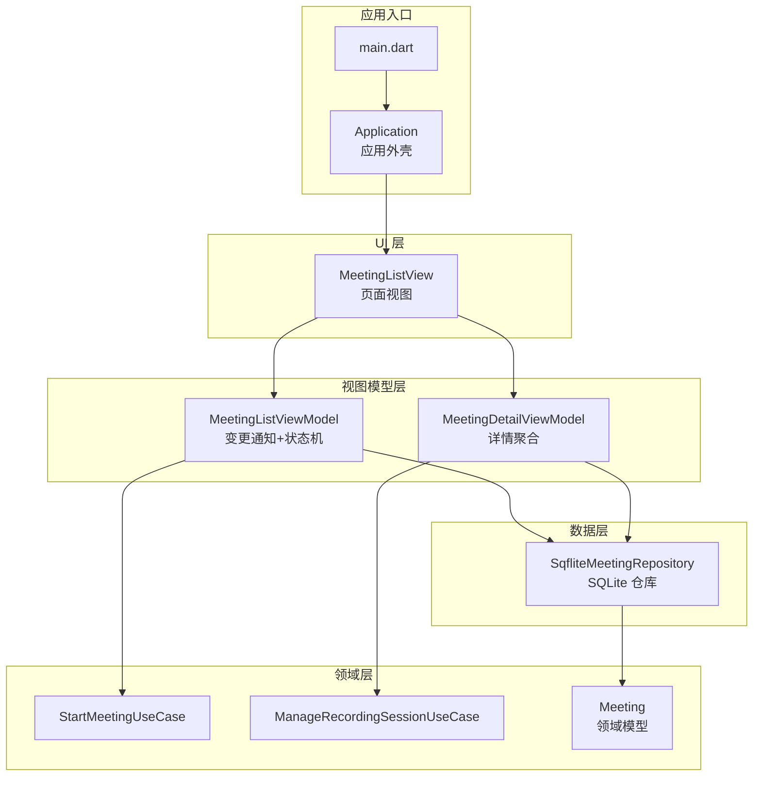
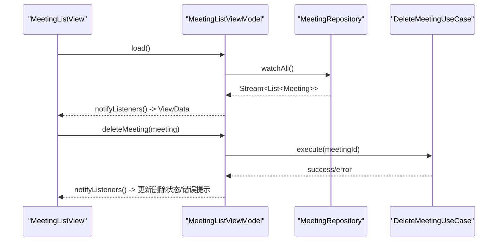
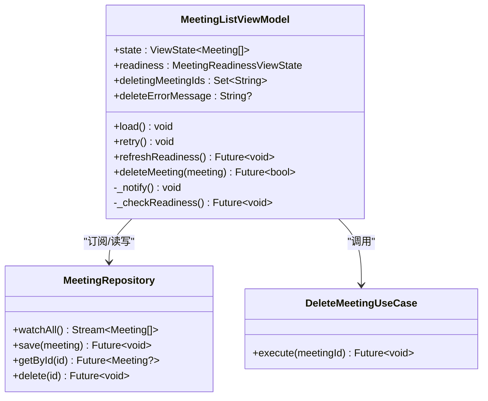
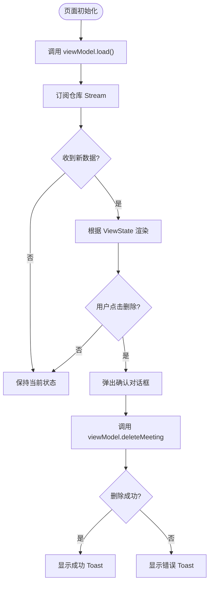
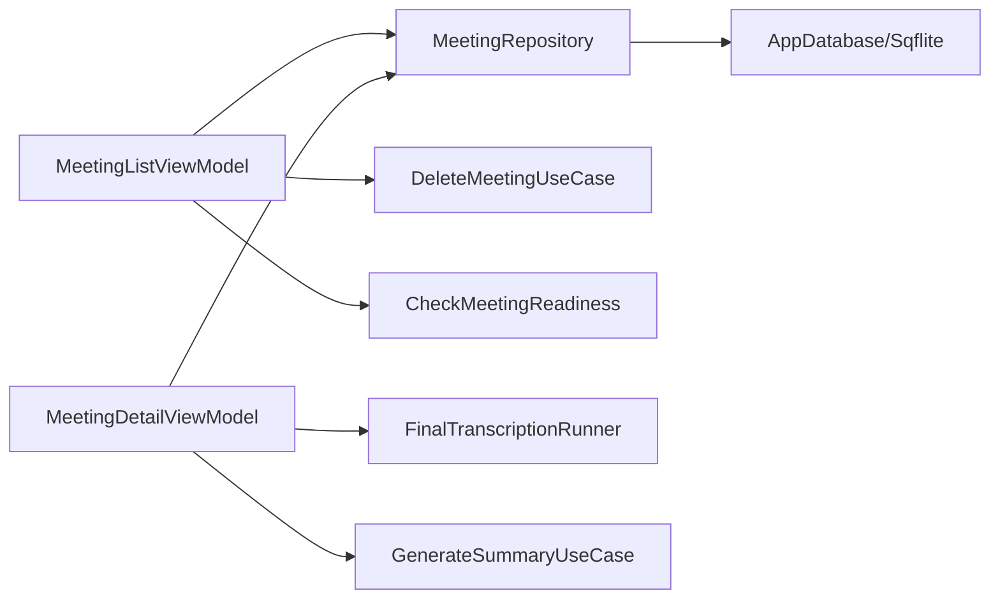

# MVVM 模式

<cite>
**本文引用的文件**   
- [main.dart](file://lib/main.dart)
- [application.dart](file://lib/app/application.dart)
- [meeting_list_view_model.dart](file://lib/ui/features/meetings/view_models/list/meeting_list_view_model.dart)
- [meeting_list_view.dart](file://lib/ui/features/meetings/views/list/meeting_list_view.dart)
- [view_state.dart](file://lib/ui/core/view_state.dart)
- [meeting_detail_view_model.dart](file://lib/ui/features/meetings/view_models/detail/meeting_detail_view_model.dart)
- [manage_recording_session.dart](file://lib/domain/use_cases/manage_recording_session.dart)
- [start_meeting.dart](file://lib/domain/use_cases/start_meeting.dart)
- [meeting.dart](file://lib/domain/models/meeting.dart)
- [sqflite_meeting_repository.dart](file://lib/data/repositories/sqflite_meeting_repository.dart)
</cite>

## 目录
1. [简介](#简介)
2. [项目结构](#项目结构)
3. [核心组件](#核心组件)
4. [架构总览](#架构总览)
5. [详细组件分析](#详细组件分析)
6. [依赖分析](#依赖分析)
7. [性能考虑](#性能考虑)
8. [故障排查指南](#故障排查指南)
9. [结论](#结论)
10. [附录](#附录)

## 简介
本文件面向会迹（MeetTrace）项目的 MVVM 模式，系统阐述 View、ViewModel、Use Case 三层的设计理念与实现方式。重点包括：
- 单向数据流与响应式更新机制
- ViewModel 如何封装业务逻辑与状态
- Use Case 如何抽象业务流程
- 错误处理、加载状态管理与用户交互处理
- 以 MeetingListViewModel 为例的完整实践

## 项目结构
项目采用 Flutter 工程组织，MVVM 相关代码主要分布在以下目录：
- UI 层（View）：lib/ui/features/.../views
- 视图模型（ViewModel）：lib/ui/features/.../view_models
- 领域层（Domain）：lib/domain/models, lib/domain/use_cases, lib/domain/ports
- 数据层（Data）：lib/data/repositories, lib/data/services

图表来源
- [main.dart:1-13](file://lib/main.dart#L1-L13)
- [application.dart:1-37](file://lib/app/application.dart#L1-L37)
- [meeting_list_view.dart:1-150](file://lib/ui/features/meetings/views/list/meeting_list_view.dart#L1-L150)
- [meeting_list_view_model.dart:1-188](file://lib/ui/features/meetings/view_models/list/meeting_list_view_model.dart#L1-L188)
- [meeting_detail_view_model.dart:1-273](file://lib/ui/features/meetings/view_models/detail/meeting_detail_view_model.dart#L1-L273)
- [start_meeting.dart:1-92](file://lib/domain/use_cases/start_meeting.dart#L1-L92)
- [manage_recording_session.dart:1-83](file://lib/domain/use_cases/manage_recording_session.dart#L1-L83)
- [meeting.dart:1-233](file://lib/domain/models/meeting.dart#L1-L233)
- [sqflite_meeting_repository.dart:1-47](file://lib/data/repositories/sqflite_meeting_repository.dart#L1-L47)

章节来源
- [main.dart:1-13](file://lib/main.dart#L1-L13)
- [application.dart:1-37](file://lib/app/application.dart#L1-L37)

## 核心组件
- ViewState：统一的状态表达（加载中、数据、错误），支持重试回调，便于 View 层渲染不同阶段。
- MeetingListViewModel：基于 ChangeNotifier 的响应式状态管理，订阅仓库 Stream，维护列表、就绪检查、删除操作等。
- MeetingDetailViewModel：聚合转录、说话人分离、摘要生成、播放等子模块，暴露统一 state 给详情页。
- Use Cases：StartMeetingUseCase、ManageRecordingSessionUseCase 等，将复杂流程收敛为单一入口，保证一致性。
- Repository：SqfliteMeetingRepository 提供本地持久化与变化流，驱动 UI 自动刷新。

章节来源
- [view_state.dart:1-24](file://lib/ui/core/view_state.dart#L1-L24)
- [meeting_list_view_model.dart:1-188](file://lib/ui/features/meetings/view_models/list/meeting_list_view_model.dart#L1-L188)
- [meeting_detail_view_model.dart:1-273](file://lib/ui/features/meetings/view_models/detail/meeting_detail_view_model.dart#L1-L273)
- [start_meeting.dart:1-92](file://lib/domain/use_cases/start_meeting.dart#L1-L92)
- [manage_recording_session.dart:1-83](file://lib/domain/use_cases/manage_recording_session.dart#L1-L83)
- [sqflite_meeting_repository.dart:1-47](file://lib/data/repositories/sqflite_meeting_repository.dart#L1-L47)

## 架构总览
MVVM 在本项目中体现为“单向数据流 + 响应式更新”：
- View 通过 ListenableBuilder 监听 ViewModel 的变更通知，仅负责渲染与用户交互转发。
- ViewModel 持有领域模型与 Use Case，封装状态与业务编排，向 View 暴露不可变状态。
- Use Case 作为领域入口，协调多个端口（Repository、Engine、Service），对外抛出明确异常或结果。
- Repository 通过 Stream 推送数据变化，驱动 ViewModel 更新并触发 UI 重绘。

图表来源
- [meeting_list_view.dart:1-150](file://lib/ui/features/meetings/views/list/meeting_list_view.dart#L1-L150)
- [meeting_list_view_model.dart:1-188](file://lib/ui/features/meetings/view_models/list/meeting_list_view_model.dart#L1-L188)
- [sqflite_meeting_repository.dart:1-47](file://lib/data/repositories/sqflite_meeting_repository.dart#L1-L47)

## 详细组件分析

### MeetingListViewModel：列表状态与交互
- 职责
  - 维护列表 ViewState（加载/数据/错误）与就绪检查状态。
  - 订阅仓库 Stream，自动刷新列表。
  - 提供删除会议能力，包含可删除性判断与错误信息。
- 关键设计
  - 使用 ChangeNotifier 暴露响应式状态，_notify 统一触发通知。
  - 使用 Set<String> 跟踪正在删除的会议 ID，避免重复操作。
  - refreshReadiness 防抖并发调用，确保就绪检查幂等。
- 数据绑定
  - View 通过 ListenableBuilder 监听 viewModel，根据 state 渲染不同内容。
  - 错误态提供 retry 回调，由 ViewModel 内部实现重试逻辑。

图表来源
- [meeting_list_view_model.dart:1-188](file://lib/ui/features/meetings/view_models/list/meeting_list_view_model.dart#L1-L188)
- [sqflite_meeting_repository.dart:1-47](file://lib/data/repositories/sqflite_meeting_repository.dart#L1-L47)

章节来源
- [meeting_list_view_model.dart:1-188](file://lib/ui/features/meetings/view_models/list/meeting_list_view_model.dart#L1-L188)

### MeetingListView：视图与绑定
- 职责
  - 展示会议列表、就绪状态、删除确认对话框与 Toast 反馈。
  - 通过 ListenableBuilder 绑定 ViewModel，实现单向数据流。
- 绑定方式
  - initState 中调用 viewModel.load() 启动数据流。
  - build 中使用 ListenableBuilder 监听 viewModel.state，渲染不同状态。
  - 删除操作先弹确认框，再调用 viewModel.deleteMeeting，最后根据结果展示 Toast。

图表来源
- [meeting_list_view.dart:1-150](file://lib/ui/features/meetings/views/list/meeting_list_view.dart#L1-L150)
- [meeting_list_view_model.dart:1-188](file://lib/ui/features/meetings/view_models/list/meeting_list_view_model.dart#L1-L188)

章节来源
- [meeting_list_view.dart:1-150](file://lib/ui/features/meetings/views/list/meeting_list_view.dart#L1-L150)

### ViewState：统一状态表达
- 设计要点
  - 使用 sealed class 表达三种状态：加载中、数据、错误。
  - 错误状态可选携带 retry 回调，简化重试逻辑。
  - 泛型 T 适配任意数据类型，如 List<Meeting>。

章节来源
- [view_state.dart:1-24](file://lib/ui/core/view_state.dart#L1-L24)

### MeetingDetailViewModel：详情聚合
- 职责
  - 聚合转录、说话人分离、摘要生成、证据播放等子模块。
  - 暴露统一的 state，供详情页渲染。
- 关键点
  - 通过多个 Future 字段追踪异步任务，避免重复执行。
  - 自动检测是否需要生成摘要，并在合适时机触发。
  - 错误消息与结果消息分离，便于 UI 区分展示。

章节来源
- [meeting_detail_view_model.dart:1-273](file://lib/ui/features/meetings/view_models/detail/meeting_detail_view_model.dart#L1-L273)

### Use Cases：业务流程抽象
- StartMeetingUseCase
  - 校验就绪条件，锁定模型版本，创建会议并启动录音。
  - 失败时抛出 StartMeetingBlocked 或通用异常，便于上层处理。
- ManageRecordingSessionUseCase
  - 协调录音服务与会话状态，保证事实音频与预览的一致性。
  - 失败时记录错误码并回滚到失败状态，确保数据一致性。

章节来源
- [start_meeting.dart:1-92](file://lib/domain/use_cases/start_meeting.dart#L1-L92)
- [manage_recording_session.dart:1-83](file://lib/domain/use_cases/manage_recording_session.dart#L1-L83)

### Meeting 领域模型：状态机与不变量
- 设计要点
  - 通过方法控制状态转换（开始录音、结束录音、失败、激活转录）。
  - 严格校验时间顺序、模型参数、快照有效性等不变量。
  - 提供不可变更新（_copyWith），保证状态一致性。

章节来源
- [meeting.dart:1-233](file://lib/domain/models/meeting.dart#L1-L233)

### SqfliteMeetingRepository：数据源与变化流
- 职责
  - 提供会议的增删改查与全量监听。
  - 通过 StreamController.broadcast 推送变化，驱动 ViewModel 刷新。
- 关键点
  - save 后主动触发 _changes.add(null)，确保 watchAll 能获取最新数据。
  - listAll 返回不可变列表，防止外部修改影响内部状态。

章节来源
- [sqflite_meeting_repository.dart:1-47](file://lib/data/repositories/sqflite_meeting_repository.dart#L1-L47)

## 依赖分析

图表来源
- [meeting_list_view_model.dart:1-188](file://lib/ui/features/meetings/view_models/list/meeting_list_view_model.dart#L1-L188)
- [meeting_detail_view_model.dart:1-273](file://lib/ui/features/meetings/view_models/detail/meeting_detail_view_model.dart#L1-L273)
- [sqflite_meeting_repository.dart:1-47](file://lib/data/repositories/sqflite_meeting_repository.dart#L1-L47)

章节来源
- [meeting_list_view_model.dart:1-188](file://lib/ui/features/meetings/view_models/list/meeting_list_view_model.dart#L1-L188)
- [meeting_detail_view_model.dart:1-273](file://lib/ui/features/meetings/view_models/detail/meeting_detail_view_model.dart#L1-L273)
- [sqflite_meeting_repository.dart:1-47](file://lib/data/repositories/sqflite_meeting_repository.dart#L1-L47)

## 性能考虑
- 响应式更新最小化
  - 使用不可变集合（List.unmodifiable、Set.unmodifiable）减少不必要的重建。
  - 在 ViewModel 中合并多次 notifyListeners，避免频繁刷新。
- 并发控制
  - refreshReadiness 通过 Future 引用防止重复调用。
  - 使用 Set 跟踪删除中的会议 ID，避免重复请求。
- 资源管理
  - dispose 中取消 StreamSubscription，释放内存。
  - 长耗时操作使用 unawaited 避免阻塞主线程。

[本节为通用指导，不直接分析具体文件]

## 故障排查指南
- 列表无法刷新
  - 检查 Repository 的 watchAll 是否正确 emit 变化。
  - 确认 ViewModel 的 load 是否被调用且未重复订阅。
- 删除失败
  - 查看 deleteErrorMessage 是否为空，确认 canDeleteMeeting 逻辑。
  - 检查 UseCase 抛出的异常类型与捕获逻辑。
- 就绪检查失败
  - 检查 readiness 状态是否为 failed，必要时调用 refreshReadiness 重试。
- 详情页加载卡住
  - 检查各子模块（转录、摘要、播放）的 Future 是否完成。
  - 查看 errorMessage 与 resultMessage 区分错误与结果提示。

章节来源
- [meeting_list_view_model.dart:1-188](file://lib/ui/features/meetings/view_models/list/meeting_list_view_model.dart#L1-L188)
- [meeting_detail_view_model.dart:1-273](file://lib/ui/features/meetings/view_models/detail/meeting_detail_view_model.dart#L1-L273)

## 结论
会迹项目通过清晰的 MVVM 分层实现了高内聚、低耦合的架构：
- View 专注渲染与交互，无业务逻辑。
- ViewModel 封装状态与业务编排，提供响应式更新。
- Use Case 抽象领域流程，保证一致性与可测试性。
- Repository 通过 Stream 驱动数据流，实现单向数据流与自动刷新。

该模式易于扩展与维护，适合复杂业务场景下的团队协作与持续演进。

[本节为总结性内容，不直接分析具体文件]

## 附录
- 最佳实践建议
  - 始终使用不可变状态，避免副作用。
  - 在 ViewModel 中集中处理错误与加载状态。
  - Use Case 应独立于 UI，便于单元测试与复用。
  - Repository 应提供 Stream 接口，支持实时数据同步。

[本节为补充建议，不直接分析具体文件]