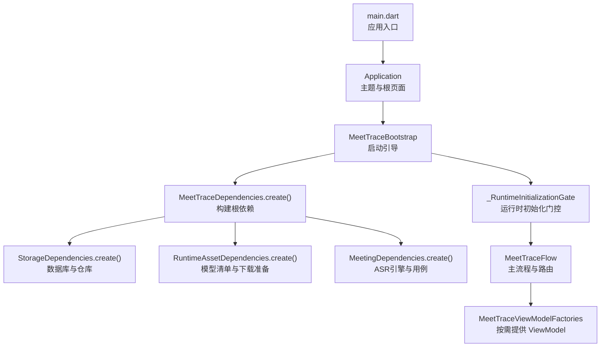
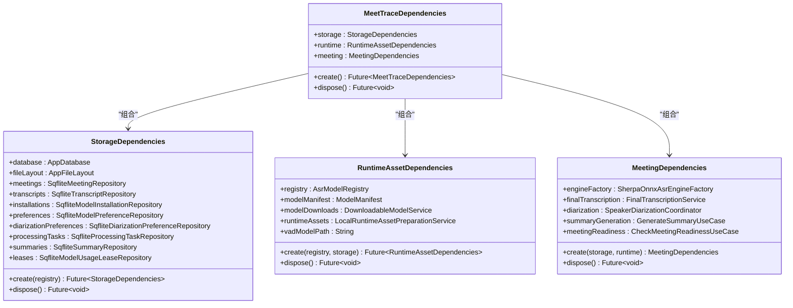
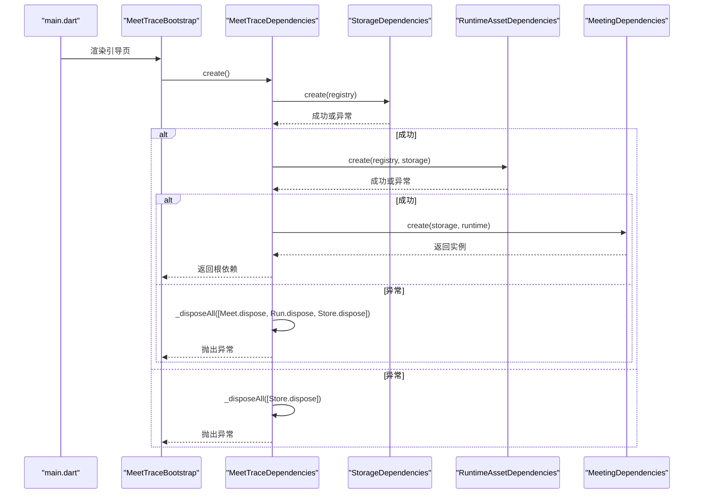
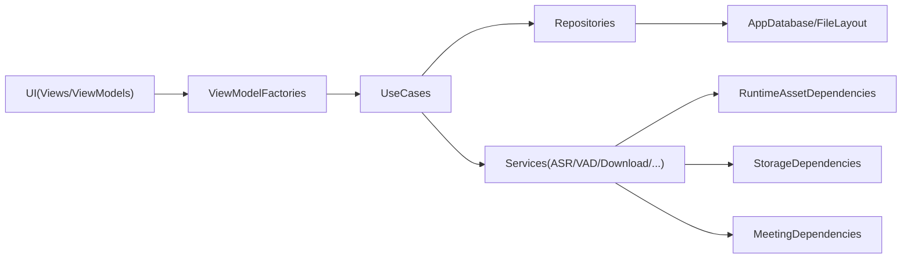

# 依赖注入

<cite>
**本文引用的文件**   
- [lib/app/meettrace_dependencies.dart](file://lib/app/meettrace_dependencies.dart)
- [lib/app/meettrace_storage_dependencies.dart](file://lib/app/meettrace_storage_dependencies.dart)
- [lib/app/meettrace_runtime_dependencies.dart](file://lib/app/meettrace_runtime_dependencies.dart)
- [lib/app/meettrace_meeting_dependencies.dart](file://lib/app/meettrace_meeting_dependencies.dart)
- [lib/app/meettrace_dependency_factories.dart](file://lib/app/meettrace_dependency_factories.dart)
- [lib/app/meettrace_flow.dart](file://lib/app/meettrace_flow.dart)
- [lib/main.dart](file://lib/main.dart)
- [lib/app/application.dart](file://lib/app/application.dart)
</cite>

## 目录
1. [简介](#简介)
2. [项目结构](#项目结构)
3. [核心组件](#核心组件)
4. [架构总览](#架构总览)
5. [详细组件分析](#详细组件分析)
6. [依赖关系分析](#依赖关系分析)
7. [性能与生命周期](#性能与生命周期)
8. [故障排查指南](#故障排查指南)
9. [结论](#结论)
10. [附录：配置与使用示例](#附录配置与使用示例)

## 简介
本文件系统化阐述会迹（MeetTrace）项目的依赖注入体系，围绕 MeetTraceDependencies 类及其子依赖容器展开，说明服务注册、实例管理与生命周期控制。通过工厂方法在应用启动时组装依赖，在 UI 层按需创建 ViewModel，实现“构造期装配 + 运行期解析”的轻量 DI 模式。该设计有效降低组件耦合、提升可测试性与可维护性，并通过分层作用域（应用级单例、会话级临时对象）管理资源。

## 项目结构
依赖注入相关代码集中在 lib/app 目录下，采用“根依赖容器 + 领域/存储/运行时子容器 + 视图模型工厂扩展”的分层组织方式：
- 根容器：MeetTraceDependencies
- 存储容器：StorageDependencies
- 运行时容器：RuntimeAssetDependencies
- 会议容器：MeetingDependencies
- 视图模型工厂：MeetTraceViewModelFactories（扩展于 MeetTraceDependencies）
- 引导流程：MeetTraceBootstrap、_RuntimeInitializationGate、MeetTraceFlow
- 应用入口：main.dart、Application

图示来源
- [lib/main.dart:7-12](file://lib/main.dart#L7-L12)
- [lib/app/application.dart:11-36](file://lib/app/application.dart#L11-L36)
- [lib/app/meettrace_flow.dart:19-58](file://lib/app/meettrace_flow.dart#L19-L58)
- [lib/app/meettrace_dependencies.dart:17-42](file://lib/app/meettrace_dependencies.dart#L17-L42)
- [lib/app/meettrace_storage_dependencies.dart:40-87](file://lib/app/meettrace_storage_dependencies.dart#L40-L87)
- [lib/app/meettrace_runtime_dependencies.dart:31-75](file://lib/app/meettrace_runtime_dependencies.dart#L31-L75)
- [lib/app/meettrace_meeting_dependencies.dart:30-73](file://lib/app/meettrace_meeting_dependencies.dart#L30-L73)
- [lib/app/meettrace_dependency_factories.dart:29-163](file://lib/app/meettrace_dependency_factories.dart#L29-L163)

章节来源
- [lib/main.dart:7-12](file://lib/main.dart#L7-L12)
- [lib/app/application.dart:11-36](file://lib/app/application.dart#L11-L36)
- [lib/app/meettrace_flow.dart:19-58](file://lib/app/meettrace_flow.dart#L19-L58)

## 核心组件
- MeetTraceDependencies：应用级依赖根容器，负责串联 Storage、Runtime、Meeting 三个子容器，并提供统一的 dispose 生命周期管理。
- StorageDependencies：数据访问层容器，封装 AppDatabase、文件布局与各 Repository（会议、转录、安装、偏好、任务、摘要、租约）。
- RuntimeAssetDependencies：运行时资源容器，负责模型清单解析、VAD 模型路径计算、模型下载与本地资源准备。
- MeetingDependencies：会议能力容器，封装 ASR 引擎工厂、最终转写、说话人分离、摘要生成与会前就绪检查等用例。
- MeetTraceViewModelFactories：基于 MeetTraceDependencies 的扩展，提供各 ViewModel 的工厂方法，将业务用例与服务注入到 UI 层。

章节来源
- [lib/app/meettrace_dependencies.dart:6-47](file://lib/app/meettrace_dependencies.dart#L6-L47)
- [lib/app/meettrace_storage_dependencies.dart:15-96](file://lib/app/meettrace_storage_dependencies.dart#L15-L96)
- [lib/app/meettrace_runtime_dependencies.dart:16-79](file://lib/app/meettrace_runtime_dependencies.dart#L16-L79)
- [lib/app/meettrace_meeting_dependencies.dart:15-77](file://lib/app/meettrace_meeting_dependencies.dart#L15-L77)
- [lib/app/meettrace_dependency_factories.dart:29-163](file://lib/app/meettrace_dependency_factories.dart#L29-L163)

## 架构总览
依赖注入在本项目中采用“静态工厂 + 显式构造”的轻量方案，避免全局单例与隐式查找，所有依赖通过 create() 方法逐步装配，并在需要时由工厂方法创建短生命周期对象。

图示来源
- [lib/app/meettrace_dependencies.dart:6-47](file://lib/app/meettrace_dependencies.dart#L6-L47)
- [lib/app/meettrace_storage_dependencies.dart:15-96](file://lib/app/meettrace_storage_dependencies.dart#L15-L96)
- [lib/app/meettrace_runtime_dependencies.dart:16-79](file://lib/app/meettrace_runtime_dependencies.dart#L16-L79)
- [lib/app/meettrace_meeting_dependencies.dart:15-77](file://lib/app/meettrace_meeting_dependencies.dart#L15-L77)

## 详细组件分析

### MeetTraceDependencies：根容器与生命周期
- 职责：聚合 Storage、Runtime、Meeting 三大子容器；统一创建顺序与错误回滚；提供 dispose 回收。
- 创建流程：先构建 Storage，再构建 Runtime（依赖 Storage），最后构建 Meeting（依赖 Storage 与 Runtime）。
- 错误处理：在任一阶段失败时，调用 _disposeAll 对已创建的子容器进行安全释放，保留原始错误堆栈。
- 生命周期：应用级单例，随引导页销毁而释放。

图示来源
- [lib/app/meettrace_flow.dart:26-58](file://lib/app/meettrace_flow.dart#L26-L58)
- [lib/app/meettrace_dependencies.dart:17-47](file://lib/app/meettrace_dependencies.dart#L17-L47)
- [lib/app/meettrace_storage_dependencies.dart:40-87](file://lib/app/meettrace_storage_dependencies.dart#L40-L87)
- [lib/app/meettrace_runtime_dependencies.dart:31-75](file://lib/app/meettrace_runtime_dependencies.dart#L31-L75)
- [lib/app/meettrace_meeting_dependencies.dart:30-73](file://lib/app/meettrace_meeting_dependencies.dart#L30-L73)

章节来源
- [lib/app/meettrace_dependencies.dart:17-47](file://lib/app/meettrace_dependencies.dart#L17-L47)

### StorageDependencies：数据层装配
- 职责：初始化文件布局、数据库、启动恢复、各 Repository 实例化。
- 关键步骤：
  - 创建应用文件布局并建立基础目录。
  - 启动恢复服务确保数据一致性。
  - 依次创建会议、转录、安装、偏好、任务、摘要、租约等仓库。
- 错误处理：捕获异常后，对已创建的仓库与数据库进行安全关闭，保留错误信息。
- 生命周期：应用级单例，随应用退出关闭数据库连接。

章节来源
- [lib/app/meettrace_storage_dependencies.dart:40-96](file://lib/app/meettrace_storage_dependencies.dart#L40-L96)

### RuntimeAssetDependencies：运行时资源装配
- 职责：解析模型清单、准备 VAD 模型、搭建下载与校验管线、计算 VAD 模型路径。
- 关键步骤：
  - 从资源包加载 manifest.json 与 VAD 清单。
  - 构建网络状态、容量检测、下载器、校验器等基础设施。
  - 组装 DownloadableModelService 与 LocalRuntimeAssetPreparationService。
- 生命周期：应用级单例，不持有长生命周期外部句柄，dispose 为空实现。

章节来源
- [lib/app/meettrace_runtime_dependencies.dart:31-79](file://lib/app/meettrace_runtime_dependencies.dart#L31-L79)

### MeetingDependencies：会议能力装配
- 职责：装配 ASR 引擎工厂、最终转写、说话人分离、摘要生成与会前就绪检查。
- 关键步骤：
  - 使用 Storage 提供的安装与租约信息构建 ASR 引擎工厂。
  - 为各用例注入对应的 Repository 与 now 时间源。
  - 使用平台风险监控与设备就绪探针完成会前检查。
- 生命周期：应用级单例，dispose 为空实现。

章节来源
- [lib/app/meettrace_meeting_dependencies.dart:30-77](file://lib/app/meettrace_meeting_dependencies.dart#L30-L77)

### MeetTraceViewModelFactories：UI 层依赖注入
- 职责：基于 MeetTraceDependencies 暴露一系列 createXxxViewModel 方法，将用例与服务注入到 ViewModel。
- 典型用法：
  - 创建运行时初始化 ViewModel，支持强制修复参数。
  - 创建会议列表、详情、设置、开始会议、录制会话等 ViewModel。
  - 在录制会话中组合预览与可靠录音服务，并注入会话生命周期用例。
- 生命周期：每个 ViewModel 为临时实例，由调用方负责 dispose。

章节来源
- [lib/app/meettrace_dependency_factories.dart:29-163](file://lib/app/meettrace_dependency_factories.dart#L29-L163)

## 依赖关系分析
- 分层解耦：UI 仅依赖 ViewModel 工厂，ViewModel 依赖 UseCase 与 Repository，底层服务通过 Storage/Runtime/Meeting 容器注入，避免跨层直接耦合。
- 作用域划分：
  - 应用级单例：Storage、Runtime、Meeting、MeetTraceDependencies。
  - 会话级临时：各 ViewModel、录制会话中的 Preview/Recording 服务等。
- 循环依赖策略：通过分层与接口抽象避免环；若出现潜在环，优先拆分为独立模块或通过延迟初始化解决。当前实现未检测到循环导入。

图示来源
- [lib/app/meettrace_dependency_factories.dart:29-163](file://lib/app/meettrace_dependency_factories.dart#L29-L163)
- [lib/app/meettrace_storage_dependencies.dart:40-96](file://lib/app/meettrace_storage_dependencies.dart#L40-L96)
- [lib/app/meettrace_runtime_dependencies.dart:31-79](file://lib/app/meettrace_runtime_dependencies.dart#L31-L79)
- [lib/app/meettrace_meeting_dependencies.dart:30-77](file://lib/app/meettrace_meeting_dependencies.dart#L30-L77)

## 性能与生命周期
- 启动性能：Storage 初始化包含数据库与恢复服务，Runtime 解析清单与准备资源，Meeting 构建用例。整体在引导页异步执行，避免阻塞 UI。
- 资源释放：根容器 dispose 顺序为 meeting -> runtime -> storage，确保上层先释放，再释放共享资源。
- 内存占用：应用级单例保持必要缓存（如清单、仓库句柄），会话级对象及时释放，减少峰值内存。
- 优化建议：
  - 对耗时操作（下载、校验）增加进度反馈与取消机制。
  - 对频繁创建的对象（如音频采集器）考虑复用池或延迟初始化。
  - 在低内存设备上限制并发下载与后台任务数量。

[本节为通用指导，不直接分析具体文件]

## 故障排查指南
- 启动失败：
  - 检查 StorageDependencies.create 是否抛出异常（数据库打开失败、恢复失败）。
  - 检查 RuntimeAssetDependencies.create 是否成功解析清单与下载权限。
  - 检查 MeetingDependencies.create 是否因引擎工厂或就绪检查失败。
- 资源泄漏：
  - 确认 MeetTraceDependencies.dispose 被调用（引导页 dispose 中已调用）。
  - 确认各 ViewModel 在使用完毕后调用 dispose。
- 循环依赖：
  - 若出现循环导入，优先拆分模块或引入延迟初始化。
- 常见错误：
  - 旧版 Alpha 数据不兼容：根据错误提示导出旧数据后重试。
  - 存储空间不足：清理空间后重试。

章节来源
- [lib/app/meettrace_flow.dart:26-58](file://lib/app/meettrace_flow.dart#L26-L58)
- [lib/app/meettrace_dependencies.dart:34-47](file://lib/app/meettrace_dependencies.dart#L34-L47)
- [lib/app/meettrace_storage_dependencies.dart:79-96](file://lib/app/meettrace_storage_dependencies.dart#L79-L96)

## 结论
MeetTraceDependencies 及其子容器构成了一套清晰、可扩展的轻量依赖注入体系。通过分层装配与工厂方法，既保证了应用级资源的集中管理，又实现了 UI 层的灵活注入与替换。该设计显著降低了组件耦合，提升了可测试性与可维护性，并为后续功能扩展提供了稳定的基础。

[本节为总结性内容，不直接分析具体文件]

## 附录：配置与使用示例
- 应用启动初始化：
  - 在 main.dart 中初始化 Flutter 绑定与系统 UI，然后运行 Application，根页面为 MeetTraceBootstrap。
  - MeetTraceBootstrap 内部调用 MeetTraceDependencies.create() 完成依赖装配。
- 在测试中替换模拟依赖：
  - 通过 MeetTraceViewModelFactories 的 createXxxViewModel 方法，传入自定义的 Repository、Service 或 UseCase 实例，以替换真实依赖。
  - 例如，在单元测试中注入 Mock 的下载服务、存储仓库或 ASR 引擎工厂，验证行为与边界条件。
- 依赖解析顺序：
  - Storage -> Runtime -> Meeting -> ViewModel，遵循自底向上的装配顺序。
- 循环依赖处理策略：
  - 通过分层与接口抽象避免环；必要时采用延迟初始化或事件驱动解耦。

章节来源
- [lib/main.dart:7-12](file://lib/main.dart#L7-L12)
- [lib/app/application.dart:11-36](file://lib/app/application.dart#L11-L36)
- [lib/app/meettrace_flow.dart:26-58](file://lib/app/meettrace_flow.dart#L26-L58)
- [lib/app/meettrace_dependency_factories.dart:29-163](file://lib/app/meettrace_dependency_factories.dart#L29-L163)