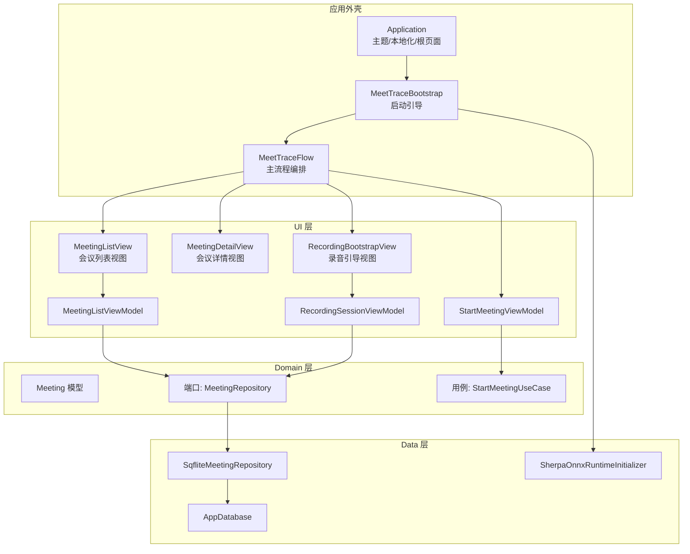
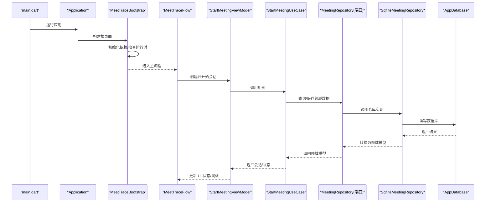
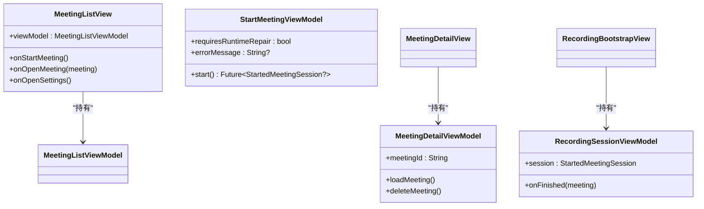
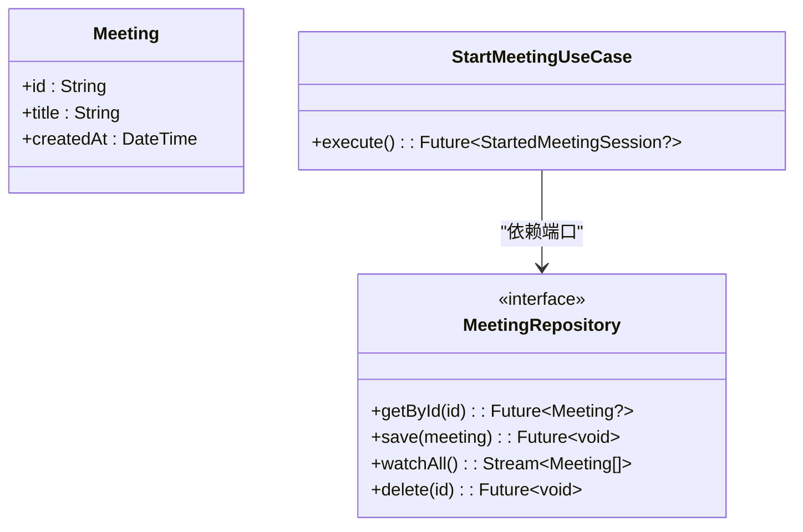
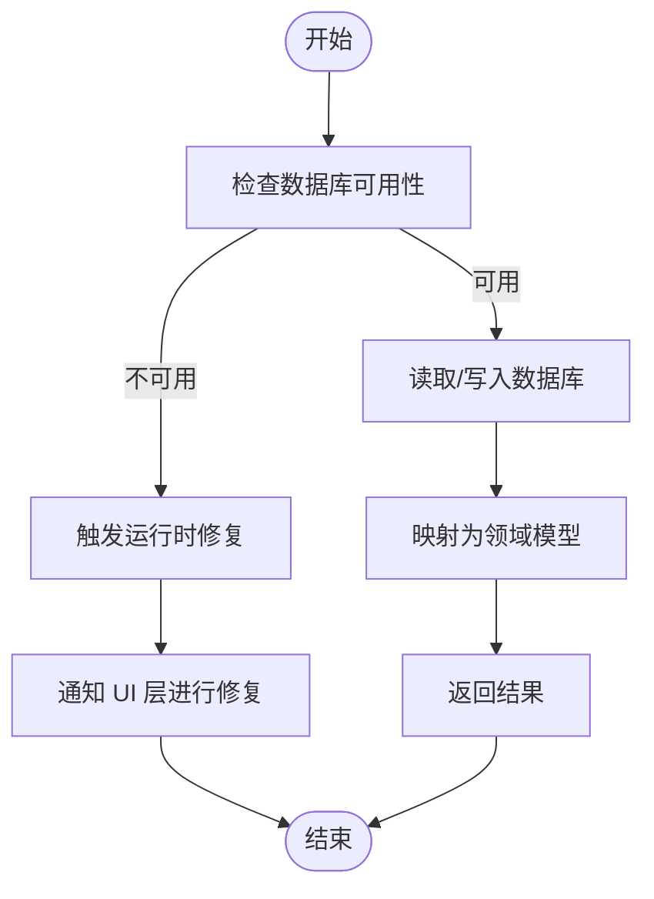
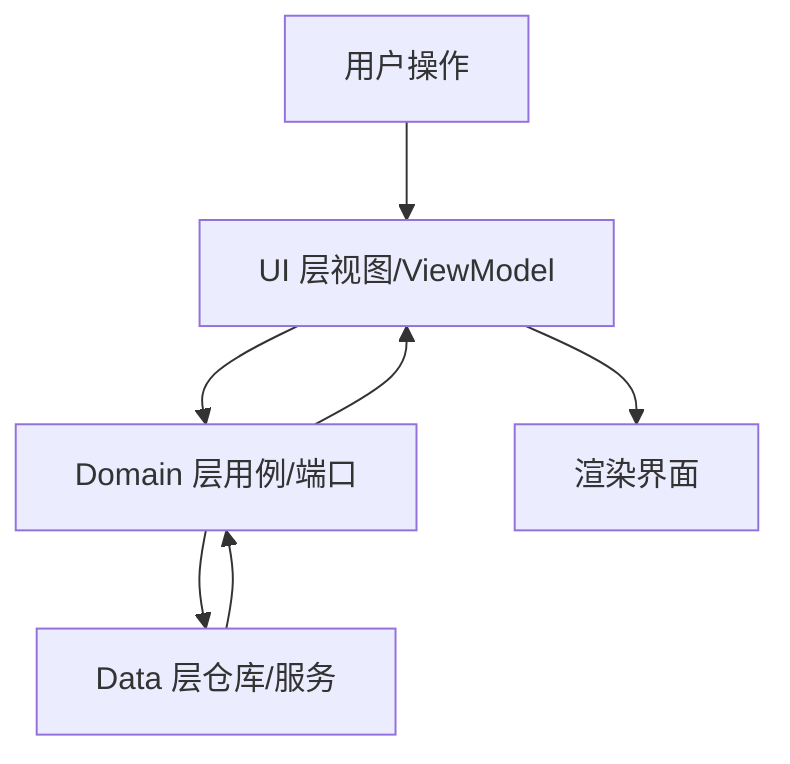
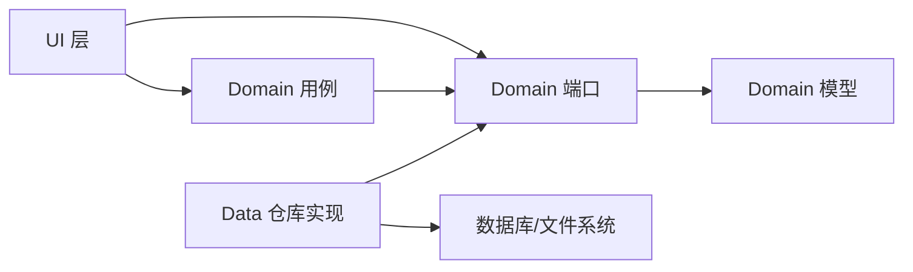

# 分层架构

<cite>
**本文引用的文件**   
- [lib/main.dart](file://lib/main.dart)
- [lib/app/application.dart](file://lib/app/application.dart)
- [lib/app/meettrace_flow.dart](file://lib/app/meettrace_flow.dart)
- [pubspec.yaml](file://pubspec.yaml)
- [test/architecture/layer_boundaries_test.dart](file://test/architecture/layer_boundaries_test.dart)
</cite>

## 目录
1. [简介](#简介)
2. [项目结构](#项目结构)
3. [核心组件](#核心组件)
4. [架构总览](#架构总览)
5. [详细组件分析](#详细组件分析)
6. [依赖关系分析](#依赖关系分析)
7. [性能考虑](#性能考虑)
8. [故障排查指南](#故障排查指南)
9. [结论](#结论)
10. [附录](#附录)

## 简介
本文件为会迹（MeetTrace）项目的分层架构文档，聚焦 UI 层、Domain 层、Data 层的职责边界与协作方式。通过单向依赖原则与接口抽象，确保代码具备可维护性、可测试性与可扩展性。文档同时给出层间通信机制与错误处理策略，并以具体文件路径作为示例来源，帮助读者快速定位实现细节。

## 项目结构
项目采用 Flutter 工程组织，核心源码位于 lib 目录，按分层划分：
- app：应用装配、启动流程、路由编排与依赖注入入口
- ui：视图与 ViewModel，负责展示与用户交互
- domain：领域模型、端口（Repository/Service 接口）与用例（Use Case）
- data：数据访问与外部服务实现（数据库、文件系统、ASR/VAD 等）
- theme：主题与样式配置

图表来源
- [lib/app/application.dart:1-37](file://lib/app/application.dart#L1-L37)
- [lib/app/meettrace_flow.dart:1-265](file://lib/app/meettrace_flow.dart#L1-L265)
- [lib/main.dart:1-13](file://lib/main.dart#L1-L13)

章节来源
- [lib/main.dart:1-13](file://lib/main.dart#L1-L13)
- [lib/app/application.dart:1-37](file://lib/app/application.dart#L1-L37)
- [lib/app/meettrace_flow.dart:1-265](file://lib/app/meettrace_flow.dart#L1-L265)

## 核心组件
- Application：应用外壳，统一主题、本地化与根页面组装，不包含业务逻辑。
- MeetTraceBootstrap：应用启动引导，负责依赖初始化与运行时准备，处理异常分支并回退到启动页或修复流程。
- MeetTraceFlow：主流程编排，协调 ViewModel、路由跳转与会话生命周期管理。
- ViewModel（如 MeetingListViewModel、StartMeetingViewModel、RecordingSessionViewModel）：封装 UI 状态与交互逻辑，调用 Domain 层用例与端口。
- Domain 模型与用例：纯 Dart 的领域对象与业务流程编排，不依赖 UI 与 Data 实现。
- Data 仓库与服务：基于 Sqflite、文件系统与 ASR/VAD 的具体实现，暴露给 Domain 层通过端口使用。

章节来源
- [lib/app/application.dart:1-37](file://lib/app/application.dart#L1-L37)
- [lib/app/meettrace_flow.dart:1-265](file://lib/app/meettrace_flow.dart#L1-L265)

## 架构总览
分层架构遵循“UI → Domain ← Data”的单向依赖原则：
- UI 层仅依赖 Domain 层的端口与用例，不直接访问 Data 层。
- Domain 层定义抽象（端口），由 Data 层提供具体实现。
- Data 层不反向依赖 UI 或 App 层，保持低耦合。

图表来源
- [lib/main.dart:1-13](file://lib/main.dart#L1-L13)
- [lib/app/application.dart:1-37](file://lib/app/application.dart#L1-L37)
- [lib/app/meettrace_flow.dart:1-265](file://lib/app/meettrace_flow.dart#L1-L265)

## 详细组件分析

### UI 层（视图与 ViewModel）
- 视图组件：MeetingListView、MeetingDetailView、RecordingBootstrapView 等，负责渲染与用户交互。
- ViewModel：MeetingListViewModel、StartMeetingViewModel、RecordingSessionViewModel 等，封装状态与事件处理，调用 Domain 层用例与端口。
- 依赖方向：UI → Domain（端口/用例），禁止直接导入 Data 层仓库或服务。

图表来源
- [lib/app/meettrace_flow.dart:1-265](file://lib/app/meettrace_flow.dart#L1-L265)

章节来源
- [lib/app/meettrace_flow.dart:1-265](file://lib/app/meettrace_flow.dart#L1-L265)

### Domain 层（模型、端口与用例）
- 模型：Meeting 等纯 Dart 数据结构，无框架依赖。
- 端口：MeetingRepository 等接口，定义数据访问契约。
- 用例：StartMeetingUseCase 等编排业务逻辑，组合多个端口完成用例。

图表来源
- [lib/app/meettrace_flow.dart:1-265](file://lib/app/meettrace_flow.dart#L1-L265)

章节来源
- [lib/app/meettrace_flow.dart:1-265](file://lib/app/meettrace_flow.dart#L1-L265)

### Data 层（仓库与服务实现）
- 仓库实现：SqfliteMeetingRepository 等，基于 Sqflite 数据库访问，将原始数据映射为领域模型。
- 服务：AppDatabase、SherpaOnnxRuntimeInitializer 等，封装平台能力与外部依赖。
- 依赖方向：Data 仅依赖 Domain 端口与第三方库，不反向依赖 UI/App。

图表来源
- [lib/app/meettrace_flow.dart:1-265](file://lib/app/meettrace_flow.dart#L1-L265)

章节来源
- [lib/app/meettrace_flow.dart:1-265](file://lib/app/meettrace_flow.dart#L1-L265)

### 概念总览
以下流程图展示了典型的数据流与控制流，便于理解分层协作：

[此图为概念性说明，不直接映射具体源文件]

## 依赖关系分析
- 单向依赖：UI → Domain；Data → Domain（实现端口）。
- 接口抽象：Domain 层通过端口定义契约，Data 层提供实现，UI 层仅依赖抽象。
- 测试隔离：通过 Fake/Mock 替换 Data 实现，验证 UI 与 Domain 行为。

图表来源
- [test/architecture/layer_boundaries_test.dart:1-48](file://test/architecture/layer_boundaries_test.dart#L1-L48)

章节来源
- [test/architecture/layer_boundaries_test.dart:1-48](file://test/architecture/layer_boundaries_test.dart#L1-L48)

## 性能考虑
- 懒加载与按需初始化：在 MeetTraceBootstrap 中延迟初始化运行时能力，减少启动开销。
- 流式数据：通过 Stream 推送数据变更，避免频繁轮询。
- 缓存策略：在仓库层对热点数据进行缓存，降低数据库压力。
- 资源清理：在 ViewModel 与 Flow 中显式释放资源，防止内存泄漏。

[本节为通用指导，不直接分析具体文件]

## 故障排查指南
- 启动失败：检查 MeetTraceBootstrap 的错误分支与修复流程，确认设备空间与运行时依赖。
- 数据异常：查看 Data 层仓库实现的异常处理与重试策略，必要时回滚事务。
- UI 卡顿：检查 ViewModel 中的异步任务是否在主线程执行，避免阻塞渲染。
- 依赖注入问题：确认 MeetTraceDependencies 是否正确注册与解析。

章节来源
- [lib/app/meettrace_flow.dart:1-265](file://lib/app/meettrace_flow.dart#L1-L265)

## 结论
会迹项目通过清晰的分层架构实现了高内聚、低耦合的设计目标。UI 层专注展示与交互，Domain 层承载业务逻辑与抽象，Data 层负责数据持久化与外部集成。单向依赖与接口抽象确保了代码的可维护性、可测试性与可扩展性。结合严格的边界测试与完善的错误处理策略，项目能够在复杂场景下保持稳定与高效。

[本节为总结性内容，不直接分析具体文件]

## 附录
- 依赖声明：见 pubspec.yaml，包含音频录制、SQLite、ASR/VAD 等关键依赖。
- 架构测试：见 test/architecture/layer_boundaries_test.dart，验证分层边界不被违反。

章节来源
- [pubspec.yaml:1-112](file://pubspec.yaml#L1-L112)
- [test/architecture/layer_boundaries_test.dart:1-48](file://test/architecture/layer_boundaries_test.dart#L1-L48)