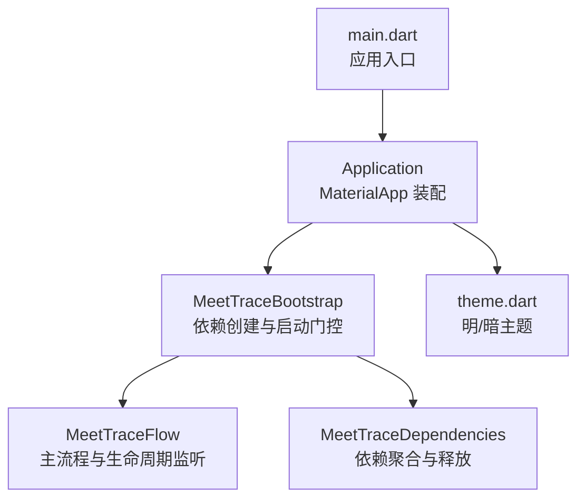
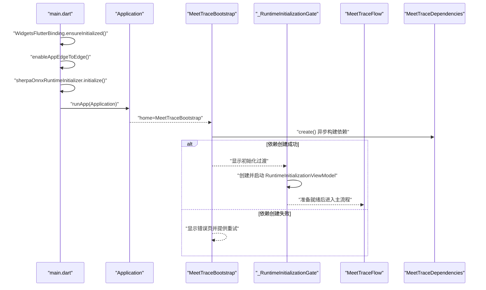
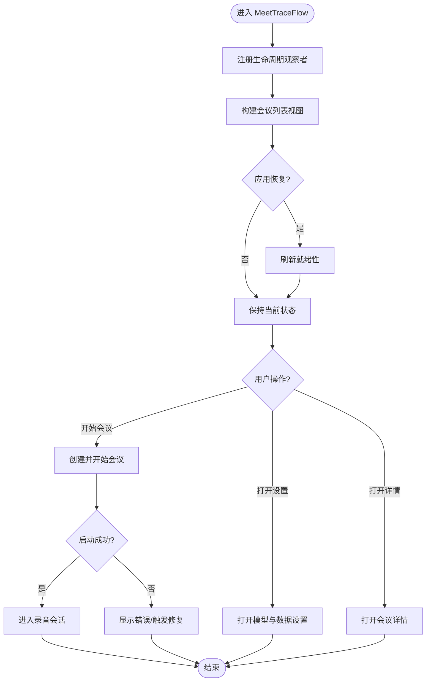
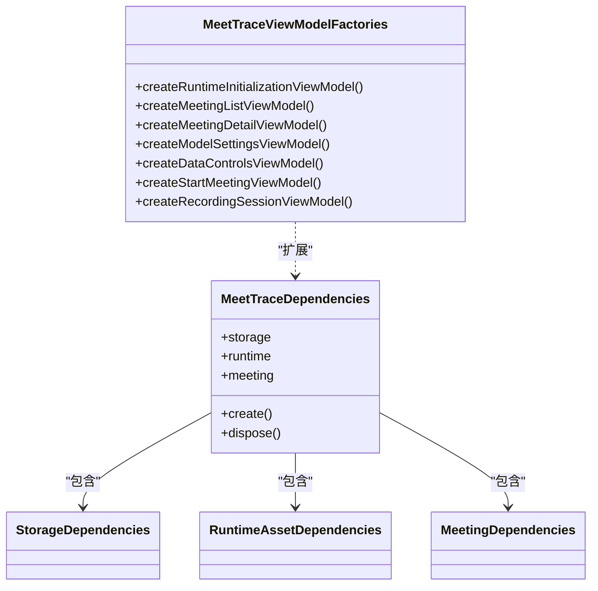
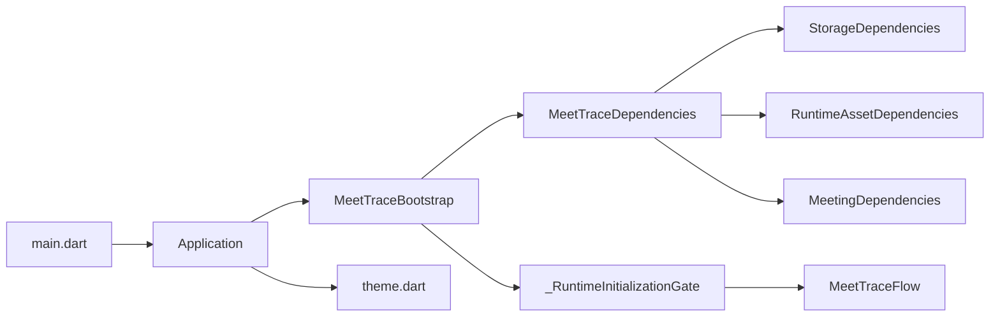
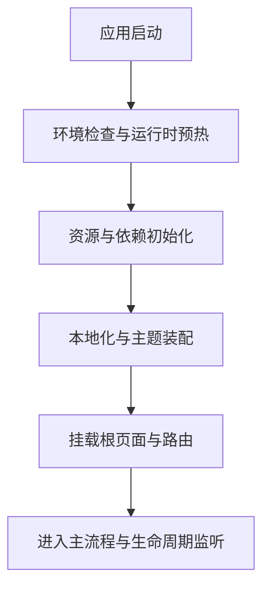

# 应用生命周期

<cite>
**本文引用的文件**   
- [lib/main.dart](file://lib/main.dart)
- [lib/app/application.dart](file://lib/app/application.dart)
- [lib/app/meettrace_flow.dart](file://lib/app/meettrace_flow.dart)
- [lib/app/meettrace_dependencies.dart](file://lib/app/meettrace_dependencies.dart)
- [lib/app/meettrace_dependency_factories.dart](file://lib/app/meettrace_dependency_factories.dart)
- [lib/theme/theme.dart](file://lib/theme/theme.dart)
</cite>

## 目录
1. [简介](#简介)
2. [项目结构](#项目结构)
3. [核心组件](#核心组件)
4. [架构总览](#架构总览)
5. [详细组件分析](#详细组件分析)
6. [依赖关系分析](#依赖关系分析)
7. [性能考虑](#性能考虑)
8. [故障排查指南](#故障排查指南)
9. [结论](#结论)
10. [附录](#附录)

## 简介
本文件面向会迹（MeetTrace）Flutter 应用的“应用生命周期”主题，系统化梳理从 Flutter main 入口到 MeetTraceBootstrap 的完整启动流程，涵盖环境检查、资源初始化、依赖注入配置、主题与本地化装配、路由与页面挂载等关键环节。同时解释 Flutter 应用生命周期事件（初始化、恢复、暂停、销毁）在应用中的处理策略，并给出启动性能优化建议、错误恢复机制以及调试方法。

## 项目结构
- 入口层：main.dart 负责 Flutter 绑定初始化、系统 UI 适配、ASR 运行时预初始化，以及启动 Application。
- 应用外壳：Application 负责 MaterialApp 装配（标题、主题、本地化、根页面）。
- 启动引导：MeetTraceBootstrap 负责依赖创建、启动态过渡、运行时初始化门控、错误展示与重试。
- 依赖注入：MeetTraceDependencies 聚合 Storage/Runtime/Meeting 三层依赖；工厂扩展提供 ViewModel 构建。
- 主题与样式：theme.dart 提供明/暗两套 FThemeData，并在 Application 中按亮度切换。

**图示来源** 
- [lib/main.dart:7-12](file://lib/main.dart#L7-L12)
- [lib/app/application.dart:18-35](file://lib/app/application.dart#L18-L35)
- [lib/app/meettrace_flow.dart:19-58](file://lib/app/meettrace_flow.dart#L19-L58)
- [lib/app/meettrace_dependencies.dart:17-42](file://lib/app/meettrace_dependencies.dart#L17-L42)
- [lib/theme/theme.dart:26-66](file://lib/theme/theme.dart#L26-L66)

**章节来源**
- [lib/main.dart:7-12](file://lib/main.dart#L7-L12)
- [lib/app/application.dart:18-35](file://lib/app/application.dart#L18-L35)
- [lib/app/meettrace_flow.dart:19-58](file://lib/app/meettrace_flow.dart#L19-L58)
- [lib/app/meettrace_dependencies.dart:17-42](file://lib/app/meettrace_dependencies.dart#L17-L42)
- [lib/theme/theme.dart:26-66](file://lib/theme/theme.dart#L26-L66)

## 核心组件
- Application：集中管理 MaterialApp 的配置项（标题、主题、本地化、根页面），并通过 FTheme/FToaster/FTooltipGroup 为全局 UI 能力提供基础。
- MeetTraceBootstrap：异步创建 MeetTraceDependencies，失败时展示可重试的错误页；成功后进入运行时初始化门控。
- _RuntimeInitializationGate：创建并启动 RuntimeInitializationViewModel，完成后进入 MeetTraceFlow。
- MeetTraceFlow：承载主界面与会话流程，注册 WidgetsBindingObserver 监听应用生命周期，驱动会议列表、设置、录音会话等导航。
- MeetTraceDependencies：统一创建与释放 Storage/Runtime/Meeting 依赖，异常路径保证已创建资源的有序释放。
- 依赖工厂扩展：为各 ViewModel 提供构造器，将领域用例、服务、存储与 UI 视图解耦。

**章节来源**
- [lib/app/application.dart:18-35](file://lib/app/application.dart#L18-L35)
- [lib/app/meettrace_flow.dart:19-112](file://lib/app/meettrace_flow.dart#L19-L112)
- [lib/app/meettrace_flow.dart:114-156](file://lib/app/meettrace_flow.dart#L114-L156)
- [lib/app/meettrace_dependencies.dart:17-47](file://lib/app/meettrace_dependencies.dart#L17-L47)
- [lib/app/meettrace_dependency_factories.dart:29-163](file://lib/app/meettrace_dependency_factories.dart#L29-L163)

## 架构总览
下图展示了从 main 到主界面的关键调用链与职责边界。

**图示来源** 
- [lib/main.dart:7-12](file://lib/main.dart#L7-L12)
- [lib/app/application.dart:18-35](file://lib/app/application.dart#L18-L35)
- [lib/app/meettrace_flow.dart:19-58](file://lib/app/meettrace_flow.dart#L19-L58)
- [lib/app/meettrace_dependencies.dart:17-42](file://lib/app/meettrace_dependencies.dart#L17-L42)

## 详细组件分析

### 启动入口与环境准备（main.dart）
- 确保 Flutter 绑定可用，避免后续平台通道或渲染相关调用崩溃。
- 启用边缘到边缘显示，提升沉浸式体验。
- 预初始化 ASR 运行时（Sherpa Onnx），减少首次使用时的冷启动延迟。
- 启动 Application，传入 MeetTraceBootstrap 作为根页面。

**章节来源**
- [lib/main.dart:7-12](file://lib/main.dart#L7-L12)

### 应用外壳与配置装配（Application）
- 设置应用标题、关闭调试横幅。
- 配置 supportedLocales 与 localizationsDelegates，完成多语言支持。
- 通过 lightTheme/darkTheme 生成 Material 主题，并在 builder 中根据亮度选择 Forui 主题，包裹 FToaster 与 FTooltipGroup。
- 默认 home 为 MeetingListView；测试场景可替换为轻量首页。

**章节来源**
- [lib/app/application.dart:18-35](file://lib/app/application.dart#L18-L35)
- [lib/theme/theme.dart:26-66](file://lib/theme/theme.dart#L26-L66)

### 启动引导与依赖创建（MeetTraceBootstrap）
- 使用 FutureBuilder 异步加载 MeetTraceDependencies.create()。
- 捕获异常并区分旧版 Alpha 数据不兼容等场景，展示可重试的错误页。
- 依赖创建成功后进入运行时初始化门控。
- dispose 阶段释放依赖，避免内存泄漏。

**章节来源**
- [lib/app/meettrace_flow.dart:19-65](file://lib/app/meettrace_flow.dart#L19-L65)

### 运行时初始化门控（_RuntimeInitializationGate）
- 创建 RuntimeInitializationViewModel 并调用 start() 执行资源校验与准备。
- 若需要修复，提供 forceRepair 参数重启初始化流程。
- 成功后进入 MeetTraceFlow，并将 onRuntimeRepairRequired 回调回传以触发修复。

**章节来源**
- [lib/app/meettrace_flow.dart:67-112](file://lib/app/meettrace_flow.dart#L67-L112)

### 主流程与生命周期监听（MeetTraceFlow）
- 注册 WidgetsBindingObserver，监听 didChangeAppLifecycleState。
- 在 resumed 状态刷新会议就绪性，确保后台恢复后状态一致。
- 提供开始会议、打开详情、打开设置等导航逻辑，并在页面退出时释放 ViewModel。
- 启动失败时弹出对话框提示，必要时触发运行时修复。

**图示来源** 
- [lib/app/meettrace_flow.dart:114-156](file://lib/app/meettrace_flow.dart#L114-L156)
- [lib/app/meettrace_flow.dart:158-204](file://lib/app/meettrace_flow.dart#L158-L204)
- [lib/app/meettrace_flow.dart:206-256](file://lib/app/meettrace_flow.dart#L206-L256)

**章节来源**
- [lib/app/meettrace_flow.dart:114-264](file://lib/app/meettrace_flow.dart#L114-L264)

### 依赖注入与工厂（MeetTraceDependencies 与工厂扩展）
- create() 顺序创建 Storage/Runtime/Meeting 依赖，异常路径统一释放已创建资源。
- 工厂扩展为各 ViewModel 提供构造器，将用例、服务、存储与 UI 解耦。
- 录音会话 ViewModel 组合预览、可靠录音、VAD、前台生命周期等子系统。

**图示来源** 
- [lib/app/meettrace_dependencies.dart:6-47](file://lib/app/meettrace_dependencies.dart#L6-L47)
- [lib/app/meettrace_dependency_factories.dart:29-163](file://lib/app/meettrace_dependency_factories.dart#L29-L163)

**章节来源**
- [lib/app/meettrace_dependencies.dart:17-47](file://lib/app/meettrace_dependencies.dart#L17-L47)
- [lib/app/meettrace_dependency_factories.dart:29-163](file://lib/app/meettrace_dependency_factories.dart#L29-L163)

## 依赖关系分析
- main 仅做最小化环境准备，随后交由 Application 装配 UI 框架能力。
- MeetTraceBootstrap 承担“依赖创建 + 启动门控”的职责，屏蔽底层复杂性。
- MeetTraceFlow 聚焦于业务流与生命周期响应，所有跨层能力通过依赖注入获取。
- 主题与本地化由 Application 统一装配，避免在各页面重复配置。

**图示来源** 
- [lib/main.dart:7-12](file://lib/main.dart#L7-L12)
- [lib/app/application.dart:18-35](file://lib/app/application.dart#L18-L35)
- [lib/app/meettrace_flow.dart:19-112](file://lib/app/meettrace_flow.dart#L19-L112)
- [lib/app/meettrace_dependencies.dart:17-42](file://lib/app/meettrace_dependencies.dart#L17-L42)
- [lib/theme/theme.dart:26-66](file://lib/theme/theme.dart#L26-L66)

**章节来源**
- [lib/app/meettrace_flow.dart:19-112](file://lib/app/meettrace_flow.dart#L19-L112)
- [lib/app/meettrace_dependencies.dart:17-42](file://lib/app/meettrace_dependencies.dart#L17-L42)

## 性能考虑
- 启动前移：在 main 中尽早初始化 Sherpa Onnx 运行时，降低首次语音识别的冷启动延迟。
- 渐进式加载：依赖创建与运行时初始化采用异步 FutureBuilder，避免阻塞首帧渲染。
- 按需构建 ViewModel：仅在进入对应页面时创建 ViewModel，并在页面退出时及时释放。
- 生命周期敏感刷新：在应用恢复时刷新就绪性，避免不必要的重计算。
- 主题与本地化一次性装配：在 Application 层集中配置，减少重复开销。

[本节为通用指导，无需代码引用]

## 故障排查指南
- 启动失败与重试
  - 现象：依赖创建抛出异常，显示错误页并提供重试按钮。
  - 可能原因：存储空间不足、旧版 Alpha 数据不兼容、运行时资源缺失。
  - 处理：点击重试重新创建依赖；如为旧数据问题，按提示导出后再迁移。
- 运行时修复
  - 现象：开始会议失败且标记需要运行时修复。
  - 处理：触发 onRuntimeRepairRequired，强制重建初始化 ViewModel 并重新启动。
- 生命周期相关问题
  - 现象：应用从后台恢复后状态不一致。
  - 处理：确认 didChangeAppLifecycleState 中是否调用了刷新就绪性的逻辑。
- 主题与本地化
  - 现象：主题切换无效或多语言未生效。
  - 处理：检查 Application 中 theme 与 localizationsDelegates 是否正确装配。

**章节来源**
- [lib/app/meettrace_flow.dart:19-65](file://lib/app/meettrace_flow.dart#L19-L65)
- [lib/app/meettrace_flow.dart:114-156](file://lib/app/meettrace_flow.dart#L114-L156)
- [lib/app/meettrace_flow.dart:158-204](file://lib/app/meettrace_flow.dart#L158-L204)

## 结论
会迹应用的启动链路清晰分层：main 负责环境与运行时预热，Application 装配主题与本地化，MeetTraceBootstrap 负责依赖创建与启动门控，MeetTraceFlow 承载主流程与生命周期响应。通过依赖注入与工厂模式，UI 与业务逻辑解耦，便于扩展与维护。配合生命周期监听与错误恢复机制，应用在复杂环境下具备更强的鲁棒性与用户体验。

[本节为总结性内容，无需代码引用]

## 附录
- Flutter 应用生命周期事件对照
  - 初始化：WidgetsFlutterBinding.ensureInitialized()
  - 恢复：didChangeAppLifecycleState(resumed)
  - 暂停：didChangeAppLifecycleState(paused)
  - 销毁：dispose()
- 启动流程图（概念）

[本图为概念示意，不直接映射具体源码，故无图示来源]