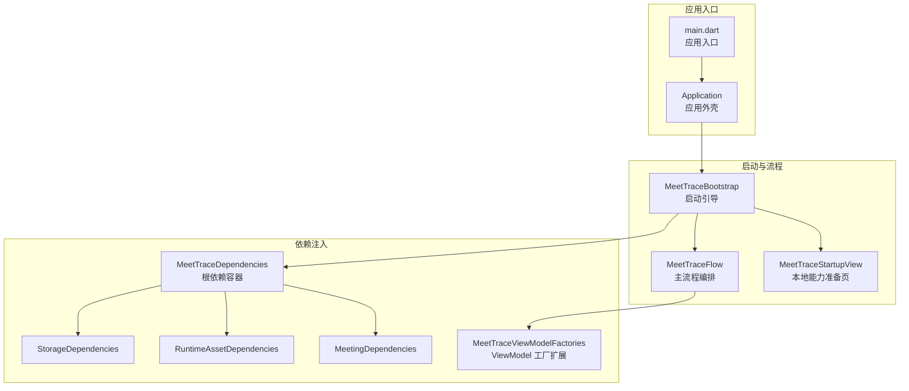
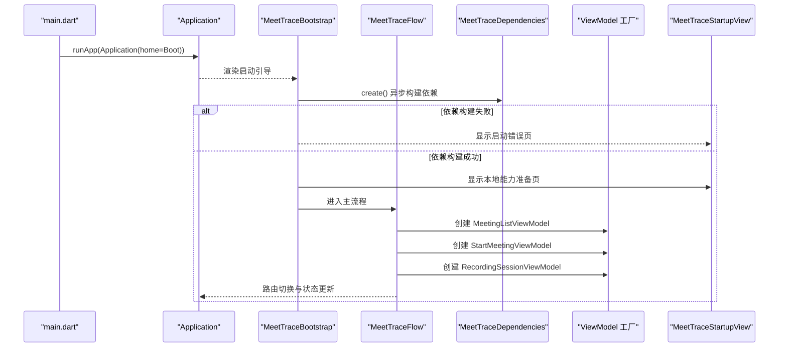
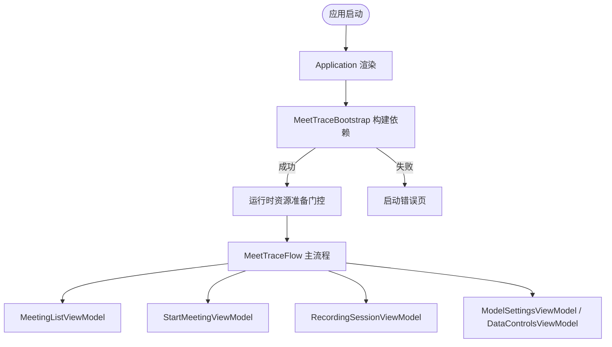
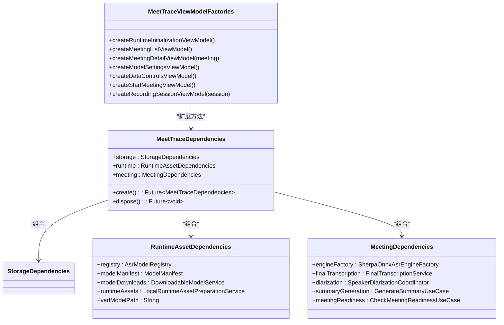
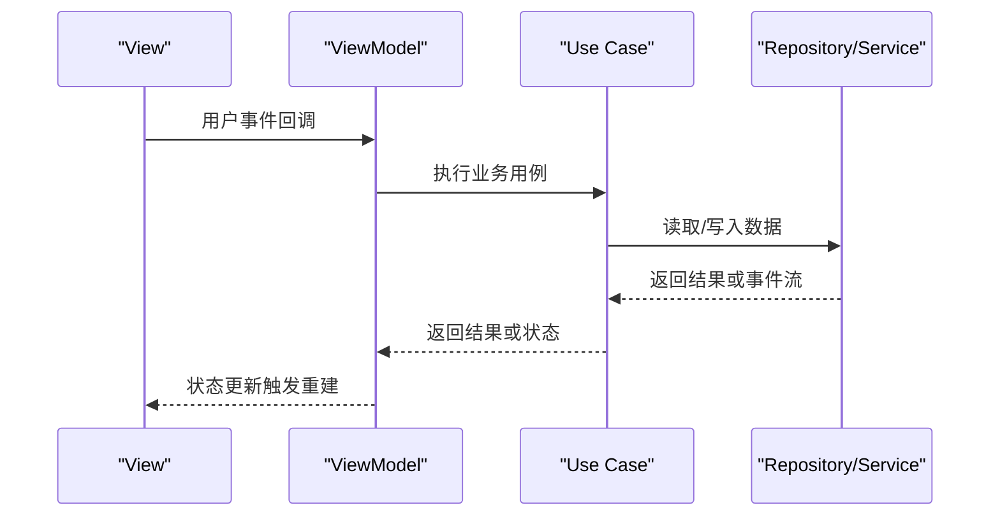
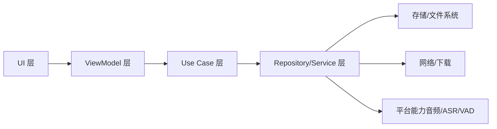

# 架构设计

<cite>
**本文引用的文件**
- [lib/main.dart](file://lib/main.dart)
- [lib/app/application.dart](file://lib/app/application.dart)
- [lib/app/meettrace_flow.dart](file://lib/app/meettrace_flow.dart)
- [lib/app/meettrace_dependencies.dart](file://lib/app/meettrace_dependencies.dart)
- [lib/app/meettrace_dependency_factories.dart](file://lib/app/meettrace_dependency_factories.dart)
- [lib/app/meettrace_meeting_dependencies.dart](file://lib/app/meettrace_meeting_dependencies.dart)
- [lib/app/meettrace_runtime_dependencies.dart](file://lib/app/meettrace_runtime_dependencies.dart)
- [lib/ui/features/startup/views/meettrace_startup_view.dart](file://lib/ui/features/startup/views/meettrace_startup_view.dart)
</cite>

## 目录
1. [简介](#简介)
2. [项目结构](#项目结构)
3. [核心组件](#核心组件)
4. [架构总览](#架构总览)
5. [详细组件分析](#详细组件分析)
6. [依赖关系分析](#依赖关系分析)
7. [性能考量](#性能考量)
8. [故障排查指南](#故障排查指南)
9. [结论](#结论)
10. [附录](#附录)

## 简介
本文件为“会迹（MeetTrace）”Flutter 应用的架构设计文档，重点阐述分层架构（UI、Domain、Data）、MVVM 模式与依赖注入系统的设计与实践。文档涵盖：
- UI 层、Domain 层、Data 层的职责分离与交互方式
- MVVM 中 View、ViewModel、Use Case、Repository 的数据流向与状态管理
- 通过 MeetTraceDependencies 管理的组件生命周期与实例创建
- 应用启动流程：从 Application 到 MeetTraceBootstrap 的初始化过程
- 核心设计模式：工厂模式、状态机模式等在系统中的体现
- 架构图与数据流图，帮助开发者快速理解整体结构与组件关系

## 项目结构
项目采用 Flutter 标准工程结构，核心代码位于 lib 目录下，按功能与层次划分：
- app：应用装配、依赖注入、启动流程编排
- ui：界面与视图模型（View/ViewModel），按特性组织
- domain：领域模型与用例（Use Cases）
- data：数据访问与服务（Repository、Service）
- theme：主题与国际化配置

**图表来源**
- [lib/main.dart:7-12](file://lib/main.dart#L7-L12)
- [lib/app/application.dart:11-36](file://lib/app/application.dart#L11-L36)
- [lib/app/meettrace_flow.dart:19-58](file://lib/app/meettrace_flow.dart#L19-L58)
- [lib/app/meettrace_dependencies.dart:6-47](file://lib/app/meettrace_dependencies.dart#L6-L47)
- [lib/app/meettrace_dependency_factories.dart:29-48](file://lib/app/meettrace_dependency_factories.dart#L29-L48)
- [lib/ui/features/startup/views/meettrace_startup_view.dart:16-33](file://lib/ui/features/startup/views/meettrace_startup_view.dart#L16-L33)

**章节来源**
- [lib/main.dart:7-12](file://lib/main.dart#L7-L12)
- [lib/app/application.dart:11-36](file://lib/app/application.dart#L11-L36)
- [lib/app/meettrace_flow.dart:19-58](file://lib/app/meettrace_flow.dart#L19-L58)
- [lib/app/meettrace_dependencies.dart:6-47](file://lib/app/meettrace_dependencies.dart#L6-L47)
- [lib/app/meettrace_dependency_factories.dart:29-48](file://lib/app/meettrace_dependency_factories.dart#L29-L48)
- [lib/ui/features/startup/views/meettrace_startup_view.dart:16-33](file://lib/ui/features/startup/views/meettrace_startup_view.dart#L16-L33)

## 核心组件
- Application：应用外壳，负责主题、本地化与根页面组装，不承载业务逻辑
- MeetTraceBootstrap：启动引导，负责依赖加载、错误处理与运行时资源准备门控
- MeetTraceFlow：主流程编排，负责会议列表、开始会议、录音会话与设置页面的路由与状态协调
- MeetTraceDependencies：根依赖容器，统一创建 Storage/Runtime/Meeting 三层依赖并管理生命周期
- ViewModel 工厂扩展：集中创建各 Feature 的 ViewModel，注入 Use Case、Service 与 Repository
- RuntimeInitializationViewModel：运行时资源准备的状态管理与过渡控制

这些组件共同实现分层清晰、职责单一、可测试性强的架构。

**章节来源**
- [lib/app/application.dart:11-36](file://lib/app/application.dart#L11-L36)
- [lib/app/meettrace_flow.dart:19-126](file://lib/app/meettrace_flow.dart#L19-L126)
- [lib/app/meettrace_dependencies.dart:6-47](file://lib/app/meettrace_dependencies.dart#L6-L47)
- [lib/app/meettrace_dependency_factories.dart:29-164](file://lib/app/meettrace_dependency_factories.dart#L29-L164)
- [lib/ui/features/startup/views/meettrace_startup_view.dart:16-33](file://lib/ui/features/startup/views/meettrace_startup_view.dart#L16-L33)

## 架构总览
下图展示应用从入口到主流程的整体调用链与依赖注入关系，体现分层与 MVVM 的数据流向。

**图表来源**
- [lib/main.dart:7-12](file://lib/main.dart#L7-L12)
- [lib/app/application.dart:11-36](file://lib/app/application.dart#L11-L36)
- [lib/app/meettrace_flow.dart:19-126](file://lib/app/meettrace_flow.dart#L19-L126)
- [lib/app/meettrace_dependencies.dart:17-42](file://lib/app/meettrace_dependencies.dart#L17-L42)
- [lib/app/meettrace_dependency_factories.dart:29-48](file://lib/app/meettrace_dependency_factories.dart#L29-L48)
- [lib/ui/features/startup/views/meettrace_startup_view.dart:16-33](file://lib/ui/features/startup/views/meettrace_startup_view.dart#L16-L33)

## 详细组件分析

### 启动与引导流程（Application → MeetTraceBootstrap → MeetTraceFlow）
- Application 作为外壳，仅负责主题、本地化与根页面
- MeetTraceBootstrap 负责：
  - 异步构建 MeetTraceDependencies
  - 错误分支显示启动错误页（含旧版本兼容提示）
  - 成功分支进入运行时资源准备门控，再进入主流程
- MeetTraceFlow 负责：
  - 创建 MeetingListViewModel 并监听应用生命周期
  - 开始会议流程：创建 StartMeetingViewModel，必要时触发运行时修复或错误提示
  - 打开录音会话：创建 RecordingSessionViewModel，完成后回跳至会议详情
  - 打开设置：创建 ModelSettingsViewModel 与 DataControlsViewModel

**图表来源**
- [lib/app/application.dart:11-36](file://lib/app/application.dart#L11-L36)
- [lib/app/meettrace_flow.dart:19-126](file://lib/app/meettrace_flow.dart#L19-L126)
- [lib/app/meettrace_flow.dart:128-265](file://lib/app/meettrace_flow.dart#L128-L265)

**章节来源**
- [lib/app/application.dart:11-36](file://lib/app/application.dart#L11-L36)
- [lib/app/meettrace_flow.dart:19-126](file://lib/app/meettrace_flow.dart#L19-L126)
- [lib/app/meettrace_flow.dart:128-265](file://lib/app/meettrace_flow.dart#L128-L265)

### 依赖注入系统（MeetTraceDependencies 与工厂扩展）
- MeetTraceDependencies.create() 顺序构建：
  - StorageDependencies：存储与文件布局、偏好、安装记录等
  - RuntimeAssetDependencies：模型清单解析、下载服务、运行时资源准备、VAD 模型路径
  - MeetingDependencies：ASR 引擎工厂、最终转录、说话人分离、摘要生成、就绪检查
- 工厂扩展提供 ViewModel 创建方法，注入 Use Case、Service 与 Repository，确保 UI 层无侵入式依赖
- 生命周期管理：在 dispose 时统一释放所有依赖，异常场景下保证部分已创建资源的清理

**图表来源**
- [lib/app/meettrace_dependencies.dart:6-47](file://lib/app/meettrace_dependencies.dart#L6-L47)
- [lib/app/meettrace_runtime_dependencies.dart:16-79](file://lib/app/meettrace_runtime_dependencies.dart#L16-L79)
- [lib/app/meettrace_meeting_dependencies.dart:15-77](file://lib/app/meettrace_meeting_dependencies.dart#L15-L77)
- [lib/app/meettrace_dependency_factories.dart:29-164](file://lib/app/meettrace_dependency_factories.dart#L29-L164)

**章节来源**
- [lib/app/meettrace_dependencies.dart:6-47](file://lib/app/meettrace_dependencies.dart#L6-L47)
- [lib/app/meettrace_runtime_dependencies.dart:16-79](file://lib/app/meettrace_runtime_dependencies.dart#L16-L79)
- [lib/app/meettrace_meeting_dependencies.dart:15-77](file://lib/app/meettrace_meeting_dependencies.dart#L15-L77)
- [lib/app/meettrace_dependency_factories.dart:29-164](file://lib/app/meettrace_dependency_factories.dart#L29-L164)

### MVVM 数据流与状态管理
- View：纯展示 Widget，通过参数接收 ViewModel，使用 ListenableBuilder 响应状态变化
- ViewModel：封装业务状态与行为，持有 Use Case、Service、Repository 引用，暴露可观察状态
- Use Case：领域用例，封装具体业务流程（如 InitializeRuntimeAssets、StartMeeting、ManageRecordingSession）
- Repository/Service：数据访问与平台能力封装（存储、下载、音频录制、ASR 预览等）

典型数据流：
- 用户操作 → View → ViewModel → Use Case → Repository/Service → 数据变更 → ViewModel 状态更新 → View 重建

**图表来源**
- [lib/ui/features/startup/views/meettrace_startup_view.dart:16-33](file://lib/ui/features/startup/views/meettrace_startup_view.dart#L16-L33)
- [lib/app/meettrace_dependency_factories.dart:29-164](file://lib/app/meettrace_dependency_factories.dart#L29-L164)

**章节来源**
- [lib/ui/features/startup/views/meettrace_startup_view.dart:16-33](file://lib/ui/features/startup/views/meettrace_startup_view.dart#L16-L33)
- [lib/app/meettrace_dependency_factories.dart:29-164](file://lib/app/meettrace_dependency_factories.dart#L29-L164)

### 核心设计模式的应用
- 工厂模式：
  - MeetTraceViewModelFactories 集中创建 ViewModel，注入依赖
  - SherpaOnnxAsrEngineFactory 创建 ASR 引擎实例
- 状态机模式：
  - 启动流程状态：加载中 → 本地能力准备 → 主流程；错误分支显示错误页并可重试
  - 运行时资源准备：检查 → 下载 → 验证 → 就绪；支持强制修复与取消
- 门面模式：
  - MeetTraceDependencies 作为门面，简化上层对 Storage/Runtime/Meeting 复杂依赖的使用
- 观察者模式：
  - WidgetsBindingObserver 监听应用生命周期，刷新就绪状态

**章节来源**
- [lib/app/meettrace_dependency_factories.dart:29-164](file://lib/app/meettrace_dependency_factories.dart#L29-L164)
- [lib/app/meettrace_meeting_dependencies.dart:15-77](file://lib/app/meettrace_meeting_dependencies.dart#L15-L77)
- [lib/app/meettrace_flow.dart:128-265](file://lib/app/meettrace_flow.dart#L128-L265)

## 依赖关系分析
- 低耦合高内聚：UI 层仅依赖 ViewModel，ViewModel 依赖 Use Case 与 Service，避免直接访问底层数据
- 依赖方向：UI → ViewModel → Use Case → Repository/Service → 存储/网络/平台能力
- 生命周期管理：MeetTraceDependencies.dispose 统一释放，异常路径保证资源清理
- 可扩展性：新增 Feature 仅需扩展 ViewModel 工厂与依赖注入，不影响现有模块

**图表来源**
- [lib/app/meettrace_dependencies.dart:6-47](file://lib/app/meettrace_dependencies.dart#L6-L47)
- [lib/app/meettrace_dependency_factories.dart:29-164](file://lib/app/meettrace_dependency_factories.dart#L29-L164)

**章节来源**
- [lib/app/meettrace_dependencies.dart:6-47](file://lib/app/meettrace_dependencies.dart#L6-L47)
- [lib/app/meettrace_dependency_factories.dart:29-164](file://lib/app/meettrace_dependency_factories.dart#L29-L164)

## 性能考量
- 异步初始化：依赖构建与资源下载均异步执行，避免阻塞 UI
- 懒加载：ViewModel 按需创建，减少内存占用
- 状态最小化：View 仅订阅必要状态，使用 ListenableBuilder 精准重建
- 资源清理：dispose 统一释放，防止内存泄漏
- 网络优化：下载服务支持断点续传与网络状态感知

[本节为通用指导，无需特定文件引用]

## 故障排查指南
- 启动错误：
  - 检查设备存储空间是否充足
  - 确认旧版本录音导出后再升级
  - 查看启动错误页提示信息
- 运行时资源准备失败：
  - 检查网络连接与下载权限
  - 尝试强制修复重新下载模型
  - 查看下载进度与校验结果
- 会议无法开始：
  - 检查设备录音权限与存储容量
  - 确认默认模型已安装且可用
  - 查看错误提示并前往设置检查

**章节来源**
- [lib/app/meettrace_flow.dart:35-48](file://lib/app/meettrace_flow.dart#L35-L48)
- [lib/app/meettrace_flow.dart:197-204](file://lib/app/meettrace_flow.dart#L197-L204)

## 结论
会迹项目通过清晰的层次划分、MVVM 模式与统一的依赖注入系统，实现了高内聚、低耦合、易扩展的架构。启动流程健壮，错误处理完善，资源管理合理。开发者可基于现有模式快速扩展新功能，同时保持代码质量与可维护性。

[本节为总结性内容，无需特定文件引用]

## 附录
- 术语表：
  - UI 层：用户界面与交互
  - Domain 层：领域模型与用例
  - Data 层：数据访问与服务
  - MVVM：视图-视图模型-模型
  - Use Case：业务用例
  - Repository：数据仓库
  - Service：平台或服务能力封装

[本节为概念性内容，无需特定文件引用]