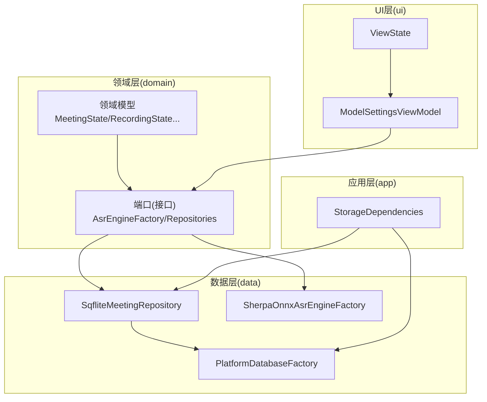
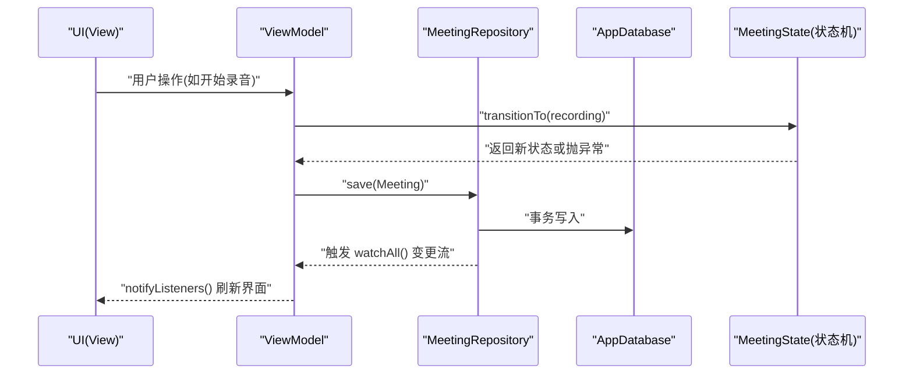
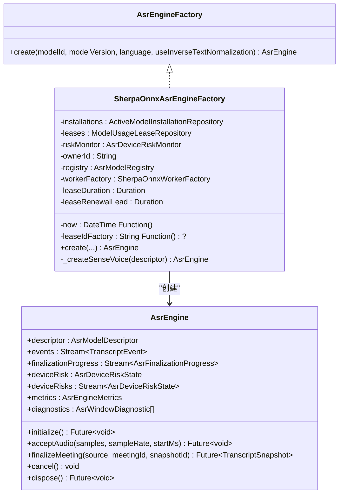
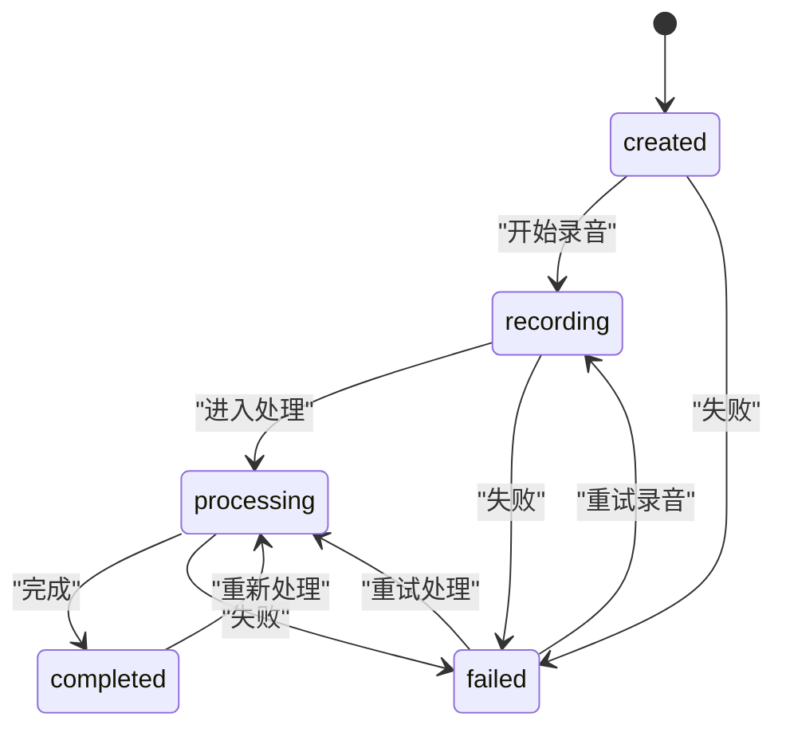
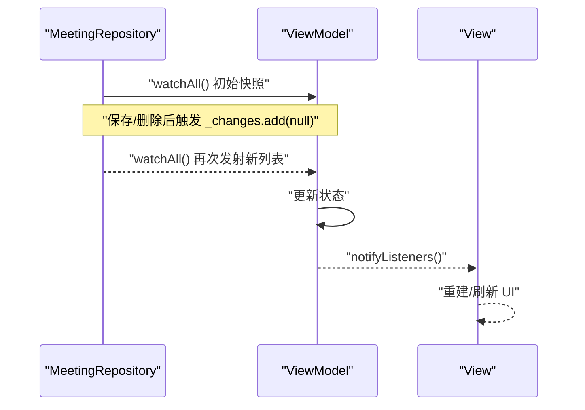
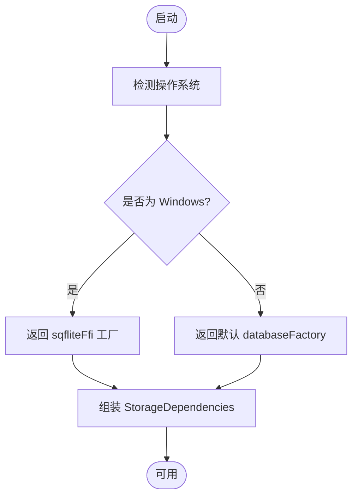
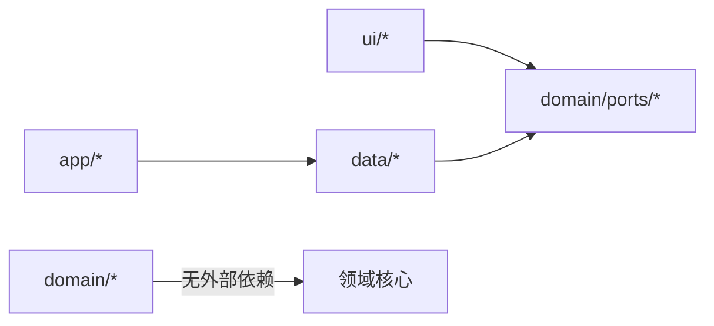

# 设计模式

<cite>
**本文引用的文件**   
- [workflow_states.dart](file://lib/domain/models/workflow_states.dart)
- [asr_engine.dart](file://lib/domain/ports/asr_engine.dart)
- [sherpa_onnx_asr_engine_factory.dart](file://lib/data/services/asr/sherpa_onnx_asr_engine_factory.dart)
- [repositories.dart](file://lib/domain/ports/repositories.dart)
- [sqflite_meeting_repository.dart](file://lib/data/repositories/sqflite_meeting_repository.dart)
- [platform_database_factory.dart](file://lib/data/services/storage/platform_database_factory.dart)
- [meettrace_storage_dependencies.dart](file://lib/app/meettrace_storage_dependencies.dart)
- [view_state.dart](file://lib/ui/core/view_state.dart)
- [model_settings_view_model.dart](file://lib/ui/features/settings/view_models/model_settings_view_model.dart)
- [meeting_list_view_model_test.dart](file://test/ui/features/meetings/view_models/list/meeting_list_view_model_test.dart)
</cite>

## 目录
1. [简介](#简介)
2. [项目结构](#项目结构)
3. [核心组件](#核心组件)
4. [架构总览](#架构总览)
5. [详细组件分析](#详细组件分析)
6. [依赖关系分析](#依赖关系分析)
7. [性能考量](#性能考量)
8. [故障排查指南](#故障排查指南)
9. [结论](#结论)
10. [附录](#附录)

## 简介
本文件系统化梳理会迹项目在代码中实际使用的设计模式，重点覆盖：
- 工厂模式：ASR 引擎工厂（按模型注册与锁定创建具体引擎）
- 状态机模式：Meeting/Recording/Processing/ModelInstallation 状态管理（严格的状态转换规则）
- 观察者模式：数据监听（Repository 通过 Stream 推送变更，ViewModel 订阅并驱动 UI）
- 策略模式：存储后端选择（平台数据库工厂、不同 Repository 实现）

文档同时给出模式的应用场景、实现方式与优势，并通过流程图与时序图展示关键流程。为避免泄露实现细节，所有代码示例均以“源码路径+行号”的形式引用。

## 项目结构
本项目采用分层架构：
- domain：领域模型、端口（接口）、用例
- data：仓储实现、服务、平台适配
- ui：视图与 ViewModel（状态管理与展示逻辑）
- app：应用装配与生命周期

图表来源 
- [workflow_states.dart:1-204](file://lib/domain/models/workflow_states.dart#L1-L204)
- [repositories.dart:1-105](file://lib/domain/ports/repositories.dart#L1-L105)
- [sqflite_meeting_repository.dart:1-62](file://lib/data/repositories/sqflite_meeting_repository.dart#L1-L62)
- [platform_database_factory.dart:1-17](file://lib/data/services/storage/platform_database_factory.dart#L1-L17)
- [sherpa_onnx_asr_engine_factory.dart:1-120](file://lib/data/services/asr/sherpa_onnx_asr_engine_factory.dart#L1-L120)
- [view_state.dart:1-25](file://lib/ui/core/view_state.dart#L1-L25)
- [meettrace_storage_dependencies.dart:1-116](file://lib/app/meettrace_storage_dependencies.dart#L1-L116)

章节来源
- [workflow_states.dart:1-204](file://lib/domain/models/workflow_states.dart#L1-L204)
- [repositories.dart:1-105](file://lib/domain/ports/repositories.dart#L1-L105)
- [sqflite_meeting_repository.dart:1-62](file://lib/data/repositories/sqflite_meeting_repository.dart#L1-L62)
- [platform_database_factory.dart:1-17](file://lib/data/services/storage/platform_database_factory.dart#L1-L17)
- [sherpa_onnx_asr_engine_factory.dart:1-120](file://lib/data/services/asr/sherpa_onnx_asr_engine_factory.dart#L1-L120)
- [view_state.dart:1-25](file://lib/ui/core/view_state.dart#L1-L25)
- [meettrace_storage_dependencies.dart:1-116](file://lib/app/meettrace_storage_dependencies.dart#L1-L116)

## 核心组件
- ASR 引擎工厂：根据已锁定的模型 ID/版本与配置，创建具体的 AsrEngine 实例，不读取全局默认值、不做回退。
- 状态机：Meeting/Recording/Processing/ModelInstallation 四类枚举状态，配合扩展方法强制合法转换，非法转换抛出异常。
- 观察者：Repository 暴露 watchAll() 返回 Stream，保存/删除后触发变更事件；ViewModel 订阅并通知 UI。
- 策略：PlatformDatabaseFactory 在不同平台返回不同的 DatabaseFactory；StorageDependencies 组装各 Repository 实现。

章节来源
- [sherpa_onnx_asr_engine_factory.dart:1-120](file://lib/data/services/asr/sherpa_onnx_asr_engine_factory.dart#L1-L120)
- [workflow_states.dart:1-204](file://lib/domain/models/workflow_states.dart#L1-L204)
- [repositories.dart:1-105](file://lib/domain/ports/repositories.dart#L1-L105)
- [sqflite_meeting_repository.dart:1-62](file://lib/data/repositories/sqflite_meeting_repository.dart#L1-L62)
- [platform_database_factory.dart:1-17](file://lib/data/services/storage/platform_database_factory.dart#L1-L17)
- [meettrace_storage_dependencies.dart:1-116](file://lib/app/meettrace_storage_dependencies.dart#L1-L116)

## 架构总览
下图展示了从 UI 到领域、再到数据层的调用链，以及状态机与观察者的协作方式。

图表来源 
- [model_settings_view_model.dart:120-161](file://lib/ui/features/settings/view_models/model_settings_view_model.dart#L120-L161)
- [sqflite_meeting_repository.dart:33-52](file://lib/data/repositories/sqflite_meeting_repository.dart#L33-L52)
- [workflow_states.dart:45-78](file://lib/domain/models/workflow_states.dart#L45-L78)

章节来源
- [model_settings_view_model.dart:120-161](file://lib/ui/features/settings/view_models/model_settings_view_model.dart#L120-L161)
- [sqflite_meeting_repository.dart:33-52](file://lib/data/repositories/sqflite_meeting_repository.dart#L33-L52)
- [workflow_states.dart:45-78](file://lib/domain/models/workflow_states.dart#L45-L78)

## 详细组件分析

### 工厂模式：ASR 引擎工厂
应用场景
- 在会议开始前，依据已确认并锁定的模型 ID/版本与语言等配置，创建对应的 AsrEngine 实例。
- 工厂仅做校验与组装，不持有 UI 状态，也不做回退。

实现要点
- 通过 AsrModelRegistry 校验 modelId/version/language/ITN 配置是否匹配。
- 校验通过后，查询安装信息并构造 SenseVoiceAsrEngine。
- 失败时抛出结构化异常，包含错误码与用户可恢复动作提示。

图表来源 
- [asr_engine.dart:134-174](file://lib/domain/ports/asr_engine.dart#L134-L174)
- [sherpa_onnx_asr_engine_factory.dart:1-120](file://lib/data/services/asr/sherpa_onnx_asr_engine_factory.dart#L1-L120)

章节来源
- [asr_engine.dart:134-174](file://lib/domain/ports/asr_engine.dart#L134-L174)
- [sherpa_onnx_asr_engine_factory.dart:1-120](file://lib/data/services/asr/sherpa_onnx_asr_engine_factory.dart#L1-L120)

### 状态机模式：Meeting/Recording/Processing/ModelInstallation
应用场景
- 会议生命周期、录音过程、后台处理任务、模型安装流程均存在严格的顺序约束，需以状态机保证合法性。

实现要点
- 使用枚举表示状态，扩展 canTransitionTo/transitionTo 定义允许转移。
- 非法转移抛出 InvalidStateTransitionException，便于上层捕获与提示。

图表来源 
- [workflow_states.dart:1-204](file://lib/domain/models/workflow_states.dart#L1-L204)

章节来源
- [workflow_states.dart:1-204](file://lib/domain/models/workflow_states.dart#L1-L204)

### 观察者模式：数据监听（Repository → ViewModel → UI）
应用场景
- 列表页需要实时反映会议的增删改；设置页需要响应模型安装状态变化。

实现要点
- Repository 暴露 watchAll() 返回 Stream，内部通过 StreamController.broadcast() 广播变更。
- ViewModel 订阅仓库流，收到变更后更新本地状态并 notifyListeners() 驱动 UI。
- ViewState<T> 统一表达加载、数据、错误三种视图状态。

图表来源 
- [sqflite_meeting_repository.dart:33-52](file://lib/data/repositories/sqflite_meeting_repository.dart#L33-L52)
- [model_settings_view_model.dart:120-161](file://lib/ui/features/settings/view_models/model_settings_view_model.dart#L120-L161)
- [view_state.dart:1-25](file://lib/ui/core/view_state.dart#L1-L25)

章节来源
- [sqflite_meeting_repository.dart:33-52](file://lib/data/repositories/sqflite_meeting_repository.dart#L33-L52)
- [model_settings_view_model.dart:120-161](file://lib/ui/features/settings/view_models/model_settings_view_model.dart#L120-L161)
- [view_state.dart:1-25](file://lib/ui/core/view_state.dart#L1-L25)

### 策略模式：存储后端选择
应用场景
- 不同平台（Windows/其他）对 SQLite 的初始化与工厂不同，需在运行时选择合适策略。

实现要点
- PlatformDatabaseFactory 根据操作系统返回不同的 DatabaseFactory。
- StorageDependencies 在启动时组装所有 Repository 实现，统一对外提供抽象接口。

图表来源 
- [platform_database_factory.dart:1-17](file://lib/data/services/storage/platform_database_factory.dart#L1-L17)
- [meettrace_storage_dependencies.dart:40-87](file://lib/app/meettrace_storage_dependencies.dart#L40-L87)

章节来源
- [platform_database_factory.dart:1-17](file://lib/data/services/storage/platform_database_factory.dart#L1-L17)
- [meettrace_storage_dependencies.dart:40-87](file://lib/app/meettrace_storage_dependencies.dart#L40-L87)

### 模式组合最佳实践与注意事项
- 工厂 + 状态机：在创建 ASR 引擎前，确保 Meeting 已进入 recording 状态，避免非法状态下的资源初始化。
- 观察者 + 状态机：状态变更应优先于数据变更，先 transitionTo，再持久化并广播，保证 UI 一致性。
- 策略 + 装配：将平台差异收敛在工厂/装配层，业务层只依赖抽象接口，降低耦合。
- 错误处理：状态机非法转移抛出明确异常；工厂失败返回带 code/context 的结构化异常，便于 UI 提示与引导。
- 资源管理：Repository 的 StreamController 需要在 dispose 时关闭；ViewModel 应在路由离开时释放订阅。

[本节为通用指导，不直接分析具体文件]

## 依赖关系分析
- 领域层仅依赖自身模型与端口，不反向依赖 data/ui。
- data 层实现 domain 端口，屏蔽平台差异（SQLite 工厂）。
- ui 层依赖 domain 端口与 ViewState，不直接访问 data 实现。

图表来源 
- [repositories.dart:1-105](file://lib/domain/ports/repositories.dart#L1-L105)
- [meettrace_storage_dependencies.dart:1-116](file://lib/app/meettrace_storage_dependencies.dart#L1-L116)

章节来源
- [repositories.dart:1-105](file://lib/domain/ports/repositories.dart#L1-L105)
- [meettrace_storage_dependencies.dart:1-116](file://lib/app/meettrace_storage_dependencies.dart#L1-L116)

## 性能考量
- 状态机：O(1) 判断与切换，适合高频调用。
- 观察者：使用 broadcast Stream 减少重复订阅成本；批量更新时合并多次 emit。
- 工厂：校验与查找集中在 registry，避免重复解析；延迟初始化引擎资源。
- 策略：平台差异化仅在启动时选择一次，后续无额外开销。

[本节为通用指导，不直接分析具体文件]

## 故障排查指南
- 状态非法转换：检查 transitionTo 调用顺序与前置条件，捕获 InvalidStateTransitionException 定位问题。
- 工厂创建失败：核对 modelId/version/language/ITN 是否与注册表一致；查看错误码与上下文诊断信息。
- 观察者未触发：确认 save/delete 后是否调用了变更通知；检查 StreamController 是否被提前关闭。
- 平台数据库异常：确认 createPlatformDatabaseFactory 是否正确初始化 FFI；检查路径与权限。

章节来源
- [workflow_states.dart:27-43](file://lib/domain/models/workflow_states.dart#L27-L43)
- [sherpa_onnx_asr_engine_factory.dart:101-120](file://lib/data/services/asr/sherpa_onnx_asr_engine_factory.dart#L101-L120)
- [sqflite_meeting_repository.dart:54-61](file://lib/data/repositories/sqflite_meeting_repository.dart#L54-L61)
- [platform_database_factory.dart:1-17](file://lib/data/services/storage/platform_database_factory.dart#L1-L17)

## 结论
会迹项目通过工厂、状态机、观察者与策略四大模式的组合，实现了高内聚、低耦合、可扩展且易于测试的架构。状态机保障业务流程正确性，工厂隔离引擎创建复杂度，观察者解耦数据与展示，策略屏蔽平台差异。遵循本文的最佳实践与注意事项，可在保持清晰边界的同时快速演进功能。

[本节为总结，不直接分析具体文件]

## 附录
- 参考测试用例中的 Repository 模拟与事件发射，有助于理解观察者模式在测试中的使用方式。

章节来源
- [meeting_list_view_model_test.dart:145-194](file://test/ui/features/meetings/view_models/list/meeting_list_view_model_test.dart#L145-L194)