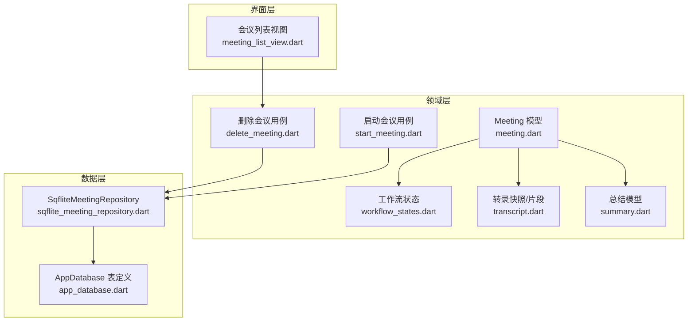
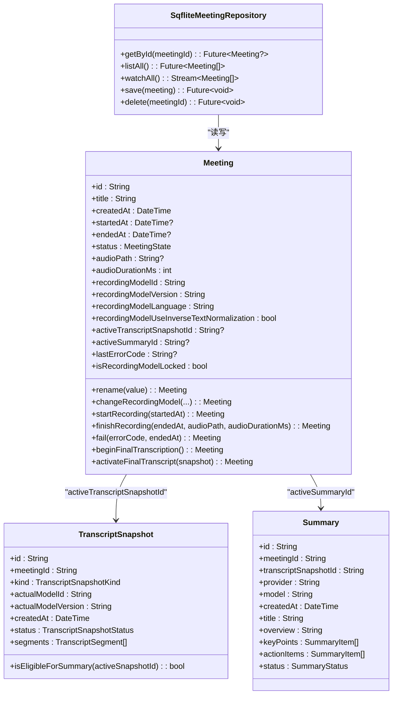
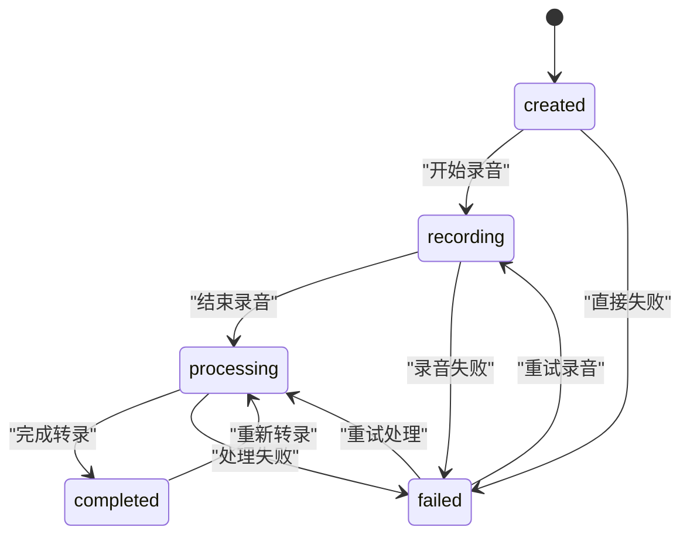
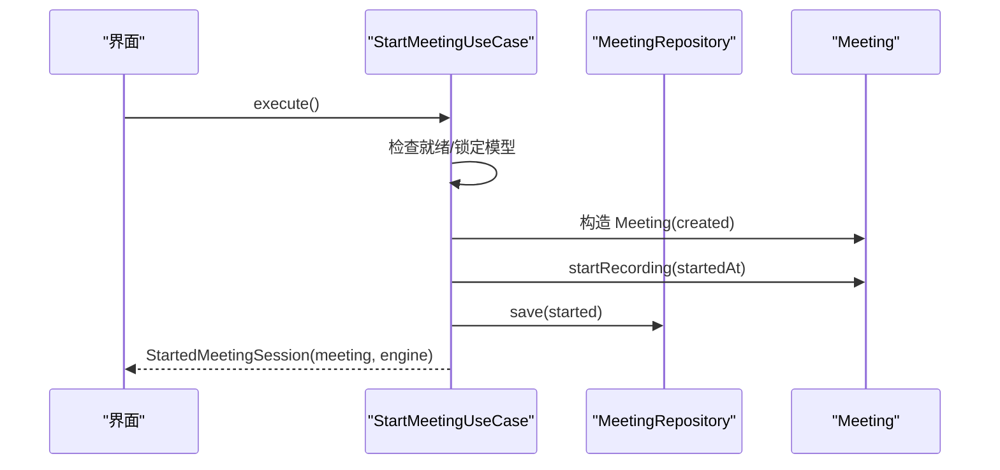
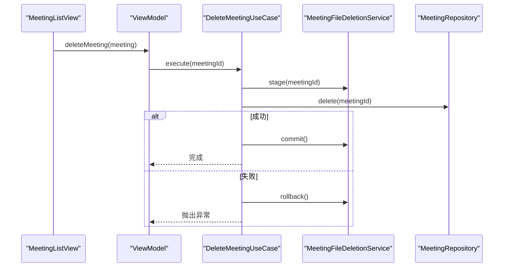
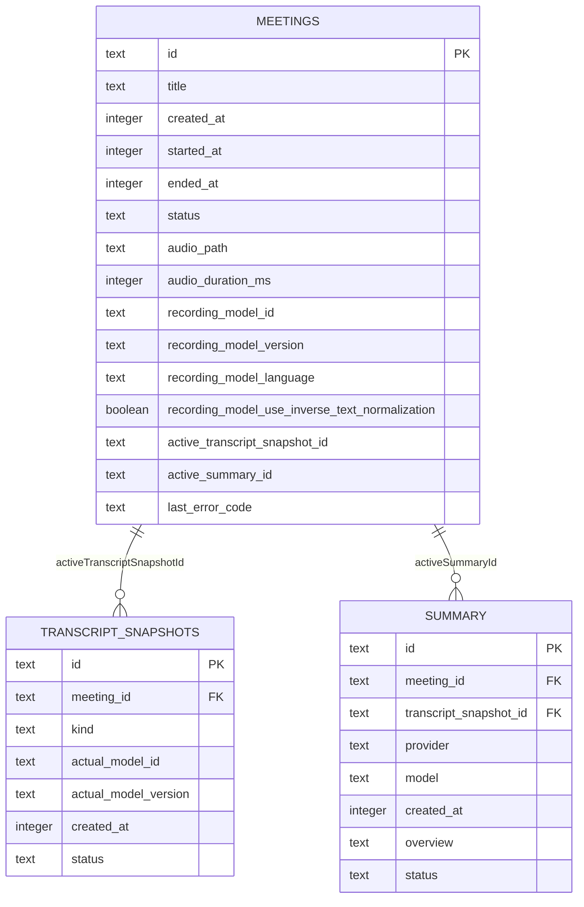
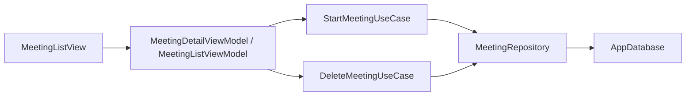

# 会议管理系统

<cite>
**本文引用的文件**   
- [lib/domain/models/meeting.dart](file://lib/domain/models/meeting.dart)
- [lib/domain/models/workflow_states.dart](file://lib/domain/models/workflow_states.dart)
- [lib/domain/models/transcript.dart](file://lib/domain/models/transcript.dart)
- [lib/domain/models/summary.dart](file://lib/domain/models/summary.dart)
- [lib/domain/use_cases/start_meeting.dart](file://lib/domain/use_cases/start_meeting.dart)
- [lib/domain/use_cases/delete_meeting.dart](file://lib/domain/use_cases/delete_meeting.dart)
- [lib/data/repositories/sqflite_meeting_repository.dart](file://lib/data/repositories/sqflite_meeting_repository.dart)
- [lib/data/services/storage/app_database.dart](file://lib/data/services/storage/app_database.dart)
- [lib/ui/features/meetings/views/list/meeting_list_view.dart](file://lib/ui/features/meetings/views/list/meeting_list_view.dart)
- [test/domain/models/meeting_test.dart](file://test/domain/models/meeting_test.dart)
- [test/domain/models/workflow_states_test.dart](file://test/domain/models/workflow_states_test.dart)
- [test/architecture/legacy_schema_guard_test.dart](file://test/architecture/legacy_schema_guard_test.dart)
</cite>

## 更新摘要
**已进行的更改**
- Meeting 模型简化：移除了 `requestedModelId`、`modelFallbackReason` 等模型选择和回退相关字段
- 数据库架构清理：移除了遗留的模型选择列，只保留实际的录音模型信息
- 状态机优化：简化了模型锁定逻辑，专注于单一录音模型的使用
- 测试保护：添加了架构守卫测试，防止遗留字段重新引入

## 目录
1. [引言](#引言)
2. [项目结构](#项目结构)
3. [核心组件](#核心组件)
4. [架构总览](#架构总览)
5. [详细组件分析](#详细组件分析)
6. [依赖关系分析](#依赖关系分析)
7. [性能考量](#性能考量)
8. [故障排查指南](#故障排查指南)
9. [结论](#结论)
10. [附录：使用示例与最佳实践](#附录使用示例与最佳实践)

## 引言
本文件面向会迹项目的"会议管理系统"，聚焦 Meeting 模型的设计、状态机实现、生命周期管理、CRUD 接口以及与音频文件、转录结果、总结的关联关系。**最新更新**：Meeting 模型已简化为单模型基线，移除了复杂的模型选择和回退机制，现在只关注实际录音模型的使用，大幅降低了系统复杂度。

## 项目结构
围绕会议管理的核心代码分布在领域层（domain）、数据层（data）与界面层（ui）：
- 领域层：Meeting 模型、状态枚举与转换、转录与总结模型、用例（启动会议、删除会议等）。
- 数据层：SQLite 仓库与数据库表定义，负责持久化与级联删除。
- 界面层：列表页删除交互入口，驱动用例执行。

**图表来源** 
- [lib/domain/models/meeting.dart:1-211](file://lib/domain/models/meeting.dart#L1-L211)
- [lib/domain/models/workflow_states.dart:1-204](file://lib/domain/models/workflow_states.dart#L1-L204)
- [lib/domain/models/transcript.dart:1-133](file://lib/domain/models/transcript.dart#L1-L133)
- [lib/domain/models/summary.dart:1-80](file://lib/domain/models/summary.dart#L1-L80)
- [lib/domain/use_cases/start_meeting.dart:1-91](file://lib/domain/use_cases/start_meeting.dart#L1-L91)
- [lib/domain/use_cases/delete_meeting.dart:1-39](file://lib/domain/use_cases/delete_meeting.dart#L1-L39)
- [lib/data/repositories/sqflite_meeting_repository.dart:1-62](file://lib/data/repositories/sqflite_meeting_repository.dart#L1-L62)
- [lib/data/services/storage/app_database.dart:88-128](file://lib/data/services/storage/app_database.dart#L88-L128)
- [lib/ui/features/meetings/views/list/meeting_list_view.dart:109-149](file://lib/ui/features/meetings/views/list/meeting_list_view.dart#L109-L149)

**章节来源**
- [lib/domain/models/meeting.dart:1-211](file://lib/domain/models/meeting.dart#L1-L211)
- [lib/data/repositories/sqflite_meeting_repository.dart:1-62](file://lib/data/repositories/sqflite_meeting_repository.dart#L1-L62)
- [lib/data/services/storage/app_database.dart:88-128](file://lib/data/services/storage/app_database.dart#L88-L128)
- [lib/ui/features/meetings/views/list/meeting_list_view.dart:109-149](file://lib/ui/features/meetings/views/list/meeting_list_view.dart#L109-L149)

## 核心组件
- **Meeting 模型**：不可变值对象，封装会议元数据、录音参数、活动快照与摘要引用、错误码等；提供 rename、changeRecordingModel、startRecording、finishRecording、fail、beginFinalTranscription、activateFinalTranscript 等方法，保证状态与不变量。**重要更新**：模型已简化，移除了模型选择和回退相关字段，只保留实际的录音模型信息。
- 工作流状态：MeetingState、RecordingState、ProcessingState、ModelInstallationState 及其转换规则，统一通过 transitionTo/canTransitionTo 控制。
- 转录与总结：TranscriptSnapshot/Segment 描述最终或临时转录及片段；Summary/SummaryItem/SummaryEvidence 描述结构化总结与证据。
- 用例：StartMeetingUseCase 校验就绪、锁定模型、创建并保存 Meeting；DeleteMeetingUseCase 确保不在录音/处理中，分阶段删除文件与数据库记录。
- 仓储与存储：SqfliteMeetingRepository 提供 CRUD 与流式监听；AppDatabase 定义 meetings、transcript_snapshots、transcript_segments、summaries、summary_items 等表及外键约束。

**章节来源**
- [lib/domain/models/meeting.dart:1-211](file://lib/domain/models/meeting.dart#L1-L211)
- [lib/domain/models/workflow_states.dart:1-204](file://lib/domain/models/workflow_states.dart#L1-L204)
- [lib/domain/models/transcript.dart:1-133](file://lib/domain/models/transcript.dart#L1-L133)
- [lib/domain/models/summary.dart:1-80](file://lib/domain/models/summary.dart#L1-L80)
- [lib/domain/use_cases/start_meeting.dart:1-91](file://lib/domain/use_cases/start_meeting.dart#L1-L91)
- [lib/domain/use_cases/delete_meeting.dart:1-39](file://lib/domain/use_cases/delete_meeting.dart#L1-L39)
- [lib/data/repositories/sqflite_meeting_repository.dart:1-62](file://lib/data/repositories/sqflite_meeting_repository.dart#L1-L62)
- [lib/data/services/storage/app_database.dart:88-128](file://lib/data/services/storage/app_database.dart#L88-L128)

## 架构总览
会议系统采用分层架构：UI 调用用例，用例协调领域模型与仓储，仓储对接 SQLite。Meeting 作为领域核心，承载状态机与业务不变量；转录与总结作为派生数据，通过外键与会议强关联。**架构简化**：移除了复杂的模型选择机制，专注于单一录音模型的稳定使用。

**图表来源** 
- [lib/domain/models/meeting.dart:1-211](file://lib/domain/models/meeting.dart#L1-L211)
- [lib/domain/models/transcript.dart:1-133](file://lib/domain/models/transcript.dart#L1-L133)
- [lib/domain/models/summary.dart:1-80](file://lib/domain/models/summary.dart#L1-L80)
- [lib/data/repositories/sqflite_meeting_repository.dart:1-62](file://lib/data/repositories/sqflite_meeting_repository.dart#L1-L62)

## 详细组件分析

### Meeting 模型设计与字段语义
- 标识与时间：id、title、createdAt、startedAt、endedAt。
- 状态：status（MeetingState），用于驱动生命周期。
- 音频：audioPath、audioDurationMs，封存的"事实音频"路径与时长。
- **简化的模型信息**：recordingModelId、recordingModelVersion、recordingModelLanguage、recordingModelUseInverseTextNormalization。**重要更新**：移除了 requestedModelId、modelFallbackReason 等复杂字段，只保留实际使用的录音模型信息。
- 活动数据：activeTranscriptSnapshotId、activeSummaryId，指向当前生效的转录快照与总结。
- 错误：lastErrorCode，记录最近一次失败原因。

关键不变量与约束：
- 时间顺序：startedAt ≥ createdAt，endedAt > startedAt。
- 音频有效性：finishRecording 要求 audioPath 非空且 audioDurationMs ≥ 0。
- 标题与文本字段：不允许空白字符串。
- **模型锁定**：录音开始后不能修改录音模型参数。

方法职责：
- rename：规范化标题并返回新实例。
- changeRecordingModel：仅在 created 状态允许修改录音模型参数。
- startRecording：进入 recording，记录开始时间。
- finishRecording：结束录音，写入事实音频信息与时长，进入 processing。
- fail：记录错误码与结束时间，进入 failed。
- beginFinalTranscription：从 processing/completed/failed 进入 processing，要求存在完整事实音频。
- activateFinalTranscript：仅当处于 processing 且传入快照为已完成最终转录时，激活并进入 completed，清空旧摘要与错误码。

**章节来源**
- [lib/domain/models/meeting.dart:1-211](file://lib/domain/models/meeting.dart#L1-L211)
- [test/domain/models/meeting_test.dart:1-165](file://test/domain/models/meeting_test.dart#L1-L165)

### 状态机与转换规则
MeetingState 包含 created、recording、processing、completed、failed。转换规则由 extension 提供 canTransitionTo/transitionTo，非法转换抛出 InvalidStateTransitionException。

典型路径：
- created → recording → processing → completed
- created → failed
- recording → failed
- processing → failed
- completed → processing（重新转录）
- failed → recording 或 processing（重试）

录音与处理过程还分别有 RecordingState 与 ProcessingState 的状态机，用于更细粒度的流程控制。

**图表来源** 
- [lib/domain/models/workflow_states.dart:1-78](file://lib/domain/models/workflow_states.dart#L1-L78)
- [test/domain/models/workflow_states_test.dart:1-43](file://test/domain/models/workflow_states_test.dart#L1-L43)

**章节来源**
- [lib/domain/models/workflow_states.dart:1-204](file://lib/domain/models/workflow_states.dart#L1-L204)
- [test/domain/models/workflow_states_test.dart:1-43](file://test/domain/models/workflow_states_test.dart#L1-L43)

### 会议生命周期管理
- 创建与启动：StartMeetingUseCase 检查就绪、锁定模型、创建 Meeting 并立即 startRecording，保存到仓储后返回会话。
- 录音阶段：Meeting.startRecording 记录 startedAt 并进入 recording；支持暂停/继续/失败的录音子状态机。
- 结束录音：finishRecording 写入 endedAt、audioPath、audioDurationMs，进入 processing。
- 转录处理：beginFinalTranscription 进入 processing；activateFinalTranscript 激活最终快照并进入 completed。
- 失败恢复：fail 记录 lastErrorCode；可从 failed 回到 recording 或 processing 进行重试。

**图表来源** 
- [lib/domain/use_cases/start_meeting.dart:1-91](file://lib/domain/use_cases/start_meeting.dart#L1-L91)
- [lib/domain/models/meeting.dart:88-93](file://lib/domain/models/meeting.dart#L88-L93)

**章节来源**
- [lib/domain/use_cases/start_meeting.dart:1-91](file://lib/domain/use_cases/start_meeting.dart#L1-L91)
- [lib/domain/models/meeting.dart:88-158](file://lib/domain/models/meeting.dart#L88-L158)

### CRUD 操作接口
- 查询：MeetingRepository.getById、listAll、watchAll（流式更新）。
- 更新：Meeting.rename、changeRecordingModel（受状态限制）、以及通过用例触发的状态变更（如 startRecording、finishRecording、fail、beginFinalTranscription、activateFinalTranscript）。
- 删除：DeleteMeetingUseCase 在 UI 触发，先 stage 文件删除，再 delete 数据库记录；若数据库删除失败则 rollback 文件删除。

**图表来源** 
- [lib/ui/features/meetings/views/list/meeting_list_view.dart:109-149](file://lib/ui/features/meetings/views/list/meeting_list_view.dart#L109-L149)
- [lib/domain/use_cases/delete_meeting.dart:1-39](file://lib/domain/use_cases/delete_meeting.dart#L1-L39)

**章节来源**
- [lib/data/repositories/sqflite_meeting_repository.dart:1-62](file://lib/data/repositories/sqflite_meeting_repository.dart#L1-L62)
- [lib/domain/use_cases/delete_meeting.dart:1-39](file://lib/domain/use_cases/delete_meeting.dart#L1-L39)
- [lib/ui/features/meetings/views/list/meeting_list_view.dart:109-149](file://lib/ui/features/meetings/views/list/meeting_list_view.dart#L109-L149)

### 与音频、转录、总结的关联关系
- 音频：Meeting.audioPath 与 audioDurationMs 指向封存的"事实音频"；finishRecording 强制要求有效值。
- 转录：Meeting.activeTranscriptSnapshotId 指向 TranscriptSnapshot；activateFinalTranscript 要求快照为 finalTranscript 且 complete。
- 总结：Meeting.activeSummaryId 指向 Summary；当新的最终快照激活时，旧摘要失效并被清空。

数据库层面通过外键约束与会话级联删除，确保一致性。

**图表来源** 
- [lib/data/services/storage/app_database.dart:60-79](file://lib/data/services/storage/app_database.dart#L60-L79)
- [lib/domain/models/meeting.dart:1-211](file://lib/domain/models/meeting.dart#L1-L211)
- [lib/domain/models/transcript.dart:1-133](file://lib/domain/models/transcript.dart#L1-L133)
- [lib/domain/models/summary.dart:1-80](file://lib/domain/models/summary.dart#L1-L80)

**章节来源**
- [lib/data/services/storage/app_database.dart:60-79](file://lib/data/services/storage/app_database.dart#L60-L79)
- [lib/domain/models/meeting.dart:1-211](file://lib/domain/models/meeting.dart#L1-L211)
- [lib/domain/models/transcript.dart:1-133](file://lib/domain/models/transcript.dart#L1-L133)
- [lib/domain/models/summary.dart:1-80](file://lib/domain/models/summary.dart#L1-L80)

## 依赖关系分析
- 领域内耦合：Meeting 依赖 workflow_states 与 transcript/summary 模型；方法通过状态机与不变量保证一致性。
- 用例与仓储：StartMeetingUseCase/ DeleteMeetingUseCase 依赖 MeetingRepository；仓储实现 SqfliteMeetingRepository 依赖 AppDatabase。
- UI 到用例：MeetingListView 通过 ViewModel 调用 DeleteMeetingUseCase，避免 UI 直接访问仓储。

**图表来源** 
- [lib/ui/features/meetings/views/list/meeting_list_view.dart:109-149](file://lib/ui/features/meetings/views/list/meeting_list_view.dart#L109-L149)
- [lib/domain/use_cases/start_meeting.dart:1-91](file://lib/domain/use_cases/start_meeting.dart#L1-L91)
- [lib/domain/use_cases/delete_meeting.dart:1-39](file://lib/domain/use_cases/delete_meeting.dart#L1-L39)
- [lib/data/repositories/sqflite_meeting_repository.dart:1-62](file://lib/data/repositories/sqflite_meeting_repository.dart#L1-L62)
- [lib/data/services/storage/app_database.dart:88-128](file://lib/data/services/storage/app_database.dart#L88-L128)

**章节来源**
- [lib/domain/use_cases/start_meeting.dart:1-91](file://lib/domain/use_cases/start_meeting.dart#L1-L91)
- [lib/domain/use_cases/delete_meeting.dart:1-39](file://lib/domain/use_cases/delete_meeting.dart#L1-L39)
- [lib/data/repositories/sqflite_meeting_repository.dart:1-62](file://lib/data/repositories/sqflite_meeting_repository.dart#L1-L62)

## 性能考量
- 不可变模型：Meeting 通过 _copyWith 生成新实例，避免共享可变状态导致的竞态与额外同步开销。
- 流式监听：仓储通过 Stream 推送变更，UI 按需订阅，减少轮询。
- 事务与级联：数据库操作使用事务与外键级联，降低不一致风险与清理成本。
- **简化的模型管理**：移除了复杂的模型选择和回退机制，减少了运行时决策开销和内存占用。
- 模型选择与初始化：启动会议前预检模型版本与可用性，避免运行时失败导致重复初始化。

## 故障排查指南
常见异常与定位要点：
- 非法状态转换：InvalidStateTransitionException，检查当前状态与目标状态是否符合 canTransitionTo。
- 域不变量违反：DomainInvariantViolation，例如尝试激活非最终或未完成的快照、无事实音频进行转录等。
- 参数校验失败：ArgumentError，如 audioPath 为空、时间区间非法、置信度越界等。
- 删除失败：DeleteMeetingUseCase 在数据库删除失败时会回滚文件删除，需检查仓储与文件系统权限。
- **模型锁定问题**：录音开始后尝试修改录音模型会抛出 InvalidStateTransitionException。

建议排查步骤：
- 确认 Meeting.status 与期望转换一致。
- 检查 audioPath 与 audioDurationMs 是否满足 finishRecording 要求。
- 验证 TranscriptSnapshot 的 kind 与 status 是否符合 activateFinalTranscript 条件。
- 查看 lastErrorCode 与日志定位失败环节。
- **检查模型锁定状态**：确认 isRecordingModelLocked 属性以判断是否可以修改录音模型。

**章节来源**
- [lib/domain/models/workflow_states.dart:27-43](file://lib/domain/models/workflow_states.dart#L27-L43)
- [lib/domain/models/meeting.dart:111-158](file://lib/domain/models/meeting.dart#L111-L158)
- [lib/domain/models/transcript.dart:1-133](file://lib/domain/models/transcript.dart#L1-L133)
- [lib/domain/use_cases/delete_meeting.dart:1-39](file://lib/domain/use_cases/delete_meeting.dart#L1-L39)

## 结论
Meeting 模型以不可变性与状态机为核心，结合仓储与用例实现了稳健的会议生命周期管理。**最新简化**：通过移除复杂的模型选择和回退机制，系统变得更加简洁和可靠。通过严格的不变量与外键约束，系统在录音、转录、总结等环节保证了数据一致性与可追溯性。UI 层通过用例驱动，提供了安全的删除与操作流程。整体设计清晰、可扩展性强，便于后续功能演进与问题定位。

## 附录：使用示例与最佳实践
- 启动会议
  - 调用 StartMeetingUseCase.execute，获取 StartedMeetingSession 中的 Meeting 与 AsrEngine。
  - 参考路径：[lib/domain/use_cases/start_meeting.dart:1-91](file://lib/domain/use_cases/start_meeting.dart#L1-L91)
- 重命名会议
  - 使用 Meeting.rename(newTitle)，返回新实例后通过 Repository.save 持久化。
  - 参考路径：[lib/domain/models/meeting.dart:60-64](file://lib/domain/models/meeting.dart#L60-L64)
- 删除会议
  - 通过 DeleteMeetingUseCase.execute(meetingId)，确保不在录音/处理中，分阶段删除文件与数据库记录。
  - 参考路径：[lib/domain/use_cases/delete_meeting.dart:1-39](file://lib/domain/use_cases/delete_meeting.dart#L1-L39)
- 查询会议
  - 使用 Repository.getById、listAll、watchAll 获取单条、全部与会话式更新。
  - 参考路径：[lib/data/repositories/sqflite_meeting_repository.dart:1-62](file://lib/data/repositories/sqflite_meeting_repository.dart#L1-L62)
- 状态转换与重试
  - 使用 transitionTo/canTransitionTo 安全切换状态；失败后可从 failed 回到 recording 或 processing。
  - 参考路径：[lib/domain/models/workflow_states.dart:1-78](file://lib/domain/models/workflow_states.dart#L1-L78)
- 激活最终转录
  - 调用 Meeting.activateFinalTranscript(snapshot)，要求 snapshot 为 finalTranscript 且 complete。
  - 参考路径：[lib/domain/models/meeting.dart:137-158](file://lib/domain/models/meeting.dart#L137-L158)
- **修改录音模型**
  - 使用 Meeting.changeRecordingModel(...)，仅在 created 状态允许修改。
  - 参考路径：[lib/domain/models/meeting.dart:66-86](file://lib/domain/models/meeting.dart#L66-L86)

最佳实践：
- 始终通过用例与仓储访问数据，避免跨层直连。
- 对状态转换使用 transitionTo，禁止直接赋值 status。
- 在 UI 层展示错误信息时，读取 lastErrorCode 与用例抛出的异常类型。
- 删除操作务必二次确认，并在失败时保留数据以便重试。
- **模型管理**：录音开始前可以修改录音模型，开始后自动锁定，避免运行时变更。
- **架构保护**：利用 legacy_schema_guard_test 防止遗留字段重新引入。

**章节来源**
- [lib/domain/use_cases/start_meeting.dart:1-91](file://lib/domain/use_cases/start_meeting.dart#L1-L91)
- [lib/domain/models/meeting.dart:60-86](file://lib/domain/models/meeting.dart#L60-L86)
- [lib/domain/use_cases/delete_meeting.dart:1-39](file://lib/domain/use_cases/delete_meeting.dart#L1-L39)
- [lib/data/repositories/sqflite_meeting_repository.dart:1-62](file://lib/data/repositories/sqflite_meeting_repository.dart#L1-L62)
- [lib/domain/models/workflow_states.dart:1-78](file://lib/domain/models/workflow_states.dart#L1-L78)
- [lib/domain/models/meeting.dart:137-158](file://lib/domain/models/meeting.dart#L137-L158)
- [test/architecture/legacy_schema_guard_test.dart:1-80](file://test/architecture/legacy_schema_guard_test.dart#L1-L80)