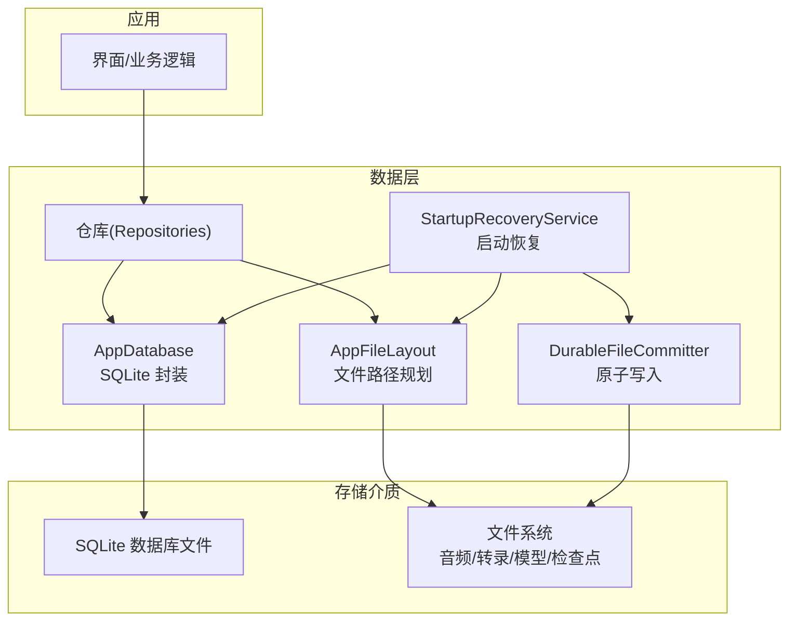
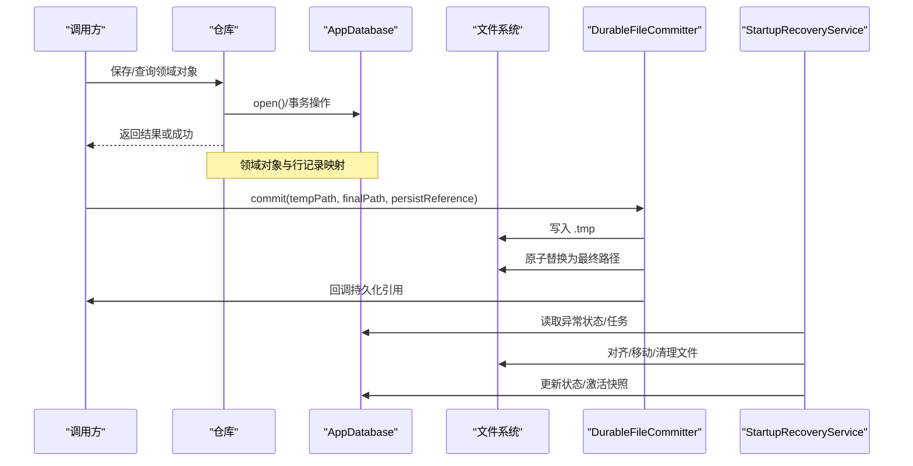
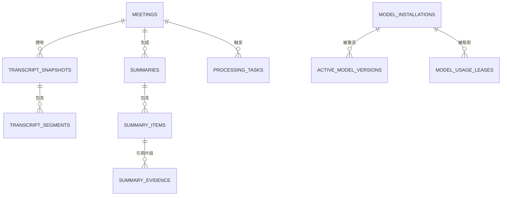
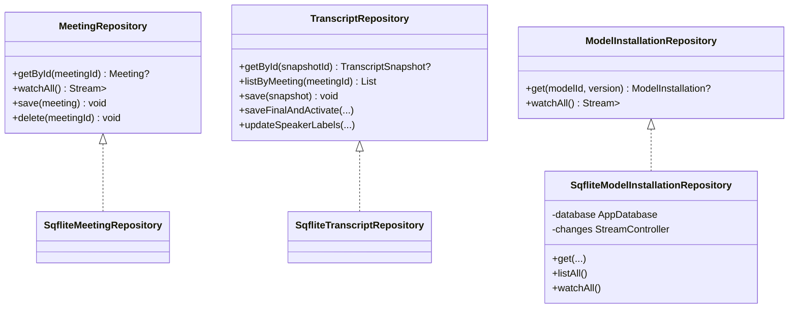
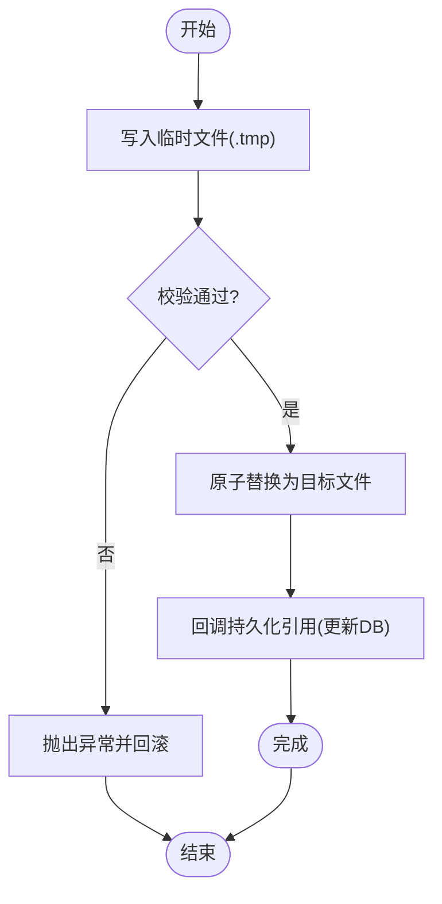
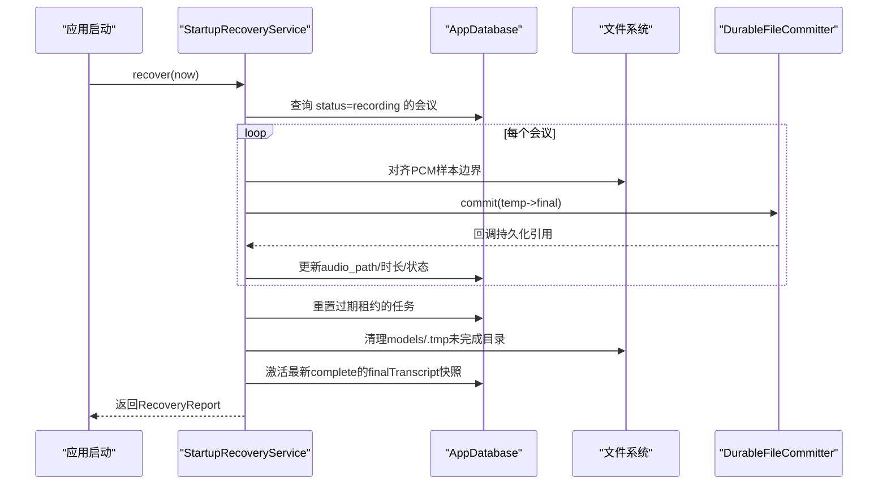
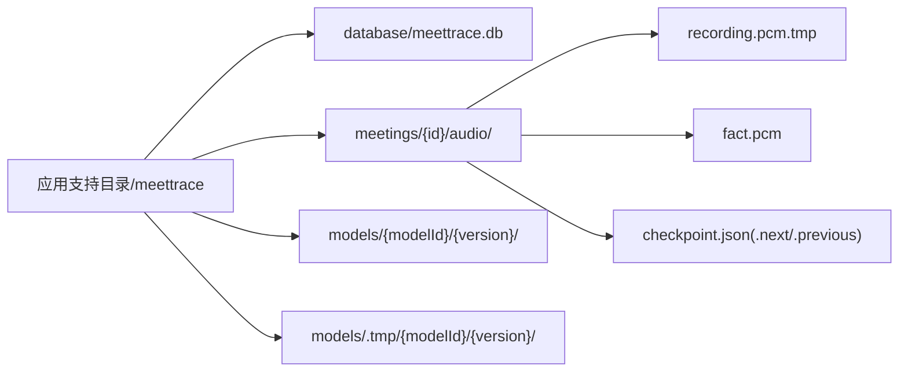
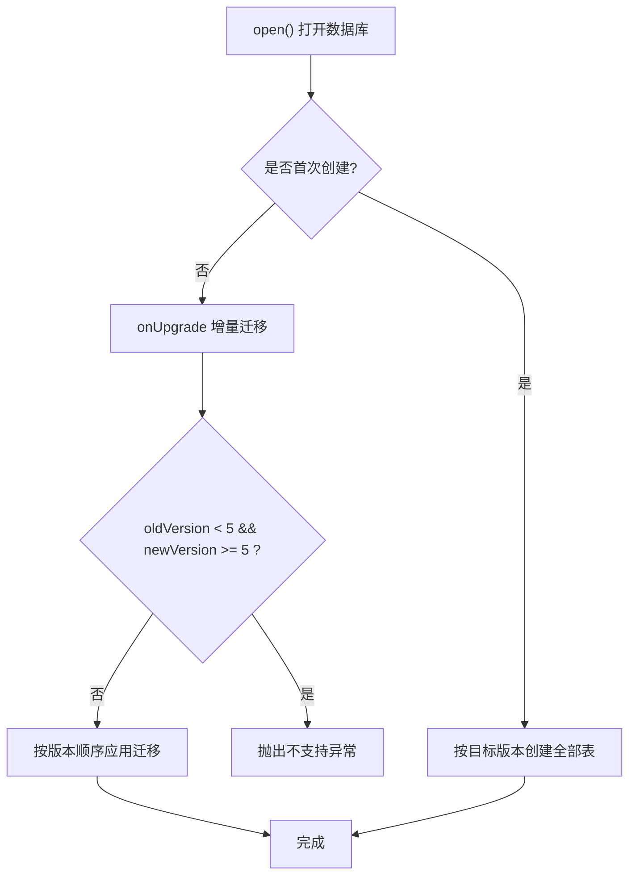
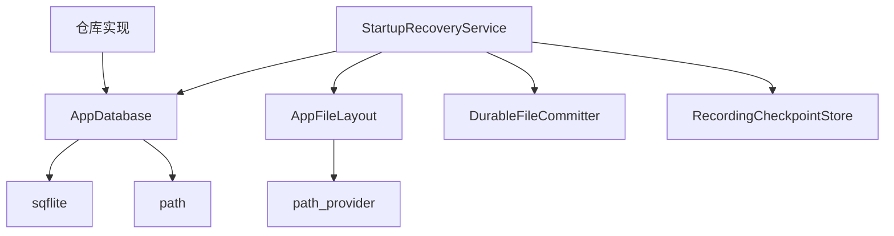

# 数据存储系统

<cite>
**本文引用的文件**   
- [app_database.dart](file://lib/data/services/storage/app_database.dart)
- [app_file_layout.dart](file://lib/data/services/storage/app_file_layout.dart)
- [startup_recovery_service.dart](file://lib/data/services/storage/startup_recovery_service.dart)
- [durable_file_committer.dart](file://lib/data/services/storage/durable_file_committer.dart)
- [repositories.dart](file://lib/domain/ports/repositories.dart)
- [sqflite_model_installation_repository.dart](file://lib/data/repositories/sqflite_model_installation_repository.dart)
- [app_database_test.dart](file://test/data/services/storage/app_database_test.dart)
- [startup_recovery_service_test.dart](file://test/data/services/storage/startup_recovery_service_test.dart)
</cite>

## 目录
1. [简介](#简介)
2. [项目结构](#项目结构)
3. [核心组件](#核心组件)
4. [架构总览](#架构总览)
5. [详细组件分析](#详细组件分析)
6. [依赖关系分析](#依赖关系分析)
7. [性能考量](#性能考量)
8. [故障排查指南](#故障排查指南)
9. [结论](#结论)
10. [附录](#附录)

## 简介
本文件面向会迹项目的数据存储系统，系统性阐述 SQLite 数据库设计、数据映射器实现、持久化文件提交器、启动恢复服务、文件存储策略、数据迁移机制以及备份与恢复、安全与隐私等主题。目标是帮助开发者与维护者快速理解并可靠地扩展本地数据层。

## 项目结构
数据存储相关代码集中在 lib/data/services/storage 与 lib/data/repositories 目录，领域接口定义在 lib/domain/ports。关键文件如下：
- 数据库入口与版本管理：AppDatabase
- 文件布局与路径生成：AppFileLayout
- 启动恢复服务：StartupRecoveryService
- 原子性文件提交：DurableFileCommitter
- 仓库接口与 Sqflite 实现：MeetingRepository、TranscriptRepository、ModelInstallationRepository 等

**图表来源** 
- [app_database.dart:1-53](file://lib/data/services/storage/app_database.dart#L1-L53)
- [app_file_layout.dart:1-77](file://lib/data/services/storage/app_file_layout.dart#L1-L77)
- [startup_recovery_service.dart:35-63](file://lib/data/services/storage/startup_recovery_service.dart#L35-L63)
- [durable_file_committer.dart](file://lib/data/services/storage/durable_file_committer.dart)

**章节来源**
- [app_database.dart:1-53](file://lib/data/services/storage/app_database.dart#L1-L53)
- [app_file_layout.dart:1-77](file://lib/data/services/storage/app_file_layout.dart#L1-L77)

## 核心组件
- AppDatabase：统一打开/关闭数据库，启用外键约束，定义多版本 schema 创建与升级流程，提供对外 Database 实例。
- AppFileLayout：集中管理数据库、会议音频、模型安装与临时目录的路径，保证路径片段安全。
- StartupRecoveryService：应用启动时扫描异常状态，修复录音残留、重置过期任务、清理不完整模型下载、激活已完成快照。
- DurableFileCommitter：以“先写 .tmp，再原子替换 + 持久化引用”的方式确保文件落盘一致性。
- 仓库接口与实现：MeetingRepository、TranscriptRepository、ModelInstallationRepository 等，将领域对象与数据库记录进行映射。

**章节来源**
- [app_database.dart:16-36](file://lib/data/services/storage/app_database.dart#L16-L36)
- [app_file_layout.dart:17-77](file://lib/data/services/storage/app_file_layout.dart#L17-L77)
- [startup_recovery_service.dart:35-63](file://lib/data/services/storage/startup_recovery_service.dart#L35-L63)
- [repositories.dart:8-55](file://lib/domain/ports/repositories.dart#L8-L55)
- [sqflite_model_installation_repository.dart:1-44](file://lib/data/repositories/sqflite_model_installation_repository.dart#L1-L44)

## 架构总览
数据流从上层调用仓库开始，仓库通过 AppDatabase 访问 SQLite，并通过 AppFileLayout 定位文件；启动恢复服务在应用启动阶段协调数据库与文件系统的一致性；文件提交器保障大文件（如 PCM）的原子落盘。

**图表来源** 
- [app_database.dart:16-36](file://lib/data/services/storage/app_database.dart#L16-L36)
- [startup_recovery_service.dart:49-63](file://lib/data/services/storage/startup_recovery_service.dart#L49-L63)
- [durable_file_committer.dart](file://lib/data/services/storage/durable_file_committer.dart)

## 详细组件分析

### SQLite 数据库设计与索引优化
- 表结构与关系
  - meetings：会议主表，包含标题、时间戳、状态、音频路径、时长、模型信息、活跃快照/摘要 ID 等。
  - transcript_snapshots：转录快照，关联 meeting_id，级联删除。
  - transcript_segments：片段明细，关联 snapshot_id，含时间范围校验。
  - summaries / summary_items / summary_evidence：摘要及其条目与证据，形成一对多与多对多关系。
  - model_installations：模型安装元数据，复合主键 (model_id, version)。
  - processing_tasks：处理任务队列，含租约过期字段用于并发控制。
  - app_settings：应用设置键值表。
  - active_model_versions：当前活跃模型版本。
  - model_usage_leases：模型使用租约，含过期时间校验。
- 索引设计
  - idx_snapshots_meeting：按会议与创建时间排序，加速列表查询。
  - idx_segments_snapshot：按快照与时间范围查询片段。
  - idx_tasks_state_lease：按状态与租约过期筛选可重试任务。
  - idx_model_usage_leases_active：按模型与过期时间筛选活跃租约。
- 约束与完整性
  - 全局开启外键约束 PRAGMA foreign_keys = ON。
  - CHECK 约束保证时长非负、时间区间合法、ITN 开关取值合法、租约时间顺序正确等。

**图表来源** 
- [app_database.dart:59-190](file://lib/data/services/storage/app_database.dart#L59-L190)

**章节来源**
- [app_database.dart:59-190](file://lib/data/services/storage/app_database.dart#L59-L190)
- [app_database.dart:192-228](file://lib/data/services/storage/app_database.dart#L192-L228)
- [app_database.dart:230-240](file://lib/data/services/storage/app_database.dart#L230-L240)

### 数据映射器（Dart 对象 ↔ 数据库记录）
- 仓库接口定义统一的领域模型存取契约，屏蔽底层 SQL 细节。
- 示例：SqfliteModelInstallationRepository 通过查询 model_installations 表并将行映射为 ModelInstallation 领域对象，支持 watchAll 流式监听。
- 其他仓库遵循相同模式：查询/插入/更新/删除，并在必要时维护缓存或流式变更通知。

**图表来源** 
- [repositories.dart:8-55](file://lib/domain/ports/repositories.dart#L8-L55)
- [sqflite_model_installation_repository.dart:11-44](file://lib/data/repositories/sqflite_model_installation_repository.dart#L11-L44)

**章节来源**
- [repositories.dart:8-55](file://lib/domain/ports/repositories.dart#L8-L55)
- [sqflite_model_installation_repository.dart:1-44](file://lib/data/repositories/sqflite_model_installation_repository.dart#L1-L44)

### 持久化文件提交器（原子性写入与错误恢复）
- 设计要点
  - 先写入临时文件（.tmp），成功后原子替换为目标文件，避免部分写入导致损坏。
  - 提供 persistReference 回调，在文件落盘后更新数据库引用（如 audio_path、时长）。
  - 失败时抛出 DurableFileCommitException，由上层捕获并标记失败状态。
- 典型用法
  - 启动恢复服务在崩溃恢复场景下，将 recording.pcm.tmp 对齐到完整样本边界后提交为 fact.pcm，并持久化检查点与会议状态。

**图表来源** 
- [startup_recovery_service.dart:82-114](file://lib/data/services/storage/startup_recovery_service.dart#L82-L114)
- [durable_file_committer.dart](file://lib/data/services/storage/durable_file_committer.dart)

**章节来源**
- [startup_recovery_service.dart:82-114](file://lib/data/services/storage/startup_recovery_service.dart#L82-L114)
- [durable_file_committer.dart](file://lib/data/services/storage/durable_file_committer.dart)

### 启动恢复服务（崩溃后数据完整性检查与自动修复）
- 功能清单
  - 录音恢复：查找处于 recording 状态的会议，对齐 PCM 样本边界，提交音频并更新状态为 processing。
  - 任务重置：将租约过期的 running 任务重置为 queued，允许重新调度。
  - 模型清理：删除 models/.tmp 下的未完成下载目录，防止磁盘污染。
  - 快照激活：若存在最新 complete 的 finalTranscript 快照且未激活，则激活并标记会议 completed。
- 输出报告：统计恢复成功/失败数、重置任务数、清理目录数、激活快照数。

**图表来源** 
- [startup_recovery_service.dart:49-63](file://lib/data/services/storage/startup_recovery_service.dart#L49-L63)
- [startup_recovery_service.dart:65-130](file://lib/data/services/storage/startup_recovery_service.dart#L65-L130)
- [startup_recovery_service.dart:156-171](file://lib/data/services/storage/startup_recovery_service.dart#L156-L171)
- [startup_recovery_service.dart:173-201](file://lib/data/services/storage/startup_recovery_service.dart#L173-L201)
- [startup_recovery_service.dart:203-240](file://lib/data/services/storage/startup_recovery_service.dart#L203-L240)

**章节来源**
- [startup_recovery_service.dart:35-63](file://lib/data/services/storage/startup_recovery_service.dart#L35-L63)
- [startup_recovery_service.dart:65-130](file://lib/data/services/storage/startup_recovery_service.dart#L65-L130)
- [startup_recovery_service.dart:156-171](file://lib/data/services/storage/startup_recovery_service.dart#L156-L171)
- [startup_recovery_service.dart:173-201](file://lib/data/services/storage/startup_recovery_service.dart#L173-L201)
- [startup_recovery_service.dart:203-240](file://lib/data/services/storage/startup_recovery_service.dart#L203-L240)

### 文件存储策略（音频、转录、模型组织与命名规范）
- 根目录：application support/meettrace
- 数据库：database/meettrace.db
- 会议：meetings/{meetingId}/audio/
  - recording.pcm.tmp：录音中临时 PCM 文件
  - fact.pcm：最终 PCM 文件
  - checkpoint.json / .next / .previous：录音检查点（原子切换）
- 模型：models/{modelId}/{version}/ 与 models/.tmp/{modelId}/{version}/
  - 下载过程写入 .tmp，完成后原子移动到正式目录
- 路径安全：所有路径片段经过 _safeSegment 校验，禁止危险字符与相对路径穿越

**图表来源** 
- [app_file_layout.dart:17-77](file://lib/data/services/storage/app_file_layout.dart#L17-L77)
- [app_file_layout.dart:79-90](file://lib/data/services/storage/app_file_layout.dart#L79-L90)

**章节来源**
- [app_file_layout.dart:17-77](file://lib/data/services/storage/app_file_layout.dart#L17-L77)
- [app_file_layout.dart:79-90](file://lib/data/services/storage/app_file_layout.dart#L79-L90)

### 数据迁移机制（版本升级与兼容性）
- 版本常量：schemaVersion = 5
- 初始化与升级
  - onCreate：按目标版本依次执行各版本建表脚本
  - onUpgrade：根据 oldVersion 与 newVersion 增量执行迁移
  - 特殊保护：当旧版本 < 5 且新 >= 5 时拒绝原地升级，抛出 UnsupportedAlphaInstallationException
- 历史迁移
  - v2：新增 app_settings 表
  - v3：新增 active_model_versions、model_usage_leases 及索引
  - v4：为 summaries 表添加 title 列（兼容已有数据）

**图表来源** 
- [app_database.dart:16-36](file://lib/data/services/storage/app_database.dart#L16-L36)
- [app_database.dart:46-57](file://lib/data/services/storage/app_database.dart#L46-L57)
- [app_database.dart:242-263](file://lib/data/services/storage/app_database.dart#L242-L263)
- [app_database.dart:266-271](file://lib/data/services/storage/app_database.dart#L266-L271)

**章节来源**
- [app_database.dart:46-57](file://lib/data/services/storage/app_database.dart#L46-L57)
- [app_database.dart:192-228](file://lib/data/services/storage/app_database.dart#L192-L228)
- [app_database.dart:230-240](file://lib/data/services/storage/app_database.dart#L230-L240)
- [app_database.dart:242-263](file://lib/data/services/storage/app_database.dart#L242-L263)
- [app_database.dart:266-271](file://lib/data/services/storage/app_database.dart#L266-L271)

### 数据库备份与恢复操作指南
- 备份
  - 停止应用或确保无写入后，复制 database/meettrace.db 至安全位置
  - 如需完整数据，同时备份 meetings 与 models 目录
- 恢复
  - 将备份的 meettrace.db 放回原路径
  - 启动应用，AppDatabase 将按 schemaVersion 校验并执行必要迁移
  - 若遇到 Alpha 基线限制（oldVersion < 5），需先导出重要内容后再清除数据重装

注意：上述步骤基于 AppDatabase 的 open/onCreate/onUpgrade 行为与测试用例中的预期。

**章节来源**
- [app_database.dart:16-36](file://lib/data/services/storage/app_database.dart#L16-L36)
- [app_database_test.dart:59-79](file://test/data/services/storage/app_database_test.dart#L59-L79)
- [app_database_test.dart:81-114](file://test/data/services/storage/app_database_test.dart#L81-L114)
- [app_database_test.dart:116-151](file://test/data/services/storage/app_database_test.dart#L116-L151)

### 数据安全与隐私保护措施
- 数据库层面
  - 强制开启外键约束，保证引用完整性
  - 使用 CHECK 约束限制非法值（时长、时间区间、开关取值、租约时间顺序）
- 文件系统层面
  - 路径片段安全校验，防止目录穿越与非法字符注入
  - 原子替换与检查点文件，降低部分写入导致的损坏风险
- 启动恢复
  - 自动修复不一致状态，减少用户感知到的数据丢失
  - 严格限定清理范围（仅 models/.tmp 内），避免误删

**章节来源**
- [app_database.dart:25-30](file://lib/data/services/storage/app_database.dart#L25-L30)
- [app_database.dart:59-190](file://lib/data/services/storage/app_database.dart#L59-L190)
- [app_file_layout.dart:79-90](file://lib/data/services/storage/app_file_layout.dart#L79-L90)
- [startup_recovery_service.dart:173-201](file://lib/data/services/storage/startup_recovery_service.dart#L173-L201)

## 依赖关系分析
- AppDatabase 依赖 sqflite 与 path，负责数据库生命周期与版本迁移
- AppFileLayout 依赖 path_provider 获取应用支持目录，并提供安全路径构造
- StartupRecoveryService 依赖 AppDatabase、AppFileLayout、DurableFileCommitter、RecordingCheckpointStore
- 仓库实现依赖 AppDatabase 与领域模型映射函数

**图表来源** 
- [app_database.dart:1-5](file://lib/data/services/storage/app_database.dart#L1-L5)
- [app_file_layout.dart:1-5](file://lib/data/services/storage/app_file_layout.dart#L1-L5)
- [startup_recovery_service.dart:1-11](file://lib/data/services/storage/startup_recovery_service.dart#L1-L11)

**章节来源**
- [app_database.dart:1-5](file://lib/data/services/storage/app_database.dart#L1-L5)
- [app_file_layout.dart:1-5](file://lib/data/services/storage/app_file_layout.dart#L1-L5)
- [startup_recovery_service.dart:1-11](file://lib/data/services/storage/startup_recovery_service.dart#L1-L11)

## 性能考量
- 索引优化
  - 针对高频查询建立复合索引（如快照按会议+时间、片段按快照+时间范围、任务按状态+租约过期）
- 事务与批量操作
  - 使用数据库事务包裹多次写入，减少 I/O 与锁竞争
- 文件 I/O
  - 使用原子替换与检查点文件，避免长耗时写入阻塞主线程
- 内存与资源
  - 合理控制 PCM 缓冲大小与采样对齐，避免不必要的大对象驻留

[本节为通用指导，不直接分析具体文件]

## 故障排查指南
- 无法打开数据库或升级失败
  - 检查 schemaVersion 与现有 user_version 是否匹配
  - 若旧版本 < 5，将抛出不支持异常，需先导出数据再重装
- 录音恢复失败
  - 确认 recording.pcm.tmp 是否存在且长度满足 PCM16 样本对齐
  - 查看 DurableFileCommitException 的错误码
- 任务卡住
  - 检查 processing_tasks 的 lease_expires_at 是否过期，启动恢复服务应已重置
- 模型下载中断
  - 清理 models/.tmp 下的未完成目录，重新启动下载

**章节来源**
- [app_database_test.dart:81-114](file://test/data/services/storage/app_database_test.dart#L81-L114)
- [app_database_test.dart:116-151](file://test/data/services/storage/app_database_test.dart#L116-L151)
- [startup_recovery_service_test.dart:49-65](file://test/data/services/storage/startup_recovery_service_test.dart#L49-L65)
- [startup_recovery_service.dart:116-127](file://lib/data/services/storage/startup_recovery_service.dart#L116-L127)

## 结论
会迹的数据存储系统围绕 AppDatabase、AppFileLayout、StartupRecoveryService 与 DurableFileCommitter 构建，形成了“强一致的文件落盘 + 严谨的数据库迁移 + 健壮的启动恢复”的闭环。通过合理的表结构、索引与约束，结合仓库层的清晰映射，系统在可靠性、可维护性与性能之间取得良好平衡。

## 附录
- 术语
  - 快照：一次转录结果的不可变记录
  - 检查点：记录录音进度与持久化字节数的元数据
  - 租约：并发控制模型使用的短期占用令牌
- 参考测试
  - 数据库迁移与兼容性验证：app_database_test.dart
  - 启动恢复覆盖四类残留场景：startup_recovery_service_test.dart

[本节为补充说明，不直接分析具体文件]