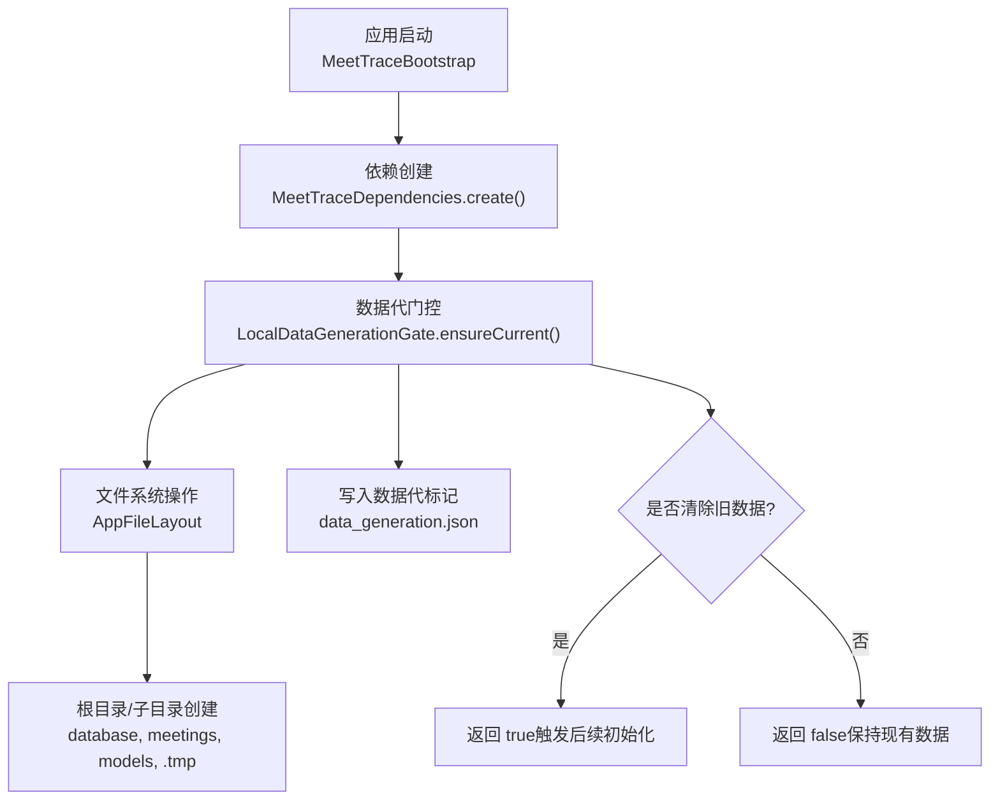
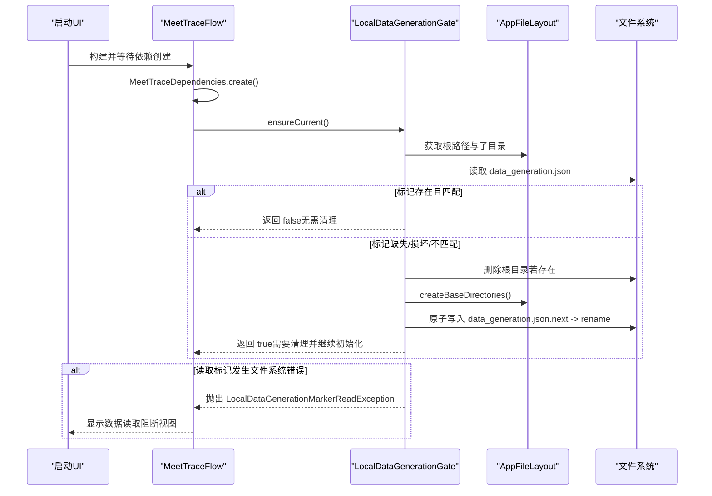
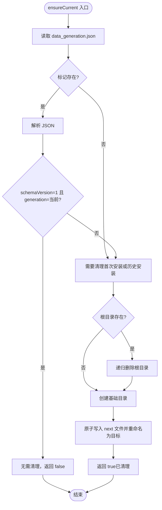
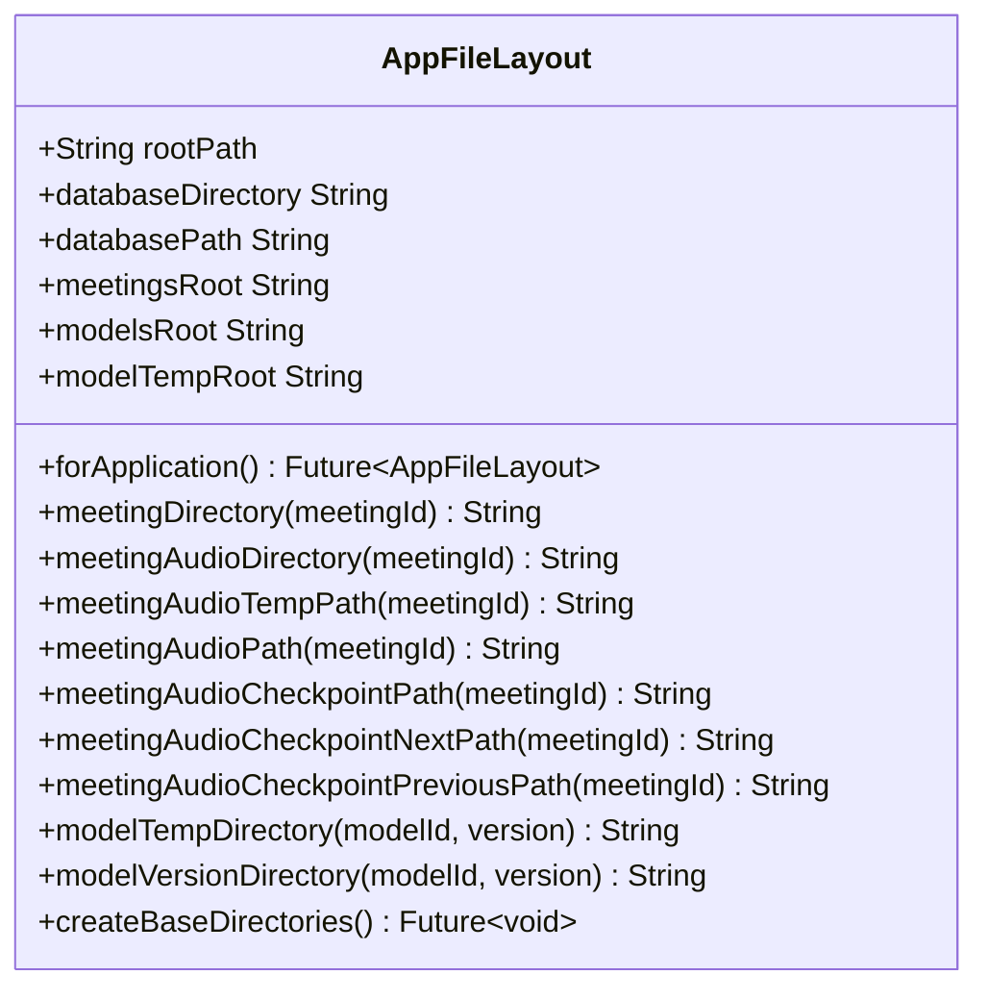
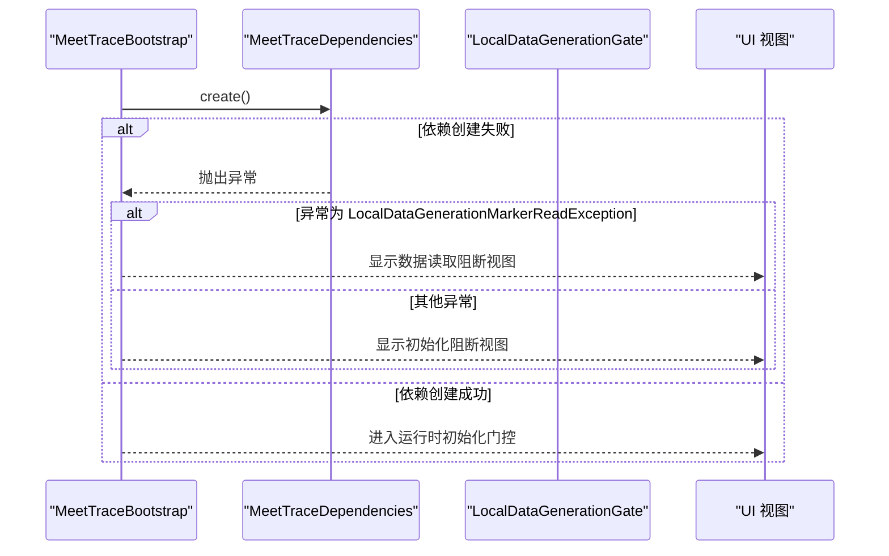
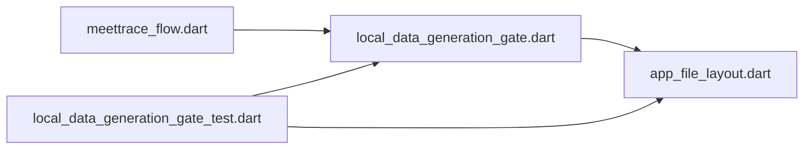

# 本地数据生成门控

<cite>
**本文引用的文件**   
- [lib/data/services/storage/local_data_generation_gate.dart](file://lib/data/services/storage/local_data_generation_gate.dart)
- [lib/data/services/storage/app_file_layout.dart](file://lib/data/services/storage/app_file_layout.dart)
- [test/data/services/storage/local_data_generation_gate_test.dart](file://test/data/services/storage/local_data_generation_gate_test.dart)
- [lib/app/meettrace_flow.dart](file://lib/app/meettrace_flow.dart)
</cite>

## 目录
1. [简介](#简介)
2. [项目结构](#项目结构)
3. [核心组件](#核心组件)
4. [架构总览](#架构总览)
5. [详细组件分析](#详细组件分析)
6. [依赖关系分析](#依赖关系分析)
7. [性能与可靠性考量](#性能与可靠性考量)
8. [故障排查指南](#故障排查指南)
9. [结论](#结论)

## 简介
本文件围绕“本地数据生成门控”能力进行系统化说明。该能力用于在应用启动早期校验并保证本地数据代一致性：当已安装数据代与当前版本不一致时，执行全量清理、重建基础目录并写入新标记，确保后续数据库与运行资源初始化在一个干净且一致的环境中运行。Alpha 阶段采用“升级即全清”的策略，不保留旧数据、不做原地迁移，所有清理与重建均通过统一的门控入口完成。

## 项目结构
与本地数据生成门控直接相关的代码位于 data 层的存储服务中，并通过 app 层引导流程在启动期调用。关键文件包括：
- 门控实现：local_data_generation_gate.dart
- 文件布局抽象：app_file_layout.dart
- 单元测试：local_data_generation_gate_test.dart
- 启动流程集成：meettrace_flow.dart

图表来源
- [lib/app/meettrace_flow.dart:1-80](file://lib/app/meettrace_flow.dart#L1-L80)
- [lib/data/services/storage/local_data_generation_gate.dart:1-103](file://lib/data/services/storage/local_data_generation_gate.dart#L1-L103)
- [lib/data/services/storage/app_file_layout.dart:1-91](file://lib/data/services/storage/app_file_layout.dart#L1-L91)

章节来源
- [lib/data/services/storage/local_data_generation_gate.dart:1-103](file://lib/data/services/storage/local_data_generation_gate.dart#L1-L103)
- [lib/data/services/storage/app_file_layout.dart:1-91](file://lib/data/services/storage/app_file_layout.dart#L1-L91)
- [lib/app/meettrace_flow.dart:1-80](file://lib/app/meettrace_flow.dart#L1-L80)

## 核心组件
- LocalDataGenerationGate：负责读取与校验数据代标记、决定是否清理旧数据、重建基础目录并写入原子化的新标记。
- AppFileLayout：提供统一的应用数据根路径与子目录访问器，以及基础目录的创建方法。
- 启动流程集成：在应用启动阶段调用门控，根据结果决定进入初始化或主界面。

章节来源
- [lib/data/services/storage/local_data_generation_gate.dart:1-103](file://lib/data/services/storage/local_data_generation_gate.dart#L1-L103)
- [lib/data/services/storage/app_file_layout.dart:1-91](file://lib/data/services/storage/app_file_layout.dart#L1-L91)
- [lib/app/meettrace_flow.dart:1-80](file://lib/app/meettrace_flow.dart#L1-L80)

## 架构总览
下图展示从应用启动到数据代门控执行的端到端流程，以及异常分支的处理方式。

图表来源
- [lib/app/meettrace_flow.dart:1-80](file://lib/app/meettrace_flow.dart#L1-L80)
- [lib/data/services/storage/local_data_generation_gate.dart:1-103](file://lib/data/services/storage/local_data_generation_gate.dart#L1-L103)
- [lib/data/services/storage/app_file_layout.dart:1-91](file://lib/data/services/storage/app_file_layout.dart#L1-L91)

## 详细组件分析

### LocalDataGenerationGate（数据代门控）
职责与行为
- 维护当前数据代常量，并在 PRD 记录不兼容变更的原因。
- 校验标记文件是否存在、是否为合法 JSON、schemaVersion 与 generation 是否与当前一致。
- 若不一致或缺失，则删除整个应用数据根目录（包含数据库、会议音频与快照、模型及任何残留），重建基础目录并写入新标记。
- 首次安装不存在数据根目录时仅建立基线，不视为清场。
- 读取标记时若发生文件系统异常，抛出专用异常以阻断启动，避免误判为旧数据代而自动清理。

数据结构与复杂度
- 标记文件为 JSON，字段包括 schemaVersion、generation、updatedAt。
- 时间复杂度主要受 IO 影响；内存占用极小（仅标记内容）。

异常处理
- FormatException：标记格式非法，按旧数据代处理并清理。
- FileSystemException：包装为 LocalDataGenerationMarkerReadException，向上抛出，阻止继续启动。

图表来源
- [lib/data/services/storage/local_data_generation_gate.dart:31-88](file://lib/data/services/storage/local_data_generation_gate.dart#L31-L88)

章节来源
- [lib/data/services/storage/local_data_generation_gate.dart:1-103](file://lib/data/services/storage/local_data_generation_gate.dart#L1-L103)

### AppFileLayout（文件布局）
职责与行为
- 提供应用数据根路径与常用子目录访问器：database、meetings、models、modelTempRoot。
- 提供 meetingId 相关路径：audio、checkpoint、temp 等。
- 提供 createBaseDirectories 方法，一次性创建 database、meetings、models、.tmp 四个基础目录。
- 对路径片段进行安全校验，防止注入与越权访问。

图表来源
- [lib/data/services/storage/app_file_layout.dart:1-91](file://lib/data/services/storage/app_file_layout.dart#L1-L91)

章节来源
- [lib/data/services/storage/app_file_layout.dart:1-91](file://lib/data/services/storage/app_file_layout.dart#L1-L91)

### 启动流程集成（UI 层）
职责与行为
- 在应用启动阶段创建依赖，并在失败时区分两类异常：
  - LocalDataGenerationMarkerReadException：显示“数据读取阻断”视图，允许重试。
  - 其他初始化异常：显示“初始化阻断”视图，允许重试。
- 成功获取依赖后进入运行时初始化门控，最终进入首页或功能页。

图表来源
- [lib/app/meettrace_flow.dart:1-80](file://lib/app/meettrace_flow.dart#L1-L80)

章节来源
- [lib/app/meettrace_flow.dart:1-80](file://lib/app/meettrace_flow.dart#L1-L80)

## 依赖关系分析
- LocalDataGenerationGate 依赖 AppFileLayout 提供的路径与目录创建能力。
- 启动流程（MeetTraceFlow）在依赖创建阶段调用门控，并根据异常类型选择不同 UI 分支。
- 测试用例覆盖首次安装、标记一致、历史安装缺标记、旧数据代、标记损坏、文件系统异常、连续启动幂等性等场景。

图表来源
- [lib/app/meettrace_flow.dart:1-80](file://lib/app/meettrace_flow.dart#L1-L80)
- [lib/data/services/storage/local_data_generation_gate.dart:1-103](file://lib/data/services/storage/local_data_generation_gate.dart#L1-L103)
- [lib/data/services/storage/app_file_layout.dart:1-91](file://lib/data/services/storage/app_file_layout.dart#L1-L91)
- [test/data/services/storage/local_data_generation_gate_test.dart:1-169](file://test/data/services/storage/local_data_generation_gate_test.dart#L1-L169)

章节来源
- [test/data/services/storage/local_data_generation_gate_test.dart:1-169](file://test/data/services/storage/local_data_generation_gate_test.dart#L1-L169)

## 性能与可靠性考量
- 原子写入标记：通过 .next 临时文件写入后再重命名，避免部分写入导致标记损坏。
- 最小化 IO 次数：仅在必要时删除根目录并重建基础目录；标记一致时不进行任何磁盘写操作。
- 快速失败：文件系统异常立即抛出，避免在不可靠状态下继续启动造成更大风险。
- 幂等性：同一会话多次调用 ensureCurrent 仅在第一次可能清理，第二次必定返回无清理。

[本节为通用指导，不涉及具体文件分析]

## 故障排查指南
常见现象与定位
- 启动即显示“数据读取阻断”视图：检查 data_generation.json 是否可读，是否存在权限问题或磁盘异常。
- 每次启动都清理数据：确认标记中的 generation 是否与当前版本一致；检查是否有外部进程修改或删除标记。
- 清理后仍无法进入首页：确认 createBaseDirectories 是否成功创建 database、meetings、models、.tmp 目录。

建议步骤
- 查看日志输出，确认 ensureCurrent 是否抛出了 LocalDataGenerationMarkerReadException。
- 验证 data_generation.json 的内容是否符合 schemaVersion=1 且 generation=当前值。
- 手动检查应用支持目录下的 meettrace 根目录是否存在与权限是否正确。

章节来源
- [lib/data/services/storage/local_data_generation_gate.dart:92-103](file://lib/data/services/storage/local_data_generation_gate.dart#L92-L103)
- [test/data/services/storage/local_data_generation_gate_test.dart:132-159](file://test/data/services/storage/local_data_generation_gate_test.dart#L132-L159)

## 结论
本地数据生成门控在应用启动早期提供了强一致的数据环境保障。通过严格的标记校验、原子写入与异常阻断策略，确保 Alpha 阶段的“升级即全清”策略可预期、可恢复、可观测。配合完善的单元测试与清晰的异常分类，开发者可在出现文件系统异常或标记损坏时快速定位问题并采取重试或修复措施。