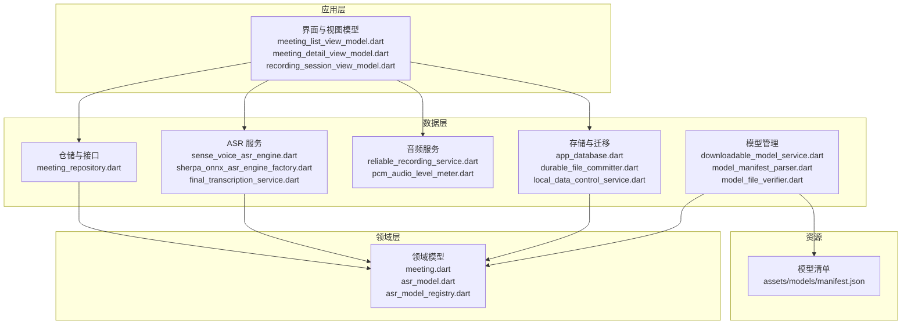
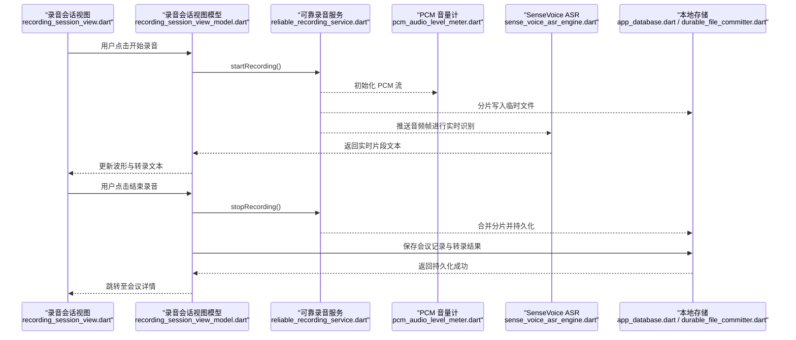
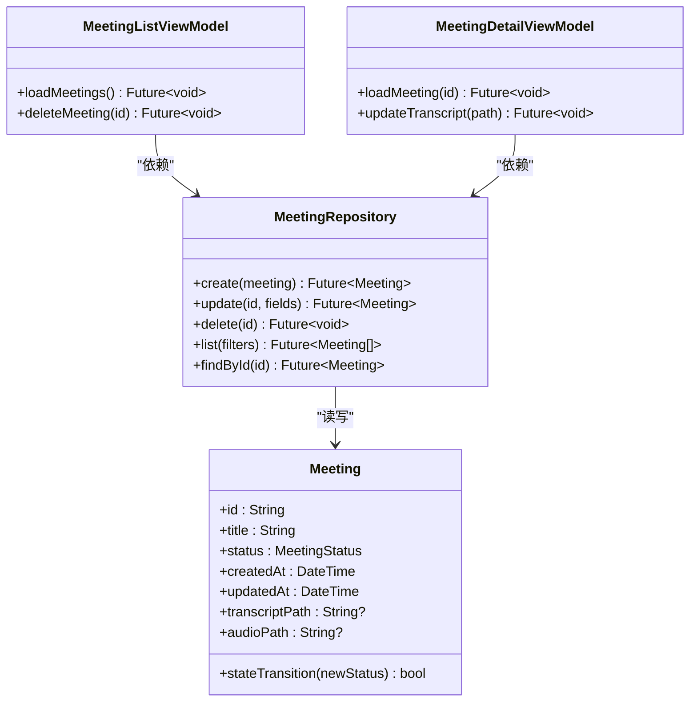
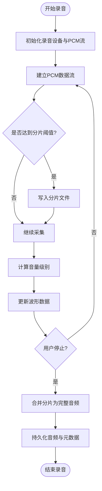
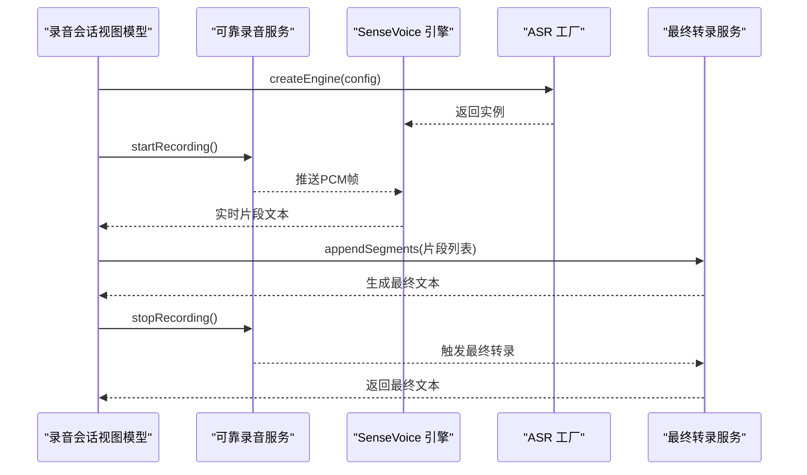
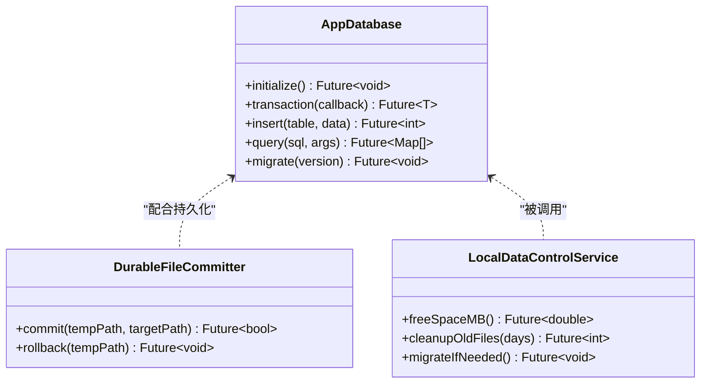
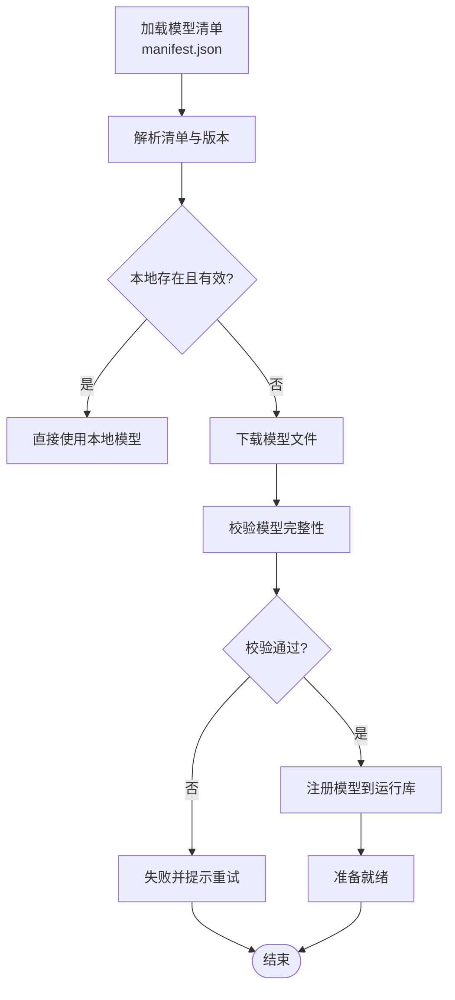
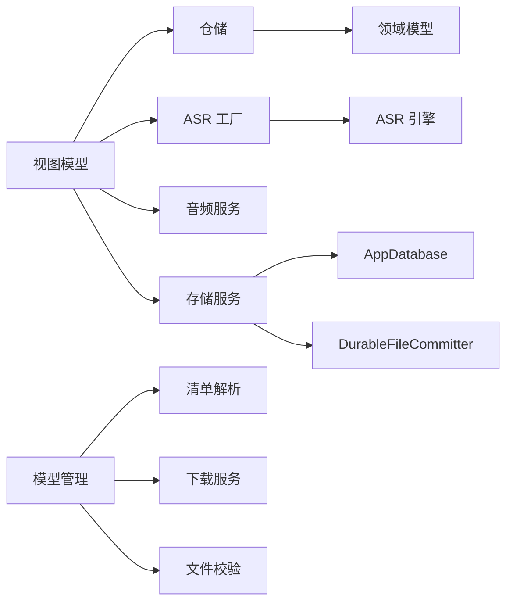

# 核心功能模块

<cite>
**本文引用的文件**   
- [lib/domain/models/meeting.dart](file://lib/domain/models/meeting.dart)
- [lib/data/repositories/meeting_repository.dart](file://lib/data/repositories/meeting_repository.dart)
- [lib/app/features/meetings/view_models/list/meeting_list_view_model.dart](file://lib/app/features/meetings/view_models/list/meeting_list_view_model.dart)
- [lib/app/features/meetings/view_models/detail/meeting_detail_view_model.dart](file://lib/app/features/meetings/view_models/detail/meeting_detail_view_model.dart)
- [lib/app/features/meetings/view_models/recording/recording_session_view_model.dart](file://lib/app/features/meetings/view_models/recording/recording_session_view_model.dart)
- [lib/app/features/meetings/views/recording/recording_session_view.dart](file://lib/app/features/meetings/views/recording/recording_session_view.dart)
- [lib/app/features/meetings/widgets/recording_audio_waveform.dart](file://lib/app/features/meetings/widgets/recording_audio_waveform.dart)
- [lib/data/services/audio/reliable_recording_service.dart](file://lib/data/services/audio/reliable_recording_service.dart)
- [lib/data/services/audio/pcm_audio_level_meter.dart](file://lib/data/services/audio/pcm_audio_level_meter.dart)
- [lib/data/services/asr/sense_voice_asr_engine.dart](file://lib/data/services/asr/sense_voice_asr_engine.dart)
- [lib/data/services/asr/sherpa_onnx_asr_engine_factory.dart](file://lib/data/services/asr/sherpa_onnx_asr_engine_factory.dart)
- [lib/data/services/asr/final_transcription_service.dart](file://lib/data/services/asr/final_transcription_service.dart)
- [lib/data/services/storage/app_database.dart](file://lib/data/services/storage/app_database.dart)
- [lib/data/services/storage/durable_file_committer.dart](file://lib/data/services/storage/durable_file_committer.dart)
- [lib/data/services/storage/local_data_control_service.dart](file://lib/data/services/storage/local_data_control_service.dart)
- [lib/data/services/models/downloadable_model_service.dart](file://lib/data/services/models/downloadable_model_service.dart)
- [lib/data/services/models/model_manifest_parser.dart](file://lib/data/services/models/model_manifest_parser.dart)
- [lib/data/services/models/model_file_verifier.dart](file://lib/data/services/models/model_file_verifier.dart)
- [lib/domain/models/asr_model_registry.dart](file://lib/domain/models/asr_model_registry.dart)
- [lib/domain/models/asr_model.dart](file://lib/domain/models/asr_model.dart)
- [assets/models/manifest.json](file://assets/models/manifest.json)
- [test/data/services/audio/reliable_recording_service_test.dart](file://test/data/services/audio/reliable_recording_service_test.dart)
- [test/data/services/asr/sense_voice_asr_engine_test.dart](file://test/data/services/asr/sense_voice_asr_engine_test.dart)
- [test/data/services/storage/app_database_test.dart](file://test/data/services/storage/app_database_test.dart)
- [test/data/services/models/downloadable_model_service_test.dart](file://test/data/services/models/downloadable_model_service_test.dart)
</cite>

## 目录
1. [简介](#简介)
2. [项目结构](#项目结构)
3. [核心组件](#核心组件)
4. [架构总览](#架构总览)
5. [详细组件分析](#详细组件分析)
6. [依赖关系分析](#依赖关系分析)
7. [性能考量](#性能考量)
8. [故障排查指南](#故障排查指南)
9. [结论](#结论)
10. [附录](#附录)

## 简介
本文件为“会迹”项目的核心功能模块综合文档，聚焦以下能力：
- 会议管理系统：Meeting 模型设计、状态机实现、CRUD 接口与视图模型交互。
- 音频录制系统：可靠录音服务、PCM 音频处理与波形可视化。
- 语音识别系统：ASR 引擎抽象与 SenseVoice 集成、实时转录流程。
- 数据存储系统：SQLite 数据库管理、文件持久化策略与数据迁移机制。
- 模型管理系统：模型注册、下载校验与版本控制。

文档以渐进方式组织，从高层架构到代码级细节，并附带流程图与时序图，帮助不同背景的读者快速理解与使用。

## 项目结构
本项目采用 Flutter/Dart 多端应用，遵循领域驱动分层（domain/data/ui）与特性划分（meetings、settings、startup 等）。核心代码集中在 lib 目录，测试位于 test 目录，资源与模型清单在 assets 目录。

图表来源
- [lib/app/features/meetings/view_models/list/meeting_list_view_model.dart](file://lib/app/features/meetings/view_models/list/meeting_list_view_model.dart)
- [lib/app/features/meetings/view_models/detail/meeting_detail_view_model.dart](file://lib/app/features/meetings/view_models/detail/meeting_detail_view_model.dart)
- [lib/app/features/meetings/view_models/recording/recording_session_view_model.dart](file://lib/app/features/meetings/view_models/recording/recording_session_view_model.dart)
- [lib/data/repositories/meeting_repository.dart](file://lib/data/repositories/meeting_repository.dart)
- [lib/domain/models/meeting.dart](file://lib/domain/models/meeting.dart)
- [lib/data/services/asr/sense_voice_asr_engine.dart](file://lib/data/services/asr/sense_voice_asr_engine.dart)
- [lib/data/services/asr/sherpa_onnx_asr_engine_factory.dart](file://lib/data/services/asr/sherpa_onnx_asr_engine_factory.dart)
- [lib/data/services/asr/final_transcription_service.dart](file://lib/data/services/asr/final_transcription_service.dart)
- [lib/data/services/audio/reliable_recording_service.dart](file://lib/data/services/audio/reliable_recording_service.dart)
- [lib/data/services/audio/pcm_audio_level_meter.dart](file://lib/data/services/audio/pcm_audio_level_meter.dart)
- [lib/data/services/storage/app_database.dart](file://lib/data/services/storage/app_database.dart)
- [lib/data/services/storage/durable_file_committer.dart](file://lib/data/services/storage/durable_file_committer.dart)
- [lib/data/services/storage/local_data_control_service.dart](file://lib/data/services/storage/local_data_control_service.dart)
- [lib/data/services/models/downloadable_model_service.dart](file://lib/data/services/models/downloadable_model_service.dart)
- [lib/data/services/models/model_manifest_parser.dart](file://lib/data/services/models/model_manifest_parser.dart)
- [lib/data/services/models/model_file_verifier.dart](file://lib/data/services/models/model_file_verifier.dart)
- [assets/models/manifest.json](file://assets/models/manifest.json)

章节来源
- [lib/app/features/meetings/view_models/list/meeting_list_view_model.dart](file://lib/app/features/meetings/view_models/list/meeting_list_view_model.dart)
- [lib/app/features/meetings/view_models/detail/meeting_detail_view_model.dart](file://lib/app/features/meetings/view_models/detail/meeting_detail_view_model.dart)
- [lib/app/features/meetings/view_models/recording/recording_session_view_model.dart](file://lib/app/features/meetings/view_models/recording/recording_session_view_model.dart)
- [lib/data/repositories/meeting_repository.dart](file://lib/data/repositories/meeting_repository.dart)
- [lib/domain/models/meeting.dart](file://lib/domain/models/meeting.dart)
- [lib/data/services/asr/sense_voice_asr_engine.dart](file://lib/data/services/asr/sense_voice_asr_engine.dart)
- [lib/data/services/asr/sherpa_onnx_asr_engine_factory.dart](file://lib/data/services/asr/sherpa_onnx_asr_engine_factory.dart)
- [lib/data/services/asr/final_transcription_service.dart](file://lib/data/services/asr/final_transcription_service.dart)
- [lib/data/services/audio/reliable_recording_service.dart](file://lib/data/services/audio/reliable_recording_service.dart)
- [lib/data/services/audio/pcm_audio_level_meter.dart](file://lib/data/services/audio/pcm_audio_level_meter.dart)
- [lib/data/services/storage/app_database.dart](file://lib/data/services/storage/app_database.dart)
- [lib/data/services/storage/durable_file_committer.dart](file://lib/data/services/storage/durable_file_committer.dart)
- [lib/data/services/storage/local_data_control_service.dart](file://lib/data/services/storage/local_data_control_service.dart)
- [lib/data/services/models/downloadable_model_service.dart](file://lib/data/services/models/downloadable_model_service.dart)
- [lib/data/services/models/model_manifest_parser.dart](file://lib/data/services/models/model_manifest_parser.dart)
- [lib/data/services/models/model_file_verifier.dart](file://lib/data/services/models/model_file_verifier.dart)
- [assets/models/manifest.json](file://assets/models/manifest.json)

## 核心组件
- 会议模型与会话状态机：Meeting 实体承载会议元数据与状态流转；视图模型封装创建、更新、删除等操作。
- 可靠录音服务：面向中断恢复的 PCM 流式采集与分片落盘，结合音量计提供波形反馈。
- ASR 引擎与 SenseVoice：统一 ASR 接口，SenseVoice 作为默认引擎，支持实时转录与最终文本聚合。
- 数据存储：SQLite 表结构与文件持久化，提供事务性写入与迁移保障。
- 模型管理：基于 manifest.json 的版本化模型清单，支持下载、校验与运行时装配。

章节来源
- [lib/domain/models/meeting.dart](file://lib/domain/models/meeting.dart)
- [lib/app/features/meetings/view_models/recording/recording_session_view_model.dart](file://lib/app/features/meetings/view_models/recording/recording_session_view_model.dart)
- [lib/data/services/audio/reliable_recording_service.dart](file://lib/data/services/audio/reliable_recording_service.dart)
- [lib/data/services/asr/sense_voice_asr_engine.dart](file://lib/data/services/asr/sense_voice_asr_engine.dart)
- [lib/data/services/storage/app_database.dart](file://lib/data/services/storage/app_database.dart)
- [lib/data/services/models/downloadable_model_service.dart](file://lib/data/services/models/downloadable_model_service.dart)

## 架构总览
下图展示从 UI 到领域与数据层的调用路径，以及关键子系统间的协作关系。

图表来源
- [lib/app/features/meetings/views/recording/recording_session_view.dart](file://lib/app/features/meetings/views/recording/recording_session_view.dart)
- [lib/app/features/meetings/view_models/recording/recording_session_view_model.dart](file://lib/app/features/meetings/view_models/recording/recording_session_view_model.dart)
- [lib/data/services/audio/reliable_recording_service.dart](file://lib/data/services/audio/reliable_recording_service.dart)
- [lib/data/services/audio/pcm_audio_level_meter.dart](file://lib/data/services/audio/pcm_audio_level_meter.dart)
- [lib/data/services/asr/sense_voice_asr_engine.dart](file://lib/data/services/asr/sense_voice_asr_engine.dart)
- [lib/data/services/storage/app_database.dart](file://lib/data/services/storage/app_database.dart)
- [lib/data/services/storage/durable_file_committer.dart](file://lib/data/services/storage/durable_file_committer.dart)

## 详细组件分析

### 会议管理与状态机
- Meeting 模型定义会议的核心字段与状态枚举，状态机约束合法转换（如新建→进行中→已结束）。
- 仓储层提供 CRUD 操作，视图模型负责业务编排与错误处理。
- 列表与详情页通过视图模型订阅数据变化，驱动 UI 刷新。

图表来源
- [lib/domain/models/meeting.dart](file://lib/domain/models/meeting.dart)
- [lib/data/repositories/meeting_repository.dart](file://lib/data/repositories/meeting_repository.dart)
- [lib/app/features/meetings/view_models/list/meeting_list_view_model.dart](file://lib/app/features/meetings/view_models/list/meeting_list_view_model.dart)
- [lib/app/features/meetings/view_models/detail/meeting_detail_view_model.dart](file://lib/app/features/meetings/view_models/detail/meeting_detail_view_model.dart)

章节来源
- [lib/domain/models/meeting.dart](file://lib/domain/models/meeting.dart)
- [lib/data/repositories/meeting_repository.dart](file://lib/data/repositories/meeting_repository.dart)
- [lib/app/features/meetings/view_models/list/meeting_list_view_model.dart](file://lib/app/features/meetings/view_models/list/meeting_list_view_model.dart)
- [lib/app/features/meetings/view_models/detail/meeting_detail_view_model.dart](file://lib/app/features/meetings/view_models/detail/meeting_detail_view_model.dart)

### 音频录制系统与波形可视化
- 可靠录音服务：断点续录、异常恢复、分片落盘，确保长时录音不丢失。
- PCM 音量计：计算实时音量，驱动波形渲染。
- 波形组件：根据音量序列绘制动态波形，提供流畅动画。

图表来源
- [lib/data/services/audio/reliable_recording_service.dart](file://lib/data/services/audio/reliable_recording_service.dart)
- [lib/data/services/audio/pcm_audio_level_meter.dart](file://lib/data/services/audio/pcm_audio_level_meter.dart)
- [lib/app/features/meetings/widgets/recording_audio_waveform.dart](file://lib/app/features/meetings/widgets/recording_audio_waveform.dart)

章节来源
- [lib/data/services/audio/reliable_recording_service.dart](file://lib/data/services/audio/reliable_recording_service.dart)
- [lib/data/services/audio/pcm_audio_level_meter.dart](file://lib/data/services/audio/pcm_audio_level_meter.dart)
- [lib/app/features/meetings/widgets/recording_audio_waveform.dart](file://lib/app/features/meetings/widgets/recording_audio_waveform.dart)
- [lib/app/features/meetings/views/recording/recording_session_view.dart](file://lib/app/features/meetings/views/recording/recording_session_view.dart)
- [lib/app/features/meetings/view_models/recording/recording_session_view_model.dart](file://lib/app/features/meetings/view_models/recording/recording_session_view_model.dart)

### 语音识别系统（ASR）与 SenseVoice 集成
- ASR 引擎抽象：统一接口适配不同引擎（SenseVoice、SherpaONNX 等）。
- SenseVoice 引擎：加载模型、初始化推理、实时增量识别。
- 最终转录服务：聚合实时片段，生成可编辑的最终文本。

图表来源
- [lib/data/services/asr/sense_voice_asr_engine.dart](file://lib/data/services/asr/sense_voice_asr_engine.dart)
- [lib/data/services/asr/sherpa_onnx_asr_engine_factory.dart](file://lib/data/services/asr/sherpa_onnx_asr_engine_factory.dart)
- [lib/data/services/asr/final_transcription_service.dart](file://lib/data/services/asr/final_transcription_service.dart)

章节来源
- [lib/data/services/asr/sense_voice_asr_engine.dart](file://lib/data/services/asr/sense_voice_asr_engine.dart)
- [lib/data/services/asr/sherpa_onnx_asr_engine_factory.dart](file://lib/data/services/asr/sherpa_onnx_asr_engine_factory.dart)
- [lib/data/services/asr/final_transcription_service.dart](file://lib/data/services/asr/final_transcription_service.dart)

### 数据存储系统（SQLite 与文件持久化）
- AppDatabase：管理 SQLite 连接、表结构、查询与事务。
- DurableFileCommitter：原子写入与回滚，保证文件一致性。
- LocalDataControlService：本地数据清理、空间检查与迁移协调。

图表来源
- [lib/data/services/storage/app_database.dart](file://lib/data/services/storage/app_database.dart)
- [lib/data/services/storage/durable_file_committer.dart](file://lib/data/services/storage/durable_file_committer.dart)
- [lib/data/services/storage/local_data_control_service.dart](file://lib/data/services/storage/local_data_control_service.dart)

章节来源
- [lib/data/services/storage/app_database.dart](file://lib/data/services/storage/app_database.dart)
- [lib/data/services/storage/durable_file_committer.dart](file://lib/data/services/storage/durable_file_committer.dart)
- [lib/data/services/storage/local_data_control_service.dart](file://lib/data/services/storage/local_data_control_service.dart)

### 模型管理系统（注册、下载、校验、版本控制）
- ModelManifestParser：解析 assets/models/manifest.json，获取模型清单与版本信息。
- DownloadableModelService：按清单下载模型文件，支持断点续传与进度回调。
- ModelFileVerifier：校验模型完整性（哈希/签名），确保模型可信。
- ASR 模型注册表：维护可用模型与默认选择策略。

图表来源
- [assets/models/manifest.json](file://assets/models/manifest.json)
- [lib/data/services/models/model_manifest_parser.dart](file://lib/data/services/models/model_manifest_parser.dart)
- [lib/data/services/models/downloadable_model_service.dart](file://lib/data/services/models/downloadable_model_service.dart)
- [lib/data/services/models/model_file_verifier.dart](file://lib/data/services/models/model_file_verifier.dart)
- [lib/domain/models/asr_model_registry.dart](file://lib/domain/models/asr_model_registry.dart)
- [lib/domain/models/asr_model.dart](file://lib/domain/models/asr_model.dart)

章节来源
- [assets/models/manifest.json](file://assets/models/manifest.json)
- [lib/data/services/models/model_manifest_parser.dart](file://lib/data/services/models/model_manifest_parser.dart)
- [lib/data/services/models/downloadable_model_service.dart](file://lib/data/services/models/downloadable_model_service.dart)
- [lib/data/services/models/model_file_verifier.dart](file://lib/data/services/models/model_file_verifier.dart)
- [lib/domain/models/asr_model_registry.dart](file://lib/domain/models/asr_model_registry.dart)
- [lib/domain/models/asr_model.dart](file://lib/domain/models/asr_model.dart)

## 依赖关系分析
- 视图模型依赖仓储与领域模型，避免直接访问底层存储。
- ASR 引擎通过工厂模式解耦具体实现，便于扩展新引擎。
- 存储服务与文件提交器协同，确保数据一致性与可恢复性。
- 模型管理独立于业务逻辑，通过清单驱动版本控制与下载流程。

图表来源
- [lib/app/features/meetings/view_models/list/meeting_list_view_model.dart](file://lib/app/features/meetings/view_models/list/meeting_list_view_model.dart)
- [lib/app/features/meetings/view_models/detail/meeting_detail_view_model.dart](file://lib/app/features/meetings/view_models/detail/meeting_detail_view_model.dart)
- [lib/app/features/meetings/view_models/recording/recording_session_view_model.dart](file://lib/app/features/meetings/view_models/recording/recording_session_view_model.dart)
- [lib/data/repositories/meeting_repository.dart](file://lib/data/repositories/meeting_repository.dart)
- [lib/domain/models/meeting.dart](file://lib/domain/models/meeting.dart)
- [lib/data/services/asr/sherpa_onnx_asr_engine_factory.dart](file://lib/data/services/asr/sherpa_onnx_asr_engine_factory.dart)
- [lib/data/services/audio/reliable_recording_service.dart](file://lib/data/services/audio/reliable_recording_service.dart)
- [lib/data/services/storage/app_database.dart](file://lib/data/services/storage/app_database.dart)
- [lib/data/services/storage/durable_file_committer.dart](file://lib/data/services/storage/durable_file_committer.dart)
- [lib/data/services/models/model_manifest_parser.dart](file://lib/data/services/models/model_manifest_parser.dart)
- [lib/data/services/models/downloadable_model_service.dart](file://lib/data/services/models/downloadable_model_service.dart)
- [lib/data/services/models/model_file_verifier.dart](file://lib/data/services/models/model_file_verifier.dart)

章节来源
- [lib/app/features/meetings/view_models/list/meeting_list_view_model.dart](file://lib/app/features/meetings/view_models/list/meeting_list_view_model.dart)
- [lib/app/features/meetings/view_models/detail/meeting_detail_view_model.dart](file://lib/app/features/meetings/view_models/detail/meeting_detail_view_model.dart)
- [lib/app/features/meetings/view_models/recording/recording_session_view_model.dart](file://lib/app/features/meetings/view_models/recording/recording_session_view_model.dart)
- [lib/data/repositories/meeting_repository.dart](file://lib/data/repositories/meeting_repository.dart)
- [lib/domain/models/meeting.dart](file://lib/domain/models/meeting.dart)
- [lib/data/services/asr/sherpa_onnx_asr_engine_factory.dart](file://lib/data/services/asr/sherpa_onnx_asr_engine_factory.dart)
- [lib/data/services/audio/reliable_recording_service.dart](file://lib/data/services/audio/reliable_recording_service.dart)
- [lib/data/services/storage/app_database.dart](file://lib/data/services/storage/app_database.dart)
- [lib/data/services/storage/durable_file_committer.dart](file://lib/data/services/storage/durable_file_committer.dart)
- [lib/data/services/models/model_manifest_parser.dart](file://lib/data/services/models/model_manifest_parser.dart)
- [lib/data/services/models/downloadable_model_service.dart](file://lib/data/services/models/downloadable_model_service.dart)
- [lib/data/services/models/model_file_verifier.dart](file://lib/data/services/models/model_file_verifier.dart)

## 性能考量
- 录音分片大小与合并策略需平衡内存占用与 I/O 频率，避免频繁小文件写入。
- PCM 音量计算应使用高效算法，减少主线程阻塞。
- ASR 推理建议异步执行，避免阻塞 UI 与录音线程。
- SQLite 批量写入与事务边界优化，降低锁竞争。
- 模型下载支持断点续传与并发限制，避免带宽拥塞。

[本节为通用指导，无需特定文件引用]

## 故障排查指南
- 录音中断或崩溃恢复：检查分片落盘与合并逻辑，确认临时文件完整性。
- 波形卡顿：评估音量计算与渲染频率，必要时降采样或节流。
- ASR 无输出：验证模型清单与下载完整性，检查引擎初始化参数。
- 数据库异常：查看事务回滚与迁移日志，确认表结构版本匹配。
- 模型校验失败：核对哈希值与签名，重新下载并清理缓存。

章节来源
- [test/data/services/audio/reliable_recording_service_test.dart](file://test/data/services/audio/reliable_recording_service_test.dart)
- [test/data/services/asr/sense_voice_asr_engine_test.dart](file://test/data/services/asr/sense_voice_asr_engine_test.dart)
- [test/data/services/storage/app_database_test.dart](file://test/data/services/storage/app_database_test.dart)
- [test/data/services/models/downloadable_model_service_test.dart](file://test/data/services/models/downloadable_model_service_test.dart)

## 结论
会迹项目通过清晰的分层与模块化设计，实现了会议管理、可靠录音、语音识别、数据存储与模型管理的闭环。各子系统职责明确、耦合度低，便于扩展与维护。建议在后续迭代中持续优化性能与用户体验，完善监控与诊断能力。

[本节为总结，无需特定文件引用]

## 附录
- 配置选项参考：
  - 录音参数：采样率、通道数、分片大小、缓冲时长。
  - ASR 参数：模型路径、语言设置、实时窗口大小。
  - 存储参数：数据库路径、保留策略、清理阈值。
  - 模型清单：版本号、下载地址、校验值、依赖关系。

[本节为补充说明，无需特定文件引用]