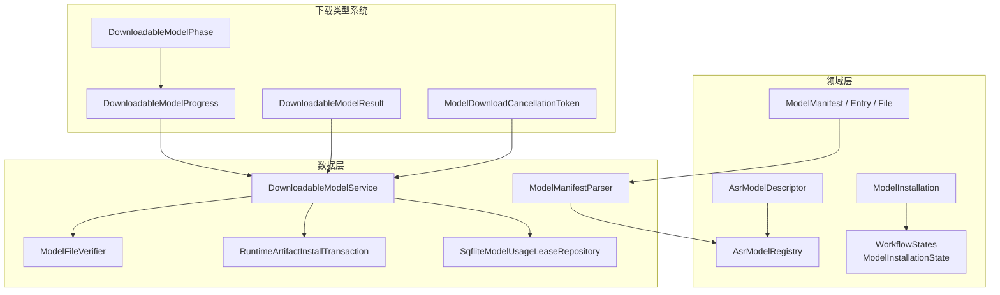
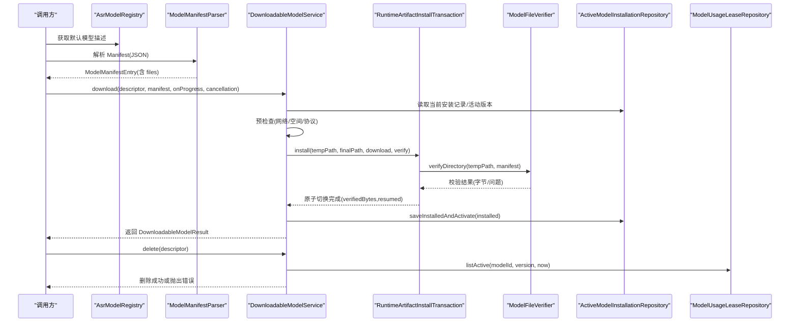
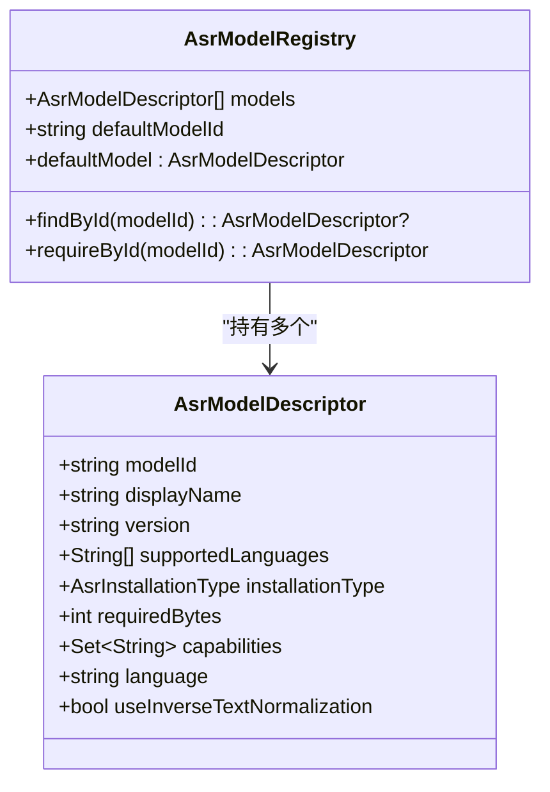
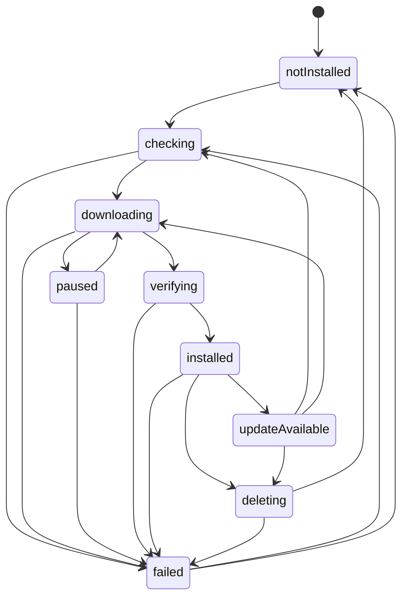
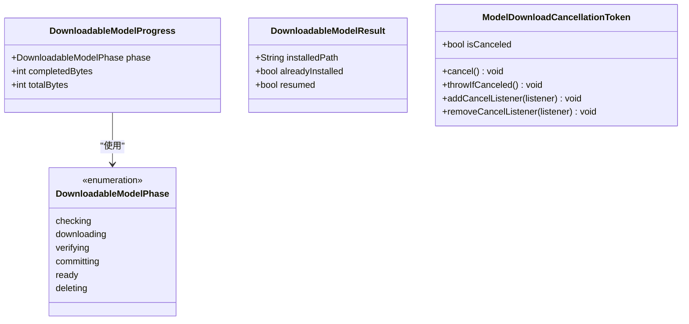
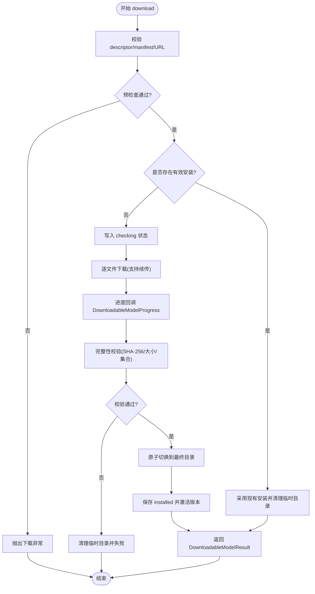
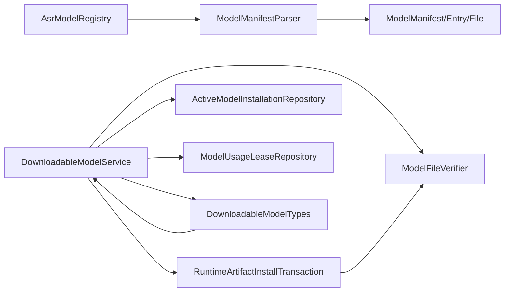

# 模型管理系统

<cite>
**本文引用的文件**   
- [lib/domain/models/asr_model.dart](file://lib/domain/models/asr_model.dart)
- [lib/domain/models/asr_model_registry.dart](file://lib/domain/models/asr_model_registry.dart)
- [lib/domain/models/model_manifest.dart](file://lib/domain/models/model_manifest.dart)
- [lib/domain/models/model_installation.dart](file://lib/domain/models/model_installation.dart)
- [lib/domain/models/workflow_states.dart](file://lib/domain/models/workflow_states.dart)
- [lib/data/services/models/downloadable_model_service.dart](file://lib/data/services/models/downloadable_model_service.dart)
- [lib/data/services/models/model_file_verifier.dart](file://lib/data/services/models/model_file_verifier.dart)
- [lib/data/services/models/runtime_artifact_install_transaction.dart](file://lib/data/services/models/runtime_artifact_install_transaction.dart)
- [lib/data/services/models/model_manifest_parser.dart](file://lib/data/services/models/model_manifest_parser.dart)
- [lib/data/services/models/runtime_asset_installers.dart](file://lib/data/services/models/runtime_asset_installers.dart)
- [lib/data/services/models/model_download_types.dart](file://lib/data/services/models/model_download_types.dart)
- [lib/data/repositories/sqflite_model_usage_lease_repository.dart](file://lib/data/repositories/sqflite_model_usage_lease_repository.dart)
- [test/data/services/models/downloadable_model_service_test.dart](file://test/data/services/models/downloadable_model_service_test.dart)
- [test/domain/models/asr_model_registry_test.dart](file://test/domain/models/asr_model_registry_test.dart)
- [test/domain/models/asr_model_test.dart](file://test/domain/models/asr_model_test.dart)
</cite>

## 更新摘要
**所做更改**   
- 新增下载基础设施类型系统章节，详细说明 DownloadableModelPhase、DownloadableModelProgress、DownloadableModelResult 和 ModelDownloadCancellationToken
- 更新可下载模型服务章节，反映新的进度跟踪和取消机制
- 增强监控与日志记录章节，包含新的进度回调和取消令牌的使用
- 更新故障排查指南，包含新的错误码和处理方式

## 目录
1. [简介](#简介)
2. [项目结构](#项目结构)
3. [核心组件](#核心组件)
4. [架构总览](#架构总览)
5. [详细组件分析](#详细组件分析)
6. [依赖关系分析](#依赖关系分析)
7. [性能考量](#性能考量)
8. [故障排查指南](#故障排查指南)
9. [结论](#结论)
10. [附录](#附录)

## 简介
本文件面向会迹项目的"模型管理系统"，系统性阐述模型安装实体、ASR 模型注册表、可下载模型服务、模型文件验证器、运行时资源事务与多模型支持等关键设计。文档覆盖模型元数据与版本信息、安装状态机、下载与断点续传、完整性与兼容性校验、动态加载/卸载、选择策略与回退、更新升级最佳实践，以及监控与日志记录要点。

**更新** 本次更新重点介绍了增强的下载基础设施类型系统，包括 DownloadableModelPhase 枚举、DownloadableModelProgress 类、DownloadableModelResult 类和 ModelDownloadCancellationToken，为改进的进度跟踪和取消支持提供了基础。

## 项目结构
围绕模型管理的关键代码分布在 domain 层（领域模型与状态）、data 层（服务、解析器、仓库）与测试用例中：
- 领域模型：AsrModelDescriptor、AsrModelRegistry、ModelManifest、ModelInstallation、工作流状态
- 数据服务：DownloadableModelService、ModelFileVerifier、RuntimeArtifactInstallTransaction、ModelManifestParser
- 下载类型系统：DownloadableModelPhase、DownloadableModelProgress、DownloadableModelResult、ModelDownloadCancellationToken
- 仓库接口：使用方通过端口访问安装记录与租约（示例见测试中的内存实现）
- 测试：覆盖注册表约束、下载流程、删除保护、租约检查等

**图表来源**
- [lib/domain/models/asr_model.dart:1-54](file://lib/domain/models/asr_model.dart#L1-L54)
- [lib/domain/models/asr_model_registry.dart:1-69](file://lib/domain/models/asr_model_registry.dart#L1-L69)
- [lib/domain/models/model_manifest.dart:1-51](file://lib/domain/models/model_manifest.dart#L1-L51)
- [lib/domain/models/model_installation.dart:1-62](file://lib/domain/models/model_installation.dart#L1-L62)
- [lib/domain/models/workflow_states.dart:15-204](file://lib/domain/models/workflow_states.dart#L15-L204)
- [lib/data/services/models/model_download_types.dart:1-76](file://lib/data/services/models/model_download_types.dart#L1-L76)
- [lib/data/services/models/downloadable_model_service.dart:1-647](file://lib/data/services/models/downloadable_model_service.dart#L1-L647)
- [lib/data/services/models/model_file_verifier.dart:1-116](file://lib/data/services/models/model_file_verifier.dart#L1-L116)
- [lib/data/services/models/runtime_artifact_install_transaction.dart:1-164](file://lib/data/services/models/runtime_artifact_install_transaction.dart#L1-L164)
- [lib/data/services/models/model_manifest_parser.dart:1-232](file://lib/data/services/models/model_manifest_parser.dart#L1-L232)
- [lib/data/repositories/sqflite_model_usage_lease_repository.dart:1-48](file://lib/data/repositories/sqflite_model_usage_lease_repository.dart#L1-L48)

## 核心组件
- 模型描述与注册表
  - AsrModelDescriptor：定义模型 ID、显示名、版本、语言、安装类型、所需字节数、能力集、语言模式与文本归一化开关；构造时进行严格校验并返回不可变集合。
  - AsrModelRegistry：维护模型清单与默认模型，提供按 ID 查找与强制获取；内置 Alpha 注册表仅登记 SenseVoice 作为默认可下载模型。
- 模型清单与解析
  - ModelManifest/Entry/File/License：声明 schemaVersion、最低 App 版本、模型列表与文件清单（路径、大小、SHA-256、URL）。
  - ModelManifestParser：校验 JSON 结构、schemaVersion、App 版本兼容、模型与 Registry 一致性、文件 URL 协议限制、requiredBytes 合计一致性与安全路径。
- 安装状态与生命周期
  - ModelInstallation：封装 modelId、version、installationType、state、installedPath、verifiedAt、bytes、lastErrorCode；transitionTo 保证内置模型不可删除等不变式。
  - WorkflowStates：定义 ModelInstallationState 及合法状态迁移规则，确保下载/校验/提交/删除等过程的可恢复性。
- **新增** 下载类型系统
  - DownloadableModelPhase：定义下载阶段枚举（checking、downloading、verifying、committing、ready、deleting）
  - DownloadableModelProgress：封装进度信息（phase、completedBytes、totalBytes）
  - DownloadableModelResult：封装下载结果（installedPath、alreadyInstalled、resumed）
  - ModelDownloadCancellationToken：提供取消令牌机制，支持监听器和异常抛出
- 可下载模型服务
  - DownloadableModelService：协调预检查、下载、校验、原子提交、进度回调、取消令牌、快速就绪检测、删除保护（必需运行时/内置模型/活动租约）。
- 文件验证器
  - ModelFileVerifier：对目录内文件进行存在性、大小、SHA-256 校验，可选严格集合检查，输出问题明细与已验证字节数。
- 运行时资源安装事务
  - RuntimeArtifactInstallTransaction：统一处理逐文件下载、断点续传、完整性校验、临时目录到最终目录的原子切换，保障失败清理与路径越界防护。
- 租约与并发控制
  - SqfliteModelUsageLeaseRepository：持久化模型使用租约，查询活动租约以阻止删除在用模型。

**章节来源**
- [lib/domain/models/asr_model.dart:1-54](file://lib/domain/models/asr_model.dart#L1-L54)
- [lib/domain/models/asr_model_registry.dart:1-69](file://lib/domain/models/asr_model_registry.dart#L1-L69)
- [lib/domain/models/model_manifest.dart:1-51](file://lib/domain/models/model_manifest.dart#L1-L51)
- [lib/domain/models/model_installation.dart:1-62](file://lib/domain/models/model_installation.dart#L1-L62)
- [lib/domain/models/workflow_states.dart:15-204](file://lib/domain/models/workflow_states.dart#L15-L204)
- [lib/data/services/models/model_download_types.dart:1-76](file://lib/data/services/models/model_download_types.dart#L1-L76)
- [lib/data/services/models/model_manifest_parser.dart:1-232](file://lib/data/services/models/model_manifest_parser.dart#L1-L232)
- [lib/data/services/models/downloadable_model_service.dart:1-647](file://lib/data/services/models/downloadable_model_service.dart#L1-L647)
- [lib/data/services/models/model_file_verifier.dart:1-116](file://lib/data/services/models/model_file_verifier.dart#L1-L116)
- [lib/data/services/models/runtime_artifact_install_transaction.dart:1-164](file://lib/data/services/models/runtime_artifact_install_transaction.dart#L1-L164)
- [lib/data/repositories/sqflite_model_usage_lease_repository.dart:1-48](file://lib/data/repositories/sqflite_model_usage_lease_repository.dart#L1-L48)

## 架构总览
下图展示模型管理与下载的核心交互：注册表提供模型元数据，清单解析器校验 Manifest 与 Registry 的一致性；下载服务编排下载、校验、提交与状态流转；验证器保障完整性；事务模块确保原子切换；租约仓库防止删除在用模型。

**图表来源**
- [lib/domain/models/asr_model_registry.dart:1-69](file://lib/domain/models/asr_model_registry.dart#L1-L69)
- [lib/data/services/models/model_manifest_parser.dart:1-232](file://lib/data/services/models/model_manifest_parser.dart#L1-L232)
- [lib/data/services/models/downloadable_model_service.dart:1-647](file://lib/data/services/models/downloadable_model_service.dart#L1-L647)
- [lib/data/services/models/runtime_artifact_install_transaction.dart:1-164](file://lib/data/services/models/runtime_artifact_install_transaction.dart#L1-L164)
- [lib/data/services/models/model_file_verifier.dart:1-116](file://lib/data/services/models/model_file_verifier.dart#L1-L116)
- [lib/data/repositories/sqflite_model_usage_lease_repository.dart:1-48](file://lib/data/repositories/sqflite_model_usage_lease_repository.dart#L1-L48)

## 详细组件分析

### ASR 模型注册表与描述
- 设计要点
  - 不可变集合与唯一性约束：models 与 _byId 均为不可变映射，重复 modelId 抛错。
  - 默认模型强约束：defaultModelId 必须存在于 models。
  - Alpha 注册表仅包含 SenseVoice，标记为 downloadable，具备 offline、meeting-preview、final-transcript、auto-language、inverse-text-normalization、required-runtime 等能力。
- 复杂度与可用性
  - findById O(1)，requireById 在缺失时抛出明确异常，便于上层快速失败。

**图表来源**
- [lib/domain/models/asr_model.dart:1-54](file://lib/domain/models/asr_model.dart#L1-L54)
- [lib/domain/models/asr_model_registry.dart:1-69](file://lib/domain/models/asr_model_registry.dart#L1-L69)

**章节来源**
- [lib/domain/models/asr_model.dart:1-54](file://lib/domain/models/asr_model.dart#L1-L54)
- [lib/domain/models/asr_model_registry.dart:1-69](file://lib/domain/models/asr_model_registry.dart#L1-L69)
- [test/domain/models/asr_model_registry_test.dart:1-59](file://test/domain/models/asr_model_registry_test.dart#L1-L59)
- [test/domain/models/asr_model_test.dart:1-49](file://test/domain/models/asr_model_test.dart#L1-L49)

### 模型清单解析与兼容性
- 关键点
  - schemaVersion 固定且需匹配；minAppVersion 比较确保不低于当前应用版本。
  - models 非空、modelId 不重复、files 非空且路径不重复。
  - Registry 一致性校验：modelId@version/installationType/requiredBytes 必须匹配。
  - 文件 URL 协议限制：downloadable 必须 https，bundled 必须 asset。
  - requiredBytes 必须等于 files.bytes 之和。
- 安全与健壮性
  - 安全相对路径校验，拒绝绝对路径、盘符、空段、. 和 ..。
  - 禁止占位符与非法字符。

**章节来源**
- [lib/domain/models/model_manifest.dart:1-51](file://lib/domain/models/model_manifest.dart#L1-L51)
- [lib/data/services/models/model_manifest_parser.dart:1-232](file://lib/data/services/models/model_manifest_parser.dart#L1-L232)

### 安装状态机与生命周期
- 状态与迁移
  - notInstalled → checking → downloading → verifying → installed → (updateAvailable | deleting | failed)
  - paused 可从 downloading 进入，并可回到 downloading 或失败。
  - failed 可回到 checking 或 notInstalled，便于重试。
- 不变式
  - 内置模型不允许进入 deleting。
  - installed 状态必须包含 installedPath 与 verifiedAt。

**图表来源**
- [lib/domain/models/workflow_states.dart:15-204](file://lib/domain/models/workflow_states.dart#L15-L204)
- [lib/domain/models/model_installation.dart:1-62](file://lib/domain/models/model_installation.dart#L1-L62)

**章节来源**
- [lib/domain/models/workflow_states.dart:15-204](file://lib/domain/models/workflow_states.dart#L15-L204)
- [lib/domain/models/model_installation.dart:1-62](file://lib/domain/models/model_installation.dart#L1-L62)

### 下载类型系统（新增）
- **DownloadableModelPhase 枚举**
  - checking：预检查阶段
  - downloading：下载进行中
  - verifying：完整性校验阶段
  - committing：提交阶段
  - ready：完成阶段
  - deleting：删除阶段
- **DownloadableModelProgress 类**
  - phase：当前阶段
  - completedBytes：已完成字节数
  - totalBytes：总字节数
- **DownloadableModelResult 类**
  - installedPath：安装路径
  - alreadyInstalled：是否已安装
  - resumed：是否续传
- **ModelDownloadCancellationToken 类**
  - isCanceled：取消状态
  - cancel()：取消操作
  - throwIfCanceled()：如果已取消则抛出异常
  - addCancelListener/removeCancelListener：添加/移除取消监听器

**图表来源**
- [lib/data/services/models/model_download_types.dart:1-76](file://lib/data/services/models/model_download_types.dart#L1-L76)

**章节来源**
- [lib/data/services/models/model_download_types.dart:1-76](file://lib/data/services/models/model_download_types.dart#L1-L76)

### 可下载模型服务（下载、进度、断点续传、删除）
- **更新** 下载流程
  - 输入校验：仅接受 downloadable 类型，descriptor 与 manifest 字段一致，URL 必须 https。
  - 预检查：存储空间不足、离线网络、计费网络未确认即拒绝。
  - 快速路径：isReadyFast 基于安装记录与文件大小集合快速判定，避免全量哈希。
  - 安装事务：通过 RuntimeArtifactInstallTransaction 执行逐文件下载、断点续传、完整性校验与原子切换。
  - 状态持久化：checking/downloading/verifying/committing/installed/paused/failed 等状态均落库，支持恢复。
- **更新** 进度与取消
  - 通过 DownloadableModelProgressCallback 报告 DownloadableModelProgress（phase、completedBytes、totalBytes）
  - 支持 ModelDownloadCancellationToken 中断并转为暂停状态
  - 取消时抛出 ModelDownloadCanceledException，状态保存为 paused
- 删除保护
  - required-runtime 能力模型不可删；内置模型不可删；存在活动租约不可删；删除前清理 temp 与 final 目录并写回状态。

**图表来源**
- [lib/data/services/models/downloadable_model_service.dart:1-647](file://lib/data/services/models/downloadable_model_service.dart#L1-L647)
- [lib/data/services/models/runtime_artifact_install_transaction.dart:1-164](file://lib/data/services/models/runtime_artifact_install_transaction.dart#L1-L164)
- [lib/data/services/models/model_file_verifier.dart:1-116](file://lib/data/services/models/model_file_verifier.dart#L1-L116)

**章节来源**
- [lib/data/services/models/downloadable_model_service.dart:1-647](file://lib/data/services/models/downloadable_model_service.dart#L1-L647)
- [test/data/services/models/downloadable_model_service_test.dart:312-365](file://test/data/services/models/downloadable_model_service_test.dart#L312-L365)

### 模型文件验证器（完整性、签名、兼容性）
- 完整性检查
  - 存在性、文件大小、SHA-256 比对；可选严格集合检查，拒绝不在清单中的文件。
- 兼容性与安全性
  - 清单解析阶段已校验 schemaVersion、App 版本、URL 协议、路径安全与 requiredBytes 一致性。
- 输出
  - 返回已验证字节数与问题列表，供上层决策修复或回滚。

**章节来源**
- [lib/data/services/models/model_file_verifier.dart:1-116](file://lib/data/services/models/model_file_verifier.dart#L1-L116)
- [lib/data/services/models/model_manifest_parser.dart:1-232](file://lib/data/services/models/model_manifest_parser.dart#L1-L232)

### 运行时资源安装事务（原子切换与清理）
- 特性
  - 逐文件下载与续传：若目标文件存在则从偏移继续，超过预期长度则丢弃重下。
  - 完整性校验：全部文件完成后统一校验，失败清理临时目录。
  - 原子切换：删除旧 final 目录后重命名 temp 目录，保证切换的原子性。
  - 路径越界保护：所有路径必须在允许根内。

**章节来源**
- [lib/data/services/models/runtime_artifact_install_transaction.dart:1-164](file://lib/data/services/models/runtime_artifact_install_transaction.dart#L1-L164)

### 多模型支持与选择/回退机制
- 当前设计
  - Alpha 注册表仅包含 SenseVoice 作为默认模型，能力标注齐全，满足会议预览、离线转录、自动语言与反规范化等需求。
- 选择策略建议
  - 优先使用 registry.defaultModel；如需特定能力，按 capabilities 过滤选择。
  - 当首选模型不可用（未安装/校验失败），回退到次优模型（若有扩展注册表）。
- 回退实现要点
  - 在引擎工厂层捕获"模型未验证"异常，触发下载或提示用户选择其他可用模型。

**章节来源**
- [lib/domain/models/asr_model_registry.dart:1-69](file://lib/domain/models/asr_model_registry.dart#L1-L69)
- [test/domain/models/asr_model_registry_test.dart:1-59](file://test/domain/models/asr_model_registry_test.dart#L1-L59)

### 动态加载与卸载（运行时环境与资源清理）
- 动态加载
  - 通过 isReadyFast 快速判断可用；否则走完整下载/校验流程；成功后激活版本供引擎使用。
- 动态卸载
  - 删除前检查能力与租约；清理 temp/final 目录；写回 deleting→notInstalled 或 failed 状态；失败保留原始错误。
- 资源清理
  - 事务层保证失败时清理临时目录；删除服务确保不会误删根目录之外的路径。

**章节来源**
- [lib/data/services/models/downloadable_model_service.dart:1-647](file://lib/data/services/models/downloadable_model_service.dart#L1-L647)
- [lib/data/services/models/runtime_artifact_install_transaction.dart:1-164](file://lib/data/services/models/runtime_artifact_install_transaction.dart#L1-L164)

### 模型更新与升级最佳实践
- 推荐流程
  - 启动时拉取最新 Manifest，解析并对比本地已安装版本。
  - 若存在 updateAvailable，先下载新版本的临时目录，校验通过后原子替换。
  - 失败时保留旧版本，确保功能可用。
- 注意事项
  - 始终校验 schemaVersion 与 minAppVersion。
  - requiredBytes 变化时需重新校验文件集合。
  - 计费网络需显式确认后再下载。

**章节来源**
- [lib/data/services/models/model_manifest_parser.dart:1-232](file://lib/data/services/models/model_manifest_parser.dart#L1-L232)
- [lib/data/services/models/downloadable_model_service.dart:1-647](file://lib/data/services/models/downloadable_model_service.dart#L1-L647)

### 监控与日志记录
- **更新** 进度上报
  - DownloadableModelProgress 包含 phase、completedBytes、totalBytes，可用于 UI 进度条与统计。
  - 支持六个阶段的进度回调：checking、downloading、verifying、committing、ready、deleting。
- **更新** 取消支持
  - ModelDownloadCancellationToken 提供统一的取消机制。
  - 支持监听器模式，取消时通知所有注册的监听器。
  - 取消时抛出 ModelDownloadCanceledException，便于上层处理。
- 错误分类
  - 下载失败、完整性失败、路径无效、网络离线/计费、存储不足、删除冲突等均有明确 code。
- 状态追踪
  - ModelInstallation 状态持久化，便于崩溃恢复与审计。
- 建议
  - 将关键事件（下载开始/进度/完成/失败、校验结果、切换成功/失败、删除操作）上报至日志系统，附带 modelId、version、phase、errorCode。
  - 利用 DownloadableModelProgress 实现实时进度显示和用户反馈。

**章节来源**
- [lib/data/services/models/downloadable_model_service.dart:1-647](file://lib/data/services/models/downloadable_model_service.dart#L1-L647)
- [lib/data/services/models/model_download_types.dart:1-76](file://lib/data/services/models/model_download_types.dart#L1-L76)
- [lib/domain/models/workflow_states.dart:15-204](file://lib/domain/models/workflow_states.dart#L15-L204)

## 依赖关系分析
- 组件耦合
  - DownloadableModelService 依赖：文件布局、安装仓库、租约仓库、容量提供者、网络状态、下载器、验证器。
  - RuntimeArtifactInstallTransaction 依赖：ModelFileVerifier 与文件系统。
  - ModelManifestParser 依赖：AsrModelRegistry 与 JSON 解析。
  - **新增** 下载类型系统被 DownloadableModelService 广泛使用，提供统一的进度和取消接口。
- 外部集成点
  - 文件系统（目录/文件操作）、网络下载（HTTP/HTTPS）、数据库（SQLite，通过仓库接口）。
- 潜在循环依赖
  - 通过接口隔离（如 RuntimeAsrModelInstaller、ModelFileDownloader、ModelStorageCapacityProvider、DownloadNetworkStatusProvider）避免循环。

**图表来源**
- [lib/domain/models/asr_model_registry.dart:1-69](file://lib/domain/models/asr_model_registry.dart#L1-L69)
- [lib/data/services/models/model_manifest_parser.dart:1-232](file://lib/data/services/models/model_manifest_parser.dart#L1-L232)
- [lib/data/services/models/downloadable_model_service.dart:1-647](file://lib/data/services/models/downloadable_model_service.dart#L1-L647)
- [lib/data/services/models/runtime_artifact_install_transaction.dart:1-164](file://lib/data/services/models/runtime_artifact_install_transaction.dart#L1-L164)
- [lib/data/services/models/model_file_verifier.dart:1-116](file://lib/data/services/models/model_file_verifier.dart#L1-L116)
- [lib/data/services/models/model_download_types.dart:1-76](file://lib/data/services/models/model_download_types.dart#L1-L76)

**章节来源**
- [lib/data/services/models/downloadable_model_service.dart:1-647](file://lib/data/services/models/downloadable_model_service.dart#L1-L647)
- [lib/data/services/models/runtime_artifact_install_transaction.dart:1-164](file://lib/data/services/models/runtime_artifact_install_transaction.dart#L1-L164)
- [lib/data/services/models/model_manifest_parser.dart:1-232](file://lib/data/services/models/model_manifest_parser.dart#L1-L232)

## 性能考量
- 快速就绪检测
  - isReadyFast 仅检查安装记录、活动版本与文件大小集合，避免全量 SHA-256，显著降低冷启动开销。
- 断点续传
  - 支持分文件续传，减少重复下载与带宽浪费。
- 原子切换
  - 临时目录构建完成后一次性重命名为最终目录，缩短锁定时间。
- 资源限制
  - minimumRuntimeInitializationFreeBytes 与 maximumRuntimeDownloadBytes 限制初始化与下载规模，避免设备拥塞。
- **新增** 进度回调优化
  - DownloadableModelProgress 仅在关键节点触发，避免频繁回调影响性能。
  - ModelDownloadCancellationToken 使用轻量级监听器模式，最小化取消检查开销。

## 故障排查指南
- 常见错误码与定位
  - model.download.type：传入非 downloadable 模型。
  - model.download.manifest：descriptor 与 manifest 不一致。
  - model.download.url：非 HTTPS 或无效 URL。
  - model.storage.insufficient：可用空间不足。
  - model.network.offline / model.network.confirmationRequired：网络离线或计费网络未确认。
  - model.integrity：完整性校验失败（缺失/大小不符/哈希不符/多余文件）。
  - model.path.invalid：路径越界或被拒绝删除。
  - model.delete.requiredRuntime / model.delete.bundled / model.inUse：删除保护触发。
  - **新增** model.download.canceled：下载被取消，状态保存为 paused。
- **更新** 排查步骤
  - 查看 ModelInstallation 状态与 lastErrorCode。
  - 检查 Manifest 解析是否通过，必要时打印 issues。
  - 确认网络与存储空间状态。
  - 核对租约是否释放。
  - 复现下载并观察进度回调与异常堆栈。
  - 使用 ModelDownloadCancellationToken 调试取消逻辑。
  - 检查 DownloadableModelProgress 回调序列是否符合预期。

**章节来源**
- [lib/data/services/models/downloadable_model_service.dart:1-647](file://lib/data/services/models/downloadable_model_service.dart#L1-L647)
- [lib/data/services/models/model_file_verifier.dart:1-116](file://lib/data/services/models/model_file_verifier.dart#L1-L116)
- [lib/data/repositories/sqflite_model_usage_lease_repository.dart:1-48](file://lib/data/repositories/sqflite_model_usage_lease_repository.dart#L1-L48)

## 结论
该模型管理系统以清晰的领域模型与状态机为核心，结合严格的清单解析与完整性校验，实现了可靠的下载、校验、原子切换与删除保护。通过快速就绪检测与断点续传提升用户体验，借助租约机制保障并发安全。**新增的下载类型系统**进一步增强了进度跟踪和取消支持，为更好的用户体验和更灵活的下载控制提供了基础。未来可扩展多模型注册表与选择策略，完善监控与日志体系，支撑更复杂的模型生态。

## 附录
- 术语
  - 模型描述：AsrModelDescriptor，描述模型元数据与能力。
  - 清单：ModelManifest/Entry/File，声明文件与校验信息。
  - 安装记录：ModelInstallation，记录安装状态与元数据。
  - 下载服务：DownloadableModelService，编排下载与生命周期。
  - 验证器：ModelFileVerifier，完整性校验。
  - 事务：RuntimeArtifactInstallTransaction，原子切换与清理。
  - **新增** 下载类型：DownloadableModelPhase、DownloadableModelProgress、DownloadableModelResult、ModelDownloadCancellationToken。
- 参考测试
  - 注册表约束与默认模型行为见测试用例。
  - 下载流程、删除保护与租约检查见服务测试。
  - **新增** 进度回调与取消机制见测试用例中的 DownloadableModelProgress 和 ModelDownloadCancellationToken 使用。