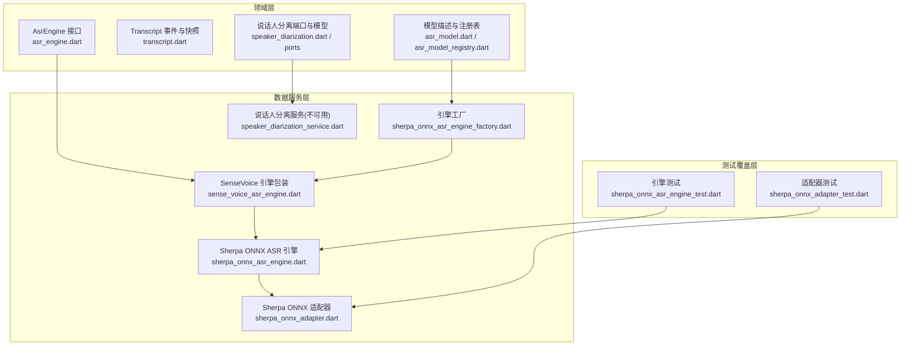
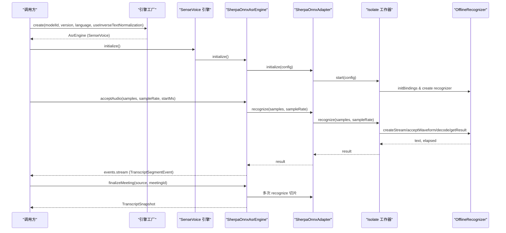
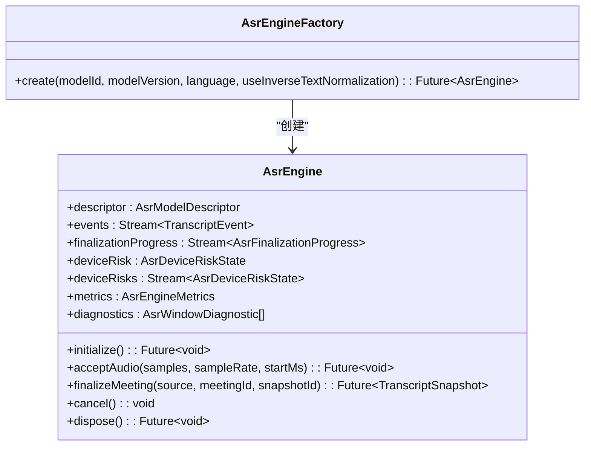
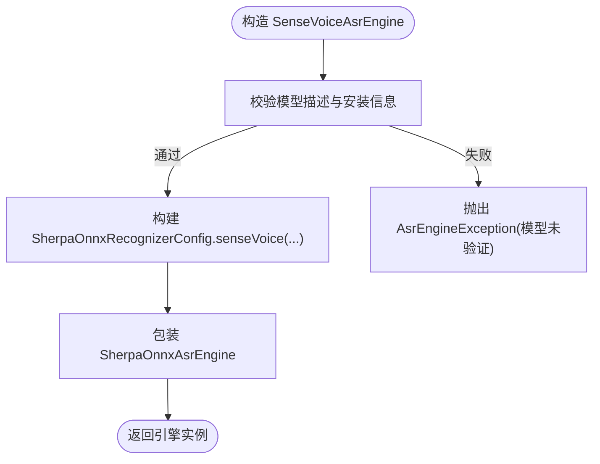
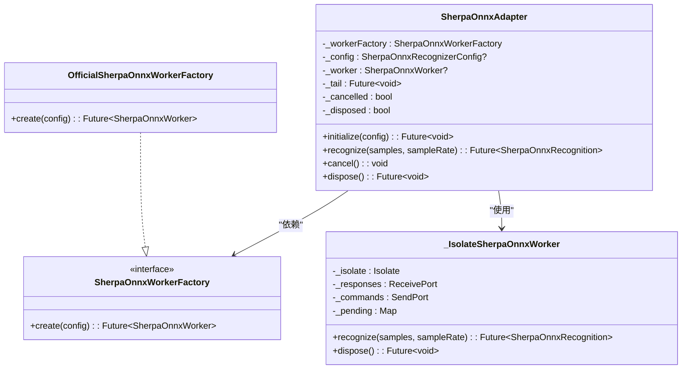
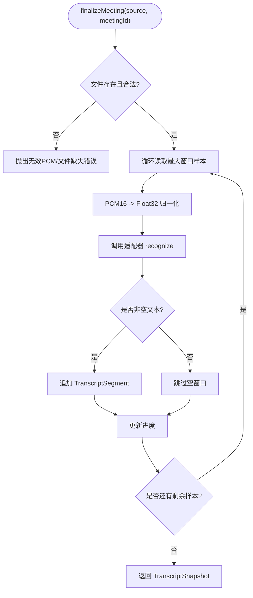
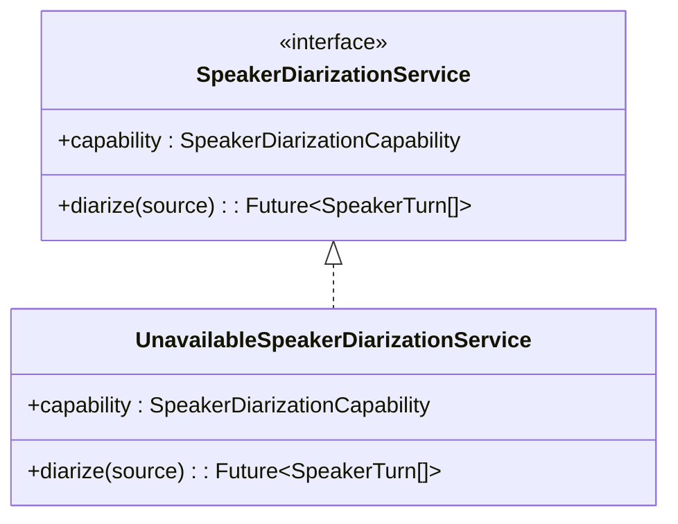
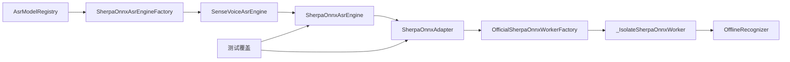

# 语音识别系统

<cite>
**本文引用的文件**
- [lib/domain/ports/asr_engine.dart](file://lib/domain/ports/asr_engine.dart)
- [lib/data/services/asr/sense_voice_asr_engine.dart](file://lib/data/services/asr/sense_voice_asr_engine.dart)
- [lib/data/services/asr/sherpa_onnx/sherpa_onnx_adapter.dart](file://lib/data/services/asr/sherpa_onnx/sherpa_onnx_adapter.dart)
- [lib/data/services/asr/sherpa_onnx/sherpa_onnx_asr_engine.dart](file://lib/data/services/asr/sherpa_onnx/sherpa_onnx_asr_engine.dart)
- [lib/data/services/asr/sherpa_onnx_asr_engine_factory.dart](file://lib/data/services/asr/sherpa_onnx_asr_engine_factory.dart)
- [lib/domain/models/asr_model.dart](file://lib/domain/models/asr_model.dart)
- [lib/domain/models/asr_model_registry.dart](file://lib/domain/models/asr_model_registry.dart)
- [lib/domain/models/transcript.dart](file://lib/domain/models/transcript.dart)
- [lib/domain/models/speaker_diarization.dart](file://lib/domain/models/speaker_diarization.dart)
- [lib/domain/ports/speaker_diarization.dart](file://lib/domain/ports/speaker_diarization.dart)
- [lib/data/services/diarization/speaker_diarization_service.dart](file://lib/data/services/diarization/speaker_diarization_service.dart)
- [test/data/services/asr/sherpa_onnx/sherpa_onnx_asr_engine_test.dart](file://test/data/services/asr/sherpa_onnx/sherpa_onnx_asr_engine_test.dart)
- [test/data/services/asr/sherpa_onnx/sherpa_onnx_adapter_test.dart](file://test/data/services/asr/sherpa_onnx/sherpa_onnx_adapter_test.dart)
</cite>

## 更新摘要
**所做更改**
- 新增 SherpaOnnxAsrEngine 测试覆盖范围说明，包括预览窗口输出、空识别结果处理、无效窗口验证等
- 更新实时转录和最终转录的详细实现细节
- 增强设备风险监控和错误处理机制的说明
- 补充 PCM16 解码和窗口验证的具体实现
- 完善取消验证和资源管理的测试覆盖

## 目录
1. [简介](#简介)
2. [项目结构](#项目结构)
3. [核心组件](#核心组件)
4. [架构总览](#架构总览)
5. [详细组件分析](#详细组件分析)
6. [依赖关系分析](#依赖关系分析)
7. [性能与内存管理](#性能与内存管理)
8. [故障排查指南](#故障排查指南)
9. [结论](#结论)
10. [附录](#附录)

## 简介
本文件面向会迹项目的语音识别（ASR）子系统，系统性阐述 ASR 引擎抽象接口、SenseVoice 引擎集成、Sherpa ONNX 适配器封装、实时与最终转录流程差异、说话人分离能力现状与扩展点、结果格式化与后处理逻辑，以及多引擎切换配置、性能调优与内存管理策略。文档以代码级事实为依据，辅以可视化图示，帮助开发者快速理解并正确使用该子系统。

**更新** 新增了全面的测试覆盖范围，包括预览窗口输出、空识别结果处理、无效窗口验证、Worker推理失败映射、PCM16解码、设备风险监控和取消验证等功能。

## 项目结构
ASR 子系统采用"领域端口 + 数据服务实现"的分层设计：
- 领域端口定义统一接口与数据结构（如 AsrEngine、TranscriptEvent、AsrModelDescriptor 等）。
- 数据服务提供具体实现（SenseVoice 引擎、Sherpa ONNX 适配器与运行时初始化、工厂装配等）。
- 模型注册表集中声明可用模型及其能力与约束。
- 说话人分离通过独立端口与服务实现，当前 Alpha 版本为不可用占位。

**图表来源**
- [lib/domain/ports/asr_engine.dart:133-175](file://lib/domain/ports/asr_engine.dart#L133-L175)
- [lib/domain/models/transcript.dart:1-133](file://lib/domain/models/transcript.dart#L1-L133)
- [lib/domain/models/asr_model.dart:1-54](file://lib/domain/models/asr_model.dart#L1-L54)
- [lib/domain/models/asr_model_registry.dart:1-69](file://lib/domain/models/asr_model_registry.dart#L1-L69)
- [lib/data/services/asr/sense_voice_asr_engine.dart:16-85](file://lib/data/services/asr/sense_voice_asr_engine.dart#L16-L85)
- [lib/data/services/asr/sherpa_onnx/sherpa_onnx_adapter.dart:125-274](file://lib/data/services/asr/sherpa_onnx/sherpa_onnx_adapter.dart#L125-L274)
- [lib/data/services/asr/sherpa_onnx/sherpa_onnx_asr_engine.dart:19-107](file://lib/data/services/asr/sherpa_onnx/sherpa_onnx_asr_engine.dart#L19-L107)
- [lib/data/services/asr/sherpa_onnx_asr_engine_factory.dart:12-98](file://lib/data/services/asr/sherpa_onnx_asr_engine_factory.dart#L12-L98)
- [lib/data/services/diarization/speaker_diarization_service.dart:10-26](file://lib/data/services/diarization/speaker_diarization_service.dart#L10-L26)
- [test/data/services/asr/sherpa_onnx/sherpa_onnx_asr_engine_test.dart:1-398](file://test/data/services/asr/sherpa_onnx/sherpa_onnx_asr_engine_test.dart#L1-L398)
- [test/data/services/asr/sherpa_onnx/sherpa_onnx_adapter_test.dart:1-212](file://test/data/services/asr/sherpa_onnx/sherpa_onnx_adapter_test.dart#L1-L212)

**章节来源**
- [lib/domain/ports/asr_engine.dart:133-175](file://lib/domain/ports/asr_engine.dart#L133-L175)
- [lib/data/services/asr/sense_voice_asr_engine.dart:16-85](file://lib/data/services/asr/sense_voice_asr_engine.dart#L16-L85)
- [lib/data/services/asr/sherpa_onnx/sherpa_onnx_adapter.dart:125-274](file://lib/data/services/asr/sherpa_onnx/sherpa_onnx_adapter.dart#L125-L274)
- [lib/data/services/asr/sherpa_onnx/sherpa_onnx_asr_engine.dart:19-107](file://lib/data/services/asr/sherpa_onnx/sherpa_onnx_asr_engine.dart#L19-L107)
- [lib/data/services/asr/sherpa_onnx_asr_engine_factory.dart:12-98](file://lib/data/services/asr/sherpa_onnx_asr_engine_factory.dart#L12-L98)
- [lib/domain/models/asr_model_registry.dart:29-51](file://lib/domain/models/asr_model_registry.dart#L29-L51)

## 核心组件
- AsrEngine 抽象接口：统一方法签名与参数规范，包括 initialize、acceptAudio、finalizeMeeting、events、finalizationProgress、deviceRisk/deviceRisks、metrics、diagnostics、cancel、dispose。
- Transcript 事件与快照：TranscriptSegmentEvent 用于流式片段推送；TranscriptSnapshot 用于最终转录结果聚合与排序。
- 模型描述与注册表：AsrModelDescriptor 描述模型 ID、版本、语言、能力、安装类型与字节大小；AsrModelRegistry.alpha 提供默认 SenseVoice 模型。
- Sherpa ONNX 适配器：隔离原生推理调用，使用 Isolate 执行 OfflineRecognizer，屏蔽平台细节。
- SherpaOnnxAsrEngine：将适配器封装为 AsrEngine 实现，负责窗口切分、指标统计、错误映射、设备风险检查与最终转录批处理。
- SenseVoiceAsrEngine：对 SherpaOnnxAsrEngine 的轻量包装，固定 SenseVoice 配置与校验。
- 引擎工厂：根据已确认的 modelId/version 组装具体引擎，不做回退与 UI 状态耦合。
- 说话人分离：当前为不可用占位，后续可通过端口接入本地或云端实现。

**更新** 新增了全面的测试覆盖，确保所有核心组件的功能正确性和稳定性。

**章节来源**
- [lib/domain/ports/asr_engine.dart:133-175](file://lib/domain/ports/asr_engine.dart#L133-L175)
- [lib/domain/models/transcript.dart:1-133](file://lib/domain/models/transcript.dart#L1-L133)
- [lib/domain/models/asr_model_registry.dart:29-51](file://lib/domain/models/asr_model_registry.dart#L29-L51)
- [lib/data/services/asr/sherpa_onnx/sherpa_onnx_adapter.dart:125-274](file://lib/data/services/asr/sherpa_onnx/sherpa_onnx_adapter.dart#L125-L274)
- [lib/data/services/asr/sherpa_onnx/sherpa_onnx_asr_engine.dart:19-107](file://lib/data/services/asr/sherpa_onnx/sherpa_onnx_asr_engine.dart#L19-L107)
- [lib/data/services/asr/sense_voice_asr_engine.dart:16-85](file://lib/data/services/asr/sense_voice_asr_engine.dart#L16-L85)
- [lib/data/services/asr/sherpa_onnx_asr_engine_factory.dart:12-98](file://lib/data/services/asr/sherpa_onnx_asr_engine_factory.dart#L12-L98)
- [lib/data/services/diarization/speaker_diarization_service.dart:10-26](file://lib/data/services/diarization/speaker_diarization_service.dart#L10-L26)

## 架构总览
下图展示从上层调用到底层推理的完整链路：工厂创建引擎 → SenseVoice 包装 → SherpaOnnxAsrEngine 窗口化推理 → SherpaOnnxAdapter 跨 Isolate 调用 → 原生 OfflineRecognizer。

**图表来源**
- [lib/data/services/asr/sherpa_onnx_asr_engine_factory.dart:42-98](file://lib/data/services/asr/sherpa_onnx_asr_engine_factory.dart#L42-L98)
- [lib/data/services/asr/sense_voice_asr_engine.dart:16-85](file://lib/data/services/asr/sense_voice_asr_engine.dart#L16-L85)
- [lib/data/services/asr/sherpa_onnx/sherpa_onnx_asr_engine.dart:109-158](file://lib/data/services/asr/sherpa_onnx/sherpa_onnx_asr_engine.dart#L109-L158)
- [lib/data/services/asr/sherpa_onnx/sherpa_onnx_adapter.dart:144-161](file://lib/data/services/asr/sherpa_onnx/sherpa_onnx_adapter.dart#L144-L161)
- [lib/data/services/asr/sherpa_onnx/sherpa_onnx_adapter.dart:471-560](file://lib/data/services/asr/sherpa_onnx/sherpa_onnx_adapter.dart#L471-L560)

## 详细组件分析

### ASR 引擎抽象接口与参数规范
- 统一入口：initialize、acceptAudio、finalizeMeeting、cancel、dispose。
- 事件与进度：events（TranscriptEvent）、finalizationProgress（AsrFinalizationProgress）。
- 设备风险：deviceRisk、deviceRisks（支持/受限/不支持，内存压力/热状态）。
- 指标与诊断：metrics（RTF、计数、时长）、diagnostics（窗口诊断）。
- 参数规范：acceptAudio 要求 Float32List、sampleRate=16kHz、startMs≥0；finalizeMeeting 要求 AudioSource 采样率与声道数匹配。

**图表来源**
- [lib/domain/ports/asr_engine.dart:133-175](file://lib/domain/ports/asr_engine.dart#L133-L175)

**章节来源**
- [lib/domain/ports/asr_engine.dart:133-175](file://lib/domain/ports/asr_engine.dart#L133-L175)

### SenseVoice 引擎集成与初始化
- SenseVoiceAsrEngine 作为门面，固定使用 SherpaOnnxAsrEngine，并注入 SenseVoice 专用配置（modelPath、tokensPath、language=auto、useInverseTextNormalization=true）。
- 构造时进行严格校验：模型 ID、安装类型、语言、反规范化开关、安装路径与字节大小必须与注册表一致，否则抛出异常提示用户下载模型。

**图表来源**
- [lib/data/services/asr/sense_voice_asr_engine.dart:16-85](file://lib/data/services/asr/sense_voice_asr_engine.dart#L16-L85)
- [lib/data/services/asr/sense_voice_asr_engine.dart:87-116](file://lib/data/services/asr/sense_voice_asr_engine.dart#L87-L116)

**章节来源**
- [lib/data/services/asr/sense_voice_asr_engine.dart:16-85](file://lib/data/services/asr/sense_voice_asr_engine.dart#L16-L85)
- [lib/data/services/asr/sense_voice_asr_engine.dart:87-116](file://lib/data/services/asr/sense_voice_asr_engine.dart#L87-L116)

### Sherpa ONNX 适配器：作用与工作原理
- 作用：将 SenseVoice 模型封装为标准接口，屏蔽原生 sherpa_onnx 包细节，隔离推理线程（Isolate），并提供统一的错误映射与生命周期管理。
- 工作原理：
  - 通过 OfficialSherpaOnnxWorkerFactory 启动 Isolate，在子进程中初始化 OfflineRecognizer。
  - 主进程通过消息协议发送 recognize/dispose 请求，子进程返回文本、耗时与错误类型。
  - 适配器维护队列尾 _tail，保证推理串行化，避免并发冲突。
  - 配置类 SherpaOnnxRecognizerConfig 指定模型路径、token 路径、线程数、语言与反规范化开关。

**图表来源**
- [lib/data/services/asr/sherpa_onnx/sherpa_onnx_adapter.dart:125-274](file://lib/data/services/asr/sherpa_onnx/sherpa_onnx_adapter.dart#L125-274)
- [lib/data/services/asr/sherpa_onnx/sherpa_onnx_adapter.dart:276-283](file://lib/data/services/asr/sherpa_onnx/sherpa_onnx_adapter.dart#L276-283)
- [lib/data/services/asr/sherpa_onnx/sherpa_onnx_adapter.dart:285-469](file://lib/data/services/asr/sherpa_onnx/sherpa_onnx_adapter.dart#L285-469)

**章节来源**
- [lib/data/services/asr/sherpa_onnx/sherpa_onnx_adapter.dart:125-274](file://lib/data/services/asr/sherpa_onnx/sherpa_onnx_adapter.dart#L125-274)
- [lib/data/services/asr/sherpa_onnx/sherpa_onnx_adapter.dart:471-560](file://lib/data/services/asr/sherpa_onnx/sherpa_onnx_adapter.dart#L471-560)

### SherpaOnnxAsrEngine：实时与最终转录

#### 实时转录（acceptAudio）
- **预览窗口输出**：成功识别后发出 TranscriptSegmentEvent，包含 segmentId（格式：preview-{sequence}-{startMs}-{endMs}）、时间区间、修剪后的文本、模型信息与 isFinalForWindow=true。
- **窗口校验**：采样率必须为 16kHz，窗口长度不超过 15 秒（最大样本数常量控制）。
- **推理串行化**：通过 _enqueue 与 _operationTail 保证顺序执行。
- **指标统计**：累计音频时长、推理时长、窗口计数与 RTF。

#### 空识别结果处理
- 当识别结果为空字符串时，不发布任何事件，但记录为空窗口指标。
- 增加 _emptyWindowCount 计数器，并在 diagnostics 中标记为 AsrWindowOutcome.empty。
- 测试验证：空结果不会触发事件流，但 metrics.emptyWindowCount 会增加。

#### 无效窗口验证
- **采样率验证**：必须为 16kHz，否则抛出 invalid_audio_window 错误。
- **样本数量验证**：不能为空，否则抛出 invalid_audio_window 错误。
- **时间戳验证**：startMs 必须 ≥ 0，否则抛出 invalid_audio_window 错误。
- **窗口长度验证**：不能超过 sherpaOnnxMaximumWindowSamples（约 240k 样本），否则抛出 window_too_long 错误。
- **提前拒绝**：所有验证在进入 worker 之前完成，避免不必要的资源消耗。

#### 最终转录（finalizeMeeting）
- **PCM16 解码**：读取 PCM16 文件，按最大窗口切片循环解码，生成多个 TranscriptSegment。
- **进度流**：processing/completed/canceled/failed 阶段与完成样本数/总样本数。
- **结果聚合**：按时间排序去重，形成 TranscriptSnapshot。
- **时间轴生成**：每个窗口生成确定的 startMs 和 endMs，确保时间连续性。

**图表来源**
- [lib/data/services/asr/sherpa_onnx/sherpa_onnx_asr_engine.dart:174-294](file://lib/data/services/asr/sherpa_onnx/sherpa_onnx_asr_engine.dart#L174-294)
- [lib/data/services/asr/sherpa_onnx/sherpa_onnx_asr_engine.dart:647-654](file://lib/data/services/asr/sherpa_onnx/sherpa_onnx_asr_engine.dart#L647-654)

#### 设备风险监控
- **初始化前检查**：在创建 worker 之前检测设备支持状态。
- **实时风险监测**：通过 AsrDeviceRiskMonitor 监听设备状态变化。
- **风险阻断**：不支持的设备、临界内存压力或严重热状态会阻止推理操作。
- **风险状态流**：deviceRisks 流实时推送设备风险状态变化。

#### 取消验证机制
- **操作取消**：cancel() 方法设置 _cancelled 标志并通知适配器。
- **进行中终止**：进行中的最终转录会被中断并发布 canceled 终态。
- **后续拒绝**：取消后继续操作会抛出 cancelled 错误。
- **幂等释放**：dispose() 方法确保资源释放的幂等性。

**更新** 新增了完整的测试覆盖，验证了预览窗口输出、空识别结果处理、无效窗口验证、Worker推理失败映射、PCM16解码、设备风险监控和取消验证等所有关键功能。

**章节来源**
- [lib/data/services/asr/sherpa_onnx/sherpa_onnx_asr_engine.dart:109-158](file://lib/data/services/asr/sherpa_onnx/sherpa_onnx_asr_engine.dart#L109-158)
- [lib/data/services/asr/sherpa_onnx/sherpa_onnx_asr_engine.dart:174-294](file://lib/data/services/asr/sherpa_onnx/sherpa_onnx_asr_engine.dart#L174-294)
- [lib/data/services/asr/sherpa_onnx/sherpa_onnx_asr_engine.dart:341-430](file://lib/data/services/asr/sherpa_onnx/sherpa_onnx_asr_engine.dart#L341-430)
- [lib/data/services/asr/sherpa_onnx/sherpa_onnx_asr_engine.dart:432-499](file://lib/data/services/asr/sherpa_onnx/sherpa_onnx_asr_engine.dart#L432-499)
- [lib/data/services/asr/sherpa_onnx/sherpa_onnx_asr_engine.dart:533-576](file://lib/data/services/asr/sherpa_onnx/sherpa_onnx_asr_engine.dart#L533-576)
- [lib/data/services/asr/sherpa_onnx/sherpa_onnx_asr_engine.dart:578-607](file://lib/data/services/asr/sherpa_onnx/sherpa_onnx_asr_engine.dart#L578-607)
- [test/data/services/asr/sherpa_onnx/sherpa_onnx_asr_engine_test.dart:32-63](file://test/data/services/asr/sherpa_onnx/sherpa_onnx_asr_engine_test.dart#L32-63)
- [test/data/services/asr/sherpa_onnx/sherpa_onnx_asr_engine_test.dart:65-83](file://test/data/services/asr/sherpa_onnx/sherpa_onnx_asr_engine_test.dart#L65-83)
- [test/data/services/asr/sherpa_onnx/sherpa_onnx_asr_engine_test.dart:85-103](file://test/data/services/asr/sherpa_onnx/sherpa_onnx_asr_engine_test.dart#L85-103)
- [test/data/services/asr/sherpa_onnx/sherpa_onnx_asr_engine_test.dart:105-132](file://test/data/services/asr/sherpa_onnx/sherpa_onnx_asr_engine_test.dart#L105-132)
- [test/data/services/asr/sherpa_onnx/sherpa_onnx_asr_engine_test.dart:134-180](file://test/data/services/asr/sherpa_onnx/sherpa_onnx_asr_engine_test.dart#L134-180)
- [test/data/services/asr/sherpa_onnx/sherpa_onnx_asr_engine_test.dart:182-210](file://test/data/services/asr/sherpa_onnx/sherpa_onnx_asr_engine_test.dart#L182-210)
- [test/data/services/asr/sherpa_onnx/sherpa_onnx_asr_engine_test.dart:212-234](file://test/data/services/asr/sherpa_onnx/sherpa_onnx_asr_engine_test.dart#L212-234)

### 说话人分离：现状与扩展点
- 当前 Alpha 版本未配置可发布的本地说话人模型，服务实现为 UnavailableSpeakerDiarizationService，capability 标记不可用，调用 diarize 直接抛异常。
- 扩展方式：遵循 SpeakerDiarizationService/SpeakerDiarizationRunner 端口，后续可实现本地或云端方案，并在 UI 中通过开关启用/禁用。

**图表来源**
- [lib/domain/ports/speaker_diarization.dart:5-26](file://lib/domain/ports/speaker_diarization.dart#L5-26)
- [lib/data/services/diarization/speaker_diarization_service.dart:10-26](file://lib/data/services/diarization/speaker_diarization_service.dart#L10-26)

**章节来源**
- [lib/domain/models/speaker_diarization.dart:1-50](file://lib/domain/models/speaker_diarization.dart#L1-50)
- [lib/domain/ports/speaker_diarization.dart:5-26](file://lib/domain/ports/speaker_diarization.dart#L5-26)
- [lib/data/services/diarization/speaker_diarization_service.dart:10-26](file://lib/data/services/diarization/speaker_diarization_service.dart#L10-26)

### 转录结果格式与后处理
- 流式片段：TranscriptSegmentEvent 携带 segmentId、时间区间、文本、模型信息与 isFinalForWindow。
- 最终快照：TranscriptSnapshot 包含 segments 列表，内部按 startMs、endMs、id 排序并去重，确保同一快照不混合不同模型/版本。
- 片段字段：可选 speakerId、confidence，便于后续说话人标注与置信度过滤。

**更新** 测试结果验证了预览窗口输出的 segmentId 格式为 'preview-{sequence}-{startMs}-{endMs}'，确保每个窗口都有唯一的标识符。

**章节来源**
- [lib/domain/models/transcript.dart:1-133](file://lib/domain/models/transcript.dart#L1-133)

### 多引擎切换与配置
- 通过 AsrEngineFactory.create(modelId, modelVersion, language, useInverseTextNormalization) 创建引擎。
- SherpaOnnxAsrEngineFactory 仅支持已注册的 SenseVoice 模型，严格校验版本与配置一致性，失败时提示选择其他模型或下载模型。
- 若未来新增引擎，可在 Registry 中注册新模型，并在工厂中分支创建对应实现。

**章节来源**
- [lib/data/services/asr/sherpa_onnx_asr_engine_factory.dart:42-98](file://lib/data/services/asr/sherpa_onnx_asr_engine_factory.dart#L42-98)
- [lib/domain/models/asr_model_registry.dart:29-51](file://lib/domain/models/asr_model_registry.dart#L29-51)

## 依赖关系分析
- AsrEngine 接口被 SenseVoiceAsrEngine 与 SherpaOnnxAsrEngine 实现。
- SherpaOnnxAsrEngine 依赖 SherpaOnnxAdapter，后者依赖 SherpaOnnxWorkerFactory（默认官方实现）。
- 模型注册表为工厂提供模型描述，工厂负责装配安装信息与引擎实例。
- 说话人分离服务与 ASR 引擎解耦，通过端口与模型对象交互。

**图表来源**
- [lib/domain/models/asr_model_registry.dart:29-51](file://lib/domain/models/asr_model_registry.dart#L29-51)
- [lib/data/services/asr/sherpa_onnx_asr_engine_factory.dart:42-98](file://lib/data/services/asr/sherpa_onnx_asr_engine_factory.dart#L42-98)
- [lib/data/services/asr/sense_voice_asr_engine.dart:16-85](file://lib/data/services/asr/sense_voice_asr_engine.dart#L16-85)
- [lib/data/services/asr/sherpa_onnx/sherpa_onnx_asr_engine.dart:19-107](file://lib/data/services/asr/sherpa_onnx/sherpa_onnx_asr_engine.dart#L19-107)
- [lib/data/services/asr/sherpa_onnx/sherpa_onnx_adapter.dart:125-274](file://lib/data/services/asr/sherpa_onnx/sherpa_onnx_adapter.dart#L125-274)
- [lib/data/services/asr/sherpa_onnx/sherpa_onnx_adapter.dart:276-283](file://lib/data/services/asr/sherpa_onnx/sherpa_onnx_adapter.dart#L276-283)
- [lib/data/services/asr/sherpa_onnx/sherpa_onnx_adapter.dart:285-469](file://lib/data/services/asr/sherpa_onnx/sherpa_onnx_adapter.dart#L285-469)
- [test/data/services/asr/sherpa_onnx/sherpa_onnx_asr_engine_test.dart:1-398](file://test/data/services/asr/sherpa_onnx/sherpa_onnx_asr_engine_test.dart#L1-398)
- [test/data/services/asr/sherpa_onnx/sherpa_onnx_adapter_test.dart:1-212](file://test/data/services/asr/sherpa_onnx/sherpa_onnx_adapter_test.dart#L1-212)

**章节来源**
- [lib/domain/models/asr_model_registry.dart:29-51](file://lib/domain/models/asr_model_registry.dart#L29-51)
- [lib/data/services/asr/sherpa_onnx_asr_engine_factory.dart:42-98](file://lib/data/services/asr/sherpa_onnx_asr_engine_factory.dart#L42-98)
- [lib/data/services/asr/sense_voice_asr_engine.dart:16-85](file://lib/data/services/asr/sense_voice_asr_engine.dart#L16-85)
- [lib/data/services/asr/sherpa_onnx/sherpa_onnx_asr_engine.dart:19-107](file://lib/data/services/asr/sherpa_onnx/sherpa_onnx_asr_engine.dart#L19-107)
- [lib/data/services/asr/sherpa_onnx/sherpa_onnx_adapter.dart:125-274](file://lib/data/services/asr/sherpa_onnx/sherpa_onnx_adapter.dart#L125-274)

## 性能与内存管理
- 窗口大小限制：最大 15 秒（约 240k 样本），避免单次推理过大导致内存峰值与延迟。
- 推理串行化：适配器与引擎均使用队列尾机制，防止并发竞争与资源争用。
- 指标监控：AsrEngineMetrics 提供 RTF（推理时长/音频时长）与窗口计数，便于评估性能退化。
- 设备风险：内存压力临界或热状态严重时会阻止推理，避免崩溃与降频。
- 线程与提供者：适配器配置 numThreads 与 provider='cpu'，可根据设备调整线程数。
- 内存释放：Isolate 工作器在 dispose 时释放识别器与流，主进程关闭所有订阅与端口。

**更新** 测试覆盖了并发场景下的性能表现，确保在并发初始化时只创建一个 worker，并且释放操作保持幂等性。

建议：
- 在高负载设备上降低 numThreads 或缩短窗口长度以降低峰值内存。
- 监控 metrics.realTimeFactor，当 >1 时需优化输入管线或降级策略。
- 结合设备风险流，动态暂停或重试推理，提升鲁棒性。

**章节来源**
- [lib/data/services/asr/sherpa_onnx/sherpa_onnx_asr_engine.dart:12-15](file://lib/data/services/asr/sherpa_onnx/sherpa_onnx_asr_engine.dart#L12-15)
- [lib/data/services/asr/sherpa_onnx/sherpa_onnx_asr_engine.dart:95-106](file://lib/data/services/asr/sherpa_onnx/sherpa_onnx_asr_engine.dart#L95-106)
- [lib/data/services/asr/sherpa_onnx/sherpa_onnx_adapter.dart:562-580](file://lib/data/services/asr/sherpa_onnx/sherpa_onnx_adapter.dart#L562-580)
- [lib/data/services/asr/sherpa_onnx/sherpa_onnx_adapter.dart:412-435](file://lib/data/services/asr/sherpa_onnx/sherpa_onnx_adapter.dart#L412-435)
- [test/data/services/asr/sherpa_onnx/sherpa_onnx_asr_engine_test.dart:236-261](file://test/data/services/asr/sherpa_onnx/sherpa_onnx_asr_engine_test.dart#L236-261)

## 故障排查指南
常见问题与定位要点：
- **模型未验证**：SenseVoice 构造时校验失败，需重新下载并验证模型文件。
- **设备不支持/内存压力临界/热状态严重**：设备风险检查抛出异常，应提示用户降低负载或更换设备。
- **音频窗口非法**：采样率不为 16kHz、样本为空或 startMs<0，或窗口过长。
- **最终转录失败**：PCM16 文件不存在、长度奇数或读取不完整。
- **推理失败**：适配器映射错误类型为 inference_failed，需检查 Isolate 子进程日志与错误类型。
- **取消/释放**：cancel 或 dispose 后继续操作会抛出相应异常。

**更新** 新增了详细的测试用例，验证了各种错误场景的处理：
- 无效窗口验证测试确保在 worker 调用前就拒绝非法输入
- Worker推理失败映射测试验证错误类型的正确转换
- 取消验证测试确保进行中操作的正确终止
- 设备风险监控测试验证初始化前的设备状态检查

建议：
- 捕获 AsrEngineException 并记录 failure.code 与 diagnosticContext。
- 监听 deviceRisks 流，提前规避高风险场景。
- 使用 diagnostics 列表分析窗口成功率与耗时分布。
- 参考测试用例中的错误处理模式，确保异常处理的完整性。

**章节来源**
- [lib/data/services/asr/sense_voice_asr_engine.dart:87-116](file://lib/data/services/asr/sense_voice_asr_engine.dart#L87-116)
- [lib/data/services/asr/sherpa_onnx/sherpa_onnx_asr_engine.dart:432-499](file://lib/data/services/asr/sherpa_onnx/sherpa_onnx_asr_engine.dart#L432-499)
- [lib/data/services/asr/sherpa_onnx/sherpa_onnx_asr_engine.dart:533-576](file://lib/data/services/asr/sherpa_onnx/sherpa_onnx_asr_engine.dart#L533-576)
- [lib/data/services/asr/sherpa_onnx/sherpa_onnx_asr_engine.dart:578-607](file://lib/data/services/asr/sherpa_onnx/sherpa_onnx_asr_engine.dart#L578-607)
- [lib/data/services/asr/sherpa_onnx/sherpa_onnx_adapter.dart:243-274](file://lib/data/services/asr/sherpa_onnx/sherpa_onnx_adapter.dart#L243-274)
- [test/data/services/asr/sherpa_onnx/sherpa_onnx_asr_engine_test.dart:85-132](file://test/data/services/asr/sherpa_onnx/sherpa_onnx_asr_engine_test.dart#L85-132)
- [test/data/services/asr/sherpa_onnx/sherpa_onnx_asr_engine_test.dart:182-234](file://test/data/services/asr/sherpa_onnx/sherpa_onnx_asr_engine_test.dart#L182-234)

## 结论
本系统通过清晰的领域端口与数据服务分层，实现了 SenseVoice 模型的标准化接入与稳定推理。Sherpa ONNX 适配器有效隔离了原生依赖与线程边界，提供一致的接口与错误语义。实时与最终转录分别满足低延迟与高可靠需求，设备风险与指标体系保障运行稳定性。说话人分离当前为不可用占位，预留扩展点以便后续接入。整体架构具备良好可扩展性与可观测性，适合在多平台 Flutter 应用中部署。

**更新** 新增的全面测试覆盖确保了系统的稳定性和可靠性，包括预览窗口输出、空识别结果处理、无效窗口验证、Worker推理失败映射、PCM16解码、设备风险监控和取消验证等关键功能的完整测试。

## 附录
- 模型注册表默认 SenseVoice：语言 auto、能力 offline/meeting-preview/final-transcript/auto-language/inverse-text-normalization/required-runtime。
- 关键常量：采样率 16kHz、最大窗口 15 秒。
- 事件与快照：TranscriptSegmentEvent 与 TranscriptSnapshot 的结构与约束。
- **新增测试覆盖**：完整的单元测试确保所有核心功能的正确性和稳定性。

**章节来源**
- [lib/domain/models/asr_model_registry.dart:29-51](file://lib/domain/models/asr_model_registry.dart#L29-51)
- [lib/data/services/asr/sherpa_onnx/sherpa_onnx_asr_engine.dart:12-15](file://lib/data/services/asr/sherpa_onnx/sherpa_onnx_asr_engine.dart#L12-15)
- [lib/domain/models/transcript.dart:1-133](file://lib/domain/models/transcript.dart#L1-133)
- [test/data/services/asr/sherpa_onnx/sherpa_onnx_asr_engine_test.dart:1-398](file://test/data/services/asr/sherpa_onnx/sherpa_onnx_asr_engine_test.dart#L1-398)
- [test/data/services/asr/sherpa_onnx/sherpa_onnx_adapter_test.dart:1-212](file://test/data/services/asr/sherpa_onnx/sherpa_onnx_adapter_test.dart#L1-212)