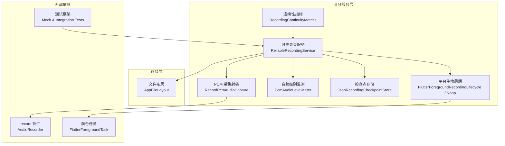
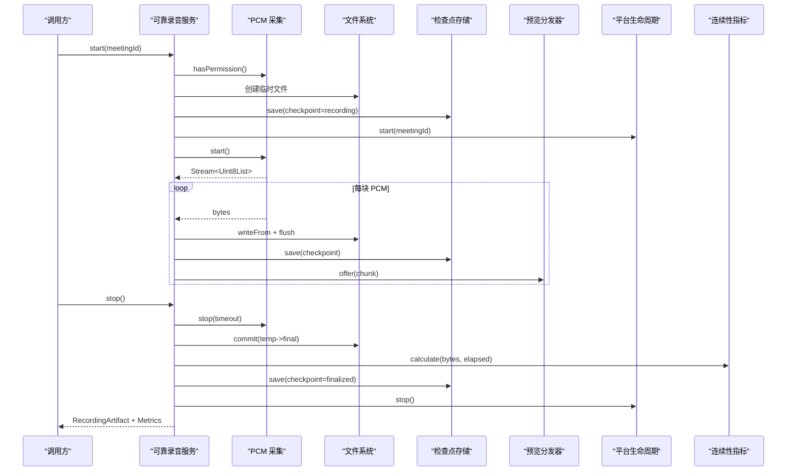
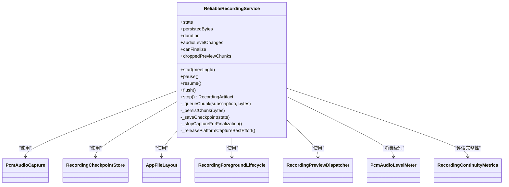
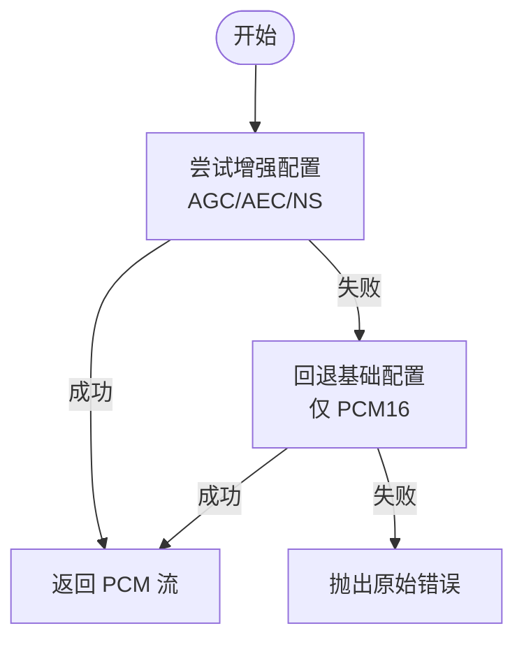
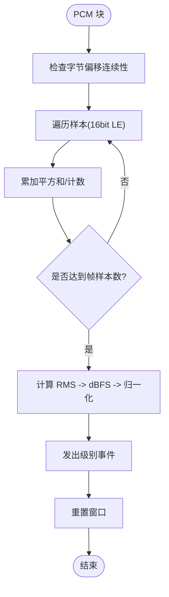
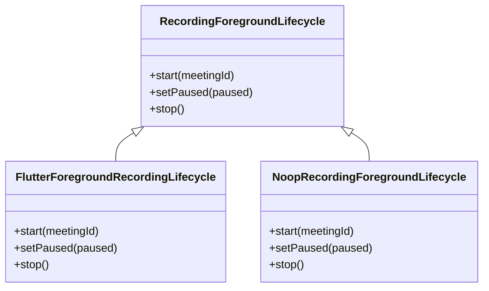
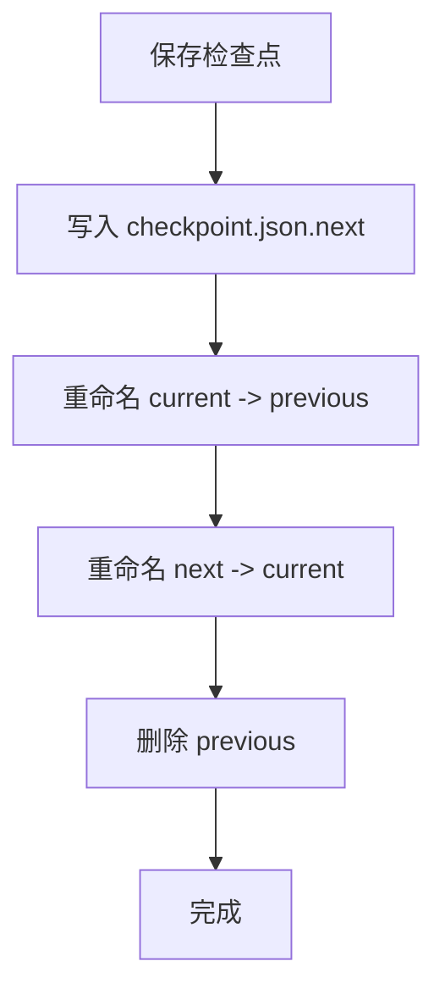
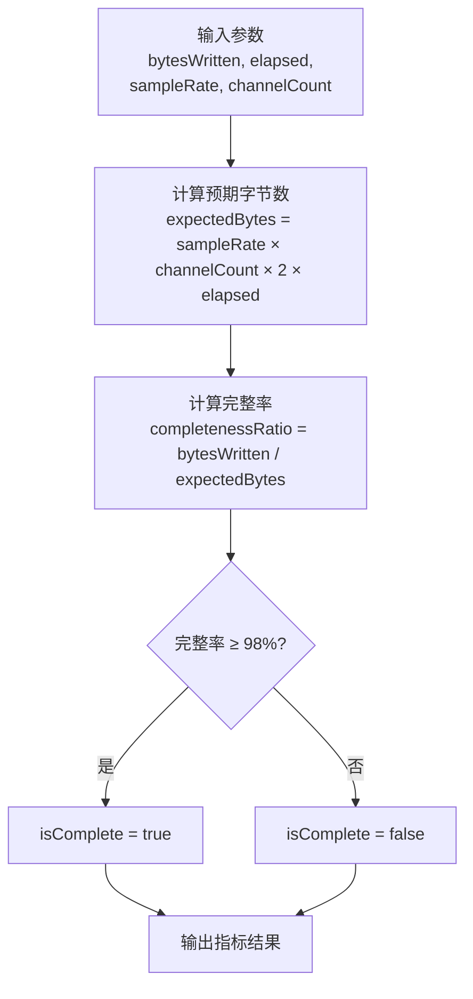
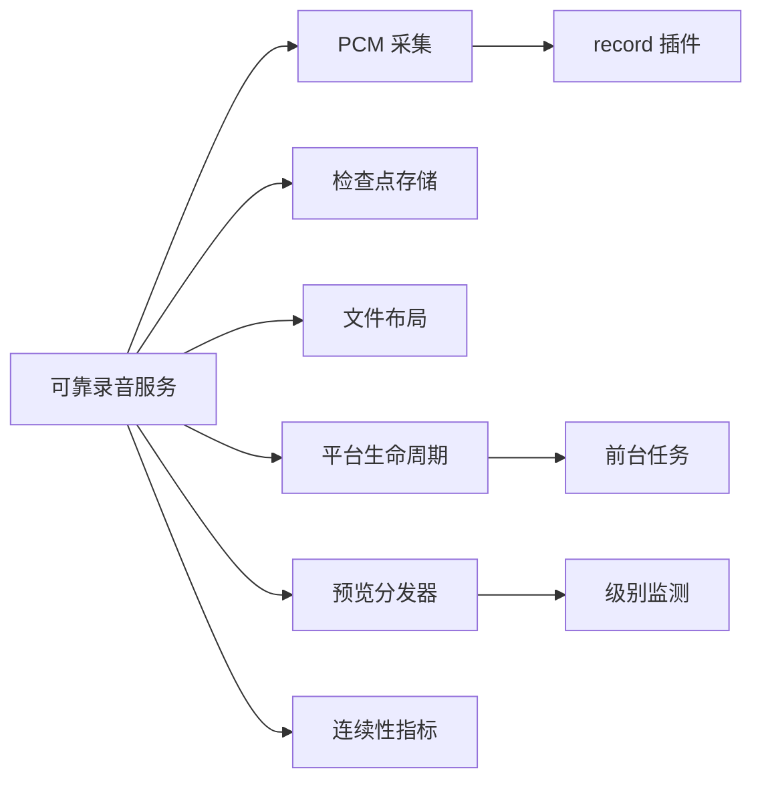
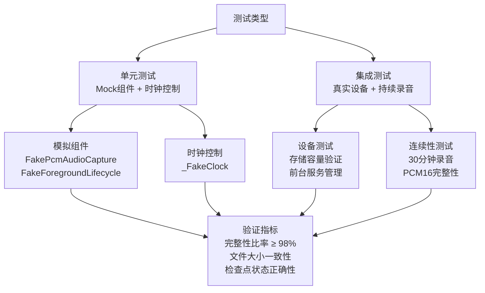

# 音频录制系统

<cite>
**本文引用的文件**   
- [reliable_recording_service.dart](file://lib/data/services/audio/reliable_recording_service.dart)
- [pcm_audio_level_meter.dart](file://lib/data/services/audio/pcm_audio_level_meter.dart)
- [recording_checkpoint_store.dart](file://lib/data/services/audio/recording_checkpoint_store.dart)
- [record_pcm_audio_capture.dart](file://lib/data/services/audio/record_pcm_audio_capture.dart)
- [recording_ports.dart](file://lib/data/services/audio/recording_ports.dart)
- [flutter_foreground_recording_lifecycle.dart](file://lib/data/services/audio/flutter_foreground_recording_lifecycle.dart)
- [platform_recording_foreground_lifecycle.dart](file://lib/data/services/audio/platform_recording_foreground_lifecycle.dart)
- [app_file_layout.dart](file://lib/data/services/storage/app_file_layout.dart)
- [recording_continuity_metrics.dart](file://lib/data/services/audio/spike/recording_continuity_metrics.dart)
- [Step_07_可靠录音与崩溃恢复.md](file://docs/quality/Step_07_可靠录音与崩溃恢复.md)
- [reliable_recording_test.dart](file://integration_test/reliable_recording_test.dart)
- [reliable_recording_service_test.dart](file://test/data/services/audio/reliable_recording_service_test.dart)
- [recording_continuity_metrics_test.dart](file://test/data/services/audio/spike/recording_continuity_metrics_test.dart)
</cite>

## 更新摘要
**变更内容**   
- 新增录音连续性指标评估功能，支持PCM16格式完整性验证
- 增强集成测试覆盖，包含30分钟持续录音稳定性验证
- 扩展单元测试场景，涵盖权限检查、存储空间验证、异常处理等边界情况
- 完善测试框架，提供模拟组件和时钟控制机制

## 目录
1. [简介](#简介)
2. [项目结构](#项目结构)
3. [核心组件](#核心组件)
4. [架构总览](#架构总览)
5. [详细组件分析](#详细组件分析)
6. [依赖关系分析](#依赖关系分析)
7. [性能考量](#性能考量)
8. [故障排查指南](#故障排查指南)
9. [测试与验证](#测试与验证)
10. [结论](#结论)
11. [附录](#附录)

## 简介
本文件为会迹项目的"音频录制系统"提供系统化、可落地的技术文档。围绕"可靠录音服务"的架构设计，阐述如何确保录音过程的稳定性与可靠性；详细说明 PCM 音频捕获与处理流程（采样率、声道、数据格式）；解释音频级别监测（实时音量检测与波形数据生成）；描述平台特定的生命周期管理（Android 前台服务、iOS 后台模式）；说明中断恢复机制（检查点保存与断点续录）；给出音频文件的存储策略与命名规范；并提供配置选项、性能优化建议与常见问题排查方法。**最新更新**增加了录音连续性指标评估和增强的测试覆盖机制，确保在复杂环境下仍能保持事实音频的完整性与一致性。

## 项目结构
音频录制相关代码集中在 data/services/audio 层，配合 storage 层的文件布局与 domain 层的模型定义，形成清晰的职责边界：
- 可靠录音服务：协调 PCM 采集、持久化、预览分发、检查点与生命周期管理
- PCM 采集封装：基于官方 record 插件，固定 PCM16 参数并支持增强能力回退
- 音频级别监测：对已持久化的 PCM16 计算 RMS 包络，输出归一化电平
- 检查点存储：双代原子写入与按字节数/时间排序恢复
- 平台生命周期：Android 前台服务保活，iOS 由系统后台模式承载
- 文件布局：会议音频临时文件与最终事实文件分离，checkpoint 三文件原子切换
- **新增**：录音连续性指标评估，支持PCM16格式完整性验证

**图表来源**
- [reliable_recording_service.dart:1-120](file://lib/data/services/audio/reliable_recording_service.dart#L1-L120)
- [record_pcm_audio_capture.dart:1-78](file://lib/data/services/audio/record_pcm_audio_capture.dart#L1-L78)
- [pcm_audio_level_meter.dart:1-100](file://lib/data/services/audio/pcm_audio_level_meter.dart#L1-L100)
- [recording_checkpoint_store.dart:1-163](file://lib/data/services/audio/recording_checkpoint_store.dart#L1-L163)
- [flutter_foreground_recording_lifecycle.dart:1-106](file://lib/data/services/audio/flutter_foreground_recording_lifecycle.dart#L1-L106)
- [app_file_layout.dart:1-91](file://lib/data/services/storage/app_file_layout.dart#L1-L91)
- [recording_continuity_metrics.dart:1-42](file://lib/data/services/audio/spike/recording_continuity_metrics.dart#L1-L42)

## 核心组件
- 可靠录音服务 ReliableRecordingService
  - 负责权限与空间预检、打开临时文件、启动 PCM 流、队列化写入、flush、暂停/恢复、停止封存、检查点持久化、异常清理与资源释放
  - 通过 RecordingPreviewDispatcher 将已持久化的 PCM 块分发给非阻塞预览链路（如级别监测）
- PCM 采集封装 RecordPcmAudioCapture
  - 固定 16 kHz、单声道、PCM16，启用自动增益/回声消除/降噪（设备支持时），失败回退到基础配置
  - 统一 pause/resume/stop/dispose 接口
- 音频级别监测 PcmAudioLevelMeter
  - 对已持久化的 PCM16 计算 RMS，输出归一化电平与时间戳，窗口对齐丢帧保护
- 检查点存储 JsonRecordingCheckpointStore
  - 使用 next/previous/current 三文件原子切换，按 persistedBytes 与 updatedAt 排序恢复最新有效检查点
- 平台生命周期管理
  - Android：前台服务保活，通知更新暂停/运行状态
  - iOS/Windows：无操作实现，由系统或上层协调器处理
- **新增**：录音连续性指标 RecordingContinuityMetrics
  - 基于PCM16格式计算预期字节数与实际写入量的比率
  - 提供完整性判断（≥98%视为完整）和JSON序列化支持

**章节来源**
- [reliable_recording_service.dart:18-157](file://lib/data/services/audio/reliable_recording_service.dart#L18-L157)
- [record_pcm_audio_capture.dart:7-27](file://lib/data/services/audio/record_pcm_audio_capture.dart#L7-L27)
- [pcm_audio_level_meter.dart:11-67](file://lib/data/services/audio/pcm_audio_level_meter.dart#L11-L67)
- [recording_checkpoint_store.dart:79-147](file://lib/data/services/audio/recording_checkpoint_store.dart#L79-L147)
- [flutter_foreground_recording_lifecycle.dart:14-86](file://lib/data/services/audio/flutter_foreground_recording_lifecycle.dart#L14-L86)
- [recording_continuity_metrics.dart:1-42](file://lib/data/services/audio/spike/recording_continuity_metrics.dart#L1-L42)

## 架构总览
下图展示从 UI 调用到 PCM 写入与预览分发的完整时序，以及检查点与平台生命周期的交互。

**图表来源**
- [reliable_recording_service.dart:90-157](file://lib/data/services/audio/reliable_recording_service.dart#L90-L157)
- [reliable_recording_service.dart:204-260](file://lib/data/services/audio/reliable_recording_service.dart#L204-L260)
- [recording_checkpoint_store.dart:85-112](file://lib/data/services/audio/recording_checkpoint_store.dart#L85-L112)
- [flutter_foreground_recording_lifecycle.dart:19-62](file://lib/data/services/audio/flutter_foreground_recording_lifecycle.dart#L19-L62)
- [recording_continuity_metrics.dart:17-30](file://lib/data/services/audio/spike/recording_continuity_metrics.dart#L17-L30)

## 详细组件分析

### 可靠录音服务 ReliableRecordingService
- 关键职责
  - 启动阶段：权限与空间校验、避免覆盖已有事实文件、打开临时文件、首次 checkpoint、启动前台服务、启动 PCM 流
  - 写入阶段：队列化写入、逐块 flush、写入错误标记、按状态保存 checkpoint、向预览分发器投递
  - 暂停/恢复：暂停订阅与 capture、flush 输出、保存 checkpoint、更新前台服务状态
  - 停止封存：有界等待 capture.stop 与完成信号、校验空文件、关闭输出、原子提交最终文件、保存 finalized checkpoint、尽力释放资源
- 稳定性保障
  - 写入链路与预览链路解耦：预览阻塞/抛错不影响事实文件
  - 检查点双代/三代原子切换，崩溃后可恢复
  - 停止流程带超时与降级，避免 UI 卡死
- 重要路径参考
  - 启动流程：[start:90-157](file://lib/data/services/audio/reliable_recording_service.dart#L90-L157)
  - 暂停/恢复：[pause/resume:160-191](file://lib/data/services/audio/reliable_recording_service.dart#L160-L191)
  - 停止封存：[stop:204-260](file://lib/data/services/audio/reliable_recording_service.dart#L204-L260)
  - 写入队列与持久化：[_queueChunk/_persistChunk:262-316](file://lib/data/services/audio/reliable_recording_service.dart#L262-L316)
  - 检查点保存：[_saveCheckpoint:318-327](file://lib/data/services/audio/reliable_recording_service.dart#L318-L327)
  - 停止超时与资源释放：[_stopCaptureForFinalization/_releasePlatformCaptureBestEffort:356-433](file://lib/data/services/audio/reliable_recording_service.dart#L356-L433)

**图表来源**
- [reliable_recording_service.dart:18-120](file://lib/data/services/audio/reliable_recording_service.dart#L18-L120)
- [recording_ports.dart:7-31](file://lib/data/services/audio/recording_ports.dart#L7-L31)
- [recording_checkpoint_store.dart:71-77](file://lib/data/services/audio/recording_checkpoint_store.dart#L71-L77)
- [app_file_layout.dart:6-37](file://lib/data/services/storage/app_file_layout.dart#L6-L37)
- [flutter_foreground_recording_lifecycle.dart:14-31](file://lib/data/services/audio/flutter_foreground_recording_lifecycle.dart#L14-L31)
- [recording_ports.dart:86-146](file://lib/data/services/audio/recording_ports.dart#L86-L146)
- [pcm_audio_level_meter.dart:15-42](file://lib/data/services/audio/pcm_audio_level_meter.dart#L15-L42)
- [recording_continuity_metrics.dart:1-42](file://lib/data/services/audio/spike/recording_continuity_metrics.dart#L1-L42)

**章节来源**
- [reliable_recording_service.dart:90-316](file://lib/data/services/audio/reliable_recording_service.dart#L90-L316)
- [reliable_recording_service.dart:318-433](file://lib/data/services/audio/reliable_recording_service.dart#L318-L433)

### PCM 音频捕获与处理
- 参数与格式
  - 采样率：16 kHz
  - 声道：单声道
  - 编码：PCM16（little-endian）
  - 增强：自动增益、回声消除、降噪（设备支持时），失败回退到基础配置
- 中断策略
  - 使用 AudioInterruptionMode.pauseResume 保证来电/焦点变化时暂停/恢复
- 关键路径参考
  - 默认配置与回退：[meettracePcmRecordConfig/meettraceFallbackPcmRecordConfig:7-27](file://lib/data/services/audio/record_pcm_audio_capture.dart#L7-L27)
  - 启动流与回退逻辑：[startPcmStreamWithEnhancementFallback:32-44](file://lib/data/services/audio/record_pcm_audio_capture.dart#L32-L44)
  - 采集接口实现：[RecordPcmAudioCapture:46-78](file://lib/data/services/audio/record_pcm_audio_capture.dart#L46-L78)

**图表来源**
- [record_pcm_audio_capture.dart:7-27](file://lib/data/services/audio/record_pcm_audio_capture.dart#L7-L27)
- [record_pcm_audio_capture.dart:32-44](file://lib/data/services/audio/record_pcm_audio_capture.dart#L32-L44)

**章节来源**
- [record_pcm_audio_capture.dart:7-78](file://lib/data/services/audio/record_pcm_audio_capture.dart#L7-L78)

### 音频级别监测与波形数据
- 原理
  - 对已持久化的 PCM16 数据按帧（默认 100ms）计算 RMS，映射为归一化电平 [0,1]
  - 输入不连续时丢弃未完成窗口并从新块重新对齐，避免误画
- 输出
  - 事件流 RecordingAudioLevel(level, capturedThrough)
- 关键路径参考
  - 级别计算与窗口管理：[add/_emit/_resetWindow:44-99](file://lib/data/services/audio/pcm_audio_level_meter.dart#L44-L99)

**图表来源**
- [pcm_audio_level_meter.dart:44-99](file://lib/data/services/audio/pcm_audio_level_meter.dart#L44-L99)

**章节来源**
- [pcm_audio_level_meter.dart:1-100](file://lib/data/services/audio/pcm_audio_level_meter.dart#L1-L100)

### 平台特定生命周期管理
- Android
  - 使用前台服务保活，通知标题随暂停/运行状态更新
  - 请求通知权限，设置麦克风类型前台服务
- iOS/Windows
  - 无操作实现，iOS 由 AVAudioSession 与后台模式承载，Windows 开发预览无需前台服务
- 关键路径参考
  - 平台选择：[createRecordingForegroundLifecycle:8-19](file://lib/data/services/audio/platform_recording_foreground_lifecycle.dart#L8-L19)
  - Android 前台服务：[FlutterForegroundRecordingLifecycle:14-86](file://lib/data/services/audio/flutter_foreground_recording_lifecycle.dart#L14-L86)

**图表来源**
- [platform_recording_foreground_lifecycle.dart:8-19](file://lib/data/services/audio/platform_recording_foreground_lifecycle.dart#L8-L19)
- [flutter_foreground_recording_lifecycle.dart:14-86](file://lib/data/services/audio/flutter_foreground_recording_lifecycle.dart#L14-L86)
- [recording_ports.dart:25-45](file://lib/data/services/audio/recording_ports.dart#L25-L45)

**章节来源**
- [platform_recording_foreground_lifecycle.dart:1-32](file://lib/data/services/audio/platform_recording_foreground_lifecycle.dart#L1-L32)
- [flutter_foreground_recording_lifecycle.dart:1-106](file://lib/data/services/audio/flutter_foreground_recording_lifecycle.dart#L1-L106)

### 检查点保存与断点续录
- 设计要点
  - 每次写入后保存检查点，包含 meetingId、state、persistedBytes、updatedAt
  - 使用 next/previous/current 三文件原子切换，读取时优先选择字节数更大、时间更新的检查点
  - 启动恢复时对齐 PCM16 样本边界，将残留尾字节修复为完整事实音频
- 关键路径参考
  - 检查点模型与状态：[RecordingCheckpoint/RecordingCheckpointState:6-69](file://lib/data/services/audio/recording_checkpoint_store.dart#L6-L69)
  - 原子写入与恢复：[JsonRecordingCheckpointStore.save/load:85-147](file://lib/data/services/audio/recording_checkpoint_store.dart#L85-L147)
  - 服务侧保存时机：[_saveCheckpoint:318-327](file://lib/data/services/audio/reliable_recording_service.dart#L318-L327)

**图表来源**
- [recording_checkpoint_store.dart:85-112](file://lib/data/services/audio/recording_checkpoint_store.dart#L85-L112)

**章节来源**
- [recording_checkpoint_store.dart:1-163](file://lib/data/services/audio/recording_checkpoint_store.dart#L1-L163)
- [reliable_recording_service.dart:318-327](file://lib/data/services/audio/reliable_recording_service.dart#L318-L327)

### 音频文件存储策略与命名规范
- 目录结构
  - 会议根目录：meetings/{meetingId}/audio
  - 临时文件：recording.pcm.tmp
  - 最终事实文件：fact.pcm
  - 检查点：checkpoint.json、checkpoint.json.next、checkpoint.json.previous
- 安全路径片段校验，防止注入非法字符
- 关键路径参考
  - 路径生成与校验：[AppFileLayout:6-90](file://lib/data/services/storage/app_file_layout.dart#L6-L90)

**章节来源**
- [app_file_layout.dart:1-91](file://lib/data/services/storage/app_file_layout.dart#L1-L91)

### 录音连续性指标评估
- **新增功能**：RecordingContinuityMetrics 类提供录音完整性评估
- 计算原理
  - 基于PCM16格式：每秒字节数 = 采样率 × 声道数 × 2字节/样本
  - 预期字节数 = 每秒字节数 × 持续时间
  - 完整率 = 实际写入字节数 / 预期字节数
- 完整性标准
  - ≥98% 判定为完整录音
  - <98% 判定为不完整录音
- JSON序列化支持
  - 包含bytesWritten、expectedBytes、elapsedMs、sampleRate、channelCount等字段
- 关键路径参考
  - 指标计算：[expectedBytes/completenessRatio/isComplete:17-30](file://lib/data/services/audio/spike/recording_continuity_metrics.dart#L17-L30)
  - JSON序列化：[toJson:32-40](file://lib/data/services/audio/spike/recording_continuity_metrics.dart#L32-L40)

**图表来源**
- [recording_continuity_metrics.dart:17-30](file://lib/data/services/audio/spike/recording_continuity_metrics.dart#L17-L30)

**章节来源**
- [recording_continuity_metrics.dart:1-42](file://lib/data/services/audio/spike/recording_continuity_metrics.dart#L1-L42)

## 依赖关系分析
- 组件耦合
  - ReliableRecordingService 依赖 PcmAudioCapture、RecordingCheckpointStore、AppFileLayout、RecordingForegroundLifecycle、RecordingPreviewDispatcher、PcmAudioLevelMeter
  - Preview 链路通过 FanOut 与 Dispatcher 隔离，失败不传播至主链
- 外部依赖
  - record 插件：PCM 采集
  - FlutterForegroundTask：Android 前台服务
- 潜在循环依赖
  - 当前为单向依赖，未发现循环引用

**图表来源**
- [reliable_recording_service.dart:18-120](file://lib/data/services/audio/reliable_recording_service.dart#L18-L120)
- [recording_ports.dart:67-146](file://lib/data/services/audio/recording_ports.dart#L67-L146)
- [record_pcm_audio_capture.dart:46-78](file://lib/data/services/audio/record_pcm_audio_capture.dart#L46-L78)
- [flutter_foreground_recording_lifecycle.dart:14-86](file://lib/data/services/audio/flutter_foreground_recording_lifecycle.dart#L14-L86)
- [recording_continuity_metrics.dart:1-42](file://lib/data/services/audio/spike/recording_continuity_metrics.dart#L1-L42)

**章节来源**
- [reliable_recording_service.dart:18-120](file://lib/data/services/audio/reliable_recording_service.dart#L18-L120)
- [recording_ports.dart:67-146](file://lib/data/services/audio/recording_ports.dart#L67-L146)

## 性能考量
- 预览链路非阻塞
  - 使用 RecordingPreviewDispatcher 限制最大待处理块数，超限时丢弃旧块，避免阻塞主写入链
- 写入顺序与 I/O
  - 每块写入后立即 flush，确保崩溃恢复可用；批量写入可能提升吞吐但降低恢复粒度
- 级别监测开销
  - 轻量 RMS 计算，帧长 100ms 平衡精度与 CPU 占用
- 平台资源释放
  - 停止流程带超时与降级，避免长时间阻塞 UI；必要时后台释放平台资源
- 配置建议
  - 合理设置 minimumFreeBytes、maxPendingPreviewChunks、captureStopTimeout
  - 在低端设备上可考虑增大帧长或降低预览频率

**章节来源**
- [reliable_recording_service.dart:262-316](file://lib/data/services/audio/reliable_recording_service.dart#L262-L316)
- [recording_ports.dart:86-146](file://lib/data/services/audio/recording_ports.dart#L86-L146)
- [pcm_audio_level_meter.dart:8-29](file://lib/data/services/audio/pcm_audio_level_meter.dart#L8-L29)

## 故障排查指南
- 常见错误码与场景
  - recording.permission_denied：未授予麦克风权限
  - recording.storage_insufficient：可用空间不足
  - recording.audio_already_exists：目标文件已存在，拒绝覆盖
  - recording.pcm_alignment_invalid：收到奇数长度 PCM16 块
  - recording.audio_empty：事实音频为空
  - recording.finalize_failed：封存失败
- 排查步骤
  - 检查权限与存储空间
  - 确认临时文件与最终文件命名与路径正确
  - 查看检查点是否完整且可恢复
  - 观察预览链路是否阻塞或抛错
  - 验证停止流程是否超时或资源未释放
- **新增**：连续性指标诊断
  - 使用 RecordingContinuityMetrics 评估录音完整性
  - 完整率低于98%时需检查设备性能和I/O性能

**章节来源**
- [reliable_recording_service.dart:98-157](file://lib/data/services/audio/reliable_recording_service.dart#L98-L157)
- [reliable_recording_service.dart:204-260](file://lib/data/services/audio/reliable_recording_service.dart#L204-L260)
- [reliable_recording_service.dart:279-316](file://lib/data/services/audio/reliable_recording_service.dart#L279-L316)
- [recording_continuity_metrics.dart:23-30](file://lib/data/services/audio/spike/recording_continuity_metrics.dart#L23-L30)

## 测试与验证
**新增章节**：全面的测试覆盖确保录音系统的稳定性和可靠性

### 集成测试
- 30分钟持续录音测试
  - 验证前后台切换时的数据完整性
  - 检查PCM16格式的连续性指标
  - 验证检查点状态的最终一致性
- 设备级测试环境
  - 真实设备存储容量验证
  - 前台服务生命周期管理
  - 音频采集器的异常处理

### 单元测试覆盖
- **权限与空间检查**
  - 麦克风权限拒绝场景
  - 存储空间不足处理
  - 文件冲突检测
- **异常处理验证**
  - 采集流异步报错恢复
  - 平台recorder超时处理
  - 前台服务清理异常
- **性能与稳定性**
  - 30分钟PCM合成测试
  - 预览链路阻塞隔离
  - 检查点节流机制验证

### 测试框架特性
- **模拟组件**
  - FakePcmAudioCapture：模拟音频采集器
  - FakeRecordingForegroundLifecycle：模拟前台服务
  - FixedRecordingStorageCapacity：固定存储空间
  - _FailingRecordingCheckpointStore：失败的检查点存储
- **时钟控制**
  - _FakeClock：精确的时间控制
  - 支持时间推进和条件等待
- **验证指标**
  - 完整性比率 ≥ 98%
  - 文件大小与字节数一致
  - 检查点状态正确性

**图表来源**
- [reliable_recording_service_test.dart:1-520](file://test/data/services/audio/reliable_recording_service_test.dart#L1-L520)
- [reliable_recording_test.dart:1-86](file://integration_test/reliable_recording_test.dart#L1-L86)
- [recording_continuity_metrics_test.dart:1-32](file://test/data/services/audio/spike/recording_continuity_metrics_test.dart#L1-L32)

**章节来源**
- [reliable_recording_service_test.dart:1-520](file://test/data/services/audio/reliable_recording_service_test.dart#L1-L520)
- [reliable_recording_test.dart:1-86](file://integration_test/reliable_recording_test.dart#L1-L86)
- [recording_continuity_metrics_test.dart:1-32](file://test/data/services/audio/spike/recording_continuity_metrics_test.dart#L1-L32)

## 结论
会迹音频录制系统以"可靠录音服务"为核心，结合 PCM 采集封装、级别监测、检查点存储与平台生命周期管理，构建了高稳定、可恢复、低侵入的录音主链。通过严格的参数约束、原子写入与检查点恢复、非阻塞预览链路以及平台差异化的生命周期处理，系统在复杂环境下仍能保持事实音频的完整性与一致性。**最新更新**引入的录音连续性指标评估和增强的测试覆盖机制，进一步提升了系统的可靠性和可维护性。建议在低端设备与极端场景下进一步调优预览队列与 I/O 策略，以获得更佳的体验与性能。

## 附录
- 配置项速览
  - 采样率：16 kHz
  - 声道：单声道
  - 编码：PCM16
  - 增强：AGC/AEC/NS（可选）
  - 预览帧长：100 ms（可调）
  - 最小可用空间：minimumFreeBytes（需大于 0）
  - 预览队列上限：maxPendingPreviewChunks（默认 4）
  - 停止超时：captureStopTimeout（默认 5 s）
  - 检查点间隔：checkpointSaveInterval（默认 5 s）
  - 检查点阈值：checkpointSaveBytesThreshold（默认 512KB）
- 文件命名规范
  - 临时文件：recording.pcm.tmp
  - 事实文件：fact.pcm
  - 检查点：checkpoint.json(.next/.previous)
- **新增**：连续性指标参数
  - 完整性阈值：98%
  - PCM16样本大小：2字节
  - 预期字节计算公式：sampleRate × channelCount × 2 × elapsed
- **新增**：测试覆盖率
  - 单元测试：520行测试代码
  - 集成测试：86行设备级测试
  - 连续性指标测试：32行验证测试