# 测试策略

<cite>
**本文引用的文件**   
- [README.md](file://README.md)
- [pubspec.yaml](file://pubspec.yaml)
- [layer_boundaries_test.dart](file://test/architecture/layer_boundaries_test.dart)
- [reliable_recording_test.dart](file://integration_test/reliable_recording_test.dart)
- [live_preview_replay_test.dart](file://integration_test/live_preview_replay_test.dart)
- [reliable_recording_service_test.dart](file://test/data/services/audio/reliable_recording_service_test.dart)
- [check_meeting_readiness_test.dart](file://test/domain/use_cases/check_meeting_readiness_test.dart)
- [model_selection_fakes.dart](file://test/support/model_selection_fakes.dart)
- [app_state_panel_test.dart](file://test/ui/core/app_state_panel_test.dart)
- [sense_voice_asr_engine_test.dart](file://test/data/services/asr/sense_voice_asr_engine_test.dart)
- [sherpa_onnx_asr_engine_test.dart](file://test/data/services/asr/sherpa_onnx/sherpa_onnx_asr_engine_test.dart)
- [sherpa_onnx_adapter_test.dart](file://test/data/services/asr/sherpa_onnx/sherpa_onnx_adapter_test.dart)
- [sherpa_onnx_config_test.dart](file://test/data/services/asr/sherpa_onnx/sherpa_onnx_config_test.dart)
- [sherpa_onnx_boundary_test.dart](file://test/data/services/asr/sherpa_onnx/sherpa_onnx_boundary_test.dart)
- [sherpa_onnx_runtime_initializer_test.dart](file://test/data/services/asr/sherpa_onnx/sherpa_onnx_runtime_initializer_test.dart)
- [meeting_test.dart](file://test/domain/models/meeting_test.dart)
</cite>

## 更新摘要
**所做更改**   
- 新增SherpaOnnxAsrEngine完整单元测试覆盖（398行）
- 增强ASR引擎测试框架，涵盖预览片段、空结果、推理错误等关键场景
- 完善PCM16音频解码和分窗处理测试
- 强化资源清理和并发安全测试
- 扩展架构测试边界验证

## 目录
1. [引言](#引言)
2. [项目结构](#项目结构)
3. [核心组件](#核心组件)
4. [架构总览](#架构总览)
5. [详细组件分析](#详细组件分析)
6. [依赖关系分析](#依赖关系分析)
7. [性能考量](#性能考量)
8. [故障排查指南](#故障排查指南)
9. [结论](#结论)
10. [附录](#附录)

## 引言
本测试策略面向会迹（MeetTrace）项目的端到端质量保障，覆盖单元测试、集成测试与架构测试三大层面。结合项目"本地优先、事实音频优先、实时转录降级"的产品特性，策略重点包括：
- 单元测试：Mock 对象使用、异步流测试、异常与边界条件测试
- 集成测试：端到端流程、平台特定行为、音频录制与回放验证
- 架构测试：分层边界约束、依赖关系校验、接口契约一致性
- 测试环境：数据准备、模拟服务、配置与环境变量
- 最佳实践：命名规范、断言策略、覆盖率要求
- 性能与压力：RTF、延迟分位、吞吐与稳定性指标

**章节来源**
- [README.md:1-11](file://README.md#L1-L11)

## 项目结构
测试目录遵循 Flutter/Dart 标准布局，按领域与功能划分：
- test：单元测试与架构测试，按 domain、data、ui、theme 等层次组织
- integration_test：设备级集成测试，覆盖录音连续性、ASR 预览回放
- support：共享 Fake/Mock 与辅助工具

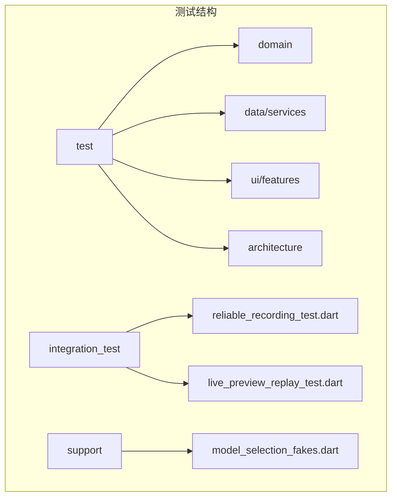

**图示来源**
- [pubspec.yaml:48-53](file://pubspec.yaml#L48-L53)

**章节来源**
- [pubspec.yaml:48-53](file://pubspec.yaml#L48-L53)

## 核心组件
围绕录音与转录的核心能力，测试覆盖以下关键组件：
- 可靠录音服务：PCM 写入、检查点持久化、前台生命周期管理、预览与音量反馈隔离
- ASR 引擎与协调器：SenseVoice 初始化、VAD 分段、预览事件与指标统计
- 会议就绪检查：权限、存储空间、默认模型可用性综合判定
- UI 状态面板：加载/空白/错误状态的渲染与交互

**章节来源**
- [reliable_recording_service_test.dart:1-442](file://test/data/services/audio/reliable_recording_service_test.dart#L1-L442)
- [live_preview_replay_test.dart:1-218](file://integration_test/live_preview_replay_test.dart#L1-L218)
- [check_meeting_readiness_test.dart:1-84](file://test/domain/use_cases/check_meeting_readiness_test.dart#L1-L84)
- [app_state_panel_test.dart:1-84](file://test/ui/core/app_state_panel_test.dart#L1-L84)

## 架构总览
测试驱动下的分层边界与依赖约束：
- Domain 层保持纯 Dart，禁止反向导入 Data/UI
- UI 仅依赖 Domain 端口与用例，不直接访问 Repository/Service
- Data 实现不得依赖 App 组合根或 UI
- 顶层组合根仅编排子容器，避免重新聚合 Data/UI 依赖
- 具体 ASR Engine 类型不得泄漏到 UI

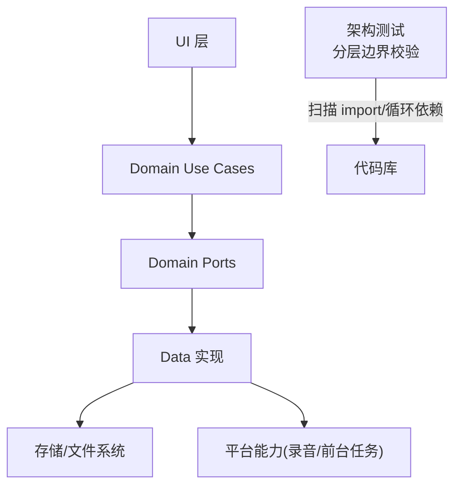

**图示来源**
- [layer_boundaries_test.dart:1-234](file://test/architecture/layer_boundaries_test.dart#L1-L234)

**章节来源**
- [layer_boundaries_test.dart:1-234](file://test/architecture/layer_boundaries_test.dart#L1-L234)

## 详细组件分析

### 可靠录音服务（单元测试）
目标：确保 PCM 块在 flush 与 checkpoint 后才投递预览；暂停/恢复只累计已持久化样本；异常与资源清理不影响已封存事实音频。

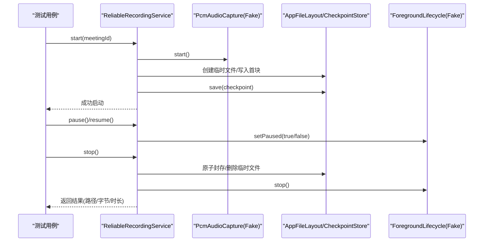

**图示来源**
- [reliable_recording_service_test.dart:1-442](file://test/data/services/audio/reliable_recording_service_test.dart#L1-L442)

要点与断言策略：
- 每个 PCM 块完成后才发布预览，保证时序一致性与可观测性
- 音量反馈仅在事实写入成功后发布，避免误导 UI
- 预览 sink 阻塞或抛错不阻塞后续写入，提升鲁棒性
- 权限拒绝/空间不足时不创建临时文件，快速失败
- 首次 checkpoint 失败回滚文件与平台资源，状态置为 failed
- 采集流报错仍可封存已持久化事实音频，stop 超时仍返回有效结果
- 合成 30 分钟 PCM 完整性 100%

**章节来源**
- [reliable_recording_service_test.dart:1-442](file://test/data/services/audio/reliable_recording_service_test.dart#L1-L442)

### 集成测试：前后台切换与 PCM 连续性
目标：在真实设备上验证前后台切换时 PCM 持续写入与原子封存，评估完整率与丢帧情况。

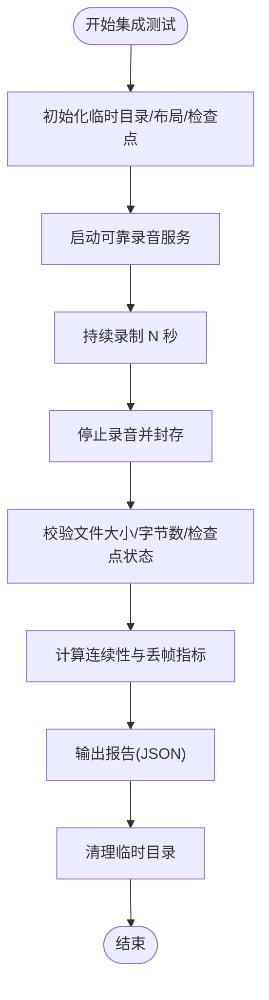

**图示来源**
- [reliable_recording_test.dart:1-86](file://integration_test/reliable_recording_test.dart#L1-L86)

关键点：
- 通过环境变量控制录制时长
- 使用设备容量提供者与前台生命周期抽象
- 输出结构化报告便于 CI 分析与回归

**章节来源**
- [reliable_recording_test.dart:1-86](file://integration_test/reliable_recording_test.dart#L1-L86)

### 集成测试：ASR 预览回放与实时指标
目标：以真实 PCM 回放驱动 SenseVoice + Silero VAD，测量事件延迟、RTF、队列积压与预览滞后。

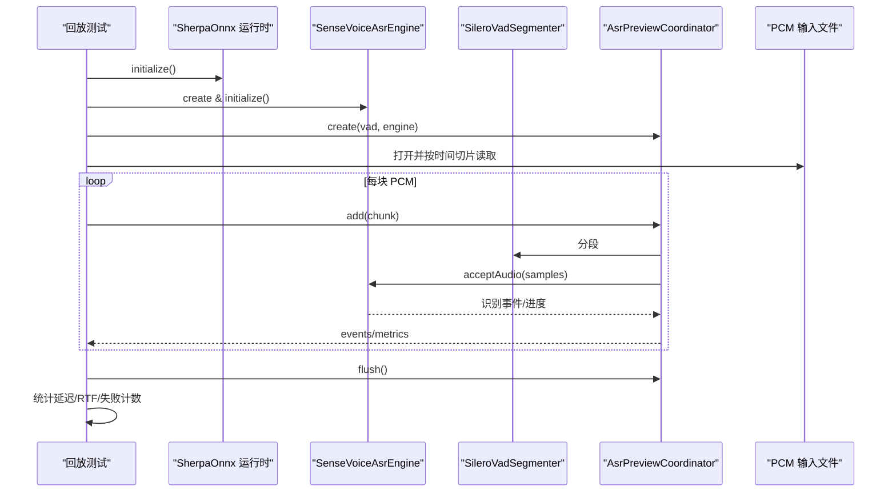

**图示来源**
- [live_preview_replay_test.dart:1-218](file://integration_test/live_preview_replay_test.dart#L1-L218)

关键点：
- 通过 dart-define 注入 PCM 路径、模型目录与 VAD 模型路径
- 校验模型 SHA256，确保资产一致性
- 输出结构化指标用于性能基线与回归

**章节来源**
- [live_preview_replay_test.dart:1-218](file://integration_test/live_preview_replay_test.dart#L1-L218)

### 领域用例：会议就绪检查
目标：综合判断麦克风权限、可用空间与默认模型可用性，支持请求权限并返回阻塞问题列表。

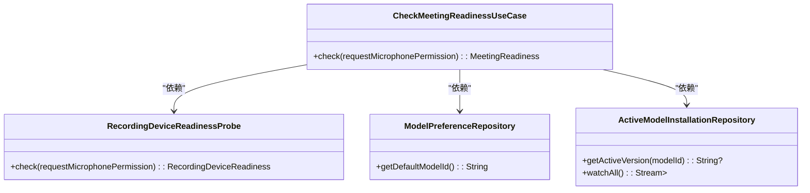

**图示来源**
- [check_meeting_readiness_test.dart:1-84](file://test/domain/use_cases/check_meeting_readiness_test.dart#L1-L84)
- [model_selection_fakes.dart:1-295](file://test/support/model_selection_fakes.dart#L1-L295)

断言要点：
- 全部满足时可开始，issues 为空
- 同时返回多项阻塞问题（权限、空间、模型不可用）
- 是否发起权限请求由参数控制

**章节来源**
- [check_meeting_readiness_test.dart:1-84](file://test/domain/use_cases/check_meeting_readiness_test.dart#L1-L84)
- [model_selection_fakes.dart:1-295](file://test/support/model_selection_fakes.dart#L1-L295)

### UI 组件：状态面板
目标：验证加载/空白/错误三种状态的渲染与交互，确保在小屏与大字体下无溢出。

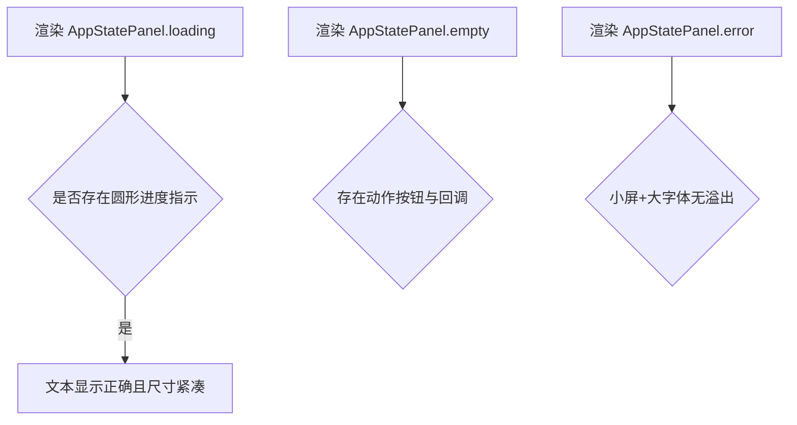

**图示来源**
- [app_state_panel_test.dart:1-84](file://test/ui/core/app_state_panel_test.dart#L1-L84)

**章节来源**
- [app_state_panel_test.dart:1-84](file://test/ui/core/app_state_panel_test.dart#L1-L84)

### ASR 引擎：SenseVoice 初始化与校验
目标：基于已校验安装记录创建引擎，拒绝版本/状态/字节数不匹配的安装。

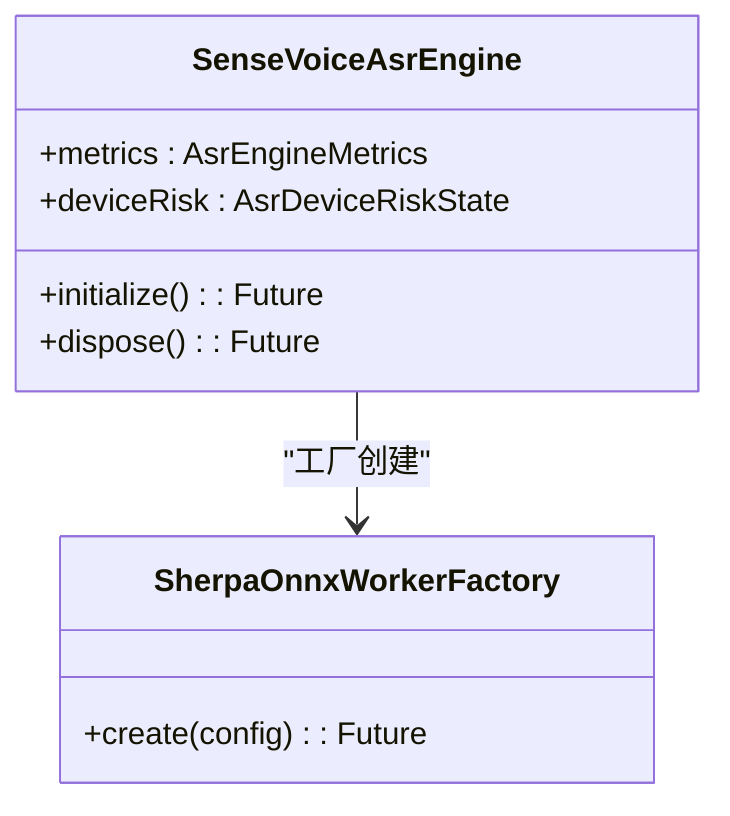

**图示来源**
- [sense_voice_asr_engine_test.dart:1-85](file://test/data/services/asr/sense_voice_asr_engine_test.dart#L1-L85)

**章节来源**
- [sense_voice_asr_engine_test.dart:1-85](file://test/data/services/asr/sense_voice_asr_engine_test.dart#L1-L85)

### **新增**：SherpaOnnxAsrEngine 完整单元测试框架
**更新** 新增398行单元测试，全面覆盖ASR引擎核心推理路径的关键场景

#### 预览窗口与时间轴测试
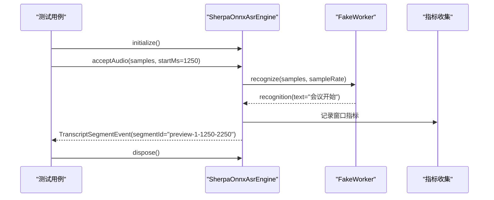

**图示来源**
- [sherpa_onnx_asr_engine_test.dart:32-63](file://test/data/services/asr/sherpa_onnx/sherpa_onnx_asr_engine_test.dart#L32-L63)

#### 空结果与无效窗口处理
- 空识别结果不发布片段但仍记录空窗口指标
- 无效窗口在进入 worker 前以稳定错误码拒绝
- 窗口长度超限检测与错误诊断

#### PCM16解码与分窗处理
- 最终转录解码 PCM16、按 15 秒分窗并生成确定时间轴
- 音频采样率验证与格式转换
- 分段ID生成与时间戳计算

#### 设备风险与并发安全
- 不支持的设备风险在创建 worker 前阻断初始化
- 并发初始化只创建一个 worker，释放操作保持幂等
- 取消进行中的最终转录会丢弃结果并发布 canceled 终态

#### 错误映射与诊断信息
- worker 推理失败映射为 Engine 异常并写入失败诊断
- 结构化错误码与阶段信息
- 诊断上下文包含错误类型与详细信息

**章节来源**
- [sherpa_onnx_asr_engine_test.dart:1-398](file://test/data/services/asr/sherpa_onnx/sherpa_onnx_asr_engine_test.dart#L1-L398)

### 领域模型：会议状态机
目标：验证模型锁定、快照激活、重转录保留旧数据、失败码记录等不变式。

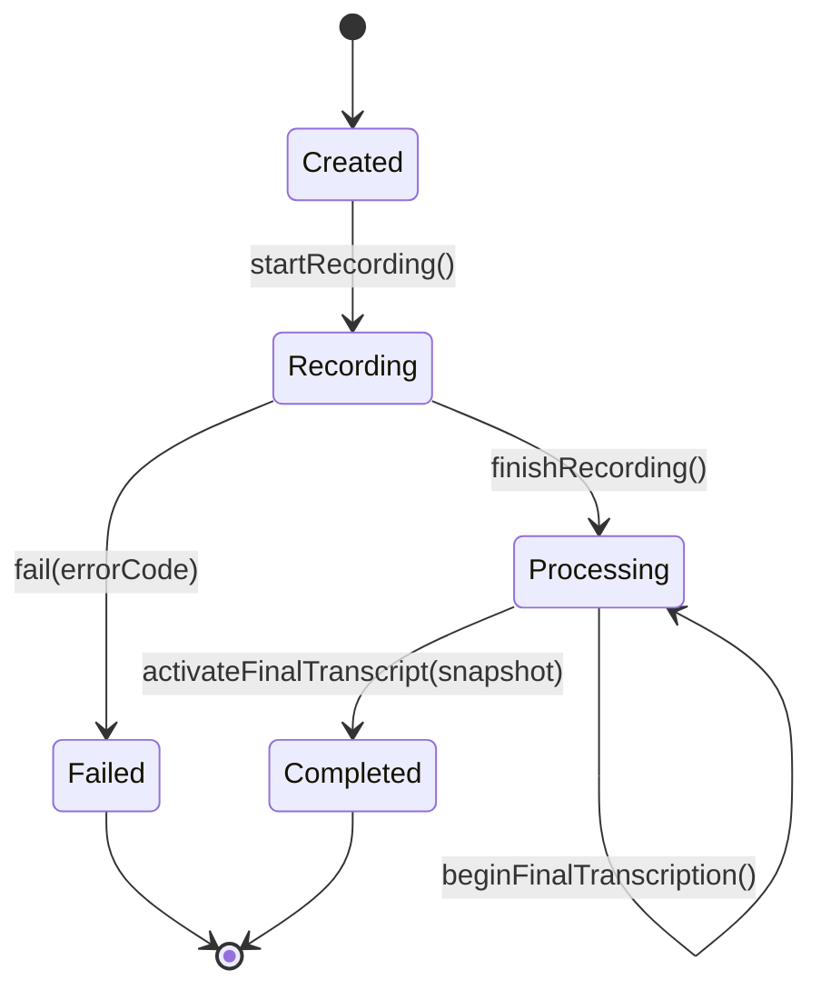

**图示来源**
- [meeting_test.dart:1-192](file://test/domain/models/meeting_test.dart#L1-L192)

**章节来源**
- [meeting_test.dart:1-192](file://test/domain/models/meeting_test.dart#L1-L192)

## 依赖关系分析
架构测试通过静态扫描与图遍历确保分层边界与循环依赖约束：
- 禁止 domain 反向导入 data
- 禁止 ui 直接导入 repositories/services
- 禁止 data 反向导入 app/ui
- domain 必须纯 Dart，不依赖 flutter/forui
- 具体 ASR Engine 类型不得出现在 ui
- data 内部不得形成 import 环
- 顶层组合根仅编排子容器，限制导入数量

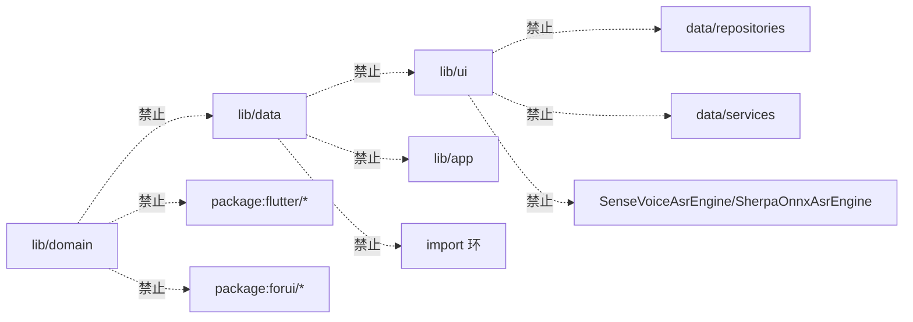

**图示来源**
- [layer_boundaries_test.dart:1-234](file://test/architecture/layer_boundaries_test.dart#L1-L234)

**章节来源**
- [layer_boundaries_test.dart:1-234](file://test/architecture/layer_boundaries_test.dart#L1-L234)

## 性能考量
- 录音连续性：完整性比率≥0.98，丢帧统计与检查点持久化一致性
- ASR 预览延迟：P95 延迟、最大队列积压、预览滞后上限
- RTF 指标：窗口级 RTF P95 与聚合 RTF，失败窗口计数
- 长时录制：30 分钟 PCM 完整性 100%，内存与 CPU 占用监控
- 设备风险：内存压力、热节流、设备支持状态纳入决策

建议：
- 在 CI 中引入回放基准数据集，定期回归 P95 延迟与 RTF
- 对异常路径（预览阻塞、recorder 停止超时）进行压力注入
- 建立设备矩阵（Android/iOS Alpha）与机型差异基线

[本节为通用指导，无需源码引用]

## 故障排查指南
常见问题与定位方法：
- 权限拒绝/空间不足：检查 start 前置校验与异常码（如 recording.permission_denied、recording.storage_insufficient）
- 首次 checkpoint 失败：确认文件系统权限与磁盘空间，观察回滚逻辑与状态重置
- 预览 sink 阻塞：隔离预览处理，确保不阻塞事实写入
- recorder 停止超时：设置合理超时，仍能封存已写盘数据
- 前台生命周期异常：stop 异常不应覆盖成功结果
- 模型校验失败：核对模型 SHA256 与安装记录状态/字节数
- **新增** ASR引擎错误：检查设备风险状态、worker初始化失败、推理异常映射

**章节来源**
- [reliable_recording_service_test.dart:164-287](file://test/data/services/audio/reliable_recording_service_test.dart#L164-L287)
- [live_preview_replay_test.dart:34-58](file://integration_test/live_preview_replay_test.dart#L34-L58)
- [sherpa_onnx_asr_engine_test.dart:105-132](file://test/data/services/asr/sherpa_onnx/sherpa_onnx_asr_engine_test.dart#L105-L132)

## 结论
本测试策略以分层边界与接口契约为核心，结合单元、集成与架构测试，全面覆盖录音可靠性、ASR 实时性与 UI 健壮性。通过 Mock/Fake 隔离外部依赖、严格异常与边界断言、以及性能基线回归，确保应用在复杂设备环境与长时间运行下的稳定性与可维护性。

**更新** 新增的SherpaOnnxAsrEngine完整测试框架显著提升了ASR引擎的质量保障能力，覆盖了从音频解码、分窗处理到错误诊断的全链路测试场景。

[本节为总结，无需源码引用]

## 附录

### 测试环境搭建
- 依赖声明：flutter_test、integration_test、sqlite3 等 dev_dependencies
- 环境变量：
  - MEETTRACE_RECORDING_SECONDS：集成测试录制时长
  - MEETTRACE_REPLAY_PCM_PATH：回放 PCM 路径
  - MEETTRACE_REPLAY_MODEL_DIRECTORY：模型目录
  - MEETTRACE_REPLAY_VAD_PATH：VAD 模型路径
- 数据准备：
  - 临时目录与 AppFileLayout 布局
  - JsonRecordingCheckpointStore 检查点
  - 固定容量提供者与前台生命周期 Fake

**章节来源**
- [pubspec.yaml:48-53](file://pubspec.yaml#L48-L53)
- [reliable_recording_test.dart:17-24](file://integration_test/reliable_recording_test.dart#L17-L24)
- [live_preview_replay_test.dart:21-32](file://integration_test/live_preview_replay_test.dart#L21-L32)

### 单元测试编写规范
- 命名：以被测组件为中心，group/test 清晰表达场景
- Mock/Fake：通过接口注入，避免直接依赖第三方 SDK
- 异步测试：使用 StreamController 模拟流事件，Completer 控制时序
- 异常测试：明确异常类型与错误码，验证回滚与状态重置
- 断言策略：先断言副作用（文件/状态），再断言返回值与事件

**章节来源**
- [reliable_recording_service_test.dart:1-442](file://test/data/services/audio/reliable_recording_service_test.dart#L1-L442)
- [model_selection_fakes.dart:1-295](file://test/support/model_selection_fakes.dart#L1-L295)

### 集成测试设计原则
- 端到端：从启动到封存的全链路验证
- 平台特定：前台生命周期、设备容量、权限与存储
- 音频录制：PCM 连续性、检查点一致性、丢帧度量
- 回放基准：固定 PCM 与模型资产，稳定性能指标

**章节来源**
- [reliable_recording_test.dart:1-86](file://integration_test/reliable_recording_test.dart#L1-L86)
- [live_preview_replay_test.dart:1-218](file://integration_test/live_preview_replay_test.dart#L1-L218)

### 架构测试实施
- 分层边界：扫描 import 与类型引用，禁止违规依赖
- 依赖关系：检测循环依赖，限制组合根导入数量
- 接口契约：UI 仅依赖端口与用例，具体实现不泄露

**章节来源**
- [layer_boundaries_test.dart:1-234](file://test/architecture/layer_boundaries_test.dart#L1-L234)

### **新增**：ASR引擎测试框架最佳实践
**更新** 基于SherpaOnnxAsrEngine测试经验总结的最佳实践

#### Fake Worker模式
- 使用_FakeWorker实现SherpaOnnxWorker接口
- 支持模拟不同识别结果、错误场景和并发控制
- 提供recognitionGate控制识别完成时机

#### PCM16测试数据生成
- 使用Uint8List和ByteData创建标准PCM16音频数据
- 验证采样率对齐和字节序处理
- 支持不同长度的音频片段测试

#### 并发与资源管理测试
- 验证并发初始化的单例行为
- 测试dispose操作的幂等性
- 模拟资源清理和异常恢复场景

#### 错误映射与诊断
- 统一错误码规范和阶段分类
- 结构化错误上下文信息
- 诊断信息包含错误类型和详细信息

**章节来源**
- [sherpa_onnx_asr_engine_test.dart:329-398](file://test/data/services/asr/sherpa_onnx/sherpa_onnx_asr_engine_test.dart#L329-L398)
- [sherpa_onnx_adapter_test.dart:136-212](file://test/data/services/asr/sherpa_onnx/sherpa_onnx_adapter_test.dart#L136-L212)

### 覆盖率要求
- 核心业务逻辑（录音、ASR 协调、就绪检查）覆盖率≥80%
- 异常路径与边界条件覆盖率≥70%
- UI 交互与状态分支覆盖率≥75%
- **新增** ASR引擎核心推理路径覆盖率≥85%
- 建议在 CI 中生成覆盖率报告并设置阈值门禁

[本节为通用指导，无需源码引用]