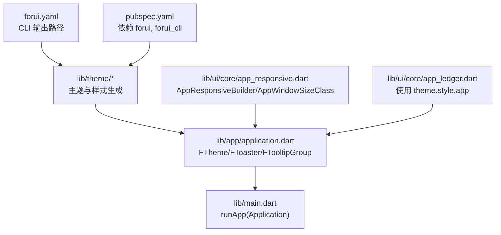
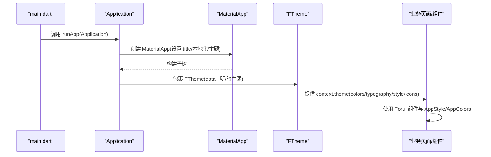
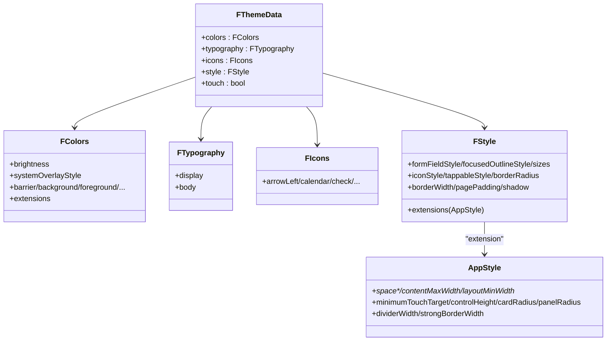
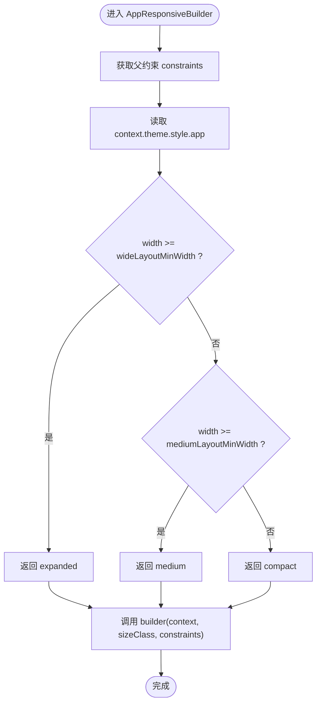
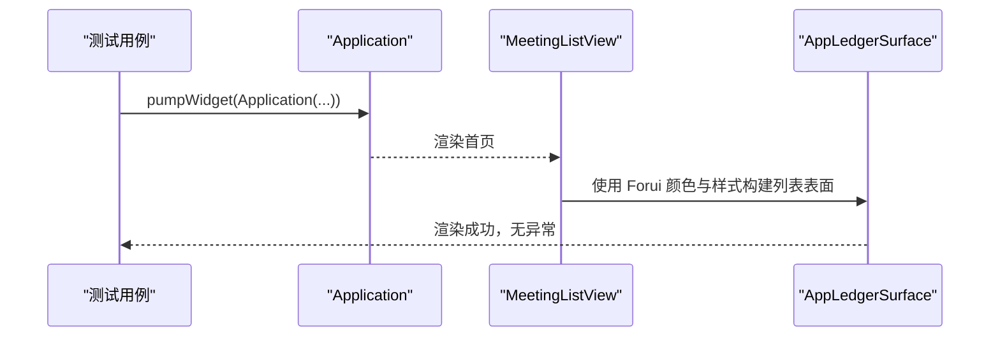
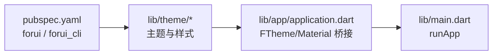

# Forui 框架使用

<cite>
**本文引用的文件**   
- [forui.yaml](file://forui.yaml)
- [pubspec.yaml](file://pubspec.yaml)
- [lib/theme/theme.dart](file://lib/theme/theme.dart)
- [lib/theme/colors.dart](file://lib/theme/colors.dart)
- [lib/theme/typography.dart](file://lib/theme/typography.dart)
- [lib/theme/style.dart](file://lib/theme/style.dart)
- [lib/theme/icons.dart](file://lib/theme/icons.dart)
- [lib/app/application.dart](file://lib/app/application.dart)
- [lib/main.dart](file://lib/main.dart)
- [lib/ui/core/app_responsive.dart](file://lib/ui/core/app_responsive.dart)
- [test/ui/core/app_responsive_test.dart](file://test/ui/core/app_responsive_test.dart)
- [lib/ui/core/app_ledger.dart](file://lib/ui/core/app_ledger.dart)
- [test/app/application_test.dart](file://test/app/application_test.dart)
</cite>

## 目录
1. [简介](#简介)
2. [项目结构](#项目结构)
3. [核心组件](#核心组件)
4. [架构总览](#架构总览)
5. [详细组件分析](#详细组件分析)
6. [依赖分析](#依赖分析)
7. [性能考虑](#性能考虑)
8. [故障排查指南](#故障排查指南)
9. [结论](#结论)
10. [附录](#附录)

## 简介
本文件面向在会迹（MeetTrace）项目中集成与使用 Forui 组件库的开发者，系统说明：
- forui.yaml 配置的作用与关键参数
- 主题系统的组织方式与定制方法（颜色、字体、间距、圆角等）
- 响应式设计的实现原理（断点管理、布局适配、尺寸检测）
- 常用 Forui 组件在项目中的使用示例与最佳实践
- 自定义主题的开发流程与注意事项

## 项目结构
Forui 在本项目中的落地主要围绕以下位置：
- 根级配置文件：forui.yaml（控制 CLI 生成输出路径）
- 依赖声明：pubspec.yaml（引入 forui 与 forui_cli）
- 主题定义：lib/theme/*（colors、typography、style、icons、theme 聚合）
- 应用外壳：lib/app/application.dart（注入 FTheme、FToaster、FTooltipGroup）
- 入口初始化：lib/main.dart（启动 Application）
- 响应式工具：lib/ui/core/app_responsive.dart（基于 AppStyle 断点的尺寸类）
- 组件示例：lib/ui/core/app_ledger.dart（使用 Forui 颜色与样式扩展）

**图表来源** 
- [forui.yaml:1-13](file://forui.yaml#L1-L13)
- [pubspec.yaml:38-61](file://pubspec.yaml#L38-L61)
- [lib/theme/theme.dart:1-66](file://lib/theme/theme.dart#L1-L66)
- [lib/app/application.dart:1-37](file://lib/app/application.dart#L1-L37)
- [lib/main.dart:1-13](file://lib/main.dart#L1-L13)
- [lib/ui/core/app_responsive.dart:1-47](file://lib/ui/core/app_responsive.dart#L1-L47)
- [lib/ui/core/app_ledger.dart:1-48](file://lib/ui/core/app_ledger.dart#L1-L48)

**章节来源**
- [forui.yaml:1-13](file://forui.yaml#L1-L13)
- [pubspec.yaml:38-61](file://pubspec.yaml#L38-L61)
- [lib/theme/theme.dart:1-66](file://lib/theme/theme.dart#L1-L66)
- [lib/app/application.dart:1-37](file://lib/app/application.dart#L1-L37)
- [lib/main.dart:1-13](file://lib/main.dart#L1-L13)
- [lib/ui/core/app_responsive.dart:1-47](file://lib/ui/core/app_responsive.dart#L1-L47)
- [lib/ui/core/app_ledger.dart:1-48](file://lib/ui/core/app_ledger.dart#L1-L48)

## 核心组件
- 主题数据与提供者
  - lightTheme/darkTheme：由 lib/theme/theme.dart 暴露，组合 colors、typography、icons、style 与 touch 模式。
  - Application：在 MaterialApp 中通过 FTheme 注入当前亮度对应的主题，并包裹 FToaster 与 FTooltipGroup。
- 样式与扩展
  - AppStyle：在 style.dart 中定义间距、圆角、最大内容宽度、最小触控目标等，供全局样式访问。
  - AppColors：在 colors.dart 中通过 extensions 注入应用级颜色扩展（如 focusRing）。
- 响应式
  - AppResponsiveBuilder：根据父约束 maxWidth 与 AppStyle 的 mediumLayoutMinWidth/wideLayoutMinWidth 计算 AppWindowSizeClass（compact/medium/expanded）。
- 组件示例
  - AppLedgerSurface：展示如何读取 context.theme.colors 与 theme.style.app 来构建一致的表面样式。

**章节来源**
- [lib/theme/theme.dart:26-66](file://lib/theme/theme.dart#L26-L66)
- [lib/app/application.dart:18-35](file://lib/app/application.dart#L18-L35)
- [lib/theme/style.dart:65-116](file://lib/theme/style.dart#L65-L116)
- [lib/theme/colors.dart:6-25](file://lib/theme/colors.dart#L6-L25)
- [lib/ui/core/app_responsive.dart:6-21](file://lib/ui/core/app_responsive.dart#L6-L21)
- [lib/ui/core/app_ledger.dart:18-47](file://lib/ui/core/app_ledger.dart#L18-L47)

## 架构总览
下图展示了从应用启动到主题生效、再到组件消费主题的完整链路。

**图表来源** 
- [lib/main.dart:7-12](file://lib/main.dart#L7-L12)
- [lib/app/application.dart:18-35](file://lib/app/application.dart#L18-L35)
- [lib/theme/theme.dart:26-66](file://lib/theme/theme.dart#L26-L66)

## 详细组件分析

### 主题系统（颜色、字体、图标、样式）
- 颜色（colors.dart）
  - 定义 lightColors/darkColors，包含 brightness、systemOverlayStyle、基础色板（background/foreground/primary/secondary/muted/destructive/error/card/border）以及 extensions（AppColors）。
- 字体（typography.dart）
  - 通过 _typography 构造 display/body 两套字阶，支持 touch 缩放与统一的行高、字重、字距。
- 图标（icons.dart）
  - 集中映射 FLucideIcons 到 FIcon 令牌，便于统一替换与主题化。
- 样式（style.dart）
  - 定义 FStyle 的基础 token：表单风格、聚焦轮廓、尺寸、图标主题、点击态、圆角、边框宽度、页面内边距、阴影等。
  - 扩展 AppStyle：间距、最大内容宽度、断点阈值、触控目标、控件高度、卡片/面板圆角、分割线宽度等。
- 主题聚合（theme.dart）
  - lightTheme/darkTheme 将上述部分组装为 FThemeData，并通过 touch 开关适配移动端/桌面端差异。

**图表来源** 
- [lib/theme/theme.dart:26-66](file://lib/theme/theme.dart#L26-L66)
- [lib/theme/colors.dart:6-25](file://lib/theme/colors.dart#L6-L25)
- [lib/theme/typography.dart:4-9](file://lib/theme/typography.dart#L4-L9)
- [lib/theme/icons.dart:6-29](file://lib/theme/icons.dart#L6-L29)
- [lib/theme/style.dart:8-45](file://lib/theme/style.dart#L8-L45)
- [lib/theme/style.dart:65-116](file://lib/theme/style.dart#L65-L116)

**章节来源**
- [lib/theme/theme.dart:26-66](file://lib/theme/theme.dart#L26-L66)
- [lib/theme/colors.dart:6-25](file://lib/theme/colors.dart#L6-L25)
- [lib/theme/typography.dart:4-9](file://lib/theme/typography.dart#L4-L9)
- [lib/theme/icons.dart:6-29](file://lib/theme/icons.dart#L6-L29)
- [lib/theme/style.dart:8-45](file://lib/theme/style.dart#L8-L45)
- [lib/theme/style.dart:65-116](file://lib/theme/style.dart#L65-L116)

### 响应式设计（断点、布局适配、尺寸检测）
- 断点来源：AppStyle.mediumLayoutMinWidth 与 AppStyle.wideLayoutMinWidth。
- 尺寸类：AppWindowSizeClass.compact/medium/expanded，由 fromWidth(width, style) 判定。
- 布局适配：AppResponsiveBuilder 基于 LayoutBuilder 获取 constraints.maxWidth，驱动 builder(context, sizeClass, constraints)。
- 测试覆盖：app_responsive_test.dart 验证不同宽度下的尺寸类与约束值。

**图表来源** 
- [lib/ui/core/app_responsive.dart:6-21](file://lib/ui/core/app_responsive.dart#L6-L21)
- [lib/ui/core/app_responsive.dart:31-47](file://lib/ui/core/app_responsive.dart#L31-L47)
- [lib/theme/style.dart:77-80](file://lib/theme/style.dart#L77-L80)
- [test/ui/core/app_responsive_test.dart:7-36](file://test/ui/core/app_responsive_test.dart#L7-L36)

**章节来源**
- [lib/ui/core/app_responsive.dart:6-21](file://lib/ui/core/app_responsive.dart#L6-L21)
- [lib/ui/core/app_responsive.dart:31-47](file://lib/ui/core/app_responsive.dart#L31-L47)
- [lib/theme/style.dart:77-80](file://lib/theme/style.dart#L77-L80)
- [test/ui/core/app_responsive_test.dart:7-36](file://test/ui/core/app_responsive_test.dart#L7-L36)

### 常用 Forui 组件使用示例
- 主题与容器
  - Application 中使用 FTheme/FToaster/FTooltipGroup 包裹应用，确保全局提示与 Tooltip 可用。
- 列表与表面
  - AppLedgerSurface 演示了如何使用 theme.colors.card/border 与 theme.style.app 的 cardRadius/dividerWidth 构建一致的“账本”表面。
- 状态与交互
  - 测试用例中出现 FScaffold、FHeader、FCircularProgress、FButton 等，表明列表页头部、空状态与操作按钮均基于 Forui 组件。

**图表来源** 
- [test/app/application_test.dart:8-18](file://test/app/application_test.dart#L8-L18)
- [test/ui/features/meetings/views/list/meeting_list_view_test.dart:19-36](file://test/ui/features/meetings/views/list/meeting_list_view_test.dart#L19-L36)
- [lib/ui/core/app_ledger.dart:18-47](file://lib/ui/core/app_ledger.dart#L18-L47)

**章节来源**
- [lib/app/application.dart:18-35](file://lib/app/application.dart#L18-L35)
- [lib/ui/core/app_ledger.dart:18-47](file://lib/ui/core/app_ledger.dart#L18-L47)
- [test/app/application_test.dart:8-18](file://test/app/application_test.dart#L8-L18)
- [test/ui/features/meetings/views/list/meeting_list_view_test.dart:19-36](file://test/ui/features/meetings/views/list/meeting_list_view_test.dart#L19-L36)

### Forui CLI 配置（forui.yaml）
- snippet-output：代码片段默认输出目录（lib）
- style-output：生成的样式文件默认输出目录（lib/theme/styles）
- theme-output：生成的主题文件默认输出（lib/theme/theme.dart）
- fonts-output：预设字体资源下载目录（assets/fonts）

这些路径决定了运行 forui 命令后生成文件的落盘位置，建议与现有 lib/theme 结构保持一致，避免破坏主题引用关系。

**章节来源**
- [forui.yaml:1-13](file://forui.yaml#L1-L13)

## 依赖分析
- pubspec.yaml 中声明 forui ^0.25.0 与 forui_cli ^0.25.0，保证运行时与 CLI 版本对齐。
- Application 同时依赖 Material 主题桥接（toApproximateMaterialTheme），使 Flutter 原生主题与 Forui 主题共存。
- 主题模块内部解耦清晰：colors/typography/icons/style 各自独立，theme.dart 负责聚合。

**图表来源** 
- [pubspec.yaml:38-61](file://pubspec.yaml#L38-L61)
- [lib/theme/theme.dart:1-66](file://lib/theme/theme.dart#L1-L66)
- [lib/app/application.dart:18-35](file://lib/app/application.dart#L18-L35)
- [lib/main.dart:7-12](file://lib/main.dart#L7-L12)

**章节来源**
- [pubspec.yaml:38-61](file://pubspec.yaml#L38-L61)
- [lib/theme/theme.dart:1-66](file://lib/theme/theme.dart#L1-L66)
- [lib/app/application.dart:18-35](file://lib/app/application.dart#L18-L35)
- [lib/main.dart:7-12](file://lib/main.dart#L7-L12)

## 性能考虑
- 主题对象复用：lightTheme/darkTheme 作为常量 getter，避免重复构建。
- 响应式计算轻量：AppResponsiveBuilder 仅依赖 LayoutBuilder 与 AppStyle 阈值，开销极低。
- 样式扩展集中：AppStyle/AppColors 通过 ThemeExtension 共享，减少跨层传递成本。
- 图标与字体：统一通过 FIcons/FTypography 管理，便于缓存与按需加载。

[本节为通用指导，不直接分析具体文件]

## 故障排查指南
- 主题未生效
  - 检查 Application 是否正确包裹 FTheme，并确保传入的是 lightTheme 或 darkTheme。
  - 确认 MaterialApp 的 theme/darkTheme 已正确桥接到 Forui。
- 响应式断点不生效
  - 核对 AppStyle.mediumLayoutMinWidth 与 AppStyle.wideLayoutMinWidth 是否合理。
  - 使用 app_responsive_test.dart 的方式模拟不同物理尺寸，验证 sizeClass 是否符合预期。
- 样式不一致
  - 优先使用 theme.style.app.* 与 theme.colors.*，避免硬编码数值。
  - 若新增样式，请在 AppStyle/AppColors 中补充，保持单一事实源。

**章节来源**
- [lib/app/application.dart:18-35](file://lib/app/application.dart#L18-L35)
- [lib/ui/core/app_responsive.dart:6-21](file://lib/ui/core/app_responsive.dart#L6-L21)
- [test/ui/core/app_responsive_test.dart:7-36](file://test/ui/core/app_responsive_test.dart#L7-L36)

## 结论
本项目以 Forui 为核心 UI 体系，通过 forui.yaml 控制生成产物，以 lib/theme/* 统一管理视觉资产，Application 负责主题注入与全局能力（提示、Tooltip），AppResponsiveBuilder 提供简洁可靠的响应式方案。遵循 AppStyle/AppColors 的设计约定，可高效扩展主题与组件样式，保障跨平台一致性与可维护性。

[本节为总结性内容，不直接分析具体文件]

## 附录
- 自定义主题开发建议
  - 修改 theme.dart 中的 lightTheme/darkTheme 构建逻辑，或调整 colors/typography/style 各部分的 token。
  - 新增 AppStyle/AppColors 字段时，务必实现 copyWith/lerp/==/hashCode，保证动画与比较的正确性。
  - 使用 forui style create 生成新样式，并在 _style 中注册，保持与 FStyle 契约一致。
- 常用组件清单（按实际使用）
  - 容器与布局：FScaffold、FHeader
  - 反馈与交互：FButton、FCircularProgress、FToaster、FTooltipGroup
  - 数据展示：列表/账本表面（参考 AppLedgerSurface 的实现思路）

[本节为通用指导，不直接分析具体文件]