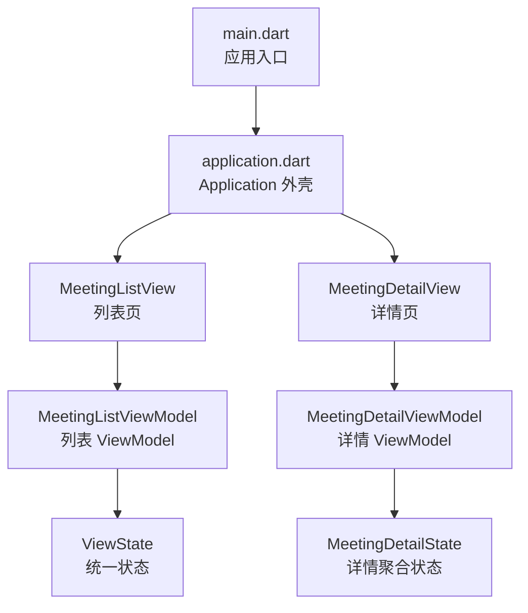
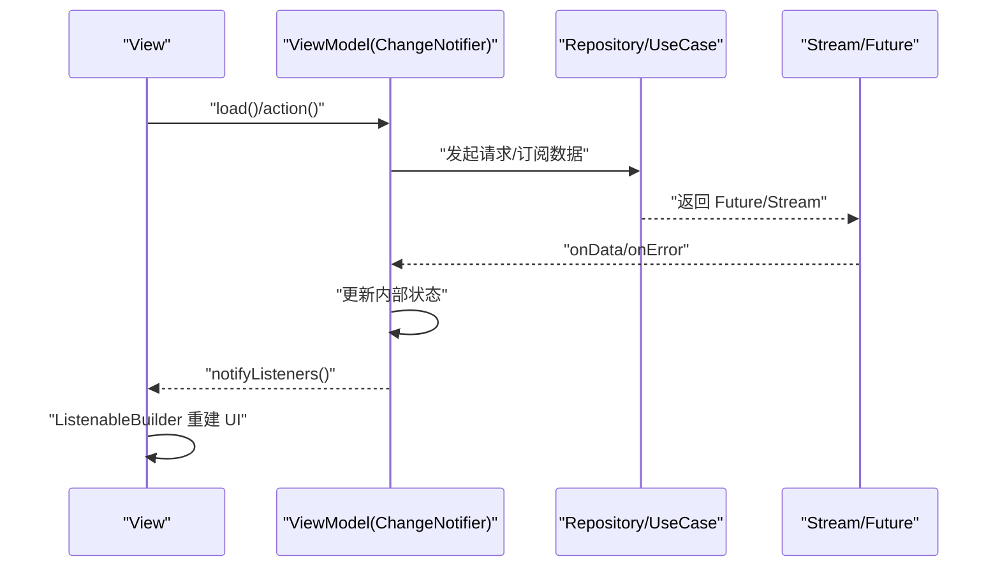
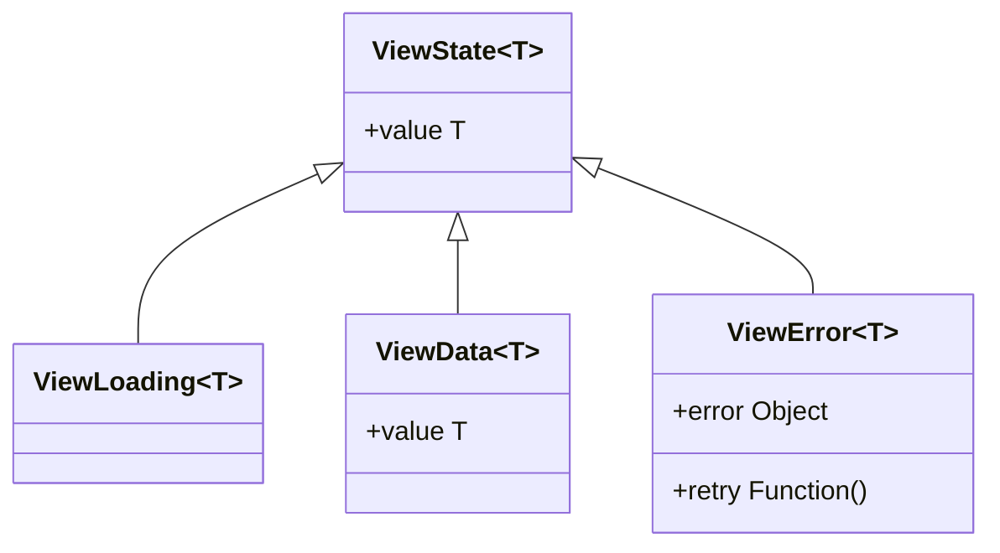
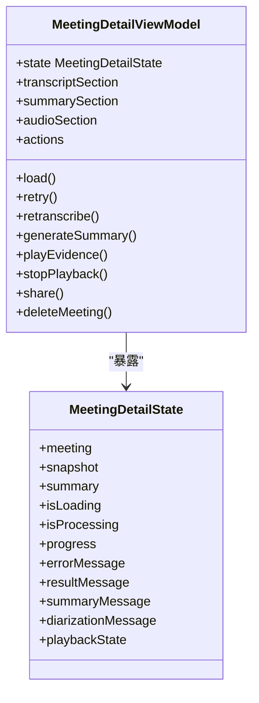
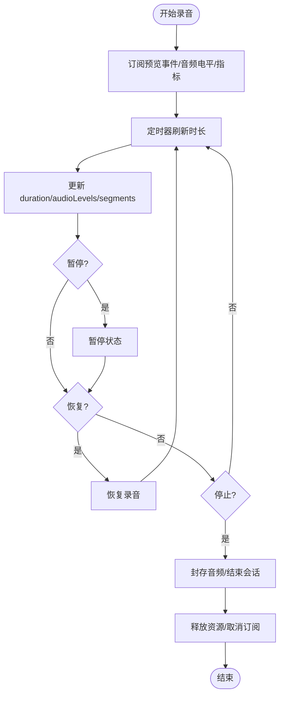
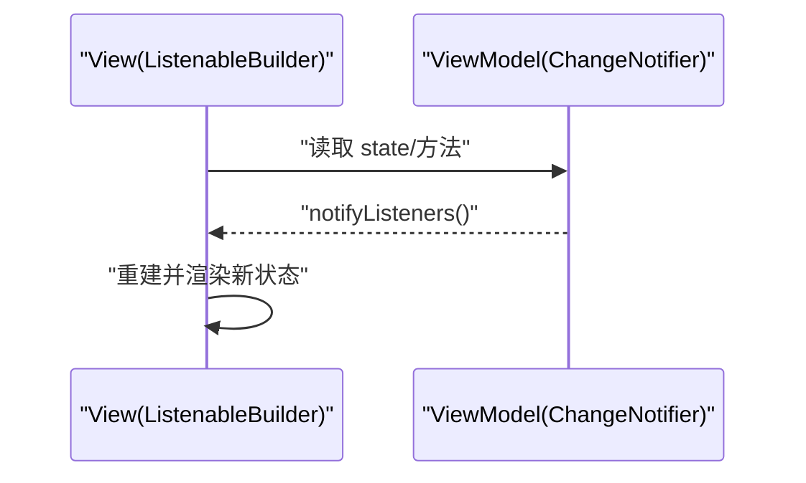
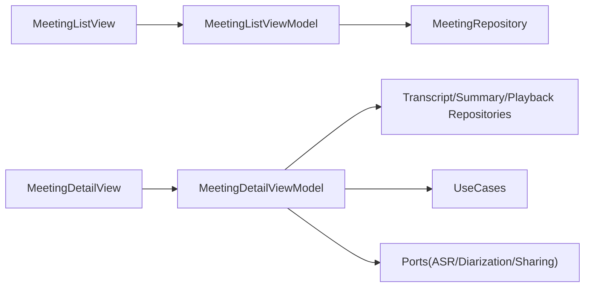

# ViewModel 集成

<cite>
**本文引用的文件**
- [lib/main.dart](file://lib/main.dart)
- [lib/app/application.dart](file://lib/app/application.dart)
- [lib/ui/core/view_state.dart](file://lib/ui/core/view_state.dart)
- [lib/ui/features/meetings/views/list/meeting_list_view.dart](file://lib/ui/features/meetings/views/list/meeting_list_view.dart)
- [lib/ui/features/meetings/view_models/list/meeting_list_view_model.dart](file://lib/ui/features/meetings/view_models/list/meeting_list_view_model.dart)
- [lib/ui/features/meetings/views/detail/meeting_detail_view.dart](file://lib/ui/features/meetings/views/detail/meeting_detail_view.dart)
- [lib/ui/features/meetings/view_models/detail/meeting_detail_view_model.dart](file://lib/ui/features/meetings/view_models/detail/meeting_detail_view_model.dart)
- [lib/ui/features/meetings/view_models/detail/meeting_detail_state.dart](file://lib/ui/features/meetings/view_models/detail/meeting_detail_state.dart)
- [lib/ui/features/meetings/view_models/recording/recording_session_view_model.dart](file://lib/ui/features/meetings/view_models/recording/recording_session_view_model.dart)
</cite>

## 目录
1. [简介](#简介)
2. [项目结构](#项目结构)
3. [核心组件](#核心组件)
4. [架构总览](#架构总览)
5. [详细组件分析](#详细组件分析)
6. [依赖关系分析](#依赖关系分析)
7. [性能考量](#性能考量)
8. [故障排查指南](#故障排查指南)
9. [结论](#结论)
10. [附录](#附录)

## 简介
本文件聚焦于 Flutter 项目中 ViewModel 与 View 的集成机制，系统阐述 MVVM 在该工程中的落地方式、ViewModel 的职责边界与数据流向、状态管理机制（ViewState 的设计与使用）、数据绑定的实现（单向数据流与状态更新通知），并给出 ViewModel 开发的最佳实践（错误处理、生命周期管理、性能优化）以及调试技巧。读者可据此快速理解并扩展项目的 UI 层架构。

## 项目结构
- 应用入口与外壳
  - main.dart：初始化 Flutter、启用边缘到边显示、启动 ASR 运行时、创建 Application。
  - application.dart：定义 Application 根 Widget，装配主题、本地化、全局提示与 Tooltip，默认首页为会议列表页。
- UI 层
  - core：通用 UI 能力，如 ViewState 统一状态封装。
  - features/meetings：按功能域组织页面与 ViewModel，包含列表、详情、录音会话等。
- 数据与领域层
  - domain：领域模型、用例、端口（Repository/Service）。
  - data：持久化与服务实现（不在本文重点范围）。



**图表来源**
- [lib/main.dart:7-12](file://lib/main.dart#L7-L12)
- [lib/app/application.dart:11-36](file://lib/app/application.dart#L11-L36)
- [lib/ui/features/meetings/views/list/meeting_list_view.dart:32-73](file://lib/ui/features/meetings/views/list/meeting_list_view.dart#L32-L73)
- [lib/ui/features/meetings/views/detail/meeting_detail_view.dart:32-81](file://lib/ui/features/meetings/views/detail/meeting_detail_view.dart#L32-L81)
- [lib/ui/core/view_state.dart:1-25](file://lib/ui/core/view_state.dart#L1-L25)
- [lib/ui/features/meetings/view_models/detail/meeting_detail_state.dart:3-28](file://lib/ui/features/meetings/view_models/detail/meeting_detail_state.dart#L3-L28)

**章节来源**
- [lib/main.dart:7-12](file://lib/main.dart#L7-L12)
- [lib/app/application.dart:11-36](file://lib/app/application.dart#L11-L36)

## 核心组件
- ViewState<T>：统一的视图状态抽象，提供 Loading/Success/Error 三种形态，便于 View 以模式匹配渲染不同界面。
- MeetingListViewModel：基于 ChangeNotifier 的状态管理与展示逻辑，订阅 Repository Stream，维护加载/错误/就绪检查等状态。
- MeetingDetailViewModel：聚合转录、说话人分离、摘要生成、证据播放、分享与删除等子模块，暴露聚合状态 MeetingDetailState。
- RecordingSessionViewModel：负责录音会话的生命周期、实时预览指标、音频波形采样与事件流订阅。

**章节来源**
- [lib/ui/core/view_state.dart:1-25](file://lib/ui/core/view_state.dart#L1-L25)
- [lib/ui/features/meetings/view_models/list/meeting_list_view_model.dart:41-188](file://lib/ui/features/meetings/view_models/list/meeting_list_view_model.dart#L41-L188)
- [lib/ui/features/meetings/view_models/detail/meeting_detail_view_model.dart:30-273](file://lib/ui/features/meetings/view_models/detail/meeting_detail_view_model.dart#L30-L273)
- [lib/ui/features/meetings/view_models/recording/recording_session_view_model.dart:20-231](file://lib/ui/features/meetings/view_models/recording/recording_session_view_model.dart#L20-L231)

## 架构总览
MVVM 在本项目中的职责划分：
- View：纯展示与用户交互，通过 ListenableBuilder 监听 ViewModel 变更，仅消费只读状态。
- ViewModel：继承 ChangeNotifier，封装业务编排、异步操作、错误处理与状态更新；不持有 UI 细节。
- 数据层：通过 Repository/UseCase/Port 暴露 Stream/Future，供 ViewModel 订阅与调用。



**图表来源**
- [lib/ui/features/meetings/views/list/meeting_list_view.dart:64-73](file://lib/ui/features/meetings/views/list/meeting_list_view.dart#L64-L73)
- [lib/ui/features/meetings/view_models/list/meeting_list_view_model.dart:78-95](file://lib/ui/features/meetings/view_models/list/meeting_list_view_model.dart#L78-L95)

## 详细组件分析

### ViewState 状态机设计
- 设计目标：将“加载中/成功/失败”三类视图态抽象为不可变类型，避免在 View 中散落条件判断。
- 使用方式：ViewModel 暴露 state 字段，View 根据类型分支渲染对应 UI；失败态可携带 retry 回调。



**图表来源**
- [lib/ui/core/view_state.dart:1-25](file://lib/ui/core/view_state.dart#L1-L25)

**章节来源**
- [lib/ui/core/view_state.dart:1-25](file://lib/ui/core/view_state.dart#L1-L25)

### MeetingListViewModel 与 MeetingListView 集成
- 数据流：
  - View 在 initState 中调用 viewModel.load()。
  - ViewModel 设置 loading 并订阅 meetings.watchAll()，收到数据后切换为 success/error。
  - View 通过 ListenableBuilder 监听 notifyListeners() 触发重建，读取 state 渲染。
- 就绪检查：独立 refreshReadiness() 流程，保证 UI 对设备能力与权限状态的反馈。
- 删除与会话：deleteMeeting() 控制删除按钮可用性，并在 finally 清理状态。

```mermaid
sequenceDiagram
participant V as "MeetingListView"
participant VM as "MeetingListViewModel"
participant Repo as "MeetingRepository"
participant S as "Stream<List<Meeting>>"
V->>VM : "load()"
VM->>VM : "_state = ViewLoading(); notifyListeners()"
VM->>Repo : "watchAll()"
Repo-->>S : "返回 Stream"
S-->>VM : "onData(items)"
VM->>VM : "_state = ViewData(value : items); _notify()"
S-->>VM : "onError(error)"
VM->>VM : "_state = ViewError(error, retry); _notify()"
V-->>V : "ListenableBuilder 重建 UI"
```

**图表来源**
- [lib/ui/features/meetings/views/list/meeting_list_view.dart:58-73](file://lib/ui/features/meetings/views/list/meeting_list_view.dart#L58-L73)
- [lib/ui/features/meetings/view_models/list/meeting_list_view_model.dart:78-107](file://lib/ui/features/meetings/view_models/list/meeting_list_view_model.dart#L78-L107)

**章节来源**
- [lib/ui/features/meetings/views/list/meeting_list_view.dart:54-107](file://lib/ui/features/meetings/views/list/meeting_list_view.dart#L54-L107)
- [lib/ui/features/meetings/view_models/list/meeting_list_view_model.dart:41-188](file://lib/ui/features/meetings/view_models/list/meeting_list_view_model.dart#L41-L188)

### MeetingDetailViewModel 聚合状态与子模块
- 聚合状态：MeetingDetailState 汇总会议、快照、摘要、进度、错误消息、播放状态等，作为单一只读状态源。
- 子模块：transcriptSection、summarySection、audioSection、actions 分别封装转录、摘要、音频与动作逻辑，主 VM 协调调用。
- 自动流程：加载时根据会议状态决定是否继续转录、说话人分离或自动生成摘要。



**图表来源**
- [lib/ui/features/meetings/view_models/detail/meeting_detail_view_model.dart:30-118](file://lib/ui/features/meetings/view_models/detail/meeting_detail_view_model.dart#L30-L118)
- [lib/ui/features/meetings/view_models/detail/meeting_detail_state.dart:3-28](file://lib/ui/features/meetings/view_models/detail/meeting_detail_state.dart#L3-L28)

**章节来源**
- [lib/ui/features/meetings/view_models/detail/meeting_detail_view_model.dart:30-273](file://lib/ui/features/meetings/view_models/detail/meeting_detail_view_model.dart#L30-L273)
- [lib/ui/features/meetings/view_models/detail/meeting_detail_state.dart:3-52](file://lib/ui/features/meetings/view_models/detail/meeting_detail_state.dart#L3-L52)

### RecordingSessionViewModel 实时数据绑定
- 订阅预览指标与音频电平，维护有限长度的波形数组，定时刷新时长。
- 生命周期：start/pause/resume/stop 均包裹异常处理与忙闲状态，确保 UI 一致性。
- 资源释放：dispose 中取消所有订阅并安全释放预览资源。



**图表来源**
- [lib/ui/features/meetings/view_models/recording/recording_session_view_model.dart:71-144](file://lib/ui/features/meetings/view_models/recording/recording_session_view_model.dart#L71-L144)
- [lib/ui/features/meetings/view_models/recording/recording_session_view_model.dart:166-185](file://lib/ui/features/meetings/view_models/recording/recording_session_view_model.dart#L166-L185)
- [lib/ui/features/meetings/view_models/recording/recording_session_view_model.dart:216-231](file://lib/ui/features/meetings/view_models/recording/recording_session_view_model.dart#L216-L231)

**章节来源**
- [lib/ui/features/meetings/view_models/recording/recording_session_view_model.dart:20-231](file://lib/ui/features/meetings/view_models/recording/recording_session_view_model.dart#L20-L231)

### 数据绑定与单向数据流
- 绑定方式：View 通过 ListenableBuilder 监听 ChangeNotifier 的 notifyListeners()，实现单向数据流。
- 状态更新：ViewModel 仅在内部修改私有状态，并通过只读属性暴露给 View；禁止 View 直接修改 ViewModel 内部状态。
- 重试机制：ViewError 携带 retry 回调，由 View 触发重新加载。



**图表来源**
- [lib/ui/features/meetings/views/list/meeting_list_view.dart:64-73](file://lib/ui/features/meetings/views/list/meeting_list_view.dart#L64-L73)
- [lib/ui/features/meetings/views/detail/meeting_detail_view.dart:59-81](file://lib/ui/features/meetings/views/detail/meeting_detail_view.dart#L59-L81)
- [lib/ui/core/view_state.dart:18-24](file://lib/ui/core/view_state.dart#L18-L24)

**章节来源**
- [lib/ui/features/meetings/views/list/meeting_list_view.dart:54-107](file://lib/ui/features/meetings/views/list/meeting_list_view.dart#L54-L107)
- [lib/ui/features/meetings/views/detail/meeting_detail_view.dart:48-81](file://lib/ui/features/meetings/views/detail/meeting_detail_view.dart#L48-L81)

## 依赖关系分析
- 低耦合：View 仅依赖 ViewModel 接口（ChangeNotifier），不感知具体实现。
- 高内聚：ViewModel 聚合领域用例与端口，屏蔽数据获取与错误处理的复杂性。
- 可扩展：新增功能可通过添加子 ViewModel（如 detail 的子模块）或扩展 ViewState 类型实现。



**图表来源**
- [lib/ui/features/meetings/view_models/list/meeting_list_view_model.dart:41-57](file://lib/ui/features/meetings/view_models/list/meeting_list_view_model.dart#L41-L57)
- [lib/ui/features/meetings/view_models/detail/meeting_detail_view_model.dart:58-76](file://lib/ui/features/meetings/view_models/detail/meeting_detail_view_model.dart#L58-L76)

**章节来源**
- [lib/ui/features/meetings/view_models/list/meeting_list_view_model.dart:41-188](file://lib/ui/features/meetings/view_models/list/meeting_list_view_model.dart#L41-L188)
- [lib/ui/features/meetings/view_models/detail/meeting_detail_view_model.dart:30-273](file://lib/ui/features/meetings/view_models/detail/meeting_detail_view_model.dart#L30-L273)

## 性能考量
- 最小化重建：使用 ListenableBuilder 精确监听 ViewModel，避免整树重建。
- 不可变状态：state 与集合使用不可变包装（如 List.unmodifiable），减少不必要的比较开销。
- 防抖与去重：refreshReadiness 等异步操作缓存 Future，避免重复执行。
- 流式订阅管理：在 dispose 中及时取消订阅，防止内存泄漏与后台任务浪费。
- 分段状态：将复杂页面拆分为多个子 ViewModel，降低单点复杂度与渲染压力。

[本节为通用指导，无需特定文件引用]

## 故障排查指南
- 常见问题定位
  - 列表不刷新：确认 load() 是否被调用、Stream 是否正确订阅、_notify() 是否被调用。
  - 详情页卡死：检查 isProcessing 标志位与 _operation 是否被正确清理。
  - 录音崩溃：查看 start/stop 的异常捕获与 _disposePreviewBestEffort 是否生效。
- 调试技巧
  - 打印状态变化：在 _notify() 前后输出关键状态字段。
  - 断点验证：在 Stream 的 onData/onError 处打断点，确认数据路径。
  - 单元测试：参考 test/ui/features/*/view_models/*_test.dart 编写 Mock 与断言。

**章节来源**
- [lib/ui/features/meetings/view_models/list/meeting_list_view_model.dart:175-186](file://lib/ui/features/meetings/view_models/list/meeting_list_view_model.dart#L175-L186)
- [lib/ui/features/meetings/view_models/detail/meeting_detail_view_model.dart:259-271](file://lib/ui/features/meetings/view_models/detail/meeting_detail_view_model.dart#L259-L271)
- [lib/ui/features/meetings/view_models/recording/recording_session_view_model.dart:198-231](file://lib/ui/features/meetings/view_models/recording/recording_session_view_model.dart#L198-L231)

## 结论
本项目采用清晰的 MVVM 分层与 ChangeNotifier + ListenableBuilder 的单向数据流，结合 ViewState 统一状态表达，实现了高内聚、低耦合且易于测试的 UI 架构。通过细粒度的 ViewModel 拆分与严格的错误处理、生命周期管理，保证了复杂场景下的稳定性与可维护性。遵循本文最佳实践与调试建议，可进一步提升开发与排错效率。

## 附录
- 最佳实践清单
  - 始终使用只读状态暴露给 View，禁止外部直接修改内部字段。
  - 所有异步操作需包裹 try/catch，并设置明确的错误消息与重试入口。
  - 在 dispose 中清理所有订阅与定时器，避免内存泄漏。
  - 使用不可变数据结构与不可变集合，提升渲染性能与可预测性。
  - 将复杂页面拆分为多个子 ViewModel，保持单一职责。
- 代码片段路径（示例）
  - 列表加载与错误处理：[meeting_list_view_model.dart:78-107](file://lib/ui/features/meetings/view_models/list/meeting_list_view_model.dart#L78-L107)
  - 详情聚合状态构建：[meeting_detail_view_model.dart:105-118](file://lib/ui/features/meetings/view_models/detail/meeting_detail_view_model.dart#L105-L118)
  - 录音会话生命周期：[recording_session_view_model.dart:71-144](file://lib/ui/features/meetings/view_models/recording/recording_session_view_model.dart#L71-L144)