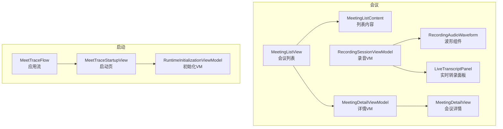
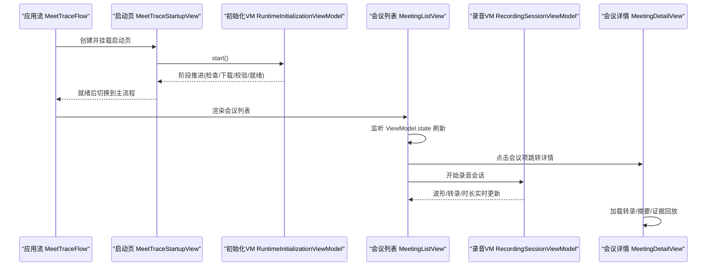
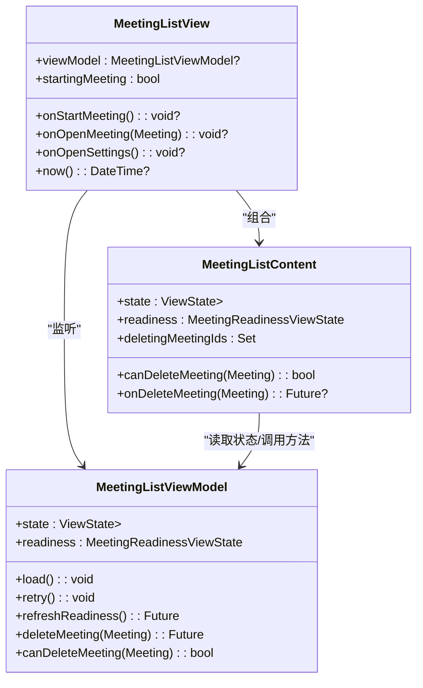
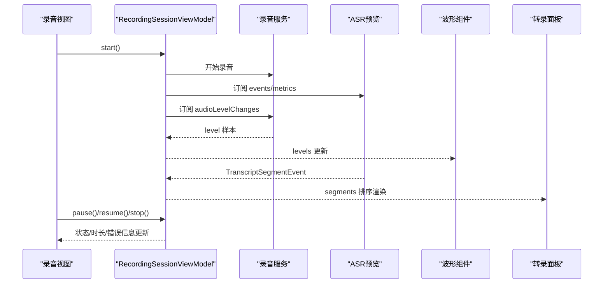
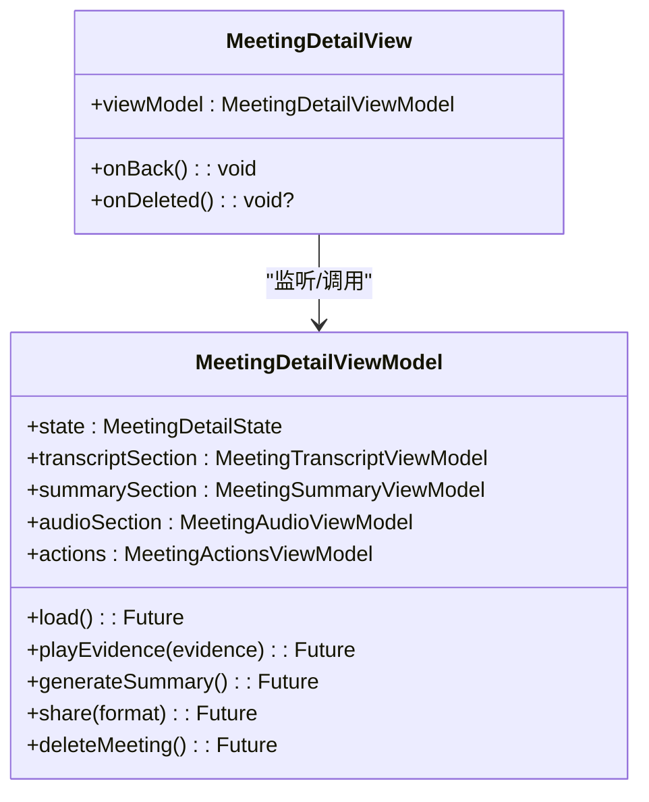
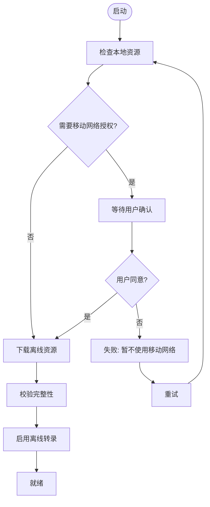
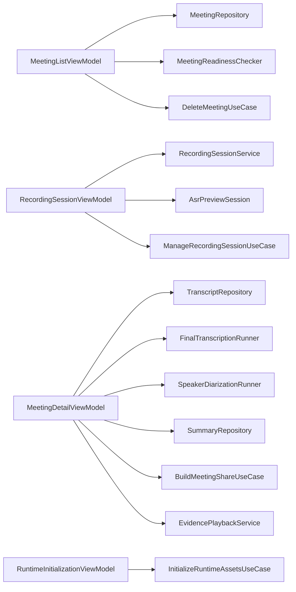

# 主要视图组件

<cite>
**本文引用的文件**   
- [meeting_list_view.dart](file://lib/ui/features/meetings/views/list/meeting_list_view.dart)
- [meeting_list_content.dart](file://lib/ui/features/meetings/views/list/meeting_list_content.dart)
- [meeting_list_view_model.dart](file://lib/ui/features/meetings/view_models/list/meeting_list_view_model.dart)
- [recording_session_view_model.dart](file://lib/ui/features/meetings/view_models/recording/recording_session_view_model.dart)
- [recording_audio_waveform.dart](file://lib/ui/features/meetings/views/recording/widgets/recording_audio_waveform.dart)
- [live_transcript_panel.dart](file://lib/ui/features/meetings/views/recording/widgets/live_transcript_panel.dart)
- [meeting_detail_view.dart](file://lib/ui/features/meetings/views/detail/meeting_detail_view.dart)
- [meeting_detail_view_model.dart](file://lib/ui/features/meetings/view_models/detail/meeting_detail_view_model.dart)
- [meettrace_startup_view.dart](file://lib/ui/features/startup/views/meettrace_startup_view.dart)
- [runtime_initialization_view_model.dart](file://lib/ui/features/startup/view_models/runtime_initialization_view_model.dart)
- [meettrace_flow.dart](file://lib/app/meettrace_flow.dart)
</cite>

## 目录
1. [简介](#简介)
2. [项目结构](#项目结构)
3. [核心组件](#核心组件)
4. [架构总览](#架构总览)
5. [详细组件分析](#详细组件分析)
6. [依赖关系分析](#依赖关系分析)
7. [性能考量](#性能考量)
8. [故障排查指南](#故障排查指南)
9. [结论](#结论)
10. [附录](#附录)

## 简介
本文件为会迹（MeetTrace）项目的“主要视图组件”文档，聚焦以下四个关键视图：
- 会议列表视图：数据绑定、状态管理、用户交互（打开/删除/设置）。
- 录音会话视图：音频波形可视化、实时转录显示、录音控制按钮与状态流转。
- 会议详情视图：结果展示（转录/摘要/证据回放）、编辑与分享。
- 启动视图：本地能力初始化流程、错误处理与重试。

每个视图均包含属性说明、事件处理、样式定制要点，并给出代码级图示与参考路径，便于快速定位实现。

## 项目结构
与会迹主要视图相关的 Flutter UI 位于 lib/ui/features 下，按功能域划分：
- meetings: 会议相关页面与视图模型
  - views/list: 会议列表页
  - views/recording: 录音会话页及子组件
  - views/detail: 会议详情页
- startup: 启动页与运行时资源准备
- app: 应用流与路由编排

图表来源
- [meeting_list_view.dart:32-106](file://lib/ui/features/meetings/views/list/meeting_list_view.dart#L32-L106)
- [meeting_list_content.dart:1-150](file://lib/ui/features/meetings/views/list/meeting_list_content.dart#L1-L150)
- [meeting_detail_view.dart:32-133](file://lib/ui/features/meetings/views/detail/meeting_detail_view.dart#L32-L133)
- [recording_session_view_model.dart:20-231](file://lib/ui/features/meetings/view_models/recording/recording_session_view_model.dart#L20-L231)
- [recording_audio_waveform.dart:14-123](file://lib/ui/features/meetings/views/recording/widgets/recording_audio_waveform.dart#L14-L123)
- [live_transcript_panel.dart:11-157](file://lib/ui/features/meetings/views/recording/widgets/live_transcript_panel.dart#L11-L157)
- [meettrace_startup_view.dart:16-85](file://lib/ui/features/startup/views/meettrace_startup_view.dart#L16-L85)
- [runtime_initialization_view_model.dart:6-42](file://lib/ui/features/startup/view_models/runtime_initialization_view_model.dart#L6-L42)
- [meettrace_flow.dart:70-126](file://lib/app/meettrace_flow.dart#L70-L126)

章节来源
- [meeting_list_view.dart:32-106](file://lib/ui/features/meetings/views/list/meeting_list_view.dart#L32-L106)
- [meeting_detail_view.dart:32-133](file://lib/ui/features/meetings/views/detail/meeting_detail_view.dart#L32-L133)
- [meettrace_startup_view.dart:16-85](file://lib/ui/features/startup/views/meettrace_startup_view.dart#L16-L85)
- [meettrace_flow.dart:70-126](file://lib/app/meettrace_flow.dart#L70-L126)

## 核心组件
- 会议列表视图（MeetingListView + MeetingListContent）
  - 通过 ListenableBuilder 监听 ViewModel 的 ViewState<List<Meeting>>，渲染加载/空态/错误/数据态。
  - 支持响应式布局（紧凑/中等/扩展），在扩展模式下采用主从布局（左侧列表+右侧预览）。
  - 提供删除确认对话框、设置入口、重试就绪检查等交互。
- 录音会话视图（RecordingSessionViewModel + 波形/转录面板）
  - 订阅麦克风音量变化生成 PCM RMS 序列，驱动波形绘制；同时订阅 ASR 预览事件，实时显示分段转录。
  - 提供开始/暂停/恢复/结束控制，内部维护忙闲状态与计时器更新时长。
- 会议详情视图（MeetingDetailView + MeetingDetailViewModel）
  - 聚合转录、说话人分离、摘要、证据回放等多模块 VM，统一暴露状态与操作。
  - 支持加载中、处理中、失败、空结果等状态分支，以及编辑转录、播放证据、分享与删除。
- 启动视图（MeetTraceStartupView + RuntimeInitializationViewModel）
  - 分阶段展示本地数据读取与离线资源下载进度，支持移动网络授权、暂停/继续、失败重试。
  - 通过 AnimatedSwitcher 平滑切换“检查/下载/校验/启用/就绪”等阶段。

章节来源
- [meeting_list_view.dart:32-106](file://lib/ui/features/meetings/views/list/meeting_list_view.dart#L32-L106)
- [meeting_list_content.dart:150-250](file://lib/ui/features/meetings/views/list/meeting_list_content.dart#L150-L250)
- [meeting_list_view_model.dart:41-188](file://lib/ui/features/meetings/view_models/list/meeting_list_view_model.dart#L41-L188)
- [recording_session_view_model.dart:20-231](file://lib/ui/features/meetings/view_models/recording/recording_session_view_model.dart#L20-L231)
- [recording_audio_waveform.dart:14-123](file://lib/ui/features/meetings/views/recording/widgets/recording_audio_waveform.dart#L14-L123)
- [live_transcript_panel.dart:11-157](file://lib/ui/features/meetings/views/recording/widgets/live_transcript_panel.dart#L11-L157)
- [meeting_detail_view.dart:32-133](file://lib/ui/features/meetings/views/detail/meeting_detail_view.dart#L32-L133)
- [meeting_detail_view_model.dart:30-273](file://lib/ui/features/meetings/view_models/detail/meeting_detail_view_model.dart#L30-L273)
- [meettrace_startup_view.dart:16-85](file://lib/ui/features/startup/views/meettrace_startup_view.dart#L16-L85)
- [runtime_initialization_view_model.dart:6-131](file://lib/ui/features/startup/view_models/runtime_initialization_view_model.dart#L6-L131)

## 架构总览
下图展示了启动到首页、进入录音与详情的整体流程，以及各 ViewModel 的职责边界。

图表来源
- [meettrace_flow.dart:70-126](file://lib/app/meettrace_flow.dart#L70-L126)
- [meettrace_startup_view.dart:36-85](file://lib/ui/features/startup/views/meettrace_startup_view.dart#L36-L85)
- [runtime_initialization_view_model.dart:29-72](file://lib/ui/features/startup/view_models/runtime_initialization_view_model.dart#L29-L72)
- [meeting_list_view.dart:54-73](file://lib/ui/features/meetings/views/list/meeting_list_view.dart#L54-L73)
- [meeting_detail_view.dart:48-81](file://lib/ui/features/meetings/views/detail/meeting_detail_view.dart#L48-L81)
- [recording_session_view_model.dart:71-97](file://lib/ui/features/meetings/view_models/recording/recording_session_view_model.dart#L71-L97)

## 详细组件分析

### 会议列表视图（MeetingListView / MeetingListContent）
- 数据绑定
  - 使用 ListenableBuilder 监听 MeetingListViewModel 的 state（ViewLoading/ViewError/ViewData）。
  - 通过 StreamSubscription 订阅会议仓库，自动刷新列表。
- 状态管理
  - readiness 状态用于提示麦克风权限、存储空间、默认模型可用性。
  - deletingMeetingIds 集合标记正在删除的会议，避免重复操作。
- 用户交互
  - 打开设置、重试就绪检查、左滑删除（带确认对话框）、选择会议（平板主从模式）。
- 样式定制
  - 基于主题与 AppResponsiveBuilder 适配不同屏幕尺寸。
  - 使用 AppStatePanel 统一展示加载/空态/错误态。

图表来源
- [meeting_list_view.dart:32-106](file://lib/ui/features/meetings/views/list/meeting_list_view.dart#L32-L106)
- [meeting_list_content.dart:1-150](file://lib/ui/features/meetings/views/list/meeting_list_content.dart#L1-L150)
- [meeting_list_view_model.dart:41-188](file://lib/ui/features/meetings/view_models/list/meeting_list_view_model.dart#L41-L188)

章节来源
- [meeting_list_view.dart:54-106](file://lib/ui/features/meetings/views/list/meeting_list_view.dart#L54-L106)
- [meeting_list_content.dart:150-250](file://lib/ui/features/meetings/views/list/meeting_list_content.dart#L150-L250)
- [meeting_list_view_model.dart:78-188](file://lib/ui/features/meetings/view_models/list/meeting_list_view_model.dart#L78-L188)

### 录音会话视图（RecordingSessionViewModel + 波形/转录面板）
- 音频波形可视化
  - 订阅 recording.audioLevelChanges，维护固定容量（48）的 levels 队列，驱动 RecordingAudioWaveform 绘制。
  - 波形使用 CustomPaint 与动画插值，保证流畅过渡与无障碍语义。
- 实时转录显示
  - 订阅 AsrPreviewSession.events，按 segmentId 去重排序，渲染 LiveTranscriptPanel。
- 录音控制按钮
  - start/pause/resume/stop 四态控制，内部维护 isBusy/isFinalizing 防止并发冲突。
  - 定时器每 250ms 刷新 duration，确保时间显示准确。
- 错误处理
  - 捕获 ManageRecordingSessionException 与通用异常，设置 errorMessage 并释放预览资源。

图表来源
- [recording_session_view_model.dart:71-144](file://lib/ui/features/meetings/view_models/recording/recording_session_view_model.dart#L71-L144)
- [recording_audio_waveform.dart:14-123](file://lib/ui/features/meetings/views/recording/widgets/recording_audio_waveform.dart#L14-L123)
- [live_transcript_panel.dart:11-157](file://lib/ui/features/meetings/views/recording/widgets/live_transcript_panel.dart#L11-L157)

章节来源
- [recording_session_view_model.dart:20-231](file://lib/ui/features/meetings/view_models/recording/recording_session_view_model.dart#L20-L231)
- [recording_audio_waveform.dart:14-123](file://lib/ui/features/meetings/views/recording/widgets/recording_audio_waveform.dart#L14-L123)
- [live_transcript_panel.dart:11-157](file://lib/ui/features/meetings/views/recording/widgets/live_transcript_panel.dart#L11-L157)

### 会议详情视图（MeetingDetailView）
- 数据展示
  - 聚合 transcript/summary/audio/actions 四个子 VM，统一暴露 loading/processing/error/snapshot 等状态。
  - 支持转录编辑、说话人标签重命名、证据片段回放、全文播放。
- 交互功能
  - 返回时禁止中断处理中的操作（PopScope）。
  - 自动生成摘要（满足条件时）、重新转录、重试失败尝试。
- 样式定制
  - 使用 AppPageBody 与主题样式，适配阅读宽度与卡片边框。

图表来源
- [meeting_detail_view.dart:32-133](file://lib/ui/features/meetings/views/detail/meeting_detail_view.dart#L32-L133)
- [meeting_detail_view_model.dart:30-273](file://lib/ui/features/meetings/view_models/detail/meeting_detail_view_model.dart#L30-L273)

章节来源
- [meeting_detail_view.dart:48-133](file://lib/ui/features/meetings/views/detail/meeting_detail_view.dart#L48-L133)
- [meeting_detail_view_model.dart:196-273](file://lib/ui/features/meetings/view_models/detail/meeting_detail_view_model.dart#L196-L273)

### 启动视图（MeetTraceStartupView）
- 初始化流程
  - 启动后调用 RuntimeInitializationViewModel.start()，依次经历 checking -> awaitingMobileConsent/downloading/verifying/activating -> ready。
  - 通过 AnimatedSwitcher 平滑切换阶段视图，尊重系统动效设置。
- 错误处理
  - 捕获移动网络授权、空间不足、下载暂停、校验失败等异常，分别映射到对应 phase。
  - 提供“同意并下载/暂不使用移动网络/暂停/继续/重试”等操作。
- 样式定制
  - 统一的 _StartupFrame 框架，限制最大内容宽度，适配多屏尺寸。

图表来源
- [meettrace_startup_view.dart:36-85](file://lib/ui/features/startup/views/meettrace_startup_view.dart#L36-L85)
- [runtime_initialization_view_model.dart:74-114](file://lib/ui/features/startup/view_models/runtime_initialization_view_model.dart#L74-L114)

章节来源
- [meettrace_startup_view.dart:16-85](file://lib/ui/features/startup/views/meettrace_startup_view.dart#L16-L85)
- [runtime_initialization_view_model.dart:6-131](file://lib/ui/features/startup/view_models/runtime_initialization_view_model.dart#L6-L131)

## 依赖关系分析
- 视图与 ViewModel 解耦：所有视图通过 ChangeNotifier 的 ListenableBuilder 订阅状态变更，避免直接耦合业务逻辑。
- 外部依赖注入：
  - 会议列表依赖 MeetingRepository、MeetingReadinessChecker、DeleteMeetingUseCase。
  - 录音会话依赖 RecordingSessionService、AsrPreviewSession、ManageRecordingSessionUseCase。
  - 会议详情依赖多个 Repository/UseCase（转录、说话人分离、摘要、分享、删除、回放）。
  - 启动依赖 InitializeRuntimeAssetsUseCase。
- 潜在循环依赖：当前未见循环引用，ViewModel 之间无直接依赖，通过各自 UseCase/Port 隔离。

图表来源
- [meeting_list_view_model.dart:41-188](file://lib/ui/features/meetings/view_models/list/meeting_list_view_model.dart#L41-L188)
- [recording_session_view_model.dart:20-231](file://lib/ui/features/meetings/view_models/recording/recording_session_view_model.dart#L20-L231)
- [meeting_detail_view_model.dart:30-273](file://lib/ui/features/meetings/view_models/detail/meeting_detail_view_model.dart#L30-L273)
- [runtime_initialization_view_model.dart:6-131](file://lib/ui/features/startup/view_models/runtime_initialization_view_model.dart#L6-L131)

章节来源
- [meeting_list_view_model.dart:41-188](file://lib/ui/features/meetings/view_models/list/meeting_list_view_model.dart#L41-L188)
- [recording_session_view_model.dart:20-231](file://lib/ui/features/meetings/view_models/recording/recording_session_view_model.dart#L20-L231)
- [meeting_detail_view_model.dart:30-273](file://lib/ui/features/meetings/view_models/detail/meeting_detail_view_model.dart#L30-L273)
- [runtime_initialization_view_model.dart:6-131](file://lib/ui/features/startup/view_models/runtime_initialization_view_model.dart#L6-L131)

## 性能考量
- 列表渲染
  - 使用 ListView + AppLedgerSurface 减少不必要的重建；滚动开始时隐藏已展开行，降低重绘。
- 波形绘制
  - 固定采样容量（48），避免内存增长；CustomPaint 仅在 levels 或主题变化时重绘；动画插值提升视觉流畅度。
- 实时转录
  - 按 segmentId 去重与稳定排序，避免频繁全量重建；仅对新增/变更段进行增量更新。
- 启动流程
  - 分阶段推进，允许暂停/恢复，避免阻塞主线程；尊重系统动效设置以减少卡顿。

[本节为通用指导，不直接分析具体文件]

## 故障排查指南
- 会议列表
  - 加载失败：查看 ViewError 的 retry 回调是否可用；检查仓库订阅是否被取消。
  - 删除失败：确认 canDeleteMeeting 状态（录音/处理中不可删）；查看 deleteErrorMessage。
- 录音会话
  - 无法启动：检查麦克风权限与存储空间；查看 errorMessage 与 recordingState。
  - 波形不更新：确认 audioLevelChanges 订阅存在且 levels 队列未满；检查 Accessibility 动效设置。
  - 转录不显示：确认 AsrPreviewSession.events 正常推送；检查 segmentId 去重逻辑。
- 会议详情
  - 转录失败：查看 failedAttempt 与 errorMessage；可触发 retranscribe。
  - 摘要未生成：确认 summaryAvailable 与 canGenerateSummary；检查 _shouldAutoGenerateSummary 条件。
- 启动页
  - 移动网络授权：awaitingMobileConsent 阶段需用户确认；拒绝后进入 failed 状态。
  - 空间不足：insufficientSpace 阶段提示释放空间后重试。
  - 下载暂停：paused 状态支持 resume；失败时提供重试按钮。

章节来源
- [meeting_list_view_model.dart:126-188](file://lib/ui/features/meetings/view_models/list/meeting_list_view_model.dart#L126-L188)
- [recording_session_view_model.dart:71-144](file://lib/ui/features/meetings/view_models/recording/recording_session_view_model.dart#L71-L144)
- [meeting_detail_view_model.dart:216-273](file://lib/ui/features/meetings/view_models/detail/meeting_detail_view_model.dart#L216-L273)
- [runtime_initialization_view_model.dart:74-114](file://lib/ui/features/startup/view_models/runtime_initialization_view_model.dart#L74-L114)

## 结论
会迹的主要视图组件以清晰的 MVVM 分层组织，视图层专注状态展示与用户交互，ViewModel 负责业务编排与外部依赖调用。录音会话的波形与实时转录通过稳定的数据流与轻量绘制策略保障性能；启动流程的分阶段设计与完善的错误处理提升了用户体验与鲁棒性。建议在后续迭代中继续强化单元测试覆盖与可访问性测试，确保复杂交互的稳定与易用。

[本节为总结性内容，不直接分析具体文件]

## 附录
- 常用属性与方法速查
  - MeetingListViewModel: load/retry/refreshReadiness/deleteMeeting/canDeleteMeeting
  - RecordingSessionViewModel: start/pause/resume/stop/refreshDuration/segments/audioLevels
  - MeetingDetailViewModel: load/retry/retranscribe/generateSummary/playEvidence/share/deleteMeeting
  - RuntimeInitializationViewModel: start/confirmMobileDownload/declineMobileDownload/resume/pause

[本节为概览性内容，不直接分析具体文件]