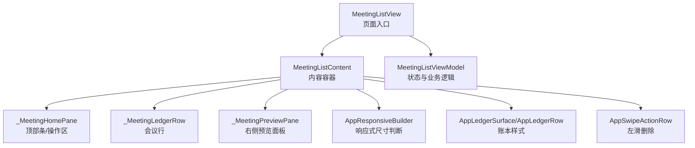
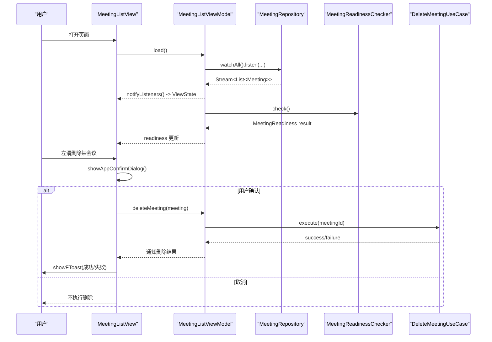
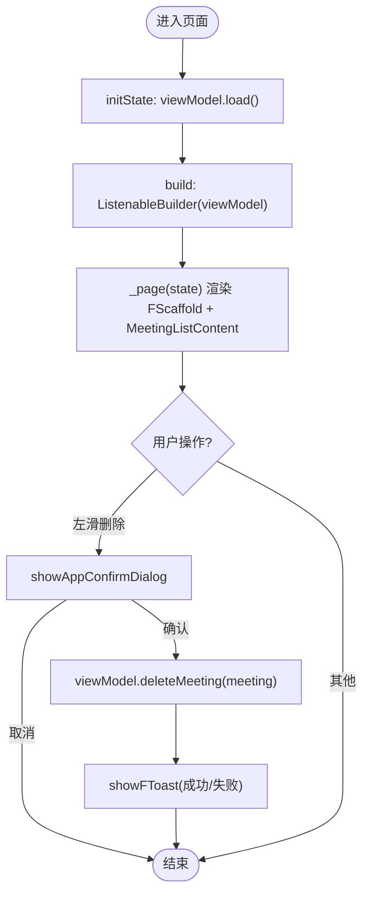
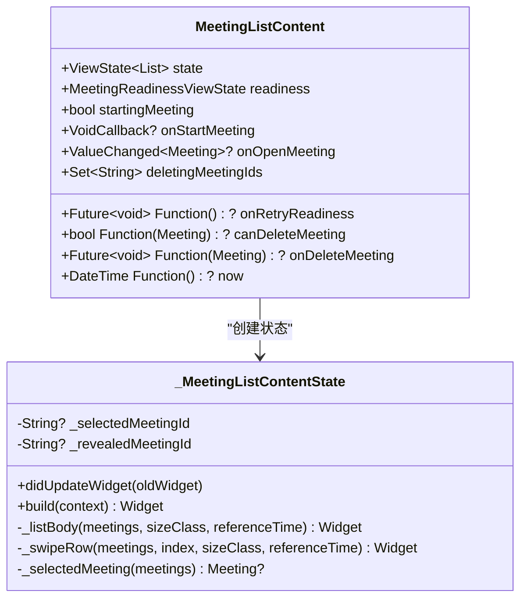
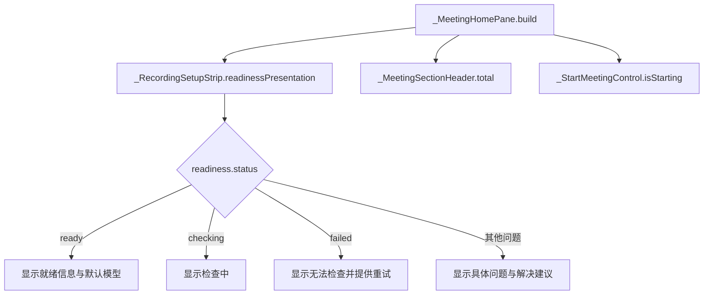
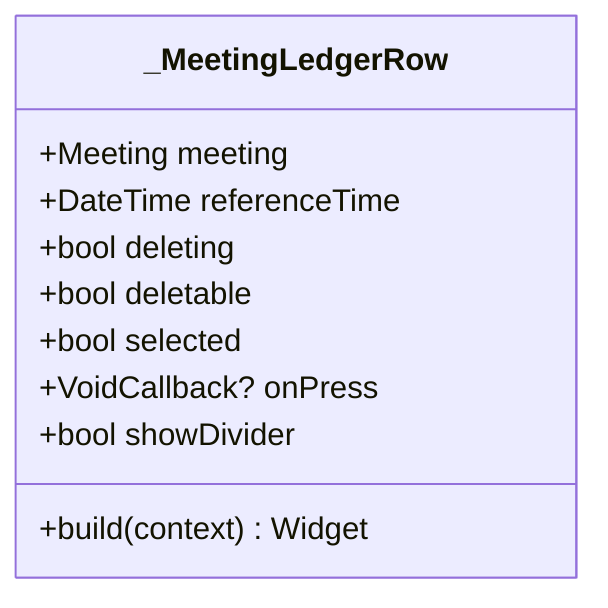
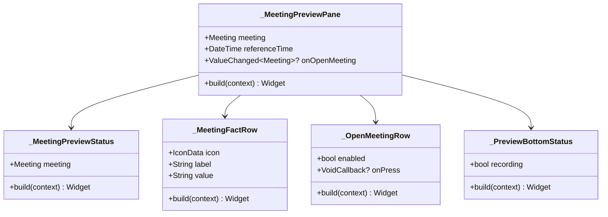
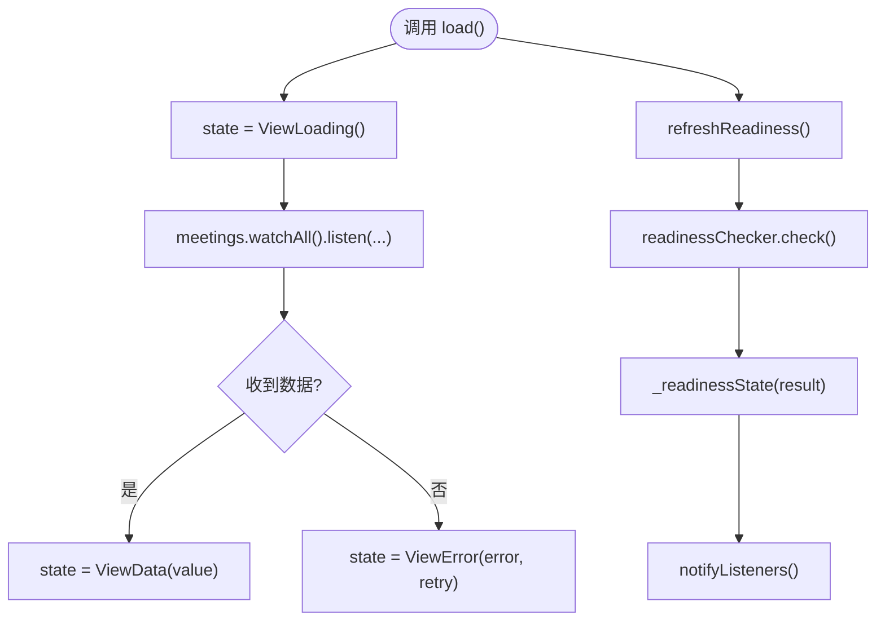
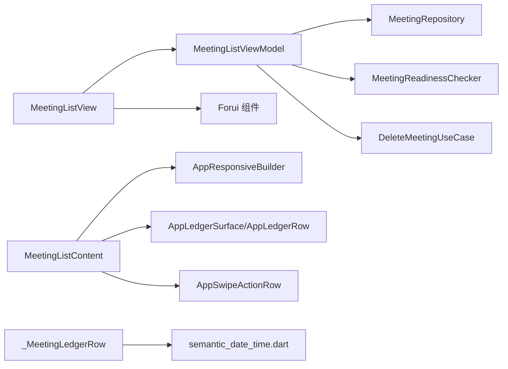

# 会议列表视图

<cite>
**本文引用的文件**   
- [meeting_list_view.dart](file://lib/ui/features/meetings/views/list/meeting_list_view.dart)
- [meeting_list_content.dart](file://lib/ui/features/meetings/views/list/meeting_list_content.dart)
- [meeting_ledger_row.dart](file://lib/ui/features/meetings/views/list/widgets/meeting_ledger_row.dart)
- [meeting_preview_pane.dart](file://lib/ui/features/meetings/views/list/widgets/meeting_preview_pane.dart)
- [meeting_list_chrome.dart](file://lib/ui/features/meetings/views/list/widgets/meeting_list_chrome.dart)
- [meeting_list_view_model.dart](file://lib/ui/features/meetings/view_models/list/meeting_list_view_model.dart)
- [semantic_date_time.dart](file://lib/ui/core/semantic_date_time.dart)
- [app_ledger.dart](file://lib/ui/core/app_ledger.dart)
- [meeting_list_view_test.dart](file://test/ui/features/meetings/views/list/meeting_list_view_test.dart)
</cite>

## 目录
1. [简介](#简介)
2. [项目结构](#项目结构)
3. [核心组件](#核心组件)
4. [架构总览](#架构总览)
5. [详细组件分析](#详细组件分析)
6. [依赖关系分析](#依赖关系分析)
7. [性能考量](#性能考量)
8. [故障排查指南](#故障排查指南)
9. [结论](#结论)
10. [附录](#附录)

## 简介
本文件为“会议列表视图”的完整技术文档，聚焦 MeetingListView 及其子组件的实现与交互。内容涵盖：
- 状态管理与数据绑定（ViewState、ViewModel、Stream 订阅）
- 用户交互处理（左滑删除、确认对话框、录音准备状态检查）
- 账本式布局设计与响应式适配（手机单栏、平板主从布局）
- 会议行展示（MeetingLedgerRow）、预览面板（MeetingPreviewPane）
- 与 MeetingListViewModel 的集成方式、数据流与状态更新机制
- 完整的属性说明、事件处理方法与测试用例参考路径

## 项目结构
会议列表视图由一个页面级 StatefulWidget 与其多个 part 文件组成，采用 Flutter 的 part 组织方式将 UI 拆分为可复用的小部件：
- 页面入口：MeetingListView
- 内容容器：MeetingListContent（含响应式布局、选择态管理、列表渲染）
- 顶部条与操作区：_MeetingHomePane（录音条件条、会议标题、开始按钮）
- 会议行：_MeetingLedgerRow（时间、标题、状态、时长等）
- 右侧预览：_MeetingPreviewPane（事实信息、模型来源、打开详情）

图表来源
- [meeting_list_view.dart:32-107](file://lib/ui/features/meetings/views/list/meeting_list_view.dart#L32-L107)
- [meeting_list_content.dart:3-132](file://lib/ui/features/meetings/views/list/meeting_list_content.dart#L3-L132)
- [meeting_list_chrome.dart:3-45](file://lib/ui/features/meetings/views/list/widgets/meeting_list_chrome.dart#L3-L45)
- [meeting_ledger_row.dart:3-58](file://lib/ui/features/meetings/views/list/widgets/meeting_ledger_row.dart#L3-L58)
- [meeting_preview_pane.dart:16-104](file://lib/ui/features/meetings/views/list/widgets/meeting_preview_pane.dart#L16-L104)

章节来源
- [meeting_list_view.dart:1-150](file://lib/ui/features/meetings/views/list/meeting_list_view.dart#L1-L150)
- [meeting_list_content.dart:1-251](file://lib/ui/features/meetings/views/list/meeting_list_content.dart#L1-L251)

## 核心组件
- MeetingListView
  - 职责：页面外壳、头部、挂载 ViewModel、删除确认流程、Toast 反馈
  - 关键属性：viewModel、startingMeeting、onStartMeeting、onOpenMeeting、onOpenSettings、now
  - 关键方法：_requestDeleteMeeting(Meeting)
- MeetingListContent
  - 职责：响应式布局、选中会议管理、列表渲染、左滑删除、打开会议
  - 关键属性：state、readiness、startingMeeting、onStartMeeting、onOpenMeeting、onRetryReadiness、deletingMeetingIds、canDeleteMeeting、onDeleteMeeting、now
- _MeetingHomePane
  - 职责：录音条件条、会议标题、开始会议控制
- _MeetingLedgerRow
  - 职责：单条会议的时间、标题、状态、时长、语义标签
- _MeetingPreviewPane
  - 职责：选中会议的详细信息、事实描述、模型显示、打开完整记录
- MeetingListViewModel
  - 职责：会议数据流监听、就绪性检查、删除流程、错误重试

章节来源
- [meeting_list_view.dart:32-147](file://lib/ui/features/meetings/views/list/meeting_list_view.dart#L32-L147)
- [meeting_list_content.dart:3-245](file://lib/ui/features/meetings/views/list/meeting_list_content.dart#L3-L245)
- [meeting_list_chrome.dart:3-333](file://lib/ui/features/meetings/views/list/widgets/meeting_list_chrome.dart#L3-L333)
- [meeting_ledger_row.dart:3-58](file://lib/ui/features/meetings/views/list/widgets/meeting_ledger_row.dart#L3-L58)
- [meeting_preview_pane.dart:16-392](file://lib/ui/features/meetings/views/list/widgets/meeting_preview_pane.dart#L16-L392)
- [meeting_list_view_model.dart:41-188](file://lib/ui/features/meetings/view_models/list/meeting_list_view_model.dart#L41-L188)

## 架构总览
MeetingListView 通过 ListenableBuilder 监听 MeetingListViewModel 的变化，驱动 ViewState<List<Meeting>> 的渲染。ViewModel 内部使用 Stream 订阅 MeetingRepository.watchAll()，并异步执行 MeetingReadinessChecker.check() 以更新录音准备状态。删除操作通过 DeleteMeetingUseCase 执行，并在 UI 层提供确认对话框与 Toast 反馈。

图表来源
- [meeting_list_view.dart:64-107](file://lib/ui/features/meetings/views/list/meeting_list_view.dart#L64-L107)
- [meeting_list_view_model.dart:78-143](file://lib/ui/features/meetings/view_models/list/meeting_list_view_model.dart#L78-L143)
- [meeting_list_view_model.dart:145-173](file://lib/ui/features/meetings/view_models/list/meeting_list_view_model.dart#L145-L173)

章节来源
- [meeting_list_view.dart:64-147](file://lib/ui/features/meetings/views/list/meeting_list_view.dart#L64-L147)
- [meeting_list_view_model.dart:78-173](file://lib/ui/features/meetings/view_models/list/meeting_list_view_model.dart#L78-L173)

## 详细组件分析

### MeetingListView 页面
- 状态管理
  - 使用 ListenableBuilder 监听 viewModel，渲染 _page(ViewState<List<Meeting>>)
  - 初始化时调用 widget.viewModel?.load()
- 删除确认
  - _requestDeleteMeeting(Meeting) 负责弹出确认对话框，成功后调用 viewModel.deleteMeeting(meeting)
  - 根据返回结果展示 FToast 提示
- 属性与方法
  - 属性：viewModel、startingMeeting、onStartMeeting、onOpenMeeting、onOpenSettings、now
  - 方法：_requestDeleteMeeting(Meeting)

图表来源
- [meeting_list_view.dart:54-107](file://lib/ui/features/meetings/views/list/meeting_list_view.dart#L54-L107)
- [meeting_list_view.dart:109-147](file://lib/ui/features/meetings/views/list/meeting_list_view.dart#L109-L147)

章节来源
- [meeting_list_view.dart:32-147](file://lib/ui/features/meetings/views/list/meeting_list_view.dart#L32-L147)

### MeetingListContent 内容容器
- 响应式布局
  - AppResponsiveBuilder 根据 sizeClass 决定单栏或主从布局
  - 平板模式：左侧列表宽度按 constraints.maxWidth * 0.42 计算，限制在 400-480 之间
- 选中会议管理
  - _selectedMeetingId 维护当前选中项；didUpdateWidget 保证列表变化后仍保持有效选中
- 列表渲染
  - ViewLoading/ViewError/ViewData 三种状态分别渲染加载、错误（带重试）、空数据或会议列表
  - 使用 NotificationListener<ScrollStartNotification> 在滚动开始时关闭已揭示的删除动作
- 左滑删除
  - AppSwipeActionRow 包裹 _MeetingLedgerRow，支持 onSwipeStart/onRevealChanged/onAction
  - 仅当 canDeleteMeeting(meeting) 为真时才启用删除
- 打开会议
  - 平板模式点击行更新 _selectedMeetingId；非平板模式直接回调 onOpenMeeting

图表来源
- [meeting_list_content.dart:3-132](file://lib/ui/features/meetings/views/list/meeting_list_content.dart#L3-L132)
- [meeting_list_content.dart:150-245](file://lib/ui/features/meetings/views/list/meeting_list_content.dart#L150-L245)

章节来源
- [meeting_list_content.dart:3-245](file://lib/ui/features/meetings/views/list/meeting_list_content.dart#L3-L245)

### _MeetingHomePane 顶部条与操作区
- 录音条件条
  - _RecordingSetupStrip 根据 MeetingReadinessViewState.status 展示不同图标、标题与细节
  - 失败状态提供“重新检查”操作；就绪状态可跳转设置页
- 会议标题与总数
  - _MeetingSectionHeader 显示“会议”与“共 X 场”
- 开始会议控制
  - _StartMeetingControl 提供全宽底栏，支持旋转动画与禁用重复启动

图表来源
- [meeting_list_chrome.dart:47-174](file://lib/ui/features/meetings/views/list/widgets/meeting_list_chrome.dart#L47-L174)
- [meeting_list_chrome.dart:217-333](file://lib/ui/features/meetings/views/list/widgets/meeting_list_chrome.dart#L217-L333)

章节来源
- [meeting_list_chrome.dart:3-333](file://lib/ui/features/meetings/views/list/widgets/meeting_list_chrome.dart#L3-L333)

### _MeetingLedgerRow 会议行展示
- 字段展示
  - dateLabel：语义化日期（今天/昨天/本周/月日/短年）
  - timeLabel：时钟时间（HH:mm）
  - title：会议标题
  - metaLabel：时长（hh:mm:ss）
  - statusIcon/statusLabel：状态图标与文本
  - emphasized：录音中强调显示
  - selected：平板模式下高亮选中
- 无障碍标签
  - semanticsLabel/hint 提供屏幕阅读器友好描述

图表来源
- [meeting_ledger_row.dart:3-58](file://lib/ui/features/meetings/views/list/widgets/meeting_ledger_row.dart#L3-L58)
- [semantic_date_time.dart:1-67](file://lib/ui/core/semantic_date_time.dart#L1-L67)

章节来源
- [meeting_ledger_row.dart:3-58](file://lib/ui/features/meetings/views/list/widgets/meeting_ledger_row.dart#L3-L58)
- [semantic_date_time.dart:1-67](file://lib/ui/core/semantic_date_time.dart#L1-L67)

### _MeetingPreviewPane 预览面板功能
- 基本信息
  - 标题、状态条（录音中/已完成/失败等）、时长、事实音频状态、本场模型
- 事实描述
  - 根据不同状态输出不同的事实描述文案
- 打开完整记录
  - _OpenMeetingRow 提供“打开完整记录”入口，触发 onOpenMeeting(meeting)
- 底部状态
  - _PreviewBottomStatus 显示“事实音频本地优先”，录音中附加“录音不中断”

图表来源
- [meeting_preview_pane.dart:16-104](file://lib/ui/features/meetings/views/list/widgets/meeting_preview_pane.dart#L16-L104)
- [meeting_preview_pane.dart:106-180](file://lib/ui/features/meetings/views/list/widgets/meeting_preview_pane.dart#L106-L180)
- [meeting_preview_pane.dart:182-284](file://lib/ui/features/meetings/views/list/widgets/meeting_preview_pane.dart#L182-L284)
- [meeting_preview_pane.dart:286-329](file://lib/ui/features/meetings/views/list/widgets/meeting_preview_pane.dart#L286-L329)

章节来源
- [meeting_preview_pane.dart:16-392](file://lib/ui/features/meetings/views/list/widgets/meeting_preview_pane.dart#L16-L392)

### MeetingListViewModel 状态与数据流
- 数据流
  - load() 初始化 ViewState 为 loading，订阅 meetings.watchAll()，错误时切换为 ViewError
  - refreshReadiness() 调用 readinessChecker.check()，映射为 MeetingReadinessViewState
- 删除流程
  - deleteMeeting(meeting) 校验 canDeleteMeeting，添加删除 ID，执行 deletion.execute，finally 清理状态
- 可用性判断
  - canDeleteMeeting(meeting) 基于 MeetingState 判断是否允许删除（录音中/处理中不可删）

图表来源
- [meeting_list_view_model.dart:78-107](file://lib/ui/features/meetings/view_models/list/meeting_list_view_model.dart#L78-L107)
- [meeting_list_view_model.dart:109-173](file://lib/ui/features/meetings/view_models/list/meeting_list_view_model.dart#L109-L173)

章节来源
- [meeting_list_view_model.dart:41-188](file://lib/ui/features/meetings/view_models/list/meeting_list_view_model.dart#L41-L188)

## 依赖关系分析
- UI 层依赖
  - MeetingListView 依赖 MeetingListViewModel、Forui 组件（FScaffold、FHeader、FTappable、FToast）
  - MeetingListContent 依赖 AppResponsiveBuilder、AppLedgerSurface、AppSwipeActionRow、AppLedgerRow
  - 语义化时间工具 semantic_date_time.dart 提供日期/时间标签
- 领域层依赖
  - MeetingListViewModel 依赖 MeetingRepository、MeetingReadinessChecker、DeleteMeetingUseCase
- 测试覆盖
  - meeting_list_view_test.dart 覆盖空列表、就绪状态、重试、开始会议几何稳定、平板主从布局、语义化日期、错误重试、左滑删除、禁止删除状态等

图表来源
- [meeting_list_view.dart:1-31](file://lib/ui/features/meetings/views/list/meeting_list_view.dart#L1-L31)
- [meeting_list_content.dart:1-33](file://lib/ui/features/meetings/views/list/meeting_list_content.dart#L1-L33)
- [meeting_list_view_model.dart:1-12](file://lib/ui/features/meetings/view_models/list/meeting_list_view_model.dart#L1-L12)
- [semantic_date_time.dart:1-67](file://lib/ui/core/semantic_date_time.dart#L1-L67)

章节来源
- [meeting_list_view.dart:1-31](file://lib/ui/features/meetings/views/list/meeting_list_view.dart#L1-L31)
- [meeting_list_content.dart:1-33](file://lib/ui/features/meetings/views/list/meeting_list_content.dart#L1-L33)
- [meeting_list_view_model.dart:1-12](file://lib/ui/features/meetings/view_models/list/meeting_list_view_model.dart#L1-L12)
- [meeting_list_view_test.dart:19-483](file://test/ui/features/meetings/views/list/meeting_list_view_test.dart#L19-L483)

## 性能考量
- 列表渲染优化
  - 使用 ListView 配合 AppLedgerSurface，避免不必要的重建
  - 滚动时关闭已揭示的删除动作，减少状态抖动
- 响应式布局
  - 平板模式下固定列表宽度范围（400-480），避免过度拉伸导致重排
- 动画与交互
  - 开始会议按钮使用 AnimationController 控制旋转，尊重系统动画开关
- 数据流
  - Stream 订阅仅在 load() 中建立一次，避免重复订阅造成内存泄漏
  - dispose() 中取消订阅，确保资源释放

[本节为通用指导，无需特定文件引用]

## 故障排查指南
- 列表加载失败
  - 现象：显示“会议加载失败”与“重试加载”
  - 原因：Meetings Repository 抛出错误
  - 处理：点击重试按钮调用 viewModel.retry()
- 录音条件检查失败
  - 现象：显示“无法检查录音条件”
  - 处理：点击状态条进行重新检查
- 删除被阻止
  - 现象：左滑删除无效
  - 原因：会议处于录音中或处理中（canDeleteMeeting 返回 false）
- 删除失败
  - 现象：Toast 显示“删除失败”
  - 原因：底层删除异常，会议数据保留
  - 处理：查看日志并重试

章节来源
- [meeting_list_content.dart:155-168](file://lib/ui/features/meetings/views/list/meeting_list_content.dart#L155-L168)
- [meeting_list_chrome.dart:133-174](file://lib/ui/features/meetings/views/list/widgets/meeting_list_chrome.dart#L133-L174)
- [meeting_list_view_model.dart:126-143](file://lib/ui/features/meetings/view_models/list/meeting_list_view_model.dart#L126-L143)
- [meeting_list_view_test.dart:322-340](file://test/ui/features/meetings/views/list/meeting_list_view_test.dart#L322-L340)

## 结论
会议列表视图通过清晰的组件拆分与 ViewModel 状态管理，实现了账本式布局、响应式适配、左滑删除与确认对话框、录音准备状态检查等功能。数据流单向明确，UI 与业务解耦良好，测试覆盖全面，便于后续扩展与维护。

[本节为总结，无需特定文件引用]

## 附录
- 属性与方法速查
  - MeetingListView
    - 属性：viewModel、startingMeeting、onStartMeeting、onOpenMeeting、onOpenSettings、now
    - 方法：_requestDeleteMeeting(Meeting)
  - MeetingListContent
    - 属性：state、readiness、startingMeeting、onStartMeeting、onOpenMeeting、onRetryReadiness、deletingMeetingIds、canDeleteMeeting、onDeleteMeeting、now
  - MeetingListViewModel
    - 方法：load()、retry()、refreshReadiness()、deleteMeeting(Meeting)、canDeleteMeeting(Meeting)
- 测试用例参考
  - 空列表与开始会议：[meeting_list_view_test.dart:19-42](file://test/ui/features/meetings/views/list/meeting_list_view_test.dart#L19-L42)
  - 录音条件状态与重试：[meeting_list_view_test.dart:44-109](file://test/ui/features/meetings/views/list/meeting_list_view_test.dart#L44-L109)
  - 开始按钮几何稳定与防抖：[meeting_list_view_test.dart:111-190](file://test/ui/features/meetings/views/list/meeting_list_view_test.dart#L111-L190)
  - 平板主从布局与预览：[meeting_list_view_test.dart:192-263](file://test/ui/features/meetings/views/list/meeting_list_view_test.dart#L192-L263)
  - 语义化日期标签：[meeting_list_view_test.dart:265-320](file://test/ui/features/meetings/views/list/meeting_list_view_test.dart#L265-L320)
  - 错误重试与删除流程：[meeting_list_view_test.dart:322-483](file://test/ui/features/meetings/views/list/meeting_list_view_test.dart#L322-L483)

章节来源
- [meeting_list_view_test.dart:19-483](file://test/ui/features/meetings/views/list/meeting_list_view_test.dart#L19-L483)