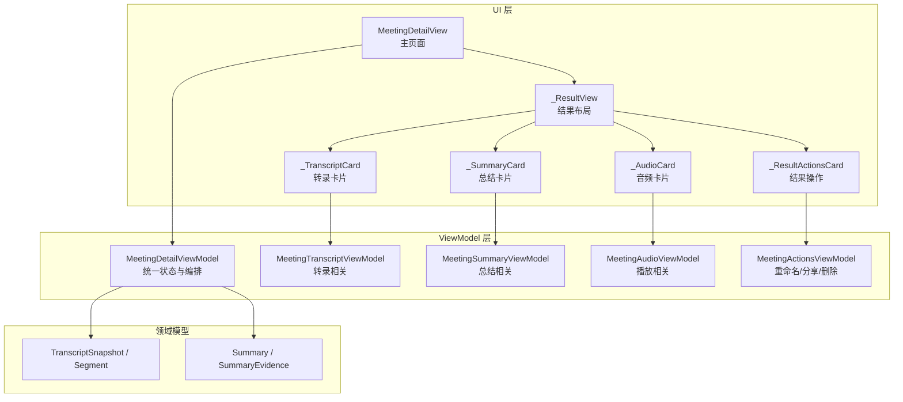
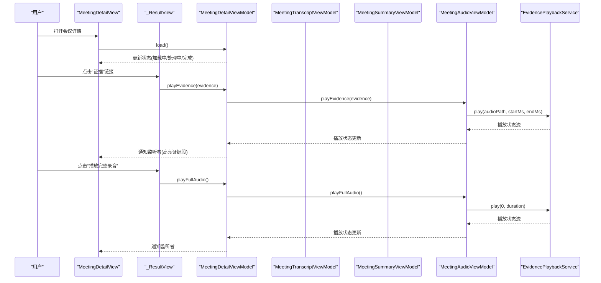
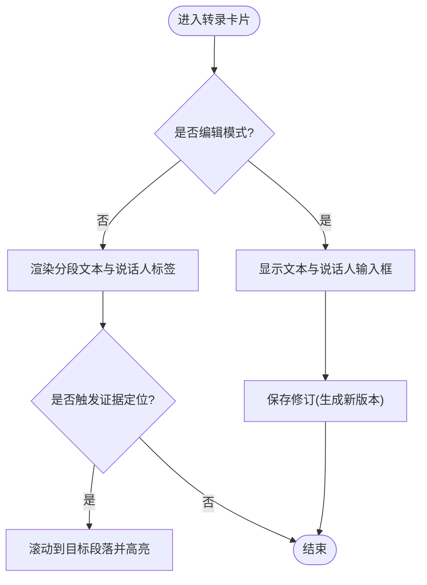
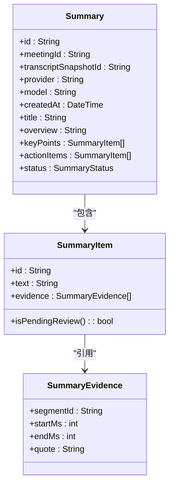
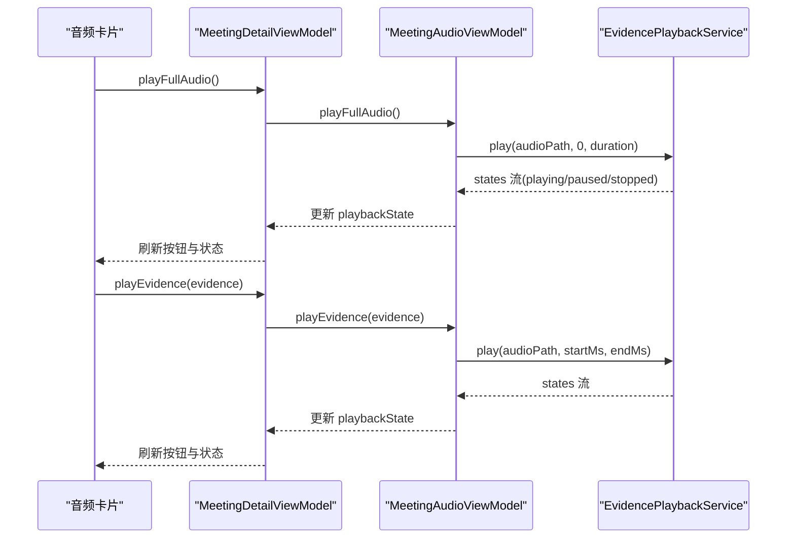
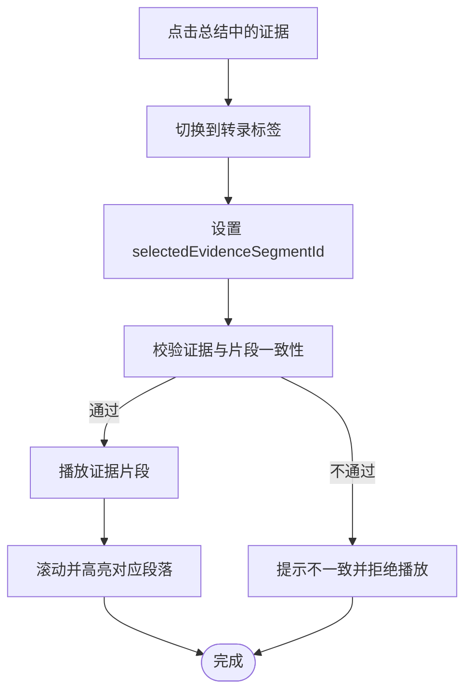
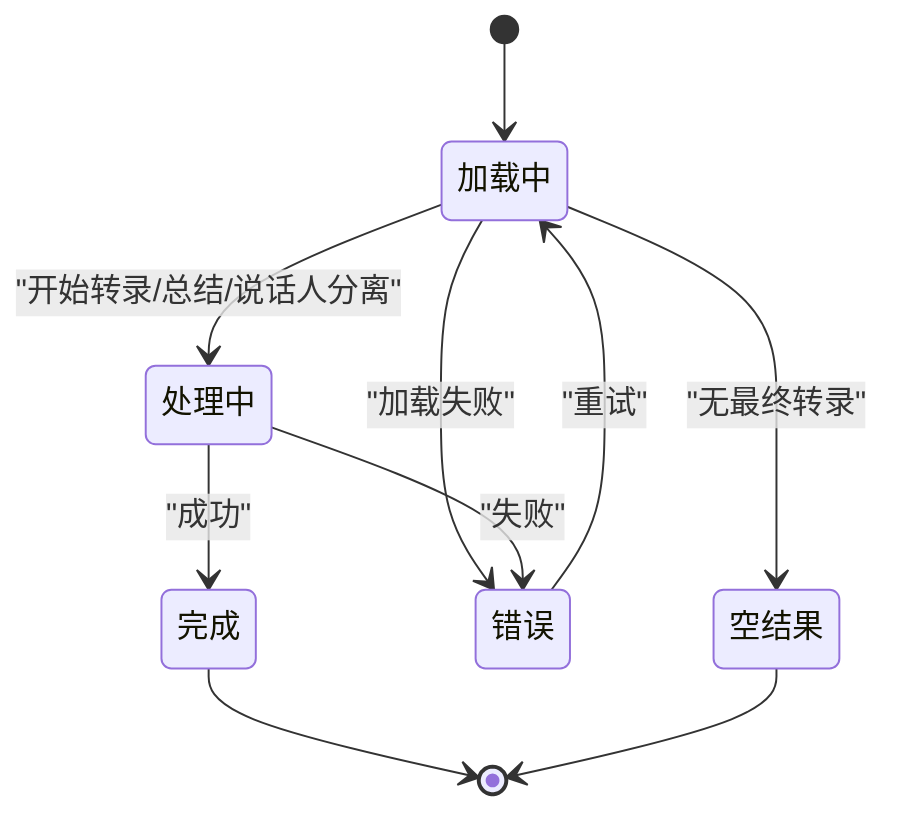
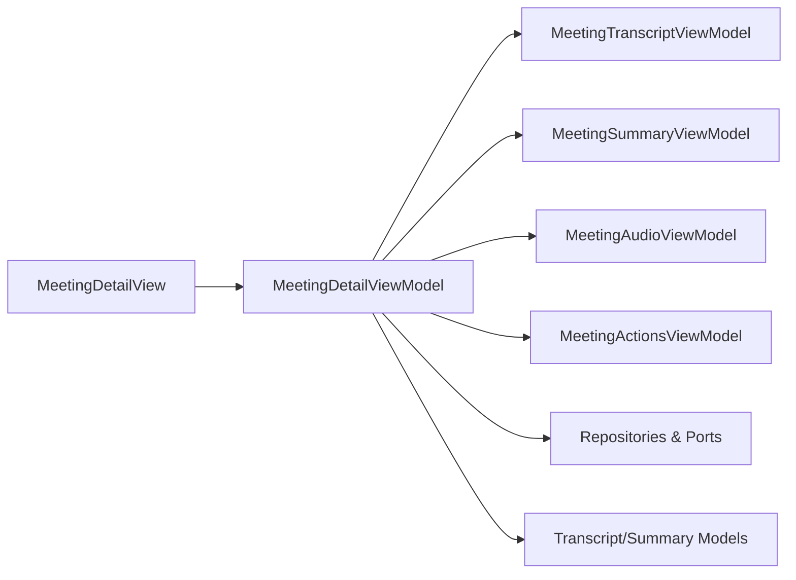

# 会议详情视图

<cite>
**本文引用的文件**
- [meeting_detail_view.dart](file://lib/ui/features/meetings/views/detail/meeting_detail_view.dart)
- [meeting_result_layout.dart](file://lib/ui/features/meetings/views/detail/widgets/meeting_result_layout.dart)
- [meeting_transcript_section.dart](file://lib/ui/features/meetings/views/detail/transcript/meeting_transcript_section.dart)
- [meeting_summary_section.dart](file://lib/ui/features/meetings/views/detail/summary/meeting_summary_section.dart)
- [meeting_audio_actions.dart](file://lib/ui/features/meetings/views/detail/audio/meeting_audio_actions.dart)
- [meeting_detail_view_model.dart](file://lib/ui/features/meetings/view_models/detail/meeting_detail_view_model.dart)
- [meeting_detail_state.dart](file://lib/ui/features/meetings/view_models/detail/meeting_detail_state.dart)
- [meeting_transcript_view_model.dart](file://lib/ui/features/meetings/view_models/detail/meeting_transcript_view_model.dart)
- [meeting_summary_view_model.dart](file://lib/ui/features/meetings/view_models/detail/meeting_summary_view_model.dart)
- [meeting_audio_view_model.dart](file://lib/ui/features/meetings/view_models/detail/meeting_audio_view_model.dart)
- [meeting_actions_view_model.dart](file://lib/ui/features/meetings/view_models/detail/meeting_actions_view_model.dart)
- [transcript.dart](file://lib/domain/models/transcript.dart)
- [summary.dart](file://lib/domain/models/summary.dart)
</cite>

## 目录
1. [简介](#简介)
2. [项目结构](#项目结构)
3. [核心组件](#核心组件)
4. [架构总览](#架构总览)
5. [详细组件分析](#详细组件分析)
6. [依赖关系分析](#依赖关系分析)
7. [性能考量](#性能考量)
8. [故障排查指南](#故障排查指南)
9. [结论](#结论)
10. [附录：使用示例与最佳实践](#附录使用示例与最佳实践)

## 简介
本文件面向“会议详情视图”的实现与使用，覆盖以下能力：
- 数据展示：会议基本信息、转录内容分段显示、AI总结（含证据索引）、证据定位。
- 音频播放器集成：播放控制、进度条、时间戳跳转、完整录音播放与证据片段播放。
- 交互逻辑：从总结文本点击证据跳转到对应音频片段并高亮定位转录段落。
- 状态处理：加载态、处理中、错误提示、重试机制。
- 用户体验优化：响应式布局、事实记录侧栏、可编辑转录与说话人标注、结果操作面板。

## 项目结构
会议详情视图采用分层组织：UI 层按功能拆分部件，ViewModel 层按模块划分职责，领域模型提供数据结构与校验。

**图表来源**
- [meeting_detail_view.dart:32-81](file://lib/ui/features/meetings/views/detail/meeting_detail_view.dart#L32-L81)
- [meeting_result_layout.dart:23-131](file://lib/ui/features/meetings/views/detail/widgets/meeting_result_layout.dart#L23-L131)
- [meeting_transcript_section.dart:46-150](file://lib/ui/features/meetings/views/detail/transcript/meeting_transcript_section.dart#L46-L150)
- [meeting_summary_section.dart:10-98](file://lib/ui/features/meetings/views/detail/summary/meeting_summary_section.dart#L10-L98)
- [meeting_audio_actions.dart:9-42](file://lib/ui/features/meetings/views/detail/audio/meeting_audio_actions.dart#L9-L42)
- [meeting_detail_view_model.dart:30-118](file://lib/ui/features/meetings/view_models/detail/meeting_detail_view_model.dart#L30-L118)
- [transcript.dart:65-110](file://lib/domain/models/transcript.dart#L65-L110)
- [summary.dart:3-21](file://lib/domain/models/summary.dart#L3-L21)

**章节来源**
- [meeting_detail_view.dart:32-81](file://lib/ui/features/meetings/views/detail/meeting_detail_view.dart#L32-L81)
- [meeting_result_layout.dart:23-131](file://lib/ui/features/meetings/views/detail/widgets/meeting_result_layout.dart#L23-L131)

## 核心组件
- MeetingDetailView：页面入口，负责初始化加载、返回拦截、分片切换、证据点击回调。
- _ResultView：结果页布局，包含标题、来源模型、时长、错误提示、三标签页（转录/总结/录音）。
- _TranscriptCard：转录分段展示、编辑模式、说话人标签编辑、证据定位滚动。
- _SummaryCard：AI 总结生成、状态提示、关键结论与行动项、证据链接点击。
- _AudioCard：本地录音播放控制（播放/停止），时长信息。
- MeetingDetailViewModel：统一状态管理，协调转录、说话人分离、总结生成、播放、分享与删除等。

**章节来源**
- [meeting_detail_view.dart:32-133](file://lib/ui/features/meetings/views/detail/meeting_detail_view.dart#L32-L133)
- [meeting_result_layout.dart:23-131](file://lib/ui/features/meetings/views/detail/widgets/meeting_result_layout.dart#L23-L131)
- [meeting_transcript_section.dart:46-150](file://lib/ui/features/meetings/views/detail/transcript/meeting_transcript_section.dart#L46-L150)
- [meeting_summary_section.dart:10-98](file://lib/ui/features/meetings/views/detail/summary/meeting_summary_section.dart#L10-L98)
- [meeting_audio_actions.dart:9-42](file://lib/ui/features/meetings/views/detail/audio/meeting_audio_actions.dart#L9-L42)
- [meeting_detail_view_model.dart:30-118](file://lib/ui/features/meetings/view_models/detail/meeting_detail_view_model.dart#L30-L118)

## 架构总览
下图展示了 UI 与 ViewModel 的调用链路与数据流向，以及证据播放的关键序列。

**图表来源**
- [meeting_detail_view.dart:52-81](file://lib/ui/features/meetings/views/detail/meeting_detail_view.dart#L52-L81)
- [meeting_result_layout.dart:76-98](file://lib/ui/features/meetings/views/detail/widgets/meeting_result_layout.dart#L76-L98)
- [meeting_summary_section.dart:134-202](file://lib/ui/features/meetings/views/detail/summary/meeting_summary_section.dart#L134-L202)
- [meeting_audio_actions.dart:9-42](file://lib/ui/features/meetings/views/detail/audio/meeting_audio_actions.dart#L9-L42)
- [meeting_detail_view_model.dart:216-250](file://lib/ui/features/meetings/view_models/detail/meeting_detail_view_model.dart#L216-L250)
- [meeting_audio_view_model.dart:14-69](file://lib/ui/features/meetings/view_models/detail/meeting_audio_view_model.dart#L14-L69)

## 详细组件分析

### 转录内容分段显示与说话人标识
- 分段展示：每个 TranscriptSegment 以“说话人 · 时间戳”为头部，正文为转录文本；支持进入编辑模式后修改文本与说话人标签。
- 说话人标识：通过 displaySpeakerLabel 将 speakerId 映射为“说话人 N”或自定义名称；编辑模式下可按组批量保存。
- 证据定位：当 selectedEvidenceSegmentId 变化时，自动滚动到对应段落并显示“证据定位”徽章。

**图表来源**
- [meeting_transcript_section.dart:46-150](file://lib/ui/features/meetings/views/detail/transcript/meeting_transcript_section.dart#L46-L150)
- [meeting_detail_state.dart:42-51](file://lib/ui/features/meetings/view_models/detail/meeting_detail_state.dart#L42-L51)
- [transcript.dart:5-39](file://lib/domain/models/transcript.dart#L5-L39)

**章节来源**
- [meeting_transcript_section.dart:46-150](file://lib/ui/features/meetings/views/detail/transcript/meeting_transcript_section.dart#L46-L150)
- [meeting_detail_state.dart:42-51](file://lib/ui/features/meetings/view_models/detail/meeting_detail_state.dart#L42-L51)
- [transcript.dart:65-110](file://lib/domain/models/transcript.dart#L65-L110)

### AI 总结与证据索引
- 生成流程：根据当前最终转录快照生成总结，支持失败重试与过期提示。
- 证据链接：每条结论/行动项附带证据列表，点击后触发播放并定位到对应转录段落。
- 状态反馈：处理中显示进度，失败或过期给出明确提示。

**图表来源**
- [summary.dart:40-73](file://lib/domain/models/summary.dart#L40-L73)
- [summary.dart:3-21](file://lib/domain/models/summary.dart#L3-L21)
- [meeting_summary_section.dart:10-98](file://lib/ui/features/meetings/views/detail/summary/meeting_summary_section.dart#L10-L98)

**章节来源**
- [meeting_summary_section.dart:10-98](file://lib/ui/features/meetings/views/detail/summary/meeting_summary_section.dart#L10-L98)
- [meeting_summary_view_model.dart:13-86](file://lib/ui/features/meetings/view_models/detail/meeting_summary_view_model.dart#L13-L86)
- [summary.dart:40-73](file://lib/domain/models/summary.dart#L40-L73)

### 音频播放器集成（播放控制、进度条、时间戳跳转）
- 播放控制：支持播放完整录音与证据片段；按钮文案随状态切换（播放/停止）。
- 进度与状态：通过 EvidencePlaybackState 流驱动 UI 更新，ViewModel 订阅并广播。
- 时间戳跳转：证据片段携带 startMs/endMs，直接传递给播放服务进行区间播放。

**图表来源**
- [meeting_audio_actions.dart:9-42](file://lib/ui/features/meetings/views/detail/audio/meeting_audio_actions.dart#L9-L42)
- [meeting_audio_view_model.dart:14-69](file://lib/ui/features/meetings/view_models/detail/meeting_audio_view_model.dart#L14-L69)
- [meeting_detail_view_model.dart:216-250](file://lib/ui/features/meetings/view_models/detail/meeting_detail_view_model.dart#L216-L250)

**章节来源**
- [meeting_audio_actions.dart:9-42](file://lib/ui/features/meetings/views/detail/audio/meeting_audio_actions.dart#L9-L42)
- [meeting_audio_view_model.dart:14-69](file://lib/ui/features/meetings/view_models/detail/meeting_audio_view_model.dart#L14-L69)
- [meeting_detail_view_model.dart:216-250](file://lib/ui/features/meetings/view_models/detail/meeting_detail_view_model.dart#L216-L250)

### 证据链接交互（从总结跳转到音频与转录定位）
- 点击证据：触发 onEvidence(evidence)，切换到转录标签并设置 selectedEvidenceSegmentId。
- 播放证据：调用播放服务播放指定区间，同时高亮对应段落。
- 一致性校验：确保证据 segmentId 与文本片段匹配，防止误播。

**图表来源**
- [meeting_detail_view.dart:122-131](file://lib/ui/features/meetings/views/detail/meeting_detail_view.dart#L122-L131)
- [meeting_summary_section.dart:134-202](file://lib/ui/features/meetings/views/detail/summary/meeting_summary_section.dart#L134-L202)
- [meeting_audio_view_model.dart:14-48](file://lib/ui/features/meetings/view_models/detail/meeting_audio_view_model.dart#L14-L48)

**章节来源**
- [meeting_detail_view.dart:122-131](file://lib/ui/features/meetings/views/detail/meeting_detail_view.dart#L122-L131)
- [meeting_summary_section.dart:134-202](file://lib/ui/features/meetings/views/detail/summary/meeting_summary_section.dart#L134-L202)
- [meeting_audio_view_model.dart:14-48](file://lib/ui/features/meetings/view_models/detail/meeting_audio_view_model.dart#L14-L48)

### 数据加载状态与错误处理
- 加载态：isLoading 控制“加载会议结果”面板；isProcessing 控制处理中界面与返回拦截。
- 错误提示：errorMessage 用于转录失败、证据不可用、播放失败等场景；resultMessage 用于结果操作反馈。
- 重试机制：canRetry/canRetranscribe 控制重试按钮可用性；转录失败保留旧结果与事实音频。

**图表来源**
- [meeting_detail_view.dart:83-105](file://lib/ui/features/meetings/views/detail/meeting_detail_view.dart#L83-L105)
- [meeting_detail_view_model.dart:216-250](file://lib/ui/features/meetings/view_models/detail/meeting_detail_view_model.dart#L216-L250)
- [meeting_transcript_view_model.dart:117-159](file://lib/ui/features/meetings/view_models/detail/meeting_transcript_view_model.dart#L117-L159)

**章节来源**
- [meeting_detail_view.dart:83-105](file://lib/ui/features/meetings/views/detail/meeting_detail_view.dart#L83-L105)
- [meeting_detail_view_model.dart:216-250](file://lib/ui/features/meetings/view_models/detail/meeting_detail_view_model.dart#L216-L250)
- [meeting_transcript_view_model.dart:117-159](file://lib/ui/features/meetings/view_models/detail/meeting_transcript_view_model.dart#L117-L159)

### 用户体验优化
- 响应式布局：在宽屏下显示“事实记录”侧栏，窄屏则单列布局。
- 事实记录侧栏：展示会议时长、来源模型、安全提示等关键信息。
- 可编辑转录：编辑模式保护已有总结版本，避免误改导致过期。
- 结果操作面板：支持重命名、分享（纯文本/Markdown）、删除确认。

**章节来源**
- [meeting_result_layout.dart:102-131](file://lib/ui/features/meetings/views/detail/widgets/meeting_result_layout.dart#L102-L131)
- [meeting_result_layout.dart:134-183](file://lib/ui/features/meetings/views/detail/widgets/meeting_result_layout.dart#L134-L183)
- [meeting_transcript_section.dart:126-145](file://lib/ui/features/meetings/views/detail/transcript/meeting_transcript_section.dart#L126-L145)
- [meeting_audio_actions.dart:44-154](file://lib/ui/features/meetings/views/detail/audio/meeting_audio_actions.dart#L44-L154)

## 依赖关系分析
- UI 依赖 ViewModel：MeetingDetailView 通过 ListenableBuilder 监听状态变化。
- ViewModel 依赖领域接口：转录、说话人分离、总结生成、播放、分享、删除等通过端口注入。
- 领域模型约束：TranscriptSnapshot/Segment 与 Summary/SummaryEvidence 提供强类型与校验。

**图表来源**
- [meeting_detail_view_model.dart:30-118](file://lib/ui/features/meetings/view_models/detail/meeting_detail_view_model.dart#L30-L118)
- [transcript.dart:65-110](file://lib/domain/models/transcript.dart#L65-L110)
- [summary.dart:40-73](file://lib/domain/models/summary.dart#L40-L73)

**章节来源**
- [meeting_detail_view_model.dart:30-118](file://lib/ui/features/meetings/view_models/detail/meeting_detail_view_model.dart#L30-L118)
- [transcript.dart:65-110](file://lib/domain/models/transcript.dart#L65-L110)
- [summary.dart:40-73](file://lib/domain/models/summary.dart#L40-L73)

## 性能考量
- 懒加载与防抖：load() 使用 Future 缓存避免重复请求；isProcessing 防止并发操作。
- 流式状态：播放状态通过 Stream 推送，减少频繁轮询。
- 局部刷新：ListenableBuilder 仅重建监听部分，提升渲染效率。
- 大文本与长列表：转录分段按需渲染，避免一次性构建过多 Widget。

[本节为通用指导，无需特定文件来源]

## 故障排查指南
- 转录失败：检查 errorMessage 与 canRetry；确认事实音频存在且模型可用。
- 说话人分离降级：查看 diarizationMessage 与 status；必要时重试或关闭自动分离。
- 总结生成失败：确认 summaryAvailable 与 canGenerateSummary；检查网络与安全网关配置。
- 证据播放失败：核对 audioPath 与证据区间；确保 segmentId 与文本一致。
- 分享失败：确认 sharing 服务可用与文档构建成功。

**章节来源**
- [meeting_transcript_view_model.dart:117-159](file://lib/ui/features/meetings/view_models/detail/meeting_transcript_view_model.dart#L117-L159)
- [meeting_summary_view_model.dart:34-86](file://lib/ui/features/meetings/view_models/detail/meeting_summary_view_model.dart#L34-L86)
- [meeting_audio_view_model.dart:14-48](file://lib/ui/features/meetings/view_models/detail/meeting_audio_view_model.dart#L14-L48)
- [meeting_actions_view_model.dart:22-48](file://lib/ui/features/meetings/view_models/detail/meeting_actions_view_model.dart#L22-L48)

## 结论
会议详情视图通过清晰的 UI/ViewModel 分层与领域模型约束，实现了转录分段展示、AI 总结与证据联动、音频播放与定位、结果操作与错误恢复等完整能力。其设计兼顾了可靠性与用户体验，适合在移动端与桌面端复用。

[本节为总结性内容，无需特定文件来源]

## 附录：使用示例与最佳实践
- 页面初始化：传入 MeetingDetailViewModel，并在 initState 中调用 load()。
- 证据点击回调：实现 onEvidence(evidence) 以切换标签并播放片段。
- 编辑转录：开启编辑模式后批量保存修订，注意会标记原总结为过期。
- 播放控制：根据 playbackState.status 动态切换按钮文案与行为。
- 错误处理：捕获 errorMessage/resultMessage 并提示用户重试。

**章节来源**
- [meeting_detail_view.dart:52-81](file://lib/ui/features/meetings/views/detail/meeting_detail_view.dart#L52-L81)
- [meeting_detail_view.dart:122-131](file://lib/ui/features/meetings/views/detail/meeting_detail_view.dart#L122-L131)
- [meeting_transcript_section.dart:126-145](file://lib/ui/features/meetings/views/detail/transcript/meeting_transcript_section.dart#L126-L145)
- [meeting_audio_actions.dart:9-42](file://lib/ui/features/meetings/views/detail/audio/meeting_audio_actions.dart#L9-L42)