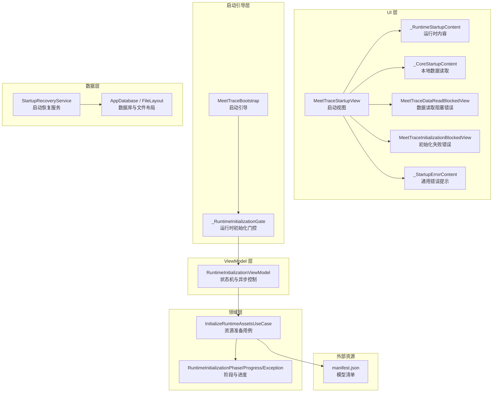
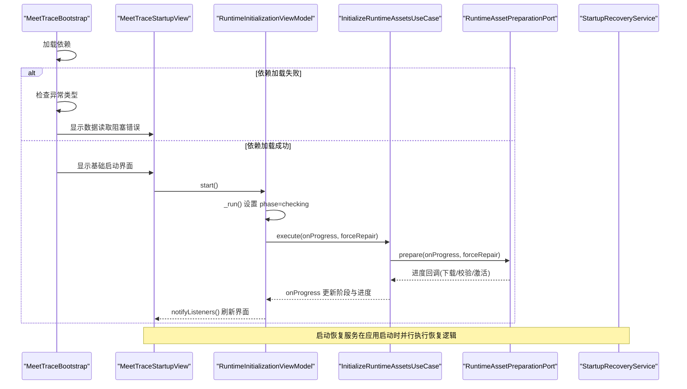
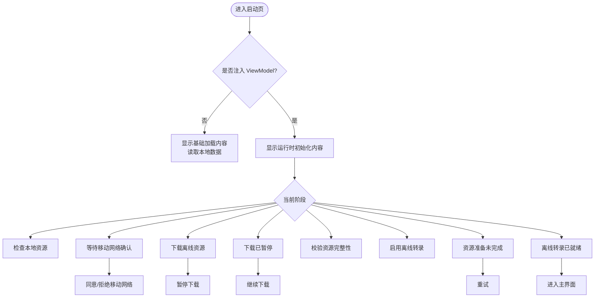
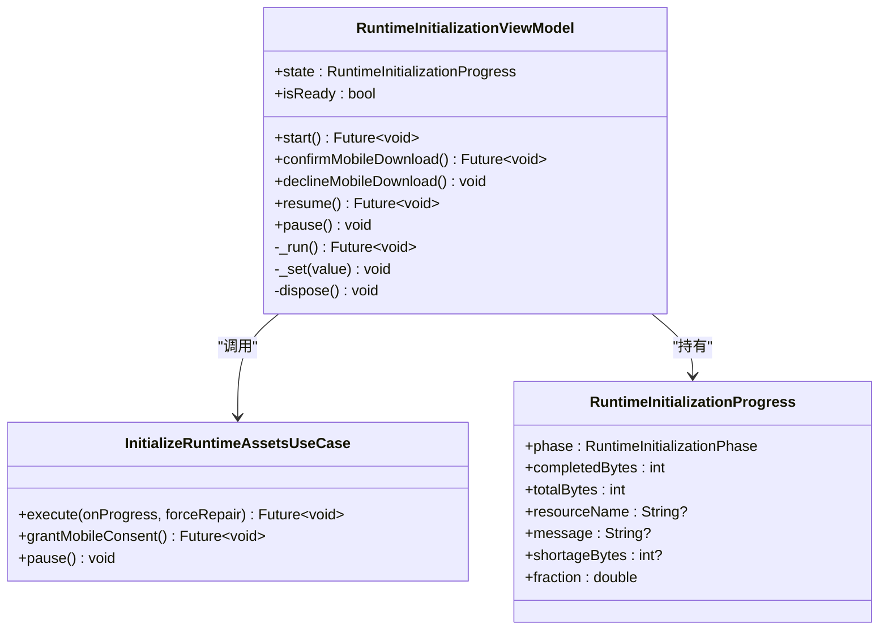
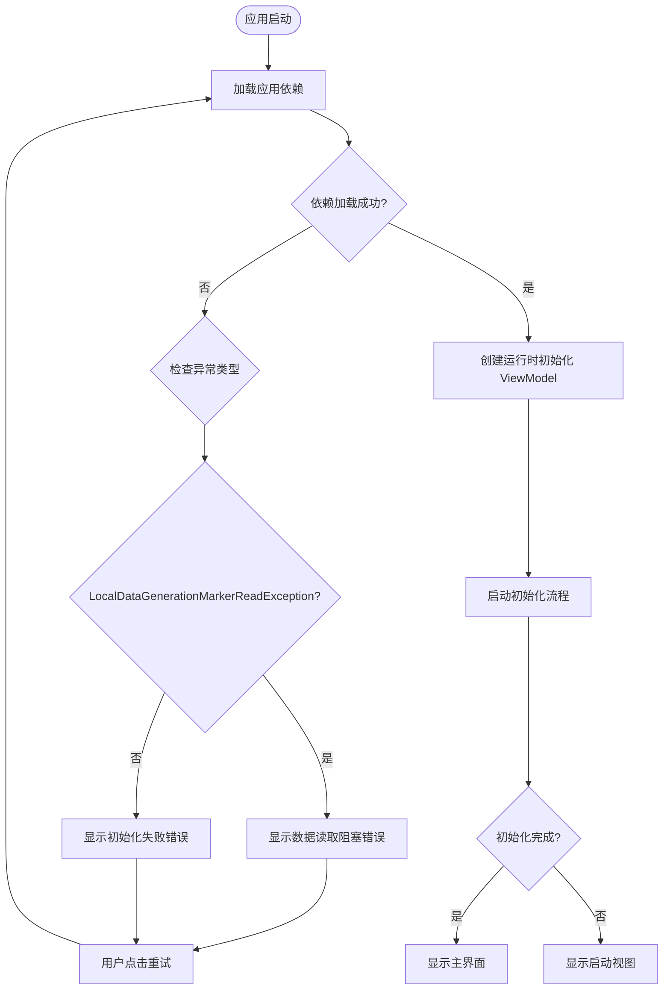
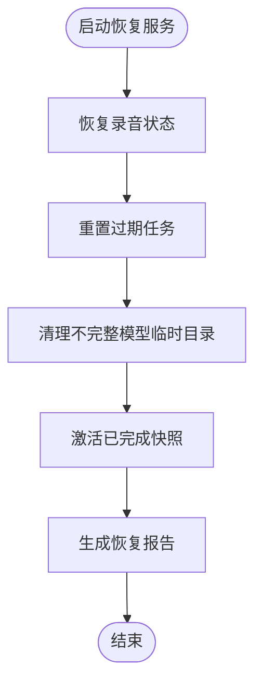
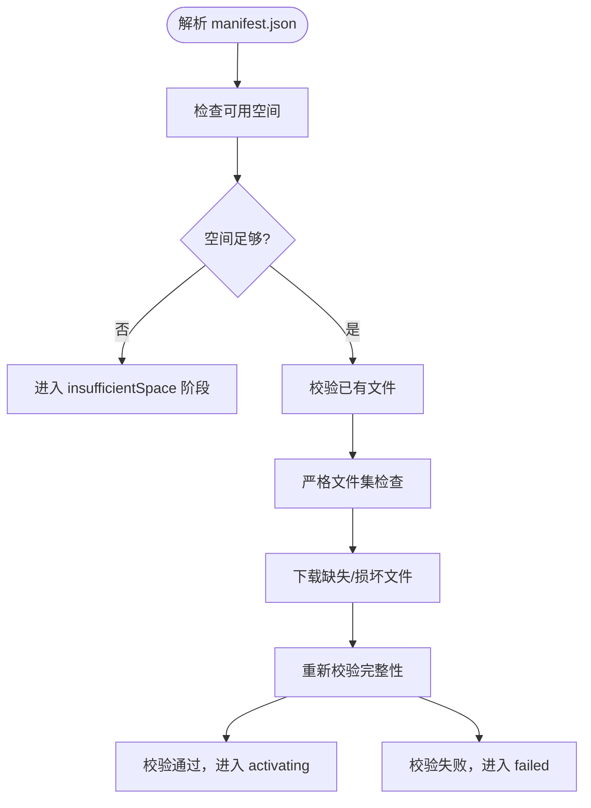
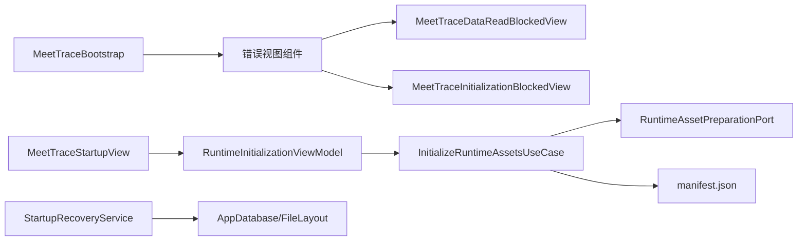

# 启动视图

<cite>
**本文引用的文件**   
- [lib/ui/features/startup/views/meettrace_startup_view.dart](file://lib/ui/features/startup/views/meettrace_startup_view.dart)
- [lib/ui/features/startup/view_models/runtime_initialization_view_model.dart](file://lib/ui/features/startup/view_models/runtime_initialization_view_model.dart)
- [lib/domain/models/runtime_initialization.dart](file://lib/domain/models/runtime_initialization.dart)
- [lib/domain/use_cases/initialize_runtime_assets.dart](file://lib/domain/use_cases/initialize_runtime_assets.dart)
- [lib/data/services/storage/startup_recovery_service.dart](file://lib/data/services/storage/startup_recovery_service.dart)
- [assets/models/manifest.json](file://assets/models/manifest.json)
- [lib/app/meettrace_flow.dart](file://lib/app/meettrace_flow.dart)
- [test\ui\features\startup\views\meettrace_startup_view_test.dart](file://test/ui/features/startup/views/meettrace_startup_view_test.dart)
</cite>

## 更新摘要
**所做更改**   
- 增强了启动流程的错误处理，区分了数据读取阻塞和初始化失败场景
- 新增了专门的错误视图组件：MeetTraceDataReadBlockedView 和 MeetTraceInitializationBlockedView
- 更新了启动引导流程，在依赖加载失败时显示相应的错误视图
- 完善了错误处理和用户引导流程的文档说明

## 目录
1. [简介](#简介)
2. [项目结构](#项目结构)
3. [核心组件](#核心组件)
4. [架构总览](#架构总览)
5. [详细组件分析](#详细组件分析)
6. [依赖关系分析](#依赖关系分析)
7. [性能考量](#性能考量)
8. [故障排除指南](#故障排除指南)
9. [结论](#结论)

## 简介
本文件围绕 MeetTraceStartupView 的启动流程进行系统化说明，涵盖运行时环境检查、模型下载与校验、设备能力检测、UI 进度展示、错误提示与重试机制、异步初始化（并发任务管理、超时处理、资源清理）、失败降级策略与用户引导，以及启动性能优化、内存监控与启动时间分析方法。文档以代码为依据，提供可视化图示与可定位的代码片段路径，便于快速理解与排障。

**更新** 本次更新重点增强了启动流程的错误处理能力，新增了专门的数据读取阻塞和初始化失败的错误视图组件，提供了更清晰的错误提示和用户引导。

## 项目结构
启动相关的关键代码分布在 UI 层、ViewModel 层、领域模型与用例层、数据恢复服务以及模型清单中：
- UI 层：MeetTraceStartupView 及其子组件负责启动页渲染、阶段指示、下载进度、错误提示与交互按钮。新增 MeetTraceDataReadBlockedView 和 MeetTraceInitializationBlockedView 专门处理不同类型的启动失败场景。
- ViewModel 层：RuntimeInitializationViewModel 驱动启动状态机，封装异步初始化流程、进度回调、暂停/继续、异常映射与生命周期清理。
- 领域模型与用例：RuntimeInitializationPhase/Progress/Exception 描述启动阶段与进度；InitializeRuntimeAssetsUseCase 作为用例入口调用端口准备资源。
- 数据恢复服务：StartupRecoveryService 在应用启动时恢复会议记录、清理不完整模型临时目录、激活已完成快照等。
- 启动引导：MeetTraceBootstrap 负责应用启动时的依赖加载和错误处理，根据异常类型显示相应的错误视图。
- 模型清单：assets/models/manifest.json 定义 SenseVoice 模型的文件、大小、哈希与下载地址，供下载与校验使用。

**图表来源**
- [lib/ui/features/startup/views/meettrace_startup_view.dart:16-119](file://lib/ui/features/startup/views/meettrace_startup_view.dart#L16-L119)
- [lib/app/meettrace_flow.dart:19-66](file://lib/app/meettrace_flow.dart#L19-L66)
- [lib/ui/features/startup/view_models/runtime_initialization_view_model.dart:6-42](file://lib/ui/features/startup/view_models/runtime_initialization_view_model.dart#L6-L42)

章节来源
- [lib/ui/features/startup/views/meettrace_startup_view.dart:16-119](file://lib/ui/features/startup/views/meettrace_startup_view.dart#L16-L119)
- [lib/app/meettrace_flow.dart:19-66](file://lib/app/meettrace_flow.dart#L19-L66)
- [lib/ui/features/startup/view_models/runtime_initialization_view_model.dart:6-42](file://lib/ui/features/startup/view_models/runtime_initialization_view_model.dart#L6-L42)

## 核心组件
- MeetTraceStartupView：启动视图入口，根据是否注入 viewModel 决定显示基础加载或运行时初始化内容；通过 ListenableBuilder 监听状态变化并切换过渡动画。
- **新增** MeetTraceDataReadBlockedView：专门处理本地数据读取失败的阻断页面，显示保护性提示信息并提供重试功能。
- **新增** MeetTraceInitializationBlockedView：专门处理依赖或本地运行能力初始化失败的阻断页面，显示初始化未完成提示并提供重试功能。
- RuntimeInitializationViewModel：维护启动阶段与进度，封装 start/resume/pause 等操作，将异常码映射为具体阶段（如移动网络授权、空间不足、暂停、失败），并在 dispose 时确保资源清理。
- StartupRecoveryService：启动时恢复"录音中"的会议、重置过期任务、清理不完整模型临时目录、激活已完成快照，保证应用进入可用状态。
- InitializeRuntimeAssetsUseCase：统一对外暴露 prepare/grantMobileConsent/pause 接口，屏蔽底层端口实现细节。
- **新增** MeetTraceBootstrap：应用启动引导器，负责依赖加载和错误处理，根据异常类型显示相应的错误视图。
- 领域模型：RuntimeInitializationPhase/Progress/Exception 明确阶段枚举、进度字段（completedBytes/totalBytes/fraction/resourceName/message/shortageBytes）与异常信息。

章节来源
- [lib/ui/features/startup/views/meettrace_startup_view.dart:16-119](file://lib/ui/features/startup/views/meettrace_startup_view.dart#L16-L119)
- [lib/ui/features/startup/view_models/runtime_initialization_view_model.dart:6-130](file://lib/ui/features/startup/view_models/runtime_initialization_view_model.dart#L6-L130)
- [lib/app/meettrace_flow.dart:19-66](file://lib/app/meettrace_flow.dart#L19-L66)

## 架构总览
启动流程由 MeetTraceBootstrap 触发，首先尝试加载应用依赖，如果失败则根据异常类型显示相应的错误视图。成功加载后进入运行时初始化门控，启动 ViewModel 执行资源准备流程。同时，启动恢复服务在应用早期运行，修复不一致状态，确保后续流程稳定。

**图表来源**
- [lib/app/meettrace_flow.dart:31-59](file://lib/app/meettrace_flow.dart#L31-L59)
- [lib/ui/features/startup/view_models/runtime_initialization_view_model.dart:29-42](file://lib/ui/features/startup/view_models/runtime_initialization_view_model.dart#L29-L42)

## 详细组件分析

### 启动视图 UI 与状态展示
- 基础加载：_CoreStartupContent 展示品牌标识、标题、环形进度条与线性进度条，语义化标签用于无障碍读屏。
- 运行时内容：_RuntimeStartupContent 根据 ViewModel 的阶段显示步骤标题、描述、资源名称、百分比与确定进度条；在不同阶段呈现不同操作按钮（同意/拒绝移动网络、暂停/继续/重试）。
- **新增** 数据读取阻塞错误：MeetTraceDataReadBlockedView 显示"无法读取本地数据"的阻断页面，强调为保护本地数据已停止启动，自动清理未执行，需要用户检查设备存储状态后重试。
- **新增** 初始化失败错误：MeetTraceInitializationBlockedView 显示"本地能力准备未完成"的阻断页面，提示确认设备空间充足后重试。
- 过渡动画：MeetTraceRuntimeInitializationTransition 使用 AnimatedSwitcher 与淡入淡出过渡，尊重系统减少动效设置。

**图表来源**
- [lib/ui/features/startup/views/meettrace_startup_view.dart:173-249](file://lib/ui/features/startup/views/meettrace_startup_view.dart#L173-L249)
- [lib/ui/features/startup/views/meettrace_startup_view.dart:251-424](file://lib/ui/features/startup/views/meettrace_startup_view.dart#L251-L424)

章节来源
- [lib/ui/features/startup/views/meettrace_startup_view.dart:87-119](file://lib/ui/features/startup/views/meettrace_startup_view.dart#L87-L119)
- [lib/ui/features/startup/views/meettrace_startup_view.dart:173-249](file://lib/ui/features/startup/views/meettrace_startup_view.dart#L173-L249)
- [lib/ui/features/startup/views/meettrace_startup_view.dart:251-424](file://lib/ui/features/startup/views/meettrace_startup_view.dart#L251-L424)

### ViewModel 异步初始化与状态机
- start()：防止重复启动，保存当前 Future 引用，确保多次调用返回同一任务。
- _run()：设置 checking 阶段，调用用例 execute，捕获特定异常并映射到 awaitingMobileConsent/insufficientSpace/paused/failed 阶段，更新 message 与 shortageBytes。
- confirmMobileDownload()/declineMobileDownload()：处理移动网络授权分支，拒绝后进入 failed 并提供友好提示。
- resume()/pause()：支持暂停与恢复，resume 会等待当前任务完成再重新 start。
- dispose()：标记 disposed 并调用 pause，避免后台任务泄漏。

**图表来源**
- [lib/ui/features/startup/view_models/runtime_initialization_view_model.dart:6-130](file://lib/ui/features/startup/view_models/runtime_initialization_view_model.dart#L6-L130)

章节来源
- [lib/ui/features/startup/view_models/runtime_initialization_view_model.dart:29-130](file://lib/ui/features/startup/view_models/runtime_initialization_view_model.dart#L29-L130)

### 启动引导与错误处理
- **新增** MeetTraceBootstrap：应用启动引导器，负责依赖加载和错误处理。
- 依赖加载失败处理：根据异常类型区分 LocalDataGenerationMarkerReadException（数据读取阻塞）和其他异常（初始化失败），分别显示对应的错误视图。
- 重试机制：错误视图提供重试按钮，点击后重新尝试加载依赖。
- 运行时初始化门控：依赖加载成功后创建 RuntimeInitializationViewModel 并启动初始化流程。

**图表来源**
- [lib/app/meettrace_flow.dart:31-59](file://lib/app/meettrace_flow.dart#L31-L59)

章节来源
- [lib/app/meettrace_flow.dart:19-66](file://lib/app/meettrace_flow.dart#L19-L66)

### 启动恢复服务与数据一致性
- recover(now)：聚合恢复录音、重置过期任务、清理不完整模型临时目录、激活已完成快照，汇总统计结果。
- _recoverRecordings(now)：查询处于 recording 状态的会议，对齐 PCM 样本长度，持久化音频引用，更新会议状态为 processing，失败则标记 failed 并记录错误码。
- _resetExpiredTasks(now)：将租约过期的 running 任务重置为 queued，清除租约时间与错误码。
- _removeIncompleteModelDirectories()：递归删除模型临时根下的不完整版本目录，确保不越界删除。
- _activateCompletedSnapshots()：按会议维度选择最新 complete 的 finalTranscript 快照，激活为活跃快照并置空摘要，状态改为 completed。

**图表来源**
- [lib/data/services/storage/startup_recovery_service.dart:49-63](file://lib/data/services/storage/startup_recovery_service.dart#L49-L63)

章节来源
- [lib/data/services/storage/startup_recovery_service.dart:49-63](file://lib/data/services/storage/startup_recovery_service.dart#L49-L63)

### 模型清单与下载校验
- manifest.json 定义了 SenseVoice 模型的 ID、版本、安装类型、所需字节数、文件列表（含路径、大小、SHA-256 与 URL）及许可证信息。
- 下载与校验流程通常包括：解析清单、计算磁盘空间需求、校验已有文件（缺失/大小不匹配/哈希不匹配）、严格文件集检查（拒绝多余文件）、分块下载与断点续传、完成后再次校验。

**图表来源**
- [assets/models/manifest.json:1-31](file://assets/models/manifest.json#L1-L31)

章节来源
- [assets/models/manifest.json:1-31](file://assets/models/manifest.json#L1-L31)

## 依赖关系分析
- UI 依赖 ViewModel：MeetTraceStartupView 通过 ListenableBuilder 监听 RuntimeInitializationViewModel 的状态变化，渲染对应阶段与进度。
- **新增** 启动引导依赖错误视图：MeetTraceBootstrap 根据异常类型选择合适的错误视图组件。
- ViewModel 依赖 UseCase：RuntimeInitializationViewModel 调用 InitializeRuntimeAssetsUseCase 的 execute/grantMobileConsent/pause，屏蔽端口实现。
- UseCase 依赖端口：InitializeRuntimeAssetsUseCase 委托给 RuntimeAssetPreparationPort 执行实际准备逻辑（检查、下载、校验、激活）。
- 启动恢复服务独立于 UI/VM：在应用启动阶段运行，修复数据库与文件系统状态，降低后续流程异常概率。
- 模型清单作为静态配置：被下载与校验模块读取，确保资源一致性与安全性。

**图表来源**
- [lib/app/meettrace_flow.dart:19-66](file://lib/app/meettrace_flow.dart#L19-L66)
- [lib/ui/features/startup/views/meettrace_startup_view.dart:16-119](file://lib/ui/features/startup/views/meettrace_startup_view.dart#L16-L119)

章节来源
- [lib/app/meettrace_flow.dart:19-66](file://lib/app/meettrace_flow.dart#L19-L66)
- [lib/ui/features/startup/views/meettrace_startup_view.dart:16-119](file://lib/ui/features/startup/views/meettrace_startup_view.dart#L16-L119)

## 性能考量
- 启动时间分析
  - 在 UI 层埋点：记录进入 MeetTraceStartupView 的时间与进入主界面的时间差，区分 core startup（本地数据读取）与 runtime initialization（资源准备）。
  - 在 ViewModel 层埋点：记录各阶段切换时间（checking/downloading/verifying/activating/ready），识别瓶颈阶段。
  - 在恢复服务埋点：统计 recover() 耗时及各子任务耗时，评估数据库与文件系统 IO 影响。
- 内存使用监控
  - 监控下载过程中的内存峰值，避免一次性加载大文件；采用流式写入与分块校验。
  - 监控模型激活阶段的内存占用，必要时延迟加载推理引擎。
- 并发与超时
  - 下载任务应支持并发限制与重试退避；对网络请求设置合理超时，避免阻塞 UI。
  - 恢复服务中的数据库事务与文件操作需设置超时与回滚策略。
- 资源清理
  - ViewModel 在 dispose 时调用 pause，确保后台任务释放；恢复服务清理不完整模型临时目录，避免磁盘膨胀。
- **新增** 错误处理性能
  - 错误视图组件应保持轻量，避免复杂的异步操作。
  - 重试机制应避免频繁重试导致性能问题。

## 故障排除指南
- **新增** 数据读取阻塞
  - 现象：显示"无法读取本地数据"阻断页面，提示为保护本地数据启动已停止。
  - 处理：检查设备存储状态，确保存储空间充足且可读，点击"重试"按钮重新尝试。
  - 参考：[lib/ui/features/startup/views/meettrace_startup_view.dart:87-102](file://lib/ui/features/startup/views/meettrace_startup_view.dart#L87-L102)
- **新增** 初始化失败
  - 现象：显示"本地能力准备未完成"阻断页面，提示确认设备空间充足后重试。
  - 处理：清理设备存储空间，确保有足够的空间下载离线资源，点击"重试"按钮重新尝试。
  - 参考：[lib/ui/features/startup/views/meettrace_startup_view.dart:104-119](file://lib/ui/features/startup/views/meettrace_startup_view.dart#L104-L119)
- 移动网络未授权
  - 现象：阶段切换到 awaitingMobileConsent，UI 显示"等待网络确认"。
  - 处理：点击"同意并下载"继续；若拒绝，进入 failed 并提示连接 Wi-Fi 后重试。
  - 参考：[lib/ui/features/startup/view_models/runtime_initialization_view_model.dart:44-65](file://lib/ui/features/startup/view_models/runtime_initialization_view_model.dart#L44-L65)
- 存储空间不足
  - 现象：阶段切换到 insufficientSpace，UI 显示需要释放空间。
  - 处理：清理缓存或卸载不必要应用后点击"重试"。
  - 参考：[lib/ui/features/startup/view_models/runtime_initialization_view_model.dart:86-103](file://lib/ui/features/startup/view_models/runtime_initialization_view_model.dart#L86-L103)
- 下载中断或失败
  - 现象：阶段切换到 paused 或 failed，UI 提供"继续下载"或"重试"按钮。
  - 处理：检查网络连接与服务器可达性；必要时更换网络环境后重试。
  - 参考：[lib/ui/features/startup/views/meettrace_startup_view.dart:393-419](file://lib/ui/features/startup/views/meettrace_startup_view.dart#L393-L419)
- 模型校验失败
  - 现象：阶段停留在 verifying，提示文件大小或哈希不匹配。
  - 处理：删除不完整模型目录后重试；确保 manifest.json 未被篡改。
  - 参考：[assets/models/manifest.json:1-31](file://assets/models/manifest.json#L1-L31)
- 启动恢复失败
  - 现象：会议状态异常或任务卡住。
  - 处理：查看恢复报告统计，定位失败录音与过期任务；必要时手动清理临时目录。
  - 参考：[lib/data/services/storage/startup_recovery_service.dart:49-63](file://lib/data/services/storage/startup_recovery_service.dart#L49-L63)

章节来源
- [lib/ui/features/startup/views/meettrace_startup_view.dart:87-119](file://lib/ui/features/startup/views/meettrace_startup_view.dart#L87-L119)
- [lib/ui/features/startup/view_models/runtime_initialization_view_model.dart:44-103](file://lib/ui/features/startup/view_models/runtime_initialization_view_model.dart#L44-L103)
- [lib/ui/features/startup/views/meettrace_startup_view.dart:393-419](file://lib/ui/features/startup/views/meettrace_startup_view.dart#L393-L419)
- [assets/models/manifest.json:1-31](file://assets/models/manifest.json#L1-L31)
- [lib/data/services/storage/startup_recovery_service.dart:49-63](file://lib/data/services/storage/startup_recovery_service.dart#L49-L63)

## 结论
MeetTraceStartupView 通过清晰的阶段划分与友好的 UI 反馈，为用户提供可靠的启动体验。**更新后的版本**增强了错误处理能力，新增了专门的数据读取阻塞和初始化失败错误视图组件，提供了更明确的错误提示和用户引导。ViewModel 将复杂的异步初始化流程抽象为可观察的状态机，结合启动恢复服务保障数据一致性。通过合理的并发控制、超时与资源清理策略，系统在多种异常场景下具备良好鲁棒性。建议在生产环境中加入启动性能埋点与内存监控，持续优化首启时间与稳定性。

**新增的错误处理机制**使得应用在遇到数据读取问题和初始化失败时能够提供更友好的用户体验，避免了崩溃和无响应的情况，提升了应用的稳定性和可靠性。