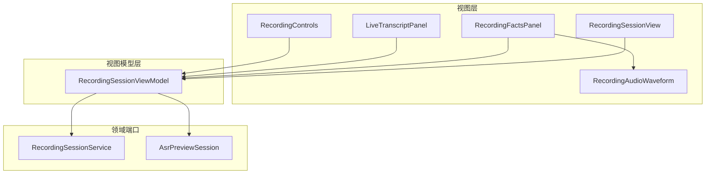
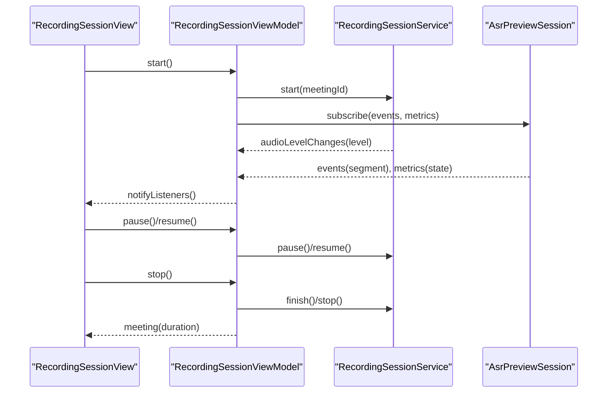
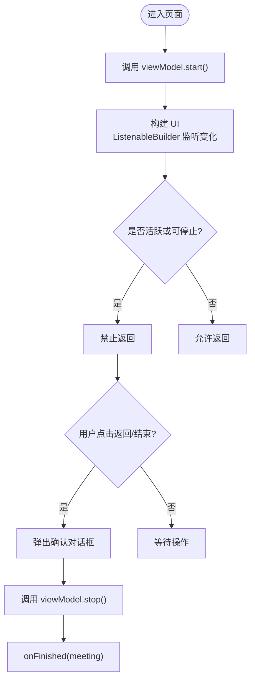
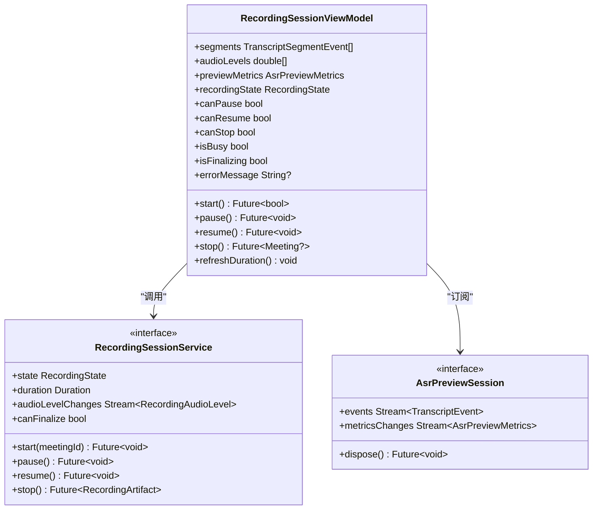
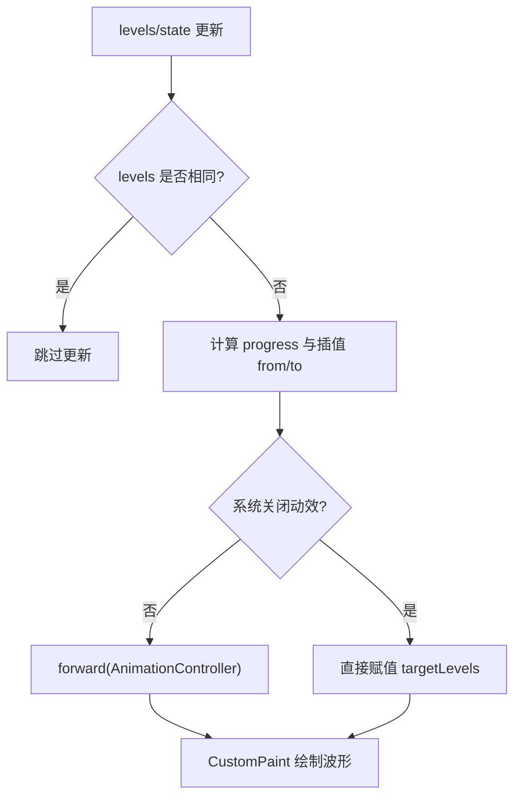
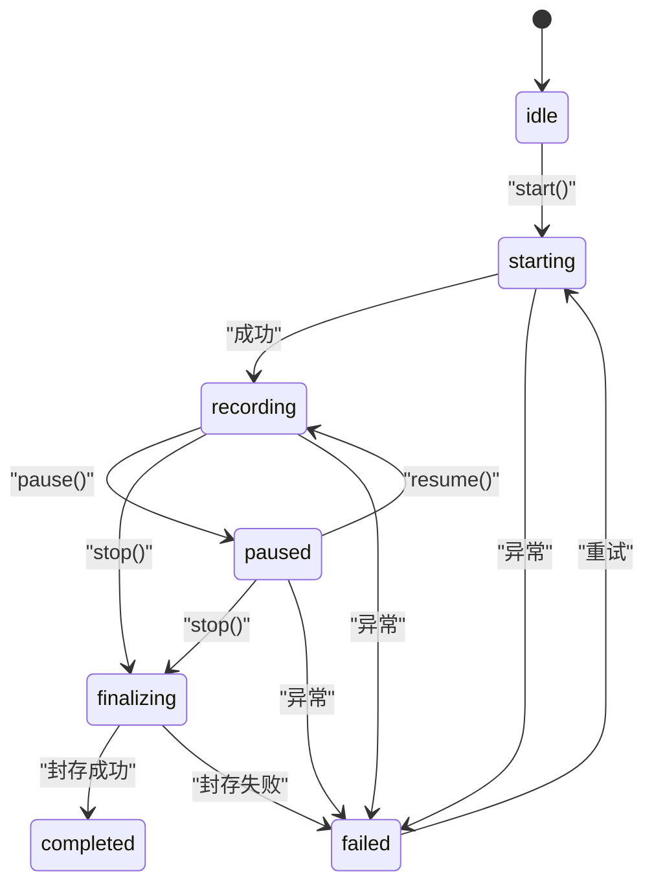
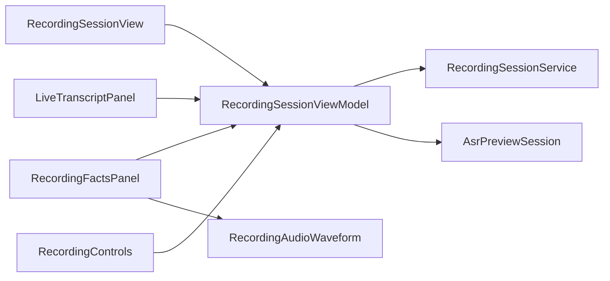

# 录音会话视图

<cite>
**本文引用的文件**   
- [recording_session_view.dart](file://lib/ui/features/meetings/views/recording/recording_session_view.dart)
- [recording_audio_waveform.dart](file://lib/ui/features/meetings/views/recording/widgets/recording_audio_waveform.dart)
- [recording_session_view_model.dart](file://lib/ui/features/meetings/view_models/recording/recording_session_view_model.dart)
- [live_transcript_panel.dart](file://lib/ui/features/meetings/views/recording/widgets/live_transcript_panel.dart)
- [recording_controls.dart](file://lib/ui/features/meetings/views/recording/widgets/recording_controls.dart)
- [recording_facts_panel.dart](file://lib/ui/features/meetings/views/recording/widgets/recording_facts_panel.dart)
- [workflow_states.dart](file://lib/domain/models/workflow_states.dart)
- [recording_session.dart](file://lib/domain/ports/recording_session.dart)
</cite>

## 目录
1. [简介](#简介)
2. [项目结构](#项目结构)
3. [核心组件](#核心组件)
4. [架构总览](#架构总览)
5. [详细组件分析](#详细组件分析)
6. [依赖关系分析](#依赖关系分析)
7. [性能考量](#性能考量)
8. [故障排查指南](#故障排查指南)
9. [结论](#结论)
10. [附录：最佳实践与示例路径](#附录最佳实践与示例路径)

## 简介
本文件面向“录音会话视图”的实现，系统性说明 RecordingSessionView 的复杂逻辑、音频波形可视化组件 RecodingAudioWaveform 的使用方式、实时转录显示机制、录音控制按钮状态管理，以及录音状态的生命周期（开始、暂停、恢复、结束）全流程。同时覆盖权限处理、错误策略、性能优化技巧，并提供代码片段路径与最佳实践建议，帮助读者快速理解并高质量扩展该模块。

## 项目结构
录音会话视图位于会议功能模块下，采用“视图 + ViewModel + 子组件”的分层组织：
- 视图层：RecordingSessionView 负责页面布局、交互入口与导航保护
- 视图模型层：RecordingSessionViewModel 管理录音状态、时长、波形数据、实时转录片段、预览指标等
- 子组件：
  - RecordingFactsPanel：展示录音状态、时长、波形、事实信息
  - LiveTranscriptPanel：展示实时转录段与预览状态
  - RecordingControls：底部控制栏（暂停/继续、结束）
  - RecordingAudioWaveform：基于 PCM 音量的波形绘制与动画

图表来源
- [recording_session_view.dart:22-79](file://lib/ui/features/meetings/views/recording/recording_session_view.dart#L22-L79)
- [recording_facts_panel.dart:11-112](file://lib/ui/features/meetings/views/recording/widgets/recording_facts_panel.dart#L11-L112)
- [live_transcript_panel.dart:11-128](file://lib/ui/features/meetings/views/recording/widgets/live_transcript_panel.dart#L11-L128)
- [recording_controls.dart:10-74](file://lib/ui/features/meetings/views/recording/widgets/recording_controls.dart#L10-L74)
- [recording_audio_waveform.dart:14-123](file://lib/ui/features/meetings/views/recording/widgets/recording_audio_waveform.dart#L14-L123)
- [recording_session_view_model.dart:20-60](file://lib/ui/features/meetings/view_models/recording/recording_session_view_model.dart#L20-L60)
- [recording_session.dart:20-38](file://lib/domain/ports/recording_session.dart#L20-L38)

章节来源
- [recording_session_view.dart:22-79](file://lib/ui/features/meetings/views/recording/recording_session_view.dart#L22-L79)
- [recording_session_view_model.dart:20-60](file://lib/ui/features/meetings/view_models/recording/recording_session_view_model.dart#L20-L60)

## 核心组件
- RecordingSessionView：页面容器，监听 ViewModel 变化，提供返回拦截与结束确认，组装 Facts、Transcript、BottomBar
- RecordingSessionViewModel：变更通知器，封装 start/pause/resume/stop 流程，订阅音频音量流与 ASR 预览事件，维护 segments、audioLevels、duration、previewMetrics
- RecordingAudioWaveform：只读波形组件，接收 levels 列表与 state，使用 AnimationController 平滑过渡绘制，支持无障碍标签与可访问性开关
- LiveTranscriptPanel：按时间排序渲染 TranscriptSegmentEvent，展示预览状态提示
- RecordingControls：根据 canPause/canResume/canStop 动态启用/禁用按钮，处理结束封存的加载态
- RecordingFactsPanel：组合状态标签、时长、波形、事实信息与错误提示

章节来源
- [recording_session_view.dart:22-79](file://lib/ui/features/meetings/views/recording/recording_session_view.dart#L22-L79)
- [recording_session_view_model.dart:20-60](file://lib/ui/features/meetings/view_models/recording/recording_session_view_model.dart#L20-L60)
- [recording_audio_waveform.dart:14-123](file://lib/ui/features/meetings/views/recording/widgets/recording_audio_waveform.dart#L14-L123)
- [live_transcript_panel.dart:11-128](file://lib/ui/features/meetings/views/recording/widgets/live_transcript_panel.dart#L11-L128)
- [recording_controls.dart:10-74](file://lib/ui/features/meetings/views/recording/widgets/recording_controls.dart#L10-L74)
- [recording_facts_panel.dart:11-112](file://lib/ui/features/meetings/views/recording/widgets/recording_facts_panel.dart#L11-L112)

## 架构总览
录音会话视图通过 ViewModel 聚合底层录制服务与 ASR 预览会话，UI 仅消费不可变快照与事件流，保证单向数据流与高内聚低耦合。

图表来源
- [recording_session_view.dart:40-43](file://lib/ui/features/meetings/views/recording/recording_session_view.dart#L40-L43)
- [recording_session_view_model.dart:71-97](file://lib/ui/features/meetings/view_models/recording/recording_session_view_model.dart#L71-L97)
- [recording_session_view_model.dart:166-185](file://lib/ui/features/meetings/view_models/recording/recording_session_view_model.dart#L166-L185)
- [recording_session_view_model.dart:119-144](file://lib/ui/features/meetings/view_models/recording/recording_session_view_model.dart#L119-L144)
- [recording_session.dart:20-38](file://lib/domain/ports/recording_session.dart#L20-L38)

## 详细组件分析

### RecordingSessionView：页面与生命周期
- 初始化即调用 viewModel.start()，并在 build 中通过 ListenableBuilder 响应状态变化
- 使用 PopScope 阻止在活跃录音状态下直接返回；触发 _requestEnd() 弹出确认对话框
- 主体内容根据宽屏条件切换横向/纵向布局，组合 Facts 与 Transcript
- 结束流程：确认 -> stop() -> onFinished(meeting)

图表来源
- [recording_session_view.dart:40-43](file://lib/ui/features/meetings/views/recording/recording_session_view.dart#L40-L43)
- [recording_session_view.dart:53-79](file://lib/ui/features/meetings/views/recording/recording_session_view.dart#L53-L79)
- [recording_session_view.dart:121-149](file://lib/ui/features/meetings/views/recording/recording_session_view.dart#L121-L149)

章节来源
- [recording_session_view.dart:22-79](file://lib/ui/features/meetings/views/recording/recording_session_view.dart#L22-L79)
- [recording_session_view.dart:121-149](file://lib/ui/features/meetings/views/recording/recording_session_view.dart#L121-L149)

### RecordingSessionViewModel：状态机与数据流
- 状态属性：recordingState、canPause/canResume/canStop、isBusy、isFinalizing、errorMessage
- 启动流程：订阅 preview.events/metrics/audioLevelChanges，设置定时器刷新 duration，异常时统一捕获并设置错误消息
- 暂停/恢复：校验 canPause/canResume，执行对应操作并刷新 duration
- 结束流程：标记 isFinalizing=true，调用 sessionLifecycle.finish，更新 duration，释放预览资源
- 数据绑定：
  - audioLevels：固定容量队列，溢出自动裁剪，供波形组件消费
  - segments：Map 去重并按 startMs/segmentId 排序，供实时转录面板渲染
  - previewMetrics：反映 ASR 预览状态（ready/backlogged/recordingOnly/disposed）

图表来源
- [recording_session_view_model.dart:20-60](file://lib/ui/features/meetings/view_models/recording/recording_session_view_model.dart#L20-L60)
- [recording_session_view_model.dart:71-97](file://lib/ui/features/meetings/view_models/recording/recording_session_view_model.dart#L71-L97)
- [recording_session_view_model.dart:99-144](file://lib/ui/features/meetings/view_models/recording/recording_session_view_model.dart#L99-L144)
- [recording_session_view_model.dart:166-185](file://lib/ui/features/meetings/view_models/recording/recording_session_view_model.dart#L166-L185)
- [recording_session.dart:20-38](file://lib/domain/ports/recording_session.dart#L20-L38)

章节来源
- [recording_session_view_model.dart:20-60](file://lib/ui/features/meetings/view_models/recording/recording_session_view_model.dart#L20-L60)
- [recording_session_view_model.dart:71-97](file://lib/ui/features/meetings/view_models/recording/recording_session_view_model.dart#L71-L97)
- [recording_session_view_model.dart:99-144](file://lib/ui/features/meetings/view_models/recording/recording_session_view_model.dart#L99-L144)
- [recording_session_view_model.dart:166-185](file://lib/ui/features/meetings/view_models/recording/recording_session_view_model.dart#L166-L185)

### RecordingAudioWaveform：波形动画与绘制
- 输入：levels（音量采样数组）、state（waiting/live/paused/stopped）
- 动画：AnimationController + Curves.easeOutCubic，配合 _interpolateRightAligned 实现右对齐插值，避免左右抖动
- 绘制：CustomPainter 计算可见槽位数量、最近峰值参考、噪声门限、颜色渐变与线段高度
- 可访问性：Semantics 提供 label/caption，尊重系统 motion 设置

图表来源
- [recording_audio_waveform.dart:39-59](file://lib/ui/features/meetings/views/recording/widgets/recording_audio_waveform.dart#L39-L59)
- [recording_audio_waveform.dart:95-110](file://lib/ui/features/meetings/views/recording/widgets/recording_audio_waveform.dart#L95-L110)
- [recording_audio_waveform.dart:125-140](file://lib/ui/features/meetings/views/recording/widgets/recording_audio_waveform.dart#L125-L140)
- [recording_audio_waveform.dart:158-210](file://lib/ui/features/meetings/views/recording/widgets/recording_audio_waveform.dart#L158-L210)

章节来源
- [recording_audio_waveform.dart:14-123](file://lib/ui/features/meetings/views/recording/widgets/recording_audio_waveform.dart#L14-L123)
- [recording_audio_waveform.dart:125-140](file://lib/ui/features/meetings/views/recording/widgets/recording_audio_waveform.dart#L125-L140)
- [recording_audio_waveform.dart:158-210](file://lib/ui/features/meetings/views/recording/widgets/recording_audio_waveform.dart#L158-L210)

### LiveTranscriptPanel：实时转录显示
- 数据来源：viewModel.segments（已按 startMs/segmentId 排序）
- 空状态：根据 AsrPreviewState.recordingOnly 区分提示文案
- 状态摘要：根据 recordingState 与 previewMetrics.state 输出 info/warning 提示
- 行渲染：时间戳 + 文本，带分隔线

章节来源
- [live_transcript_panel.dart:11-128](file://lib/ui/features/meetings/views/recording/widgets/live_transcript_panel.dart#L11-L128)
- [live_transcript_panel.dart:154-184](file://lib/ui/features/meetings/views/recording/widgets/live_transcript_panel.dart#L154-L184)
- [live_transcript_panel.dart:186-238](file://lib/ui/features/meetings/views/recording/widgets/live_transcript_panel.dart#L186-L238)

### RecordingControls：控制按钮状态管理
- 暂停/继续：根据 paused 与 canPause/canResume 决定图标与可用性
- 结束按钮：finalizing 时显示进度动画，enabled 由 canStop 控制
- 布局：窄屏垂直堆叠，宽屏水平排列

章节来源
- [recording_controls.dart:76-123](file://lib/ui/features/meetings/views/recording/widgets/recording_controls.dart#L76-L123)
- [recording_controls.dart:125-193](file://lib/ui/features/meetings/views/recording/widgets/recording_controls.dart#L125-L193)

### RecordingFactsPanel：事实信息与波形集成
- 状态标签：idle/starting/recording/paused/finalizing/completed/failed 映射短标签
- 时长：格式化 HH:mm:ss
- 波形：将 recordingState 映射为波形组件 state
- 错误提示：当 errorMessage 存在时显示 AppStatusNotice

章节来源
- [recording_facts_panel.dart:11-112](file://lib/ui/features/meetings/views/recording/widgets/recording_facts_panel.dart#L11-L112)
- [recording_facts_panel.dart:210-234](file://lib/ui/features/meetings/views/recording/widgets/recording_facts_panel.dart#L210-L234)

### 录音状态生命周期
- 状态枚举：idle → starting → recording → paused → recording → finalizing → completed/failed
- 转换规则：由 RecordingStateTransition.canTransitionTo 约束非法跳转
- 界面表现：
  - 活跃状态包括 starting/recording/paused/finalizing
  - 非活跃状态允许返回
  - 结束前需二次确认

图表来源
- [workflow_states.dart:3-11](file://lib/domain/models/workflow_states.dart#L3-L11)
- [workflow_states.dart:80-117](file://lib/domain/models/workflow_states.dart#L80-L117)

章节来源
- [workflow_states.dart:3-11](file://lib/domain/models/workflow_states.dart#L3-L11)
- [workflow_states.dart:80-117](file://lib/domain/models/workflow_states.dart#L80-L117)

## 依赖关系分析
- RecordingSessionView 依赖 RecordingSessionViewModel，并通过 ListenableBuilder 订阅变更
- RecordingSessionViewModel 依赖 RecordingSessionService（事实音频录制）与 AsrPreviewSession（实时转录预览）
- 子组件均通过 viewModel 暴露的数据进行渲染，无跨组件直接通信
- 状态机定义集中在 workflow_states.dart，确保状态转换一致性

图表来源
- [recording_session_view.dart:22-79](file://lib/ui/features/meetings/views/recording/recording_session_view.dart#L22-L79)
- [recording_session_view_model.dart:20-60](file://lib/ui/features/meetings/view_models/recording/recording_session_view_model.dart#L20-L60)
- [recording_facts_panel.dart:11-112](file://lib/ui/features/meetings/views/recording/widgets/recording_facts_panel.dart#L11-L112)
- [live_transcript_panel.dart:11-128](file://lib/ui/features/meetings/views/recording/widgets/live_transcript_panel.dart#L11-L128)
- [recording_controls.dart:10-74](file://lib/ui/features/meetings/views/recording/widgets/recording_controls.dart#L10-L74)

章节来源
- [recording_session_view_model.dart:20-60](file://lib/ui/features/meetings/view_models/recording/recording_session_view_model.dart#L20-L60)
- [workflow_states.dart:80-117](file://lib/domain/models/workflow_states.dart#L80-L117)

## 性能考量
- 波形数据容量限制：audioLevels 固定容量（如 48），超出自动裁剪，避免内存增长与频繁重建
- 动画节流：AnimationController 使用 easeOutCubic，且尊重系统无障碍设置（motion disabled 时直接赋值）
- 绘制优化：CustomPainter 仅在 shouldRepaint 条件满足时重绘；使用 RepaintBoundary 隔离高频重绘区域
- 列表渲染：segments 使用 Map 去重并按 startMs/segmentId 排序，减少重复与重排
- 定时器频率：duration 刷新间隔约 250ms，平衡流畅度与开销
- 资源释放：_disposePreviewBestEffort 确保异常不影响主链，避免泄漏

[本节为通用指导，不直接分析具体文件]

## 故障排查指南
- 无法启动录音：检查麦克风权限与可用空间，ViewModel 会设置错误消息并尝试释放预览资源
- 暂停/恢复失败：确认当前状态是否符合 canPause/canResume，查看 errorMessage
- 结束封存失败：isFinalizing 期间保持耐心，若失败请保留应用数据并重试
- 实时转录积压：当 previewMetrics.state=backlogged 或 recordingOnly 时，转录可能延迟或停止，但录音仍继续
- 波形无变化：检查 audioLevelChanges 是否有数据输出，确认 levels 长度与数值范围

章节来源
- [recording_session_view_model.dart:71-97](file://lib/ui/features/meetings/view_models/recording/recording_session_view_model.dart#L71-L97)
- [recording_session_view_model.dart:99-144](file://lib/ui/features/meetings/view_models/recording/recording_session_view_model.dart#L99-L144)
- [recording_session_view_model.dart:166-185](file://lib/ui/features/meetings/view_models/recording/recording_session_view_model.dart#L166-L185)
- [live_transcript_panel.dart:240-261](file://lib/ui/features/meetings/views/recording/widgets/live_transcript_panel.dart#L240-L261)

## 结论
RecordingSessionView 通过清晰的职责划分与单向数据流，实现了稳定的录音会话体验。ViewModel 集中管理状态与数据流，子组件专注渲染与交互，波形与实时转录分别通过高效绘制与流式订阅保障性能与准确性。严格的状态机与完善的错误处理策略确保了录音过程的可靠性与可恢复性。

[本节为总结，不直接分析具体文件]

## 附录：最佳实践与示例路径
- 权限与错误处理
  - 启动失败统一捕获并设置错误消息，优先保证事实音频与会话状态稳定
  - 预览资源释放采用 best-effort，避免影响主链
  - 参考路径：[recording_session_view_model.dart:71-97](file://lib/ui/features/meetings/view_models/recording/recording_session_view_model.dart#L71-L97)
- 波形动画与绘制
  - 使用插值与噪声门限提升视觉稳定性与可读性
  - 尊重无障碍设置，关闭动效时直接赋值
  - 参考路径：[recording_audio_waveform.dart:39-59](file://lib/ui/features/meetings/views/recording/widgets/recording_audio_waveform.dart#L39-L59)、[recording_audio_waveform.dart:158-210](file://lib/ui/features/meetings/views/recording/widgets/recording_audio_waveform.dart#L158-L210)
- 实时转录绑定
  - 使用 Map 去重并按时间排序，避免重复与乱序
  - 根据 previewMetrics.state 给出用户友好的状态提示
  - 参考路径：[recording_session_view_model.dart:166-185](file://lib/ui/features/meetings/view_models/recording/recording_session_view_model.dart#L166-L185)、[live_transcript_panel.dart:240-261](file://lib/ui/features/meetings/views/recording/widgets/live_transcript_panel.dart#L240-L261)
- 控制按钮状态
  - 基于 canPause/canResume/canStop 精确控制可用性
  - 结束按钮在 finalizing 时显示进度动画
  - 参考路径：[recording_controls.dart:76-123](file://lib/ui/features/meetings/views/recording/widgets/recording_controls.dart#L76-L123)、[recording_controls.dart:125-193](file://lib/ui/features/meetings/views/recording/widgets/recording_controls.dart#L125-L193)
- 状态机与生命周期
  - 使用 RecordingStateTransition 约束合法跳转
  - 页面级 PopScope 防止误退出
  - 参考路径：[workflow_states.dart:80-117](file://lib/domain/models/workflow_states.dart#L80-L117)、[recording_session_view.dart:53-79](file://lib/ui/features/meetings/views/recording/recording_session_view.dart#L53-L79)