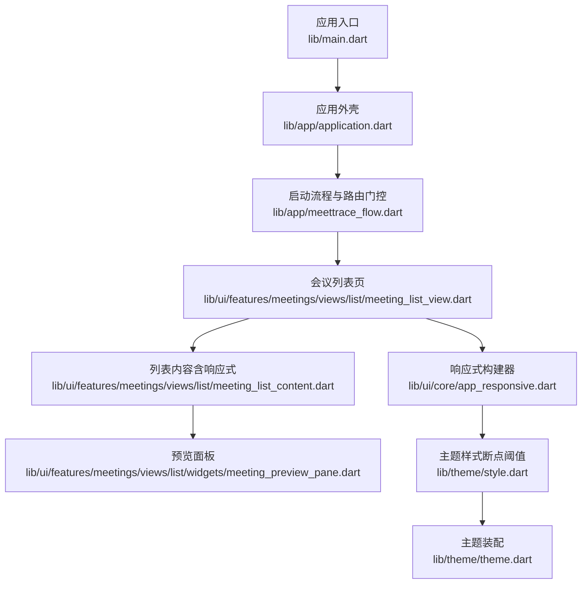
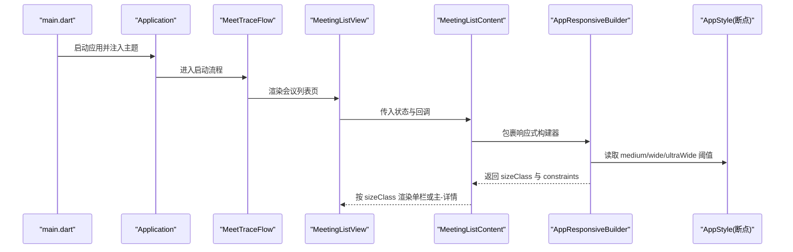
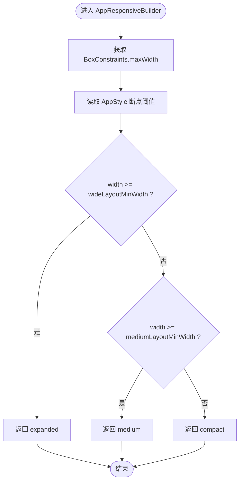
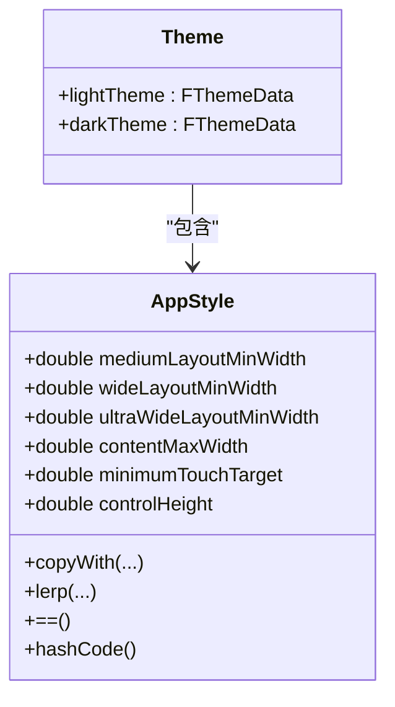
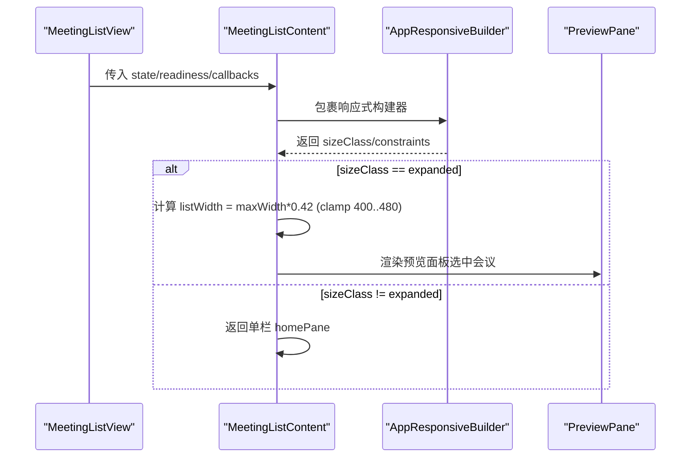
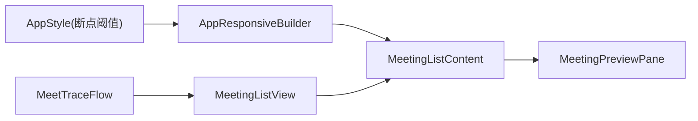

# 响应式设计

<cite>
**本文引用的文件**   
- [lib/main.dart](file://lib/main.dart)
- [lib/app/application.dart](file://lib/app/application.dart)
- [lib/app/meettrace_flow.dart](file://lib/app/meettrace_flow.dart)
- [lib/ui/core/app_responsive.dart](file://lib/ui/core/app_responsive.dart)
- [lib/theme/theme.dart](file://lib/theme/theme.dart)
- [lib/theme/style.dart](file://lib/theme/style.dart)
- [lib/ui/features/meetings/views/list/meeting_list_view.dart](file://lib/ui/features/meetings/views/list/meeting_list_view.dart)
- [lib/ui/features/meetings/views/list/meeting_list_content.dart](file://lib/ui/features/meetings/views/list/meeting_list_content.dart)
- [lib/ui/features/meetings/views/list/widgets/meeting_preview_pane.dart](file://lib/ui/features/meetings/views/list/widgets/meeting_preview_pane.dart)
- [test/ui/core/app_responsive_test.dart](file://test/ui/core/app_responsive_test.dart)
- [.agents/skills/flutter-build-responsive-layout/SKILL.md](file://.agents/skills/flutter-build-responsive-layout/SKILL.md)
</cite>

## 目录
1. [简介](#简介)
2. [项目结构](#项目结构)
3. [核心组件](#核心组件)
4. [架构总览](#架构总览)
5. [详细组件分析](#详细组件分析)
6. [依赖关系分析](#依赖关系分析)
7. [性能考量](#性能考量)
8. [故障排查指南](#故障排查指南)
9. [结论](#结论)
10. [附录](#附录)

## 简介
本文件面向跨平台（Flutter）的响应式设计实现，围绕“内容驱动”的断点系统、动态布局计算与优化策略展开。文档涵盖：
- 不同屏幕尺寸下的布局调整策略（手机、平板、桌面端差异化处理）
- 断点系统的设计与配置（基于主题样式的最小宽度阈值）
- 动态布局的计算逻辑与性能优化（LayoutBuilder、约束传递、避免设备/方向硬编码）
- 响应式组件开发指南（自适应图片与文本处理建议）
- 测试方法与调试技巧（单元测试覆盖断点判定、多尺寸验证）

## 项目结构
本项目采用分层组织（app、ui、theme、data、domain），响应式能力集中在 ui/core 与 theme 层，并通过页面级视图组合形成最终布局。

**图表来源** 
- [lib/main.dart:1-13](file://lib/main.dart#L1-L13)
- [lib/app/application.dart:1-37](file://lib/app/application.dart#L1-L37)
- [lib/app/meettrace_flow.dart:1-265](file://lib/app/meettrace_flow.dart#L1-L265)
- [lib/ui/features/meetings/views/list/meeting_list_view.dart:1-150](file://lib/ui/features/meetings/views/list/meeting_list_view.dart#L1-L150)
- [lib/ui/features/meetings/views/list/meeting_list_content.dart:35-119](file://lib/ui/features/meetings/views/list/meeting_list_content.dart#L35-L119)
- [lib/ui/features/meetings/views/list/widgets/meeting_preview_pane.dart:28-63](file://lib/ui/features/meetings/views/list/widgets/meeting_preview_pane.dart#L28-L63)
- [lib/ui/core/app_responsive.dart:1-48](file://lib/ui/core/app_responsive.dart#L1-L48)
- [lib/theme/style.dart:1-284](file://lib/theme/style.dart#L1-L284)
- [lib/theme/theme.dart:1-67](file://lib/theme/theme.dart#L1-L67)

**章节来源**
- [lib/main.dart:1-13](file://lib/main.dart#L1-L13)
- [lib/app/application.dart:1-37](file://lib/app/application.dart#L1-L37)
- [lib/app/meettrace_flow.dart:1-265](file://lib/app/meettrace_flow.dart#L1-L265)

## 核心组件
- 响应式构建器 AppResponsiveBuilder：仅依据父布局约束（BoxConstraints.maxWidth）选择布局，不读取设备型号、方向或平台字符串。
- 窗口尺寸类 AppWindowSizeClass：compact / medium / expanded 三类，由主题样式中的最小宽度阈值决定。
- 主题样式 AppStyle：集中定义 mediumLayoutMinWidth、wideLayoutMinWidth、ultraWideLayoutMinWidth 等断点阈值，以及间距、控件高度、最大内容宽度等设计令牌。
- 页面级响应式使用：MeetingListContent 在 expanded 模式下切换为“主-详情”双栏布局，非 expanded 模式返回单栏 HomePane。

**章节来源**
- [lib/ui/core/app_responsive.dart:1-48](file://lib/ui/core/app_responsive.dart#L1-L48)
- [lib/theme/style.dart:65-116](file://lib/theme/style.dart#L65-L116)
- [lib/ui/features/meetings/views/list/meeting_list_content.dart:65-119](file://lib/ui/features/meetings/views/list/meeting_list_content.dart#L65-L119)

## 架构总览
响应式架构以“约束驱动 + 主题断点”为核心：
- 顶层 Application 提供主题与环境
- MeetTraceFlow 负责运行时初始化与导航
- MeetingListView 作为页面容器，内部通过 MeetingListContent 进行响应式布局决策
- AppResponsiveBuilder 将 BoxConstraints 与 AppStyle 断点映射为 AppWindowSizeClass
- 各子组件根据 sizeClass 渲染不同形态（单栏/主-详情/侧边栏等）

**图表来源** 
- [lib/main.dart:1-13](file://lib/main.dart#L1-L13)
- [lib/app/application.dart:1-37](file://lib/app/application.dart#L1-L37)
- [lib/app/meettrace_flow.dart:1-265](file://lib/app/meettrace_flow.dart#L1-L265)
- [lib/ui/features/meetings/views/list/meeting_list_view.dart:1-150](file://lib/ui/features/meetings/views/list/meeting_list_view.dart#L1-L150)
- [lib/ui/features/meetings/views/list/meeting_list_content.dart:65-119](file://lib/ui/features/meetings/views/list/meeting_list_content.dart#L65-L119)
- [lib/ui/core/app_responsive.dart:1-48](file://lib/ui/core/app_responsive.dart#L1-L48)
- [lib/theme/style.dart:65-116](file://lib/theme/style.dart#L65-L116)

## 详细组件分析

### 响应式构建器与尺寸类
- AppResponsiveBuilder 使用 LayoutBuilder 获取父级约束，结合 AppStyle 的断点阈值计算 AppWindowSizeClass。
- AppWindowSizeClass.fromWidth 比较 width 与 mediumLayoutMinWidth、wideLayoutMinWidth，返回 compact/medium/expanded。
- 该设计确保布局决策完全基于可用空间，而非设备类型或方向。

**图表来源** 
- [lib/ui/core/app_responsive.dart:1-48](file://lib/ui/core/app_responsive.dart#L1-L48)
- [lib/theme/style.dart:65-116](file://lib/theme/style.dart#L65-L116)

**章节来源**
- [lib/ui/core/app_responsive.dart:1-48](file://lib/ui/core/app_responsive.dart#L1-L48)
- [lib/theme/style.dart:65-116](file://lib/theme/style.dart#L65-L116)

### 主题与断点配置
- AppStyle 集中定义断点阈值与常用设计令牌（如 minimumTouchTarget、controlHeight、contentMaxWidth 等）。
- 默认断点示例：mediumLayoutMinWidth=600、wideLayoutMinWidth=840、ultraWideLayoutMinWidth=1024。
- 主题装配 lightTheme/darkTheme 将 style 注入 FThemeData，供全局访问。

**图表来源** 
- [lib/theme/style.dart:65-116](file://lib/theme/style.dart#L65-L116)
- [lib/theme/theme.dart:1-67](file://lib/theme/theme.dart#L1-L67)

**章节来源**
- [lib/theme/style.dart:65-116](file://lib/theme/style.dart#L65-L116)
- [lib/theme/theme.dart:1-67](file://lib/theme/theme.dart#L1-L67)

### 页面级响应式布局（会议列表）
- MeetingListContent 在 sizeClass != expanded 时返回单栏 homePane；在 expanded 时切换为 Row 主-详情布局，左侧固定宽度列表，右侧预览面板。
- 列表宽度通过 constraints.maxWidth * 0.42 计算并限制在 400~480 之间，保证在不同宽度的大屏上保持可读性。
- 预览面板 widgets/meeting_preview_pane.dart 展示标题、状态、时间与时长等信息，适配大空间展示。

**图表来源** 
- [lib/ui/features/meetings/views/list/meeting_list_view.dart:1-150](file://lib/ui/features/meetings/views/list/meeting_list_view.dart#L1-L150)
- [lib/ui/features/meetings/views/list/meeting_list_content.dart:65-119](file://lib/ui/features/meetings/views/list/meeting_list_content.dart#L65-L119)
- [lib/ui/features/meetings/views/list/widgets/meeting_preview_pane.dart:28-63](file://lib/ui/features/meetings/views/list/widgets/meeting_preview_pane.dart#L28-L63)

**章节来源**
- [lib/ui/features/meetings/views/list/meeting_list_view.dart:1-150](file://lib/ui/features/meetings/views/list/meeting_list_view.dart#L1-L150)
- [lib/ui/features/meetings/views/list/meeting_list_content.dart:65-119](file://lib/ui/features/meetings/views/list/meeting_list_content.dart#L65-L119)
- [lib/ui/features/meetings/views/list/widgets/meeting_preview_pane.dart:28-63](file://lib/ui/features/meetings/views/list/widgets/meeting_preview_pane.dart#L28-L63)

### 启动流程与响应式上下文
- main.dart 初始化 Flutter 绑定、启用边缘到边显示、初始化 ASR 运行时，并运行 Application。
- Application 设置 Material 主题与 Forui 主题，提供 FToaster/FTooltipGroup 等全局 UI 能力。
- MeetTraceFlow 负责依赖创建、运行时初始化门控与路由跳转，确保响应式页面在正确状态下渲染。

**章节来源**
- [lib/main.dart:1-13](file://lib/main.dart#L1-L13)
- [lib/app/application.dart:1-37](file://lib/app/application.dart#L1-L37)
- [lib/app/meettrace_flow.dart:1-265](file://lib/app/meettrace_flow.dart#L1-L265)

## 依赖关系分析
- 响应式能力依赖主题样式（AppStyle）提供的断点阈值。
- 页面级组件通过 AppResponsiveBuilder 解耦布局决策与具体实现。
- 测试用例直接验证断点判定逻辑在不同宽度下的行为一致性。

**图表来源** 
- [lib/theme/style.dart:65-116](file://lib/theme/style.dart#L65-L116)
- [lib/ui/core/app_responsive.dart:1-48](file://lib/ui/core/app_responsive.dart#L1-L48)
- [lib/ui/features/meetings/views/list/meeting_list_content.dart:65-119](file://lib/ui/features/meetings/views/list/meeting_list_content.dart#L65-L119)
- [lib/ui/features/meetings/views/list/widgets/meeting_preview_pane.dart:28-63](file://lib/ui/features/meetings/views/list/widgets/meeting_preview_pane.dart#L28-L63)
- [lib/app/meettrace_flow.dart:1-265](file://lib/app/meettrace_flow.dart#L1-L265)
- [lib/ui/features/meetings/views/list/meeting_list_view.dart:1-150](file://lib/ui/features/meetings/views/list/meeting_list_view.dart#L1-L150)

**章节来源**
- [lib/theme/style.dart:65-116](file://lib/theme/style.dart#L65-L116)
- [lib/ui/core/app_responsive.dart:1-48](file://lib/ui/core/app_responsive.dart#L1-L48)
- [lib/ui/features/meetings/views/list/meeting_list_content.dart:65-119](file://lib/ui/features/meetings/views/list/meeting_list_content.dart#L65-L119)
- [lib/ui/features/meetings/views/list/meeting_list_view.dart:1-150](file://lib/ui/features/meetings/views/list/meeting_list_view.dart#L1-L150)
- [lib/app/meettrace_flow.dart:1-265](file://lib/app/meettrace_flow.dart#L1-L265)

## 性能考量
- 使用 LayoutBuilder 仅在父约束变化时重建布局分支，避免无谓重绘。
- 避免在顶部使用 OrientationBuilder 或 MediaQuery.orientationOf 做布局决策，改用约束与尺寸类。
- 在大屏主-详情布局中，固定列表宽度范围（clamp）减少极端拉伸导致的测量抖动。
- 主题样式集中管理断点与令牌，便于统一调整与缓存复用。

[本节为通用指导，不直接分析具体文件]

## 故障排查指南
- 断点判定异常：检查 AppStyle 的 mediumLayoutMinWidth、wideLayoutMinWidth 是否被修改；确认 AppResponsiveBuilder 使用的 context.theme.style.app 是否正确。
- 大屏未出现主-详情布局：确认 sizeClass 是否为 expanded；检查 MeetingListContent 的条件分支。
- 列表宽度异常：检查 constraints.maxWidth 计算与 clamp 范围是否符合预期。
- 测试失败：参考 app_responsive_test.dart 的多宽度用例，确保物理尺寸与像素比设置正确。

**章节来源**
- [lib/ui/core/app_responsive.dart:1-48](file://lib/ui/core/app_responsive.dart#L1-L48)
- [lib/ui/features/meetings/views/list/meeting_list_content.dart:65-119](file://lib/ui/features/meetings/views/list/meeting_list_content.dart#L65-L119)
- [test/ui/core/app_responsive_test.dart:1-37](file://test/ui/core/app_responsive_test.dart#L1-L37)

## 结论
本项目采用“约束驱动 + 主题断点”的响应式方案，通过 AppResponsiveBuilder 与 AppStyle 将布局决策与视觉令牌解耦，使手机、平板、桌面端的差异化处理清晰可控。配合完善的单元测试与清晰的页面级响应式实践，能够在多设备上保持一致体验。

[本节为总结，不直接分析具体文件]

## 附录

### 响应式组件开发指南（实践要点）
- 使用 LayoutBuilder 获取父级约束，基于 constraints.maxWidth 做布局分支。
- 通过 AppStyle 的断点阈值统一管理 compact/medium/expanded 的分界。
- 避免设备/方向硬编码；遵循“内容驱动断点”的原则。
- 在大屏上使用主-详情布局，合理限制列宽与间距，提升可读性与稳定性。
- 文本与图片应支持弹性缩放与截断策略，避免溢出与过度换行。

**章节来源**
- [.agents/skills/flutter-build-responsive-layout/SKILL.md:1-24](file://.agents/skills/flutter-build-responsive-layout/SKILL.md#L1-L24)
- [lib/ui/core/app_responsive.dart:1-48](file://lib/ui/core/app_responsive.dart#L1-L48)
- [lib/theme/style.dart:65-116](file://lib/theme/style.dart#L65-L116)

### 测试方法与调试技巧
- 使用 flutter_test 模拟不同物理尺寸与像素比，验证 AppWindowSizeClass 的判定结果。
- 针对关键宽度边界（如 599/600、839/840、1024+）编写用例，确保断点切换稳定。
- 在调试时打印 constraints.maxWidth 与 sizeClass，快速定位布局分支问题。

**章节来源**
- [test/ui/core/app_responsive_test.dart:1-37](file://test/ui/core/app_responsive_test.dart#L1-L37)