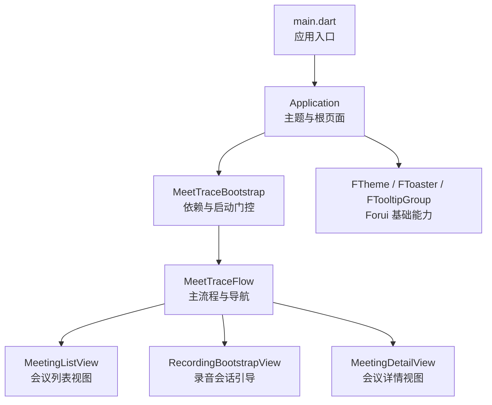
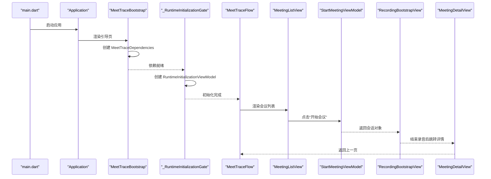
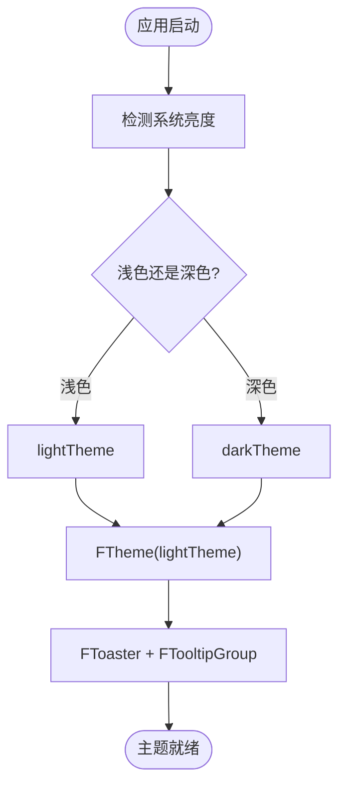
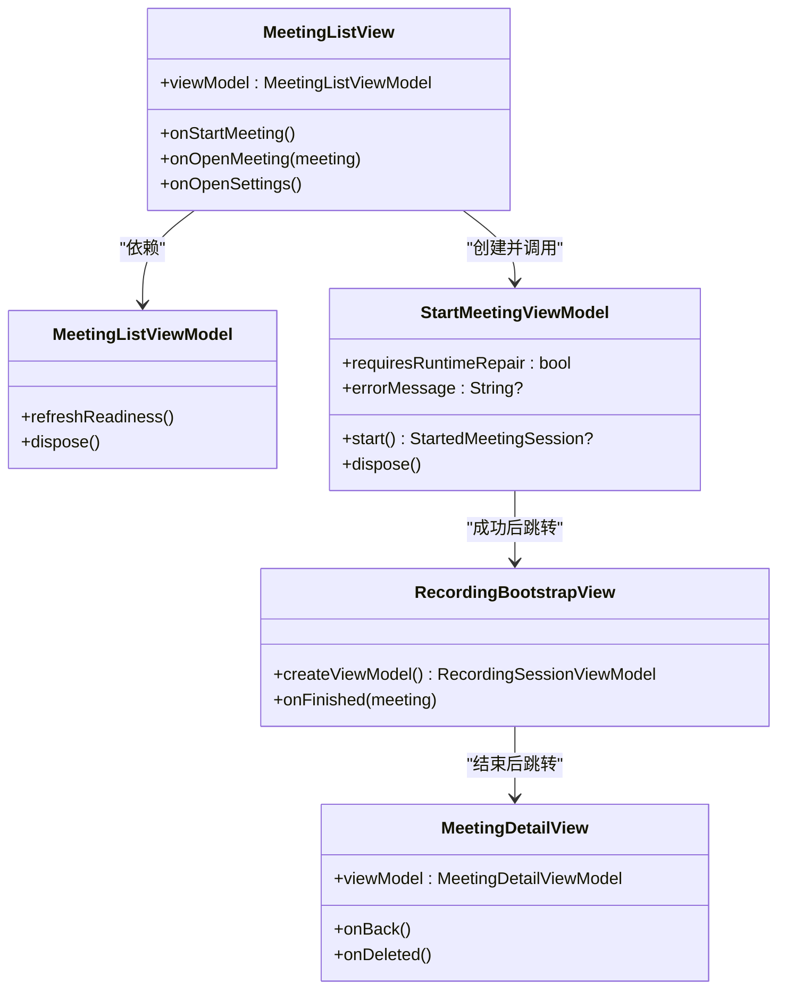
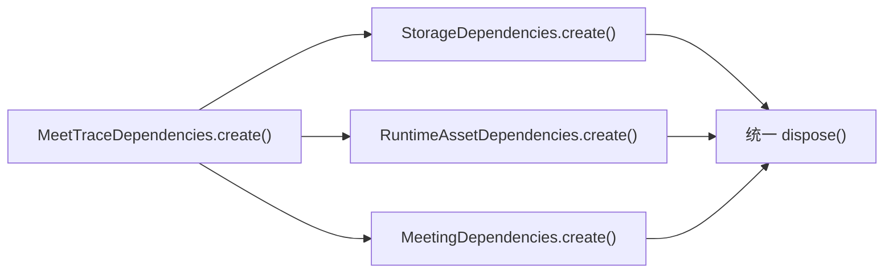

# 用户界面组件

<cite>
**本文引用的文件**   
- [pubspec.yaml](file://pubspec.yaml)
- [forui.yaml](file://forui.yaml)
- [DESIGN.md](file://DESIGN.md)
- [PRODUCT.md](file://PRODUCT.md)
- [main.dart](file://lib/main.dart)
- [application.dart](file://lib/app/application.dart)
- [meettrace_flow.dart](file://lib/app/meettrace_flow.dart)
- [meettrace_dependencies.dart](file://lib/app/meettrace_dependencies.dart)
</cite>

## 目录
1. [简介](#简介)
2. [项目结构](#项目结构)
3. [核心组件](#核心组件)
4. [架构总览](#架构总览)
5. [详细组件分析](#详细组件分析)
6. [依赖关系分析](#依赖关系分析)
7. [性能考虑](#性能考虑)
8. [故障排查指南](#故障排查指南)
9. [结论](#结论)
10. [附录](#附录)

## 简介
本文件面向会迹（MeetTrace）项目的用户界面层，系统性阐述基于 Forui 的 UI 架构与实现要点，包括主题系统、响应式布局、平台适配策略；覆盖主要视图（会议列表、录音会话、会议详情等）的实现与使用方式；解释 ViewModel 与 View 的绑定机制、状态管理与数据更新流程；给出自定义组件开发规范（样式定制、动画效果、无障碍支持）；并提供组件使用示例与最佳实践（布局优化、性能考量、跨平台兼容性），以及 UI 测试策略与调试技巧。

## 项目结构
- 应用入口与外壳
  - main.dart：初始化 Flutter 绑定、启用边缘到边显示、初始化端侧 ASR 运行时，并启动 Application。
  - application.dart：定义 Application 根 Widget，注入 Forui FTheme/FToaster/FTTooltipGroup，提供浅色/深色主题切换，默认首页为 MeetingListView。
- 启动与路由编排
  - meettrace_flow.dart：负责依赖装配、运行时初始化门控、主流程 MeetTraceFlow，组织会议列表、录音会话与会议详情的导航与生命周期管理。
- 依赖装配
  - meettrace_dependencies.dart：集中创建 Storage/Runtime/Meeting 三层依赖，统一生命周期与错误处理。
- 设计系统与配置
  - forui.yaml：Forui CLI 输出路径（代码片段、样式、主题、字体）。
  - DESIGN.md：视觉与交互设计系统（色彩、排版、间距、形状、组件规范、响应式规则、可访问性要求）。
  - PRODUCT.md：产品上下文与原则，明确 UI 行为边界与平台差异约束。
- 依赖声明
  - pubspec.yaml：声明 forui 与 forui_cli 依赖，确保生成管线可用。

图表来源
- [main.dart:1-13](file://lib/main.dart#L1-L13)
- [application.dart:1-37](file://lib/app/application.dart#L1-L37)
- [meettrace_flow.dart:1-265](file://lib/app/meettrace_flow.dart#L1-L265)

章节来源
- [main.dart:1-13](file://lib/main.dart#L1-L13)
- [application.dart:1-37](file://lib/app/application.dart#L1-L37)
- [meettrace_flow.dart:1-265](file://lib/app/meettrace_flow.dart#L1-L265)
- [forui.yaml:1-13](file://forui.yaml#L1-L13)
- [DESIGN.md:1-337](file://DESIGN.md#L1-L337)
- [PRODUCT.md:1-128](file://PRODUCT.md#L1-L128)
- [pubspec.yaml:1-112](file://pubspec.yaml#L1-L112)

## 核心组件
- 主题系统
  - 通过 Forui 的 FTheme 提供 lightTheme/darkTheme 双主题，Material 主题由 toApproximateMaterialTheme 近似映射，保证平台原生体验。
  - 设计令牌来源于 DESIGN.md，涵盖颜色、排版、圆角、间距、组件样式，统一在 theme/styles 与 theme/theme.dart 中生成与消费。
- 响应式设计
  - 遵循“内容驱动的断点”原则：小于 600px 单列直达任务；600–839px 增加留白与宽度；840px 起允许主从布局；1024px 强制检查点。
  - 触控目标满足 Android 48dp、iOS 44pt 的最小尺寸；两端保留系统返回、安全区、辅助技术语义。
- 平台适配
  - Android：保留预测返回、Material 导航语义与安全区。
  - iOS：保留边缘返回手势、Dynamic Type、VoiceOver 与安全区。
  - 所有 UI 优先使用 Forui 原语，Material 仅用于外壳与平台集成缺口。

章节来源
- [application.dart:1-37](file://lib/app/application.dart#L1-L37)
- [DESIGN.md:1-337](file://DESIGN.md#L1-L337)
- [PRODUCT.md:1-128](file://PRODUCT.md#L1-L128)

## 架构总览
- 分层与职责
  - View：纯展示与用户交互，不直接访问存储或外部服务。
  - ViewModel：封装状态与业务调用，暴露给 View 订阅与触发。
  - Use Case/Port：领域用例与端口抽象，屏蔽底层实现细节。
  - Repository/Service：数据与平台能力接入。
- 启动与依赖装配
  - main.dart 初始化运行时后，Application 提供主题与根页面。
  - MeetTraceBootstrap 异步创建 MeetTraceDependencies，失败时回退至启动错误页，成功则进入运行时初始化门控。
  - _RuntimeInitializationGate 创建 RuntimeInitializationViewModel，完成后进入 MeetTraceFlow。
- 主流程与会话导航
  - MeetTraceFlow 持有 MeetingListViewModel，监听应用生命周期恢复刷新就绪状态。
  - 开始会议：创建 StartMeetingViewModel 执行 start()，成功后进入 RecordingBootstrapView，结束后回到 MeetingDetailView。
  - 打开会议：创建 MeetingDetailViewModel，路由进入详情页，完成时释放资源。
  - 设置页：创建 ModelSettingsViewModel 与 DataControlsViewModel，返回后刷新就绪状态。

图表来源
- [main.dart:1-13](file://lib/main.dart#L1-L13)
- [application.dart:1-37](file://lib/app/application.dart#L1-L37)
- [meettrace_flow.dart:1-265](file://lib/app/meettrace_flow.dart#L1-L265)

章节来源
- [meettrace_flow.dart:1-265](file://lib/app/meettrace_flow.dart#L1-L265)
- [meettrace_dependencies.dart:1-67](file://lib/app/meettrace_dependencies.dart#L1-L67)

## 详细组件分析

### 主题系统（Forui + 设计令牌）
- 主题注入
  - Application 根据当前亮度选择 lightTheme/darkTheme，包裹 FTheme，内部再提供 FToaster 与 FTooltipGroup。
- 令牌来源与生成
  - forui.yaml 指定样式与主题输出路径，CLI 将 DESIGN.md 中的令牌转换为 Dart 代码与样式文件。
- 使用建议
  - 组件样式一律通过 context.theme 与 AppStyle 获取令牌，避免硬编码颜色与尺寸。
  - 保持 Material 主题与 Forui 主题一致性，必要时以 toApproximateMaterialTheme 桥接。

图表来源
- [application.dart:1-37](file://lib/app/application.dart#L1-L37)
- [forui.yaml:1-13](file://forui.yaml#L1-L13)
- [DESIGN.md:1-337](file://DESIGN.md#L1-L337)

章节来源
- [application.dart:1-37](file://lib/app/application.dart#L1-L37)
- [forui.yaml:1-13](file://forui.yaml#L1-L13)
- [DESIGN.md:1-337](file://DESIGN.md#L1-L337)

### 会议列表视图（MeetingListView）
- 职责
  - 展示会议账本列表，支持左滑删除（低频破坏性操作）、点击行进入详情、底部主操作“开始会议”。
- 交互与状态
  - 删除需二次确认；录音中或后台处理的会议不提供删除手势。
  - 列表行包含时间列、事实轨、标题与时长、状态图标与文案；选中/录音行使用静默灰面。
- 响应式
  - 手机单列直达详情；平板主从布局，左侧索引右侧预览。

章节来源
- [DESIGN.md:1-337](file://DESIGN.md#L1-L337)
- [meettrace_flow.dart:1-265](file://lib/app/meettrace_flow.dart#L1-L265)

### 录音会话视图（RecordingBootstrapView）
- 职责
  - 承载录音仪器、实时转录区与底部操作栏；确保事实音频优先，派生能力不可阻塞录音。
- 关键元素
  - 大号计时器、真实麦克风输入波形（由已写入 PCM 音量驱动）、无内嵌卡片的事实摘要。
  - 底部操作栏固定“暂停/继续”和“结束会议”，宽屏不重复说明。
- 动画与反馈
  - 波形过渡 140ms 可中断；系统要求减弱动态时立即更新；禁止虚构动画与装饰。

章节来源
- [DESIGN.md:1-337](file://DESIGN.md#L1-L337)
- [meettrace_flow.dart:1-265](file://lib/app/meettrace_flow.dart#L1-L265)

### 会议详情视图（MeetingDetailView）
- 职责
  - 展示最终转录、总结、证据与录音处理状态；支持重新转录、修订、分享或删除。
- 导航与生命周期
  - 由 MeetTraceFlow 创建 MeetingDetailViewModel，路由进入；页面关闭时释放 ViewModel。

章节来源
- [meettrace_flow.dart:1-265](file://lib/app/meettrace_flow.dart#L1-L265)
- [DESIGN.md:1-337](file://DESIGN.md#L1-L337)

### ViewModel 与 View 绑定机制
- 绑定模式
  - View 接收 ViewModel 实例作为构造参数，订阅其状态流，触发回调方法。
  - ViewModel 封装 Use Case/Port 调用，暴露状态与事件，负责资源释放。
- 典型流程
  - 列表页持有 MeetingListViewModel，监听应用恢复刷新就绪状态。
  - 开始会议时创建 StartMeetingViewModel，成功后返回会话对象，进入录音页。
  - 详情页创建 MeetingDetailViewModel，关闭时释放。

图表来源
- [meettrace_flow.dart:1-265](file://lib/app/meettrace_flow.dart#L1-L265)

章节来源
- [meettrace_flow.dart:1-265](file://lib/app/meettrace_flow.dart#L1-L265)

### 自定义组件开发规范
- 样式定制
  - 使用 Forui 原语与 context.theme/AppStyle 令牌；遵循 DESIGN.md 的颜色、圆角、间距与组件规范。
- 动画效果
  - 动效克制且目的明确；必须响应“移除动画/减弱动态效果”；状态变化即时可见。
- 无障碍支持
  - 语义标签、可读名称、焦点环与键盘导航；Android 触控目标≥48dp，iOS≥44pt；保留系统返回与安全区。
- 命名与组织
  - 组件按功能域组织，复用共享令牌；避免硬编码与重复样式。

章节来源
- [DESIGN.md:1-337](file://DESIGN.md#L1-L337)
- [PRODUCT.md:1-128](file://PRODUCT.md#L1-L128)

### 组件使用示例与最佳实践
- 布局优化
  - 连续账本表面替代卡片网格；内容自然增高，不固定高度裁切文本；紧凑表单最大宽度 520px，长文本阅读区 760px。
- 性能考虑
  - 列表虚拟化与按需加载；波形更新节流与自适应增益；避免在高频回调中重建大部件。
- 跨平台兼容
  - 优先 Forui，Material 仅用于外壳；两端分别遵循原生导航、手势与辅助技术语义。

章节来源
- [DESIGN.md:1-337](file://DESIGN.md#L1-L337)
- [PRODUCT.md:1-128](file://PRODUCT.md#L1-L128)

## 依赖关系分析
- 依赖装配
  - MeetTraceDependencies.create() 依次创建 Storage、Runtime、Meeting 依赖，失败时统一清理并抛出异常。
- 生命周期管理
  - 各依赖提供 dispose()；引导页与流程页在合适时机释放，避免内存泄漏。
- 错误处理
  - 启动失败区分旧版安装与本地能力未就绪，提供重试与修复路径。

图表来源
- [meettrace_dependencies.dart:1-67](file://lib/app/meettrace_dependencies.dart#L1-L67)

章节来源
- [meettrace_dependencies.dart:1-67](file://lib/app/meettrace_dependencies.dart#L1-L67)

## 性能考虑
- 渲染优化
  - 使用 Value/Listenable 最小化 rebuild；列表项按需构建；波形更新采用短窗自适应与节流。
- I/O 与资源
  - 模型下载与校验异步进行，避免阻塞 UI；数据库与文件系统操作批量提交。
- 动画与可访问性
  - 尊重系统“减少动态效果”；关键状态在无动画模式下仍清晰可见。

[本节为通用指导，无需特定文件引用]

## 故障排查指南
- 启动失败
  - 若检测到旧版 Alpha 数据，提示先导出重要录音后再卸载或清除数据；否则提示检查设备空间。
- 运行时修复
  - 当 StartMeetingViewModel.requiresRuntimeRepair 为真，触发重启初始化流程。
- 日志与诊断
  - 结合 Forui 的 Toast 与 Tooltip 提供即时反馈；在设置页查看诊断信息。

章节来源
- [meettrace_flow.dart:1-265](file://lib/app/meettrace_flow.dart#L1-L265)
- [DESIGN.md:1-337](file://DESIGN.md#L1-L337)

## 结论
会迹的 UI 层以 Forui 为核心，结合 DESIGN.md 的设计令牌与 PRODUCT.md 的产品原则，构建了稳定、可靠、跨平台的会议记录界面。通过清晰的 View/ViewModel 分离、统一的依赖装配与生命周期管理，确保了事实音频优先与派生能力降级的边界。遵循响应式与无障碍规范，可在多设备与多主题下保持一致的用户体验。

[本节为总结，无需特定文件引用]

## 附录
- 依赖声明与生成管线
  - pubspec.yaml 声明 forui 与 forui_cli；forui.yaml 配置输出路径，确保主题与样式自动生成。
- 设计系统权威
  - DESIGN.md 维护色彩、排版、组件与响应式规则；PRODUCT.md 维护产品边界与平台差异。

章节来源
- [pubspec.yaml:1-112](file://pubspec.yaml#L1-L112)
- [forui.yaml:1-13](file://forui.yaml#L1-L13)
- [DESIGN.md:1-337](file://DESIGN.md#L1-L337)
- [PRODUCT.md:1-128](file://PRODUCT.md#L1-L128)