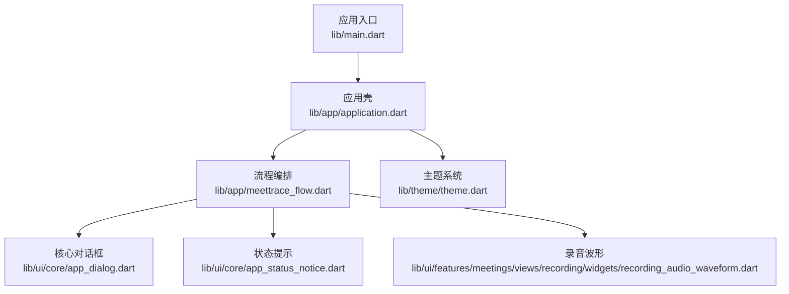
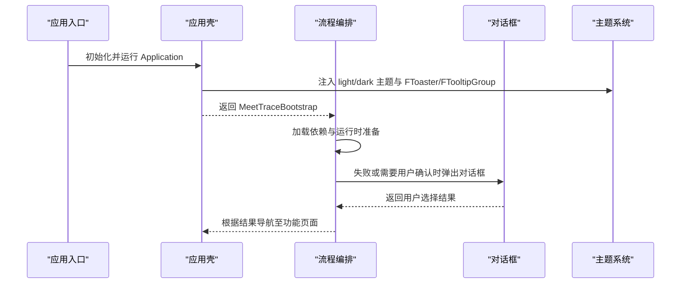
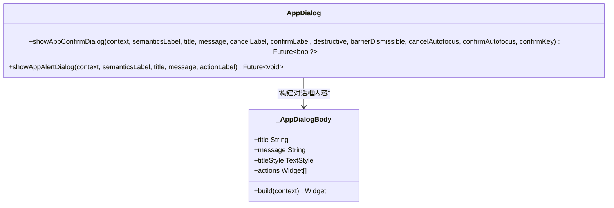
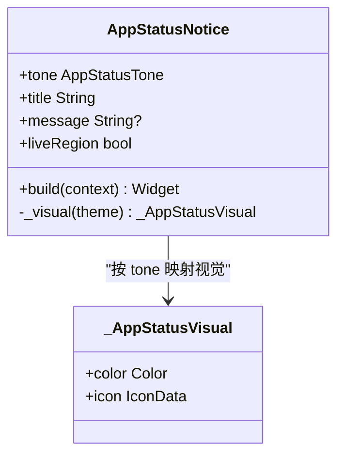
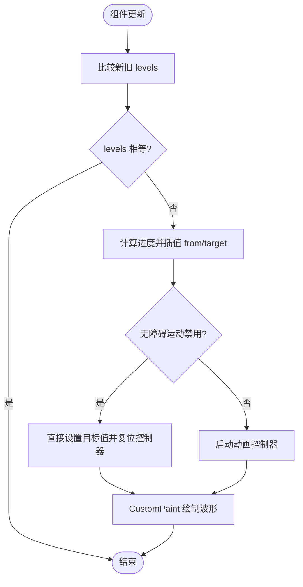
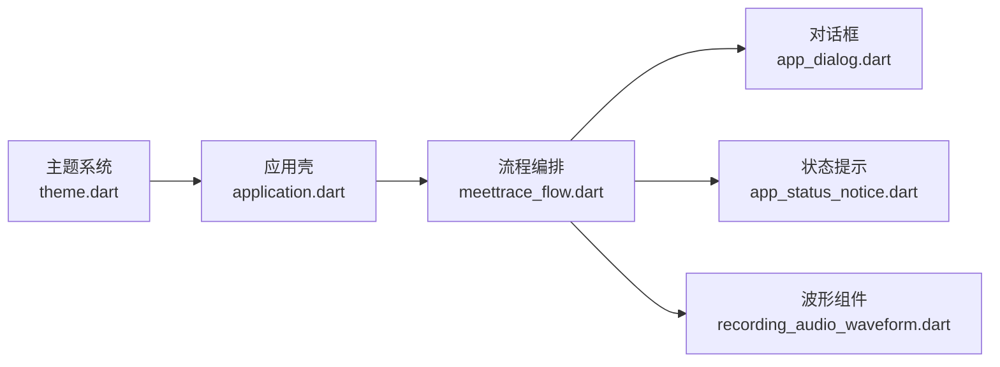

# 自定义组件开发

<cite>
**本文引用的文件**   
- [main.dart](file://lib/main.dart)
- [application.dart](file://lib/app/application.dart)
- [meettrace_flow.dart](file://lib/app/meettrace_flow.dart)
- [app_dialog.dart](file://lib/ui/core/app_dialog.dart)
- [app_status_notice.dart](file://lib/ui/core/app_status_notice.dart)
- [recording_audio_waveform.dart](file://lib/ui/features/meetings/views/recording/widgets/recording_audio_waveform.dart)
- [theme.dart](file://lib/theme/theme.dart)
- [pubspec.yaml](file://pubspec.yaml)
- [recording_audio_waveform_test.dart](file://test/ui/features/meetings/views/recording/widgets/recording_audio_waveform_test.dart)
- [app_status_notice_test.dart](file://test/ui/core/app_status_notice_test.dart)
</cite>

## 目录
1. [简介](#简介)
2. [项目结构](#项目结构)
3. [核心组件](#核心组件)
4. [架构总览](#架构总览)
5. [详细组件分析](#详细组件分析)
6. [依赖分析](#依赖分析)
7. [性能考虑](#性能考虑)
8. [故障排查指南](#故障排查指南)
9. [结论](#结论)
10. [附录](#附录)

## 简介
本文件面向“会迹（MeetTrace）”Flutter 项目的自定义组件开发与复用，聚焦以下目标：
- 统一设计原则与开发规范：语义化、可访问性、主题驱动、可测试。
- 重点组件实现说明：对话框组件、状态提示组件、音频波形组件。
- 属性定义、事件处理、样式定制方法。
- 组件复用与组合最佳实践。
- 组件测试策略与文档生成方法。
- 提供完整开发示例与代码模板路径。

## 项目结构
本项目采用分层组织：应用外壳、UI 核心组件、功能视图与主题系统。关键入口与 UI 根容器如下：
- 应用入口：初始化运行时并启动应用壳。
- 应用壳：装配主题、本地化、全局提示与工具提示。
- 流程编排：负责启动引导、运行时准备与会话路由。
- 核心 UI 组件：对话框、状态提示等通用能力。
- 功能组件：录音波形等特性相关组件。
- 主题系统：颜色、排版、样式令牌集中管理。

**图表来源** 
- [main.dart:7-12](file://lib/main.dart#L7-L12)
- [application.dart:18-35](file://lib/app/application.dart#L18-L35)
- [meettrace_flow.dart:148-156](file://lib/app/meettrace_flow.dart#L148-L156)
- [app_dialog.dart:6-52](file://lib/ui/core/app_dialog.dart#L6-L52)
- [app_status_notice.dart:17-30](file://lib/ui/core/app_status_notice.dart#L17-L30)
- [recording_audio_waveform.dart:14-26](file://lib/ui/features/meetings/views/recording/widgets/recording_audio_waveform.dart#L14-L26)
- [theme.dart:26-45](file://lib/theme/theme.dart#L26-L45)

**章节来源**
- [main.dart:7-12](file://lib/main.dart#L7-L12)
- [application.dart:18-35](file://lib/app/application.dart#L18-L35)
- [meettrace_flow.dart:148-156](file://lib/app/meettrace_flow.dart#L148-L156)
- [theme.dart:26-45](file://lib/theme/theme.dart#L26-L45)

## 核心组件
- 对话框组件：统一的确认/警告弹窗，支持语义标签、按钮变体、自动聚焦与可配置行为。
- 状态提示组件：以图标+文字+语义色表达信息、录制、警告、错误、成功等状态，支持可选消息与无障碍播报。
- 音频波形组件：基于 PCM 音量驱动的只读波形反馈，具备动画插值、无障碍语义与多状态文案。

这些组件遵循以下原则：
- 语义优先：所有交互元素提供清晰的语义标签与描述。
- 主题驱动：通过 forui 的 FThemeData 与 style 令牌控制外观。
- 可测试：为每个组件编写 Widget 测试，覆盖渲染、交互与边界条件。
- 低耦合：组件仅依赖主题与基础 Flutter API，避免业务逻辑侵入。

**章节来源**
- [app_dialog.dart:6-80](file://lib/ui/core/app_dialog.dart#L6-L80)
- [app_status_notice.dart:17-101](file://lib/ui/core/app_status_notice.dart#L17-L101)
- [recording_audio_waveform.dart:14-26](file://lib/ui/features/meetings/views/recording/widgets/recording_audio_waveform.dart#L14-L26)

## 架构总览
下图展示从应用入口到核心 UI 组件与主题系统的调用关系，以及对话框在流程中的使用位置。

**图表来源** 
- [main.dart:7-12](file://lib/main.dart#L7-L12)
- [application.dart:18-35](file://lib/app/application.dart#L18-L35)
- [meettrace_flow.dart:197-204](file://lib/app/meettrace_flow.dart#L197-L204)
- [app_dialog.dart:6-52](file://lib/ui/core/app_dialog.dart#L6-L52)
- [theme.dart:26-45](file://lib/theme/theme.dart#L26-L45)

## 详细组件分析

### 对话框组件（App Dialog）
- 职责：提供一致的确认/警告弹窗，封装标题、消息、动作按钮与语义标签。
- 属性：
  - semanticsLabel：无障碍标签
  - title/message：标题与正文
  - cancelLabel/confirmLabel：按钮文案
  - destructive：是否危险操作
  - barrierDismissible/cancelAutofocus/confirmAutofocus：交互行为
  - confirmKey：用于测试定位确认按钮
- 事件处理：
  - 取消按钮返回 false
  - 确认按钮返回 true
- 样式定制：
  - 通过 forui 的 FButton 变体与尺寸控制
  - 标题样式由 FDialog 的 style.titleTextStyle 传入
- 使用场景：
  - 启动失败提示
  - 删除/重置等危险操作确认

**图表来源** 
- [app_dialog.dart:6-52](file://lib/ui/core/app_dialog.dart#L6-L52)
- [app_dialog.dart:82-116](file://lib/ui/core/app_dialog.dart#L82-L116)

**章节来源**
- [app_dialog.dart:6-80](file://lib/ui/core/app_dialog.dart#L6-L80)
- [meettrace_flow.dart:197-204](file://lib/app/meettrace_flow.dart#L197-L204)

### 状态提示组件（Status Notice）
- 职责：以图标、文字与语义色表达持续状态，适合信息、录制、警告、错误、成功等场景。
- 属性：
  - tone：状态类型（info/recording/warning/error/success）
  - title：主标题（必须直接说明发生了什么）
  - message：可选补充说明
  - liveRegion：是否作为无障碍实时区域播报
- 样式定制：
  - 边框宽度在 error 时使用强边框，其他使用分隔线宽度
  - 左侧色条宽度与圆角由 appStyle.statusRailWidth 控制
  - 文本样式使用 theme.typography.display.sm 与 body.sm
- 无障碍：
  - Semantics container + label 组合，确保屏幕阅读器正确朗读
  - 可选 ExcludeSemantics 包裹内部细节，避免重复播报

**图表来源** 
- [app_status_notice.dart:17-101](file://lib/ui/core/app_status_notice.dart#L17-L101)
- [app_status_notice.dart:103-124](file://lib/ui/core/app_status_notice.dart#L103-L124)

**章节来源**
- [app_status_notice.dart:17-101](file://lib/ui/core/app_status_notice.dart#L17-L101)
- [app_status_notice_test.dart:1-45](file://test/ui/core/app_status_notice_test.dart#L1-L45)

### 音频波形组件（Recording Audio Waveform）
- 职责：基于真实麦克风 PCM 音量驱动的只读波形反馈，提供等待/实时/暂停/停止四种状态的语义与文案。
- 属性：
  - levels：音量样本列表（double）
  - state：当前状态枚举
- 动画与插值：
  - 使用 AnimationController 与 Curves.easeOutCubic 进行 140ms 过渡
  - 新样本从当前呈现值重新定向，提升变化辨识度
  - 未启用无障碍运动时禁用动画，直接赋值目标值
- 绘制：
  - CustomPaint 绘制波形线，active 状态增强对比
  - RepaintBoundary 隔离重绘区域，减少抖动
- 无障碍：
  - Semantics container + label 提供状态描述
  - 不同状态切换时更新 caption 与 label

**图表来源** 
- [recording_audio_waveform.dart:28-59](file://lib/ui/features/meetings/views/recording/widgets/recording_audio_waveform.dart#L28-L59)
- [recording_audio_waveform.dart:68-114](file://lib/ui/features/meetings/views/recording/widgets/recording_audio_waveform.dart#L68-L114)

**章节来源**
- [recording_audio_waveform.dart:14-26](file://lib/ui/features/meetings/views/recording/widgets/recording_audio_waveform.dart#L14-L26)
- [recording_audio_waveform_test.dart:1-39](file://test/ui/features/meetings/views/recording/widgets/recording_audio_waveform_test.dart#L1-L39)

## 依赖分析
- 主题系统：lightTheme/darkTheme 由 forui 生成，包含 colors、typography、icons、style。
- 应用壳：Application 将 FTheme、FToaster、FTooltipGroup 注入到 MaterialApp 中。
- 流程编排：MeetTraceFlow 负责 ViewModel 创建、路由与错误提示（使用对话框）。
- 组件依赖：
  - 对话框与状态提示依赖 forui 的 FDialog、FButton、FLucideIcons。
  - 波形组件依赖 Flutter 的 CustomPaint、AnimationController、RepaintBoundary。

**图表来源** 
- [theme.dart:26-45](file://lib/theme/theme.dart#L26-L45)
- [application.dart:18-35](file://lib/app/application.dart#L18-L35)
- [meettrace_flow.dart:148-156](file://lib/app/meettrace_flow.dart#L148-L156)
- [app_dialog.dart:6-52](file://lib/ui/core/app_dialog.dart#L6-L52)
- [app_status_notice.dart:17-30](file://lib/ui/core/app_status_notice.dart#L17-L30)
- [recording_audio_waveform.dart:14-26](file://lib/ui/features/meetings/views/recording/widgets/recording_audio_waveform.dart#L14-L26)

**章节来源**
- [pubspec.yaml:30-47](file://pubspec.yaml#L30-L47)
- [theme.dart:26-45](file://lib/theme/theme.dart#L26-L45)
- [application.dart:18-35](file://lib/app/application.dart#L18-L35)

## 性能考虑
- 波形组件：
  - 使用 RepaintBoundary 隔离重绘区域，降低整体树重建开销。
  - 140ms 动画过渡平衡流畅性与响应性；无障碍模式下禁用动画以提升性能。
  - 最近样本短窗自适应增益与噪声门，避免频繁大幅波动导致过度重绘。
- 主题与样式：
  - 通过 FThemeData 集中管理样式令牌，避免硬编码颜色与尺寸。
- 对话框：
  - 延迟显示仅在必要时触发，避免阻塞主线程。
- 测试：
  - 使用 flutter_test 的 pump/pumpAndSettle 精确控制帧与动画完成。

[本节为通用指导，不直接分析具体文件]

## 故障排查指南
- 对话框无法关闭或焦点异常：
  - 检查 confirmAutofocus/cancelAutofocus 设置是否正确。
  - 确认 Navigator.of(context).pop 返回值是否符合预期。
- 状态提示无播报：
  - 检查 liveRegion 是否为 true，以及 Semantics label 是否拼接了 title 与 message。
- 波形动画卡顿或不明显：
  - 确认 levels 数据源稳定且间隔合理。
  - 检查无障碍运动设置是否影响动画执行。
  - 查看 CustomPaint 绘制参数（线条宽度、对比度）是否合适。

**章节来源**
- [app_dialog.dart:6-52](file://lib/ui/core/app_dialog.dart#L6-L52)
- [app_status_notice.dart:40-44](file://lib/ui/core/app_status_notice.dart#L40-L44)
- [recording_audio_waveform.dart:28-59](file://lib/ui/features/meetings/views/recording/widgets/recording_audio_waveform.dart#L28-L59)

## 结论
本项目在自定义组件方面形成了清晰的设计与实现范式：
- 以主题系统为核心，统一外观与风格。
- 以语义化与无障碍为先，确保可访问性。
- 以 Widget 测试保障稳定性与回归质量。
- 通过对话框、状态提示、波形等核心组件，形成可复用的 UI 基座。

建议后续扩展：
- 新增组件遵循相同属性命名与语义约定。
- 保持主题令牌驱动，避免硬编码。
- 完善测试覆盖率，尤其是交互与动画路径。

[本节为总结，不直接分析具体文件]

## 附录

### 组件开发规范与最佳实践
- 属性定义：
  - 必填属性明确标注 required，可选属性提供默认值。
  - 语义化命名，如 semanticsLabel、title、message。
- 事件处理：
  - 回调函数命名清晰（onXxx），返回类型明确（Future<void>/bool）。
  - 异步操作使用 unawaited 或 whenComplete 管理生命周期。
- 样式定制：
  - 使用 theme.style.app.* 令牌，避免硬编码间距与尺寸。
  - 图标与颜色来自 FLucideIcons 与 theme.colors。
- 可访问性：
  - 为重要组件添加 Semantics container 与 label。
  - 动态内容使用 liveRegion 播报。
- 测试策略：
  - 使用 testWidgets 与 WidgetTester 构建与交互。
  - 对动画使用 pumpAndSettle，对静态渲染使用 pump。
  - 断言包括 find.byType、find.text、find.bySemanticsLabel。

**章节来源**
- [app_dialog.dart:6-52](file://lib/ui/core/app_dialog.dart#L6-L52)
- [app_status_notice.dart:17-30](file://lib/ui/core/app_status_notice.dart#L17-L30)
- [recording_audio_waveform_test.dart:1-39](file://test/ui/features/meetings/views/recording/widgets/recording_audio_waveform_test.dart#L1-L39)
- [app_status_notice_test.dart:1-45](file://test/ui/core/app_status_notice_test.dart#L1-L45)

### 组件测试策略
- 单元测试：
  - 验证组件渲染结果（类型、文本、图标）。
  - 验证交互后状态变化（按钮点击、状态切换）。
- 集成测试：
  - 模拟完整用户流程（启动、录音、波形反馈）。
- 覆盖率：
  - 关键分支与边界条件需覆盖（无障碍模式、深色主题、空数据）。

**章节来源**
- [recording_audio_waveform_test.dart:1-39](file://test/ui/features/meetings/views/recording/widgets/recording_audio_waveform_test.dart#L1-L39)
- [app_status_notice_test.dart:1-45](file://test/ui/core/app_status_notice_test.dart#L1-L45)

### 文档生成方法
- 使用 forui CLI 生成主题与样式：
  - dart forui theme create --preset aabbbc
  - dart run forui style create [styles]
- 在 README.md 或 docs/ 下维护组件使用示例与变更日志。
- 在 pubspec.yaml 中声明依赖与版本，便于团队同步。

**章节来源**
- [theme.dart:11-25](file://lib/theme/theme.dart#L11-L25)
- [pubspec.yaml:60-62](file://pubspec.yaml#L60-L62)

### 开发示例与代码模板路径
- 对话框使用示例：
  - 参考 showAppAlertDialog 与 showAppConfirmDialog 的调用方式。
- 状态提示使用示例：
  - 参考 AppStatusNotice 的属性与语义标签设置。
- 波形组件使用示例：
  - 参考 RecordingAudioWaveform 的 levels 与 state 传递。

**章节来源**
- [meettrace_flow.dart:197-204](file://lib/app/meettrace_flow.dart#L197-L204)
- [app_dialog.dart:54-80](file://lib/ui/core/app_dialog.dart#L54-L80)
- [app_status_notice.dart:17-30](file://lib/ui/core/app_status_notice.dart#L17-L30)
- [recording_audio_waveform.dart:14-26](file://lib/ui/features/meetings/views/recording/widgets/recording_audio_waveform.dart#L14-L26)