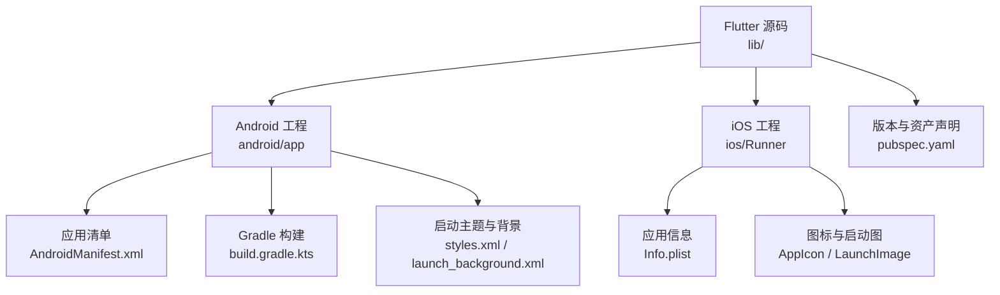
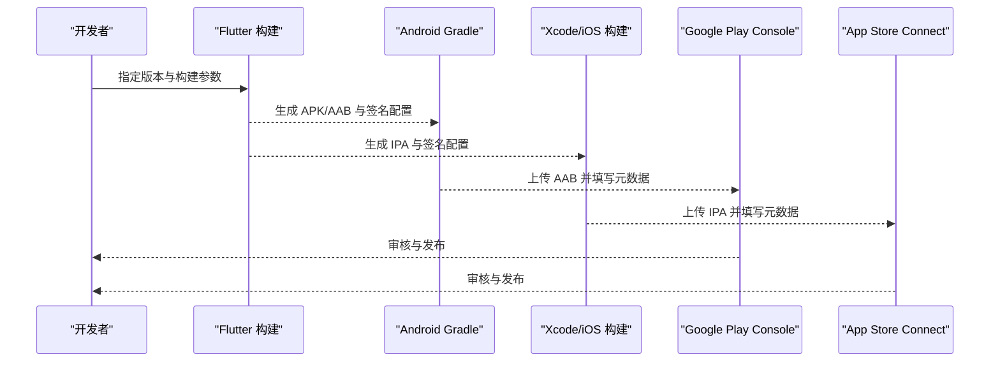
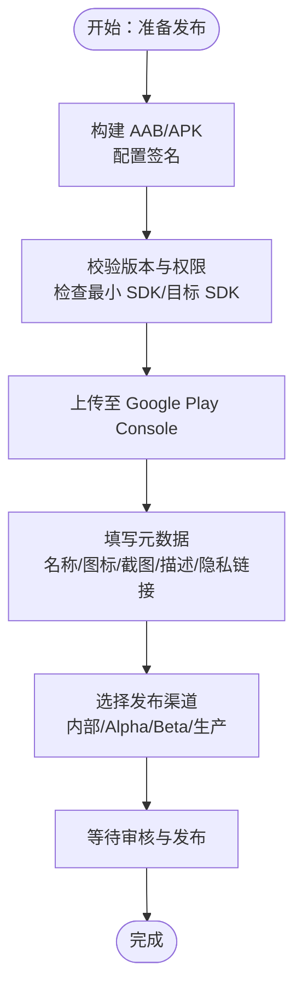
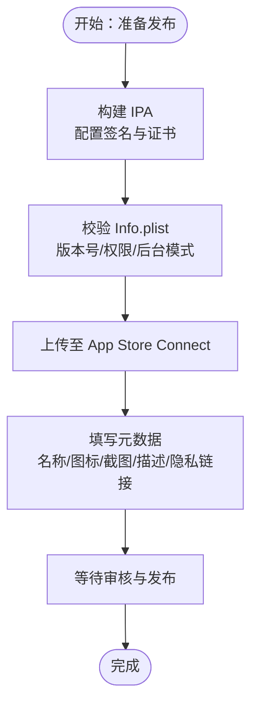
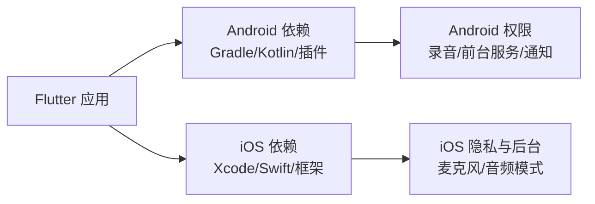

# 应用商店发布

<cite>
**本文引用的文件**   
- [pubspec.yaml](file://pubspec.yaml)
- [AndroidManifest.xml](file://android/app/src/main/AndroidManifest.xml)
- [build.gradle.kts（app）](file://android/app/build.gradle.kts)
- [styles.xml](file://android/app/src/main/res/values/styles.xml)
- [launch_background.xml](file://android/app/src/main/res/drawable/launch_background.xml)
- [Info.plist](file://ios/Runner/Info.plist)
- [Contents.json（AppIcon）](file://ios/Runner/Assets.xcassets/AppIcon.appiconset/Contents.json)
- [Contents.json（LaunchImage）](file://ios/Runner/Assets.xcassets/LaunchImage.imageset/Contents.json)
- [README.md](file://README.md)
- [PRODUCT.md](file://PRODUCT.md)
- [DESIGN.md](file://DESIGN.md)
</cite>

## 目录
1. [简介](#简介)
2. [项目结构](#项目结构)
3. [核心组件](#核心组件)
4. [架构总览](#架构总览)
5. [详细组件分析](#详细组件分析)
6. [依赖关系分析](#依赖关系分析)
7. [性能与审核要求](#性能与审核要求)
8. [发布后监控与维护](#发布后监控与维护)
9. [结论](#结论)
10. [附录：清单与元数据核对表](#附录清单与元数据核对表)

## 简介
本文件面向会迹（MeetTrace）的 Android 与 iOS 发布，覆盖 Google Play Store 与 App Store Connect 的完整发布流程、应用包准备、元数据配置、版本管理、渠道设置、隐私合规与安全审查、截图与多语言支持、以及发布后的监控与维护策略。文档基于仓库中的 Flutter 工程结构与平台配置文件进行说明，确保每一步均可落地执行。

## 项目结构
会迹为 Flutter 跨平台项目，Android 与 iOS 原生配置分别位于 android/ 与 ios/ 目录；应用名称、版本、构建脚本与资源声明集中在根级 pubspec.yaml 与各平台清单文件中。

图表来源
- [pubspec.yaml:1-112](file://pubspec.yaml#L1-L112)
- [AndroidManifest.xml:1-57](file://android/app/src/main/AndroidManifest.xml#L1-L57)
- [build.gradle.kts（app）:1-60](file://android/app/build.gradle.kts#L1-L60)
- [styles.xml:1-25](file://android/app/src/main/res/values/styles.xml#L1-L25)
- [launch_background.xml:1-13](file://android/app/src/main/res/drawable/launch_background.xml#L1-L13)
- [Info.plist:1-77](file://ios/Runner/Info.plist#L1-L77)
- [Contents.json（AppIcon）:1-123](file://ios/Runner/Assets.xcassets/AppIcon.appiconset/Contents.json#L1-L123)
- [Contents.json（LaunchImage）:1-23](file://ios/Runner/Assets.xcassets/LaunchImage.imageset/Contents.json#L1-L23)

章节来源
- [pubspec.yaml:1-112](file://pubspec.yaml#L1-L112)
- [README.md:1-11](file://README.md#L1-L11)

## 核心组件
- 版本与构建号：由 pubspec.yaml 统一维护，Android 与 iOS 通过 Gradle 与 Xcode 读取并映射到各自平台版本字段。
- 权限与功能特性：Android 在 AndroidManifest.xml 中声明；iOS 在 Info.plist 中声明麦克风使用描述与后台音频模式。
- 应用图标与启动画面：Android 使用 mipmap 与启动背景 XML；iOS 使用 AppIcon 与 LaunchImage 资源集。
- 应用名称与显示名：Android 通过 Manifest application 标签；iOS 通过 CFBundleDisplayName。

章节来源
- [pubspec.yaml:1-112](file://pubspec.yaml#L1-L112)
- [AndroidManifest.xml:1-57](file://android/app/src/main/AndroidManifest.xml#L1-L57)
- [Info.plist:1-77](file://ios/Runner/Info.plist#L1-L77)

## 架构总览
下图展示从代码到应用包的发布路径，包括 Flutter 层、Android Gradle 层、iOS Xcode 层与平台商店上传环节。

图表来源
- [build.gradle.kts（app）:1-60](file://android/app/build.gradle.kts#L1-L60)
- [Info.plist:1-77](file://ios/Runner/Info.plist#L1-L77)
- [pubspec.yaml:1-112](file://pubspec.yaml#L1-L112)

## 详细组件分析

### Android 发布流程（Google Play Store）
- 应用包准备
  - 使用 Gradle 构建 AAB（推荐）或 APK；当前 release 构建类型默认使用 debug 签名，需替换为正式签名配置。
  - 版本号映射：versionCode/versionName 由 Flutter 提供，对应 pubspec.yaml 的 version 与 build-number。
- 元数据配置
  - 应用名称、图标、启动主题在 Manifest 与样式中定义。
  - 权限声明包含网络、录音、前台服务、通知、唤醒锁等。
- 版本管理
  - 统一在 pubspec.yaml 维护语义化版本；Android 通过 Gradle 读取并转换为 versionCode/versionName。
- 发布渠道设置
  - 内部测试、Alpha、Beta、Production 渠道在 Google Play Console 中配置；AAB 上传后填写版本说明、分级、隐私政策链接等。

图表来源
- [build.gradle.kts（app）:17-48](file://android/app/build.gradle.kts#L17-L48)
- [AndroidManifest.xml:1-57](file://android/app/src/main/AndroidManifest.xml#L1-L57)
- [styles.xml:1-25](file://android/app/src/main/res/values/styles.xml#L1-L25)

章节来源
- [build.gradle.kts（app）:1-60](file://android/app/build.gradle.kts#L1-L60)
- [AndroidManifest.xml:1-57](file://android/app/src/main/AndroidManifest.xml#L1-L57)
- [styles.xml:1-25](file://android/app/src/main/res/values/styles.xml#L1-L25)

### iOS 发布流程（App Store Connect）
- 应用包准备
  - 使用 Xcode 或命令行构建 IPA；确保签名与 Provisioning Profile 正确。
- 应用信息配置
  - 应用名称、Bundle ID、版本号在 Info.plist 中定义；CFBundleShortVersionString 与 CFBundleVersion 分别对应显示版本与内部版本。
- 截图上传
  - 在 App Store Connect 中按设备尺寸上传截图；建议覆盖 iPhone 与 iPad 主流分辨率。
- 审核准备
  - 完善隐私描述、权限用途说明（如 NSMicrophoneUsageDescription）、后台音频模式（UIBackgroundModes）。
- 版本提交
  - 上传 IPA 后填写版本说明、分级、隐私政策链接，提交审核。

图表来源
- [Info.plist:1-77](file://ios/Runner/Info.plist#L1-L77)
- [Contents.json（AppIcon）:1-123](file://ios/Runner/Assets.xcassets/AppIcon.appiconset/Contents.json#L1-L123)
- [Contents.json（LaunchImage）:1-23](file://ios/Runner/Assets.xcassets/LaunchImage.imageset/Contents.json#L1-L23)

章节来源
- [Info.plist:1-77](file://ios/Runner/Info.plist#L1-L77)

### 应用清单配置（权限、功能特性、隐私政策）
- Android 权限与功能
  - 网络访问、录音、前台服务（含麦克风）、通知、唤醒锁等均在 AndroidManifest.xml 中声明。
  - 应用图标与名称通过 application 标签配置；Activity 与 Service 的导出与生命周期需符合平台规范。
- iOS 权限与功能
  - Info.plist 中声明麦克风用途描述与后台音频模式；界面方向与启动故事板也在此配置。
- 隐私政策链接
  - 在两个平台的商店后台填写隐私政策 URL；应用内需在设置或关于页面提供入口。

章节来源
- [AndroidManifest.xml:1-57](file://android/app/src/main/AndroidManifest.xml#L1-L57)
- [Info.plist:1-77](file://ios/Runner/Info.plist#L1-L77)

### 应用图标、启动画面、多语言支持
- 应用图标
  - Android：mipmap 各密度适配；iOS：AppIcon 资源集包含多种尺寸，确保 1024x1024 营销图。
- 启动画面
  - Android：styles.xml 定义启动主题与背景；launch_background.xml 可自定义启动图。
  - iOS：LaunchImage 资源集与 LaunchScreen.storyboard 配合使用。
- 多语言支持
  - Flutter 侧通过本地化资源与字符串文件实现；Android 与 iOS 分别通过系统本地化机制加载。
  - 建议在商店元数据中配置多语言标题与描述，提升不同地区用户可见性。

章节来源
- [styles.xml:1-25](file://android/app/src/main/res/values/styles.xml#L1-L25)
- [launch_background.xml:1-13](file://android/app/src/main/res/drawable/launch_background.xml#L1-L13)
- [Contents.json（AppIcon）:1-123](file://ios/Runner/Assets.xcassets/AppIcon.appiconset/Contents.json#L1-L123)
- [Contents.json（LaunchImage）:1-23](file://ios/Runner/Assets.xcassets/LaunchImage.imageset/Contents.json#L1-L23)

### 版本管理与构建参数
- 统一版本源：pubspec.yaml 维护 version（如 1.0.0+1），Android 与 iOS 通过工具链解析并映射到平台版本字段。
- Android 构建类型：release 构建需配置正式签名；debug 签名仅用于开发调试。
- iOS 构建：确保 Bundle Version 递增，短版本号与内部版本号一致于 Flutter 配置。

章节来源
- [pubspec.yaml:1-112](file://pubspec.yaml#L1-L112)
- [build.gradle.kts（app）:17-48](file://android/app/build.gradle.kts#L17-L48)

## 依赖关系分析
- Flutter 层依赖：音频录制、前台任务、存储、数据库、ASR 模型等；这些能力直接影响权限声明与后台行为。
- Android 层依赖：Gradle 插件、Kotlin 编译选项、Flutter Gradle 插件；构建产物受 Java/Kotlin 版本影响。
- iOS 层依赖：Xcode 工具链、Swift 运行时、系统框架（AVFoundation、AudioToolbox 等）；后台音频与麦克风权限需正确配置。

图表来源
- [pubspec.yaml:1-112](file://pubspec.yaml#L1-L112)
- [build.gradle.kts（app）:1-60](file://android/app/build.gradle.kts#L1-L60)
- [Info.plist:1-77](file://ios/Runner/Info.plist#L1-L77)

章节来源
- [pubspec.yaml:1-112](file://pubspec.yaml#L1-L112)
- [build.gradle.kts（app）:1-60](file://android/app/build.gradle.kts#L1-L60)
- [Info.plist:1-77](file://ios/Runner/Info.plist#L1-L77)

## 性能与审核要求
- 性能要求
  - 录音与 ASR 推理需独立运行，避免阻塞事实音频写入；弱网或断网不影响录音。
  - 首次初始化下载并校验模型资源，未就绪前阻断首页进入。
  - 控制内存占用与 CPU 峰值，确保长时间会议稳定运行。
- 安全审查
  - 不上传音频或会中转录至云端；AI 总结仅上传必要文本与最小元数据。
  - 权限最小化原则，仅声明必要权限并在应用内解释用途。
- 隐私合规
  - 明确隐私政策与数据收集范围；在应用内提供隐私说明与删除数据入口。
  - 遵循平台隐私指南（Android Data Safety、iOS App Privacy Labels）。

章节来源
- [PRODUCT.md:1-128](file://PRODUCT.md#L1-L128)
- [DESIGN.md:1-337](file://DESIGN.md#L1-L337)

## 发布后监控与维护
- 崩溃报告
  - 集成崩溃上报（如 Firebase Crashlytics、Sentry），捕获 ANR、崩溃堆栈与关键错误上下文。
- 用户反馈处理
  - 建立反馈渠道（应用内反馈、邮箱、商店评论回复），分类处理问题并快速迭代修复。
- 版本更新管理
  - 制定灰度发布策略（内部/Alpha/Beta），逐步放量观察指标；回滚预案与热修复策略。
- 监控指标
  - 安装量、活跃用户、崩溃率、ANR 率、录音成功率、转录延迟、存储空间占用等。

[本节为通用指导，不直接分析具体文件]

## 结论
会迹的发布流程以 Flutter 为中心，结合 Android 与 iOS 原生配置完成应用包构建与元数据配置。通过严格的权限声明、隐私合规与性能优化，确保应用在各平台顺利上架与稳定运行。发布后需持续监控与迭代，保障用户体验与数据安全。

[本节为总结性内容，不直接分析具体文件]

## 附录：清单与元数据核对表
- Android
  - 应用名称、图标、启动主题已配置
  - 权限声明完整且必要（录音、前台服务、通知、网络、唤醒锁）
  - 版本与构建号与 pubspec.yaml 一致
  - release 签名配置已替换 debug 签名
- iOS
  - Info.plist 中应用名称、Bundle ID、版本号正确
  - 麦克风用途描述与后台音频模式已配置
  - AppIcon 与 LaunchImage 资源齐全
  - 签名与 Provisioning Profile 有效
- 商店元数据
  - 标题、描述、关键词、分类、分级、隐私政策链接已填写
  - 截图覆盖主流设备尺寸与方向
  - 多语言标题与描述已配置

[本节为核对清单，不直接分析具体文件]