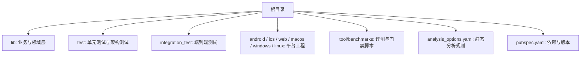
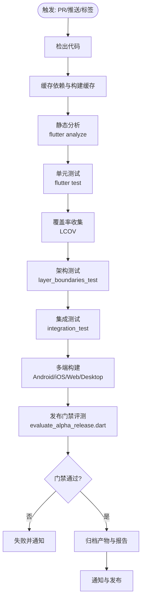
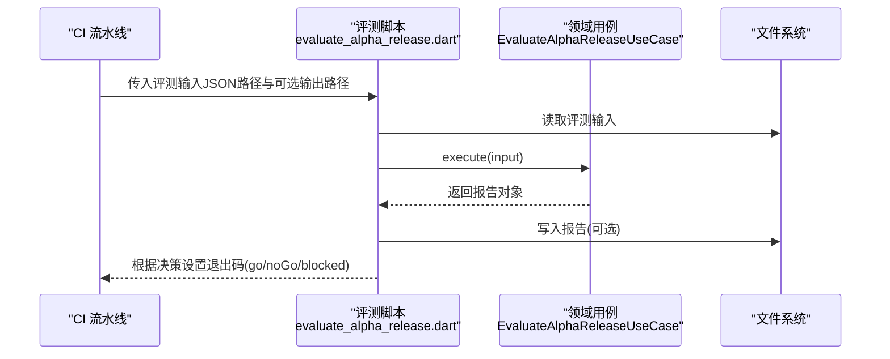
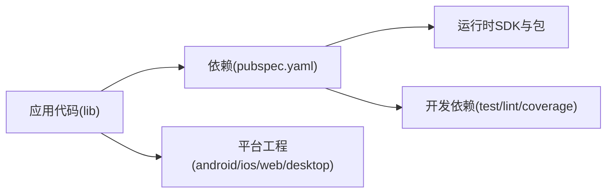

# 持续集成与交付

<cite>
**本文引用的文件**   
- [pubspec.yaml](file://pubspec.yaml)
- [analysis_options.yaml](file://analysis_options.yaml)
- [evaluate_alpha_release.dart](file://tool/benchmarks/evaluate_alpha_release.dart)
- [evaluate_alpha_release.dart](file://lib/domain/use_cases/evaluate_alpha_release.dart)
- [live_preview_replay_test.dart](file://integration_test/live_preview_replay_test.dart)
- [reliable_recording_test.dart](file://integration_test/reliable_recording_test.dart)
- [layer_boundaries_test.dart](file://test/architecture/layer_boundaries_test.dart)
- [application_test.dart](file://test/app/application_test.dart)
- [SKILL.md](file://.agents/skills/dart-add-unit-test/SKILL.md)
- [SKILL.md](file://.agents/skills/flutter-add-integration-test/SKILL.md)
- [SKILL.md](file://.agents/skills/dart-collect-coverage/SKILL.md)
</cite>

## 目录
1. [简介](#简介)
2. [项目结构](#项目结构)
3. [核心组件](#核心组件)
4. [架构总览](#架构总览)
5. [详细组件分析](#详细组件分析)
6. [依赖分析](#依赖分析)
7. [性能考虑](#性能考虑)
8. [故障排除指南](#故障排除指南)
9. [结论](#结论)
10. [附录](#附录)

## 简介
本文件为“会迹（MeetTrace）”项目的持续集成与交付（CI/CD）文档，面向开发与运维人员，提供从代码提交到构建产物归档、质量门禁与发布评估的完整流水线设计。内容覆盖：
- 触发策略与阶段划分
- 静态分析与代码规范检查
- 单元测试、集成测试与架构测试执行与报告
- 多平台构建（Android/iOS/Web/Desktop）与版本管理
- 覆盖率收集与基准评测门禁
- GitHub Actions 配置示例（环境变量、缓存、通知）
- 常见问题排查与最佳实践

## 项目结构
本项目为 Flutter 应用，包含 Android、iOS、Web、macOS、Windows、Linux 等多端目标。测试代码按功能分层组织在 test 与 integration_test 目录；质量与评测脚本位于 tool/benchmarks。

**章节来源**
- [pubspec.yaml](file://pubspec.yaml)
- [analysis_options.yaml](file://analysis_options.yaml)

## 核心组件
- 静态分析：通过 analysis_options.yaml 启用严格模式与 flutter_lints，CI 中执行 flutter analyze 并阻断不合规提交。
- 测试套件：
  - 单元测试：位于 test 目录，使用 flutter_test 与 package:test。
  - 集成测试：位于 integration_test 目录，使用 flutter integration_test。
  - 架构测试：test/architecture/layer_boundaries_test.dart 用于约束分层边界。
- 覆盖率：参考 dart-collect-coverage 技能，使用 coverage 工具生成 LCOV 报告。
- 发布门禁：tool/benchmarks/evaluate_alpha_release.dart 驱动领域用例 EvaluateAlphaReleaseUseCase，输出结构化报告并以退出码控制门禁。

**章节来源**
- [analysis_options.yaml](file://analysis_options.yaml)
- [SKILL.md](file://.agents/skills/dart-add-unit-test/SKILL.md)
- [SKILL.md](file://.agents/skills/flutter-add-integration-test/SKILL.md)
- [SKILL.md](file://.agents/skills/dart-collect-coverage/SKILL.md)
- [evaluate_alpha_release.dart](file://tool/benchmarks/evaluate_alpha_release.dart)
- [evaluate_alpha_release.dart](file://lib/domain/use_cases/evaluate_alpha_release.dart)

## 架构总览
下图展示 CI 流水线的阶段与关键工件流转，包括代码检查、测试、构建、评测与归档。

[本图为概念性流程图，未直接映射具体源码文件]

## 详细组件分析

### 静态分析与代码规范
- 规则来源：analysis_options.yaml 继承 flutter_lints，并开启严格类型推断与原始类型检查。
- CI 执行：运行 flutter analyze，将结果作为质量门禁；建议结合 PR 评论或注释标注问题。
- 建议：对新增模块强制 lint 规则，避免忽略规则扩散。

**章节来源**
- [analysis_options.yaml](file://analysis_options.yaml)

### 单元测试与集成测试
- 单元测试：遵循 .agents/skills/dart-add-unit-test 的技能说明，统一命名与目录结构，使用 expect 与异步支持。
- 集成测试：遵循 .agents/skills/flutter-add-integration-test 的技能说明，使用 integration_test 框架，确保 UI 交互路径稳定。
- 执行命令：
  - 单元测试：flutter test
  - 集成测试：flutter test integration_test
- 报告：可结合 junit 或 xunit 格式输出，便于 CI 聚合。

**章节来源**
- [SKILL.md](file://.agents/skills/dart-add-unit-test/SKILL.md)
- [SKILL.md](file://.agents/skills/flutter-add-integration-test/SKILL.md)
- [application_test.dart](file://test/app/application_test.dart)
- [layer_boundaries_test.dart](file://test/architecture/layer_boundaries_test.dart)
- [live_preview_replay_test.dart](file://integration_test/live_preview_replay_test.dart)
- [reliable_recording_test.dart](file://integration_test/reliable_recording_test.dart)

### 覆盖率收集与质量门禁
- 覆盖率：参考 .agents/skills/dart-collect-coverage 技能，使用 coverage 工具生成 coverage.json 与 lcov.info。
- 门禁阈值：建议在 CI 中设置最小覆盖率阈值（如行覆盖率≥80%），未达标则失败。
- 报告归档：将 LCOV 与 JSON 报告上传至 CI 工件，供后续查看与趋势分析。

**章节来源**
- [SKILL.md](file://.agents/skills/dart-collect-coverage/SKILL.md)

### 发布门禁评测流程
- 入口脚本：tool/benchmarks/evaluate_alpha_release.dart 读取评测输入 JSON，调用领域用例 EvaluateAlphaReleaseUseCase 生成报告，并以退出码控制门禁。
- 决策语义：go/noGo/blocked 三种状态，分别对应成功、拒绝与阻塞。
- 数据模型：领域用例内部实现门限判断、百分位计算等逻辑，保证评测一致性。

**图示来源**
- [evaluate_alpha_release.dart](file://tool/benchmarks/evaluate_alpha_release.dart)
- [evaluate_alpha_release.dart](file://lib/domain/use_cases/evaluate_alpha_release.dart)

**章节来源**
- [evaluate_alpha_release.dart](file://tool/benchmarks/evaluate_alpha_release.dart)
- [evaluate_alpha_release.dart](file://lib/domain/use_cases/evaluate_alpha_release.dart)

### 多平台构建与版本管理
- 版本定义：pubspec.yaml 中的 version 字段同时影响 Android 与 iOS 的版本号映射。
- 构建目标：
  - Android: flutter build apk / appbundle
  - iOS: flutter build ipa
  - Web: flutter build web
  - Desktop: flutter build windows/macos/linux
- 版本参数：可通过 --build-name 与 --build-number 覆盖版本号与构建号，便于与 Git 标签或 CI 构建号关联。
- 产物归档：将 APK/IPA/Web 包与构建日志、测试结果、覆盖率报告一并归档。

**章节来源**
- [pubspec.yaml](file://pubspec.yaml)

### 架构测试
- 目的：确保 lib 的分层边界不被破坏，防止跨层耦合。
- 执行：flutter test test/architecture/layer_boundaries_test.dart
- 建议：在 PR 合并前必须通过，失败需修复架构违规。

**章节来源**
- [layer_boundaries_test.dart](file://test/architecture/layer_boundaries_test.dart)

## 依赖分析
- 运行时依赖：Flutter SDK、音频录制、本地存储、ASR 推理库等。
- 开发依赖：测试框架、lint 工具、覆盖率工具、forui_cli。
- 平台相关：Android Gradle、iOS Xcode、Desktop CMake。

**章节来源**
- [pubspec.yaml](file://pubspec.yaml)

## 性能考虑
- 基准测试：使用 tool/benchmarks 下的脚本进行 Alpha 发布前的性能与稳定性评估，结合领域用例输出报告。
- 内存分析：建议在 CI 中针对关键场景采集内存快照，关注峰值与泄漏。
- 构建优化：启用缓存（依赖、Gradle、Xcode、CMake）、并行构建与增量编译，缩短流水线时间。
- 覆盖率与性能平衡：优先保障关键路径覆盖率，避免过度追求覆盖率导致构建缓慢。

[本节为通用指导，不直接分析具体文件]

## 故障排除指南
- 静态分析失败：检查 analysis_options.yaml 是否启用了严格规则，定位 lint 错误并修复。
- 单元测试失败：确认测试环境与依赖安装正确，必要时清理缓存后重试。
- 集成测试不稳定：检查 UI 元素 Key 与动画等待，避免超时；必要时增加滚动可见等待。
- 覆盖率缺失：确保被测代码被测试导入并执行，或使用忽略标记排除无关文件。
- 发布门禁失败：检查评测输入 JSON 结构与字段完整性，核对阈值与百分位计算。

**章节来源**
- [analysis_options.yaml](file://analysis_options.yaml)
- [SKILL.md](file://.agents/skills/dart-collect-coverage/SKILL.md)
- [SKILL.md](file://.agents/skills/flutter-add-integration-test/SKILL.md)
- [evaluate_alpha_release.dart](file://tool/benchmarks/evaluate_alpha_release.dart)

## 结论
本 CI/CD 方案以 Flutter 生态为基础，结合严格的静态分析、全面的测试体系与发布门禁评测，形成从代码提交到多端构建与归档的闭环。通过缓存与并行化优化构建效率，借助覆盖率与基准评测保障质量与性能。建议逐步完善通知机制与制品分发，提升团队协作与发布效率。

[本节为总结性内容，不直接分析具体文件]

## 附录

### GitHub Actions 配置示例（要点）
- 触发条件：PR、推送主分支、打标签时触发不同阶段。
- 环境变量：
  - FLUTTER_VERSION、ANDROID_SDK_VERSION、IOS_DEPLOYMENT_TARGET、CACHE_KEY 等。
- 缓存策略：
  - Dart pub 缓存、Gradle 缓存、Xcode DerivedData、CMake 缓存。
- 阶段建议：
  - 分析：flutter analyze
  - 测试：flutter test + flutter test integration_test
  - 覆盖率：coverage 工具生成 LCOV
  - 构建：flutter build 各平台
  - 评测：dart run tool/benchmarks/evaluate_alpha_release.dart
  - 归档：上传产物与报告
- 通知：
  - 失败时发送 Slack/邮件/钉钉通知，附带构建链接与报告摘要。

[本节为通用配置建议，不直接分析具体文件]